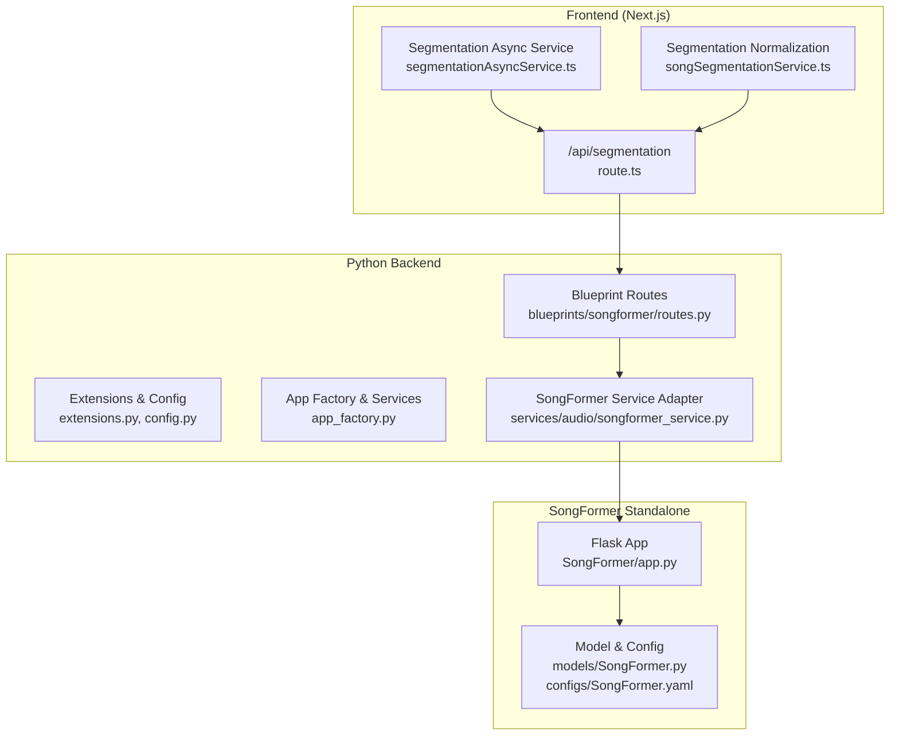
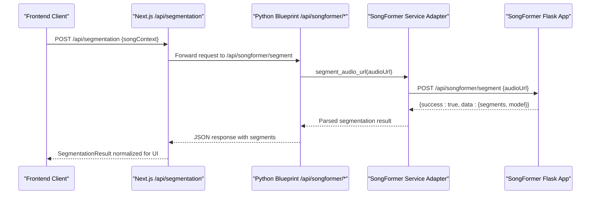
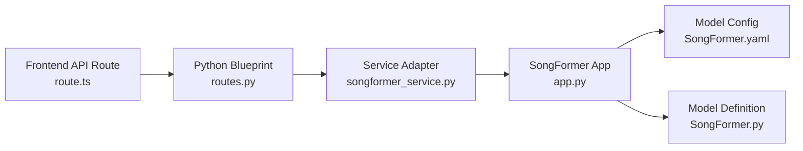

# SongFormer Blueprint

<cite>
**Referenced Files in This Document**
- [routes.py](file://python_backend/blueprints/songformer/routes.py)
- [songformer_service.py](file://python_backend/services/audio/songformer_service.py)
- [app.py](file://SongFormer/app.py)
- [README.md](file://SongFormer/README.md)
- [SongFormer.py](file://SongFormer/src/SongFormer/models/SongFormer.py)
- [SongFormer.yaml](file://SongFormer/src/SongFormer/configs/SongFormer.yaml)
- [extensions.py](file://python_backend/extensions.py)
- [app_factory.py](file://python_backend/app_factory.py)
- [config.py](file://python_backend/config.py)
- [route.ts](file://src/app/api/segmentation/route.ts)
- [segmentationAsyncService.ts](file://src/services/api/segmentationAsyncService.ts)
- [songSegmentationService.ts](file://src/services/lyrics/songSegmentationService.ts)
</cite>

## Table of Contents
1. [Introduction](#introduction)
2. [Project Structure](#project-structure)
3. [Core Components](#core-components)
4. [Architecture Overview](#architecture-overview)
5. [Detailed Component Analysis](#detailed-component-analysis)
6. [Dependency Analysis](#dependency-analysis)
7. [Performance Considerations](#performance-considerations)
8. [Troubleshooting Guide](#troubleshooting-guide)
9. [Conclusion](#conclusion)
10. [Appendices](#appendices)

## Introduction
This document describes the SongFormer blueprint service that powers song structure segmentation and structural analysis. It covers the SongFormer API endpoints, request/response patterns, model integration, segmentation capabilities, and integration with the standalone SongFormer service and the broader ChordMini application. It also documents model-specific parameters, environment variables, and operational expectations.

## Project Structure
The SongFormer blueprint spans two primary areas:
- Standalone SongFormer backend service (Flask app) that performs structural segmentation.
- Python backend blueprint that exposes a controlled endpoint and integrates with the standalone service.
- Frontend integration via Next.js API routes and asynchronous job orchestration.

**Diagram sources**
- [route.ts:1-174](file://src/app/api/segmentation/route.ts#L1-L174)
- [segmentationAsyncService.ts:1-261](file://src/services/api/segmentationAsyncService.ts#L1-L261)
- [songSegmentationService.ts:1-181](file://src/services/lyrics/songSegmentationService.ts#L1-L181)
- [routes.py:1-53](file://python_backend/blueprints/songformer/routes.py#L1-L53)
- [extensions.py:1-93](file://python_backend/extensions.py#L1-L93)
- [config.py:1-215](file://python_backend/config.py#L1-L215)
- [app_factory.py:103-162](file://python_backend/app_factory.py#L103-L162)
- [songformer_service.py:1-140](file://python_backend/services/audio/songformer_service.py#L1-L140)
- [app.py:549-687](file://SongFormer/app.py#L549-L687)
- [SongFormer.py:247-523](file://SongFormer/src/SongFormer/models/SongFormer.py#L247-L523)
- [SongFormer.yaml:1-186](file://SongFormer/src/SongFormer/configs/SongFormer.yaml#L1-L186)

**Section sources**
- [routes.py:1-53](file://python_backend/blueprints/songformer/routes.py#L1-L53)
- [songformer_service.py:1-140](file://python_backend/services/audio/songformer_service.py#L1-L140)
- [app.py:549-687](file://SongFormer/app.py#L549-L687)
- [README.md:1-170](file://SongFormer/README.md#L1-L170)
- [SongFormer.py:247-523](file://SongFormer/src/SongFormer/models/SongFormer.py#L247-L523)
- [SongFormer.yaml:1-186](file://SongFormer/src/SongFormer/configs/SongFormer.yaml#L1-L186)
- [extensions.py:1-93](file://python_backend/extensions.py#L1-L93)
- [app_factory.py:103-162](file://python_backend/app_factory.py#L103-L162)
- [config.py:1-215](file://python_backend/config.py#L1-L215)
- [route.ts:1-174](file://src/app/api/segmentation/route.ts#L1-L174)
- [segmentationAsyncService.ts:1-261](file://src/services/api/segmentationAsyncService.ts#L1-L261)
- [songSegmentationService.ts:1-181](file://src/services/lyrics/songSegmentationService.ts#L1-L181)

## Core Components
- Python backend blueprint exposing a single endpoint for SongFormer segmentation.
- Service adapter that dynamically loads the standalone SongFormer runtime and initializes models.
- Standalone SongFormer Flask app that performs segmentation, caching, and async job callbacks.
- Frontend integration that validates inputs, calls the backend, and normalizes results.

Key responsibilities:
- Endpoint exposure: POST /api/songformer/segment and GET /api/songformer/info.
- Audio ingestion: Accepts http(s) URLs or /audio/... paths; downloads and processes audio.
- Model integration: Initializes MuQ, MusicFM, and SongFormer models; runs sequential inference pipeline.
- Response normalization: Converts raw MSA outputs into human-readable segments with labels and timing.

**Section sources**
- [routes.py:14-53](file://python_backend/blueprints/songformer/routes.py#L14-L53)
- [songformer_service.py:21-140](file://python_backend/services/audio/songformer_service.py#L21-L140)
- [app.py:242-304](file://SongFormer/app.py#L242-L304)
- [app.py:431-439](file://SongFormer/app.py#L431-L439)
- [route.ts:70-127](file://src/app/api/segmentation/route.ts#L70-L127)
- [songSegmentationService.ts:71-181](file://src/services/lyrics/songSegmentationService.ts#L71-L181)

## Architecture Overview
The SongFormer blueprint follows a layered architecture:
- Frontend Next.js API route validates inputs and delegates to the Python backend.
- Python backend blueprint enforces rate limits and forwards requests to the SongFormer service adapter.
- Service adapter locates and dynamically imports the standalone SongFormer runtime, initializes models, and executes segmentation.
- Standalone service handles audio downloads, inference, post-processing, and optional async job callbacks.

**Diagram sources**
- [route.ts:36-104](file://src/app/api/segmentation/route.ts#L36-L104)
- [routes.py:14-42](file://python_backend/blueprints/songformer/routes.py#L14-L42)
- [songformer_service.py:118-140](file://python_backend/services/audio/songformer_service.py#L118-L140)
- [app.py:597-646](file://SongFormer/app.py#L597-L646)

## Detailed Component Analysis

### Python Backend Blueprint: SongFormer Routes
- Endpoint: POST /api/songformer/segment
  - Validates presence of audioUrl.
  - Retrieves SongFormer service from app extensions.
  - Calls service.segment_audio_url(audio_url) and logs segment count.
  - Returns JSON with success flag and data.
- Endpoint: GET /api/songformer/info
  - Returns availability and description of the experimental route.

Operational notes:
- Uses rate limiting tailored for heavy processing.
- Logs errors and returns appropriate HTTP status codes.

**Section sources**
- [routes.py:14-53](file://python_backend/blueprints/songformer/routes.py#L14-L53)
- [extensions.py:17-93](file://python_backend/extensions.py#L17-L93)
- [config.py:47-60](file://python_backend/config.py#L47-L60)

### SongFormer Service Adapter
Responsibilities:
- Dynamically loads the standalone SongFormer runtime from a configurable root path.
- Initializes models (MuQ, MusicFM, SongFormer) on first use.
- Supports local audio paths (/audio/...) and remote URLs with automatic download.
- Executes segmentation and returns normalized segments with model/device info.

Key behaviors:
- Environment-driven configuration via SONGFORMER_ROOT, SONGFORMER_MODEL_NAME, SONGFORMER_CHECKPOINT, SONGFORMER_CONFIG.
- Thread-safe initialization and module loading.
- Temporary file handling for remote audio downloads.

**Section sources**
- [songformer_service.py:21-140](file://python_backend/services/audio/songformer_service.py#L21-L140)

### Standalone SongFormer Flask App
Endpoints:
- GET /api/songformer/health: Health and runtime info; optional warmup.
- GET /api/songformer/info: Metadata and accepted request formats.
- POST /api/songformer/segment: Segment audio from URL or uploaded file; optional async job callback.

Processing pipeline:
- Audio resolution: local path, /audio/..., or http(s) URL.
- Model initialization: MuQ, MusicFM, SongFormer with device selection.
- Sequential inference with 420s windows and optional 30s batching.
- Post-processing: rule-based cleaning and formatting into segments.
- Result caching: in-memory cache with TTL and capacity controls.

Model and configuration:
- Model class and head architectures defined in models/SongFormer.py.
- Configuration parameters in configs/SongFormer.yaml (frame rates, loss weights, training params).

Environment variables:
- Device selection, MPS fallback, result cache, 30s batching, timeouts, and audio directory.

**Section sources**
- [app.py:549-687](file://SongFormer/app.py#L549-L687)
- [app.py:332-381](file://SongFormer/app.py#L332-L381)
- [app.py:431-439](file://SongFormer/app.py#L431-L439)
- [app.py:480-510](file://SongFormer/app.py#L480-L510)
- [SongFormer.py:247-523](file://SongFormer/src/SongFormer/models/SongFormer.py#L247-L523)
- [SongFormer.yaml:1-186](file://SongFormer/src/SongFormer/configs/SongFormer.yaml#L1-L186)
- [README.md:43-82](file://SongFormer/README.md#L43-L82)

### Frontend Integration and Normalization
- Next.js route:
  - Validates songContext and requires beat data.
  - Ensures a remote audio URL accessible by the backend.
  - Calls Python backend endpoint and normalizes results.
- Async orchestration:
  - Creates segmentation jobs, polls status, and optionally runs a browser worker to call the standalone service directly.
- Normalization:
  - Converts raw segments to UI-ready segments with clamping, merging, and gap filling.
  - Derives display labels and structure summaries.

**Section sources**
- [route.ts:70-127](file://src/app/api/segmentation/route.ts#L70-L127)
- [segmentationAsyncService.ts:120-162](file://src/services/api/segmentationAsyncService.ts#L120-L162)
- [songSegmentationService.ts:71-181](file://src/services/lyrics/songSegmentationService.ts#L71-L181)

### Model Integration and Segmentation Capabilities
- Models:
  - MuQ: Contrastive audio representation extractor.
  - MusicFM: Music feature model providing hidden states.
  - SongFormer: Transformer-based model for structural segmentation with boundary and function heads.
- Inference:
  - Sequential inference over 420s windows with optional 30s chunk batching.
  - Rule-based post-processing to refine segment boundaries.
  - Formatting into labeled segments with start/end times.

**Section sources**
- [app.py:242-285](file://SongFormer/app.py#L242-L285)
- [app.py:332-381](file://SongFormer/app.py#L332-L381)
- [SongFormer.py:247-523](file://SongFormer/src/SongFormer/models/SongFormer.py#L247-L523)
- [SongFormer.yaml:33-78](file://SongFormer/src/SongFormer/configs/SongFormer.yaml#L33-L78)

### Request/Response Patterns
- POST /api/songformer/segment
  - Request: JSON with audioUrl (http(s) URL or /audio/... path).
  - Response: JSON with success flag and data containing segments array and model info.
- GET /api/songformer/info
  - Response: JSON with availability and description.

Frontend request/response:
- POST /api/segmentation
  - Request: JSON with songContext (requires beats and audioUrl).
  - Response: SegmentationResult with normalized segments and analysis metadata.

Async job flow:
- POST /api/segmentation/jobs creates a job and returns worker metadata.
- Browser worker calls standalone service endpoint with asyncJob payload.
- Callback updates job status and persists result.

**Section sources**
- [routes.py:14-53](file://python_backend/blueprints/songformer/routes.py#L14-L53)
- [app.py:581-595](file://SongFormer/app.py#L581-L595)
- [route.ts:36-104](file://src/app/api/segmentation/route.ts#L36-L104)
- [segmentationAsyncService.ts:120-162](file://src/services/api/segmentationAsyncService.ts#L120-L162)

### Examples of Segmentation Results, Timing, and Structural Annotations
- Segments: Array of objects with start, end, and label fields.
- Timing information: Logged by the standalone service including total time, audio load time, and per-stage timings (MuQ, MusicFM, MSA).
- Structural annotations: Labels derived from SongFormer’s functional structure labeling; normalized to UI-friendly types.

Note: The exact label taxonomy and timing breakdown are defined by the standalone service and configuration.

**Section sources**
- [app.py:412-420](file://SongFormer/app.py#L412-L420)
- [app.py:358-381](file://SongFormer/app.py#L358-L381)
- [songSegmentationService.ts:17-51](file://src/services/lyrics/songSegmentationService.ts#L17-L51)

### Integration with Standalone Service and Model Parameters
- Standalone service deployment:
  - Intended for local development or Cloud Run.
  - Environment variables control device selection, caching, batching, and timeouts.
- Model parameters:
  - Frame rates, loss weights, transformer configuration, and dataset specifics are defined in SongFormer.yaml.
  - Model class and heads are defined in SongFormer.py.

**Section sources**
- [README.md:43-82](file://SongFormer/README.md#L43-L82)
- [SongFormer.yaml:1-186](file://SongFormer/src/SongFormer/configs/SongFormer.yaml#L1-L186)
- [SongFormer.py:247-523](file://SongFormer/src/SongFormer/models/SongFormer.py#L247-L523)

## Dependency Analysis
High-level dependencies:
- Python backend blueprint depends on SongFormer service adapter.
- Service adapter depends on standalone SongFormer runtime and models.
- Frontend depends on Next.js API routes and async orchestration.
- Standalone service depends on model definitions and configuration.

**Diagram sources**
- [route.ts:1-174](file://src/app/api/segmentation/route.ts#L1-L174)
- [routes.py:1-53](file://python_backend/blueprints/songformer/routes.py#L1-L53)
- [songformer_service.py:1-140](file://python_backend/services/audio/songformer_service.py#L1-L140)
- [app.py:1-698](file://SongFormer/app.py#L1-L698)
- [SongFormer.yaml:1-186](file://SongFormer/src/SongFormer/configs/SongFormer.yaml#L1-L186)
- [SongFormer.py:1-523](file://SongFormer/src/SongFormer/models/SongFormer.py#L1-L523)

**Section sources**
- [app_factory.py:103-162](file://python_backend/app_factory.py#L103-L162)
- [extensions.py:1-93](file://python_backend/extensions.py#L1-L93)
- [config.py:1-215](file://python_backend/config.py#L1-L215)

## Performance Considerations
- Device selection: Defaults to CPU in production-like environments; local development may use CUDA or MPS with caveats.
- Cold start: Expect noticeable startup time due to model loading; consider warmup strategies.
- Batch processing: Optional 30s chunk batching can improve throughput for long tracks.
- Result caching: In-memory cache reduces repeated processing for identical audio sources.
- Timeouts: Tune SONGFORMER_BACKEND_TIMEOUT_MS and related environment variables to balance responsiveness and reliability.

[No sources needed since this section provides general guidance]

## Troubleshooting Guide
Common issues and resolutions:
- Missing SongFormer runtime: Ensure SONGFORMER_ROOT points to a valid SongFormer deployment path.
- Audio URL validation: audioUrl must be http(s) or a /audio/... path; otherwise returns 400.
- Model initialization failures: Verify checkpoint and config paths; confirm required assets are present.
- Remote download errors: Network issues or invalid URLs cause 502; async callback failures are reported back.
- Device availability: CUDA or MPS may not be available; fallback to CPU is automatic.

**Section sources**
- [songformer_service.py:39-43](file://python_backend/services/audio/songformer_service.py#L39-L43)
- [routes.py:20-29](file://python_backend/blueprints/songformer/routes.py#L20-L29)
- [app.py:608-624](file://SongFormer/app.py#L608-L624)
- [app.py:647-679](file://SongFormer/app.py#L647-L679)

## Conclusion
The SongFormer blueprint integrates a robust standalone segmentation service into the ChordMini application. It provides a controlled endpoint for structural analysis, dynamic model initialization, and flexible input handling. The frontend normalizes results into a UI-ready format, while the standalone service manages inference, caching, and async workflows. Proper environment configuration and awareness of performance characteristics are essential for reliable operation.

## Appendices

### API Definitions
- POST /api/songformer/segment
  - Request: JSON with audioUrl (string).
  - Response: JSON with success flag and data containing segments and model info.
- GET /api/songformer/info
  - Response: JSON with availability and description.

**Section sources**
- [routes.py:14-53](file://python_backend/blueprints/songformer/routes.py#L14-L53)
- [app.py:581-595](file://SongFormer/app.py#L581-L595)

### Environment Variables
- SONGFORMER_ROOT: Root path to SongFormer runtime.
- SONGFORMER_MODEL_NAME: Model name to initialize.
- SONGFORMER_CHECKPOINT: Model checkpoint file.
- SONGFORMER_CONFIG: Model configuration file.
- SONGFORMER_DEVICE: Force device selection (cpu, cuda, mps).
- SONGFORMER_ENABLE_EXPERIMENTAL_MPS: Enable experimental MPS.
- SONGFORMER_RESULT_CACHE_TTL_SECONDS: Cache TTL.
- SONGFORMER_RESULT_CACHE_MAX_ITEMS: Cache capacity.
- SONGFORMER_ENABLE_30S_BATCHING: Enable 30s chunk batching.
- SONGFORMER_30S_BATCH_SIZE: Batch size for 30s chunks.
- SONGFORMER_DOWNLOAD_TIMEOUT: Download timeout for remote audio.
- SONGFORMER_MAX_UPLOAD_BYTES: Max upload size for multipart uploads.

**Section sources**
- [app.py:54-64](file://SongFormer/app.py#L54-L64)
- [README.md:43-57](file://SongFormer/README.md#L43-L57)