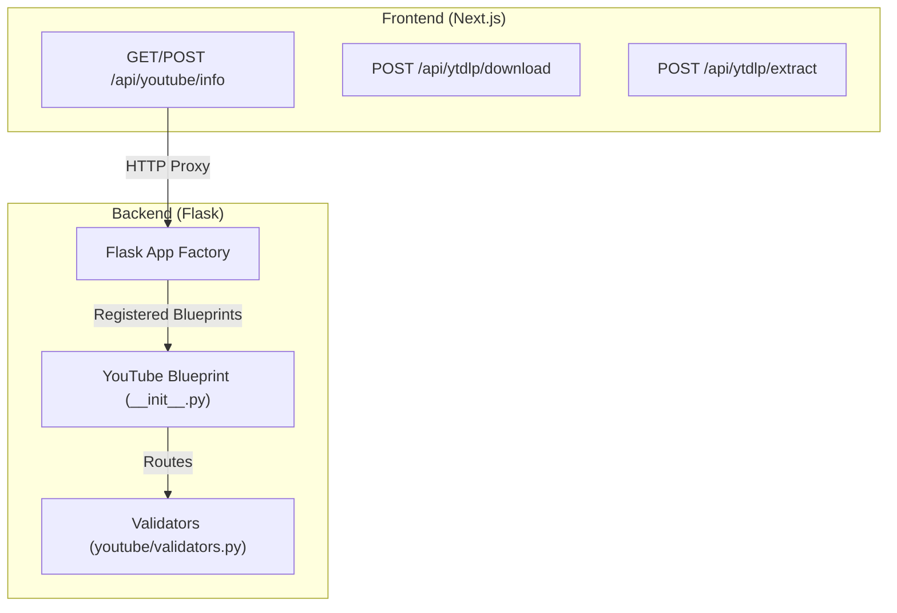
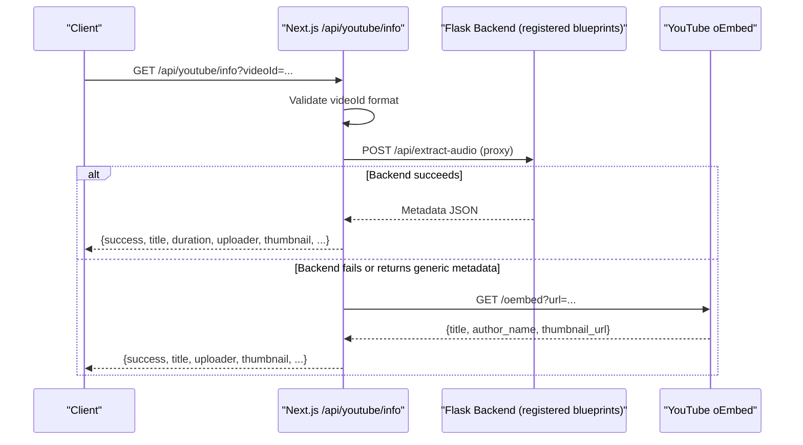
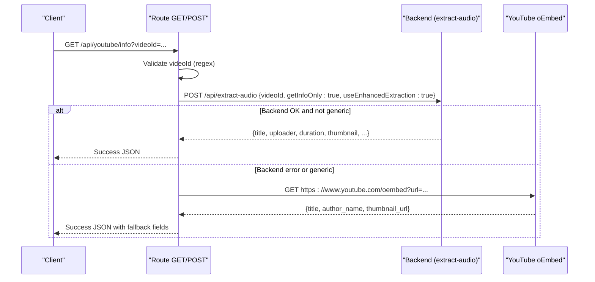
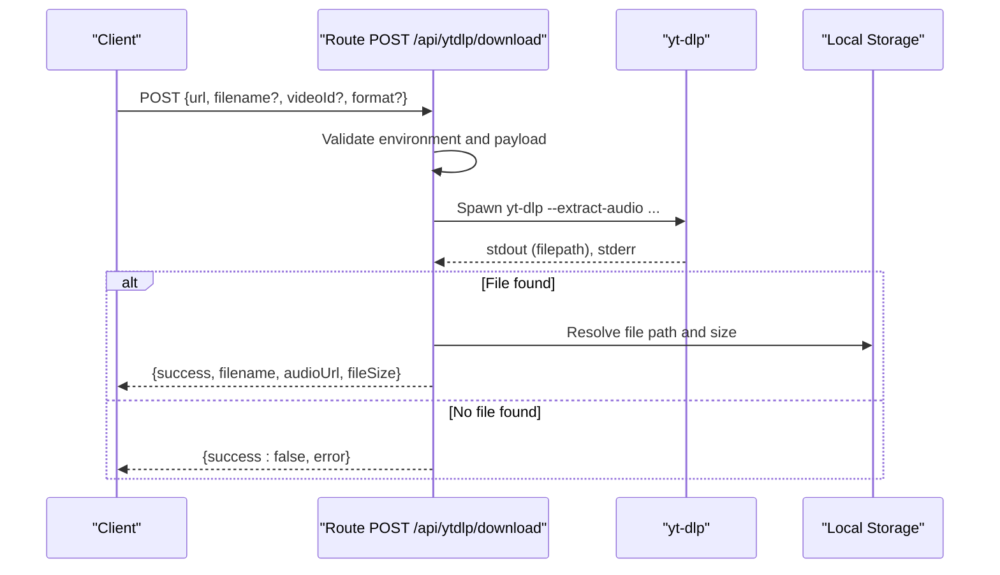
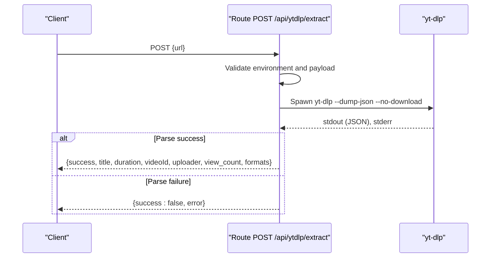
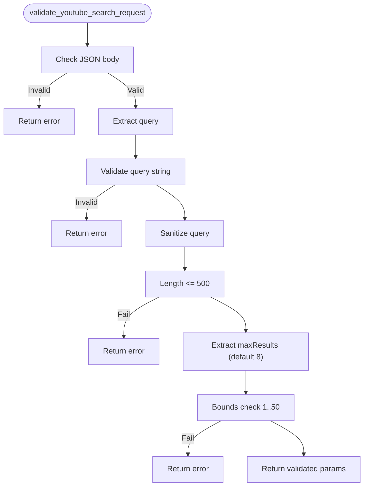
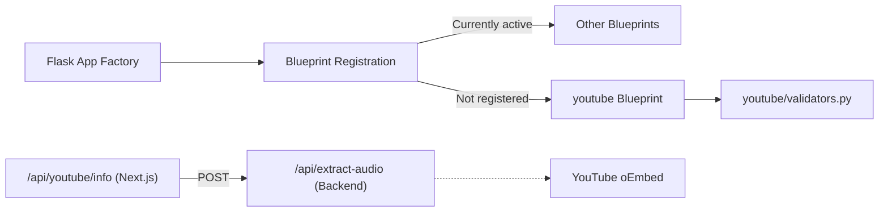

# YouTube Blueprint

<cite>
**Referenced Files in This Document**
- [app.py](file://python_backend/app.py)
- [youtube/__init__.py](file://python_backend/blueprints/youtube/__init__.py)
- [validators.py](file://python_backend/blueprints/youtube/validators.py)
- [route.ts (youtube/info)](file://src/app/api/youtube/info/route.ts)
- [route.ts (ytdlp/download)](file://src/app/api/ytdlp/download/route.ts)
- [route.ts (ytdlp/extract)](file://src/app/api/ytdlp/extract/route.ts)
</cite>

## Table of Contents
1. [Introduction](#introduction)
2. [Project Structure](#project-structure)
3. [Core Components](#core-components)
4. [Architecture Overview](#architecture-overview)
5. [Detailed Component Analysis](#detailed-component-analysis)
6. [Dependency Analysis](#dependency-analysis)
7. [Performance Considerations](#performance-considerations)
8. [Troubleshooting Guide](#troubleshooting-guide)
9. [Conclusion](#conclusion)

## Introduction
This document describes the YouTube integration within the ChordMini application. It focuses on:
- The YouTube search blueprint and its validation utilities
- The YouTube video info proxy route and its fallback strategies
- The yt-dlp development endpoints for audio download and video info extraction
- Request validation patterns for YouTube URLs, video quality preferences, and extraction parameters
- Error handling for invalid URLs, unavailable videos, and extraction failures

It also clarifies the current state of the backend YouTube blueprint registration and highlights the primary integration points in the frontend Next.js API routes.

## Project Structure
The YouTube integration spans both the backend Flask application and the frontend Next.js API routes:
- Backend: The YouTube blueprint module exists under python_backend/blueprints/youtube, including a validator module. However, the blueprint is not currently registered in the Flask app factory, meaning its routes are not active in the backend.
- Frontend: Next.js API routes under src/app/api/youtube and src/app/api/ytdlp implement YouTube video info retrieval and yt-dlp-based development features.

**Diagram sources**
- [app.py:86-87](file://python_backend/app.py#L86-L87)
- [youtube/__init__.py:1-10](file://python_backend/blueprints/youtube/__init__.py#L1-L10)
- [validators.py:1-171](file://python_backend/blueprints/youtube/validators.py#L1-L171)

**Section sources**
- [app.py:86-87](file://python_backend/app.py#L86-L87)
- [youtube/__init__.py:1-10](file://python_backend/blueprints/youtube/__init__.py#L1-L10)

## Core Components
- YouTube search blueprint: Provides YouTube search endpoints using Piped API with fallback strategies. The blueprint module exists but is not registered in the Flask app factory.
- YouTube info proxy: A Next.js route that validates inputs, attempts extraction via the backend, and falls back to YouTube’s oEmbed API if needed.
- yt-dlp development endpoints: Next.js routes that wrap yt-dlp for audio download and video info extraction during development.

Key validation utilities:
- validate_youtube_search_request(): Validates JSON payload, sanitizes query, enforces maxResults bounds, and returns validated parameters.
- validate_search_query(), sanitize_search_query(), validate_max_results(): Additional helpers for query validation and limits.
- Frontend video ID validation: Regex-based validation for YouTube video IDs in the info route.

**Section sources**
- [validators.py:13-67](file://python_backend/blueprints/youtube/validators.py#L13-L67)
- [validators.py:70-99](file://python_backend/blueprints/youtube/validators.py#L70-L99)
- [validators.py:102-122](file://python_backend/blueprints/youtube/validators.py#L102-L122)
- [validators.py:125-152](file://python_backend/blueprints/youtube/validators.py#L125-L152)
- [route.ts (youtube/info):13-40](file://src/app/api/youtube/info/route.ts#L13-L40)

## Architecture Overview
The YouTube integration follows a hybrid approach:
- Frontend Next.js routes handle user-facing requests and act as proxies to backend services.
- The backend YouTube blueprint module exists but is not registered, so its routes are inactive.
- The info route prioritizes backend extraction, falling back to YouTube’s oEmbed API when necessary.
- yt-dlp endpoints are available in development and provide local extraction capabilities.

**Diagram sources**
- [route.ts (youtube/info):13-155](file://src/app/api/youtube/info/route.ts#L13-L155)
- [app.py:86-87](file://python_backend/app.py#L86-L87)

## Detailed Component Analysis

### YouTube Info Proxy (Frontend)
The Next.js route at /api/youtube/info validates the videoId, attempts backend extraction, and falls back to oEmbed if needed. It supports both GET and POST methods.

**Diagram sources**
- [route.ts (youtube/info):13-155](file://src/app/api/youtube/info/route.ts#L13-L155)

**Section sources**
- [route.ts (youtube/info):13-173](file://src/app/api/youtube/info/route.ts#L13-L173)

### yt-dlp Audio Download (Development)
The /api/ytdlp/download route enables audio extraction using yt-dlp in development. It spawns yt-dlp, captures output, and resolves the downloaded file path.

**Diagram sources**
- [route.ts (ytdlp/download):25-70](file://src/app/api/ytdlp/download/route.ts#L25-L70)
- [route.ts (ytdlp/download):84-271](file://src/app/api/ytdlp/download/route.ts#L84-L271)

**Section sources**
- [route.ts (ytdlp/download):25-70](file://src/app/api/ytdlp/download/route.ts#L25-L70)
- [route.ts (ytdlp/download):84-271](file://src/app/api/ytdlp/download/route.ts#L84-L271)

### yt-dlp Video Info Extraction (Development)
The /api/ytdlp/extract route uses yt-dlp to dump JSON metadata for a given URL.

**Diagram sources**
- [route.ts (ytdlp/extract):18-62](file://src/app/api/ytdlp/extract/route.ts#L18-L62)
- [route.ts (ytdlp/extract):83-155](file://src/app/api/ytdlp/extract/route.ts#L83-L155)

**Section sources**
- [route.ts (ytdlp/extract):18-62](file://src/app/api/ytdlp/extract/route.ts#L18-L62)
- [route.ts (ytdlp/extract):83-155](file://src/app/api/ytdlp/extract/route.ts#L83-L155)

### YouTube Search Blueprint Validation Utilities
The validators module provides robust validation for YouTube search requests:
- validate_youtube_search_request(): Ensures JSON, validates and sanitizes query, enforces maxResults bounds, and returns validated parameters.
- validate_search_query(): Validates query string characteristics and disallows dangerous characters.
- sanitize_search_query(): Removes potentially dangerous characters and truncates to a safe length.
- validate_max_results(): Normalizes and bounds maxResults with a default value.

**Diagram sources**
- [validators.py:13-67](file://python_backend/blueprints/youtube/validators.py#L13-L67)

**Section sources**
- [validators.py:13-67](file://python_backend/blueprints/youtube/validators.py#L13-L67)
- [validators.py:70-99](file://python_backend/blueprints/youtube/validators.py#L70-L99)
- [validators.py:102-122](file://python_backend/blueprints/youtube/validators.py#L102-L122)
- [validators.py:125-152](file://python_backend/blueprints/youtube/validators.py#L125-L152)

## Dependency Analysis
- The Flask app is created via an application factory and registers blueprints. The YouTube blueprint module is imported but not registered, so its routes are inactive.
- The YouTube info route depends on the backend’s audio extraction endpoint (/api/extract-audio) and falls back to YouTube oEmbed.
- The yt-dlp routes depend on yt-dlp being installed and available in PATH during development.

**Diagram sources**
- [app.py:86-87](file://python_backend/app.py#L86-L87)
- [youtube/__init__.py:8-9](file://python_backend/blueprints/youtube/__init__.py#L8-L9)
- [validators.py:1-171](file://python_backend/blueprints/youtube/validators.py#L1-L171)

**Section sources**
- [app.py:86-87](file://python_backend/app.py#L86-L87)
- [youtube/__init__.py:8-9](file://python_backend/blueprints/youtube/__init__.py#L8-L9)

## Performance Considerations
- The YouTube info route sets timeouts for backend and oEmbed calls to avoid hanging requests.
- yt-dlp operations are CPU-intensive; the development endpoints include timeouts and scanning fallbacks to locate downloaded files reliably.
- Environment gating prevents yt-dlp usage in production unless explicitly enabled, reducing resource overhead.

[No sources needed since this section provides general guidance]

## Troubleshooting Guide
Common issues and resolutions:
- Invalid videoId format: The info route validates the videoId against a strict regex and returns a structured error with a suggestion.
- Backend extraction failures: The info route retries with oEmbed fallback and returns a generic fallback response if all methods fail.
- yt-dlp not installed or not in PATH: Development routes return explicit errors indicating installation requirements.
- yt-dlp timeout: Development routes enforce timeouts and return a timeout error.
- Generic metadata from backend: The info route detects generic titles and triggers fallback extraction.

**Section sources**
- [route.ts (youtube/info):13-40](file://src/app/api/youtube/info/route.ts#L13-L40)
- [route.ts (youtube/info):78-143](file://src/app/api/youtube/info/route.ts#L78-L143)
- [route.ts (ytdlp/download):27-35](file://src/app/api/ytdlp/download/route.ts#L27-L35)
- [route.ts (ytdlp/download):245-251](file://src/app/api/ytdlp/download/route.ts#L245-L251)
- [route.ts (ytdlp/download):254-260](file://src/app/api/ytdlp/download/route.ts#L254-L260)
- [route.ts (ytdlp/extract):20-28](file://src/app/api/ytdlp/extract/route.ts#L20-L28)
- [route.ts (ytdlp/extract):139-145](file://src/app/api/ytdlp/extract/route.ts#L139-L145)
- [route.ts (ytdlp/extract):147-154](file://src/app/api/ytdlp/extract/route.ts#L147-L154)

## Conclusion
The YouTube integration leverages a hybrid architecture:
- Frontend Next.js routes provide robust input validation and resilient fallbacks for video info retrieval.
- The yt-dlp endpoints enable development-time extraction and metadata discovery.
- The backend YouTube blueprint module exists but is not currently registered, limiting direct backend-only usage of YouTube routes.

For production-ready YouTube search and extraction, the frontend proxy pattern and oEmbed fallback ensure reliability, while yt-dlp remains a powerful development tool.