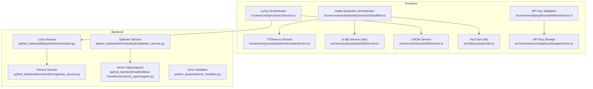
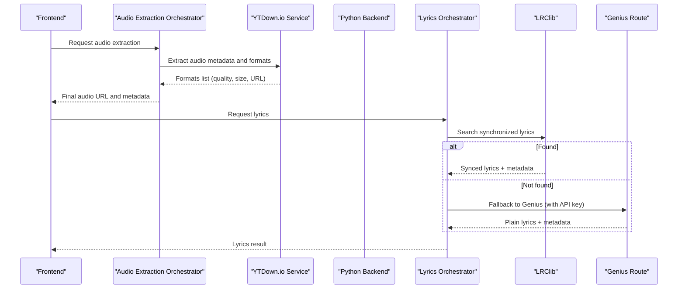
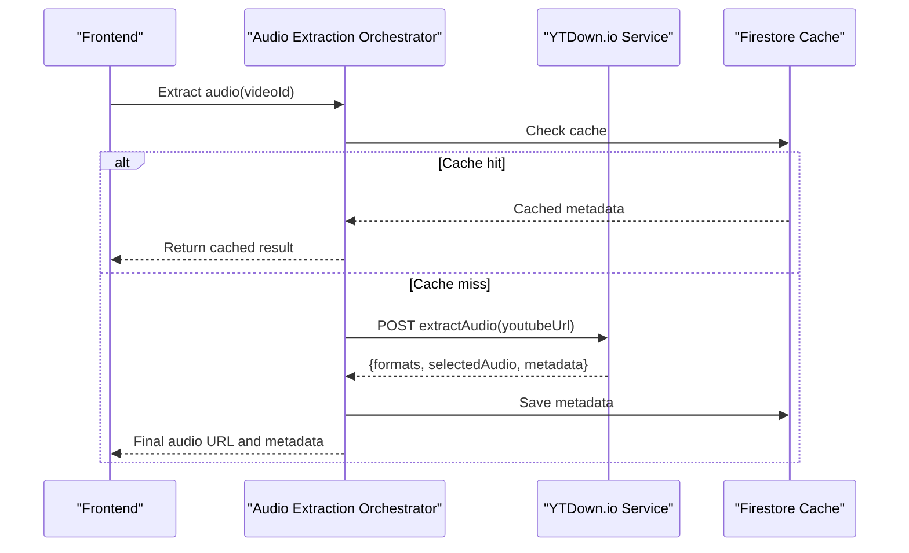
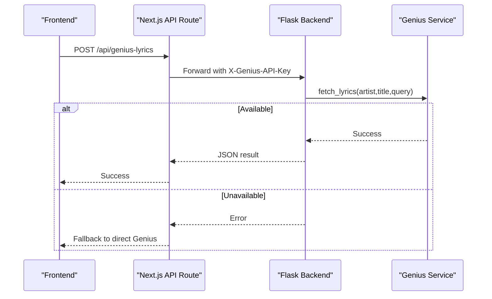
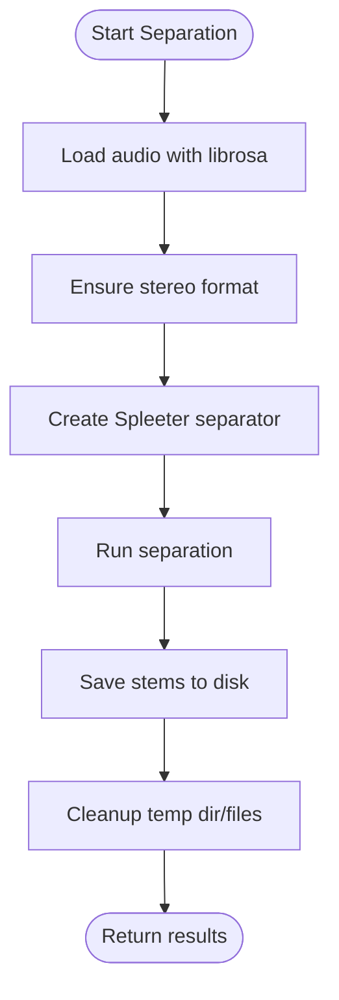
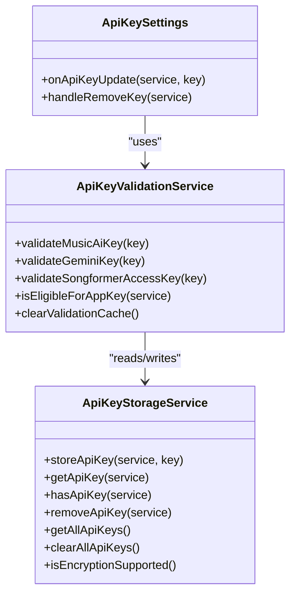
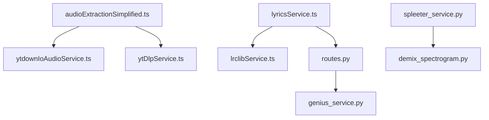

# External Integrations

<cite>
**Referenced Files in This Document**
- [ytdownIoAudioService.ts](file://src/services/youtube/ytdownIoAudioService.ts)
- [ytDlpService.ts](file://src/services/youtube/ytDlpService.ts)
- [audioExtractionSimplified.ts](file://src/services/audio/audioExtractionSimplified.ts)
- [youtubeUtils.ts](file://src/utils/youtubeUtils.ts)
- [genius_service.py](file://python_backend/services/lyrics/genius_service.py)
- [routes.py](file://python_backend/blueprints/lyrics/routes.py)
- [lyricsService.ts](file://src/services/lyrics/lyricsService.ts)
- [lrclibService.ts](file://src/services/lyrics/lrclibService.ts)
- [route.ts](file://src/app/api/genius-lyrics/route.ts)
- [spleeter_service.py](file://python_backend/services/audio/spleeter_service.py)
- [demix_spectrogram.py](file://python_backend/models/Beat-Transformer/demix_spectrogram.py)
- [beat_transformer.py](file://python_backend/models/beat_transformer.py)
- [apiKeyStorageService.ts](file://src/services/cache/apiKeyStorageService.ts)
- [apiKeyValidationService.ts](file://src/services/api/apiKeyValidationService.ts)
- [apiKeyTypes.ts](file://src/types/apiKeyTypes.ts)
- [ApiKeySettings.tsx](file://src/components/settings/ApiKeySettings.tsx)
- [error_handlers.py](file://python_backend/error_handlers.py)
</cite>

## Table of Contents
1. [Introduction](#introduction)
2. [Project Structure](#project-structure)
3. [Core Components](#core-components)
4. [Architecture Overview](#architecture-overview)
5. [Detailed Component Analysis](#detailed-component-analysis)
6. [Dependency Analysis](#dependency-analysis)
7. [Performance Considerations](#performance-considerations)
8. [Troubleshooting Guide](#troubleshooting-guide)
9. [Conclusion](#conclusion)

## Introduction
This document explains the external service integrations powering the platform, focusing on:
- YouTube audio extraction and metadata retrieval
- Genius API lyrics retrieval with authentication, rate limiting, and fallback strategies
- Spleeter-based audio separation for source separation
- API key management and security
- Error handling for network failures, rate limits, and service unavailability
- Caching mechanisms and performance optimization
- Troubleshooting and monitoring approaches

## Project Structure
The integration spans three primary areas:
- Frontend services for YouTube extraction and lyrics orchestration
- Python backend services for lyrics and audio separation
- Shared API key management and validation utilities

**Diagram sources**
- [ytdownIoAudioService.ts:1-204](file://src/services/youtube/ytdownIoAudioService.ts#L1-L204)
- [ytDlpService.ts:1-236](file://src/services/youtube/ytDlpService.ts#L1-L236)
- [audioExtractionSimplified.ts:657-799](file://src/services/audio/audioExtractionSimplified.ts#L657-L799)
- [youtubeUtils.ts:1-65](file://src/utils/youtubeUtils.ts#L1-L65)
- [lyricsService.ts:1-197](file://src/services/lyrics/lyricsService.ts#L1-L197)
- [lrclibService.ts:1-266](file://src/services/lyrics/lrclibService.ts#L1-L266)
- [routes.py:1-126](file://python_backend/blueprints/lyrics/routes.py#L1-L126)
- [genius_service.py:1-215](file://python_backend/services/lyrics/genius_service.py#L1-L215)
- [spleeter_service.py:1-286](file://python_backend/services/audio/spleeter_service.py#L1-L286)
- [demix_spectrogram.py:41-70](file://python_backend/models/Beat-Transformer/demix_spectrogram.py#L41-L70)
- [error_handlers.py:1-161](file://python_backend/error_handlers.py#L1-L161)

**Section sources**
- [ytdownIoAudioService.ts:1-204](file://src/services/youtube/ytdownIoAudioService.ts#L1-L204)
- [ytDlpService.ts:1-236](file://src/services/youtube/ytDlpService.ts#L1-L236)
- [audioExtractionSimplified.ts:657-799](file://src/services/audio/audioExtractionSimplified.ts#L657-L799)
- [lyricsService.ts:1-197](file://src/services/lyrics/lyricsService.ts#L1-L197)
- [lrclibService.ts:1-266](file://src/services/lyrics/lrclibService.ts#L1-L266)
- [routes.py:1-126](file://python_backend/blueprints/lyrics/routes.py#L1-L126)
- [genius_service.py:1-215](file://python_backend/services/lyrics/genius_service.py#L1-L215)
- [spleeter_service.py:1-286](file://python_backend/services/audio/spleeter_service.py#L1-L286)
- [demix_spectrogram.py:41-70](file://python_backend/models/Beat-Transformer/demix_spectrogram.py#L41-L70)
- [error_handlers.py:1-161](file://python_backend/error_handlers.py#L1-L161)

## Core Components
- YouTube audio extraction:
  - Production-grade extraction via a third-party proxy service with quality selection and format metadata.
  - Development fallback to a local yt-dlp service for local environments.
- Genius API lyrics:
  - Authentication via custom header or environment variable, with rate limiting and graceful fallback to LRClib.
- Spleeter audio separation:
  - On-demand separation with model selection, robust error handling, and cleanup.
- API key management:
  - Secure browser-side encryption and storage, validation service, and UI settings.

**Section sources**
- [ytdownIoAudioService.ts:75-155](file://src/services/youtube/ytdownIoAudioService.ts#L75-L155)
- [ytDlpService.ts:38-235](file://src/services/youtube/ytDlpService.ts#L38-L235)
- [audioExtractionSimplified.ts:657-799](file://src/services/audio/audioExtractionSimplified.ts#L657-L799)
- [genius_service.py:28-88](file://python_backend/services/lyrics/genius_service.py#L28-L88)
- [routes.py:22-72](file://python_backend/blueprints/lyrics/routes.py#L22-L72)
- [spleeter_service.py:17-286](file://python_backend/services/audio/spleeter_service.py#L17-L286)
- [apiKeyStorageService.ts:13-301](file://src/services/cache/apiKeyStorageService.ts#L13-L301)
- [apiKeyValidationService.ts:15-299](file://src/services/api/apiKeyValidationService.ts#L15-L299)

## Architecture Overview
The system integrates external services through a layered approach:
- Frontend orchestrators call either the production YouTube extractor or the dev yt-dlp service.
- Lyrics retrieval prioritizes synchronized lyrics via LRClib, with Genius as a fallback.
- Backend routes expose endpoints for lyrics and delegate to specialized services.
- Spleeter runs in the backend for audio separation tasks.
- API keys are managed securely in the browser and validated centrally.

**Diagram sources**
- [audioExtractionSimplified.ts:657-799](file://src/services/audio/audioExtractionSimplified.ts#L657-L799)
- [ytdownIoAudioService.ts:87-155](file://src/services/youtube/ytdownIoAudioService.ts#L87-L155)
- [lyricsService.ts:72-172](file://src/services/lyrics/lyricsService.ts#L72-L172)
- [lrclibService.ts:32-145](file://src/services/lyrics/lrclibService.ts#L32-L145)
- [route.ts:40-80](file://src/app/api/genius-lyrics/route.ts#L40-L80)
- [routes.py:22-72](file://python_backend/blueprints/lyrics/routes.py#L22-L72)

## Detailed Component Analysis

### YouTube Integration
- Metadata extraction and audio formats:
  - The service posts a YouTube URL to a proxy endpoint, parses the response, filters audio items, and selects a preferred quality or falls back to the first available.
- Stream quality selection:
  - Preferred quality is configurable; the service chooses the matching format or the first one if none matches.
- Error handling:
  - Non-OK HTTP responses, missing audio items, and invalid URLs are handled with explicit error reporting.
- Development fallback:
  - The yt-dlp service provides local development support with health checks and filename compatibility.

**Diagram sources**
- [audioExtractionSimplified.ts:657-799](file://src/services/audio/audioExtractionSimplified.ts#L657-L799)
- [ytdownIoAudioService.ts:87-155](file://src/services/youtube/ytdownIoAudioService.ts#L87-L155)

**Section sources**
- [ytdownIoAudioService.ts:75-155](file://src/services/youtube/ytdownIoAudioService.ts#L75-L155)
- [ytDlpService.ts:38-235](file://src/services/youtube/ytDlpService.ts#L38-L235)
- [audioExtractionSimplified.ts:657-799](file://src/services/audio/audioExtractionSimplified.ts#L657-L799)
- [youtubeUtils.ts:14-65](file://src/utils/youtubeUtils.ts#L14-L65)

### Genius API Integration
- Authentication:
  - The backend reads the API key from a custom header forwarded by the frontend or from environment variables.
- Rate limiting:
  - Backend routes apply moderate-processing rate limits.
- Fallback strategies:
  - Frontend attempts backend route first; on failure or timeout, it falls back to direct Genius API call with a timeout.
- Error handling:
  - Centralized error handlers return structured JSON responses for common HTTP errors and custom exceptions.

**Diagram sources**
- [route.ts:40-80](file://src/app/api/genius-lyrics/route.ts#L40-L80)
- [routes.py:22-72](file://python_backend/blueprints/lyrics/routes.py#L22-L72)
- [genius_service.py:28-88](file://python_backend/services/lyrics/genius_service.py#L28-L88)
- [error_handlers.py:13-93](file://python_backend/error_handlers.py#L13-L93)

**Section sources**
- [genius_service.py:14-215](file://python_backend/services/lyrics/genius_service.py#L14-L215)
- [routes.py:22-126](file://python_backend/blueprints/lyrics/routes.py#L22-L126)
- [route.ts:40-80](file://src/app/api/genius-lyrics/route.ts#L40-L80)
- [error_handlers.py:13-161](file://python_backend/error_handlers.py#L13-L161)

### Spleeter Integration
- Supported models:
  - 2-stems, 4-stems, and 5-stems separation models are supported.
- Processing parameters:
  - Audio is loaded with librosa, normalized to stereo, and separated using the chosen model.
- Quality considerations:
  - Proper resource management and cleanup of temporary directories and files.
- Integration in downstream models:
  - Demixing functions leverage Spleeter for accurate spectrogram creation and include detailed error messaging for model cache issues.

**Diagram sources**
- [spleeter_service.py:71-286](file://python_backend/services/audio/spleeter_service.py#L71-L286)
- [demix_spectrogram.py:41-70](file://python_backend/models/Beat-Transformer/demix_spectrogram.py#L41-L70)
- [beat_transformer.py:586-714](file://python_backend/models/beat_transformer.py#L586-L714)

**Section sources**
- [spleeter_service.py:17-286](file://python_backend/services/audio/spleeter_service.py#L17-L286)
- [demix_spectrogram.py:41-70](file://python_backend/models/Beat-Transformer/demix_spectrogram.py#L41-L70)
- [beat_transformer.py:586-714](file://python_backend/models/beat_transformer.py#L586-L714)

### API Key Management and Security
- Secure storage:
  - Browser-side encryption using Web Crypto AES-GCM with PBKDF2-derived keys; sensitive data stored in localStorage with metadata.
- Validation:
  - Validation service caches results and exposes helper methods to check service eligibility and clear caches.
- UI integration:
  - Settings component allows adding/removing keys and displays validity status.

**Diagram sources**
- [apiKeyStorageService.ts:13-301](file://src/services/cache/apiKeyStorageService.ts#L13-L301)
- [apiKeyValidationService.ts:15-299](file://src/services/api/apiKeyValidationService.ts#L15-L299)
- [ApiKeySettings.tsx:10-40](file://src/components/settings/ApiKeySettings.tsx#L10-L40)
- [apiKeyTypes.ts:6-67](file://src/types/apiKeyTypes.ts#L6-L67)

**Section sources**
- [apiKeyStorageService.ts:13-301](file://src/services/cache/apiKeyStorageService.ts#L13-L301)
- [apiKeyValidationService.ts:15-299](file://src/services/api/apiKeyValidationService.ts#L15-L299)
- [ApiKeySettings.tsx:1-40](file://src/components/settings/ApiKeySettings.tsx#L1-L40)
- [apiKeyTypes.ts:1-67](file://src/types/apiKeyTypes.ts#L1-L67)

## Dependency Analysis
- Frontend-to-backend dependencies:
  - Frontend lyrics orchestrator calls backend routes for Genius/LRClib; backend routes depend on specialized services.
- YouTube extraction:
  - Frontend extraction orchestrator depends on the YTDown.io service and optional yt-dlp fallback.
- Spleeter:
  - Backend services depend on Spleeter and librosa; downstream models rely on demixing functions.

**Diagram sources**
- [audioExtractionSimplified.ts:657-799](file://src/services/audio/audioExtractionSimplified.ts#L657-L799)
- [ytdownIoAudioService.ts:75-155](file://src/services/youtube/ytdownIoAudioService.ts#L75-L155)
- [ytDlpService.ts:38-235](file://src/services/youtube/ytDlpService.ts#L38-L235)
- [lyricsService.ts:72-172](file://src/services/lyrics/lyricsService.ts#L72-L172)
- [lrclibService.ts:32-145](file://src/services/lyrics/lrclibService.ts#L32-L145)
- [routes.py:22-126](file://python_backend/blueprints/lyrics/routes.py#L22-L126)
- [genius_service.py:14-215](file://python_backend/services/lyrics/genius_service.py#L14-L215)
- [spleeter_service.py:17-286](file://python_backend/services/audio/spleeter_service.py#L17-L286)
- [demix_spectrogram.py:41-70](file://python_backend/models/Beat-Transformer/demix_spectrogram.py#L41-L70)

**Section sources**
- [lyricsService.ts:1-197](file://src/services/lyrics/lyricsService.ts#L1-L197)
- [routes.py:1-126](file://python_backend/blueprints/lyrics/routes.py#L1-L126)
- [spleeter_service.py:1-286](file://python_backend/services/audio/spleeter_service.py#L1-L286)

## Performance Considerations
- Caching:
  - YouTube metadata is cached in Firestore to avoid repeated extractions and reduce latency.
- Timeout strategies:
  - Frontend Genius API route applies a 15-second timeout before falling back to direct API calls.
- Model availability:
  - Spleeter availability checks prevent unnecessary initialization and improve startup reliability.
- Resource cleanup:
  - Temporary directories and files are cleaned up after separation to avoid disk pressure.

[No sources needed since this section provides general guidance]

## Troubleshooting Guide
- YouTube extraction issues:
  - Verify the proxy endpoint returns OK and contains audio items; confirm the URL is valid and the preferred quality is available.
  - In development, ensure the yt-dlp service is healthy and reachable.
- Genius API issues:
  - Confirm the API key is present in the custom header or environment; check backend rate limits and centralized error responses.
  - If backend route fails, the frontend fallback to direct Genius API should still work with a timeout.
- Spleeter issues:
  - If separation fails, inspect logs for model cache problems and ensure the pretrained model is downloaded or copied into the expected cache directory.
- API key issues:
  - Confirm encryption support is available in the browser; check that keys are stored and retrievable; clear caches if validation results appear stale.

**Section sources**
- [ytdownIoAudioService.ts:103-155](file://src/services/youtube/ytdownIoAudioService.ts#L103-L155)
- [ytDlpService.ts:178-214](file://src/services/youtube/ytDlpService.ts#L178-L214)
- [route.ts:40-80](file://src/app/api/genius-lyrics/route.ts#L40-L80)
- [genius_service.py:28-88](file://python_backend/services/lyrics/genius_service.py#L28-L88)
- [error_handlers.py:13-93](file://python_backend/error_handlers.py#L13-L93)
- [spleeter_service.py:160-178](file://python_backend/services/audio/spleeter_service.py#L160-L178)
- [apiKeyStorageService.ts:293-301](file://src/services/cache/apiKeyStorageService.ts#L293-L301)

## Conclusion
The platform integrates external services with a robust fallback strategy, strong error handling, and secure API key management. YouTube extraction leverages a production-friendly proxy with development fallback, Genius lyrics benefit from rate-limited backend routes and frontend fallback, and Spleeter provides reliable audio separation with careful resource management. Together, these components deliver a resilient and performant experience across varied environments.