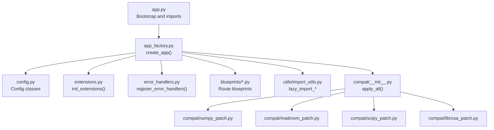
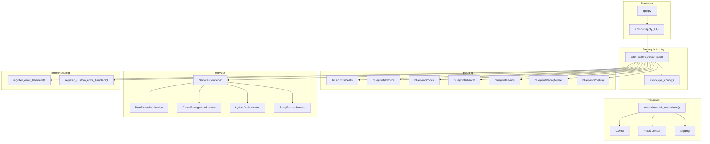
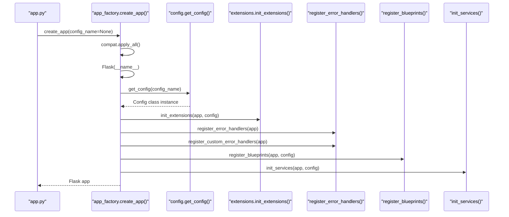
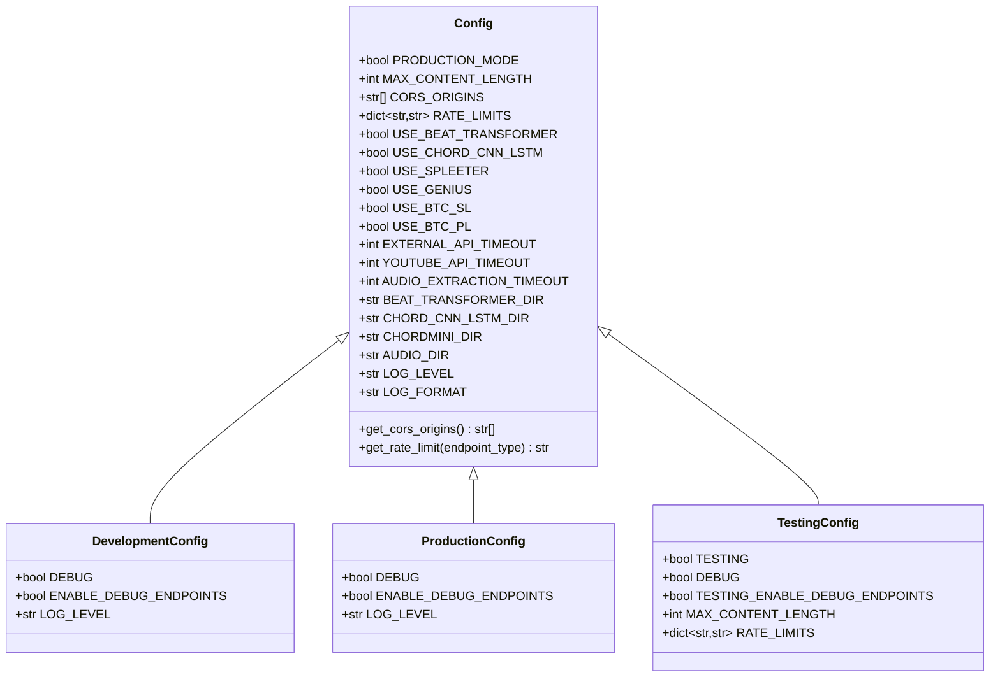
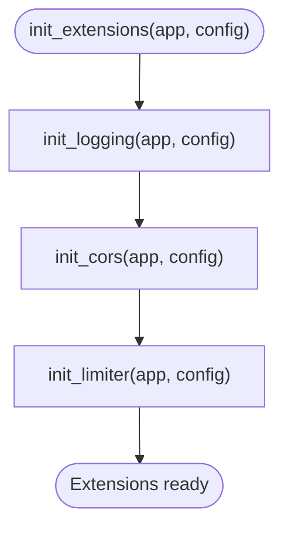
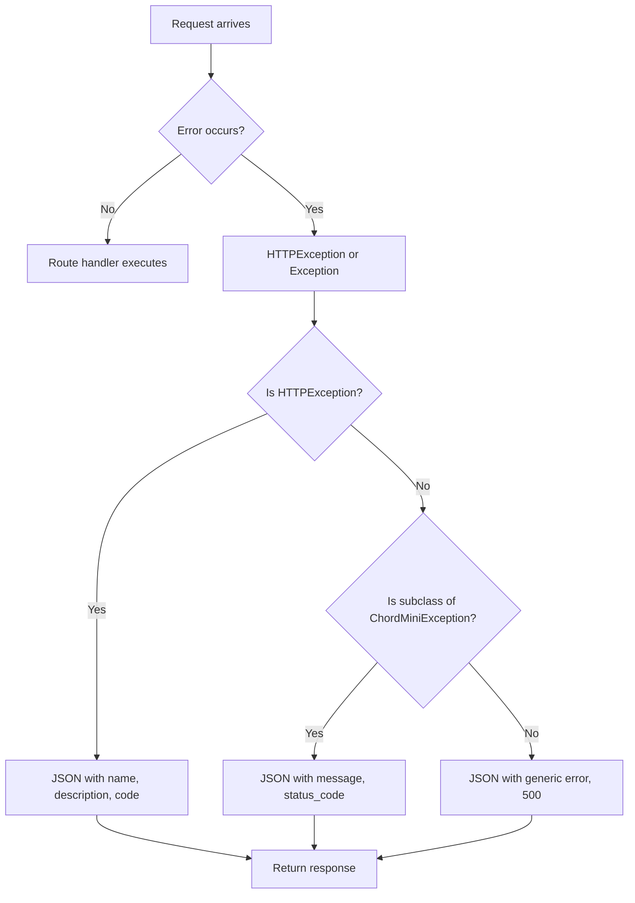
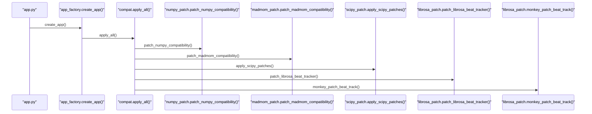
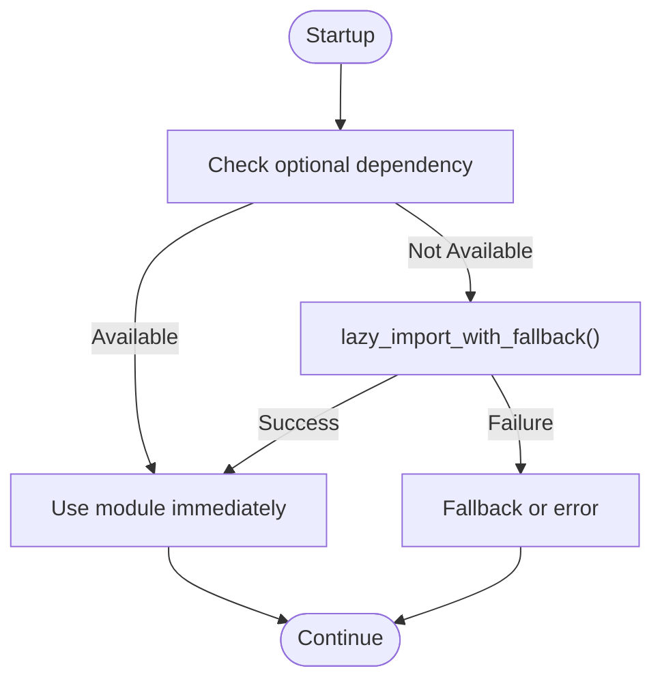
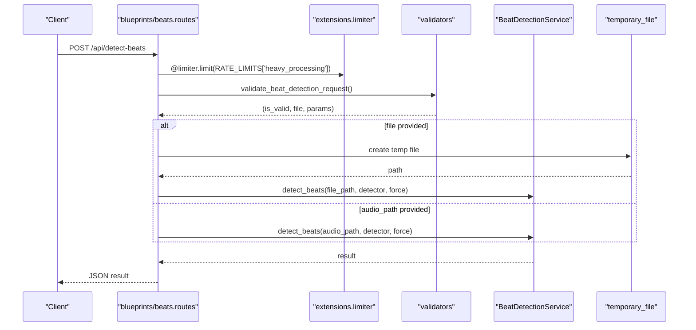
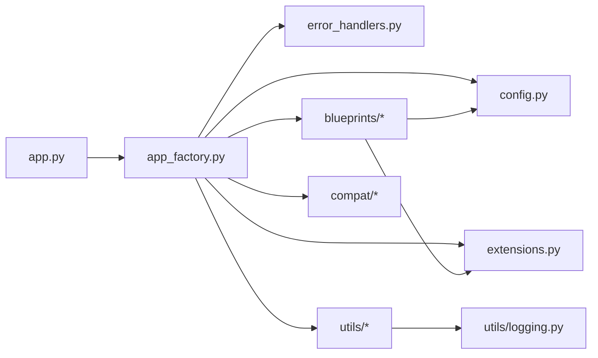

# Flask Application Architecture

<cite>
**Referenced Files in This Document**
- [app.py](file://python_backend/app.py)
- [app_factory.py](file://python_backend/app_factory.py)
- [config.py](file://python_backend/config.py)
- [extensions.py](file://python_backend/extensions.py)
- [error_handlers.py](file://python_backend/error_handlers.py)
- [compat/__init__.py](file://python_backend/compat/__init__.py)
- [compat/librosa_patch.py](file://python_backend/compat/librosa_patch.py)
- [compat/madmom_patch.py](file://python_backend/compat/madmom_patch.py)
- [compat/numpy_patch.py](file://python_backend/compat/numpy_patch.py)
- [compat/scipy_patch.py](file://python_backend/compat/scipy_patch.py)
- [utils/import_utils.py](file://python_backend/utils/import_utils.py)
- [utils/logging.py](file://python_backend/utils/logging.py)
- [blueprints/beats/routes.py](file://python_backend/blueprints/beats/routes.py)
- [blueprints/chords/routes.py](file://python_backend/blueprints/chords/routes.py)
- [requirements.txt](file://python_backend/requirements.txt)
- [Dockerfile](file://python_backend/Dockerfile)
</cite>

## Table of Contents
1. [Introduction](#introduction)
2. [Project Structure](#project-structure)
3. [Core Components](#core-components)
4. [Architecture Overview](#architecture-overview)
5. [Detailed Component Analysis](#detailed-component-analysis)
6. [Dependency Analysis](#dependency-analysis)
7. [Performance Considerations](#performance-considerations)
8. [Troubleshooting Guide](#troubleshooting-guide)
9. [Conclusion](#conclusion)
10. [Appendices](#appendices)

## Introduction
This document explains the Flask application architecture for the ChordMini backend. It focuses on the application factory pattern, configuration management, extension initialization, error handling, compatibility patches for librosa, madmom, numpy, and scipy, deferred imports and lazy loading strategies, and deployment considerations for Cloud Run and local development.

## Project Structure
The Python backend is organized around a modular Flask application:
- Application bootstrap and factory: app.py and app_factory.py
- Configuration: config.py
- Extensions: extensions.py
- Error handling: error_handlers.py
- Compatibility patches: compat/ subpackage
- Utilities: utils/ (import_utils.py, logging.py)
- Blueprints: blueprints/ (beats/, chords/, docs/, health/, lyrics/, songformer/, debug/)

**Diagram sources**
- [app.py:1-186](file://python_backend/app.py#L1-L186)
- [app_factory.py:1-162](file://python_backend/app_factory.py#L1-L162)
- [config.py:1-215](file://python_backend/config.py#L1-L215)
- [extensions.py:1-93](file://python_backend/extensions.py#L1-L93)
- [error_handlers.py:1-161](file://python_backend/error_handlers.py#L1-L161)
- [compat/__init__.py:1-36](file://python_backend/compat/__init__.py#L1-L36)
- [compat/numpy_patch.py:1-54](file://python_backend/compat/numpy_patch.py#L1-L54)
- [compat/madmom_patch.py:1-33](file://python_backend/compat/madmom_patch.py#L1-L33)
- [compat/scipy_patch.py:1-48](file://python_backend/compat/scipy_patch.py#L1-L48)
- [compat/librosa_patch.py:1-97](file://python_backend/compat/librosa_patch.py#L1-L97)
- [utils/import_utils.py:1-277](file://python_backend/utils/import_utils.py#L1-L277)

**Section sources**
- [app.py:1-186](file://python_backend/app.py#L1-L186)
- [app_factory.py:1-162](file://python_backend/app_factory.py#L1-L162)

## Core Components
- Application Factory: Creates and configures the Flask app, initializes extensions, registers error handlers, blueprints, and a simple service container.
- Configuration Management: Centralizes environment-aware settings, CORS origins, rate limits, feature toggles, timeouts, and logging.
- Extensions Initialization: Sets up CORS, rate limiting, and logging consistently across environments.
- Error Handling: Provides standardized JSON responses for HTTP errors, rate limits, and custom exceptions.
- Compatibility Patches: Applies targeted fixes for librosa, madmom, numpy, and scipy to maintain compatibility with modern Python versions.
- Deferred Imports and Lazy Loading: Defers heavy imports until needed and applies patches before importing affected libraries.

**Section sources**
- [app_factory.py:27-162](file://python_backend/app_factory.py#L27-L162)
- [config.py:16-215](file://python_backend/config.py#L16-L215)
- [extensions.py:17-93](file://python_backend/extensions.py#L17-L93)
- [error_handlers.py:13-161](file://python_backend/error_handlers.py#L13-L161)
- [compat/__init__.py:21-36](file://python_backend/compat/__init__.py#L21-L36)
- [utils/import_utils.py:13-277](file://python_backend/utils/import_utils.py#L13-L277)

## Architecture Overview
The application follows a layered architecture:
- Bootstrap layer: Loads environment variables, applies compatibility patches, and creates the app via the factory.
- Configuration layer: Selects environment-specific configuration and sets Flask app.config.
- Extension layer: Initializes CORS, rate limiting, and logging.
- Routing layer: Blueprints encapsulate feature domains (beats, chords, lyrics, docs, health, songformer, debug).
- Services layer: A simple dependency container holds service instances lazily initialized at runtime.
- Error handling layer: Centralized handlers for HTTP and application-specific exceptions.

**Diagram sources**
- [app.py:1-186](file://python_backend/app.py#L1-L186)
- [app_factory.py:27-162](file://python_backend/app_factory.py#L27-L162)
- [config.py:195-215](file://python_backend/config.py#L195-L215)
- [extensions.py:81-93](file://python_backend/extensions.py#L81-L93)
- [error_handlers.py:13-161](file://python_backend/error_handlers.py#L13-L161)
- [blueprints/beats/routes.py:1-521](file://python_backend/blueprints/beats/routes.py#L1-L521)
- [blueprints/chords/routes.py:1-440](file://python_backend/blueprints/chords/routes.py#L1-L440)

## Detailed Component Analysis

### Application Factory Pattern
The factory encapsulates app creation and configuration, enabling environment-specific setups and clean separation of concerns. It:
- Applies compatibility patches early
- Creates the Flask app with a template folder
- Loads configuration via get_config()
- Initializes extensions (CORS, rate limiting, logging)
- Registers error handlers and blueprints
- Builds a minimal service container with lazy-initialized services

**Diagram sources**
- [app.py:86-88](file://python_backend/app.py#L86-L88)
- [app_factory.py:27-162](file://python_backend/app_factory.py#L27-L162)
- [config.py:195-215](file://python_backend/config.py#L195-L215)
- [extensions.py:81-93](file://python_backend/extensions.py#L81-L93)
- [error_handlers.py:13-161](file://python_backend/error_handlers.py#L13-L161)

**Section sources**
- [app_factory.py:27-162](file://python_backend/app_factory.py#L27-L162)

### Configuration Management
Configuration classes define environment-aware settings:
- Base Config: shared settings, CORS origins, rate limits, timeouts, feature toggles, logging, and model paths
- DevelopmentConfig: relaxed rate limits, debug endpoints, debug logging
- ProductionConfig: strict rate limits, restricted debug endpoints, production logging
- TestingConfig: no rate limits, debug features, reduced file sizes and timeouts

Environment detection considers FLASK_ENV and PORT. CORS origins can be extended via environment variables. Rate limits are endpoint-type specific and configurable.

**Diagram sources**
- [config.py:16-215](file://python_backend/config.py#L16-L215)

**Section sources**
- [config.py:16-215](file://python_backend/config.py#L16-L215)

### Extensions Initialization
The extensions module initializes:
- CORS with dynamic origins from configuration
- Flask-Limiter with optional Redis storage
- Logging with level and format from configuration

**Diagram sources**
- [extensions.py:81-93](file://python_backend/extensions.py#L81-L93)
- [extensions.py:22-59](file://python_backend/extensions.py#L22-L59)
- [extensions.py:61-79](file://python_backend/extensions.py#L61-L79)

**Section sources**
- [extensions.py:17-93](file://python_backend/extensions.py#L17-L93)

### Error Handling Strategies
Global exception management:
- Standard JSON responses for 400, 404, 413, 429, 500
- Generic HTTPException handling
- Unexpected exception logging with stack traces
- Custom exceptions for domain errors (ModelUnavailableError, FileTooLargeError, AudioProcessingError, ExternalServiceError)
- Handlers for custom exceptions returning structured JSON with status codes

**Diagram sources**
- [error_handlers.py:13-161](file://python_backend/error_handlers.py#L13-L161)

**Section sources**
- [error_handlers.py:13-161](file://python_backend/error_handlers.py#L13-L161)

### Compatibility Patches
Compatibility patches are applied in a specific order before importing affected libraries:
- NumPy: restores deprecated attributes (float, int, complex, bool)
- Madmom: maps collections.MutableSequence to collections.abc.MutableSequence
- SciPy: exposes hann via scipy.signal.windows.hann for librosa compatibility
- Librosa: patches beat tracking functions to avoid deprecated scipy.signal.hann

**Diagram sources**
- [app.py:9-11](file://python_backend/app.py#L9-L11)
- [app_factory.py:38-39](file://python_backend/app_factory.py#L38-L39)
- [compat/__init__.py:21-36](file://python_backend/compat/__init__.py#L21-L36)
- [compat/numpy_patch.py:22-54](file://python_backend/compat/numpy_patch.py#L22-L54)
- [compat/madmom_patch.py:12-33](file://python_backend/compat/madmom_patch.py#L12-L33)
- [compat/scipy_patch.py:18-48](file://python_backend/compat/scipy_patch.py#L18-L48)
- [compat/librosa_patch.py:14-97](file://python_backend/compat/librosa_patch.py#L14-L97)

**Section sources**
- [compat/__init__.py:21-36](file://python_backend/compat/__init__.py#L21-L36)
- [compat/numpy_patch.py:22-54](file://python_backend/compat/numpy_patch.py#L22-L54)
- [compat/madmom_patch.py:12-33](file://python_backend/compat/madmom_patch.py#L12-L33)
- [compat/scipy_patch.py:18-48](file://python_backend/compat/scipy_patch.py#L18-L48)
- [compat/librosa_patch.py:14-97](file://python_backend/compat/librosa_patch.py#L14-L97)

### Deferred Imports and Lazy Loading
To optimize startup and reduce memory footprint:
- Heavy imports are deferred until needed
- A dedicated lazy_import_librosa() function applies scipy and librosa patches before importing librosa
- Utilities provide safe_import(), check_optional_dependency(), and lazy_import_with_fallback() for robust optional dependencies
- Logging utilities adapt behavior between production and development modes

**Diagram sources**
- [utils/import_utils.py:13-277](file://python_backend/utils/import_utils.py#L13-L277)
- [utils/logging.py:12-91](file://python_backend/utils/logging.py#L12-L91)

**Section sources**
- [utils/import_utils.py:13-277](file://python_backend/utils/import_utils.py#L13-L277)
- [utils/logging.py:12-91](file://python_backend/utils/logging.py#L12-L91)

### Blueprints and Routes
Key routes demonstrate rate limiting, validation, and service orchestration:
- Beats routes: detect-beats, detect-beats-firebase, model-info, and model availability tests
- Chords routes: recognize-chords, recognize-chords-firebase, model-info, and model availability tests

Both sets of routes:
- Use limiter limits from configuration
- Validate inputs and enforce file size limits
- Delegate to services retrieved from app.extensions['services']

**Diagram sources**
- [blueprints/beats/routes.py:40-120](file://python_backend/blueprints/beats/routes.py#L40-L120)
- [blueprints/beats/routes.py:122-180](file://python_backend/blueprints/beats/routes.py#L122-L180)
- [blueprints/beats/routes.py:182-250](file://python_backend/blueprints/beats/routes.py#L182-L250)
- [extensions.py:17-19](file://python_backend/extensions.py#L17-L19)
- [config.py:52-60](file://python_backend/config.py#L52-L60)

**Section sources**
- [blueprints/beats/routes.py:40-521](file://python_backend/blueprints/beats/routes.py#L40-L521)
- [blueprints/chords/routes.py:43-440](file://python_backend/blueprints/chords/routes.py#L43-L440)

## Dependency Analysis
The application exhibits low coupling and high cohesion:
- app_factory.py depends on config, extensions, error_handlers, compat, and blueprints/services
- Blueprints depend on validators, services, and extensions for rate limiting
- Compatibility patches are centralized and applied before importing affected libraries
- Logging utilities are environment-aware and used across modules

**Diagram sources**
- [app.py:1-186](file://python_backend/app.py#L1-L186)
- [app_factory.py:1-162](file://python_backend/app_factory.py#L1-L162)
- [config.py:1-215](file://python_backend/config.py#L1-L215)
- [extensions.py:1-93](file://python_backend/extensions.py#L1-L93)
- [error_handlers.py:1-161](file://python_backend/error_handlers.py#L1-L161)
- [compat/__init__.py:1-36](file://python_backend/compat/__init__.py#L1-L36)
- [utils/logging.py:1-91](file://python_backend/utils/logging.py#L1-L91)

**Section sources**
- [app_factory.py:1-162](file://python_backend/app_factory.py#L1-L162)
- [blueprints/beats/routes.py:1-521](file://python_backend/blueprints/beats/routes.py#L1-L521)
- [blueprints/chords/routes.py:1-440](file://python_backend/blueprints/chords/routes.py#L1-L440)

## Performance Considerations
- Deferred imports and lazy loading reduce cold-start latency and memory usage
- Rate limiting prevents resource exhaustion on heavy endpoints
- Environment-specific configurations tune timeouts and limits appropriately
- Logging adapts to production verbosity to minimize overhead
- Docker multi-stage build optimizes runtime image size and pre-downloads Spleeter models

[No sources needed since this section provides general guidance]

## Troubleshooting Guide
Common startup and runtime issues:
- Import failures for librosa or madmom: ensure scipy compatibility patches are applied before importing librosa; verify numpy compatibility patches are active
- CORS errors: confirm CORS_ORIGINS includes the frontend origin; environment variable overrides are supported
- Rate limit errors: adjust RATE_LIMITS or disable Redis for development; verify Redis_URL is set in production
- File size errors: check MAX_CONTENT_LENGTH and per-feature size limits; ensure validators are invoked
- Service unavailability: verify services are initialized in init_services(); fallback behavior logs and continues

**Section sources**
- [compat/__init__.py:21-36](file://python_backend/compat/__init__.py#L21-L36)
- [config.py:32-60](file://python_backend/config.py#L32-L60)
- [extensions.py:41-59](file://python_backend/extensions.py#L41-L59)
- [blueprints/beats/routes.py:67-72](file://python_backend/blueprints/beats/routes.py#L67-L72)
- [app_factory.py:103-161](file://python_backend/app_factory.py#L103-L161)

## Conclusion
The Flask application employs a clean, modular architecture centered on the application factory pattern. Configuration is environment-aware, extensions are initialized consistently, and error handling is centralized. Compatibility patches ensure stable operation across Python and library versions. Deferred imports and lazy loading improve startup performance. Deployment is streamlined via a multi-stage Dockerfile and production-ready defaults.

[No sources needed since this section summarizes without analyzing specific files]

## Appendices

### Environment Variables and Settings
- FLASK_ENV: determines production vs development mode
- PORT: indicates production mode when set
- SECRET_KEY: Flask secret key
- CORS_ORIGINS: comma-separated list of allowed origins
- REDIS_URL: optional Redis connection for rate limiting
- FLASK_MAX_CONTENT_LENGTH_MB: maximum upload size in MB
- DEBUG: enables debug logging in development
- Additional timeouts and feature toggles are defined in configuration classes

**Section sources**
- [config.py:19-92](file://python_backend/config.py#L19-L92)
- [utils/logging.py:12-25](file://python_backend/utils/logging.py#L12-L25)

### Deployment Considerations
- Cloud Run: Dockerfile defines a multi-stage build, installs system dependencies (ffmpeg, libsndfile), pre-downloads Spleeter models, and runs with gunicorn
- Port binding: Cloud Run uses PORT environment variable; local development uses 5001 by default
- Health checks: HTTP health check against the root path
- Security: non-root user and explicit environment variables for production

**Section sources**
- [Dockerfile:1-116](file://python_backend/Dockerfile#L1-L116)
- [app.py:180-186](file://python_backend/app.py#L180-L186)

### Key Dependencies
- Flask, Flask-CORS, Flask-Limiter, Werkzeug
- Audio processing: librosa, soundfile, audioread, resampy, soxr, pydub
- ML frameworks: tensorflow, torch, torchaudio
- Spleeter: 5-stems separation
- Utilities: requests, httpx, h2, Pillow, lyricsgenius, PyYAML, tqdm, yt-dlp, pytube
- Compatibility: setuptools, h5py, packaging, typing_extensions, six, click, typer

**Section sources**
- [requirements.txt:1-131](file://python_backend/requirements.txt#L1-L131)