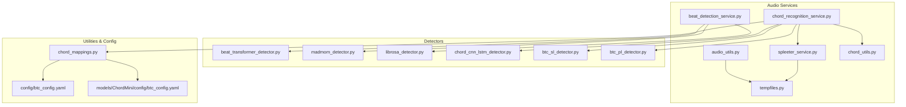
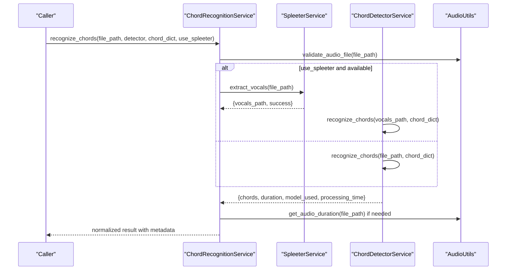
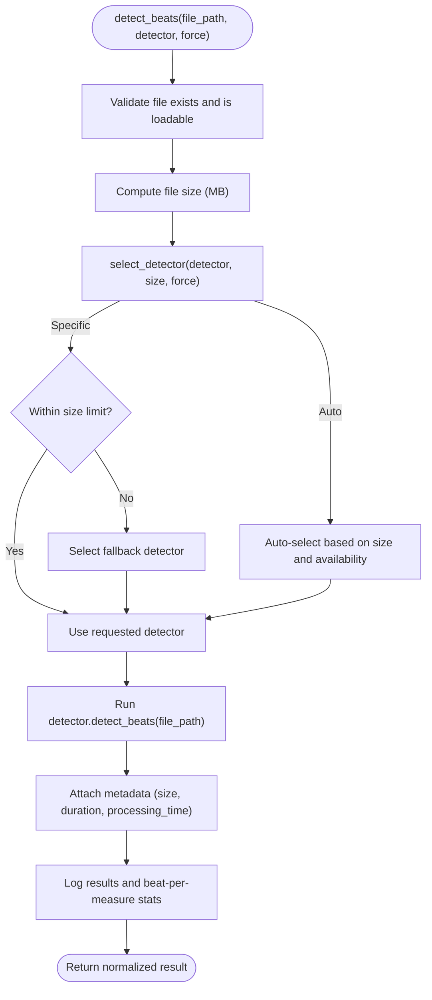
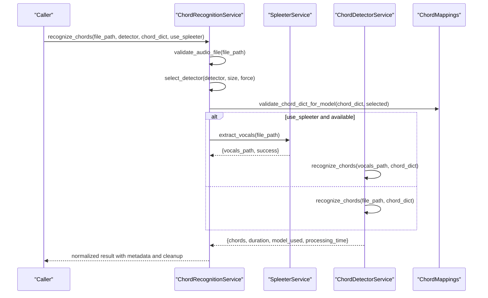
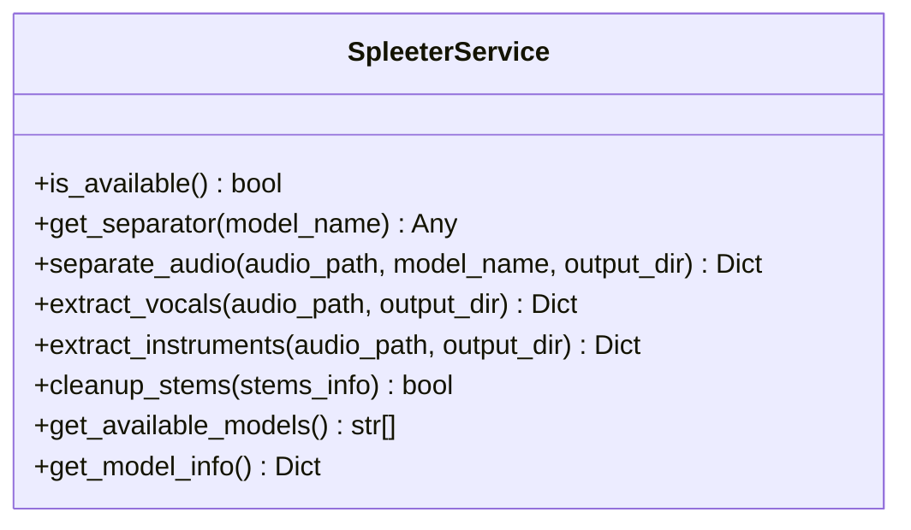
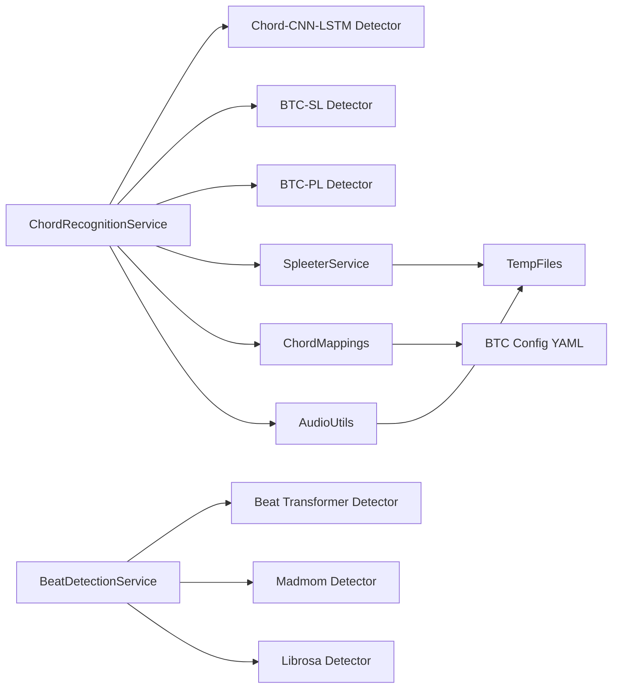

# Audio Processing Services

<cite>
**Referenced Files in This Document**
- [audio_utils.py](file://python_backend/services/audio/audio_utils.py)
- [beat_detection_service.py](file://python_backend/services/audio/beat_detection_service.py)
- [chord_recognition_service.py](file://python_backend/services/audio/chord_recognition_service.py)
- [chord_utils.py](file://python_backend/services/audio/chord_utils.py)
- [spleeter_service.py](file://python_backend/services/audio/spleeter_service.py)
- [tempfiles.py](file://python_backend/services/audio/tempfiles.py)
- [beat_transformer_detector.py](file://python_backend/services/detectors/beat_transformer_detector.py)
- [madmom_detector.py](file://python_backend/services/detectors/madmom_detector.py)
- [librosa_detector.py](file://python_backend/services/detectors/librosa_detector.py)
- [chord_cnn_lstm_detector.py](file://python_backend/services/detectors/chord_cnn_lstm_detector.py)
- [btc_sl_detector.py](file://python_backend/services/detectors/btc_sl_detector.py)
- [btc_pl_detector.py](file://python_backend/services/detectors/btc_pl_detector.py)
- [chord_mappings.py](file://python_backend/utils/chord_mappings.py)
- [btc_config.yaml](file://python_backend/config/btc_config.yaml)
- [btc_config.yaml](file://python_backend/models/ChordMini/config/btc_config.yaml)
</cite>

## Table of Contents
1. [Introduction](#introduction)
2. [Project Structure](#project-structure)
3. [Core Components](#core-components)
4. [Architecture Overview](#architecture-overview)
5. [Detailed Component Analysis](#detailed-component-analysis)
6. [Dependency Analysis](#dependency-analysis)
7. [Performance Considerations](#performance-considerations)
8. [Troubleshooting Guide](#troubleshooting-guide)
9. [Conclusion](#conclusion)

## Introduction
This document describes the audio processing services powering beat detection, chord recognition, and audio separation in the backend. It covers:
- Core audio utilities: silence trimming, duration calculation, resampling, and file validation
- Beat detection service: algorithm selection, size-aware routing, and fallback strategies
- Chord recognition service: model selection, chord dictionary configuration, and optional Spleeter-based vocal separation
- Spleeter integration: stem extraction, cleanup, and temporary file management
- Practical workflows, error handling, performance optimization, and troubleshooting

## Project Structure
The audio processing stack is organized into:
- Services under python_backend/services/audio: orchestration and utilities
- Detectors under python_backend/services/detectors: model wrappers for beat and chord detection
- Utilities under python_backend/utils: chord mappings and configuration
- Configuration under python_backend/config and python_backend/models/ChordMini/config

**Diagram sources**
- [beat_detection_service.py:20-348](file://python_backend/services/audio/beat_detection_service.py#L20-L348)
- [chord_recognition_service.py:25-322](file://python_backend/services/audio/chord_recognition_service.py#L25-L322)
- [spleeter_service.py:17-286](file://python_backend/services/audio/spleeter_service.py#L17-L286)
- [tempfiles.py:15-136](file://python_backend/services/audio/tempfiles.py#L15-L136)
- [chord_utils.py:13-294](file://python_backend/services/audio/chord_utils.py#L13-L294)
- [beat_transformer_detector.py:15-163](file://python_backend/services/detectors/beat_transformer_detector.py#L15-L163)
- [madmom_detector.py:14-158](file://python_backend/services/detectors/madmom_detector.py#L14-L158)
- [librosa_detector.py:14-124](file://python_backend/services/detectors/librosa_detector.py#L14-L124)
- [chord_cnn_lstm_detector.py:17-249](file://python_backend/services/detectors/chord_cnn_lstm_detector.py#L17-L249)
- [btc_sl_detector.py:17-246](file://python_backend/services/detectors/btc_sl_detector.py#L17-L246)
- [btc_pl_detector.py:17-246](file://python_backend/services/detectors/btc_pl_detector.py#L17-L246)
- [chord_mappings.py:12-319](file://python_backend/utils/chord_mappings.py#L12-L319)
- [btc_config.yaml:1-61](file://python_backend/config/btc_config.yaml#L1-L61)
- [btc_config.yaml:1-50](file://python_backend/models/ChordMini/config/btc_config.yaml#L1-L50)

**Section sources**
- [beat_detection_service.py:20-348](file://python_backend/services/audio/beat_detection_service.py#L20-L348)
- [chord_recognition_service.py:25-322](file://python_backend/services/audio/chord_recognition_service.py#L25-L322)
- [spleeter_service.py:17-286](file://python_backend/services/audio/spleeter_service.py#L17-L286)
- [tempfiles.py:15-136](file://python_backend/services/audio/tempfiles.py#L15-L136)
- [chord_utils.py:13-294](file://python_backend/services/audio/chord_utils.py#L13-L294)
- [chord_mappings.py:12-319](file://python_backend/utils/chord_mappings.py#L12-L319)
- [btc_config.yaml:1-61](file://python_backend/config/btc_config.yaml#L1-L61)
- [btc_config.yaml:1-50](file://python_backend/models/ChordMini/config/btc_config.yaml#L1-L50)

## Core Components
- Silence trimming: Uses librosa effects trim to remove leading/trailing silence and optionally write output; returns trimmed audio, sample rate, and trim timestamps.
- Duration calculation: Loads audio and computes duration using librosa.
- Resampling: Loads audio at a target sample rate for downstream processing.
- File validation: Attempts librosa load of a short clip to verify integrity; falls back to filesystem checks if librosa is unavailable.
- Temporary file management: Context-managed creation and cleanup of temporary files and directories; safe deletion with logging.

**Section sources**
- [audio_utils.py:12-131](file://python_backend/services/audio/audio_utils.py#L12-L131)
- [tempfiles.py:15-136](file://python_backend/services/audio/tempfiles.py#L15-L136)

## Architecture Overview
The system orchestrates detection and recognition through service classes that:
- Validate inputs and file sizes
- Select appropriate detectors/models based on availability and constraints
- Invoke detector services and normalize outputs
- Optionally integrate Spleeter for vocal separation
- Attach metadata such as processing time, duration, and detector info

**Diagram sources**
- [chord_recognition_service.py:173-296](file://python_backend/services/audio/chord_recognition_service.py#L173-L296)
- [spleeter_service.py:180-198](file://python_backend/services/audio/spleeter_service.py#L180-L198)
- [chord_cnn_lstm_detector.py:78-182](file://python_backend/services/detectors/chord_cnn_lstm_detector.py#L78-L182)
- [btc_sl_detector.py:87-160](file://python_backend/services/detectors/btc_sl_detector.py#L87-L160)
- [btc_pl_detector.py:87-160](file://python_backend/services/detectors/btc_pl_detector.py#L87-L160)
- [audio_utils.py:70-87](file://python_backend/services/audio/audio_utils.py#L70-L87)

## Detailed Component Analysis

### Audio Utilities
- trim_silence_from_audio: trims silence with configurable thresholds and frame sizes; logs trim metrics; writes output if provided; gracefully falls back to original audio on failure.
- get_audio_duration: robustly computes duration via librosa; returns zero on error.
- resample_audio: loads at target sample rate; raises on failure.
- validate_audio_file: attempts short-duration load; returns False on import errors and logs.

Practical example workflow:
- Preprocess: validate → trim silence → resample → compute duration
- Post-process: merge short segments, filter noise, normalize labels

**Section sources**
- [audio_utils.py:12-131](file://python_backend/services/audio/audio_utils.py#L12-L131)

### Beat Detection Service
- Orchestrates three detectors: Beat Transformer, madmom, and librosa.
- Size-aware selection: enforces per-detector file size limits; prefers faster/accurate models for small files and more permissive ones for large files.
- Auto-selection logic: favors madmom for small files, Beat Transformer for medium, and madmom/librosa for large depending on limits.
- Fallback selection: chooses any suitable detector or the most permissive if none fit.
- Metadata: attaches file size, detector selection, processing time, and duration.

**Diagram sources**
- [beat_detection_service.py:163-310](file://python_backend/services/audio/beat_detection_service.py#L163-L310)

**Section sources**
- [beat_detection_service.py:20-348](file://python_backend/services/audio/beat_detection_service.py#L20-L348)
- [beat_transformer_detector.py:15-163](file://python_backend/services/detectors/beat_transformer_detector.py#L15-L163)
- [madmom_detector.py:14-158](file://python_backend/services/detectors/madmom_detector.py#L14-L158)
- [librosa_detector.py:14-124](file://python_backend/services/detectors/librosa_detector.py#L14-L124)

### Chord Recognition Service
- Orchestrates three chord models: Chord-CNN-LSTM, BTC-SL, and BTC-PL.
- Size-aware selection: similar policy to beat detection with per-model limits.
- Chord dictionary selection: validates requested dictionary against model support; falls back to defaults.
- Optional Spleeter integration: extracts vocals to improve recognition quality; cleans up generated stems.
- Output normalization: standardizes fields, attaches metadata, and duration.

**Diagram sources**
- [chord_recognition_service.py:173-296](file://python_backend/services/audio/chord_recognition_service.py#L173-L296)
- [chord_mappings.py:112-150](file://python_backend/utils/chord_mappings.py#L112-L150)
- [spleeter_service.py:180-198](file://python_backend/services/audio/spleeter_service.py#L180-L198)
- [chord_cnn_lstm_detector.py:78-182](file://python_backend/services/detectors/chord_cnn_lstm_detector.py#L78-L182)
- [btc_sl_detector.py:87-160](file://python_backend/services/detectors/btc_sl_detector.py#L87-L160)
- [btc_pl_detector.py:87-160](file://python_backend/services/detectors/btc_pl_detector.py#L87-L160)

**Section sources**
- [chord_recognition_service.py:25-322](file://python_backend/services/audio/chord_recognition_service.py#L25-L322)
- [chord_mappings.py:12-319](file://python_backend/utils/chord_mappings.py#L12-L319)

### Chord Utilities
- simplify_chord: reduces labels to roots, removes slashes and common extensions.
- normalize_chord_label: standardizes notation and casing.
- convert_lab_to_chord_data: parses tab-separated lab content into structured annotations.
- merge_consecutive_chords: merges adjacent identical chords within tolerance.
- filter_short_chords: drops very short segments.
- calculate_chord_statistics: aggregates counts, durations, and distributions.
- validate_chord_data: checks required fields, time ordering, and temporal consistency.
- format_chord_for_display: renders Unicode accidentals.

**Section sources**
- [chord_utils.py:13-294](file://python_backend/services/audio/chord_utils.py#L13-L294)

### Spleeter Integration
- Availability check: guards imports and initialization.
- Separator lifecycle: creates fresh Separator instances per request to avoid memory leaks.
- Stereo handling: ensures input is stereo for Spleeter; saves stems as WAV.
- Cleanup: removes temporary directories or individual files after use.
- Model variants: supports 2-stem, 4-stem, and 5-stem separation.

**Diagram sources**
- [spleeter_service.py:17-286](file://python_backend/services/audio/spleeter_service.py#L17-L286)

**Section sources**
- [spleeter_service.py:17-286](file://python_backend/services/audio/spleeter_service.py#L17-L286)
- [tempfiles.py:68-98](file://python_backend/services/audio/tempfiles.py#L68-L98)

### Temporary File Management
- Context managers for temporary files and directories with automatic cleanup.
- Manual cleanup and path generation utilities.
- Used by Spleeter and detector services to manage intermediate artifacts.

**Section sources**
- [tempfiles.py:15-136](file://python_backend/services/audio/tempfiles.py#L15-L136)

### Detector Implementations
- Beat Transformer Detector: wraps a transformer-based detector with normalized output and device info retrieval.
- Madmom Detector: classical neural beat tracking with heuristic downbeat candidates and time-signature heuristics.
- Librosa Detector: statistical approach using librosa beat tracking and simple downbeat estimation.
- Chord-CNN-LSTM Detector: runs external recognition script, writes LAB output, and parses into standardized format.
- BTC-SL/BTC-PL Detectors: unified wrapper around BTC models with LAB output parsing and model-specific constraints.

**Section sources**
- [beat_transformer_detector.py:15-163](file://python_backend/services/detectors/beat_transformer_detector.py#L15-L163)
- [madmom_detector.py:14-158](file://python_backend/services/detectors/madmom_detector.py#L14-L158)
- [librosa_detector.py:14-124](file://python_backend/services/detectors/librosa_detector.py#L14-L124)
- [chord_cnn_lstm_detector.py:17-249](file://python_backend/services/detectors/chord_cnn_lstm_detector.py#L17-L249)
- [btc_sl_detector.py:17-246](file://python_backend/services/detectors/btc_sl_detector.py#L17-L246)
- [btc_pl_detector.py:17-246](file://python_backend/services/detectors/btc_pl_detector.py#L17-L246)

### Chord Dictionary System
- Centralized definitions of chord dictionaries with features (extensions, inversions, complex chords) and model support.
- Validation and suggestions for selecting appropriate dictionaries per model and complexity preference.
- Configuration files define feature and model parameters for BTC models.

**Section sources**
- [chord_mappings.py:12-319](file://python_backend/utils/chord_mappings.py#L12-L319)
- [btc_config.yaml:1-61](file://python_backend/config/btc_config.yaml#L1-L61)
- [btc_config.yaml:1-50](file://python_backend/models/ChordMini/config/btc_config.yaml#L1-L50)

## Dependency Analysis
- Service-to-detector coupling: services depend on detector interfaces; detectors encapsulate model specifics.
- Shared utilities: audio_utils and tempfiles are reused across services.
- Configuration: chord dictionary metadata and BTC model configs inform model selection and processing parameters.
- External libraries: librosa, soundfile, numpy, and model-specific packages (madmom, spleeter, torch) drive core functionality.

**Diagram sources**
- [chord_recognition_service.py:25-46](file://python_backend/services/audio/chord_recognition_service.py#L25-L46)
- [beat_detection_service.py:20-31](file://python_backend/services/audio/beat_detection_service.py#L20-L31)
- [chord_mappings.py:12-319](file://python_backend/utils/chord_mappings.py#L12-L319)
- [spleeter_service.py:17-25](file://python_backend/services/audio/spleeter_service.py#L17-L25)
- [audio_utils.py:12-131](file://python_backend/services/audio/audio_utils.py#L12-L131)
- [tempfiles.py:15-136](file://python_backend/services/audio/tempfiles.py#L15-L136)
- [btc_config.yaml:1-61](file://python_backend/config/btc_config.yaml#L1-L61)

**Section sources**
- [chord_recognition_service.py:25-46](file://python_backend/services/audio/chord_recognition_service.py#L25-L46)
- [beat_detection_service.py:20-31](file://python_backend/services/audio/beat_detection_service.py#L20-L31)
- [chord_mappings.py:12-319](file://python_backend/utils/chord_mappings.py#L12-L319)
- [spleeter_service.py:17-25](file://python_backend/services/audio/spleeter_service.py#L17-L25)
- [audio_utils.py:12-131](file://python_backend/services/audio/audio_utils.py#L12-L131)
- [tempfiles.py:15-136](file://python_backend/services/audio/tempfiles.py#L15-L136)
- [btc_config.yaml:1-61](file://python_backend/config/btc_config.yaml#L1-L61)

## Performance Considerations
- Detector selection: prefer madmom for small files (<50MB), Beat Transformer for medium (<100MB), and madmom/librosa for large files respecting size limits.
- Spleeter overhead: 2-stem separation improves chord recognition quality; use judiciously due to compute cost.
- Memory hygiene: create fresh Spleeter separators per invocation; cleanup temporary files and directories promptly.
- I/O efficiency: reuse validated durations; avoid repeated librosa loads.
- Model constraints: adhere to per-model file size limits to prevent timeouts and OOM.

[No sources needed since this section provides general guidance]

## Troubleshooting Guide
Common issues and remedies:
- Audio file corruption or invalid format
  - Symptom: validation fails or duration returns zero
  - Action: re-extract audio, verify codec support, ensure non-zero file size
  - References
    - [audio_utils.py:111-131](file://python_backend/services/audio/audio_utils.py#L111-L131)
- Beat detection failures
  - Symptom: empty beats or error messages
  - Action: switch detector (auto mode), reduce file size, verify librosa/madmom availability
  - References
    - [beat_detection_service.py:163-310](file://python_backend/services/audio/beat_detection_service.py#L163-L310)
    - [madmom_detector.py:71-156](file://python_backend/services/detectors/madmom_detector.py#L71-L156)
- Chord recognition failures
  - Symptom: empty chord list or unsupported dictionary
  - Action: select supported dictionary, enable Spleeter vocals, adjust complexity preference
  - References
    - [chord_recognition_service.py:173-296](file://python_backend/services/audio/chord_recognition_service.py#L173-L296)
    - [chord_mappings.py:112-150](file://python_backend/utils/chord_mappings.py#L112-L150)
- Spleeter errors
  - Symptom: import failures or runtime exceptions during separation
  - Action: confirm availability, ensure proper audio format (stereo), and cleanup temp directories
  - References
    - [spleeter_service.py:27-69](file://python_backend/services/audio/spleeter_service.py#L27-L69)
    - [spleeter_service.py:102-178](file://python_backend/services/audio/spleeter_service.py#L102-L178)
- Temporary file leaks
  - Symptom: disk pressure or leftover files
  - Action: rely on context managers; manually cleanup via utilities if needed
  - References
    - [tempfiles.py:15-98](file://python_backend/services/audio/tempfiles.py#L15-L98)

**Section sources**
- [audio_utils.py:111-131](file://python_backend/services/audio/audio_utils.py#L111-L131)
- [beat_detection_service.py:163-310](file://python_backend/services/audio/beat_detection_service.py#L163-L310)
- [madmom_detector.py:71-156](file://python_backend/services/detectors/madmom_detector.py#L71-L156)
- [chord_recognition_service.py:173-296](file://python_backend/services/audio/chord_recognition_service.py#L173-L296)
- [chord_mappings.py:112-150](file://python_backend/utils/chord_mappings.py#L112-L150)
- [spleeter_service.py:27-69](file://python_backend/services/audio/spleeter_service.py#L27-L69)
- [spleeter_service.py:102-178](file://python_backend/services/audio/spleeter_service.py#L102-L178)
- [tempfiles.py:15-98](file://python_backend/services/audio/tempfiles.py#L15-L98)

## Conclusion
The audio processing services provide a robust, modular pipeline for beat and chord analysis, with intelligent model selection, size-aware routing, and optional audio separation. By leveraging shared utilities, strict error handling, and disciplined temporary file management, the system balances accuracy, performance, and reliability across diverse audio inputs.