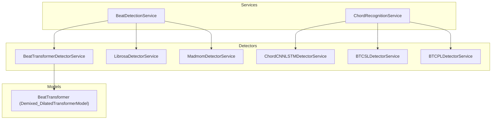
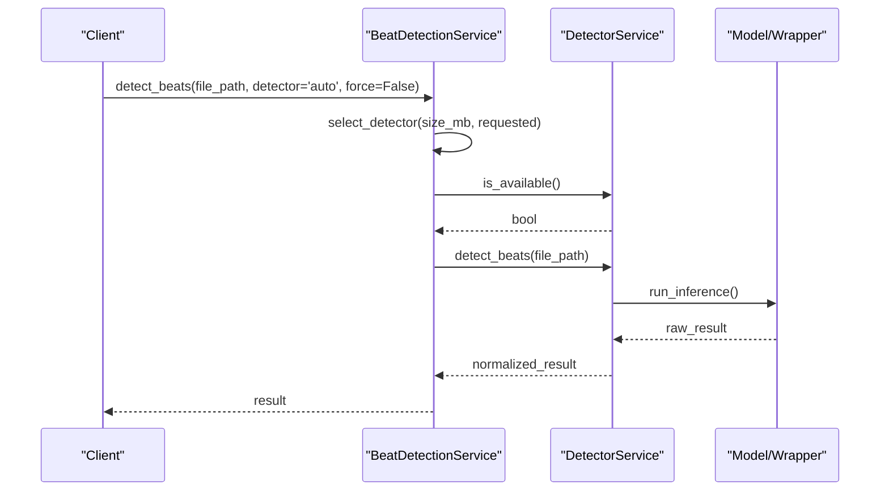
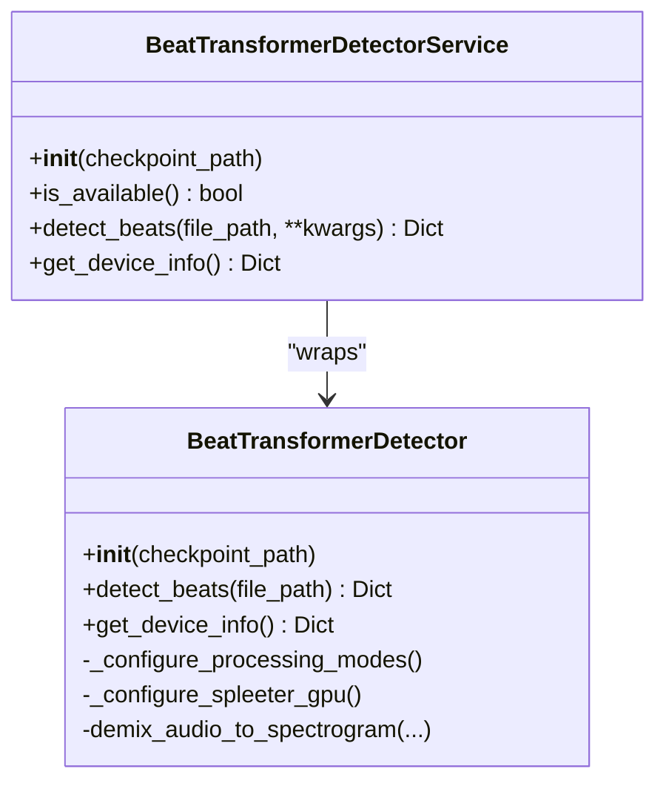
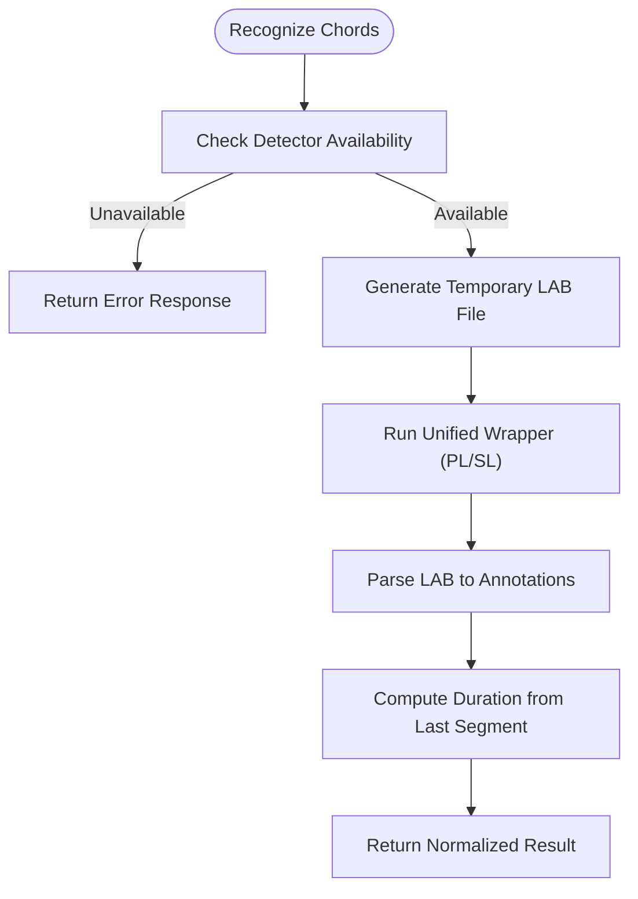
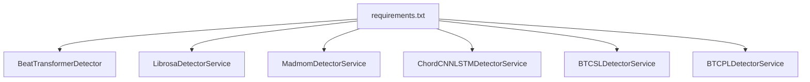

# Detector Implementations

<cite>
**Referenced Files in This Document**
- [beat_transformer_detector.py](file://python_backend/services/detectors/beat_transformer_detector.py)
- [btc_pl_detector.py](file://python_backend/services/detectors/btc_pl_detector.py)
- [btc_sl_detector.py](file://python_backend/services/detectors/btc_sl_detector.py)
- [chord_cnn_lstm_detector.py](file://python_backend/services/detectors/chord_cnn_lstm_detector.py)
- [librosa_detector.py](file://python_backend/services/detectors/librosa_detector.py)
- [madmom_detector.py](file://python_backend/services/detectors/madmom_detector.py)
- [beat_detection_service.py](file://python_backend/services/audio/beat_detection_service.py)
- [chord_recognition_service.py](file://python_backend/services/audio/chord_recognition_service.py)
- [beat_transformer.py](file://python_backend/models/beat_transformer.py)
- [btc_config.yaml](file://python_backend/config/btc_config.yaml)
- [chord_mappings.py](file://python_backend/utils/chord_mappings.py)
- [paths.py](file://python_backend/utils/paths.py)
- [requirements.txt](file://python_backend/requirements.txt)
</cite>

## Table of Contents
1. [Introduction](#introduction)
2. [Project Structure](#project-structure)
3. [Core Components](#core-components)
4. [Architecture Overview](#architecture-overview)
5. [Detailed Component Analysis](#detailed-component-analysis)
6. [Dependency Analysis](#dependency-analysis)
7. [Performance Considerations](#performance-considerations)
8. [Troubleshooting Guide](#troubleshooting-guide)
9. [Conclusion](#conclusion)
10. [Appendices](#appendices)

## Introduction
This document describes the detector implementations powering ChordMiniApp’s machine learning capabilities for beat and chord detection. It covers the Beat-Transformer, BTC variants (PL/SL), Chord-CNN-LSTM, Librosa, and madmom detectors. For each detector, we explain algorithmic differences, performance characteristics, input/output formats, configuration parameters, model loading and initialization, resource management, and selection/fallback strategies. We also provide benchmarking insights, accuracy considerations, computational complexity analysis, troubleshooting tips, and optimization techniques tailored to different audio characteristics.

## Project Structure
The detector ecosystem is organized around service wrappers that normalize outputs and orchestrate model selection and fallback strategies. Beat detection and chord recognition are handled by dedicated services that coordinate multiple detector backends.

**Diagram sources**
- [beat_detection_service.py:20-31](file://python_backend/services/audio/beat_detection_service.py#L20-L31)
- [chord_recognition_service.py:25-36](file://python_backend/services/audio/chord_recognition_service.py#L25-L36)
- [beat_transformer_detector.py:15-71](file://python_backend/services/detectors/beat_transformer_detector.py#L15-L71)
- [librosa_detector.py:14-41](file://python_backend/services/detectors/librosa_detector.py#L14-L41)
- [madmom_detector.py:14-44](file://python_backend/services/detectors/madmom_detector.py#L14-L44)
- [chord_cnn_lstm_detector.py:17-76](file://python_backend/services/detectors/chord_cnn_lstm_detector.py#L17-L76)
- [btc_sl_detector.py:17-85](file://python_backend/services/detectors/btc_sl_detector.py#L17-L85)
- [btc_pl_detector.py:17-85](file://python_backend/services/detectors/btc_pl_detector.py#L17-L85)
- [beat_transformer.py:259-356](file://python_backend/models/beat_transformer.py#L259-L356)

**Section sources**
- [beat_detection_service.py:1-348](file://python_backend/services/audio/beat_detection_service.py#L1-L348)
- [chord_recognition_service.py:1-322](file://python_backend/services/audio/chord_recognition_service.py#L1-L322)

## Core Components
- Beat detection service orchestrates three backends: Beat-Transformer, Librosa, and Madmom. It selects the best detector based on availability and file size constraints, normalizes outputs, and enriches results with metadata.
- Chord recognition service orchestrates three backends: Chord-CNN-LSTM, BTC-SL, and BTC-PL. It manages detector availability, file-size limits, chord dictionary selection, and optional Spleeter-based vocal separation.

Key responsibilities:
- Detector availability checks and lazy initialization
- Unified result normalization across detectors
- Size-aware detector selection and fallback
- Optional audio separation for improved accuracy

**Section sources**
- [beat_detection_service.py:20-162](file://python_backend/services/audio/beat_detection_service.py#L20-L162)
- [chord_recognition_service.py:25-172](file://python_backend/services/audio/chord_recognition_service.py#L25-L172)

## Architecture Overview
The detector architecture follows a service-wrapper pattern. Each detector exposes a normalized interface with:
- is_available(): checks runtime availability
- detect_beats()/recognize_chords(): runs inference and returns a standardized dictionary
- Optional model/device info retrieval

**Diagram sources**
- [beat_detection_service.py:53-162](file://python_backend/services/audio/beat_detection_service.py#L53-L162)
- [beat_transformer_detector.py:31-147](file://python_backend/services/detectors/beat_transformer_detector.py#L31-L147)
- [librosa_detector.py:23-124](file://python_backend/services/detectors/librosa_detector.py#L23-L124)
- [madmom_detector.py:23-158](file://python_backend/services/detectors/madmom_detector.py#L23-L158)

## Detailed Component Analysis

### Beat-Transformer Detector
- Algorithmic approach: Transformer-based model with dilated attention, operating on 5-channel spectrograms derived from Spleeter 5-stems separation. Uses DBN-based beat and downbeat tracking with configurable time signature support.
- Inputs: Audio file path; optional checkpoint path; internally uses Spleeter for 5-stems separation and librosa STFT/Mel filters.
- Outputs: Normalized dictionary with beats, downbeats, BPM, time signature, duration, processing metrics, and model metadata.
- Initialization and resource management:
  - Environment-aware device selection (local development enables GPU acceleration; production forces CPU).
  - Robust Spleeter integration with local cache probing and compatibility fixes for click and TensorFlow/MPS.
  - DBN processors configured with tempo bounds and frame rates.
- Configuration parameters:
  - Model hyperparameters (layers, heads, hidden size) defined in the model class.
  - Feature parameters (hop length, sample rate, Mel bins) aligned with training specs.
- Performance characteristics:
  - Slower than Librosa/madmom due to deep learning and 5-stems separation.
  - Stronger accuracy across diverse time signatures and complex audio.
- Use cases:
  - High-accuracy beat tracking on varied music genres.
  - Applications requiring flexible time signature modeling.

**Diagram sources**
- [beat_transformer_detector.py:15-163](file://python_backend/services/detectors/beat_transformer_detector.py#L15-L163)
- [beat_transformer.py:259-581](file://python_backend/models/beat_transformer.py#L259-L581)

**Section sources**
- [beat_transformer_detector.py:15-163](file://python_backend/services/detectors/beat_transformer_detector.py#L15-L163)
- [beat_transformer.py:259-581](file://python_backend/models/beat_transformer.py#L259-L581)

### Librosa Detector
- Algorithmic approach: Classical signal processing beat tracking using librosa’s beat tracking with tempo estimation and simple downbeat heuristic (every fourth beat).
- Inputs: Audio file path.
- Outputs: Normalized dictionary with beats, downbeats, BPM, time signature placeholder, duration, and processing metrics.
- Performance characteristics:
  - Fastest among the beat detectors.
  - Less accurate on complex or heterogeneous tracks.
- Use cases:
  - Lightweight, quick beat detection for short or simple audio segments.

**Section sources**
- [librosa_detector.py:14-124](file://python_backend/services/detectors/librosa_detector.py#L14-L124)

### Madmom Detector
- Algorithmic approach: Neural beat tracking with RNN activation followed by DBN beat tracking; provides heuristic downbeat candidates for 3/4 and 4/4 meters.
- Inputs: Audio file path.
- Outputs: Normalized dictionary with beats, default downbeats, alternative candidates, BPM, time signature placeholder, duration, and processing metrics.
- Performance characteristics:
  - Balanced speed and accuracy; strong baseline for common meters.
- Use cases:
  - General-purpose beat detection with reasonable speed and accuracy.

**Section sources**
- [madmom_detector.py:14-158](file://python_backend/services/detectors/madmom_detector.py#L14-L158)

### Chord-CNN-LSTM Detector
- Algorithmic approach: CNN-LSTM neural network for chord recognition; supports multiple chord dictionaries (full, ismir2017, submission, extended).
- Inputs: Audio file path; chord dictionary selection.
- Outputs: Normalized dictionary with chord segments (start, end, label, confidence), total chords, duration, processing metrics, and model metadata.
- Availability and initialization:
  - Checks for required model files and imports the recognition module.
  - Includes a fallback to mock data for testing response format.
- Supported chord dictionaries:
  - full, ismir2017, submission, extended (model-specific mapping).
- Performance characteristics:
  - Moderate speed; good accuracy for standard chord vocabularies.
- Use cases:
  - Reliable chord recognition with standardized dictionaries.

**Section sources**
- [chord_cnn_lstm_detector.py:17-249](file://python_backend/services/detectors/chord_cnn_lstm_detector.py#L17-L249)
- [chord_mappings.py:112-151](file://python_backend/utils/chord_mappings.py#L112-L151)

### BTC Variants (PL/SL)
- Algorithmic approach: Transformer-based models trained with pseudo-labeling (PL) and self-labeling (SL) strategies; operate on large vocabulary (170 chords).
- Inputs: Audio file path; internal LAB file generation and parsing.
- Outputs: Normalized dictionary with chord segments (start, end, label, confidence), total chords, duration, processing metrics, and model metadata.
- Availability and initialization:
  - Validates model directories and required files (configs and checkpoints).
  - Uses a unified wrapper for generating LAB files and parsing results.
- Configuration parameters:
  - Feature and model hyperparameters defined in BTC configuration YAML.
- Performance characteristics:
  - High accuracy on large vocabularies; moderate to slower inference speed.
- Use cases:
  - Accurate chord recognition with rich chord labeling.

**Diagram sources**
- [btc_sl_detector.py:87-169](file://python_backend/services/detectors/btc_sl_detector.py#L87-L169)
- [btc_pl_detector.py:87-169](file://python_backend/services/detectors/btc_pl_detector.py#L87-L169)

**Section sources**
- [btc_sl_detector.py:17-246](file://python_backend/services/detectors/btc_sl_detector.py#L17-L246)
- [btc_pl_detector.py:17-246](file://python_backend/services/detectors/btc_pl_detector.py#L17-L246)
- [btc_config.yaml:1-61](file://python_backend/config/btc_config.yaml#L1-L61)

## Dependency Analysis
- Runtime dependencies include librosa, soundfile, spleeter, librosa-compatible madmom, PyTorch/Torchaudio, and TensorFlow (for Spleeter GPU acceleration).
- Beat-Transformer integrates Spleeter for 5-stems separation and uses DBN processors for beat/downbeat tracking.
- Detector services depend on centralized path utilities and logging.

**Diagram sources**
- [requirements.txt:1-131](file://python_backend/requirements.txt#L1-L131)

**Section sources**
- [requirements.txt:1-131](file://python_backend/requirements.txt#L1-L131)
- [paths.py:14-102](file://python_backend/utils/paths.py#L14-L102)

## Performance Considerations
- Beat detection:
  - Librosa: fastest; simplest heuristics; suitable for short or simple audio.
  - Madmom: balanced speed/accuracy; robust for common meters.
  - Beat-Transformer: slowest; highest accuracy across diverse time signatures and complex audio.
- Chord recognition:
  - Chord-CNN-LSTM: moderate speed; reliable for standard dictionaries.
  - BTC-SL/PL: higher accuracy on large vocabularies; moderate to slower inference.
- File size policy:
  - Services enforce size limits per detector to balance quality and throughput.
- GPU/CPU considerations:
  - Beat-Transformer enables GPU acceleration in local development; production defaults to CPU for stability.
  - Spleeter GPU acceleration is environment-aware and includes compatibility fixes.

[No sources needed since this section provides general guidance]

## Troubleshooting Guide
Common issues and resolutions:
- Beat-Transformer not available:
  - Ensure checkpoint exists and PyTorch is installed.
  - Verify Spleeter model cache presence or pre-download the 5-stems model.
  - Confirm environment allows GPU acceleration where applicable.
- Madmom import failures:
  - Install madmom with the recommended flags and pin setuptools to the compatible version.
- Librosa/Libsndfile compatibility:
  - Ensure librosa and soundfile are installed; verify audio codecs availability.
- Detector selection errors:
  - Use the detector info endpoints to inspect availability and size limits.
- Chord dictionary mismatches:
  - Validate dictionary support for the selected model; fall back to defaults if unsupported.
- Spleeter separation failures:
  - Check disk space and permissions; ensure ffmpeg-python is available.

**Section sources**
- [beat_detection_service.py:312-339](file://python_backend/services/audio/beat_detection_service.py#L312-L339)
- [chord_recognition_service.py:298-322](file://python_backend/services/audio/chord_recognition_service.py#L298-L322)
- [beat_transformer.py:616-711](file://python_backend/models/beat_transformer.py#L616-L711)
- [requirements.txt:58-64](file://python_backend/requirements.txt#L58-L64)

## Conclusion
ChordMiniApp’s detector implementations combine classical and deep learning approaches to deliver robust beat and chord recognition. The service layer ensures consistent behavior across detectors, while model-specific wrappers encapsulate initialization, device management, and inference. Detector selection and fallback strategies optimize for file size, accuracy, and performance. By leveraging Spleeter and environment-aware configurations, the system balances accuracy and reliability across diverse deployment environments.

[No sources needed since this section summarizes without analyzing specific files]

## Appendices

### Detector Interface Contracts and Output Formats
- Beat detection outputs:
  - Keys: success, beats, downbeats, total_beats, total_downbeats, bpm, time_signature, duration, model_used, model_name, processing_time, error (optional).
- Chord recognition outputs:
  - Keys: success, chords (list of dicts with start, end, chord, confidence), total_chords, duration, model_used, model_name, chord_dict, processing_time, error (optional).

**Section sources**
- [beat_transformer_detector.py:73-147](file://python_backend/services/detectors/beat_transformer_detector.py#L73-L147)
- [librosa_detector.py:43-124](file://python_backend/services/detectors/librosa_detector.py#L43-L124)
- [madmom_detector.py:46-158](file://python_backend/services/detectors/madmom_detector.py#L46-L158)
- [chord_cnn_lstm_detector.py:78-182](file://python_backend/services/detectors/chord_cnn_lstm_detector.py#L78-L182)
- [btc_sl_detector.py:87-169](file://python_backend/services/detectors/btc_sl_detector.py#L87-L169)
- [btc_pl_detector.py:87-169](file://python_backend/services/detectors/btc_pl_detector.py#L87-L169)

### Detector Selection Strategy and Fallback
- Beat detection:
  - Preference order: madmom > beat-transformer > librosa, considering file size limits.
- Chord recognition:
  - Preference order: chord-cnn-lstm > btc-sl > btc-pl, considering file size limits and dictionary support.

**Section sources**
- [beat_detection_service.py:53-162](file://python_backend/services/audio/beat_detection_service.py#L53-L162)
- [chord_recognition_service.py:61-172](file://python_backend/services/audio/chord_recognition_service.py#L61-L172)

### Model Loading Mechanisms and Initialization Procedures
- Beat-Transformer:
  - Environment-aware device selection; loads checkpoint with MPS-compatible conversion; initializes DBN processors; integrates Spleeter with cache probing and compatibility fixes.
- Chord-CNN-LSTM:
  - Validates model directory and imports recognition module; includes mock data fallback for testing.
- BTC variants:
  - Validates config and checkpoint presence; uses unified wrapper to generate and parse LAB files.

**Section sources**
- [beat_transformer.py:271-356](file://python_backend/models/beat_transformer.py#L271-L356)
- [chord_cnn_lstm_detector.py:32-76](file://python_backend/services/detectors/chord_cnn_lstm_detector.py#L32-L76)
- [btc_sl_detector.py:32-85](file://python_backend/services/detectors/btc_sl_detector.py#L32-L85)
- [btc_pl_detector.py:32-85](file://python_backend/services/detectors/btc_pl_detector.py#L32-L85)

### Configuration Parameters
- BTC configuration:
  - Audio processing settings (sample rate, segment length), feature parameters (bins, hop length), experiment settings (learning rate, batch size), model hyperparameters (layers, heads, hidden size), and model paths.

**Section sources**
- [btc_config.yaml:1-61](file://python_backend/config/btc_config.yaml#L1-L61)

### Computational Complexity Analysis
- Beat-Transformer:
  - Deep learning inference plus 5-stems separation; complexity dominated by model forward pass and separation computation.
- Madmom:
  - Neural activation and DBN tracking; moderate complexity.
- Librosa:
  - Signal processing transforms; linear complexity with audio length.
- Chord-CNN-LSTM:
  - CNN-LSTM forward pass; complexity scales with sequence length and model depth.
- BTC variants:
  - Transformer-based inference; complexity scales with sequence length and number of layers.

[No sources needed since this section provides general guidance]