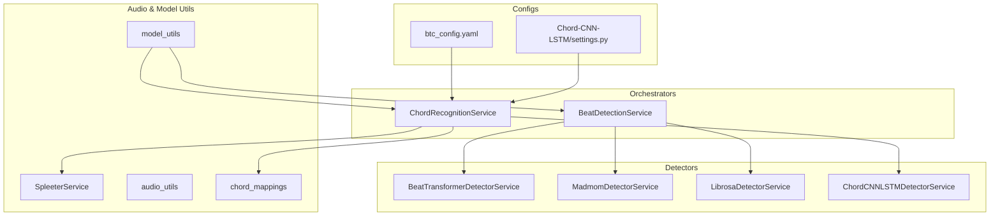
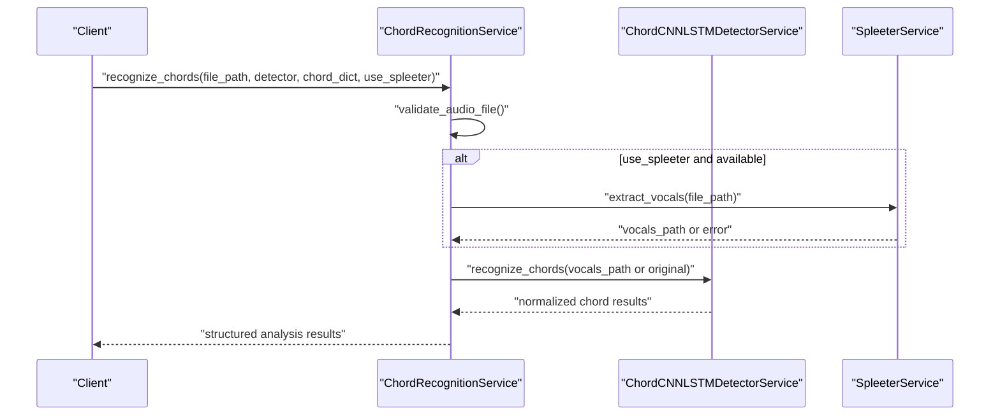
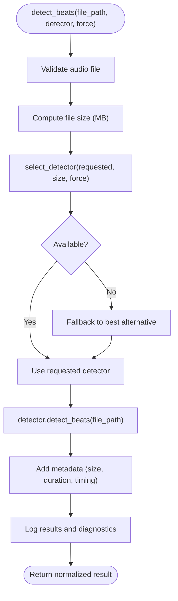
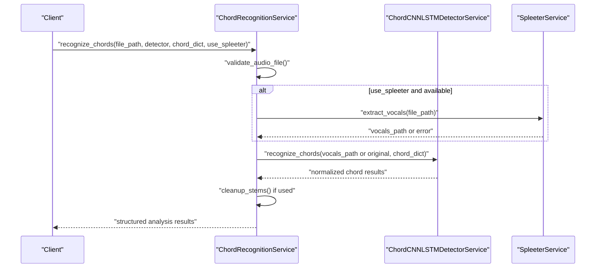
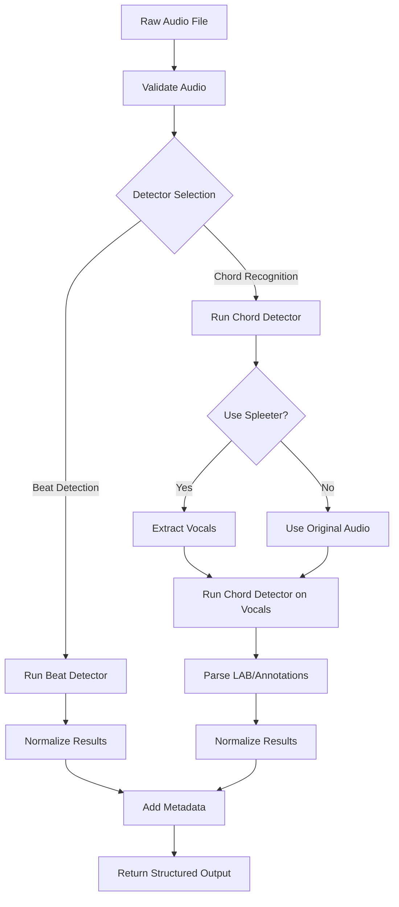
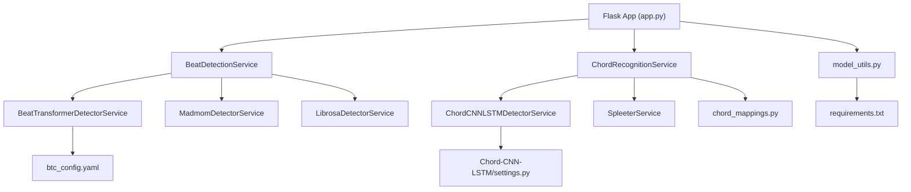

# Machine Learning Services

<cite>
**Referenced Files in This Document**
- [beat_detection_service.py](file://python_backend/services/audio/beat_detection_service.py)
- [chord_recognition_service.py](file://python_backend/services/audio/chord_recognition_service.py)
- [beat_transformer_detector.py](file://python_backend/services/detectors/beat_transformer_detector.py)
- [chord_cnn_lstm_detector.py](file://python_backend/services/detectors/chord_cnn_lstm_detector.py)
- [madmom_detector.py](file://python_backend/services/detectors/madmom_detector.py)
- [librosa_detector.py](file://python_backend/services/detectors/librosa_detector.py)
- [spleeter_service.py](file://python_backend/services/audio/spleeter_service.py)
- [audio_utils.py](file://python_backend/services/audio/audio_utils.py)
- [model_utils.py](file://python_backend/utils/model_utils.py)
- [chord_mappings.py](file://python_backend/utils/chord_mappings.py)
- [btc_config.yaml](file://python_backend/config/btc_config.yaml)
- [settings.py](file://python_backend/models/Chord-CNN-LSTM/settings.py)
- [requirements.txt](file://python_backend/requirements.txt)
- [app.py](file://python_backend/app.py)
</cite>

## Table of Contents
1. [Introduction](#introduction)
2. [Project Structure](#project-structure)
3. [Core Components](#core-components)
4. [Architecture Overview](#architecture-overview)
5. [Detailed Component Analysis](#detailed-component-analysis)
6. [Dependency Analysis](#dependency-analysis)
7. [Performance Considerations](#performance-considerations)
8. [Troubleshooting Guide](#troubleshooting-guide)
9. [Conclusion](#conclusion)
10. [Appendices](#appendices)

## Introduction
This document explains the machine learning services powering ChordMiniApp’s audio analysis pipeline. It covers beat detection, chord recognition, and audio processing capabilities, detailing detector implementations (Beat-Transformer, madmom, Librosa, Chord-CNN-LSTM), model management, orchestration, integration with external libraries (Spleeter, librosa), and performance optimization strategies. It also documents model configuration, training data requirements, evaluation metrics, and troubleshooting guidance for common ML issues.

## Project Structure
The ML services are organized under a clear separation of concerns:
- Orchestrators: BeatDetectionService and ChordRecognitionService manage detector selection, file-size-aware routing, and fallback strategies.
- Detectors: Individual services wrap external libraries and models with a normalized interface.
- Audio Utilities: Provide audio validation, silence trimming, duration estimation, and resampling.
- Model Management: Availability checks, device info, and model directory introspection.
- Configuration: YAML-based model configuration for BTC models; settings for Chord-CNN-LSTM.

**Diagram sources**
- [beat_detection_service.py:20-348](file://python_backend/services/audio/beat_detection_service.py#L20-L348)
- [chord_recognition_service.py:25-322](file://python_backend/services/audio/chord_recognition_service.py#L25-L322)
- [beat_transformer_detector.py:15-163](file://python_backend/services/detectors/beat_transformer_detector.py#L15-L163)
- [madmom_detector.py:14-158](file://python_backend/services/detectors/madmom_detector.py#L14-L158)
- [librosa_detector.py:14-124](file://python_backend/services/detectors/librosa_detector.py#L14-L124)
- [chord_cnn_lstm_detector.py:17-249](file://python_backend/services/detectors/chord_cnn_lstm_detector.py#L17-L249)
- [spleeter_service.py:17-286](file://python_backend/services/audio/spleeter_service.py#L17-L286)
- [audio_utils.py:12-131](file://python_backend/services/audio/audio_utils.py#L12-L131)
- [model_utils.py:12-326](file://python_backend/utils/model_utils.py#L12-L326)
- [chord_mappings.py:12-319](file://python_backend/utils/chord_mappings.py#L12-L319)
- [btc_config.yaml:1-61](file://python_backend/config/btc_config.yaml#L1-L61)
- [settings.py:1-18](file://python_backend/models/Chord-CNN-LSTM/settings.py#L1-L18)

**Section sources**
- [beat_detection_service.py:20-348](file://python_backend/services/audio/beat_detection_service.py#L20-L348)
- [chord_recognition_service.py:25-322](file://python_backend/services/audio/chord_recognition_service.py#L25-L322)
- [model_utils.py:12-326](file://python_backend/utils/model_utils.py#L12-L326)

## Core Components
- BeatDetectionService: Central orchestrator for beat detection with automatic detector selection, file-size-aware routing, and fallback strategies. It supports Beat-Transformer, madmom, and Librosa detectors.
- ChordRecognitionService: Central orchestrator for chord recognition with detector selection, chord dictionary validation, optional Spleeter-based vocal separation, and metadata enrichment.
- Detector Wrappers: Normalized interfaces for Beat-Transformer, madmom, Librosa, and Chord-CNN-LSTM, returning consistent result schemas.
- Audio Utilities: Validation, silence trimming, duration estimation, resampling, and format handling.
- Model Management: Availability checks, device info, and model directory introspection for Spleeter, Beat-Transformer, Chord-CNN-LSTM, BTC, and deep learning frameworks.
- Chord Dictionary Management: Centralized mapping of chord vocabularies and normalization utilities.

**Section sources**
- [beat_detection_service.py:20-348](file://python_backend/services/audio/beat_detection_service.py#L20-L348)
- [chord_recognition_service.py:25-322](file://python_backend/services/audio/chord_recognition_service.py#L25-L322)
- [beat_transformer_detector.py:15-163](file://python_backend/services/detectors/beat_transformer_detector.py#L15-L163)
- [madmom_detector.py:14-158](file://python_backend/services/detectors/madmom_detector.py#L14-L158)
- [librosa_detector.py:14-124](file://python_backend/services/detectors/librosa_detector.py#L14-L124)
- [chord_cnn_lstm_detector.py:17-249](file://python_backend/services/detectors/chord_cnn_lstm_detector.py#L17-L249)
- [audio_utils.py:12-131](file://python_backend/services/audio/audio_utils.py#L12-L131)
- [model_utils.py:12-326](file://python_backend/utils/model_utils.py#L12-L326)
- [chord_mappings.py:12-319](file://python_backend/utils/chord_mappings.py#L12-L319)

## Architecture Overview
The ML services follow a layered architecture:
- Orchestrators accept requests, validate inputs, and select appropriate detectors based on availability and file size.
- Detectors encapsulate model-specific logic and return normalized results.
- Audio utilities provide pre/post-processing steps.
- Model management utilities provide runtime availability and device information.
- Configuration files define model hyperparameters and paths.

**Diagram sources**
- [chord_recognition_service.py:173-296](file://python_backend/services/audio/chord_recognition_service.py#L173-L296)
- [chord_cnn_lstm_detector.py:78-182](file://python_backend/services/detectors/chord_cnn_lstm_detector.py#L78-L182)
- [spleeter_service.py:180-198](file://python_backend/services/audio/spleeter_service.py#L180-L198)

## Detailed Component Analysis

### Beat Detection Service
- Responsibilities:
  - Detector selection among Beat-Transformer, madmom, and Librosa.
  - File-size-aware routing with configurable limits.
  - Fallback strategies when requested detector is unavailable or file exceeds limits.
  - Metadata enrichment (file size, detector used, processing time, duration).
- Selection logic:
  - Preference order varies by file size; favors madmom for small files, Beat-Transformer for medium, and madmom/librosa for large files.
  - Enforces size limits per detector; falls back to alternatives if needed.
- Output normalization:
  - Consistent keys: success flag, beats, downbeats, total counts, BPM, time signature, duration, model identifiers, processing time.

**Diagram sources**
- [beat_detection_service.py:163-310](file://python_backend/services/audio/beat_detection_service.py#L163-L310)

**Section sources**
- [beat_detection_service.py:20-348](file://python_backend/services/audio/beat_detection_service.py#L20-L348)

### Chord Recognition Service
- Responsibilities:
  - Detector selection among Chord-CNN-LSTM, BTC-SL, and BTC-PL.
  - Chord dictionary validation and default selection per model.
  - Optional Spleeter-based vocal separation to improve recognition accuracy.
  - Metadata enrichment and cleanup of temporary files.
- Spleeter integration:
  - Uses 2-stem separation by default; cleans up generated stems after inference.
- Output normalization:
  - Consistent keys: success flag, chord events with start/end times, total count, duration, model identifiers, processing time, and chord dictionary used.

**Diagram sources**
- [chord_recognition_service.py:173-296](file://python_backend/services/audio/chord_recognition_service.py#L173-L296)
- [chord_cnn_lstm_detector.py:78-182](file://python_backend/services/detectors/chord_cnn_lstm_detector.py#L78-L182)
- [spleeter_service.py:180-198](file://python_backend/services/audio/spleeter_service.py#L180-L198)

**Section sources**
- [chord_recognition_service.py:25-322](file://python_backend/services/audio/chord_recognition_service.py#L25-L322)
- [spleeter_service.py:17-286](file://python_backend/services/audio/spleeter_service.py#L17-L286)
- [chord_mappings.py:112-150](file://python_backend/utils/chord_mappings.py#L112-L150)

### Detector Implementations

#### Beat-Transformer Detector
- Provides a normalized interface to the BeatTransformerDetector.
- Availability checked via model import and checkpoint presence.
- Returns normalized beat and downbeat arrays, BPM, time signature, duration, and processing time.

**Section sources**
- [beat_transformer_detector.py:15-163](file://python_backend/services/detectors/beat_transformer_detector.py#L15-L163)

#### Madmom Detector
- Implements RNN beat activation and DBN beat tracking.
- Heuristic downbeat candidates for 3/4 and 4/4 meters.
- Returns normalized results with candidate downbeats and metadata.

**Section sources**
- [madmom_detector.py:14-158](file://python_backend/services/detectors/madmom_detector.py#L14-L158)

#### Librosa Detector
- Uses librosa beat tracking with tempo estimation and simple downbeat heuristic.
- Returns normalized results with BPM, time signature placeholder, and duration.

**Section sources**
- [librosa_detector.py:14-124](file://python_backend/services/detectors/librosa_detector.py#L14-L124)

#### Chord-CNN-LSTM Detector
- Dynamically imports model code from the model directory.
- Generates a temporary LAB file and parses labeled chord segments.
- Supports multiple chord dictionaries; returns normalized chord events with durations.

**Section sources**
- [chord_cnn_lstm_detector.py:17-249](file://python_backend/services/detectors/chord_cnn_lstm_detector.py#L17-L249)

### Model Management and Configuration
- Availability checks:
  - Spleeter, Beat-Transformer, Chord-CNN-LSTM, Genius, BTC, PyTorch, and TensorFlow availability are checked independently.
  - BTC availability includes model file existence and required dependencies (PyTorch, NumPy).
- Device information:
  - PyTorch availability and device selection (CUDA/MPS/CPU) with device names and counts.
- Model directory introspection:
  - Lists files, subdirectories, and sizes for model directories.
- BTC configuration:
  - Feature extraction parameters, model hyperparameters, and model paths.
- Chord-CNN-LSTM settings:
  - Sample rates, hop lengths, and default chord dictionary.

**Section sources**
- [model_utils.py:12-326](file://python_backend/utils/model_utils.py#L12-L326)
- [btc_config.yaml:1-61](file://python_backend/config/btc_config.yaml#L1-L61)
- [settings.py:1-18](file://python_backend/models/Chord-CNN-LSTM/settings.py#L1-L18)

### Audio Processing Pipeline
End-to-end pipeline from raw audio to structured analysis:
1. Input validation and optional silence trimming.
2. Detector selection based on file size and availability.
3. Model inference with normalized output.
4. Metadata enrichment (duration, processing time, detector info).
5. Optional Spleeter separation for chord recognition.
6. Cleanup of temporary files and stems.

**Diagram sources**
- [audio_utils.py:12-131](file://python_backend/services/audio/audio_utils.py#L12-L131)
- [beat_detection_service.py:163-310](file://python_backend/services/audio/beat_detection_service.py#L163-L310)
- [chord_recognition_service.py:173-296](file://python_backend/services/audio/chord_recognition_service.py#L173-L296)
- [chord_cnn_lstm_detector.py:78-182](file://python_backend/services/detectors/chord_cnn_lstm_detector.py#L78-L182)
- [spleeter_service.py:180-198](file://python_backend/services/audio/spleeter_service.py#L180-L198)

**Section sources**
- [audio_utils.py:12-131](file://python_backend/services/audio/audio_utils.py#L12-L131)
- [beat_detection_service.py:163-310](file://python_backend/services/audio/beat_detection_service.py#L163-L310)
- [chord_recognition_service.py:173-296](file://python_backend/services/audio/chord_recognition_service.py#L173-L296)

## Dependency Analysis
External libraries and integrations:
- librosa: Core audio loading, duration, and beat tracking.
- Spleeter: Audio separation into stems (vocals/accompaniment/instruments).
- madmom: Neural beat detection with RNN and DBN processing.
- PyTorch/TensorFlow: Deep learning frameworks for BTC and Chord-CNN-LSTM.
- Pretty MIDI, mir_eval, mido: Music analysis and evaluation utilities.
- Requests, httpx: HTTP clients for external services.

**Diagram sources**
- [app.py:1-186](file://python_backend/app.py#L1-L186)
- [beat_detection_service.py:20-348](file://python_backend/services/audio/beat_detection_service.py#L20-L348)
- [chord_recognition_service.py:25-322](file://python_backend/services/audio/chord_recognition_service.py#L25-L322)
- [model_utils.py:12-326](file://python_backend/utils/model_utils.py#L12-L326)
- [requirements.txt:1-131](file://python_backend/requirements.txt#L1-L131)
- [btc_config.yaml:1-61](file://python_backend/config/btc_config.yaml#L1-L61)
- [settings.py:1-18](file://python_backend/models/Chord-CNN-LSTM/settings.py#L1-L18)

**Section sources**
- [requirements.txt:1-131](file://python_backend/requirements.txt#L1-L131)
- [app.py:1-186](file://python_backend/app.py#L1-L186)

## Performance Considerations
- Detector selection by file size:
  - Small files: madmom preferred for speed.
  - Medium files: madmom or Beat-Transformer.
  - Large files: madmom or Librosa to reduce memory footprint.
- Spleeter separation:
  - Optional; improves chord recognition accuracy but adds overhead; cleaned up after use.
- Memory management:
  - Spleeter creates a new separator per request to avoid memory leaks.
  - Temporary files are removed after processing.
- Batch processing:
  - Current orchestrators operate on single files; batch processing can be introduced at the API layer by iterating over lists and parallelizing with worker pools.
- GPU acceleration:
  - PyTorch availability and device selection are checked; CUDA/MPS devices are leveraged when available.
- Logging and diagnostics:
  - Extensive logging for processing times, detector usage, and beat-per-measure distributions to aid tuning.

[No sources needed since this section provides general guidance]

## Troubleshooting Guide
Common issues and resolutions:
- Beat-Transformer not available:
  - Ensure model import succeeds and checkpoint path is valid; check availability via model_utils.
- madmom import failures:
  - pkg_resources compatibility issue; pin setuptools to a compatible version as indicated in logs.
- Librosa detection errors:
  - Verify librosa installation and audio file accessibility; fallback to validation checks.
- Chord-CNN-LSTM recognition failures:
  - Confirm model directory and required files exist; temporarily mock data is used for response format validation.
- Spleeter separation errors:
  - Validate model availability and output directory permissions; ensure temporary directories are cleaned up on failure.
- Model configuration mismatches:
  - Verify btc_config.yaml and Chord-CNN-LSTM settings align with training data and evaluation metrics.

**Section sources**
- [model_utils.py:12-326](file://python_backend/utils/model_utils.py#L12-L326)
- [madmom_detector.py:33-44](file://python_backend/services/detectors/madmom_detector.py#L33-L44)
- [chord_cnn_lstm_detector.py:42-76](file://python_backend/services/detectors/chord_cnn_lstm_detector.py#L42-L76)
- [spleeter_service.py:37-46](file://python_backend/services/audio/spleeter_service.py#L37-L46)

## Conclusion
The ChordMiniApp ML services provide a robust, modular framework for beat detection and chord recognition. Through detector orchestration, model management, and integration with librosa, Spleeter, and deep learning frameworks, the system balances accuracy, performance, and reliability. The normalized interfaces and comprehensive availability checks ensure graceful fallbacks and predictable behavior across diverse environments.

[No sources needed since this section summarizes without analyzing specific files]

## Appendices

### Model Configuration and Training Data
- BTC configuration:
  - Feature extraction parameters, model hyperparameters, and model paths are defined in btc_config.yaml.
- Chord-CNN-LSTM settings:
  - Sample rates, hop lengths, and default chord dictionary are defined in settings.py.
- Training data requirements:
  - BTC training is orchestrated via Kubernetes Jobs with dataset symlinks and environment-controlled hyperparameters.
- Evaluation metrics:
  - mir_eval and related libraries are available for evaluation; integration points can be added at the API layer.

**Section sources**
- [btc_config.yaml:1-61](file://python_backend/config/btc_config.yaml#L1-L61)
- [settings.py:1-18](file://python_backend/models/Chord-CNN-LSTM/settings.py#L1-L18)