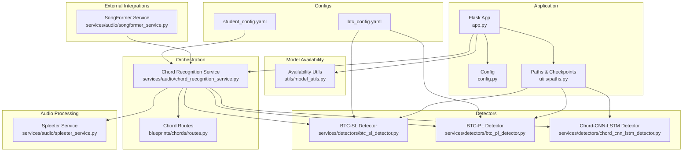
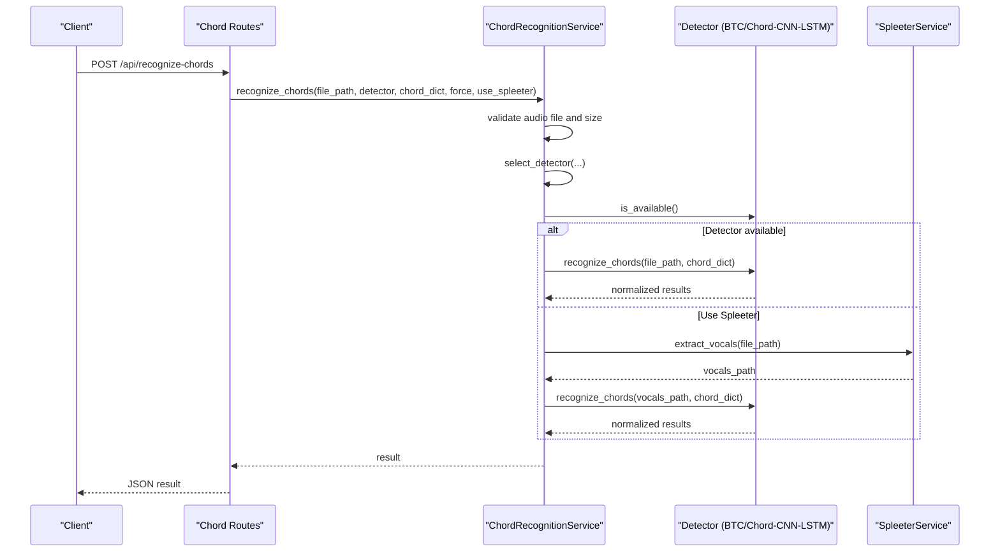
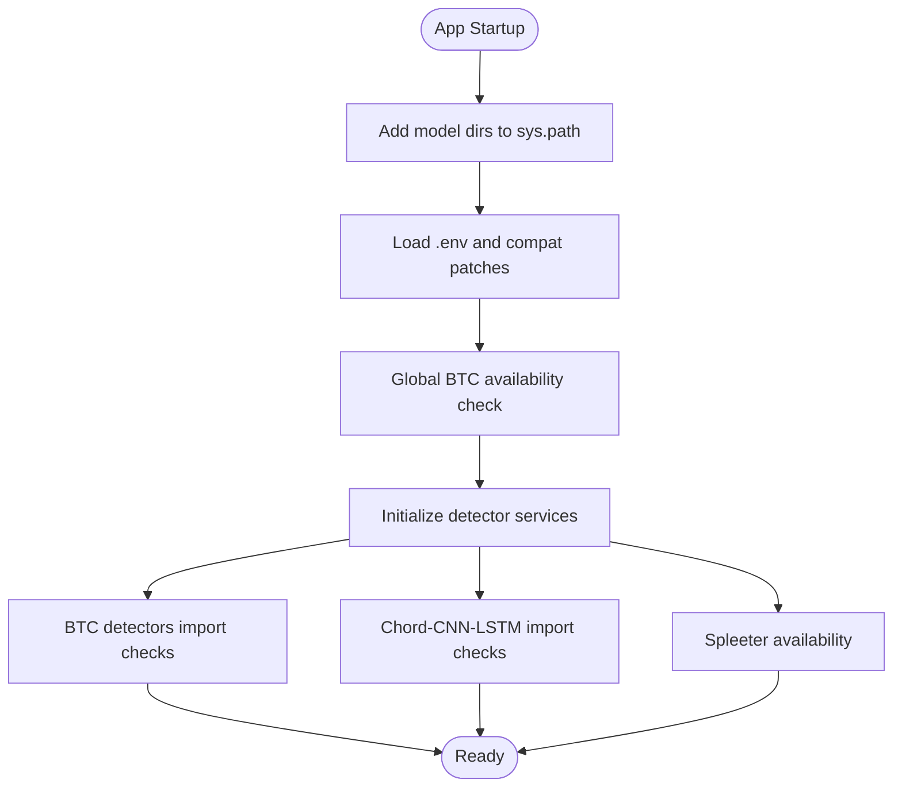
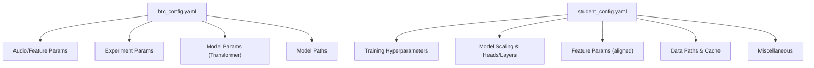
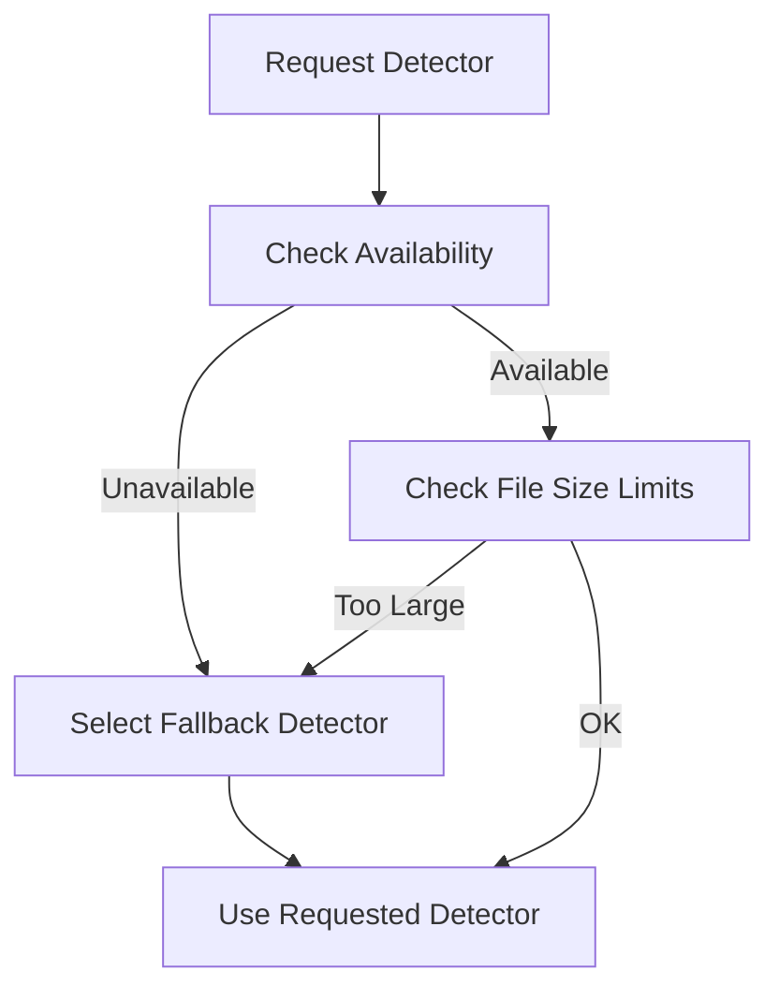
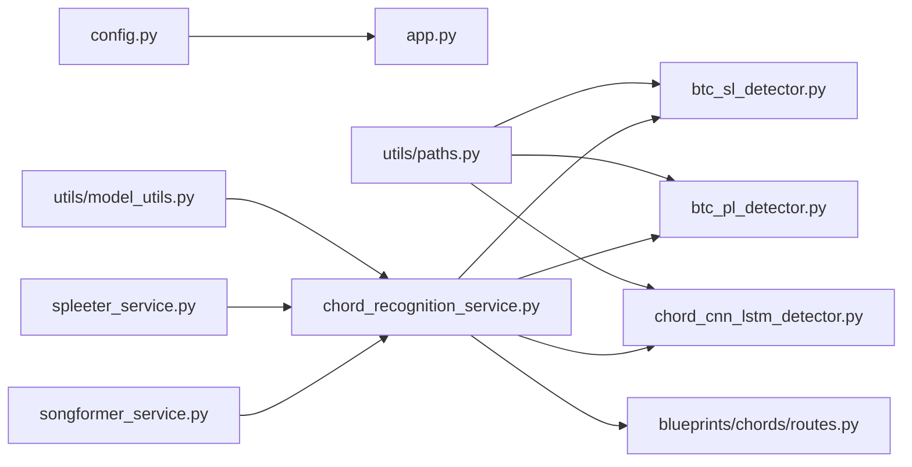

# Model Management

<cite>
**Referenced Files in This Document**
- [app.py](file://python_backend/app.py)
- [config.py](file://python_backend/config.py)
- [model_utils.py](file://python_backend/utils/model_utils.py)
- [paths.py](file://python_backend/utils/paths.py)
- [chord_recognition_service.py](file://python_backend/services/audio/chord_recognition_service.py)
- [btc_sl_detector.py](file://python_backend/services/detectors/btc_sl_detector.py)
- [btc_pl_detector.py](file://python_backend/services/detectors/btc_pl_detector.py)
- [chord_cnn_lstm_detector.py](file://python_backend/services/detectors/chord_cnn_lstm_detector.py)
- [routes.py](file://python_backend/blueprints/chords/routes.py)
- [spleeter_service.py](file://python_backend/services/audio/spleeter_service.py)
- [songformer_service.py](file://python_backend/services/audio/songformer_service.py)
- [btc_config.yaml](file://python_backend/config/btc_config.yaml)
- [student_config.yaml](file://python_backend/models/ChordMini/config/student_config.yaml)
- [requirements.txt](file://python_backend/requirements.txt)
- [docker-compose.yml](file://docker/docker-compose.yml)
</cite>

## Table of Contents
1. [Introduction](#introduction)
2. [Project Structure](#project-structure)
3. [Core Components](#core-components)
4. [Architecture Overview](#architecture-overview)
5. [Detailed Component Analysis](#detailed-component-analysis)
6. [Dependency Analysis](#dependency-analysis)
7. [Performance Considerations](#performance-considerations)
8. [Troubleshooting Guide](#troubleshooting-guide)
9. [Conclusion](#conclusion)
10. [Appendices](#appendices)

## Introduction
This document describes the model management system for the ChordMiniApp backend. It covers model loading and initialization, configuration file management, parameter validation, availability checking, fallback strategies, error handling, versioning and update procedures, compatibility checks, deployment and monitoring workflows, performance optimization, and integration with different model architectures. The focus is on the chord recognition pipeline and the BTC (Beat-Transformer-Chord) family of models, while also touching on SongFormer integration and Spleeter audio separation.

## Project Structure
The model management system spans several layers:
- Application bootstrap and configuration
- Model availability and path utilities
- Detector services for different architectures
- Centralized service orchestrating model selection and fallback
- Blueprints exposing endpoints for model testing and inference
- Configuration files for BTC and student training
- Container orchestration for deployment

**Diagram sources**
- [app.py:1-186](file://python_backend/app.py#L1-L186)
- [config.py:1-215](file://python_backend/config.py#L1-L215)
- [paths.py:1-191](file://python_backend/utils/paths.py#L1-L191)
- [model_utils.py:1-326](file://python_backend/utils/model_utils.py#L1-L326)
- [btc_sl_detector.py:1-246](file://python_backend/services/detectors/btc_sl_detector.py#L1-L246)
- [btc_pl_detector.py:1-246](file://python_backend/services/detectors/btc_pl_detector.py#L1-L246)
- [chord_cnn_lstm_detector.py:1-249](file://python_backend/services/detectors/chord_cnn_lstm_detector.py#L1-L249)
- [chord_recognition_service.py:1-322](file://python_backend/services/audio/chord_recognition_service.py#L1-L322)
- [routes.py:1-440](file://python_backend/blueprints/chords/routes.py#L1-L440)
- [spleeter_service.py:1-286](file://python_backend/services/audio/spleeter_service.py#L1-L286)
- [songformer_service.py:1-140](file://python_backend/services/audio/songformer_service.py#L1-L140)
- [btc_config.yaml:1-61](file://python_backend/config/btc_config.yaml#L1-L61)
- [student_config.yaml:1-94](file://python_backend/models/ChordMini/config/student_config.yaml#L1-L94)

**Section sources**
- [app.py:1-186](file://python_backend/app.py#L1-L186)
- [config.py:1-215](file://python_backend/config.py#L1-L215)
- [paths.py:1-191](file://python_backend/utils/paths.py#L1-L191)

## Core Components
- Application bootstrap and configuration: Initializes environment, loads .env, applies compatibility patches, sets up model paths, and performs deferred availability checks.
- Model availability utilities: Provide checks for Spleeter, Beat-Transformer, Chord-CNN-LSTM, Genius, BTC, PyTorch, and TensorFlow without loading models.
- Detector services: Encapsulate BTC-SL, BTC-PL, and Chord-CNN-LSTM with normalized interfaces, availability checks, and result parsing.
- Centralized service: Orchestrates model selection, file-size-aware fallback, chord dictionary validation, and optional Spleeter separation.
- Routes: Expose endpoints for model testing, model info, and chord recognition with validation and error handling.
- Configuration files: btc_config.yaml defines BTC model parameters and paths; student_config.yaml defines training and runtime parameters for the student model.

**Section sources**
- [app.py:1-186](file://python_backend/app.py#L1-L186)
- [model_utils.py:1-326](file://python_backend/utils/model_utils.py#L1-L326)
- [btc_sl_detector.py:1-246](file://python_backend/services/detectors/btc_sl_detector.py#L1-L246)
- [btc_pl_detector.py:1-246](file://python_backend/services/detectors/btc_pl_detector.py#L1-L246)
- [chord_cnn_lstm_detector.py:1-249](file://python_backend/services/detectors/chord_cnn_lstm_detector.py#L1-L249)
- [chord_recognition_service.py:1-322](file://python_backend/services/audio/chord_recognition_service.py#L1-L322)
- [routes.py:1-440](file://python_backend/blueprints/chords/routes.py#L1-L440)
- [btc_config.yaml:1-61](file://python_backend/config/btc_config.yaml#L1-L61)
- [student_config.yaml:1-94](file://python_backend/models/ChordMini/config/student_config.yaml#L1-L94)

## Architecture Overview
The system follows a layered architecture:
- Presentation: Flask blueprints expose endpoints for model testing and inference.
- Orchestration: A centralized service selects the appropriate detector based on availability, file size, and user preferences.
- Detection: Each detector validates its own availability and executes inference, returning normalized results.
- Utilities: Availability checks, path resolution, and logging support the orchestration and detection layers.
- External integrations: SongFormer service wraps an external runtime; Spleeter provides audio separation.

**Diagram sources**
- [routes.py:43-143](file://python_backend/blueprints/chords/routes.py#L43-L143)
- [chord_recognition_service.py:173-296](file://python_backend/services/audio/chord_recognition_service.py#L173-L296)
- [btc_sl_detector.py:87-169](file://python_backend/services/detectors/btc_sl_detector.py#L87-L169)
- [btc_pl_detector.py:87-169](file://python_backend/services/detectors/btc_pl_detector.py#L87-L169)
- [chord_cnn_lstm_detector.py:78-190](file://python_backend/services/detectors/chord_cnn_lstm_detector.py#L78-L190)
- [spleeter_service.py:180-220](file://python_backend/services/audio/spleeter_service.py#L180-L220)

## Detailed Component Analysis

### Model Loading and Initialization
- Application bootstrap adds model directories to the Python path and defers heavy imports. It performs a global BTC availability check at startup and sets feature flags accordingly.
- Detector services encapsulate initialization and import-time checks. They validate directories, required files, and runtime dependencies before enabling inference.
- SongFormer service dynamically loads the external runtime module and initializes models lazily within a thread-safe context manager.

**Diagram sources**
- [app.py:63-146](file://python_backend/app.py#L63-L146)
- [btc_sl_detector.py:32-85](file://python_backend/services/detectors/btc_sl_detector.py#L32-L85)
- [btc_pl_detector.py:32-85](file://python_backend/services/detectors/btc_pl_detector.py#L32-L85)
- [chord_cnn_lstm_detector.py:32-76](file://python_backend/services/detectors/chord_cnn_lstm_detector.py#L32-L76)
- [songformer_service.py:54-103](file://python_backend/services/audio/songformer_service.py#L54-L103)

**Section sources**
- [app.py:63-146](file://python_backend/app.py#L63-L146)
- [songformer_service.py:54-103](file://python_backend/services/audio/songformer_service.py#L54-L103)

### Configuration Management: btc_config.yaml and student_config.yaml
- btc_config.yaml defines audio processing parameters, experiment hyperparameters, model architecture parameters for BTC, and model paths for BTC-SL and BTC-PL.
- student_config.yaml defines training hyperparameters, model scaling factors, feature parameters aligned with teacher models, data paths, caching, and miscellaneous settings.

**Diagram sources**
- [btc_config.yaml:1-61](file://python_backend/config/btc_config.yaml#L1-L61)
- [student_config.yaml:1-94](file://python_backend/models/ChordMini/config/student_config.yaml#L1-L94)

**Section sources**
- [btc_config.yaml:1-61](file://python_backend/config/btc_config.yaml#L1-L61)
- [student_config.yaml:1-94](file://python_backend/models/ChordMini/config/student_config.yaml#L1-L94)

### Model Availability Checking and Fallback Strategies
- Availability utilities check filesystem presence of models, required Python packages, and runtime devices (PyTorch CUDA/MPS).
- Detector services implement availability checks per model, including directory validation and import-time verification.
- The centralized service selects detectors based on availability and file size, with explicit fallback logic preferring larger-capacity models for large files and smaller models for speed/efficiency.

**Diagram sources**
- [model_utils.py:285-326](file://python_backend/utils/model_utils.py#L285-L326)
- [btc_sl_detector.py:32-85](file://python_backend/services/detectors/btc_sl_detector.py#L32-L85)
- [btc_pl_detector.py:32-85](file://python_backend/services/detectors/btc_pl_detector.py#L32-L85)
- [chord_cnn_lstm_detector.py:32-76](file://python_backend/services/detectors/chord_cnn_lstm_detector.py#L32-L76)
- [chord_recognition_service.py:61-172](file://python_backend/services/audio/chord_recognition_service.py#L61-L172)

**Section sources**
- [model_utils.py:285-326](file://python_backend/utils/model_utils.py#L285-L326)
- [chord_recognition_service.py:61-172](file://python_backend/services/audio/chord_recognition_service.py#L61-L172)

### Error Handling for Missing or Corrupted Models
- Detector services catch exceptions during import and inference, returning structured error messages and ensuring cleanup of temporary artifacts.
- Routes wrap service calls with try/catch, logging stack traces in non-production environments and returning standardized JSON responses.
- Availability utilities return safe defaults and log detailed errors for debugging.

**Section sources**
- [btc_sl_detector.py:150-169](file://python_backend/services/detectors/btc_sl_detector.py#L150-L169)
- [btc_pl_detector.py:150-169](file://python_backend/services/detectors/btc_pl_detector.py#L150-L169)
- [chord_cnn_lstm_detector.py:172-190](file://python_backend/services/detectors/chord_cnn_lstm_detector.py#L172-L190)
- [routes.py:126-143](file://python_backend/blueprints/chords/routes.py#L126-L143)
- [model_utils.py:130-138](file://python_backend/utils/model_utils.py#L130-L138)

### Model Versioning, Update Procedures, and Compatibility Checking
- Model paths and checkpoints are centralized in path utilities, enabling consistent updates and migrations.
- Configuration files define model parameters and feature alignment, supporting controlled updates.
- Device availability checks (CUDA/MPS) ensure compatibility with the runtime environment.

**Section sources**
- [paths.py:64-101](file://python_backend/utils/paths.py#L64-L101)
- [model_utils.py:141-181](file://python_backend/utils/model_utils.py#L141-L181)
- [requirements.txt:1-131](file://python_backend/requirements.txt#L1-L131)

### Practical Examples: Deployment, Monitoring, and Maintenance
- Local development with Docker Compose exposes the backend on port 8080 and supports mounting model caches.
- Endpoints for testing models and retrieving model info enable monitoring and maintenance workflows.
- SongFormer service integrates an external runtime with environment-driven configuration.

**Section sources**
- [docker-compose.yml:1-115](file://docker/docker-compose.yml#L1-L115)
- [routes.py:222-257](file://python_backend/blueprints/chords/routes.py#L222-L257)
- [routes.py:299-374](file://python_backend/blueprints/chords/routes.py#L299-L374)
- [songformer_service.py:21-44](file://python_backend/services/audio/songformer_service.py#L21-L44)

### Integration with Different Model Architectures
- BTC-SL and BTC-PL: Transformer-based models with large vocabulary; integrated via a unified wrapper and normalized output.
- Chord-CNN-LSTM: CNN-LSTM architecture with multiple chord dictionaries; includes mock data generation for testing.
- Spleeter: Optional audio separation service for vocal/accompaniment extraction prior to inference.
- SongFormer: External runtime integration with lazy initialization and environment-driven configuration.

**Section sources**
- [btc_sl_detector.py:87-169](file://python_backend/services/detectors/btc_sl_detector.py#L87-L169)
- [btc_pl_detector.py:87-169](file://python_backend/services/detectors/btc_pl_detector.py#L87-L169)
- [chord_cnn_lstm_detector.py:78-190](file://python_backend/services/detectors/chord_cnn_lstm_detector.py#L78-L190)
- [spleeter_service.py:17-70](file://python_backend/services/audio/spleeter_service.py#L17-L70)
- [songformer_service.py:21-103](file://python_backend/services/audio/songformer_service.py#L21-L103)

## Dependency Analysis
The system exhibits clear separation of concerns:
- Centralized configuration and path utilities decouple model specifics from orchestration logic.
- Detector services isolate model-specific logic and error handling.
- Routes depend on the centralized service and validators.
- External integrations (SongFormer, Spleeter) are optional and isolated behind availability checks.

**Diagram sources**
- [config.py:1-215](file://python_backend/config.py#L1-L215)
- [paths.py:1-191](file://python_backend/utils/paths.py#L1-L191)
- [model_utils.py:1-326](file://python_backend/utils/model_utils.py#L1-L326)
- [chord_recognition_service.py:1-322](file://python_backend/services/audio/chord_recognition_service.py#L1-L322)
- [routes.py:1-440](file://python_backend/blueprints/chords/routes.py#L1-L440)
- [spleeter_service.py:1-286](file://python_backend/services/audio/spleeter_service.py#L1-L286)
- [songformer_service.py:1-140](file://python_backend/services/audio/songformer_service.py#L1-L140)

**Section sources**
- [config.py:1-215](file://python_backend/config.py#L1-L215)
- [paths.py:1-191](file://python_backend/utils/paths.py#L1-L191)
- [model_utils.py:1-326](file://python_backend/utils/model_utils.py#L1-L326)
- [chord_recognition_service.py:1-322](file://python_backend/services/audio/chord_recognition_service.py#L1-L322)
- [routes.py:1-440](file://python_backend/blueprints/chords/routes.py#L1-L440)
- [spleeter_service.py:1-286](file://python_backend/services/audio/spleeter_service.py#L1-L286)
- [songformer_service.py:1-140](file://python_backend/services/audio/songformer_service.py#L1-L140)

## Performance Considerations
- Detector selection favors smaller models for small files and larger models for large files to balance latency and accuracy.
- Spleeter separation introduces overhead; it is optional and only used when requested and available.
- Availability checks and lazy initialization reduce cold-start latency.
- Device availability checks (CUDA/MPS) ensure optimal hardware utilization.

[No sources needed since this section provides general guidance]

## Troubleshooting Guide
Common issues and remedies:
- Missing models or dependencies: Use availability endpoints and logs to confirm filesystem paths and imports.
- File size limitations: Reduce file size or choose a detector with a higher size limit.
- Spleeter failures: Verify Spleeter availability and disk space; ensure temporary directories are writable.
- SongFormer runtime errors: Confirm SONGFORMER_ROOT points to a valid runtime directory and required files exist.
- Configuration mismatches: Align feature parameters (hop length, sample rate) between models and configurations.

**Section sources**
- [routes.py:299-374](file://python_backend/blueprints/chords/routes.py#L299-L374)
- [model_utils.py:285-326](file://python_backend/utils/model_utils.py#L285-L326)
- [spleeter_service.py:180-220](file://python_backend/services/audio/spleeter_service.py#L180-L220)
- [songformer_service.py:39-63](file://python_backend/services/audio/songformer_service.py#L39-L63)

## Conclusion
The model management system provides a robust, modular framework for deploying and operating multiple chord recognition models. It emphasizes availability-first design, explicit fallback strategies, and clear separation between configuration, orchestration, and detection. With comprehensive availability checks, structured error handling, and optional integrations (Spleeter, SongFormer), the system supports scalable deployment and maintenance across diverse environments.

[No sources needed since this section summarizes without analyzing specific files]

## Appendices

### Configuration Options Summary
- btc_config.yaml: Audio/feature parameters, experiment settings, model architecture, and model paths for BTC variants.
- student_config.yaml: Training hyperparameters, model scaling, feature alignment, data paths, caching, and miscellaneous settings.

**Section sources**
- [btc_config.yaml:1-61](file://python_backend/config/btc_config.yaml#L1-L61)
- [student_config.yaml:1-94](file://python_backend/models/ChordMini/config/student_config.yaml#L1-L94)

### Environment and Deployment Notes
- Docker Compose defines service exposure, environment variables, and optional volume mounts for model caches.
- Requirements pin compatible versions for NumPy, SciPy, TensorFlow, PyTorch, and other dependencies.

**Section sources**
- [docker-compose.yml:1-115](file://docker/docker-compose.yml#L1-L115)
- [requirements.txt:1-131](file://python_backend/requirements.txt#L1-L131)