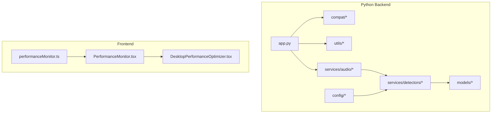
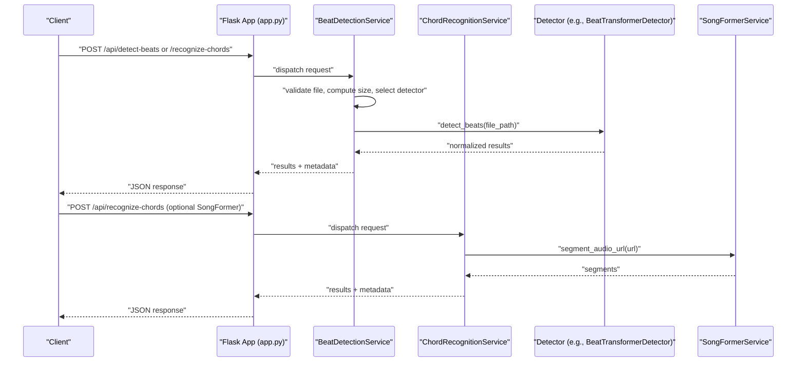
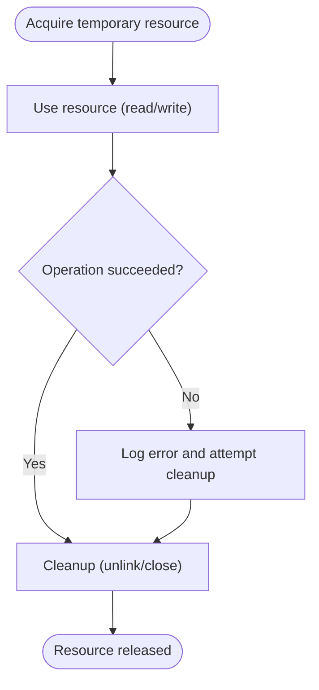
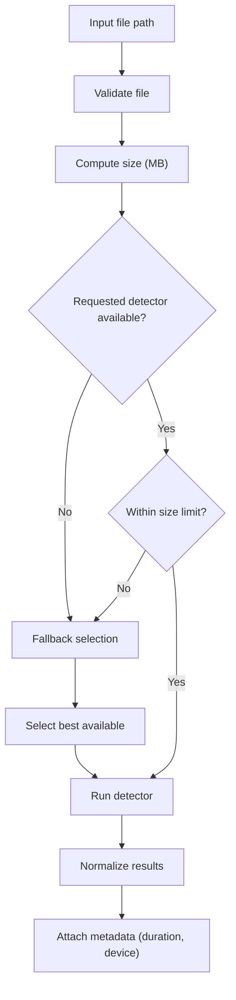
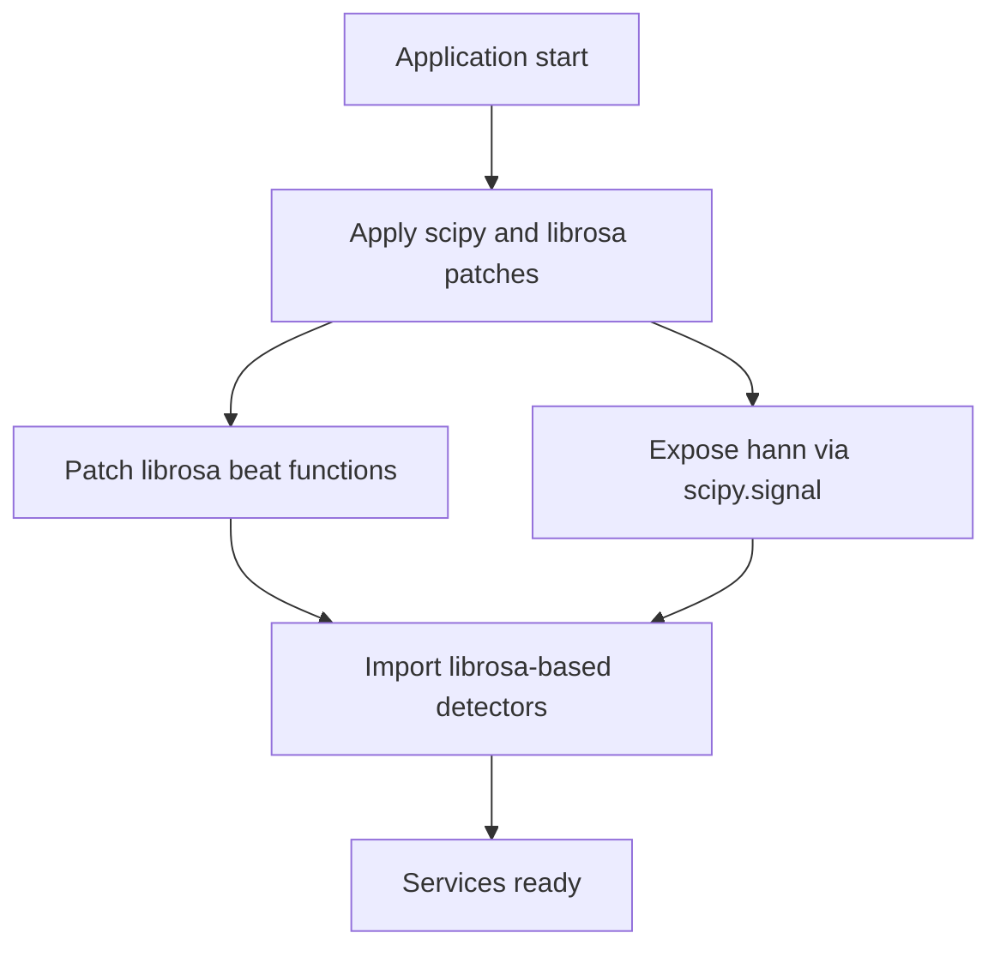
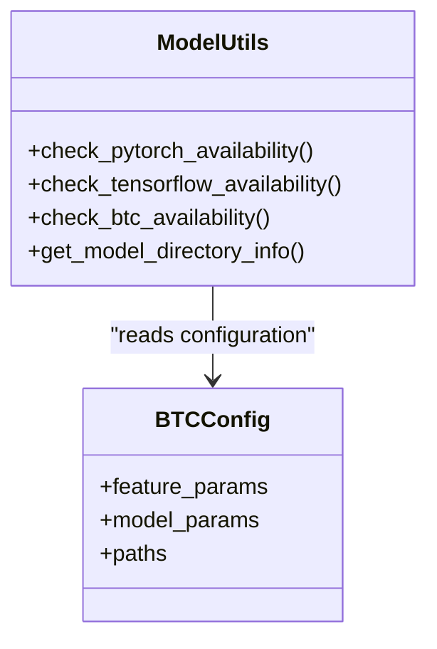
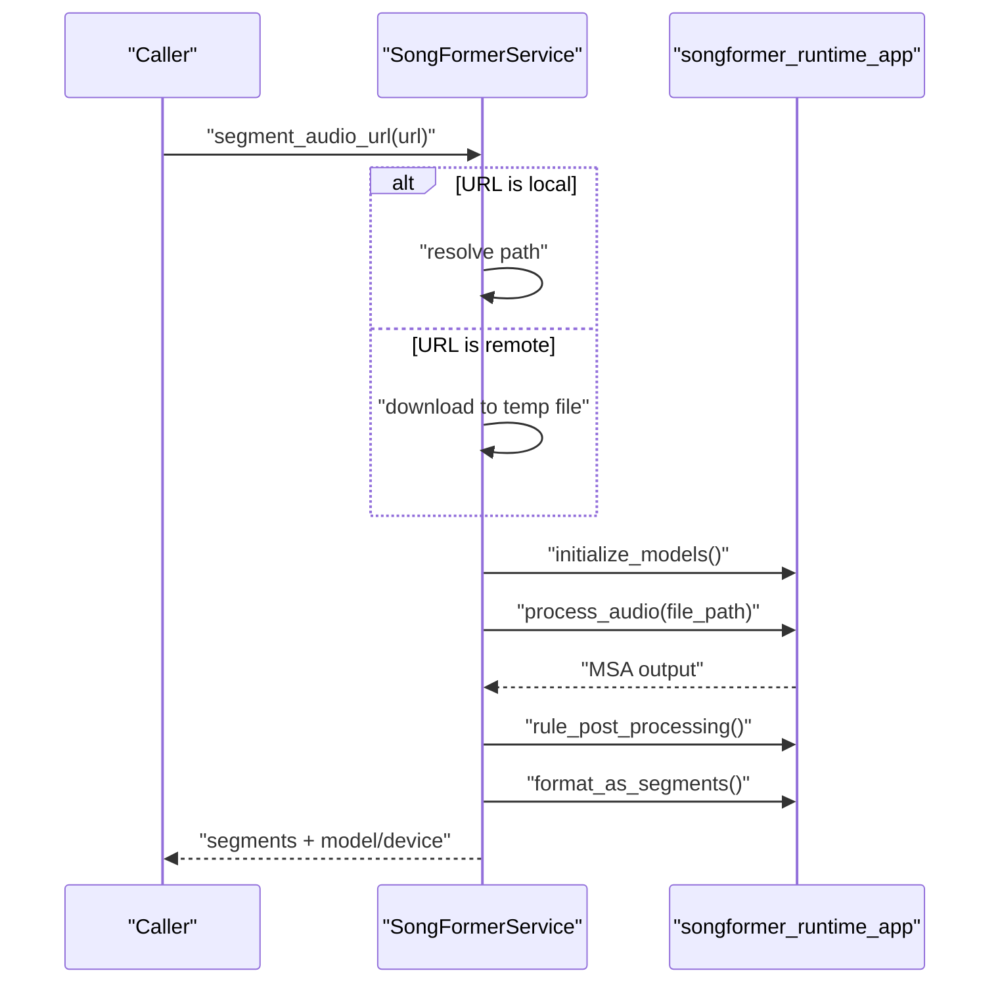
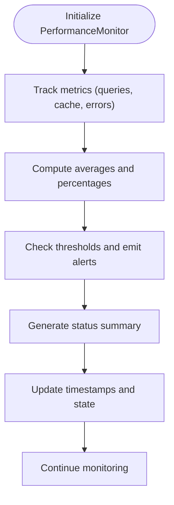
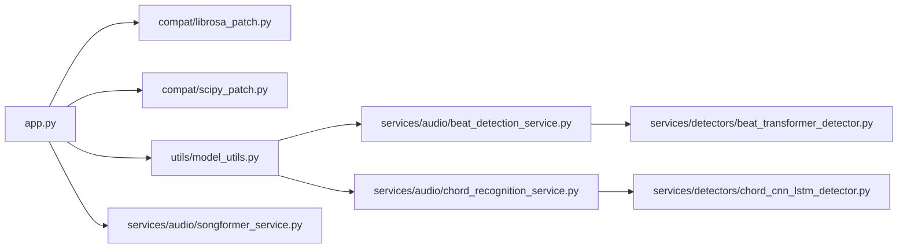

# Performance Optimization

<cite>
**Referenced Files in This Document**
- [app.py](file://python_backend/app.py)
- [audio_utils.py](file://python_backend/services/audio/audio_utils.py)
- [tempfiles.py](file://python_backend/services/audio/tempfiles.py)
- [model_utils.py](file://python_backend/utils/model_utils.py)
- [librosa_patch.py](file://python_backend/compat/librosa_patch.py)
- [scipy_patch.py](file://python_backend/compat/scipy_patch.py)
- [beat_detection_service.py](file://python_backend/services/audio/beat_detection_service.py)
- [chord_recognition_service.py](file://python_backend/services/audio/chord_recognition_service.py)
- [songformer_service.py](file://python_backend/services/audio/songformer_service.py)
- [beat_transformer_detector.py](file://python_backend/services/detectors/beat_transformer_detector.py)
- [chord_cnn_lstm_detector.py](file://python_backend/services/detectors/chord_cnn_lstm_detector.py)
- [btc_config.yaml](file://python_backend/config/btc_config.yaml)
- [requirements.txt](file://python_backend/requirements.txt)
- [performanceMonitor.ts](file://src/services/performance/performanceMonitor.ts)
- [PerformanceMonitor.tsx](file://src/components/layout/PerformanceMonitor.tsx)
- [DesktopPerformanceOptimizer.tsx](file://src/components/layout/DesktopPerformanceOptimizer.tsx)
</cite>

## Table of Contents
1. [Introduction](#introduction)
2. [Project Structure](#project-structure)
3. [Core Components](#core-components)
4. [Architecture Overview](#architecture-overview)
5. [Detailed Component Analysis](#detailed-component-analysis)
6. [Dependency Analysis](#dependency-analysis)
7. [Performance Considerations](#performance-considerations)
8. [Troubleshooting Guide](#troubleshooting-guide)
9. [Conclusion](#conclusion)
10. [Appendices](#appendices)

## Introduction
This document provides comprehensive performance optimization guidance for the machine learning services powering audio analysis (beat detection and chord recognition). It focuses on memory management, computational efficiency, compatibility patches, profiling and monitoring, benchmarking, and deployment strategies. The goal is to help maintain low latency, predictable resource usage, and robust operation across diverse environments and hardware configurations.

## Project Structure
The performance-critical backend is primarily implemented in the Python backend under python_backend/. Key areas include:
- Audio processing utilities and temporary file management
- Model availability checks and device selection
- Compatibility patches for librosa, scipy, and related libraries
- Orchestration services for beat detection and chord recognition
- Thin wrappers around external model runtimes (e.g., SongFormer)
- Frontend performance monitoring and optimization components

**Diagram sources**
- [app.py:1-186](file://python_backend/app.py#L1-L186)
- [audio_utils.py:1-131](file://python_backend/services/audio/audio_utils.py#L1-L131)
- [tempfiles.py:1-136](file://python_backend/services/audio/tempfiles.py#L1-L136)
- [model_utils.py:1-326](file://python_backend/utils/model_utils.py#L1-L326)
- [librosa_patch.py:1-97](file://python_backend/compat/librosa_patch.py#L1-L97)
- [scipy_patch.py:1-48](file://python_backend/compat/scipy_patch.py#L1-L48)
- [beat_detection_service.py:1-348](file://python_backend/services/audio/beat_detection_service.py#L1-L348)
- [chord_recognition_service.py:1-322](file://python_backend/services/audio/chord_recognition_service.py#L1-L322)
- [songformer_service.py:1-140](file://python_backend/services/audio/songformer_service.py#L1-L140)
- [beat_transformer_detector.py:1-163](file://python_backend/services/detectors/beat_transformer_detector.py#L1-L163)
- [chord_cnn_lstm_detector.py:1-249](file://python_backend/services/detectors/chord_cnn_lstm_detector.py#L1-L249)
- [btc_config.yaml:1-61](file://python_backend/config/btc_config.yaml#L1-L61)
- [requirements.txt:1-131](file://python_backend/requirements.txt#L1-L131)
- [performanceMonitor.ts:46-312](file://src/services/performance/performanceMonitor.ts#L46-L312)
- [PerformanceMonitor.tsx:1-50](file://src/components/layout/PerformanceMonitor.tsx#L1-L50)
- [DesktopPerformanceOptimizer.tsx:1-37](file://src/components/layout/DesktopPerformanceOptimizer.tsx#L1-L37)

**Section sources**
- [app.py:1-186](file://python_backend/app.py#L1-L186)
- [requirements.txt:1-131](file://python_backend/requirements.txt#L1-L131)

## Core Components
- Audio processing utilities: silence trimming, duration estimation, resampling, and validation.
- Temporary file management: context-managed creation and cleanup to prevent leaks and disk pressure.
- Model availability and device selection: runtime checks for PyTorch/TensorFlow devices and model presence.
- Compatibility patches: monkey-patching and shim layers to bridge library version differences.
- Orchestration services: beat detection and chord recognition services that select optimal detectors based on file size and availability.
- Thin runtime adapters: SongFormer service wrapper with controlled initialization and thread-safe access.
- Frontend performance monitoring: metrics collection and alerting for cache performance, error reduction, and Firebase query efficiency.

**Section sources**
- [audio_utils.py:12-131](file://python_backend/services/audio/audio_utils.py#L12-L131)
- [tempfiles.py:15-136](file://python_backend/services/audio/tempfiles.py#L15-L136)
- [model_utils.py:12-326](file://python_backend/utils/model_utils.py#L12-L326)
- [librosa_patch.py:14-97](file://python_backend/compat/librosa_patch.py#L14-L97)
- [scipy_patch.py:18-48](file://python_backend/compat/scipy_patch.py#L18-L48)
- [beat_detection_service.py:20-348](file://python_backend/services/audio/beat_detection_service.py#L20-L348)
- [chord_recognition_service.py:25-322](file://python_backend/services/audio/chord_recognition_service.py#L25-L322)
- [songformer_service.py:21-140](file://python_backend/services/audio/songformer_service.py#L21-L140)
- [performanceMonitor.ts:46-312](file://src/services/performance/performanceMonitor.ts#L46-L312)

## Architecture Overview
The system orchestrates audio analysis through a layered design:
- Application bootstrap applies compatibility patches and sets up environment.
- Services validate inputs, select appropriate detectors, and enforce file-size-aware policies.
- Detectors encapsulate model-specific logic and normalization of outputs.
- Runtime adapters (e.g., SongFormer) manage external model lifecycles and I/O.
- Frontend monitors performance metrics and provides insights for UI responsiveness.

**Diagram sources**
- [app.py:1-186](file://python_backend/app.py#L1-L186)
- [beat_detection_service.py:163-311](file://python_backend/services/audio/beat_detection_service.py#L163-L311)
- [chord_recognition_service.py:173-296](file://python_backend/services/audio/chord_recognition_service.py#L173-L296)
- [beat_transformer_detector.py:73-147](file://python_backend/services/detectors/beat_transformer_detector.py#L73-L147)
- [songformer_service.py:118-140](file://python_backend/services/audio/songformer_service.py#L118-L140)

## Detailed Component Analysis

### Memory Management and Resource Cleanup
- Temporary file lifecycle: context managers ensure files are closed and removed, preventing leaks and disk accumulation.
- Cleanup utilities: manual cleanup functions and path generation support deterministic disposal.
- Audio processing: minimal in-memory copies; operations leverage streaming where applicable (e.g., downloading audio for SongFormer).

**Diagram sources**
- [tempfiles.py:15-136](file://python_backend/services/audio/tempfiles.py#L15-L136)

**Section sources**
- [tempfiles.py:15-136](file://python_backend/services/audio/tempfiles.py#L15-L136)
- [audio_utils.py:12-131](file://python_backend/services/audio/audio_utils.py#L12-L131)
- [songformer_service.py:118-140](file://python_backend/services/audio/songformer_service.py#L118-L140)

### Computational Optimization for Audio Processing
- Detector selection policy: favors faster/heavier models for small/large files respectively, balancing accuracy and throughput.
- File-size-aware routing: enforces per-detector limits to avoid timeouts and OOM conditions.
- Normalized outputs: reduce downstream transformations and parsing overhead.
- Device selection: PyTorch availability checks determine CUDA/MPS/CPU usage for DL models.

**Diagram sources**
- [beat_detection_service.py:53-162](file://python_backend/services/audio/beat_detection_service.py#L53-L162)
- [chord_recognition_service.py:61-172](file://python_backend/services/audio/chord_recognition_service.py#L61-L172)
- [model_utils.py:141-181](file://python_backend/utils/model_utils.py#L141-L181)

**Section sources**
- [beat_detection_service.py:20-348](file://python_backend/services/audio/beat_detection_service.py#L20-L348)
- [chord_recognition_service.py:25-322](file://python_backend/services/audio/chord_recognition_service.py#L25-L322)
- [model_utils.py:12-326](file://python_backend/utils/model_utils.py#L12-L326)

### Compatibility Patches and Workarounds
- librosa patches: replace deprecated window functions and provide a patched beat_track that avoids problematic scipy.signal.hann.
- scipy shim: expose scipy.signal.windows.hann via scipy.signal.hann for backward compatibility.
- Early patch application: applied during app bootstrap to ensure downstream libraries load cleanly.

**Diagram sources**
- [librosa_patch.py:14-97](file://python_backend/compat/librosa_patch.py#L14-L97)
- [scipy_patch.py:18-48](file://python_backend/compat/scipy_patch.py#L18-L48)
- [app.py:9-11](file://python_backend/app.py#L9-L11)

**Section sources**
- [librosa_patch.py:14-97](file://python_backend/compat/librosa_patch.py#L14-L97)
- [scipy_patch.py:18-48](file://python_backend/compat/scipy_patch.py#L18-L48)
- [app.py:1-186](file://python_backend/app.py#L1-L186)

### Model Availability and Device Selection
- Availability checks: probe for model directories, required files, and runtime libraries (PyTorch, TensorFlow).
- Device info: report CUDA/MPS/CPU availability and device names for informed selection.
- BTC configuration: explicit feature and model parameters guide inference behavior and memory footprint.

**Diagram sources**
- [model_utils.py:141-225](file://python_backend/utils/model_utils.py#L141-L225)
- [btc_config.yaml:10-61](file://python_backend/config/btc_config.yaml#L10-L61)

**Section sources**
- [model_utils.py:12-326](file://python_backend/utils/model_utils.py#L12-L326)
- [btc_config.yaml:1-61](file://python_backend/config/btc_config.yaml#L1-L61)

### SongFormer Runtime Adapter
- Controlled initialization: lazy import and thread-safe lock to avoid concurrent initialization.
- Working directory management: chdir into runtime root to resolve relative paths.
- Streaming download: fetch remote audio via requests with chunked writes to minimize memory usage.

**Diagram sources**
- [songformer_service.py:21-140](file://python_backend/services/audio/songformer_service.py#L21-L140)

**Section sources**
- [songformer_service.py:21-140](file://python_backend/services/audio/songformer_service.py#L21-L140)

### Frontend Performance Monitoring
- Metrics tracking: cache hit rate, error reduction, filename matching accuracy, and Firebase query statistics.
- Alerts and summaries: periodic evaluation yields status and actionable alerts.
- Core Web Vitals: optional LCP tracking in development for UI responsiveness.

**Diagram sources**
- [performanceMonitor.ts:46-312](file://src/services/performance/performanceMonitor.ts#L46-L312)
- [PerformanceMonitor.tsx:17-50](file://src/components/layout/PerformanceMonitor.tsx#L17-L50)

**Section sources**
- [performanceMonitor.ts:46-312](file://src/services/performance/performanceMonitor.ts#L46-L312)
- [PerformanceMonitor.tsx:1-50](file://src/components/layout/PerformanceMonitor.tsx#L1-L50)
- [DesktopPerformanceOptimizer.tsx:1-37](file://src/components/layout/DesktopPerformanceOptimizer.tsx#L1-L37)

## Dependency Analysis
- Heavy imports deferred: librosa and other audio libraries are lazily imported to reduce cold-start overhead.
- Patch application early: ensures librosa/madmom compatibility before any imports.
- Version pinning: pinned versions in requirements.txt stabilize performance characteristics across environments.

**Diagram sources**
- [app.py:1-186](file://python_backend/app.py#L1-L186)
- [librosa_patch.py:1-97](file://python_backend/compat/librosa_patch.py#L1-L97)
- [scipy_patch.py:1-48](file://python_backend/compat/scipy_patch.py#L1-L48)
- [model_utils.py:1-326](file://python_backend/utils/model_utils.py#L1-L326)
- [beat_detection_service.py:1-348](file://python_backend/services/audio/beat_detection_service.py#L1-L348)
- [chord_recognition_service.py:1-322](file://python_backend/services/audio/chord_recognition_service.py#L1-L322)
- [beat_transformer_detector.py:1-163](file://python_backend/services/detectors/beat_transformer_detector.py#L1-L163)
- [chord_cnn_lstm_detector.py:1-249](file://python_backend/services/detectors/chord_cnn_lstm_detector.py#L1-L249)
- [songformer_service.py:1-140](file://python_backend/services/audio/songformer_service.py#L1-L140)

**Section sources**
- [requirements.txt:1-131](file://python_backend/requirements.txt#L1-L131)
- [app.py:1-186](file://python_backend/app.py#L1-L186)

## Performance Considerations
- Memory management
  - Use context managers for temporary files and ensure cleanup on exceptions.
  - Avoid loading entire audio into memory unnecessarily; leverage streaming and short-duration validations.
  - Minimize repeated I/O by caching model metadata and device info where appropriate.

- Computational optimization
  - Prefer faster detectors for small files and heavier models for long files to balance latency and accuracy.
  - Normalize detector outputs to reduce post-processing overhead.
  - Use device selection to leverage GPU acceleration when available.

- Compatibility and stability
  - Apply patches early to avoid import-time failures and degraded performance.
  - Pin versions to maintain consistent performance profiles across environments.

- Frontend responsiveness
  - Monitor Core Web Vitals and cache performance to identify UI bottlenecks.
  - Defer non-critical CSS and images to improve LCP and reduce layout shifts.

[No sources needed since this section provides general guidance]

## Troubleshooting Guide
- Beat detection service errors
  - Validate audio file existence and readability before processing.
  - If no detector is available, confirm model directories and required files exist.
  - For large files, ensure size limits are respected; otherwise, fallback selection may choose a slower detector.

- Chord recognition service issues
  - Verify detector availability and file-size constraints.
  - Confirm chord dictionary compatibility for the selected model.
  - When using Spleeter, ensure cleanup routines are executed after processing.

- SongFormer runtime problems
  - Check that SONGFORMER_ROOT points to a valid runtime directory.
  - Ensure model and config environment variables are set correctly.
  - For remote URLs, verify network connectivity and chunked download behavior.

- Frontend performance anomalies
  - Review performanceMonitor.ts metrics for cache misses and error spikes.
  - Use PerformanceMonitor.tsx in development to capture LCP and other Core Web Vitals.

**Section sources**
- [beat_detection_service.py:176-311](file://python_backend/services/audio/beat_detection_service.py#L176-L311)
- [chord_recognition_service.py:173-296](file://python_backend/services/audio/chord_recognition_service.py#L173-L296)
- [songformer_service.py:21-140](file://python_backend/services/audio/songformer_service.py#L21-L140)
- [performanceMonitor.ts:46-312](file://src/services/performance/performanceMonitor.ts#L46-L312)
- [PerformanceMonitor.tsx:17-50](file://src/components/layout/PerformanceMonitor.tsx#L17-L50)

## Conclusion
By combining early compatibility patching, runtime model/device checks, file-size-aware detector selection, and disciplined resource cleanup, the system achieves predictable performance across diverse environments. Complementing backend optimizations with frontend monitoring enables continuous improvement and rapid identification of regressions.

[No sources needed since this section summarizes without analyzing specific files]

## Appendices

### Practical Examples and Procedures
- Benchmarking
  - Measure detector selection latency and total processing time for representative audio lengths.
  - Compare CPU vs. GPU runs using device info from model_utils.py.

- Profiling and bottleneck identification
  - Use Python’s cProfile or similar profilers around detector calls to identify hotspots.
  - Monitor frontend metrics via performanceMonitor.ts to correlate UI responsiveness with backend throughput.

- Performance regression testing
  - Establish baseline metrics for typical audio durations and file sizes.
  - Automate tests that compare processing time and memory usage against historical baselines.

- Deployment optimization
  - Pin dependency versions in requirements.txt to maintain stable performance.
  - Ensure environment variables for model paths and runtime roots are configured consistently across environments.

[No sources needed since this section provides general guidance]