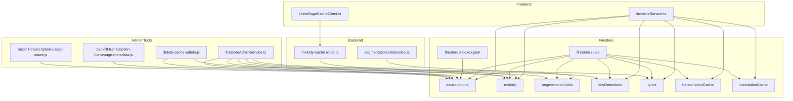
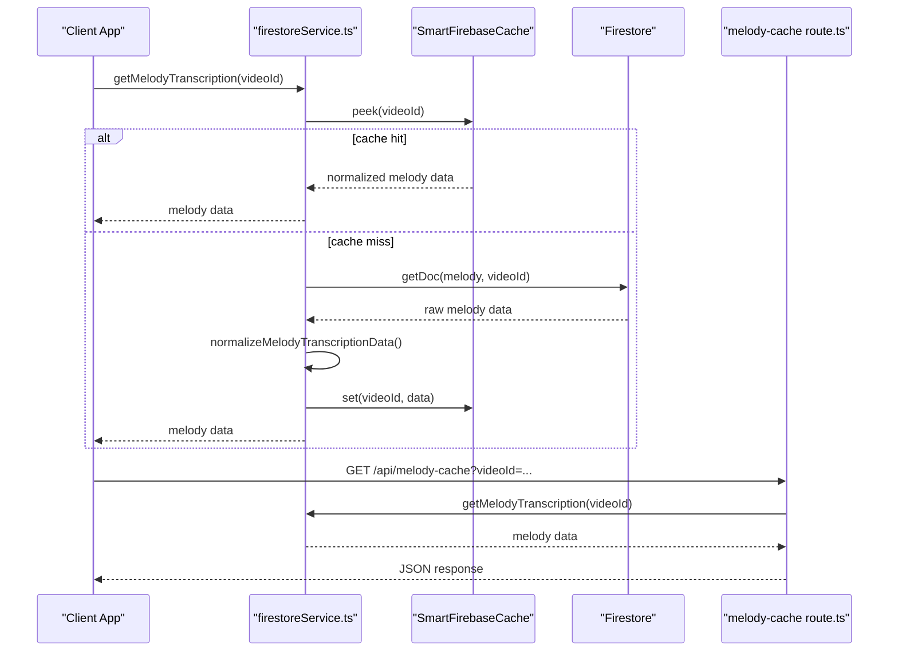
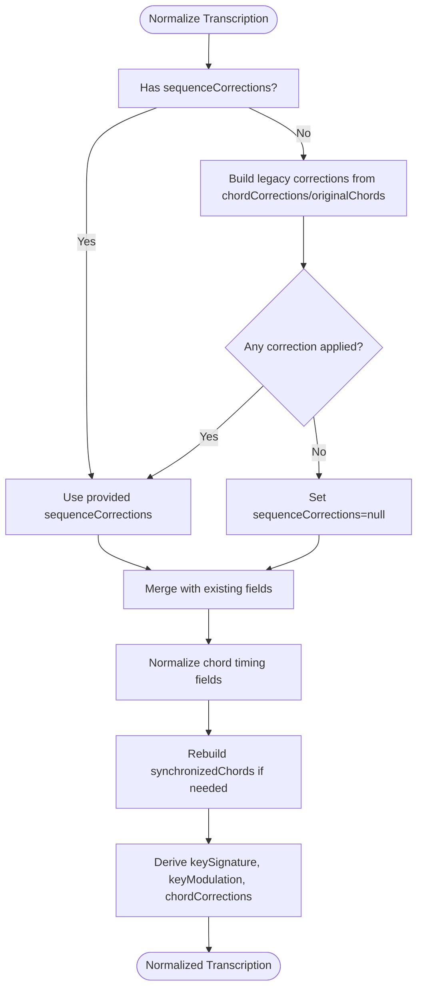
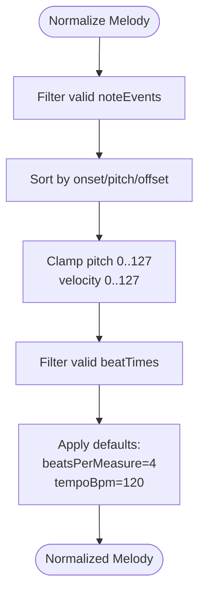
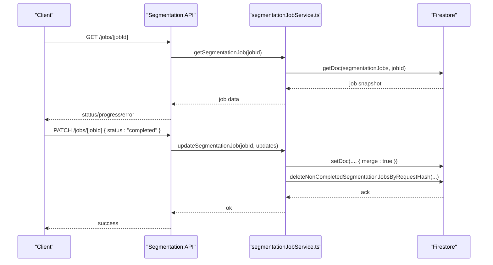
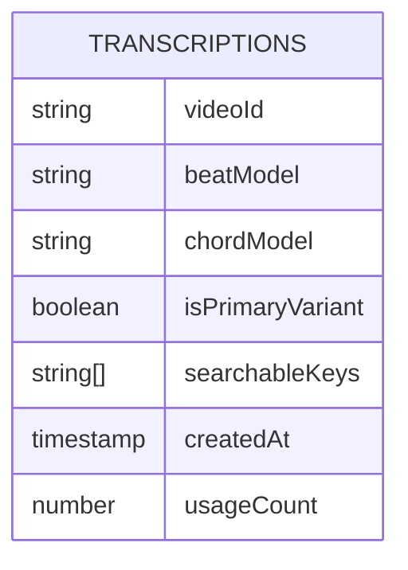
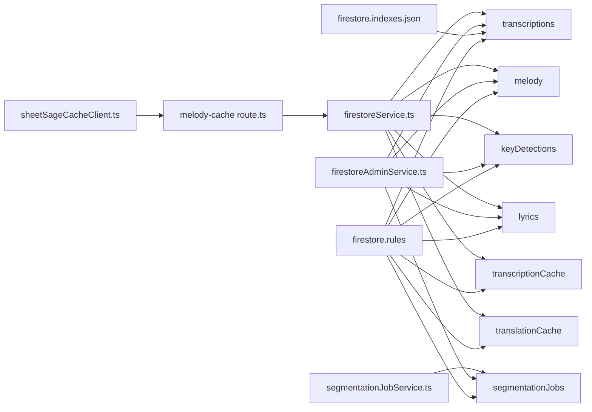

# Data Models and Collections

<cite>
**Referenced Files in This Document**
- [firestore.indexes.json](file://firebase/firestore.indexes.json)
- [firestore.rules](file://firebase/firestore.rules)
- [firestoreService.ts](file://src/services/firebase/firestoreService.ts)
- [firestoreAdminService.ts](file://src/services/firebase/firestoreAdminService.ts)
- [segmentationJobService.ts](file://src/services/firebase/segmentationJobService.ts)
- [route.ts](file://src/app/api/melody-cache/route.ts)
- [sheetSageCacheClient.ts](file://src/services/sheetsage/sheetSageCacheClient.ts)
- [delete-cache-admin.js](file://scripts/delete-cache-admin.js)
- [backfill-transcription-homepage-metadata.js](file://scripts/backfill-transcription-homepage-metadata.js)
- [backfill-transcription-usage-count.js](file://scripts/backfill-transcription-usage-count.js)
- [audioAnalysis.ts](file://src/types/audioAnalysis.ts)
- [musicAiTypes.ts](file://src/types/musicAiTypes.ts)
- [sheetSage.ts](file://src/types/sheetSage.ts)
</cite>

## Table of Contents
1. [Introduction](#introduction)
2. [Project Structure](#project-structure)
3. [Core Collections and Schemas](#core-collections-and-schemas)
4. [Architecture Overview](#architecture-overview)
5. [Detailed Component Analysis](#detailed-component-analysis)
6. [Dependency Analysis](#dependency-analysis)
7. [Performance Considerations](#performance-considerations)
8. [Troubleshooting Guide](#troubleshooting-guide)
9. [Conclusion](#conclusion)
10. [Appendices](#appendices)

## Introduction
This document provides comprehensive data model documentation for the ChordMiniApp collections and schemas stored in Firestore. It covers the main collections including transcriptions, translations, lyrics, key detections, segmentation jobs, and melody caches. For each collection, we define document structure, field types, validation rules, and relationships. We explain indexing strategy, query optimization, caching policies, migration procedures, and administrative maintenance via the Firestore Admin SDK. Finally, we outline TypeScript interfaces and type safety measures, and address data lifecycle management including retention, archival, and deletion strategies.

## Project Structure
The data model spans several layers:
- Frontend services that read/write Firestore documents and manage caches
- Backend APIs that expose endpoints for melody cache and segmentation jobs
- Firestore configuration for indexes and security rules
- Administrative scripts for bulk operations and backfills

**Diagram sources**
- [firestoreService.ts:64-108](file://src/services/firebase/firestoreService.ts#L64-L108)
- [firestoreAdminService.ts:1-313](file://src/services/firebase/firestoreAdminService.ts#L1-L313)
- [segmentationJobService.ts:189-336](file://src/services/firebase/segmentationJobService.ts#L189-L336)
- [route.ts:81-92](file://src/app/api/melody-cache/route.ts#L81-L92)
- [sheetSageCacheClient.ts:1-17](file://src/services/sheetsage/sheetSageCacheClient.ts#L1-L17)
- [firestore.indexes.json:1-38](file://firebase/firestore.indexes.json#L1-L38)
- [firestore.rules:124-140](file://firebase/firestore.rules#L124-L140)

**Section sources**
- [firestore.indexes.json:1-38](file://firebase/firestore.indexes.json#L1-L38)
- [firestore.rules:1-289](file://firebase/firestore.rules#L1-L289)

## Core Collections and Schemas

### Transcriptions
Purpose: Store beat and chord analysis results with optional enrichment metadata and search keys for homepage curation.

- Collection path: transcriptions
- Document ID: constructed from videoId, beatModel, and chordModel
- Key fields:
  - videoId: string (YouTube video identifier)
  - beatModel: string (beat detection model name)
  - chordModel: string (chord detection model name)
  - beats: array of beat entries
  - chords: array of chord entries with timing
  - synchronizedChords: array of { chord, beatIndex, beatNum? }
  - createdAt: timestamp
  - audioDuration?: number
  - timeSignature?: number|null
  - bpm?: number|null
  - beatShift?: number
  - keySignature?: string|null
  - keyModulation?: string|null
  - chordCorrections?: map|string[]
  - sequenceCorrections?: structured corrections
  - correctedChords?: string[]
  - originalChords?: string[]
  - romanNumerals?: structured analysis
  - isPrimaryVariant?: boolean
  - displayPriority?: number|null
  - searchableKeys?: string[]
  - usageCount?: number

Validation rules (simplified in rules for stability):
- Enforce presence of core fields and timestamps
- Limit total field count
- Temporary permissive rules during validation isolation

Caching and normalization:
- Normalization pipeline ensures consistent structure and derived fields
- Homepage variant scoring and primary variant assignment
- Increment usageCount atomically

Indexes:
- Composite index for isPrimaryVariant + createdAt (descending)
- Composite index for isPrimaryVariant + searchableKeys (contains) + createdAt (descending)

**Section sources**
- [firestoreService.ts:64-102](file://src/services/firebase/firestoreService.ts#L64-L102)
- [firestoreService.ts:203-248](file://src/services/firebase/firestoreService.ts#L203-L248)
- [firestoreService.ts:324-380](file://src/services/firebase/firestoreService.ts#L324-L380)
- [firestoreService.ts:688-747](file://src/services/firebase/firestoreService.ts#L688-L747)
- [firestore.indexes.json:3-34](file://firebase/firestore.indexes.json#L3-L34)
- [firestore.rules:39-50](file://firebase/firestore.rules#L39-L50)

### Transcription Cache
Purpose: Store precomputed transcription results for quick retrieval.

- Collection path: transcriptionCache
- Validation: permissive during stabilization
- Access: read allowed; create/update allowed; delete restricted

**Section sources**
- [firestore.rules:106-121](file://firebase/firestore.rules#L106-L121)

### Translations
Purpose: Store translated lyrics.

- Collection path: translations
- Validation: permissive during stabilization
- Access: read allowed; create/update allowed; delete restricted to admins

**Section sources**
- [firestore.rules:159-174](file://firebase/firestore.rules#L159-L174)

### Translation Cache
Purpose: Store cached translation results.

- Collection path: translationCache
- Validation: permissive during stabilization
- Access: read allowed; create/update allowed; delete restricted to admins

**Section sources**
- [firestore.rules:142-157](file://firebase/firestore.rules#L142-L157)

### Lyrics
Purpose: Store transcribed lyrics (from Music.AI).

- Collection path: lyrics
- Validation: permissive during stabilization
- Access: read allowed; create/update allowed; delete restricted to admins

**Section sources**
- [firestore.rules:176-194](file://firebase/firestore.rules#L176-L194)

### Key Detections
Purpose: Store musical key analysis results.

- Collection path: keyDetections
- Validation: permissive during stabilization
- Access: read allowed; create/update allowed; delete restricted to admins

**Section sources**
- [firestore.rules:266-281](file://firebase/firestore.rules#L266-L281)

### Melody Cache
Purpose: Store Sheet Sage melody transcription results.

- Collection path: melody
- Document ID: videoId
- Fields:
  - videoId: string
  - model: string (fixed model identifier)
  - noteEvents: array of { onset, offset, pitch, velocity }
  - noteEventCount: number
  - beatTimes: number[]
  - beatsPerMeasure: number
  - tempoBpm: number
  - createdAt: timestamp
- Normalization:
  - Filters invalid note events
  - Sorts and clamps note attributes
  - Validates numeric fields

Frontend cache:
- SmartFirebaseCache wrapper for memoization and normalization

Backend API:
- GET endpoint serves cached melody data for a given videoId

**Section sources**
- [firestoreService.ts:104-108](file://src/services/firebase/firestoreService.ts#L104-L108)
- [firestoreService.ts:276-322](file://src/services/firebase/firestoreService.ts#L276-L322)
- [route.ts:81-92](file://src/app/api/melody-cache/route.ts#L81-L92)
- [sheetSageCacheClient.ts:1-17](file://src/services/sheetsage/sheetSageCacheClient.ts#L1-L17)

### Segmentation Jobs
Purpose: Track asynchronous SongFormer segmentation jobs with state and result persistence.

- Collection path: segmentationJobs
- Fields include job identifiers, status, timestamps, hashes, and result metadata
- Operations:
  - Create/update job documents
  - Find active/completed jobs by request hash
  - Cleanup stale jobs
  - Delete non-completed jobs by request hash

TTL and cleanup:
- Stale job detection based on status and updatedAtMs
- Cron-triggered cleanup endpoint

**Section sources**
- [segmentationJobService.ts:189-336](file://src/services/firebase/segmentationJobService.ts#L189-L336)

## Architecture Overview

**Diagram sources**
- [firestoreService.ts:471-522](file://src/services/firebase/firestoreService.ts#L471-L522)
- [route.ts:81-92](file://src/app/api/melody-cache/route.ts#L81-L92)

## Detailed Component Analysis

### Transcription Data Model and Normalization
The transcription schema supports beat/chord synchronization, key analysis, and enrichment metadata. Normalization ensures:
- Consistent chord timing (time vs start)
- Rebuilt synchronized chords when beats/chords change
- Derived fields (keySignature, keyModulation, chordCorrections)
- Sequence corrections and roman numeral analysis
- Homepage variant scoring and primary variant flagging

**Diagram sources**
- [firestoreService.ts:203-248](file://src/services/firebase/firestoreService.ts#L203-L248)
- [firestoreService.ts:154-175](file://src/services/firebase/firestoreService.ts#L154-L175)
- [firestoreService.ts:177-201](file://src/services/firebase/firestoreService.ts#L177-L201)

**Section sources**
- [firestoreService.ts:64-102](file://src/services/firebase/firestoreService.ts#L64-L102)
- [firestoreService.ts:203-248](file://src/services/firebase/firestoreService.ts#L203-L248)
- [firestoreService.ts:154-175](file://src/services/firebase/firestoreService.ts#L154-L175)
- [firestoreService.ts:177-201](file://src/services/firebase/firestoreService.ts#L177-L201)

### Melody Transcription Data Model and Normalization
Melody documents are normalized to ensure:
- Valid note event ranges and sorted order
- Clamped MIDI pitch/velocity bounds
- Beat times filtered to finite numbers
- Derived counts and defaults for beatsPerMeasure/tempoBpm

**Diagram sources**
- [firestoreService.ts:276-322](file://src/services/firebase/firestoreService.ts#L276-L322)

**Section sources**
- [firestoreService.ts:104-108](file://src/services/firebase/firestoreService.ts#L104-L108)
- [firestoreService.ts:276-322](file://src/services/firebase/firestoreService.ts#L276-L322)

### Segmentation Job Lifecycle
Segmentation jobs are tracked with status transitions and TTL semantics. The service:
- Creates/updates job documents with timestamps and hashes
- Finds active/completed jobs by request hash
- Detects stale jobs and deletes them
- Cleans up non-completed jobs for the same request hash

**Diagram sources**
- [segmentationJobService.ts:204-226](file://src/services/firebase/segmentationJobService.ts#L204-L226)
- [segmentationJobService.ts:320-336](file://src/services/firebase/segmentationJobService.ts#L320-L336)

**Section sources**
- [segmentationJobService.ts:189-336](file://src/services/firebase/segmentationJobService.ts#L189-L336)

### Indexing Strategy and Query Optimization
Composite indexes enable efficient queries:
- Primary variant selection and chronological ordering
- Filtering by searchable keys for homepage curation

**Diagram sources**
- [firestore.indexes.json:3-34](file://firebase/firestore.indexes.json#L3-L34)

**Section sources**
- [firestore.indexes.json:1-38](file://firebase/firestore.indexes.json#L1-L38)

### Caching Policies
- Transcriptions: SmartFirebaseCache with normalization and eviction
- Melody: SmartFirebaseCache with normalization and memoization
- Homepage variant metadata: batched updates to all variants for a videoId
- Usage count: atomic increment via server-side increment

**Section sources**
- [firestoreService.ts:254-254](file://src/services/firebase/firestoreService.ts#L254-L254)
- [firestoreService.ts:471-522](file://src/services/firebase/firestoreService.ts#L471-L522)
- [firestoreService.ts:749-798](file://src/services/firebase/firestoreService.ts#L749-L798)
- [firestoreService.ts:688-747](file://src/services/firebase/firestoreService.ts#L688-L747)

### Data Migration Procedures
- Schema versioning: introduce new fields alongside existing ones; keep backward compatibility
- Backfill scripts:
  - Homepage metadata backfill: compute isPrimaryVariant, displayPriority, searchableKeys
  - Usage count backfill: increment usageCount for existing transcriptions
- Admin SDK:
  - Bulk delete documents by IDs
  - Retrieve/set documents programmatically

**Section sources**
- [backfill-transcription-homepage-metadata.js:115-198](file://scripts/backfill-transcription-homepage-metadata.js#L115-L198)
- [backfill-transcription-usage-count.js:124-168](file://scripts/backfill-transcription-usage-count.js#L124-L168)
- [firestoreAdminService.ts:243-257](file://src/services/firebase/firestoreAdminService.ts#L243-L257)
- [firestoreAdminService.ts:284-312](file://src/services/firebase/firestoreAdminService.ts#L284-L312)

### Firestore Admin SDK Usage
- Authentication: Google Auth with service account or ADC
- Operations:
  - Batch delete documents
  - Get/set documents with typed encoding/decoding
- Batch size: 500 writes per commit

**Section sources**
- [firestoreAdminService.ts:1-313](file://src/services/firebase/firestoreAdminService.ts#L1-L313)

### TypeScript Interfaces and Type Safety
- Audio analysis types: beat/chord detection results and analysis result shapes
- Music.AI types: lyrics, lines, markers, and job/result structures
- Sheet Sage types: melody note events and result metadata

These interfaces ensure type-safe handling of backend responses and internal data structures.

**Section sources**
- [audioAnalysis.ts:1-71](file://src/types/audioAnalysis.ts#L1-L71)
- [musicAiTypes.ts:1-122](file://src/types/musicAiTypes.ts#L1-L122)
- [sheetSage.ts:1-19](file://src/types/sheetSage.ts#L1-L19)

### Data Lifecycle Management
- Retention: no explicit TTL fields; rely on administrative cleanup and usage-based pruning
- Archival: not implemented; consider exporting via Admin SDK for long-term storage
- Deletion:
  - Admin-only delete for translations, lyrics, keyDetections, transcriptions, transcriptionCache, translationCache
  - Segmentation jobs cleaned up by staleness
  - Bulk deletion via Admin SDK

**Section sources**
- [firestore.rules:134-140](file://firebase/firestore.rules#L134-L140)
- [firestore.rules:164-174](file://firebase/firestore.rules#L164-L174)
- [firestore.rules:181-194](file://firebase/firestore.rules#L181-L194)
- [firestore.rules:271-281](file://firebase/firestore.rules#L271-L281)
- [segmentationJobService.ts:276-318](file://src/services/firebase/segmentationJobService.ts#L276-L318)
- [firestoreAdminService.ts:243-257](file://src/services/firebase/firestoreAdminService.ts#L243-L257)

## Dependency Analysis

**Diagram sources**
- [firestoreService.ts:250-254](file://src/services/firebase/firestoreService.ts#L250-L254)
- [route.ts:81-92](file://src/app/api/melody-cache/route.ts#L81-L92)
- [sheetSageCacheClient.ts:1-17](file://src/services/sheetsage/sheetSageCacheClient.ts#L1-L17)
- [segmentationJobService.ts:189-336](file://src/services/firebase/segmentationJobService.ts#L189-L336)
- [firestoreAdminService.ts:243-312](file://src/services/firebase/firestoreAdminService.ts#L243-L312)
- [firestore.indexes.json:1-38](file://firebase/firestore.indexes.json#L1-L38)
- [firestore.rules:124-140](file://firebase/firestore.rules#L124-L140)

**Section sources**
- [firestoreService.ts:250-254](file://src/services/firebase/firestoreService.ts#L250-L254)
- [segmentationJobService.ts:189-336](file://src/services/firebase/segmentationJobService.ts#L189-L336)
- [firestoreAdminService.ts:243-312](file://src/services/firebase/firestoreAdminService.ts#L243-L312)
- [firestore.indexes.json:1-38](file://firebase/firestore.indexes.json#L1-L38)
- [firestore.rules:124-140](file://firebase/firestore.rules#L124-L140)

## Performance Considerations
- Composite indexes:
  - Enable efficient filtering by isPrimaryVariant and sorting by createdAt
  - Support array-contains queries on searchableKeys for homepage curation
- Caching:
  - SmartFirebaseCache reduces read latency and minimizes network requests
  - Normalization avoids repeated computation
- Batch operations:
  - Firestore Admin SDK batches deletions to reduce cost and latency
- Atomic increments:
  - usageCount via server-side increment prevents race conditions
- CORS resilience:
  - Session-wide Firestore disable on CORS/network errors prevents repeated failures

[No sources needed since this section provides general guidance]

## Troubleshooting Guide
- CORS/network errors:
  - Firestore operations may temporarily disable Firestore for the session
  - Check browser console for CORS-related messages
- Validation errors:
  - Rules temporarily relaxed to isolate permission issues
  - Review field types and sizes; ensure createdAt is a valid timestamp
- Admin operations:
  - Verify service account credentials and project ID environment variables
  - Confirm batch sizes and error messages from Admin SDK commits
- Segmentation jobs:
  - Use cleanup endpoints to remove stale jobs
  - Verify request hash uniqueness and status transitions

**Section sources**
- [firestoreService.ts:462-466](file://src/services/firebase/firestoreService.ts#L462-L466)
- [firestoreService.ts:515-519](file://src/services/firebase/firestoreService.ts#L515-L519)
- [firestoreAdminService.ts:67-83](file://src/services/firebase/firestoreAdminService.ts#L67-L83)
- [firestoreAdminService.ts:237-241](file://src/services/firebase/firestoreAdminService.ts#L237-L241)
- [segmentationJobService.ts:276-318](file://src/services/firebase/segmentationJobService.ts#L276-L318)

## Conclusion
The ChordMiniApp data model centers on robust schemas for transcriptions and melody results, supported by strong caching, composite indexes, and administrative tooling. Validation rules are intentionally permissive during stabilization, while type-safe TypeScript interfaces ensure correctness across the stack. The indexing strategy optimizes common queries, and the Admin SDK enables scalable maintenance tasks. Together, these components deliver a reliable foundation for analysis results, lyrics, and segmentation workflows.

[No sources needed since this section summarizes without analyzing specific files]

## Appendices

### Field Definitions and Types (Selected)
- TranscriptionData
  - videoId: string
  - beatModel: string
  - chordModel: string
  - beats: BeatInfo[]
  - chords: ChordDetectionResult[]
  - synchronizedChords: { chord: string; beatIndex: number; beatNum?: number }[]
  - createdAt: timestamp
  - audioDuration?: number
  - timeSignature?: number|null
  - bpm?: number|null
  - beatShift?: number
  - keySignature?: string|null
  - keyModulation?: string|null
  - chordCorrections?: map|string[]
  - sequenceCorrections?: structured
  - correctedChords?: string[]
  - originalChords?: string[]
  - romanNumerals?: structured
  - isPrimaryVariant?: boolean
  - displayPriority?: number|null
  - searchableKeys?: string[]
  - usageCount?: number

- MelodyTranscriptionData
  - videoId: string
  - model: string
  - noteEvents: { onset: number; offset: number; pitch: number; velocity: number }[]
  - noteEventCount: number
  - beatTimes: number[]
  - beatsPerMeasure: number
  - tempoBpm: number
  - createdAt: timestamp

**Section sources**
- [firestoreService.ts:64-108](file://src/services/firebase/firestoreService.ts#L64-L108)
- [firestoreService.ts:104-108](file://src/services/firebase/firestoreService.ts#L104-L108)