# Database and Storage

<cite>
**Referenced Files in This Document**
- [firebase.json](file://firebase/firebase.json)
- [firestore.indexes.json](file://firebase/firestore.indexes.json)
- [firestore.rules](file://firebase/firestore.rules)
- [storage.rules](file://firebase/storage.rules)
- [firebase.ts](file://src/config/firebase.ts)
- [firestoreService.ts](file://src/services/firebase/firestoreService.ts)
- [firestoreAdminService.ts](file://src/services/firebase/firestoreAdminService.ts)
- [firebaseStorageService.ts](file://src/services/firebase/firebaseStorageService.ts)
- [firebaseStorageSimplified.ts](file://src/services/firebase/firebaseStorageSimplified.ts)
- [streamingFirebaseUpload.ts](file://src/services/firebase/streamingFirebaseUpload.ts)
- [smartFirebaseCache.ts](file://src/services/cache/smartFirebaseCache.ts)
- [segmentationJobService.ts](file://src/services/firebase/segmentationJobService.ts)
- [sheetSage.ts](file://src/types/sheetSage.ts)
- [extensions.py](file://python_backend/extensions.py)
</cite>

## Table of Contents
1. [Introduction](#introduction)
2. [Project Structure](#project-structure)
3. [Core Components](#core-components)
4. [Architecture Overview](#architecture-overview)
5. [Detailed Component Analysis](#detailed-component-analysis)
6. [Dependency Analysis](#dependency-analysis)
7. [Performance Considerations](#performance-considerations)
8. [Troubleshooting Guide](#troubleshooting-guide)
9. [Conclusion](#conclusion)
10. [Appendices](#appendices)

## Introduction
This document explains the database and storage systems powering ChordMiniApp’s audio analysis pipeline. It covers Firebase integration (Firestore and Cloud Storage), security rules, indexing, caching, and operational workflows for transcriptions, translations, lyrics, key detections, segmentation jobs, and melody caches. It also documents storage architecture, upload/download processes, cleanup mechanisms, and performance strategies, including offline resilience, real-time updates, and backup considerations.

## Project Structure
The database and storage layer spans three main areas:
- Firebase configuration and rules: Firestore and Cloud Storage rules and indexes
- Client-side Firebase SDK integration: initialization, auth, and App Check
- Services for Firestore and Storage: CRUD, caching, and streaming uploads

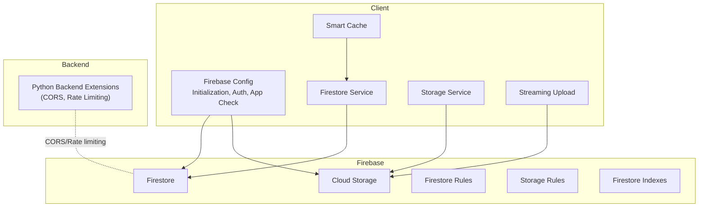

**Diagram sources**
- [firebase.json:1-10](file://firebase/firebase.json#L1-L10)
- [firestore.rules:1-289](file://firebase/firestore.rules#L1-L289)
- [storage.rules:1-92](file://firebase/storage.rules#L1-L92)
- [firebase.ts:1-537](file://src/config/firebase.ts#L1-L537)
- [firestoreService.ts:1-1173](file://src/services/firebase/firestoreService.ts#L1-L1173)
- [firebaseStorageService.ts:1-414](file://src/services/firebase/firebaseStorageService.ts#L1-L414)
- [streamingFirebaseUpload.ts:1-563](file://src/services/firebase/streamingFirebaseUpload.ts#L1-L563)
- [smartFirebaseCache.ts:1-343](file://src/services/cache/smartFirebaseCache.ts#L1-L343)
- [extensions.py:1-93](file://python_backend/extensions.py#L1-L93)

**Section sources**
- [firebase.json:1-10](file://firebase/firebase.json#L1-L10)
- [firebase.ts:1-537](file://src/config/firebase.ts#L1-L537)

## Core Components
- Firebase configuration and rules define the schema, access control, and performance indexes for Firestore and Cloud Storage.
- Firestore service encapsulates typed CRUD operations for transcriptions, melody results, and enrichment updates.
- Storage services manage audio file uploads, metadata caching, and streaming uploads without local disk storage.
- Smart cache reduces repeated reads and mitigates incomplete records.
- Segmentation job service manages asynchronous SongFormer jobs with TTL and cleanup.
- Python backend extensions provide CORS and rate limiting for server-side integrations.

**Section sources**
- [firestoreService.ts:63-102](file://src/services/firebase/firestoreService.ts#L63-L102)
- [firebaseStorageService.ts:1-414](file://src/services/firebase/firebaseStorageService.ts#L1-L414)
- [smartFirebaseCache.ts:25-343](file://src/services/cache/smartFirebaseCache.ts#L25-L343)
- [segmentationJobService.ts:29-48](file://src/services/firebase/segmentationJobService.ts#L29-L48)
- [extensions.py:1-93](file://python_backend/extensions.py#L1-L93)

## Architecture Overview
The system integrates client-side Firebase SDK with Firestore and Cloud Storage. Authentication is handled via anonymous sign-in with persistence and App Check. Data flows include:
- Transcription and melody results stored in Firestore with normalized schemas
- Audio files stored in Cloud Storage with strict naming and size constraints
- Streaming uploads for large files bypassing local disk
- Caching for improved latency and resilience

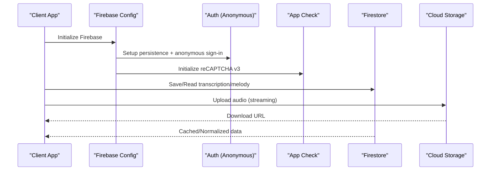

**Diagram sources**
- [firebase.ts:43-125](file://src/config/firebase.ts#L43-L125)
- [firebase.ts:147-252](file://src/config/firebase.ts#L147-L252)
- [firebase.ts:475-514](file://src/config/firebase.ts#L475-L514)
- [firestoreService.ts:584-609](file://src/services/firebase/firestoreService.ts#L584-L609)
- [streamingFirebaseUpload.ts:34-128](file://src/services/firebase/streamingFirebaseUpload.ts#L34-L128)

## Detailed Component Analysis

### Firestore Collections and Data Models
- Transcriptions: Stores beat/chord analysis with optional synchronized chords, key signature, BPM, time signature, and enrichment fields. Includes homepage variant scoring and search keys.
- Melody: Stores Sheet Sage melody transcription results with note events, beats, tempo, and counts.
- Translations and Lyrics: Store translated lyrics and raw transcriptions respectively.
- Key detections: Stores cached key analysis results.
- Segmentations: Asynchronous job state for SongFormer with TTL and cleanup.
- Admin and Metrics: Restricted collections for maintenance and monitoring.

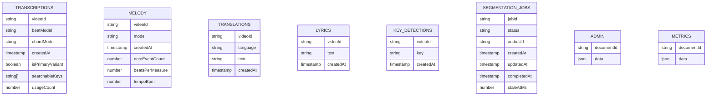

**Diagram sources**
- [firestoreService.ts:63-102](file://src/services/firebase/firestoreService.ts#L63-L102)
- [firestoreService.ts:104-108](file://src/services/firebase/firestoreService.ts#L104-L108)
- [segmentationJobService.ts:29-48](file://src/services/firebase/segmentationJobService.ts#L29-L48)
- [firestore.rules:123-140](file://firebase/firestore.rules#L123-L140)
- [firestore.rules:196-206](file://firebase/firestore.rules#L196-L206)
- [firestore.rules:208-218](file://firebase/firestore.rules#L208-L218)
- [firestore.rules:266-281](file://firebase/firestore.rules#L266-L281)

**Section sources**
- [firestoreService.ts:63-102](file://src/services/firebase/firestoreService.ts#L63-L102)
- [firestoreService.ts:104-108](file://src/services/firebase/firestoreService.ts#L104-L108)
- [segmentationJobService.ts:29-48](file://src/services/firebase/segmentationJobService.ts#L29-L48)
- [firestore.rules:123-140](file://firebase/firestore.rules#L123-L140)
- [firestore.rules:196-206](file://firebase/firestore.rules#L196-L206)
- [firestore.rules:208-218](file://firebase/firestore.rules#L208-L218)
- [firestore.rules:266-281](file://firebase/firestore.rules#L266-L281)

### Firestore Indexes and Queries
- Composite indexes support primary variant selection and search filtering on transcriptions.
- Query patterns include equality filters on videoId and ordering by createdAt for pagination and ranking.

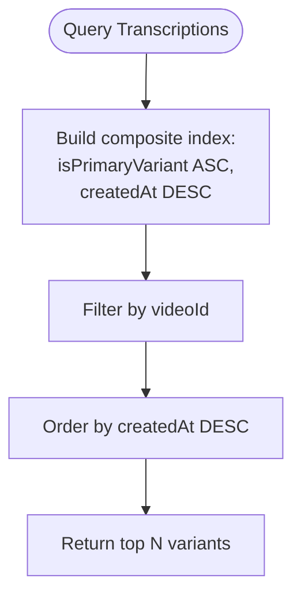

**Diagram sources**
- [firestore.indexes.json:1-38](file://firebase/firestore.indexes.json#L1-L38)
- [firestoreService.ts:752-756](file://src/services/firebase/firestoreService.ts#L752-L756)

**Section sources**
- [firestore.indexes.json:1-38](file://firebase/firestore.indexes.json#L1-L38)
- [firestoreService.ts:752-756](file://src/services/firebase/firestoreService.ts#L752-L756)

### Security Rules and Access Control
- Firestore rules:
  - Validation helpers enforce field constraints and sizes.
  - Public caches (audioCache, transcriptionCache, translationCache) allow read/write with relaxed validation.
  - Transcriptions, translations, lyrics, key detections: permissive create/update for development; deletions restricted to admins.
  - Admin and metrics collections restricted to trusted emails.
  - Feedback and error logs accept limited submissions.
- Cloud Storage rules:
  - Audio/video files under strict naming and size constraints.
  - Temporary offload path allows larger files with timestamped filenames.
  - Read access is public for caching; write requires validation.

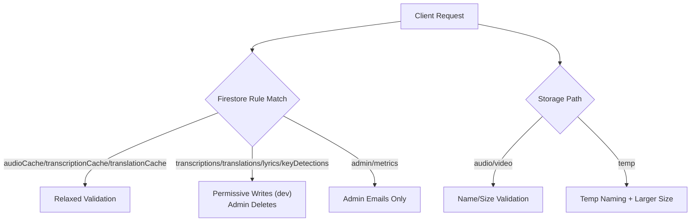

**Diagram sources**
- [firestore.rules:64-104](file://firebase/firestore.rules#L64-L104)
- [firestore.rules:106-141](file://firebase/firestore.rules#L106-L141)
- [firestore.rules:159-194](file://firebase/firestore.rules#L159-L194)
- [firestore.rules:196-218](file://firebase/firestore.rules#L196-L218)
- [firestore.rules:266-281](file://firebase/firestore.rules#L266-L281)
- [storage.rules:43-55](file://firebase/storage.rules#L43-L55)
- [storage.rules:71-84](file://firebase/storage.rules#L71-L84)

**Section sources**
- [firestore.rules:6-55](file://firebase/firestore.rules#L6-L55)
- [firestore.rules:64-104](file://firebase/firestore.rules#L64-L104)
- [firestore.rules:106-141](file://firebase/firestore.rules#L106-L141)
- [firestore.rules:159-194](file://firebase/firestore.rules#L159-L194)
- [firestore.rules:196-218](file://firebase/firestore.rules#L196-L218)
- [firestore.rules:266-281](file://firebase/firestore.rules#L266-L281)
- [storage.rules:10-29](file://firebase/storage.rules#L10-L29)
- [storage.rules:43-55](file://firebase/storage.rules#L43-L55)
- [storage.rules:71-84](file://firebase/storage.rules#L71-L84)

### Client-Side Firebase Integration
- Runtime configuration loading from a server endpoint for Docker compatibility.
- Anonymous authentication with persistence and retry logic.
- App Check initialization with reCAPTCHA v3 and debug token support.
- Utility functions to ensure initialization and obtain instances.

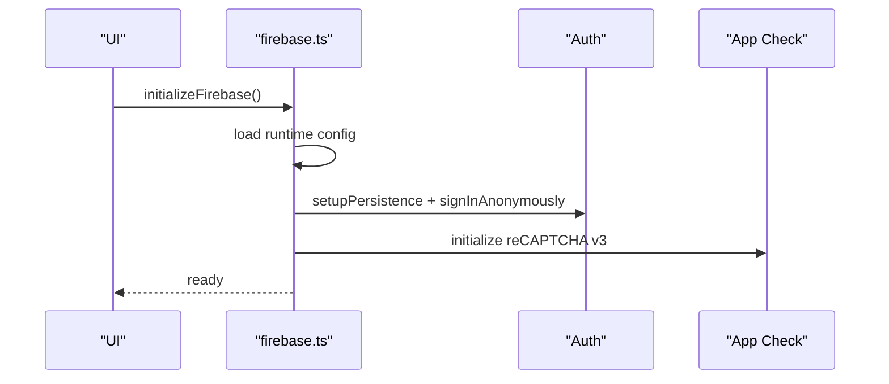

**Diagram sources**
- [firebase.ts:43-125](file://src/config/firebase.ts#L43-L125)
- [firebase.ts:147-252](file://src/config/firebase.ts#L147-L252)
- [firebase.ts:475-514](file://src/config/firebase.ts#L475-L514)

**Section sources**
- [firebase.ts:43-125](file://src/config/firebase.ts#L43-L125)
- [firebase.ts:147-252](file://src/config/firebase.ts#L147-L252)
- [firebase.ts:475-514](file://src/config/firebase.ts#L475-L514)

### Firestore Operations and Caching
- Transcription retrieval and normalization, with caching and usage increment.
- Melody transcription retrieval and persistence.
- Enrichment updates with merging and cache invalidation.
- Homepage variant metadata synchronization across variants.

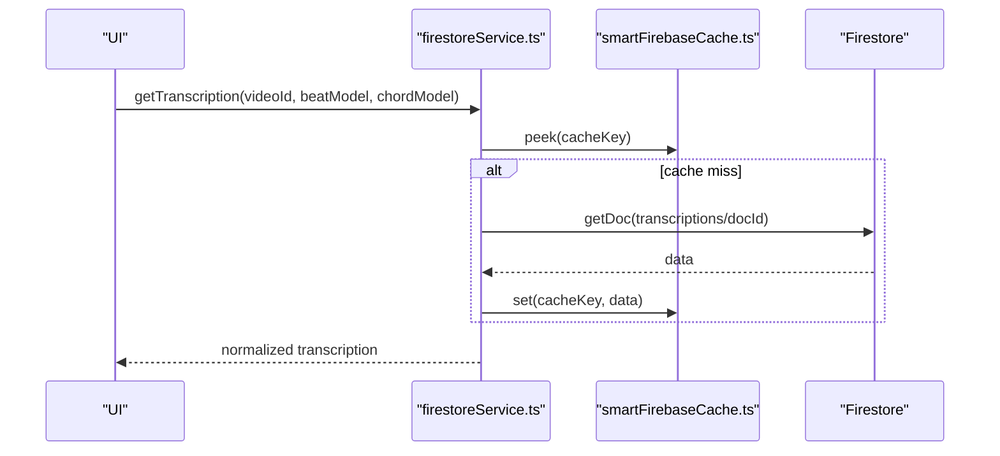

**Diagram sources**
- [firestoreService.ts:405-469](file://src/services/firebase/firestoreService.ts#L405-L469)
- [smartFirebaseCache.ts:73-146](file://src/services/cache/smartFirebaseCache.ts#L73-L146)

**Section sources**
- [firestoreService.ts:405-469](file://src/services/firebase/firestoreService.ts#L405-L469)
- [firestoreService.ts:524-577](file://src/services/firebase/firestoreService.ts#L524-L577)
- [firestoreService.ts:611-686](file://src/services/firebase/firestoreService.ts#L611-L686)
- [smartFirebaseCache.ts:25-343](file://src/services/cache/smartFirebaseCache.ts#L25-L343)

### Cloud Storage Management
- Audio file upload with unique naming and metadata extraction.
- Batch lookup of existing audio files by video ID.
- Streaming upload from external URLs with retry and budget-aware timeouts.
- Simplified storage service that prioritizes Cloud Storage as source of truth and maintains short-lived in-memory metadata.

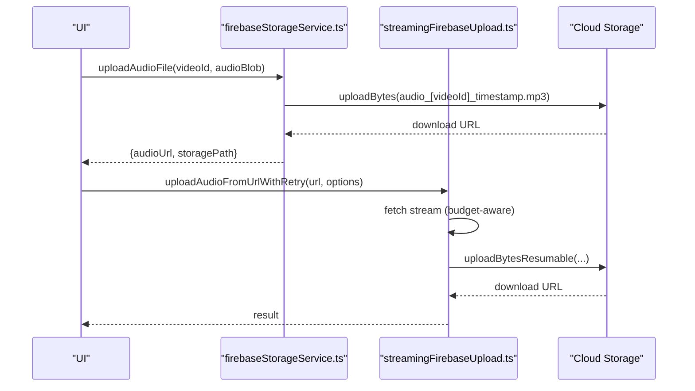

**Diagram sources**
- [firebaseStorageService.ts:196-301](file://src/services/firebase/firebaseStorageService.ts#L196-L301)
- [streamingFirebaseUpload.ts:273-431](file://src/services/firebase/streamingFirebaseUpload.ts#L273-L431)

**Section sources**
- [firebaseStorageService.ts:196-301](file://src/services/firebase/firebaseStorageService.ts#L196-L301)
- [firebaseStorageService.ts:308-346](file://src/services/firebase/firebaseStorageService.ts#L308-L346)
- [streamingFirebaseUpload.ts:34-128](file://src/services/firebase/streamingFirebaseUpload.ts#L34-L128)
- [streamingFirebaseUpload.ts:273-431](file://src/services/firebase/streamingFirebaseUpload.ts#L273-L431)
- [firebaseStorageSimplified.ts:119-276](file://src/services/firebase/firebaseStorageSimplified.ts#L119-L276)

### Segmentation Jobs Lifecycle
- Job creation with request hash deduplication and update token verification.
- Status transitions with TTL-based staleness checks.
- Cleanup of stale jobs and deletion of non-completed jobs by request hash.

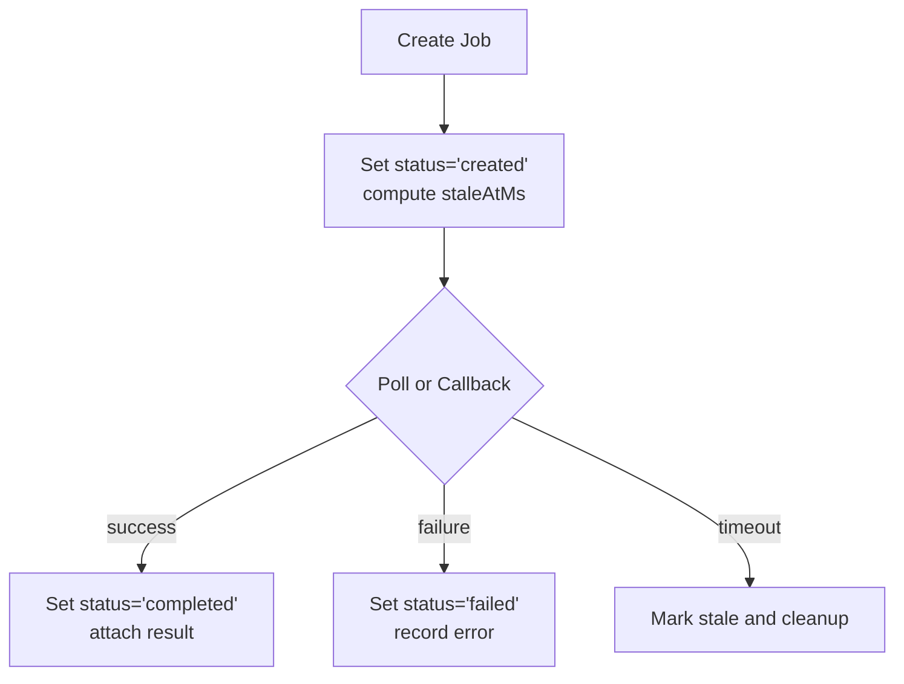

**Diagram sources**
- [segmentationJobService.ts:147-179](file://src/services/firebase/segmentationJobService.ts#L147-L179)
- [segmentationJobService.ts:204-226](file://src/services/firebase/segmentationJobService.ts#L204-L226)
- [segmentationJobService.ts:276-318](file://src/services/firebase/segmentationJobService.ts#L276-L318)

**Section sources**
- [segmentationJobService.ts:147-179](file://src/services/firebase/segmentationJobService.ts#L147-L179)
- [segmentationJobService.ts:204-226](file://src/services/firebase/segmentationJobService.ts#L204-L226)
- [segmentationJobService.ts:276-318](file://src/services/firebase/segmentationJobService.ts#L276-L318)

### Melody Data Model
- Melody transcription results include note events, beat times, tempo, and counts, normalized for consistency.

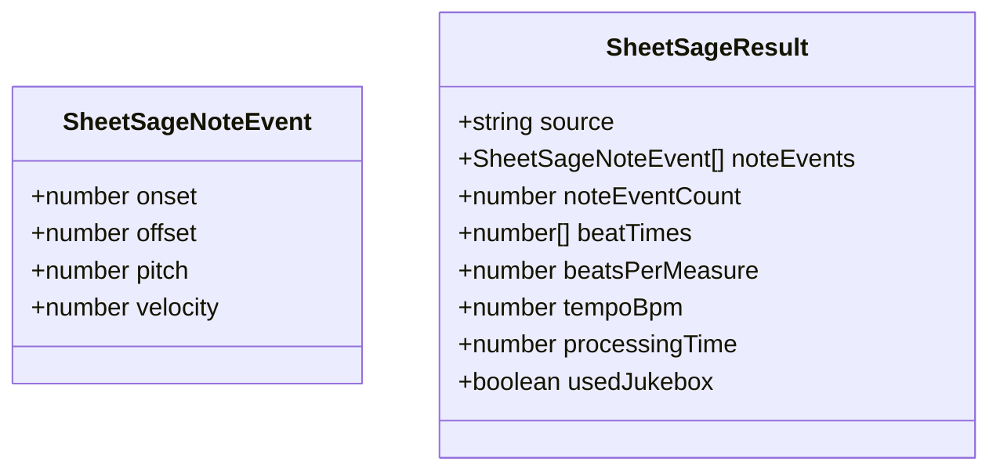

**Diagram sources**
- [sheetSage.ts:1-19](file://src/types/sheetSage.ts#L1-L19)

**Section sources**
- [sheetSage.ts:1-19](file://src/types/sheetSage.ts#L1-L19)

### Backend CORS and Rate Limiting
- Python backend initializes CORS, rate limiting, and logging to complement client-side Firebase operations.

**Section sources**
- [extensions.py:17-93](file://python_backend/extensions.py#L17-L93)

## Dependency Analysis
- Client-side Firebase SDK depends on runtime configuration and App Check.
- Firestore service depends on typed models and cache utilities.
- Storage services depend on Firebase Storage SDK and streaming utilities.
- Admin operations depend on Google Auth and Firestore REST APIs.

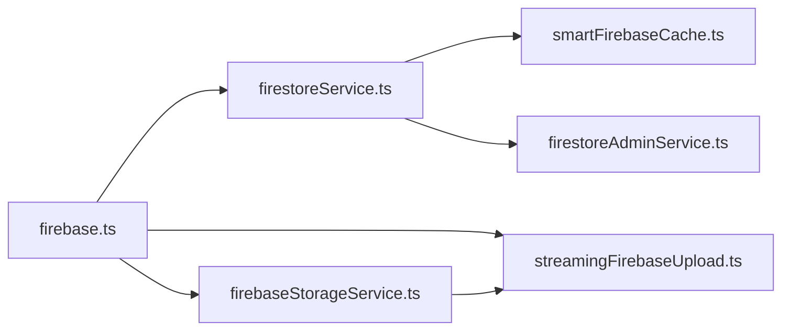

**Diagram sources**
- [firebase.ts:1-537](file://src/config/firebase.ts#L1-L537)
- [firestoreService.ts:1-1173](file://src/services/firebase/firestoreService.ts#L1-L1173)
- [firebaseStorageService.ts:1-414](file://src/services/firebase/firebaseStorageService.ts#L1-L414)
- [streamingFirebaseUpload.ts:1-563](file://src/services/firebase/streamingFirebaseUpload.ts#L1-L563)
- [smartFirebaseCache.ts:1-343](file://src/services/cache/smartFirebaseCache.ts#L1-L343)
- [firestoreAdminService.ts:1-313](file://src/services/firebase/firestoreAdminService.ts#L1-L313)

**Section sources**
- [firebase.ts:1-537](file://src/config/firebase.ts#L1-L537)
- [firestoreService.ts:1-1173](file://src/services/firebase/firestoreService.ts#L1-L1173)
- [firebaseStorageService.ts:1-414](file://src/services/firebase/firebaseStorageService.ts#L1-L414)
- [streamingFirebaseUpload.ts:1-563](file://src/services/firebase/streamingFirebaseUpload.ts#L1-L563)
- [smartFirebaseCache.ts:1-343](file://src/services/cache/smartFirebaseCache.ts#L1-L343)
- [firestoreAdminService.ts:1-313](file://src/services/firebase/firestoreAdminService.ts#L1-L313)

## Performance Considerations
- Caching: Smart cache reduces repeated Firestore queries and suppresses warnings for incomplete records.
- Indexing: Composite indexes optimize primary variant selection and search filtering.
- Streaming uploads: Resumable uploads and budget-aware fetches minimize serverless timeouts.
- Offline resilience: Anonymous auth persistence and App Check improve reliability.
- Rate limiting: Firestore rules include a basic rate-limit helper; backend extensions provide CORS and rate limiting.

[No sources needed since this section provides general guidance]

## Troubleshooting Guide
- Database connectivity issues:
  - CORS errors disable Firestore for the session; the system logs and disables Firestore to avoid repeated failures.
  - Verify Firebase initialization and runtime config loading.
- Permission problems:
  - Firestore rules are temporarily permissive for development; ensure admin deletions are performed by authorized users.
  - Storage rules enforce filename patterns and sizes; confirm uploads meet naming and size constraints.
- Performance optimization:
  - Use caching utilities to reduce repeated reads.
  - Leverage composite indexes for frequent queries.
  - Prefer streaming uploads for large files to avoid local disk constraints.
- Real-time updates and offline persistence:
  - Anonymous authentication persistence helps maintain state across reloads.
  - App Check protects against abuse and improves request reliability.
- Backup strategies:
  - Use Firestore Admin APIs for bulk deletions and administrative tasks.
  - Maintain Cloud Storage as the source of truth for audio files.

**Section sources**
- [firestoreService.ts:456-468](file://src/services/firebase/firestoreService.ts#L456-L468)
- [firebase.ts:147-252](file://src/config/firebase.ts#L147-L252)
- [firebase.ts:475-514](file://src/config/firebase.ts#L475-L514)
- [firestoreAdminService.ts:243-257](file://src/services/firebase/firestoreAdminService.ts#L243-L257)

## Conclusion
ChordMiniApp’s database and storage architecture balances flexibility and performance. Firestore serves structured analysis results with strong caching and indexing, while Cloud Storage hosts audio files with strict naming and streaming capabilities. Security rules provide layered access control, and client-side initialization ensures resilience and protection via App Check and anonymous auth. Operational services manage asynchronous jobs and cleanup, enabling scalable and maintainable audio analysis workflows.

[No sources needed since this section summarizes without analyzing specific files]

## Appendices

### Collection Organization Summary
- transcriptions: Beat/chord analysis with enrichment and homepage variant metadata
- melody: Sheet Sage melody transcription results
- translations and lyrics: Translated and raw lyrics
- keyDetections: Musical key analysis cache
- segmentationJobs: Async SongFormer job state with TTL and cleanup
- admin and metrics: Restricted maintenance and monitoring data

**Section sources**
- [firestoreService.ts:250-254](file://src/services/firebase/firestoreService.ts#L250-L254)
- [segmentationJobService.ts:18-27](file://src/services/firebase/segmentationJobService.ts#L18-L27)
- [firestore.rules:123-141](file://firebase/firestore.rules#L123-L141)
- [firestore.rules:196-218](file://firebase/firestore.rules#L196-L218)
- [firestore.rules:266-281](file://firebase/firestore.rules#L266-L281)