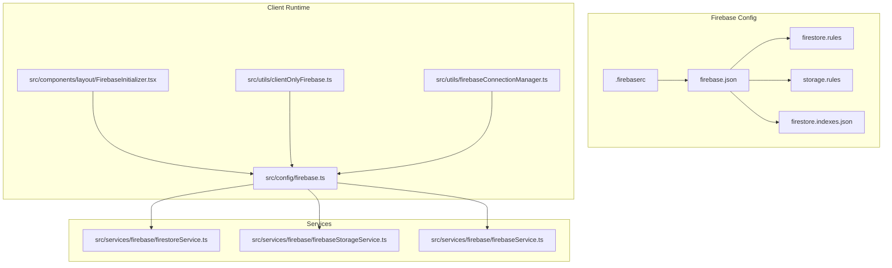
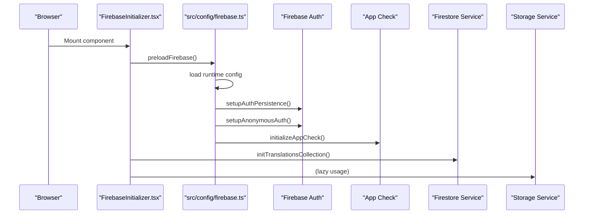
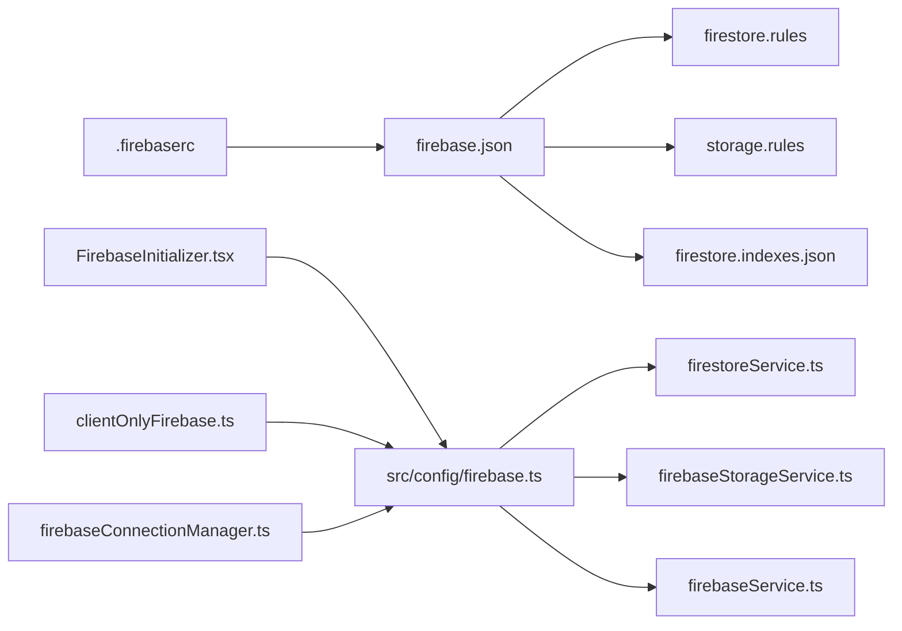

# Firebase Integration

<cite>
**Referenced Files in This Document**
- [firebase.json](file://firebase/firebase.json)
- [firestore.rules](file://firebase/firestore.rules)
- [storage.rules](file://firebase/storage.rules)
- [firestore.indexes.json](file://firebase/firestore.indexes.json)
- [.firebaserc](file://.firebaserc)
- [firebase.ts](file://src/config/firebase.ts)
- [FirebaseInitializer.tsx](file://src/components/layout/FirebaseInitializer.tsx)
- [clientOnlyFirebase.ts](file://src/utils/clientOnlyFirebase.ts)
- [firebaseConnectionManager.ts](file://src/utils/firebaseConnectionManager.ts)
- [firestoreService.ts](file://src/services/firebase/firestoreService.ts)
- [firebaseStorageService.ts](file://src/services/firebase/firebaseStorageService.ts)
- [firebaseService.ts](file://src/services/firebase/firebaseService.ts)
</cite>

## Update Summary
**Changes Made**
- Enhanced Firestore transcription data structure documentation to include audioUrl field
- Updated Firestore service documentation to reflect comprehensive caching of both analysis results and audio sources
- Added detailed explanation of audioUrl field usage for cached audio file URL storage
- Updated security rules documentation to accommodate the new audioUrl field
- Enhanced troubleshooting guidance for audio caching scenarios

## Table of Contents
1. [Introduction](#introduction)
2. [Project Structure](#project-structure)
3. [Core Components](#core-components)
4. [Architecture Overview](#architecture-overview)
5. [Detailed Component Analysis](#detailed-component-analysis)
6. [Dependency Analysis](#dependency-analysis)
7. [Performance Considerations](#performance-considerations)
8. [Troubleshooting Guide](#troubleshooting-guide)
9. [Conclusion](#conclusion)

## Introduction
This document explains the Firebase integration in ChordMiniApp, covering configuration, database structure, storage setup, security rules, initialization, connection management, real-time behavior, and operational guidance. The integration has been enhanced with improved transcription data structure that includes audioUrl field for comprehensive caching of both analysis results and audio sources, enabling more efficient audio playback and reduced bandwidth usage.

## Project Structure
Firebase-related configuration and integration are organized as follows:
- Firebase CLI configuration and security/indexes files under the firebase/ directory
- Runtime client-side initialization and utilities under src/config/firebase.ts
- Client component that preloads Firebase under src/components/layout/FirebaseInitializer.tsx
- Utilities for client-only operations and connection monitoring under src/utils/*
- Services for Firestore and Storage under src/services/firebase/*

**Diagram sources**
- [firebase.json:1-10](file://firebase/firebase.json#L1-L10)
- [firestore.rules:1-289](file://firebase/firestore.rules#L1-L289)
- [storage.rules:1-92](file://firebase/storage.rules#L1-L92)
- [firestore.indexes.json:1-38](file://firebase/firestore.indexes.json#L1-L38)
- [.firebaserc:1-6](file://.firebaserc#L1-L6)
- [firebase.ts:1-537](file://src/config/firebase.ts#L1-L537)
- [FirebaseInitializer.tsx:1-62](file://src/components/layout/FirebaseInitializer.tsx#L1-L62)
- [clientOnlyFirebase.ts:1-146](file://src/utils/clientOnlyFirebase.ts#L1-L146)
- [firebaseConnectionManager.ts:1-163](file://src/utils/firebaseConnectionManager.ts#L1-L163)
- [firestoreService.ts:1-1178](file://src/services/firebase/firestoreService.ts#L1-L1178)
- [firebaseStorageService.ts:1-414](file://src/services/firebase/firebaseStorageService.ts#L1-L414)
- [firebaseService.ts:1-156](file://src/services/firebase/firebaseService.ts#L1-L156)

**Section sources**
- [firebase.json:1-10](file://firebase/firebase.json#L1-L10)
- [firebase.ts:1-537](file://src/config/firebase.ts#L1-L537)
- [FirebaseInitializer.tsx:1-62](file://src/components/layout/FirebaseInitializer.tsx#L1-L62)

## Core Components
- Firebase configuration loader and initialization with runtime config support
- Authentication with anonymous fallback and persistence
- App Check integration via reCAPTCHA v3
- Firestore service for transcriptions, melody, and enrichment operations with enhanced audio caching
- Storage service for audio/video uploads and metadata resolution
- Client-only wrappers and connection monitoring utilities

Key responsibilities:
- src/config/firebase.ts: Initializes Firebase, sets persistence, handles anonymous auth, and exposes helpers for services
- src/services/firebase/firestoreService.ts: Manages transcription and melody documents, caching, and batch operations with audioUrl field support
- src/services/firebase/firebaseStorageService.ts: Handles uploads, URL generation, and file discovery
- src/utils/firebaseConnectionManager.ts: Monitors activity, tests connectivity, and refreshes connections as needed
- src/utils/clientOnlyFirebase.ts: Guards client-only imports and operations

**Section sources**
- [firebase.ts:1-537](file://src/config/firebase.ts#L1-L537)
- [firestoreService.ts:1-1178](file://src/services/firebase/firestoreService.ts#L1-L1178)
- [firebaseStorageService.ts:1-414](file://src/services/firebase/firebaseStorageService.ts#L1-L414)
- [clientOnlyFirebase.ts:1-146](file://src/utils/clientOnlyFirebase.ts#L1-L146)
- [firebaseConnectionManager.ts:1-163](file://src/utils/firebaseConnectionManager.ts#L1-L163)

## Architecture Overview
The Firebase integration follows a layered approach:
- Configuration layer: firebase.json points to Firestore rules, indexes, and Storage rules
- Client initialization: src/config/firebase.ts loads runtime config, initializes app, auth, and App Check
- Services: Firestore and Storage services encapsulate CRUD and caching logic with enhanced audio URL caching
- Utilities: Client-only wrappers and connection manager ensure robustness and resilience

**Diagram sources**
- [FirebaseInitializer.tsx:1-62](file://src/components/layout/FirebaseInitializer.tsx#L1-L62)
- [firebase.ts:43-125](file://src/config/firebase.ts#L43-L125)
- [firebase.ts:127-197](file://src/config/firebase.ts#L127-L197)
- [firebase.ts:475-514](file://src/config/firebase.ts#L475-L514)

## Detailed Component Analysis

### Firebase Configuration and Deployment
- firebase.json defines Firestore rules, indexes, and Storage rules locations
- .firebaserc binds the project ID for CLI deployments
- firestore.indexes.json declares composite indexes for transcriptions queries
- firestore.rules and storage.rules define access policies for documents and files

Operational notes:
- Use Firebase CLI from the repository root to deploy rules and indexes
- Indexes are configured for transcriptions collection group queries

**Section sources**
- [firebase.json:1-10](file://firebase/firebase.json#L1-L10)
- [.firebaserc:1-6](file://.firebaserc#L1-L6)
- [firestore.indexes.json:1-38](file://firebase/firestore.indexes.json#L1-L38)
- [firestore.rules:1-289](file://firebase/firestore.rules#L1-L289)
- [storage.rules:1-92](file://firebase/storage.rules#L1-L92)

### Firestore Database Structure and Indexing
Collections and schemas:
- transcriptions: Stores beat/chord analysis with fields for models, beats, chords, synchronized chords, timestamps, and enrichment metadata, including enhanced audioUrl field for cached audio file URLs
- melody: Stores Sheet Sage melody transcription results
- translations, translationCache: Caches translated lyrics
- transcriptionCache: Caches raw transcription outputs
- lyrics: Public cache for Music.AI transcriptions
- keyDetections: Caches key detection results
- audioCache: Legacy cache for audio metadata
- admin, metrics: Admin-only and metrics collections
- feedback, errorLogs: Private collections for submissions and logs
- segmentationJobs: Async job state and results for SongFormer

Enhanced transcription data structure with audioUrl field:
The transcription schema now includes an audioUrl field that enables comprehensive caching of both analysis results and audio sources. This field stores the URL of cached audio files, allowing the application to serve audio content directly from Firebase Storage while maintaining analysis data in Firestore.

Indexing strategy:
- Composite indexes for transcriptions collection group:
  - isPrimaryVariant ascending, createdAt descending
  - isPrimaryVariant ascending, searchableKeys array contains, createdAt descending

These indexes optimize queries filtering by primary variant and searchable keys.

**Section sources**
- [firestore.rules:124-218](file://firebase/firestore.rules#L124-L218)
- [firestore.indexes.json:1-38](file://firebase/firestore.indexes.json#L1-L38)
- [firestoreService.ts:64-108](file://src/services/firebase/firestoreService.ts#L64-L108)
- [firestoreService.ts:893-896](file://src/services/firebase/firestoreService.ts#L893-L896)

### Firebase Storage Configuration
Storage paths and rules:
- audio/: public read; write validated by content-type and size; filenames must include the video ID in brackets
- video/: optional; public read; write validated by content-type and size
- temp/: read allowed for URL resolution; write/update for temporary offload uploads; delete allowed for cleanup

Security and access control:
- Anonymous uploads permitted for audio files with strict validation
- Deletion is disabled for audio and video buckets by default
- Temporary path allows controlled uploads for processing

**Section sources**
- [storage.rules:44-84](file://firebase/storage.rules#L44-L84)
- [firebaseStorageService.ts:196-301](file://src/services/firebase/firebaseStorageService.ts#L196-L301)

### Security Rules Implementation
Authentication requirements:
- Anonymous authentication is supported and used for cold start scenarios
- Admin-only operations restrict reads/writes to trusted emails
- Public caches allow unauthenticated reads; writes are relaxed or temporarily permissive to isolate validation issues

Role-based access control:
- Admin collection: only specific emails can read/write
- Metrics: read publicly, write restricted to admins
- Feedback and error logs: private creation with rate limits

Data protection measures:
- Field-level validation functions enforce shape and sizes
- Rate limiting helper included for basic throttling
- Deletion controls enforced for sensitive collections

**Section sources**
- [firestore.rules:64-286](file://firebase/firestore.rules#L64-L286)
- [storage.rules:1-92](file://firebase/storage.rules#L1-L92)

### Firebase Initialization and Connection Management
Initialization process:
- Runtime config loading from /api/config on client or process.env on server
- Lazy initialization of Firestore, Storage, and Auth
- App Check with reCAPTCHA v3; debug token enabled locally
- Anonymous authentication with exponential backoff retries and extended timeouts for cold starts

Connection management:
- Activity timestamps and periodic health checks
- Connection refresh on staleness detection
- Operation wrapper with retries and timeouts

**Section sources**
- [firebase.ts:43-125](file://src/config/firebase.ts#L43-L125)
- [firebase.ts:147-252](file://src/config/firebase.ts#L147-L252)
- [firebase.ts:475-537](file://src/config/firebase.ts#L475-L537)
- [FirebaseInitializer.tsx:1-62](file://src/components/layout/FirebaseInitializer.tsx#L1-L62)
- [firebaseConnectionManager.ts:1-163](file://src/utils/firebaseConnectionManager.ts#L1-L163)

### Real-Time and Offline Persistence
Observations:
- Firestore service does not explicitly set offline persistence; caching relies on local memory and client-side caches
- Authentication persistence is configured with browser local persistence to survive refreshes
- Connection monitoring proactively detects and refreshes stale connections

Implications:
- Real-time listeners are not implemented in the reviewed code; offline persistence is not configured in Firestore
- Robust retry and fallback strategies are implemented for authentication and network failures

**Section sources**
- [firebase.ts:127-145](file://src/config/firebase.ts#L127-L145)
- [firebaseConnectionManager.ts:1-163](file://src/utils/firebaseConnectionManager.ts#L1-L163)

### Firestore Service: Transcriptions and Melody
Responsibilities:
- Normalize and sanitize transcription data including audioUrl field for cached audio file URLs
- Retrieve, save, and enrich transcription documents
- Increment usage counters atomically
- Sync homepage variant metadata across multiple transcription variants
- Handle CORS/network errors by disabling Firestore for the session

Enhanced audio caching capabilities:
The Firestore service now supports comprehensive audio caching through the audioUrl field. This enhancement enables the application to store and retrieve cached audio file URLs alongside analysis data, reducing bandwidth usage and improving playback performance.

Patterns:
- Cache-first retrieval with in-memory cache
- Batch writes for metadata synchronization
- Defensive normalization for beat numbers, chord sequences, and key/modulation fields
- Audio URL validation and sanitization for reliable caching

**Section sources**
- [firestoreService.ts:64-108](file://src/services/firebase/firestoreService.ts#L64-L108)
- [firestoreService.ts:203-248](file://src/services/firebase/firestoreService.ts#L203-L248)
- [firestoreService.ts:405-469](file://src/services/firebase/firestoreService.ts#L405-L469)
- [firestoreService.ts:524-577](file://src/services/firebase/firestoreService.ts#L524-L577)
- [firestoreService.ts:688-747](file://src/services/firebase/firestoreService.ts#L688-L747)
- [firestoreService.ts:893-896](file://src/services/firebase/firestoreService.ts#L893-L896)

### Storage Service: Uploads and Metadata
Responsibilities:
- Upload audio/video files with validated filenames and content types
- Generate public download URLs
- Discover existing files by video ID pattern
- Delete files by storage path
- Skip deprecated metadata writes to Firestore for audio files

Patterns:
- Unique filename pattern with bracketed video ID and timestamp
- Blob conversion for ArrayBuffer inputs
- Graceful error handling without falling back to local storage

**Section sources**
- [firebaseStorageService.ts:196-301](file://src/services/firebase/firebaseStorageService.ts#L196-L301)
- [firebaseStorageService.ts:322-346](file://src/services/firebase/firebaseStorageService.ts#L322-L346)
- [firebaseStorageService.ts:385-413](file://src/services/firebase/firebaseStorageService.ts#L385-L413)

### Legacy Service: Public Cache Writes
The legacy firebaseService.ts demonstrates public cache writes to Firestore and Storage for lyrics and audio metadata. While the current architecture emphasizes client-side caching and Storage as the source of truth, this service illustrates historical patterns.

**Section sources**
- [firebaseService.ts:34-72](file://src/services/firebase/firebaseService.ts#L34-L72)
- [firebaseService.ts:110-123](file://src/services/firebase/firebaseService.ts#L110-L123)
- [firebaseService.ts:132-153](file://src/services/firebase/firebaseService.ts#L132-L153)

## Dependency Analysis
High-level dependencies among Firebase integration modules:

**Diagram sources**
- [.firebaserc:1-6](file://.firebaserc#L1-L6)
- [firebase.json:1-10](file://firebase/firebase.json#L1-L10)
- [firestore.rules:1-289](file://firebase/firestore.rules#L1-L289)
- [storage.rules:1-92](file://firebase/storage.rules#L1-L92)
- [firestore.indexes.json:1-38](file://firebase/firestore.indexes.json#L1-L38)
- [FirebaseInitializer.tsx:1-62](file://src/components/layout/FirebaseInitializer.tsx#L1-L62)
- [firebase.ts:1-537](file://src/config/firebase.ts#L1-L537)
- [clientOnlyFirebase.ts:1-146](file://src/utils/clientOnlyFirebase.ts#L1-L146)
- [firebaseConnectionManager.ts:1-163](file://src/utils/firebaseConnectionManager.ts#L1-L163)
- [firestoreService.ts:1-1178](file://src/services/firebase/firestoreService.ts#L1-L1178)
- [firebaseStorageService.ts:1-414](file://src/services/firebase/firebaseStorageService.ts#L1-L414)
- [firebaseService.ts:1-156](file://src/services/firebase/firebaseService.ts#L1-L156)

**Section sources**
- [firebase.ts:1-537](file://src/config/firebase.ts#L1-L537)
- [firestoreService.ts:1-1178](file://src/services/firebase/firestoreService.ts#L1-L1178)
- [firebaseStorageService.ts:1-414](file://src/services/firebase/firebaseStorageService.ts#L1-L414)

## Performance Considerations
- Indexes: Composite indexes on transcriptions improve query performance for primary variant and searchable keys
- Caching: Firestore service uses in-memory cache to avoid redundant reads, enhanced with audioUrl field for comprehensive audio caching
- Connection monitoring: Periodic checks and refresh mitigate inactivity-induced staleness
- Client-only wrappers: Guard against SSR issues and provide graceful fallbacks
- Upload optimization: Unique filenames and metadata retrieval minimize redundant operations
- Audio caching: The audioUrl field enables efficient audio playback by serving cached audio files directly from Firebase Storage

## Troubleshooting Guide
Common issues and resolutions:
- CORS or network errors accessing Firestore: The Firestore service disables Firestore for the session upon detecting CORS/network errors; verify CORS configuration and network connectivity
- Anonymous authentication failures: Check Firebase Console for anonymous auth enabled; review retry logs and error codes
- Stale connections: Use connection monitoring utilities to detect and refresh stale connections
- Missing runtime config: Ensure environment variables are provided at runtime; initialization warns when required variables are missing
- Storage upload failures: Validate content type and size constraints; confirm filename pattern includes the video ID in brackets
- Audio caching issues: Verify audioUrl field is properly populated in transcription documents; check Firebase Storage permissions for cached audio files

Operational tips:
- Use App Check in production to mitigate abuse
- Monitor admin and metrics collections for anomalies
- Keep security rules aligned with intended access patterns
- Monitor audioUrl field usage for optimal caching performance

**Section sources**
- [firestoreService.ts:456-468](file://src/services/firebase/firestoreService.ts#L456-L468)
- [firebase.ts:200-252](file://src/config/firebase.ts#L200-L252)
- [firebaseConnectionManager.ts:62-89](file://src/utils/firebaseConnectionManager.ts#L62-L89)
- [storage.rules:44-84](file://firebase/storage.rules#L44-L84)

## Conclusion
ChordMiniApp integrates Firebase with a robust configuration, resilient initialization, and pragmatic caching strategies. The enhanced Firestore integration now includes comprehensive audio caching capabilities through the audioUrl field, enabling efficient storage and retrieval of both analysis results and audio sources. Firestore and Storage are governed by explicit rules and indexes, while client-side utilities ensure reliability across cold starts and inactivity. The documented patterns provide a foundation for secure, scalable Firebase usage, with clear guidance for troubleshooting and optimization of both analysis data and audio caching scenarios.