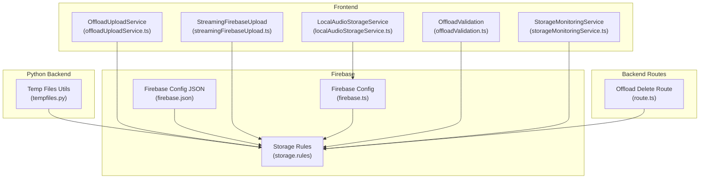
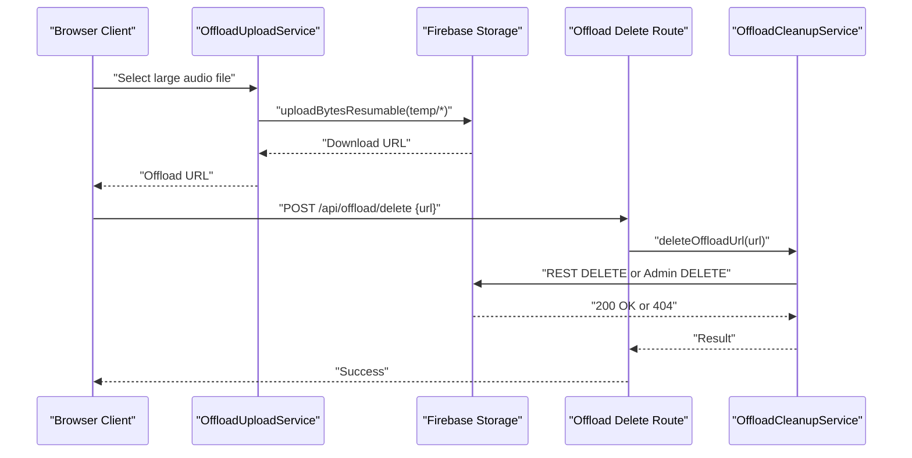
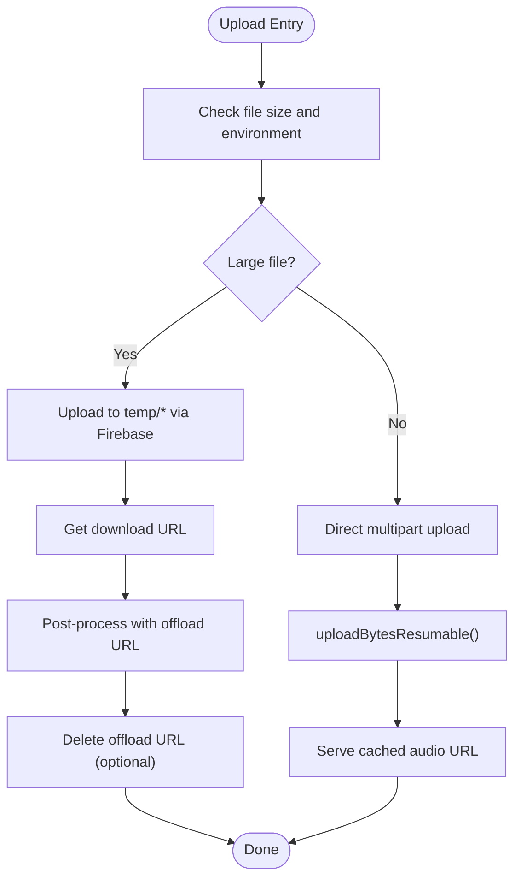
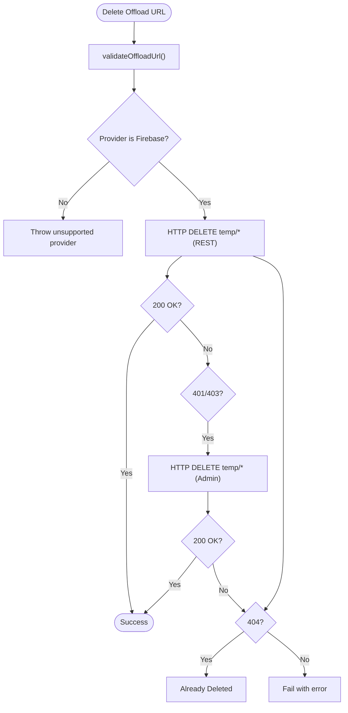
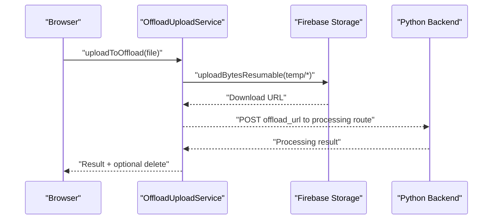
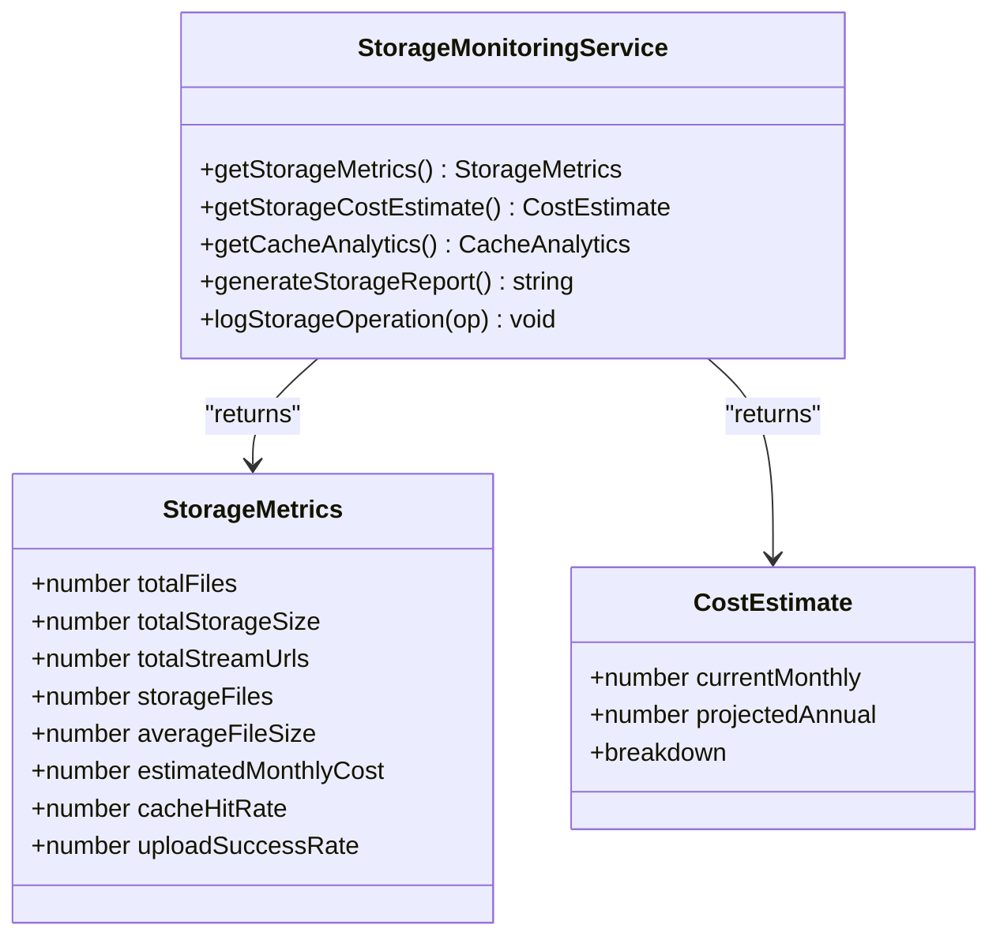
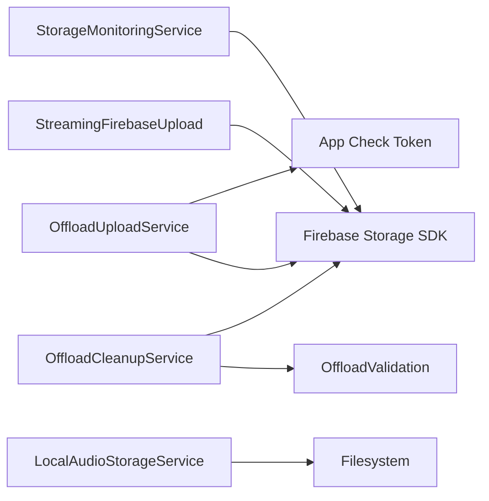

# Storage Management

<cite>
**Referenced Files in This Document**
- [offloadUploadService.ts](file://src/services/storage/offloadUploadService.ts)
- [offloadCleanupService.ts](file://src/services/storage/offloadCleanupService.ts)
- [offloadValidation.ts](file://src/utils/offloadValidation.ts)
- [route.ts](file://src/app/api/offload/delete/route.ts)
- [localAudioStorageService.ts](file://src/services/storage/localAudioStorageService.ts)
- [storageMonitoringService.ts](file://src/services/storage/storageMonitoringService.ts)
- [streamingFirebaseUpload.ts](file://src/services/firebase/streamingFirebaseUpload.ts)
- [firebase.ts](file://src/config/firebase.ts)
- [storage.rules](file://firebase/storage.rules)
- [firebase.json](file://firebase/firebase.json)
- [verify-firebase-audio-cors.mjs](file://scripts/verify-firebase-audio-cors.mjs)
- [tempfiles.py](file://python_backend/services/audio/tempfiles.py)
</cite>

## Table of Contents
1. [Introduction](#introduction)
2. [Project Structure](#project-structure)
3. [Core Components](#core-components)
4. [Architecture Overview](#architecture-overview)
5. [Detailed Component Analysis](#detailed-component-analysis)
6. [Dependency Analysis](#dependency-analysis)
7. [Performance Considerations](#performance-considerations)
8. [Troubleshooting Guide](#troubleshooting-guide)
9. [Conclusion](#conclusion)
10. [Appendices](#appendices)

## Introduction
This document explains storage management in ChordMiniApp with a focus on file organization, upload/download flows, cleanup, offloading for large audio files, monitoring, format handling, security, and Firebase integration. It consolidates frontend and backend storage behaviors to help developers and operators manage audio content reliably and cost-effectively.

## Project Structure
ChordMiniApp implements storage across:
- Frontend services for streaming uploads, offloading, and local audio caching
- Backend routes for offload cleanup
- Firebase Storage with enforced rules and CORS verification
- Python backend utilities for temporary file management

**Diagram sources**
- [offloadUploadService.ts:1-468](file://src/services/storage/offloadUploadService.ts#L1-L468)
- [streamingFirebaseUpload.ts:1-563](file://src/services/firebase/streamingFirebaseUpload.ts#L1-L563)
- [localAudioStorageService.ts:1-238](file://src/services/storage/localAudioStorageService.ts#L1-L238)
- [offloadValidation.ts:1-113](file://src/utils/offloadValidation.ts#L1-L113)
- [route.ts:1-49](file://src/app/api/offload/delete/route.ts#L1-L49)
- [storageMonitoringService.ts:1-297](file://src/services/storage/storageMonitoringService.ts#L1-L297)
- [storage.rules:1-92](file://firebase/storage.rules#L1-L92)
- [firebase.ts:1-537](file://src/config/firebase.ts#L1-L537)
- [firebase.json:1-9](file://firebase/firebase.json#L1-L9)
- [tempfiles.py:1-136](file://python_backend/services/audio/tempfiles.py#L1-L136)

**Section sources**
- [offloadUploadService.ts:1-468](file://src/services/storage/offloadUploadService.ts#L1-L468)
- [streamingFirebaseUpload.ts:1-563](file://src/services/firebase/streamingFirebaseUpload.ts#L1-L563)
- [localAudioStorageService.ts:1-238](file://src/services/storage/localAudioStorageService.ts#L1-L238)
- [offloadValidation.ts:1-113](file://src/utils/offloadValidation.ts#L1-L113)
- [route.ts:1-49](file://src/app/api/offload/delete/route.ts#L1-L49)
- [storageMonitoringService.ts:1-297](file://src/services/storage/storageMonitoringService.ts#L1-L297)
- [storage.rules:1-92](file://firebase/storage.rules#L1-L92)
- [firebase.ts:1-537](file://src/config/firebase.ts#L1-L537)
- [firebase.json:1-9](file://firebase/firebase.json#L1-L9)
- [tempfiles.py:1-136](file://python_backend/services/audio/tempfiles.py#L1-L136)

## Core Components
- OffloadUploadService: Browser-side offloading to Firebase Storage for large audio files, progress tracking, and post-processing orchestration.
- OffloadCleanupService: Deletion of temporary offload files via Firebase Storage REST API or admin API with fallback.
- OffloadValidation: Strict URL validation and parsing for Firebase Storage URLs.
- StreamingFirebaseUpload: Direct streaming upload from external sources to Firebase with retry and budget-aware logic.
- LocalAudioStorageService: Local disk caching of audio files with metadata and search utilities.
- StorageMonitoringService: Firebase Storage usage metrics, cost estimation, and reporting.
- Firebase configuration and rules: Runtime initialization, App Check, and storage security rules.
- Python tempfiles: Safe temporary file creation and cleanup utilities for backend processing.

**Section sources**
- [offloadUploadService.ts:1-468](file://src/services/storage/offloadUploadService.ts#L1-L468)
- [offloadCleanupService.ts:1-160](file://src/services/storage/offloadCleanupService.ts#L1-L160)
- [offloadValidation.ts:1-113](file://src/utils/offloadValidation.ts#L1-L113)
- [streamingFirebaseUpload.ts:1-563](file://src/services/firebase/streamingFirebaseUpload.ts#L1-L563)
- [localAudioStorageService.ts:1-238](file://src/services/storage/localAudioStorageService.ts#L1-L238)
- [storageMonitoringService.ts:1-297](file://src/services/storage/storageMonitoringService.ts#L1-L297)
- [firebase.ts:1-537](file://src/config/firebase.ts#L1-L537)
- [storage.rules:1-92](file://firebase/storage.rules#L1-L92)
- [tempfiles.py:1-136](file://python_backend/services/audio/tempfiles.py#L1-L136)

## Architecture Overview
The storage architecture separates concerns:
- Large audio uploads bypass serverless limits by offloading to Firebase Storage via the browser.
- Streaming uploads from external URLs convert streams to blobs and upload resumably.
- Cleanup removes temporary offload files after processing.
- Monitoring tracks usage and estimates costs.
- Security is enforced by Firebase Storage rules and App Check.

**Diagram sources**
- [offloadUploadService.ts:149-205](file://src/services/storage/offloadUploadService.ts#L149-L205)
- [route.ts:1-49](file://src/app/api/offload/delete/route.ts#L1-L49)
- [offloadCleanupService.ts:94-136](file://src/services/storage/offloadCleanupService.ts#L94-L136)

## Detailed Component Analysis

### File Organization Strategy
- Folder structure and naming:
  - Temporary offloads: temp/<timestamp>-<sanitized-filename>
  - Final audio cache: audio/[videoId]_<timestamp>_<original-filename>
- Naming conventions:
  - Video ID embedded in brackets to satisfy rules.
  - Timestamp ensures uniqueness and ordering.
  - Sanitized filenames avoid invalid characters.
- Categorization:
  - temp: short-lived files for processing handoff.
  - audio: long-term cached audio with read access for serving.

**Section sources**
- [offloadUploadService.ts:171-174](file://src/services/storage/offloadUploadService.ts#L171-L174)
- [streamingFirebaseUpload.ts:57-60](file://src/services/firebase/streamingFirebaseUpload.ts#L57-L60)
- [storage.rules:44-55](file://firebase/storage.rules#L44-L55)
- [storage.rules:72-84](file://firebase/storage.rules#L72-L84)

### Upload and Download Processes
- Streaming uploads:
  - Convert ReadableStream to Blob with memory-conscious chunking and per-read timeouts.
  - Resumable upload to Firebase Storage with progress callbacks.
- Chunked transfers and progress:
  - Progress logged at intervals; resumable tasks support interruption and resume.
- Offloading large files:
  - Browser uploads to temp/* with App Check token header.
  - Post-processing receives offload URL; optional immediate deletion.
- Download flows:
  - Direct Firebase download URLs for cached audio.
  - CORS verification script validates cross-origin access.

**Diagram sources**
- [offloadUploadService.ts:53-73](file://src/services/storage/offloadUploadService.ts#L53-L73)
- [offloadUploadService.ts:149-205](file://src/services/storage/offloadUploadService.ts#L149-L205)
- [streamingFirebaseUpload.ts:134-199](file://src/services/firebase/streamingFirebaseUpload.ts#L134-L199)
- [streamingFirebaseUpload.ts:328-431](file://src/services/firebase/streamingFirebaseUpload.ts#L328-L431)

**Section sources**
- [streamingFirebaseUpload.ts:34-128](file://src/services/firebase/streamingFirebaseUpload.ts#L34-L128)
- [streamingFirebaseUpload.ts:134-199](file://src/services/firebase/streamingFirebaseUpload.ts#L134-L199)
- [offloadUploadService.ts:149-205](file://src/services/storage/offloadUploadService.ts#L149-L205)
- [offloadUploadService.ts:214-281](file://src/services/storage/offloadUploadService.ts#L214-L281)

### Cleanup Mechanisms
- Temporary file removal:
  - REST API deletes offload URLs; falls back to admin API if rules forbid.
  - Returns success or alreadyDeleted when 404 is encountered.
- Expired content deletion:
  - Not implemented in the reviewed code; recommended to add TTL-based cleanup for temp/*.
- Storage quota management:
  - Not implemented in the reviewed code; recommended to integrate quotas via Firebase Admin or billing alerts.

**Diagram sources**
- [offloadValidation.ts:32-56](file://src/utils/offloadValidation.ts#L32-L56)
- [offloadCleanupService.ts:94-136](file://src/services/storage/offloadCleanupService.ts#L94-L136)

**Section sources**
- [route.ts:1-49](file://src/app/api/offload/delete/route.ts#L1-L49)
- [offloadCleanupService.ts:94-136](file://src/services/storage/offloadCleanupService.ts#L94-L136)
- [offloadValidation.ts:32-56](file://src/utils/offloadValidation.ts#L32-L56)

### Offloading System for Large Audio Files
- Purpose:
  - Bypass serverless multipart body limits by uploading large audio to Firebase Storage.
- Implementation:
  - Browser-only offload upload to temp/* with resumable upload and metadata.
  - Post-processing routes receive offload URL and optionally delete after processing.
- CDN and bandwidth:
  - Firebase Storage serves files; CDN behavior depends on client-side caching and origin policies.
- Bandwidth optimization:
  - Not implemented in the reviewed code; consider enabling compression and range requests.

**Diagram sources**
- [offloadUploadService.ts:214-281](file://src/services/storage/offloadUploadService.ts#L214-L281)
- [offloadUploadService.ts:149-205](file://src/services/storage/offloadUploadService.ts#L149-L205)

**Section sources**
- [offloadUploadService.ts:53-73](file://src/services/storage/offloadUploadService.ts#L53-L73)
- [offloadUploadService.ts:149-205](file://src/services/storage/offloadUploadService.ts#L149-L205)
- [offloadUploadService.ts:214-281](file://src/services/storage/offloadUploadService.ts#L214-L281)

### Storage Monitoring
- Metrics tracked:
  - Total files, storage size, stream URLs, average file size, cache hit rate, upload success rate.
- Cost estimation:
  - Monthly storage cost derived from total size; bandwidth cost estimated conservatively.
- Reporting:
  - Generates a formatted report with recommendations.

**Diagram sources**
- [storageMonitoringService.ts:10-36](file://src/services/storage/storageMonitoringService.ts#L10-L36)
- [storageMonitoringService.ts:57-161](file://src/services/storage/storageMonitoringService.ts#L57-L161)
- [storageMonitoringService.ts:193-219](file://src/services/storage/storageMonitoringService.ts#L193-L219)

**Section sources**
- [storageMonitoringService.ts:57-161](file://src/services/storage/storageMonitoringService.ts#L57-L161)
- [storageMonitoringService.ts:193-219](file://src/services/storage/storageMonitoringService.ts#L193-L219)

### File Format Management
- Supported audio formats:
  - Rules allow audio/* and application/octet-stream; local service supports mp3, wav, m4a, opus, webm.
- Transcoding:
  - Not implemented in the reviewed code; recommended to add transcoding to standardized formats and qualities.
- Quality preservation:
  - Not implemented in the reviewed code; recommended to preserve original quality and bitrate.

**Section sources**
- [storage.rules:11-19](file://firebase/storage.rules#L11-L19)
- [localAudioStorageService.ts:5-39](file://src/services/storage/localAudioStorageService.ts#L5-L39)

### Security Measures
- Access control:
  - Storage rules enforce content type, size, and naming patterns; temp/* allows deletion; audio/* denies deletion by default.
- Encryption:
  - Not implemented in the reviewed code; consider server-side encryption at rest and TLS in transit.
- Integrity verification:
  - Not implemented in the reviewed code; recommended to add checksums and ETags.
- App Check:
  - Client attaches X-Firebase-AppCheck header for API requests.

**Section sources**
- [storage.rules:44-55](file://firebase/storage.rules#L44-L55)
- [storage.rules:72-84](file://firebase/storage.rules#L72-L84)
- [firebase.ts:522-536](file://src/config/firebase.ts#L522-L536)
- [offloadUploadService.ts:96-100](file://src/services/storage/offloadUploadService.ts#L96-L100)

### Firebase Integration
- Bucket configuration:
  - Bucket name loaded from environment; rules define paths and permissions.
- CORS settings:
  - Verification script tests origins against Firebase/GCS hosts.
- Access token management:
  - App Check tokens are fetched and attached to API requests.

**Section sources**
- [firebase.json:6-8](file://firebase/firebase.json#L6-L8)
- [storage.rules:1-92](file://firebase/storage.rules#L1-L92)
- [verify-firebase-audio-cors.mjs:123-164](file://scripts/verify-firebase-audio-cors.mjs#L123-L164)
- [firebase.ts:522-536](file://src/config/firebase.ts#L522-L536)

## Dependency Analysis
- OffloadUploadService depends on Firebase Storage SDK and App Check.
- OffloadCleanupService depends on OffloadValidation and Firebase Admin credentials.
- StreamingFirebaseUpload depends on Firebase Storage SDK and runtime Firebase initialization.
- StorageMonitoringService depends on Firebase Storage SDK and pricing constants.
- LocalAudioStorageService depends on filesystem APIs and metadata cache.

**Diagram sources**
- [offloadUploadService.ts:10-10](file://src/services/storage/offloadUploadService.ts#L10-L10)
- [offloadCleanupService.ts:1-6](file://src/services/storage/offloadCleanupService.ts#L1-L6)
- [offloadValidation.ts:1-113](file://src/utils/offloadValidation.ts#L1-L113)
- [streamingFirebaseUpload.ts:8-9](file://src/services/firebase/streamingFirebaseUpload.ts#L8-L9)
- [storageMonitoringService.ts:7-8](file://src/services/storage/storageMonitoringService.ts#L7-L8)
- [localAudioStorageService.ts:1-4](file://src/services/storage/localAudioStorageService.ts#L1-L4)

**Section sources**
- [offloadUploadService.ts:1-468](file://src/services/storage/offloadUploadService.ts#L1-L468)
- [offloadCleanupService.ts:1-160](file://src/services/storage/offloadCleanupService.ts#L1-L160)
- [offloadValidation.ts:1-113](file://src/utils/offloadValidation.ts#L1-L113)
- [streamingFirebaseUpload.ts:1-563](file://src/services/firebase/streamingFirebaseUpload.ts#L1-L563)
- [storageMonitoringService.ts:1-297](file://src/services/storage/storageMonitoringService.ts#L1-L297)
- [localAudioStorageService.ts:1-238](file://src/services/storage/localAudioStorageService.ts#L1-L238)

## Performance Considerations
- Memory efficiency:
  - Streaming-to-Blob conversion caps size and minimizes allocations.
- Retry and budget-awareness:
  - URL uploads enforce operation budgets and adaptive delays.
- Resumable uploads:
  - Reduce network failure impact for large files.
- Recommendations:
  - Implement TTL-based cleanup for temp/*.
  - Add transcoding and compression to reduce storage and bandwidth.
  - Integrate storage quotas and billing alerts.

[No sources needed since this section provides general guidance]

## Troubleshooting Guide
- Upload failures:
  - Large file exceeds temp/* limit; switch to direct multipart or reduce size.
  - Permission denied for temp/*; verify Storage rules allow create/update and App Check settings.
- Download errors:
  - CORS misconfiguration; use verification script to test origins.
  - Invalid or expired download URL; regenerate URL or check cleanup logic.
- Storage quota exceeded:
  - Not implemented; add quotas and alerts via Firebase Admin or billing integrations.
- Offload deletion failures:
  - Non-OK status or timeouts; check REST/Admin endpoints and credentials.

**Section sources**
- [offloadUploadService.ts:151-205](file://src/services/storage/offloadUploadService.ts#L151-L205)
- [offloadCleanupService.ts:94-136](file://src/services/storage/offloadCleanupService.ts#L94-L136)
- [verify-firebase-audio-cors.mjs:123-164](file://scripts/verify-firebase-audio-cors.mjs#L123-L164)

## Conclusion
ChordMiniApp’s storage system leverages Firebase Storage for scalable, secure audio handling. It offloads large files, monitors usage, and cleans up temporary content. Enhancements such as transcoding, integrity checks, encryption, TTL-based cleanup, and storage quotas would further strengthen reliability and cost-efficiency.

[No sources needed since this section summarizes without analyzing specific files]

## Appendices

### Appendix A: Local Audio Cache Metadata Schema
- Fields:
  - videoId, audioUrl, title, duration, fileSize, createdAt, filePath, filename, sourceDir.

**Section sources**
- [localAudioStorageService.ts:10-31](file://src/services/storage/localAudioStorageService.ts#L10-L31)
- [localAudioStorageService.ts:211-237](file://src/services/storage/localAudioStorageService.ts#L211-L237)

### Appendix B: Python Backend Temporary File Utilities
- Context managers for safe temporary files and directories.
- Manual cleanup and path generation helpers.

**Section sources**
- [tempfiles.py:15-136](file://python_backend/services/audio/tempfiles.py#L15-L136)