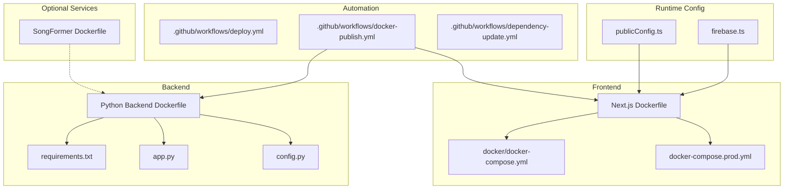
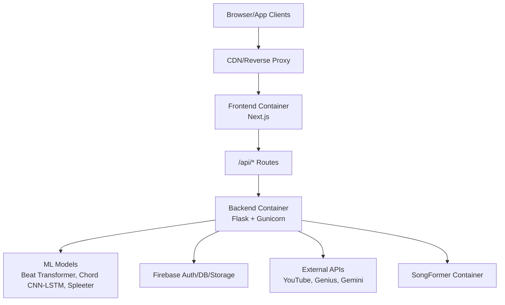
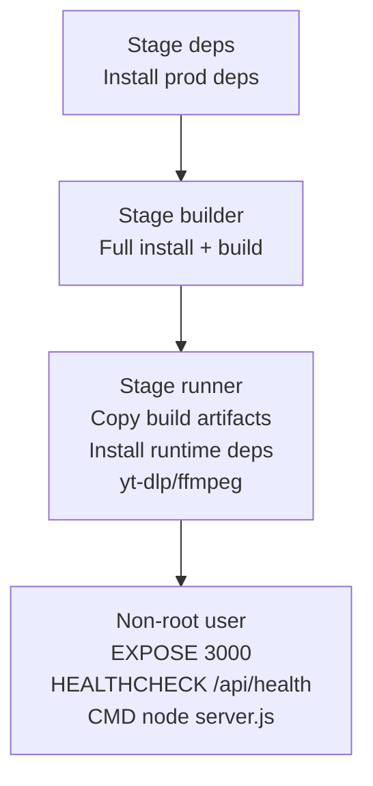
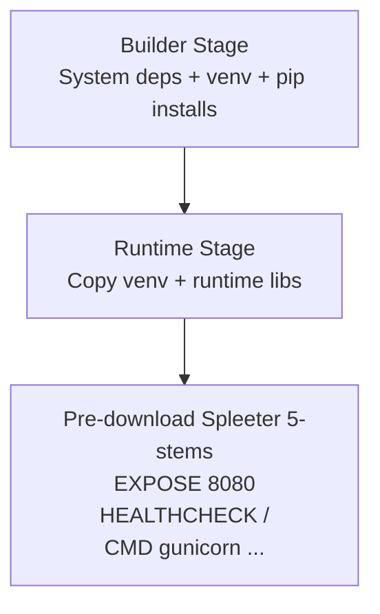
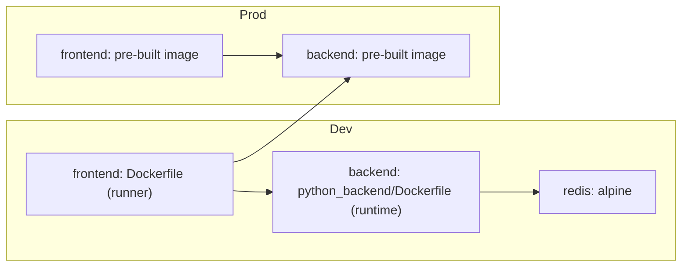
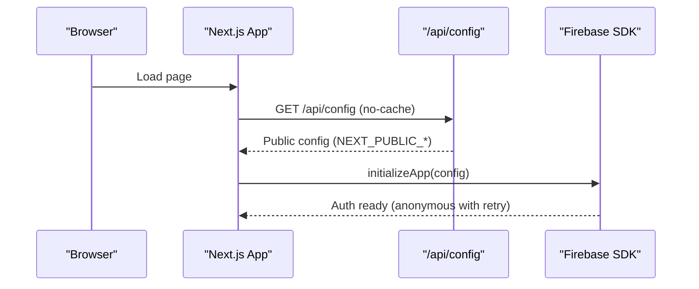
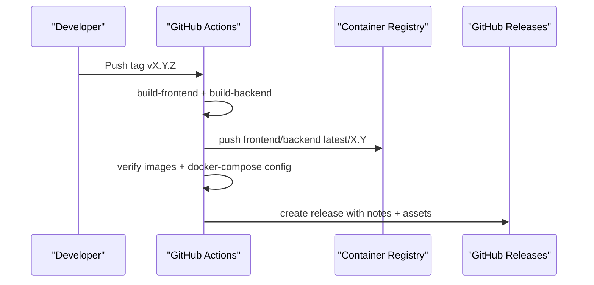
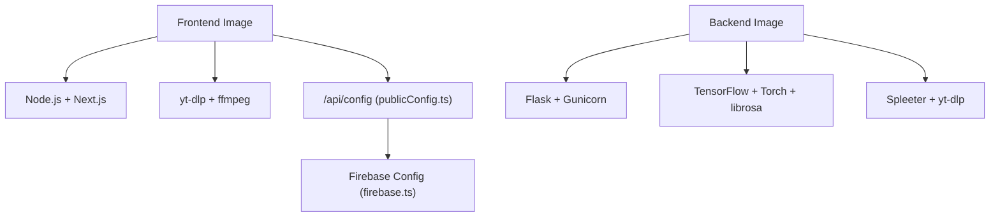

# Deployment and Operations

<cite>
**Referenced Files in This Document**
- [Dockerfile](file://Dockerfile)
- [docker-compose.prod.yml](file://docker-compose.prod.yml)
- [docker/docker-compose.yml](file://docker/docker-compose.yml)
- [docker/docker-compose.dev.yml](file://docker/docker-compose.dev.yml)
- [python_backend/Dockerfile](file://python_backend/Dockerfile)
- [SongFormer/Dockerfile](file://SongFormer/Dockerfile)
- [.github/workflows/deploy.yml](file://.github/workflows/deploy.yml)
- [.github/workflows/docker-publish.yml](file://.github/workflows/docker-publish.yml)
- [.github/workflows/dependency-update.yml](file://.github/workflows/dependency-update.yml)
- [scripts/build-and-push.sh](file://scripts/build-and-push.sh)
- [scripts/publish-docker-images.sh](file://scripts/publish-docker-images.sh)
- [scripts/post-deployment-verification.sh](file://scripts/post-deployment-verification.sh)
- [python_backend/config.py](file://python_backend/config.py)
- [python_backend/app.py](file://python_backend/app.py)
- [src/config/firebase.ts](file://src/config/firebase.ts)
- [src/config/publicConfig.ts](file://src/config/publicConfig.ts)
- [src/config/serverBackend.ts](file://src/config/serverBackend.ts)
- [python_backend/requirements.txt](file://python_backend/requirements.txt)
- [firebase/firebase.json](file://firebase/firebase.json)
- [vercel.json](file://vercel.json)
</cite>

## Table of Contents
1. [Introduction](#introduction)
2. [Project Structure](#project-structure)
3. [Core Components](#core-components)
4. [Architecture Overview](#architecture-overview)
5. [Detailed Component Analysis](#detailed-component-analysis)
6. [Dependency Analysis](#dependency-analysis)
7. [Performance Considerations](#performance-considerations)
8. [Troubleshooting Guide](#troubleshooting-guide)
9. [Conclusion](#conclusion)
10. [Appendices](#appendices)

## Introduction
This document provides comprehensive guidance for deploying and operating ChordMiniApp across development, staging, and production environments. It covers Docker configuration (multi-stage builds, environment configuration, health checks), production deployment (infrastructure, load balancing, monitoring, backups), deployment automation (CI/CD, testing, releases), operational procedures (logging, monitoring, alerting, incident response), environment configuration, scaling strategies, troubleshooting, Firebase hosting and CDN, and maintenance procedures.

## Project Structure
ChordMiniApp comprises:
- A Next.js frontend packaged in a multi-stage Dockerfile with runtime dependencies for audio processing and yt-dlp.
- A Python Flask backend with a multi-stage Dockerfile optimized for ML workloads and Gunicorn.
- Optional SongFormer microservice containerized for specialized inference.
- Docker Compose configurations for local development, staging, and production.
- GitHub Actions workflows automating Docker publishing, dependency updates, and security scanning.
- Client-side runtime configuration loader enabling “build once, run anywhere” deployments via /api/config.

**Diagram sources**
- [Dockerfile:1-87](file://Dockerfile#L1-L87)
- [docker/docker-compose.yml:1-115](file://docker/docker-compose.yml#L1-L115)
- [docker-compose.prod.yml:1-102](file://docker-compose.prod.yml#L1-L102)
- [python_backend/Dockerfile:1-116](file://python_backend/Dockerfile#L1-L116)
- [SongFormer/Dockerfile:1-25](file://SongFormer/Dockerfile#L1-L25)
- [.github/workflows/docker-publish.yml:1-426](file://.github/workflows/docker-publish.yml#L1-L426)
- [src/config/publicConfig.ts:1-218](file://src/config/publicConfig.ts#L1-L218)
- [src/config/firebase.ts:1-537](file://src/config/firebase.ts#L1-L537)

**Section sources**
- [Dockerfile:1-87](file://Dockerfile#L1-L87)
- [docker/docker-compose.yml:1-115](file://docker/docker-compose.yml#L1-L115)
- [docker-compose.prod.yml:1-102](file://docker-compose.prod.yml#L1-L102)
- [python_backend/Dockerfile:1-116](file://python_backend/Dockerfile#L1-L116)
- [SongFormer/Dockerfile:1-25](file://SongFormer/Dockerfile#L1-L25)
- [.github/workflows/docker-publish.yml:1-426](file://.github/workflows/docker-publish.yml#L1-L426)
- [src/config/publicConfig.ts:1-218](file://src/config/publicConfig.ts#L1-L218)
- [src/config/firebase.ts:1-537](file://src/config/firebase.ts#L1-L537)

## Core Components
- Frontend Dockerfile: Multi-stage build with Node.js 20 Alpine, native module toolchain, yt-dlp/ffmpeg runtime, non-root user, health check, and production defaults.
- Backend Dockerfile: Multi-stage build for Python 3.10 slim, system dependencies for ML, virtual environment, pre-downloaded Spleeter models, health check, and Gunicorn runtime.
- Docker Compose: Local dev/stage/prod orchestration with environment variables, health checks, and optional Redis for rate limiting.
- Runtime configuration: Client-side publicConfig.ts loads NEXT_PUBLIC_* variables from /api/config at runtime, supporting Docker “build once, run anywhere.”
- Firebase integration: firebase.ts initializes Firebase with runtime config and robust anonymous auth with retry logic and cold-start handling.

**Section sources**
- [Dockerfile:1-87](file://Dockerfile#L1-L87)
- [python_backend/Dockerfile:1-116](file://python_backend/Dockerfile#L1-L116)
- [docker/docker-compose.yml:1-115](file://docker/docker-compose.yml#L1-L115)
- [docker-compose.prod.yml:1-102](file://docker-compose.prod.yml#L1-L102)
- [src/config/publicConfig.ts:1-218](file://src/config/publicConfig.ts#L1-L218)
- [src/config/firebase.ts:1-537](file://src/config/firebase.ts#L1-L537)

## Architecture Overview
High-level deployment architecture:
- Frontend (Next.js) served behind a CDN and reverse proxy, communicating with backend services.
- Backend (Flask + Gunicorn) hosts ML endpoints and integrates with Firebase for auth/data.
- Optional SongFormer service for specialized inference.
- CI/CD publishes Docker images to registries and supports manual verification.

**Diagram sources**
- [Dockerfile:1-87](file://Dockerfile#L1-L87)
- [python_backend/Dockerfile:1-116](file://python_backend/Dockerfile#L1-L116)
- [src/config/firebase.ts:1-537](file://src/config/firebase.ts#L1-L537)

## Detailed Component Analysis

### Frontend Docker Configuration
- Multi-stage build:
  - deps: installs production dependencies with clean cache.
  - builder: full install for build-time assets.
  - runner: minimal runtime with yt-dlp/ffmpeg, non-root user, health check, and production defaults.
- Runtime dependencies include yt-dlp and ffmpeg for audio extraction.
- Health check probes /api/health.

**Diagram sources**
- [Dockerfile:1-87](file://Dockerfile#L1-L87)

**Section sources**
- [Dockerfile:1-87](file://Dockerfile#L1-L87)

### Backend Docker Configuration
- Multi-stage build:
  - builder: system deps for ML, virtual environment, Cython/numpy pinned, madmom installation, requirements excluding Spleeter.
  - runtime: minimal system deps, copy venv, pre-download Spleeter 5-stems model, health check, Gunicorn runtime.
- Gunicorn configured with worker count, timeout, and max requests for ML-heavy workloads.
- Health check probes root path.

**Diagram sources**
- [python_backend/Dockerfile:1-116](file://python_backend/Dockerfile#L1-L116)

**Section sources**
- [python_backend/Dockerfile:1-116](file://python_backend/Dockerfile#L1-L116)

### SongFormer Microservice
- Minimal Python 3.10 slim image with ffmpeg/libsndfile.
- Gunicorn with single worker and threads for inference workload.
- Exposes port 8080.

**Section sources**
- [SongFormer/Dockerfile:1-25](file://SongFormer/Dockerfile#L1-L25)

### Docker Compose Orchestration
- Local development (docker/docker-compose.dev.yml):
  - Frontend and backend built from source, health checks, Redis for rate limiting.
- Staging/Production (docker-compose.prod.yml):
  - Uses pre-built images from Docker Hub/GHCR, environment variables for public/private keys, health checks, and volumes for model cache.

**Diagram sources**
- [docker/docker-compose.dev.yml:1-116](file://docker/docker-compose.dev.yml#L1-L116)
- [docker-compose.prod.yml:1-102](file://docker-compose.prod.yml#L1-L102)

**Section sources**
- [docker/docker-compose.dev.yml:1-116](file://docker/docker-compose.dev.yml#L1-L116)
- [docker-compose.prod.yml:1-102](file://docker-compose.prod.yml#L1-L102)

### Runtime Configuration and Firebase Integration
- publicConfig.ts:
  - Loads NEXT_PUBLIC_* variables from /api/config at runtime (client) or process.env (server).
  - Provides caching and fallback mechanisms.
- firebase.ts:
  - Initializes Firebase with runtime config, sets up App Check (reCAPTCHA v3), anonymous auth with retry/backoff, and cold-start resilience.

**Diagram sources**
- [src/config/publicConfig.ts:63-108](file://src/config/publicConfig.ts#L63-L108)
- [src/config/firebase.ts:43-115](file://src/config/firebase.ts#L43-L115)

**Section sources**
- [src/config/publicConfig.ts:1-218](file://src/config/publicConfig.ts#L1-L218)
- [src/config/firebase.ts:1-537](file://src/config/firebase.ts#L1-L537)

### CI/CD Pipelines and Automation
- Docker publishing workflow:
  - Builds frontend/backend images, logs into Docker Hub/GitHub Container Registry, pushes tags, verifies images, and creates GitHub Releases for semver tags.
- Dependency update workflow:
  - Weekly patch/minor updates, generates PRs, runs tests, and opens issues for major version updates requiring manual review.
- Deployment workflow (currently commented):
  - Validation job (lint, typecheck, build, pre-deployment checklist), security scan, and commented-out Vercel deployment jobs.

**Diagram sources**
- [.github/workflows/docker-publish.yml:19-246](file://.github/workflows/docker-publish.yml#L19-L246)

**Section sources**
- [.github/workflows/docker-publish.yml:1-426](file://.github/workflows/docker-publish.yml#L1-L426)
- [.github/workflows/dependency-update.yml:1-243](file://.github/workflows/dependency-update.yml#L1-L243)
- [.github/workflows/deploy.yml:1-287](file://.github/workflows/deploy.yml#L1-L287)

### Production Deployment Process
- Infrastructure setup:
  - Use docker-compose.prod.yml with pre-built images and environment variables for public keys, base URL, and server-only secrets.
  - Ensure model cache volume is mounted for backend performance.
- Load balancing:
  - Place a reverse proxy/CDN in front of the frontend; backend can be scaled horizontally behind a load balancer.
- Monitoring:
  - Monitor container health checks and application logs; integrate with platform logging (e.g., Cloud Logging).
- Backups:
  - Back up Firebase Firestore/Storage and backend cache volumes.

**Section sources**
- [docker-compose.prod.yml:1-102](file://docker-compose.prod.yml#L1-L102)
- [python_backend/Dockerfile:105-107](file://python_backend/Dockerfile#L105-L107)

### Scaling Considerations
- Horizontal scaling:
  - Frontend: multiple replicas behind a load balancer; ensure sticky sessions are not required.
  - Backend: increase Gunicorn workers and replicas; consider Redis for rate limiting and caching.
- Load distribution:
  - Use CDN for static assets and API gateway for dynamic routes.
- Resource optimization:
  - Pin dependency versions; minimize image sizes; leverage health checks and readiness probes.

**Section sources**
- [python_backend/Dockerfile:115-116](file://python_backend/Dockerfile#L115-L116)
- [docker/docker-compose.dev.yml:83-99](file://docker/docker-compose.dev.yml#L83-L99)

### Operational Procedures
- Log management:
  - Use container logs; ensure non-root user writes logs to writable locations.
- Performance monitoring:
  - Track endpoint latency, error rates, and cold start behavior for serverless backend.
- Alerting:
  - Integrate with platform monitoring to alert on failing health checks or high error rates.
- Incident response:
  - Use post-deployment verification script to validate critical flows and backend availability.

**Section sources**
- [scripts/post-deployment-verification.sh:1-319](file://scripts/post-deployment-verification.sh#L1-L319)

### Environment Configuration
- Development:
  - docker/docker-compose.dev.yml builds images from source and mounts logs/cache volumes.
- Staging/Production:
  - docker-compose.prod.yml uses pre-built images and environment variables for configuration.
- Runtime configuration:
  - publicConfig.ts loads NEXT_PUBLIC_* from /api/config; firebase.ts initializes with runtime config.

**Section sources**
- [docker/docker-compose.dev.yml:1-116](file://docker/docker-compose.dev.yml#L1-L116)
- [docker-compose.prod.yml:1-102](file://docker-compose.prod.yml#L1-L102)
- [src/config/publicConfig.ts:63-108](file://src/config/publicConfig.ts#L63-L108)
- [src/config/firebase.ts:43-115](file://src/config/firebase.ts#L43-L115)

### Firebase Hosting, CDN, and SSL
- Firebase configuration:
  - Firestore rules and indexes are defined in firebase/firebase.json.
- CDN and SSL:
  - Frontend is served via Vercel; SSL is managed by Vercel. The repository includes vercel.json with cron scheduling for cleanup tasks.

**Section sources**
- [firebase/firebase.json:1-10](file://firebase/firebase.json#L1-L10)
- [vercel.json:1-9](file://vercel.json#L1-L9)

### Maintenance Procedures
- Dependency updates:
  - Automated weekly patch/minor updates with PR creation and security audit.
- Security patches:
  - Security scan job validates npm audit and sensitive files.
- System upgrades:
  - Update Dockerfiles and requirements; rebuild and publish images; verify with docker-compose config.

**Section sources**
- [.github/workflows/dependency-update.yml:14-243](file://.github/workflows/dependency-update.yml#L14-L243)
- [.github/workflows/docker-publish.yml:178-246](file://.github/workflows/docker-publish.yml#L178-L246)

## Dependency Analysis
- Frontend dependencies:
  - Node.js 20 Alpine, yt-dlp/ffmpeg, Next.js build/runtime.
- Backend dependencies:
  - Flask stack, Gunicorn, librosa/tensorflow/torch, spleeter, yt-dlp, and pinned versions for stability.
- Runtime configuration:
  - publicConfig.ts and firebase.ts decouple build-time and runtime configuration.

**Diagram sources**
- [Dockerfile:1-87](file://Dockerfile#L1-L87)
- [python_backend/Dockerfile:1-116](file://python_backend/Dockerfile#L1-L116)
- [python_backend/requirements.txt:1-131](file://python_backend/requirements.txt#L1-L131)
- [src/config/publicConfig.ts:1-218](file://src/config/publicConfig.ts#L1-L218)
- [src/config/firebase.ts:1-537](file://src/config/firebase.ts#L1-L537)

**Section sources**
- [python_backend/requirements.txt:1-131](file://python_backend/requirements.txt#L1-L131)
- [src/config/publicConfig.ts:1-218](file://src/config/publicConfig.ts#L1-L218)
- [src/config/firebase.ts:1-537](file://src/config/firebase.ts#L1-L537)

## Performance Considerations
- Image optimization:
  - Multi-stage builds reduce final image size; pre-download Spleeter models to speed cold starts.
- Worker tuning:
  - Gunicorn settings balance throughput and memory for ML workloads.
- CDN and caching:
  - Serve static assets via CDN; cache model metadata and frequently accessed resources.
- Health checks:
  - Use health checks to gate traffic and detect unhealthy instances.

[No sources needed since this section provides general guidance]

## Troubleshooting Guide
- Deployment issues:
  - Verify docker-compose configuration and image digests in the Docker publishing workflow.
  - Use post-deployment verification script to validate frontend and backend connectivity.
- Performance problems:
  - Monitor backend cold starts; consider increasing worker counts or adding warm-up endpoints.
- Operational challenges:
  - Check Firebase initialization and anonymous auth retry logic; confirm App Check site key is set.

**Section sources**
- [.github/workflows/docker-publish.yml:178-246](file://.github/workflows/docker-publish.yml#L178-L246)
- [scripts/post-deployment-verification.sh:1-319](file://scripts/post-deployment-verification.sh#L1-L319)
- [src/config/firebase.ts:148-329](file://src/config/firebase.ts#L148-L329)

## Conclusion
ChordMiniApp’s deployment and operations rely on robust multi-stage Docker builds, flexible runtime configuration, and automated CI/CD pipelines. The architecture supports scalable, secure, and maintainable operations across environments, with strong emphasis on cold-start resilience, monitoring, and incident response.

[No sources needed since this section summarizes without analyzing specific files]

## Appendices

### Appendix A: Environment Variables Reference
- Frontend (compose):
  - NEXT_PUBLIC_* Firebase keys, YouTube API key, base URL, audio strategy, streaming flags.
  - Server-only secrets: MUSIC_AI_API_KEY, GEMINI_API_KEY, GENIUS_API_KEY, PYTHON_API_URL.
- Backend (compose):
  - FLASK_ENV, FLASK_DEBUG, PYTHONUNBUFFERED, PYTHONDONTWRITEBYTECODE, DEFAULT_BEAT_MODEL, DEFAULT_CHORD_MODEL, MAX_CONTENT_LENGTH, UPLOAD_TIMEOUT.
- Runtime config:
  - publicConfig.ts loads NEXT_PUBLIC_* from /api/config; firebase.ts initializes with runtime config.

**Section sources**
- [docker/docker-compose.yml:17-49](file://docker/docker-compose.yml#L17-L49)
- [docker-compose.prod.yml:21-48](file://docker-compose.prod.yml#L21-L48)
- [src/config/publicConfig.ts:63-108](file://src/config/publicConfig.ts#L63-L108)
- [src/config/firebase.ts:43-115](file://src/config/firebase.ts#L43-L115)

### Appendix B: Manual Deployment Scripts
- build-and-push.sh:
  - Builds images locally or pushes to Docker Hub/GHCR/GCR; includes interactive setup and image testing.
- publish-docker-images.sh:
  - Tags and pushes images to Docker Hub with version-specific tags.

**Section sources**
- [scripts/build-and-push.sh:1-321](file://scripts/build-and-push.sh#L1-L321)
- [scripts/publish-docker-images.sh:1-164](file://scripts/publish-docker-images.sh#L1-L164)