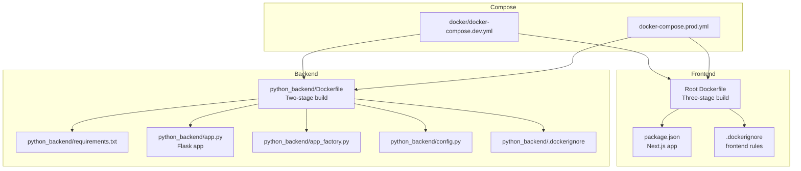
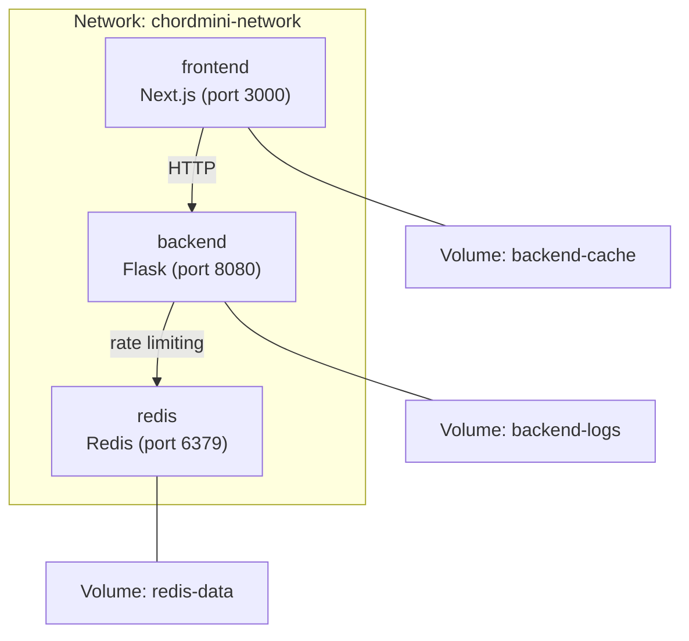
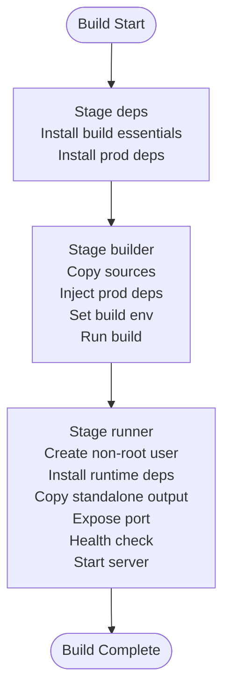
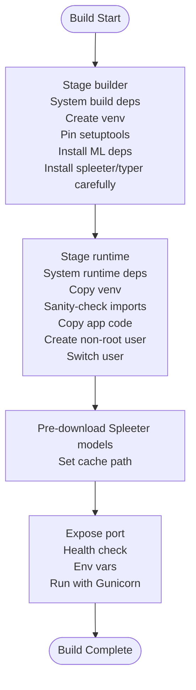
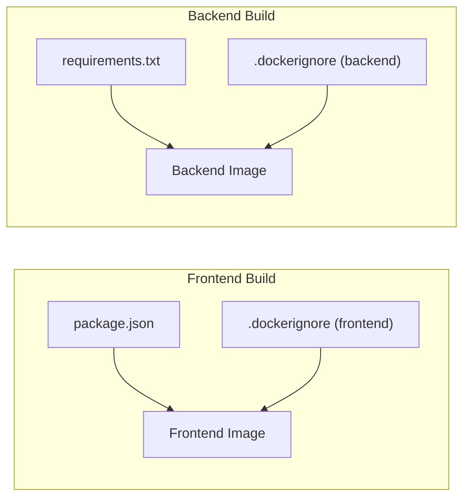

# Docker Configuration

<cite>
**Referenced Files in This Document**
- [Dockerfile](file://Dockerfile)
- [python_backend/Dockerfile](file://python_backend/Dockerfile)
- [docker/docker-compose.dev.yml](file://docker/docker-compose.dev.yml)
- [docker-compose.prod.yml](file://docker-compose.prod.yml)
- [.dockerignore](file://.dockerignore)
- [python_backend/.dockerignore](file://python_backend/.dockerignore)
- [python_backend/requirements.txt](file://python_backend/requirements.txt)
- [python_backend/app.py](file://python_backend/app.py)
- [python_backend/app_factory.py](file://python_backend/app_factory.py)
- [python_backend/config.py](file://python_backend/config.py)
- [package.json](file://package.json)
- [scripts/build-and-push.sh](file://scripts/build-and-push.sh)
- [docker/README.md](file://docker/README.md)
</cite>

## Table of Contents
1. [Introduction](#introduction)
2. [Project Structure](#project-structure)
3. [Core Components](#core-components)
4. [Architecture Overview](#architecture-overview)
5. [Detailed Component Analysis](#detailed-component-analysis)
6. [Dependency Analysis](#dependency-analysis)
7. [Performance Considerations](#performance-considerations)
8. [Troubleshooting Guide](#troubleshooting-guide)
9. [Conclusion](#conclusion)
10. [Appendices](#appendices)

## Introduction
This document explains the Docker configuration for ChordMiniApp, covering the multi-stage builds for both the frontend (Next.js) and backend (Python/Flask) services, the Docker Compose setup for development and production, security hardening, and operational best practices. It also provides practical examples for building, running, and troubleshooting the containers.

## Project Structure
The Docker configuration spans:
- A root Dockerfile for the Next.js frontend with a three-stage build (dependencies, builder, runner)
- A separate Dockerfile for the Python backend with a two-stage build (builder, runtime)
- Docker Compose files for development and production environments
- .dockerignore files to optimize image size and build performance
- Supporting scripts and configuration for building and pushing images

**Diagram sources**
- [Dockerfile:1-87](file://Dockerfile#L1-L87)
- [python_backend/Dockerfile:1-116](file://python_backend/Dockerfile#L1-L116)
- [docker/docker-compose.dev.yml:1-116](file://docker/docker-compose.dev.yml#L1-L116)
- [docker-compose.prod.yml:1-102](file://docker-compose.prod.yml#L1-L102)
- [.dockerignore:1-130](file://.dockerignore#L1-L130)
- [python_backend/.dockerignore:1-75](file://python_backend/.dockerignore#L1-L75)
- [package.json:1-135](file://package.json#L1-L135)
- [python_backend/requirements.txt:1-131](file://python_backend/requirements.txt#L1-L131)
- [python_backend/app.py:1-186](file://python_backend/app.py#L1-L186)
- [python_backend/app_factory.py:1-162](file://python_backend/app_factory.py#L1-L162)
- [python_backend/config.py:1-215](file://python_backend/config.py#L1-L215)

**Section sources**
- [Dockerfile:1-87](file://Dockerfile#L1-L87)
- [python_backend/Dockerfile:1-116](file://python_backend/Dockerfile#L1-L116)
- [docker/docker-compose.dev.yml:1-116](file://docker/docker-compose.dev.yml#L1-L116)
- [docker-compose.prod.yml:1-102](file://docker-compose.prod.yml#L1-L102)
- [.dockerignore:1-130](file://.dockerignore#L1-L130)
- [python_backend/.dockerignore:1-75](file://python_backend/.dockerignore#L1-L75)
- [package.json:1-135](file://package.json#L1-L135)
- [python_backend/requirements.txt:1-131](file://python_backend/requirements.txt#L1-L131)
- [python_backend/app.py:1-186](file://python_backend/app.py#L1-L186)
- [python_backend/app_factory.py:1-162](file://python_backend/app_factory.py#L1-L162)
- [python_backend/config.py:1-215](file://python_backend/config.py#L1-L215)

## Core Components
- Frontend Dockerfile (root): Multi-stage build with Alpine Linux base, native module compilation prerequisites, yt-dlp and ffmpeg installation, non-root user, health checks, and production runtime.
- Backend Dockerfile (python_backend): Multi-stage build with slim Python base, virtual environment creation, careful dependency installation order for ML libraries, runtime-only system dependencies, non-root user, pre-downloaded Spleeter models, health checks, and Gunicorn configuration.
- Docker Compose (development): Builds images from Dockerfiles, defines networks and volumes, sets environment variables, health checks, and inter-service dependencies.
- Docker Compose (production): Uses pre-built images from a container registry, environment variable management via .env file, health checks, and persistent volumes for caches.

**Section sources**
- [Dockerfile:1-87](file://Dockerfile#L1-L87)
- [python_backend/Dockerfile:1-116](file://python_backend/Dockerfile#L1-L116)
- [docker/docker-compose.dev.yml:1-116](file://docker/docker-compose.dev.yml#L1-L116)
- [docker-compose.prod.yml:1-102](file://docker-compose.prod.yml#L1-L102)

## Architecture Overview
The system runs as a distributed application with:
- A Next.js frontend container serving the React/Next.js app
- A Python/Flask backend container providing ML/audio processing APIs
- A Redis container for rate limiting and caching (development)
- Persistent volumes for model caches and logs

**Diagram sources**
- [docker/docker-compose.dev.yml:6-116](file://docker/docker-compose.dev.yml#L6-L116)
- [docker-compose.prod.yml:14-102](file://docker-compose.prod.yml#L14-L102)

## Detailed Component Analysis

### Frontend Dockerfile (Multi-stage Build)
Purpose and stages:
- Stage deps (Alpine): Installs node-gyp and build essentials, installs production dependencies with a clean cache.
- Stage builder (Alpine): Installs all dependencies, copies source, injects production dependencies from deps, sets build-time environment variables, and builds the Next.js app.
- Stage runner (Alpine): Creates a non-root user, installs runtime dependencies (yt-dlp via pip3 and ffmpeg), copies standalone Next.js output, sets environment variables, exposes port 3000, defines health check, and starts with node server.js.

Key optimizations:
- Alpine base reduces image size.
- Separate deps stage avoids installing dev dependencies in final image.
- Clean npm cache and removal of build artifacts minimize size.
- Native module prerequisites (python3, make, g++) enable binary compilation during builder stage.
- yt-dlp and ffmpeg included for audio extraction capabilities.

Security and runtime:
- Non-root user (nextjs) ensures least privilege.
- Health check monitors /api/health.
- Environment variables configured for production readiness.

**Section sources**
- [Dockerfile:1-87](file://Dockerfile#L1-L87)
- [.dockerignore:1-130](file://.dockerignore#L1-L130)
- [package.json:1-135](file://package.json#L1-L135)

#### Frontend Multi-stage Build Flow

**Diagram sources**
- [Dockerfile:4-87](file://Dockerfile#L4-L87)

### Backend Dockerfile (Multi-stage Build)
Purpose and stages:
- Stage builder (slim): Installs system build dependencies, creates virtual environment, pins setuptools to a compatible version, installs build dependencies for ML libraries, installs specific packages (madmom, spleeter) with careful dependency resolution, and prepares the environment.
- Stage runtime (slim): Installs only runtime system dependencies, copies virtual environment, sanity-checks madmom import, copies application code and essential directories, creates non-root user, switches to user, pre-downloads Spleeter 5-stems model to the expected cache location, exposes port 8080, defines health check, sets environment variables, and runs with Gunicorn.

Key optimizations:
- Two-stage build separates build-time and runtime dependencies.
- Virtual environment isolates Python packages.
- Careful dependency ordering prevents resolver conflicts (e.g., spleeter and typer).
- Pre-downloading models avoids cold-start latency and ensures availability.
- Runtime-only system dependencies reduce attack surface.

Security and runtime:
- Non-root user (app) ensures least privilege.
- Health check monitors root endpoint.
- Environment variables tuned for ML workloads and production.

**Section sources**
- [python_backend/Dockerfile:1-116](file://python_backend/Dockerfile#L1-L116)
- [python_backend/requirements.txt:1-131](file://python_backend/requirements.txt#L1-L131)
- [python_backend/app.py:1-186](file://python_backend/app.py#L1-L186)
- [python_backend/app_factory.py:1-162](file://python_backend/app_factory.py#L1-L162)
- [python_backend/config.py:1-215](file://python_backend/config.py#L1-L215)
- [python_backend/.dockerignore:1-75](file://python_backend/.dockerignore#L1-L75)

#### Backend Multi-stage Build Flow

**Diagram sources**
- [python_backend/Dockerfile:4-116](file://python_backend/Dockerfile#L4-L116)

### Docker Compose Configuration

#### Development Environment
- Services:
  - frontend: builds from root Dockerfile, target runner, maps port 3000, sets environment variables, depends on backend healthy, health checks via curl.
  - backend: builds from python_backend/Dockerfile, target runtime, maps port 8080, sets environment variables, depends on redis healthy, health checks via curl.
  - redis: official Redis image, binds port 6379, uses AOF with memory policy, health checks via redis-cli.
- Networks: chordmini-network (bridge) for service communication.
- Volumes: named volumes for backend cache, backend logs, and redis data.

Operational notes:
- Inter-service DNS: frontend accesses backend via http://backend:8080.
- Environment variables include API URLs, feature flags, and rate limiting configuration.

**Section sources**
- [docker/docker-compose.dev.yml:1-116](file://docker/docker-compose.dev.yml#L1-L116)

#### Production Environment
- Services:
  - frontend: uses pre-built image from registry, maps port 3000, environment variables from .env file, depends on backend, health checks via curl.
  - backend: uses pre-built image from registry, maps port 8080, environment variables for production, optional cache volume.
- Networks and volumes: same structure as development.

Environment variable management:
- Public configuration exposed to the browser via NEXT_PUBLIC_* variables.
- Server-only secrets passed via environment variables (e.g., API keys).
- Base URLs and feature flags configurable via environment variables.

**Section sources**
- [docker-compose.prod.yml:1-102](file://docker-compose.prod.yml#L1-L102)

### Security Considerations
- Non-root execution:
  - Frontend: creates system user nextjs and switches to it before running.
  - Backend: creates system user app and switches to it before model downloads and runtime.
- Health checks:
  - Frontend: curl-based health check against /api/health.
  - Backend: curl-based health check against root endpoint.
- Resource limits and stability:
  - Backend uses Gunicorn with worker tuning, max requests, and preload for predictable resource usage.
  - Development Compose sets restart policies to ensure resilience.

Additional hardening suggestions (general best practices):
- Add read-only root filesystem and drop unnecessary capabilities.
- Use container secrets for sensitive environment variables.
- Limit exposed ports and rely on internal networks for inter-service communication.

**Section sources**
- [Dockerfile:47-87](file://Dockerfile#L47-L87)
- [python_backend/Dockerfile:78-116](file://python_backend/Dockerfile#L78-L116)
- [docker/docker-compose.dev.yml:29-81](file://docker/docker-compose.dev.yml#L29-L81)
- [docker-compose.prod.yml:58-92](file://docker-compose.prod.yml#L58-L92)

### Practical Examples

#### Building Images
- Development images:
  - Frontend: docker build -f Dockerfile -t chordmini-frontend .
  - Backend: docker build -f python_backend/Dockerfile -t chordmini-backend ./python_backend
- Production images:
  - Use pre-built images referenced in docker-compose.prod.yml.

#### Running Locally (Development)
- Start all services: docker compose -f docker/docker-compose.dev.yml up
- Access:
  - Frontend: http://localhost:3000
  - Backend: http://localhost:8080
  - Redis: http://localhost:6379

#### Running in Production
- Start with environment file: docker compose -f docker-compose.prod.yml --env-file .env.docker up -d
- Stop: docker compose -f docker-compose.prod.yml down

#### Manual Build and Push Script
- The script supports Docker Hub, GHCR, GCR, and local builds.
- It performs:
  - Docker availability check
  - Frontend and backend builds
  - Optional registry login and push
  - Basic container startup tests

**Section sources**
- [docker/README.md:1-25](file://docker/README.md#L1-L25)
- [scripts/build-and-push.sh:1-321](file://scripts/build-and-push.sh#L1-L321)

## Dependency Analysis
- Frontend:
  - Node.js 20 Alpine base, native module prerequisites (python3, make, g++), yt-dlp via pip3, ffmpeg for audio extraction.
  - .dockerignore excludes development files, logs, and large media assets while preserving essential public assets.
- Backend:
  - Python 3.10 slim base, build dependencies for ML libraries, virtual environment, setuptools pin for compatibility, careful dependency installation order, runtime-only system dependencies.
  - .dockerignore excludes unnecessary files and large model directories, keeping only essential checkpoints.

**Diagram sources**
- [package.json:1-135](file://package.json#L1-L135)
- [.dockerignore:1-130](file://.dockerignore#L1-L130)
- [python_backend/requirements.txt:1-131](file://python_backend/requirements.txt#L1-L131)
- [python_backend/.dockerignore:1-75](file://python_backend/.dockerignore#L1-L75)

**Section sources**
- [package.json:1-135](file://package.json#L1-L135)
- [.dockerignore:1-130](file://.dockerignore#L1-L130)
- [python_backend/requirements.txt:1-131](file://python_backend/requirements.txt#L1-L131)
- [python_backend/.dockerignore:1-75](file://python_backend/.dockerignore#L1-L75)

## Performance Considerations
- Multi-stage builds:
  - Frontend: deps stage installs only production dependencies; builder stage compiles assets; runner stage minimizes final image size.
  - Backend: builder stage handles complex ML library compilation; runtime stage strips build-time dependencies.
- Base images:
  - Alpine Linux for frontend keeps image small; slim Python for backend reduces footprint.
- Caching:
  - Clean npm cache and removal of build artifacts in frontend.
  - Virtual environment isolation in backend improves reproducibility.
- Pre-downloaded models:
  - Backend pre-downloads Spleeter models to avoid cold-start delays.
- Gunicorn tuning:
  - Backend uses sync workers, max requests, and preload for predictable throughput and memory usage.

[No sources needed since this section provides general guidance]

## Troubleshooting Guide
Common issues and resolutions:
- Frontend fails to start with native module errors:
  - Ensure build prerequisites are present in builder stage (python3, make, g++).
  - Verify yt-dlp installation in runner stage.
- Backend import failures (madmom, librosa):
  - Confirm setuptools pin and virtual environment copy in runtime stage.
  - Validate sanity-check import of madmom in runtime stage.
- Spleeter model not found:
  - Check cache path and pre-download steps in backend runtime stage.
- Health checks failing:
  - Review compose health check commands and service readiness.
  - For development, ensure backend is healthy before frontend starts.

Operational tips:
- Use docker compose logs <service> to inspect logs.
- Temporarily disable health checks in compose for debugging if needed.
- Validate environment variables passed via compose files or .env file.

**Section sources**
- [Dockerfile:17-41](file://Dockerfile#L17-L41)
- [python_backend/Dockerfile:39-116](file://python_backend/Dockerfile#L39-L116)
- [docker/docker-compose.dev.yml:23-81](file://docker/docker-compose.dev.yml#L23-L81)
- [docker-compose.prod.yml:58-92](file://docker-compose.prod.yml#L58-L92)

## Conclusion
The Docker configuration for ChordMiniApp employs robust multi-stage builds for both frontend and backend, optimized base images, and secure defaults with non-root users and health checks. The development and production Compose setups provide clear separation of concerns, environment variable management, and persistence for caches and logs. Following the best practices outlined here ensures reliable, efficient, and secure deployments.

[No sources needed since this section summarizes without analyzing specific files]

## Appendices

### Best Practices for Multi-stage Builds and Image Optimization
- Keep build-time dependencies isolated in builder stages.
- Use .dockerignore to exclude unnecessary files and logs.
- Prefer Alpine or slim base images for smaller footprints.
- Pin versions of critical packages (e.g., setuptools) for reproducibility.
- Pre-install large assets (e.g., models) in runtime stages to reduce cold starts.
- Use non-root users and minimal privileges for security.

[No sources needed since this section provides general guidance]