# Operational Procedures

<cite>
**Referenced Files in This Document**
- [deploy.yml](file://.github/workflows/deploy.yml)
- [security-audit.yml](file://.github/workflows/security-audit.yml)
- [docker-publish.yml](file://.github/workflows/docker-publish.yml)
- [post-deployment-verification.sh](file://scripts/post-deployment-verification.sh)
- [pre-deployment-checklist.sh](file://scripts/pre-deployment-checklist.sh)
- [security-check.sh](file://scripts/security-check.sh)
- [logging.py](file://python_backend/utils/logging.py)
- [config.py](file://python_backend/config.py)
- [extensions.py](file://python_backend/extensions.py)
- [error_handlers.py](file://python_backend/error_handlers.py)
- [app_factory.py](file://python_backend/app_factory.py)
- [docker-compose.prod.yml](file://docker-compose.prod.yml)
- [requirements.txt](file://python_backend/requirements.txt)
- [package.json](file://package.json)
- [vercel.json](file://vercel.json)
- [next.config.js](file://next.config.js)
</cite>

## Table of Contents
1. [Introduction](#introduction)
2. [Project Structure](#project-structure)
3. [Core Components](#core-components)
4. [Architecture Overview](#architecture-overview)
5. [Detailed Component Analysis](#detailed-component-analysis)
6. [Dependency Analysis](#dependency-analysis)
7. [Performance Considerations](#performance-considerations)
8. [Troubleshooting Guide](#troubleshooting-guide)
9. [Conclusion](#conclusion)
10. [Appendices](#appendices)

## Introduction
This document defines the operational procedures for ChordMiniApp, covering day-to-day monitoring, performance tracking, maintenance, logging, backup and disaster recovery, security operations, incident response, configuration management, and performance optimization. It synthesizes automation and operational patterns already present in the repository’s CI/CD workflows, scripts, and backend configuration to provide practical, repeatable procedures for system administration.

## Project Structure
ChordMiniApp comprises:
- Frontend (Next.js) with Vercel deployment and Docker Compose orchestration
- Python backend (Flask) with model services and rate-limiting
- CI/CD workflows for validation, security audits, and publishing
- Operational scripts for pre/post deployment checks and security verification
- Configuration for environment variables, CORS, rate limits, and CSP headers

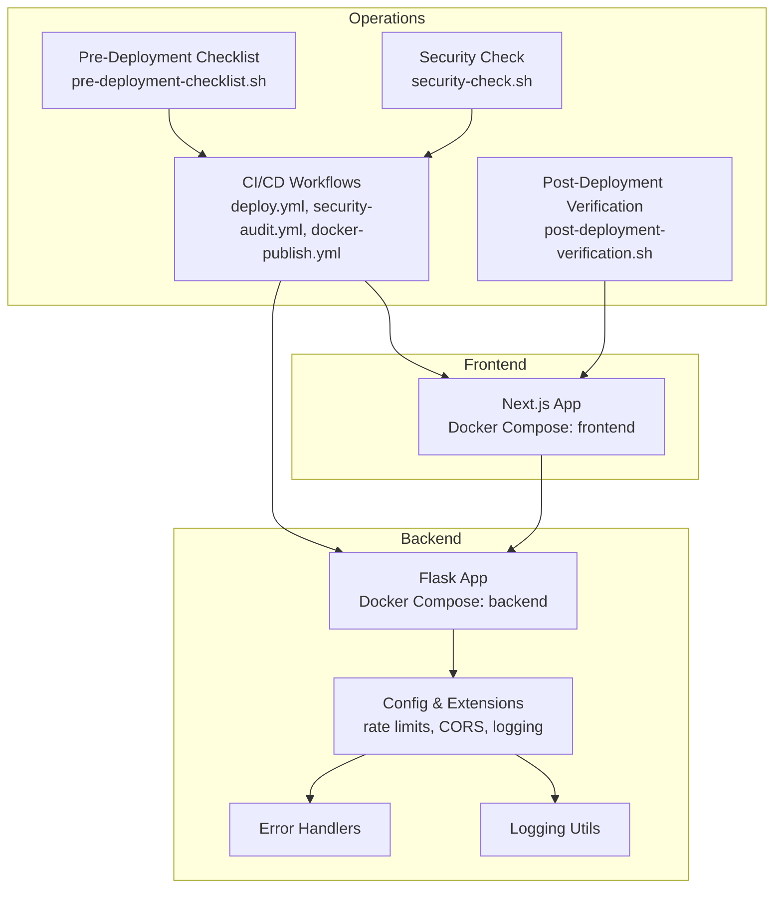

**Diagram sources**
- [docker-compose.prod.yml:14-101](file://docker-compose.prod.yml#L14-L101)
- [deploy.yml:27-287](file://.github/workflows/deploy.yml#L27-L287)
- [security-audit.yml:22-285](file://.github/workflows/security-audit.yml#L22-L285)
- [docker-publish.yml:19-426](file://.github/workflows/docker-publish.yml#L19-L426)
- [pre-deployment-checklist.sh:1-353](file://scripts/pre-deployment-checklist.sh#L1-L353)
- [post-deployment-verification.sh:1-319](file://scripts/post-deployment-verification.sh#L1-L319)
- [security-check.sh:1-169](file://scripts/security-check.sh#L1-L169)

**Section sources**
- [docker-compose.prod.yml:1-102](file://docker-compose.prod.yml#L1-L102)
- [.github/workflows/deploy.yml:1-287](file://.github/workflows/deploy.yml#L1-L287)
- [.github/workflows/security-audit.yml:1-285](file://.github/workflows/security-audit.yml#L1-L285)
- [.github/workflows/docker-publish.yml:1-426](file://.github/workflows/docker-publish.yml#L1-L426)
- [scripts/pre-deployment-checklist.sh:1-353](file://scripts/pre-deployment-checklist.sh#L1-L353)
- [scripts/post-deployment-verification.sh:1-319](file://scripts/post-deployment-verification.sh#L1-L319)
- [scripts/security-check.sh:1-169](file://scripts/security-check.sh#L1-L169)

## Core Components
- CI/CD validation and security scanning pipelines
- Pre-deployment and post-deployment verification scripts
- Backend configuration, logging, and error handling
- Docker Compose for production deployment
- Frontend CSP and CORS configuration

**Section sources**
- [.github/workflows/deploy.yml:27-287](file://.github/workflows/deploy.yml#L27-L287)
- [.github/workflows/security-audit.yml:22-285](file://.github/workflows/security-audit.yml#L22-L285)
- [docker-compose.prod.yml:14-101](file://docker-compose.prod.yml#L14-L101)
- [python_backend/config.py:16-215](file://python_backend/config.py#L16-L215)
- [python_backend/utils/logging.py:1-91](file://python_backend/utils/logging.py#L1-L91)
- [python_backend/error_handlers.py:1-161](file://python_backend/error_handlers.py#L1-L161)
- [python_backend/extensions.py:1-93](file://python_backend/extensions.py#L1-L93)
- [python_backend/app_factory.py:1-162](file://python_backend/app_factory.py#L1-L162)
- [next.config.js:129-184](file://next.config.js#L129-L184)

## Architecture Overview
The operational architecture integrates frontend and backend services with CI/CD, security, and verification automation.

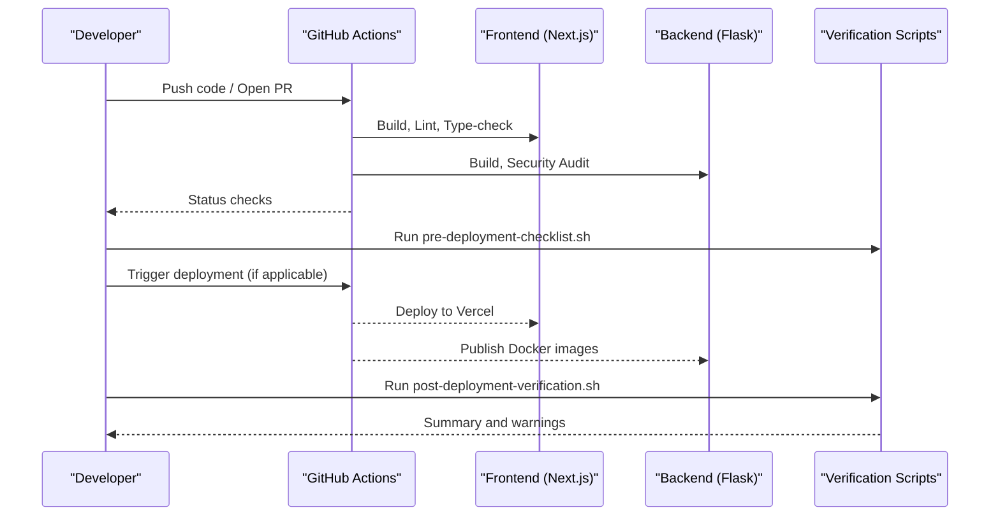

**Diagram sources**
- [deploy.yml:27-287](file://.github/workflows/deploy.yml#L27-L287)
- [security-audit.yml:22-285](file://.github/workflows/security-audit.yml#L22-L285)
- [docker-publish.yml:19-426](file://.github/workflows/docker-publish.yml#L19-L426)
- [pre-deployment-checklist.sh:1-353](file://scripts/pre-deployment-checklist.sh#L1-L353)
- [post-deployment-verification.sh:1-319](file://scripts/post-deployment-verification.sh#L1-L319)

## Detailed Component Analysis

### CI/CD Pipelines and Automation
- Pre-deployment validation validates build, linting, TypeScript, and environment readiness.
- Security audit performs production dependency auditing, moderate/high vulnerability gating, and sensitive file checks.
- Docker publishing builds and pushes frontend/backend images, verifies images, and creates releases with quick-start instructions.

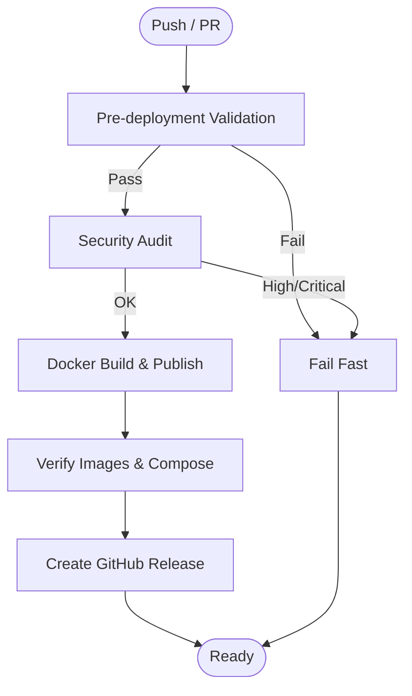

**Diagram sources**
- [deploy.yml:27-287](file://.github/workflows/deploy.yml#L27-L287)
- [security-audit.yml:22-285](file://.github/workflows/security-audit.yml#L22-L285)
- [docker-publish.yml:19-426](file://.github/workflows/docker-publish.yml#L19-L426)

**Section sources**
- [.github/workflows/deploy.yml:27-287](file://.github/workflows/deploy.yml#L27-L287)
- [.github/workflows/security-audit.yml:22-285](file://.github/workflows/security-audit.yml#L22-L285)
- [.github/workflows/docker-publish.yml:19-426](file://.github/workflows/docker-publish.yml#L19-L426)

### Pre-Deployment Checklist
- Ensures build, lint, TypeScript, environment variables (.env.example in CI), Firebase configuration, backend health, and dependency security.
- Includes retry logic for backend cold starts and lenient checks for non-critical warnings.

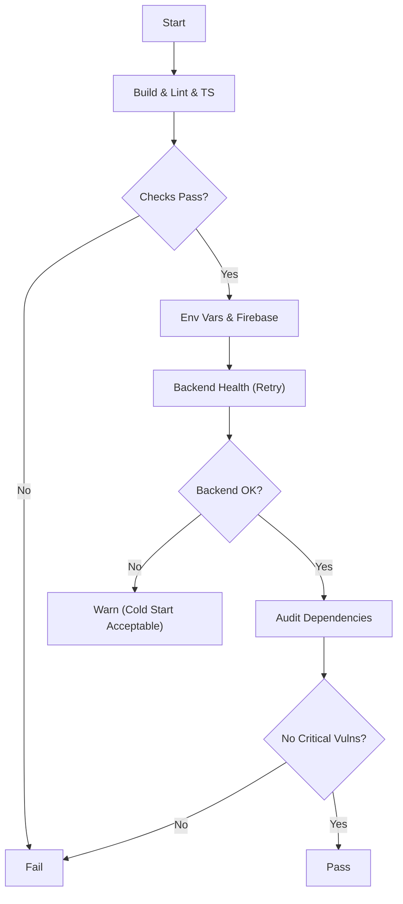

**Diagram sources**
- [pre-deployment-checklist.sh:1-353](file://scripts/pre-deployment-checklist.sh#L1-L353)

**Section sources**
- [scripts/pre-deployment-checklist.sh:1-353](file://scripts/pre-deployment-checklist.sh#L1-L353)

### Post-Deployment Verification
- Tests frontend pages, API endpoints, Firebase integration, backend health, and performance.
- Accepts backend cold start warnings and focuses on critical frontend failures.

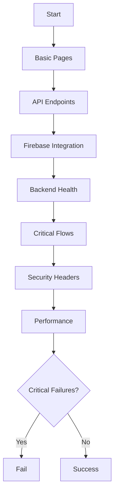

**Diagram sources**
- [post-deployment-verification.sh:1-319](file://scripts/post-deployment-verification.sh#L1-L319)

**Section sources**
- [scripts/post-deployment-verification.sh:1-319](file://scripts/post-deployment-verification.sh#L1-L319)

### Security Operations
- Weekly and scheduled security audits with high/critical gating.
- Sensitive file and hardcoded secret scanning.
- Commit status reporting and automated issues for vulnerabilities.

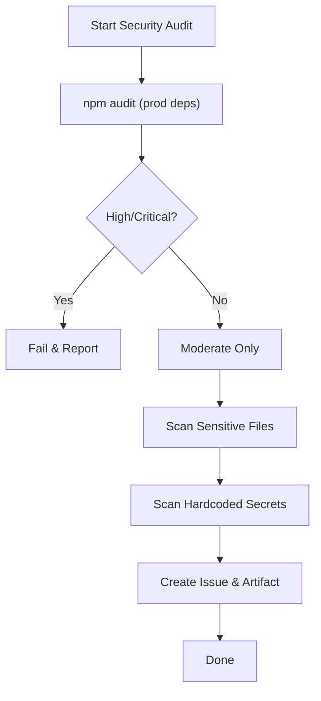

**Diagram sources**
- [security-audit.yml:22-285](file://.github/workflows/security-audit.yml#L22-L285)

**Section sources**
- [.github/workflows/security-audit.yml:22-285](file://.github/workflows/security-audit.yml#L22-L285)
- [scripts/security-check.sh:1-169](file://scripts/security-check.sh#L1-L169)

### Configuration Management
- Environment variables are handled via .env files and CI/CD secrets.
- Frontend exposes public keys via NEXT_PUBLIC_*; server-only secrets are not exposed.
- Backend configuration supports production/development/testing modes with rate limits and CORS.

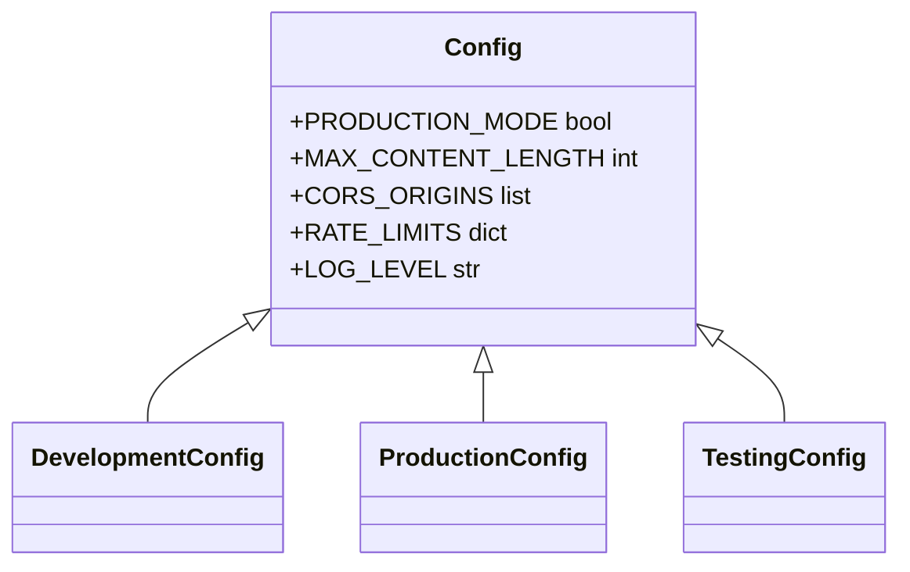

**Diagram sources**
- [config.py:16-215](file://python_backend/config.py#L16-L215)

**Section sources**
- [python_backend/config.py:16-215](file://python_backend/config.py#L16-L215)
- [docker-compose.prod.yml:21-84](file://docker-compose.prod.yml#L21-L84)
- [next.config.js:54-56](file://next.config.js#L54-L56)

### Logging Strategy
- Centralized logging utilities adapt to production vs development.
- Production uses structured logging; development prints to stdout.
- Error handlers provide consistent JSON responses and stack traces.

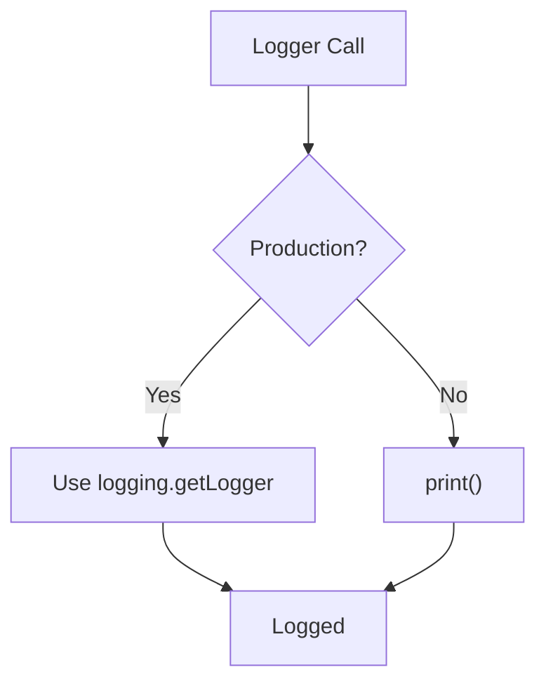

**Diagram sources**
- [logging.py:12-91](file://python_backend/utils/logging.py#L12-L91)

**Section sources**
- [python_backend/utils/logging.py:1-91](file://python_backend/utils/logging.py#L1-L91)
- [python_backend/error_handlers.py:1-161](file://python_backend/error_handlers.py#L1-L161)

### Backup and Disaster Recovery
- The repository does not define explicit backup or snapshot procedures for application data.
- Recommended practices:
  - Export and version control non-sensitive configuration files.
  - Back up model caches and persistent volumes (if used) via Docker volume snapshots.
  - Maintain a documented restore playbook for containers, environment variables, and external service credentials.
  - Validate restoration from images and compose files regularly.

[No sources needed since this section provides general guidance]

### Incident Response Procedures
- Use post-deployment verification to detect critical frontend failures.
- Leverage error handlers for consistent HTTP error responses and stack traces.
- For backend cold starts, interpret warnings as expected behavior and monitor service readiness.
- Create GitHub issues for deployment failures and security audit findings.

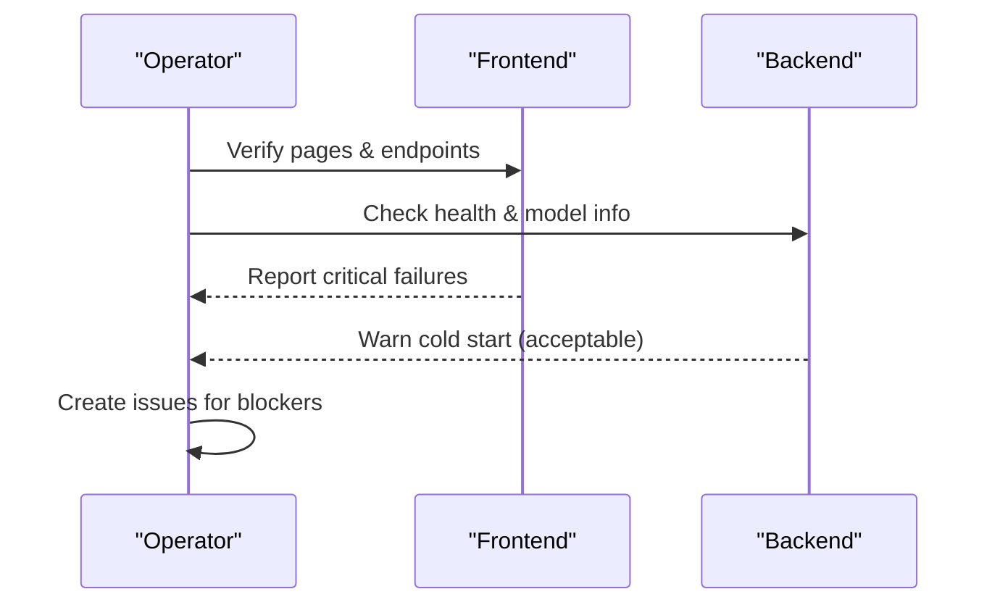

**Diagram sources**
- [post-deployment-verification.sh:1-319](file://scripts/post-deployment-verification.sh#L1-L319)
- [error_handlers.py:1-161](file://python_backend/error_handlers.py#L1-L161)

**Section sources**
- [scripts/post-deployment-verification.sh:1-319](file://scripts/post-deployment-verification.sh#L1-L319)
- [python_backend/error_handlers.py:1-161](file://python_backend/error_handlers.py#L1-L161)

### Performance Optimization
- Frontend:
  - Bundle analyzer and optimized splitChunks in Webpack.
  - CSP and COOP/COEP headers for performance and compatibility.
- Backend:
  - Rate limiting per endpoint category to prevent overload.
  - Model availability checks deferred to runtime for faster startup.

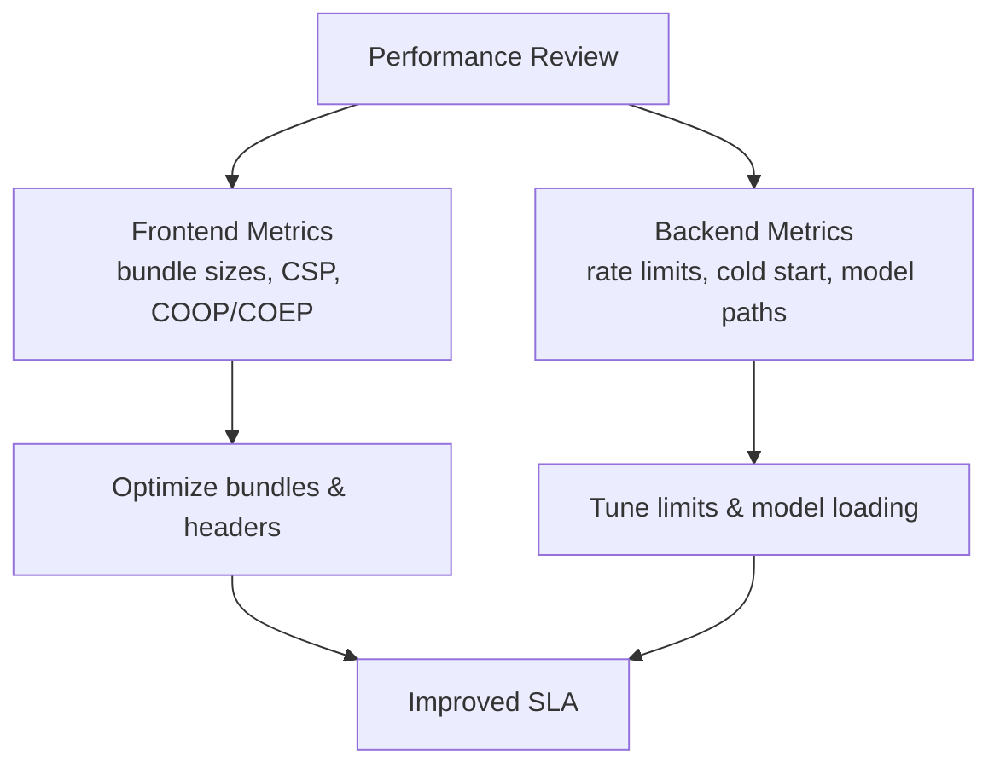

**Diagram sources**
- [next.config.js:129-184](file://next.config.js#L129-L184)
- [config.py:47-103](file://python_backend/config.py#L47-L103)

**Section sources**
- [next.config.js:197-344](file://next.config.js#L197-L344)
- [python_backend/config.py:47-103](file://python_backend/config.py#L47-L103)

## Dependency Analysis
- Frontend dependencies are managed in package.json with pinned engines and overrides.
- Backend dependencies are managed in requirements.txt with pinned versions for reproducibility.
- CI/CD relies on environment variables and secrets for deployment and security checks.

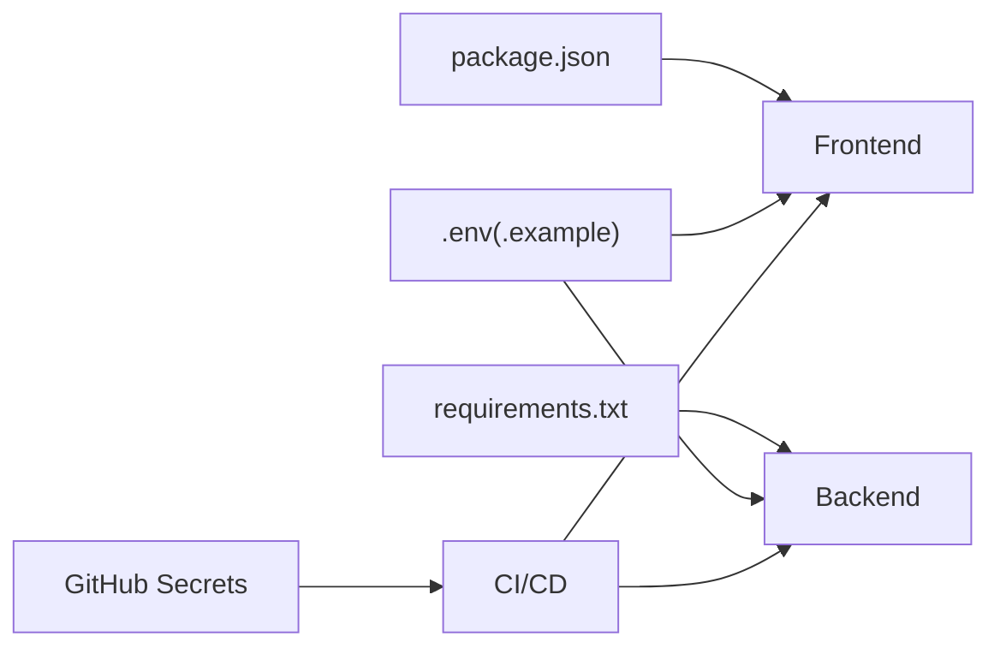

**Diagram sources**
- [package.json:1-135](file://package.json#L1-L135)
- [requirements.txt:1-131](file://python_backend/requirements.txt#L1-L131)
- [docker-publish.yml:12-17](file://.github/workflows/docker-publish.yml#L12-L17)

**Section sources**
- [package.json:1-135](file://package.json#L1-L135)
- [python_backend/requirements.txt:1-131](file://python_backend/requirements.txt#L1-L131)
- [.github/workflows/docker-publish.yml:12-17](file://.github/workflows/docker-publish.yml#L12-L17)

## Performance Considerations
- Monitor frontend bundle sizes and CSP impacts using Next.js analyzer and runtime metrics.
- Tune backend rate limits per endpoint category and ensure Redis-backed rate limiting in production.
- Validate model availability and warm-up strategies to minimize cold start impact.

[No sources needed since this section provides general guidance]

## Troubleshooting Guide
- Pre-deployment checklist failures:
  - Resolve build/lint/TS errors.
  - Ensure .env.example exists and environment variables are configured.
  - Confirm backend health with retry logic.
- Post-deployment verification warnings:
  - Backend cold start is acceptable; confirm service responds after initial requests.
  - Investigate critical frontend failures only.
- Security audit findings:
  - Address high/critical vulnerabilities immediately.
  - Remove sensitive files from repository and fix hardcoded secrets.

**Section sources**
- [scripts/pre-deployment-checklist.sh:1-353](file://scripts/pre-deployment-checklist.sh#L1-L353)
- [scripts/post-deployment-verification.sh:1-319](file://scripts/post-deployment-verification.sh#L1-L319)
- [.github/workflows/security-audit.yml:22-285](file://.github/workflows/security-audit.yml#L22-L285)

## Conclusion
ChordMiniApp’s operational model leverages robust CI/CD, security automation, and verification scripts to maintain reliability. By following the procedures outlined here—monitoring, performance tuning, configuration hygiene, security patching, and incident response—you can sustain a resilient deployment across environments.

[No sources needed since this section summarizes without analyzing specific files]

## Appendices

### Practical Operational Tasks
- Daily:
  - Review CI/CD status checks and security audit results.
  - Validate environment variables and secrets rotation.
- Weekly:
  - Run security audit workflow and triage issues.
  - Review post-deployment verification logs for warnings.
- Monthly:
  - Rebuild and republish Docker images.
  - Rotate API keys and update dependencies.

[No sources needed since this section provides general guidance]