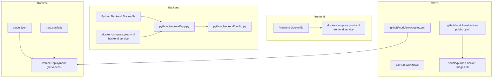
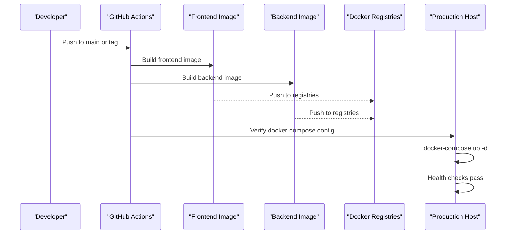
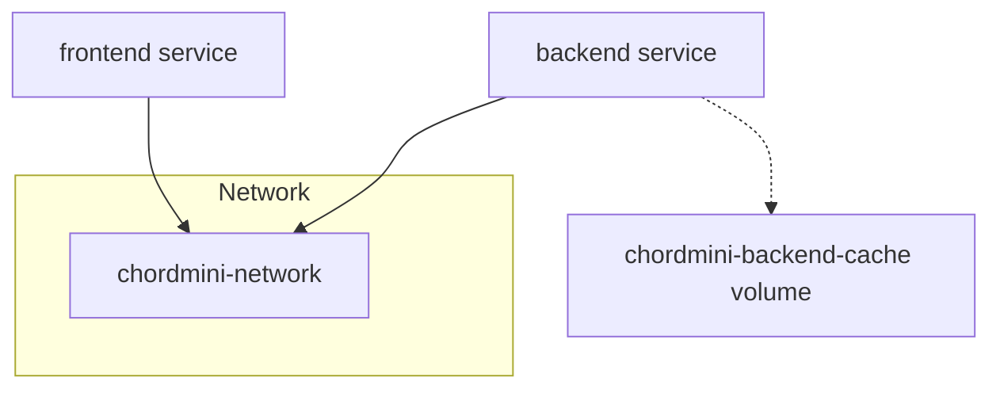
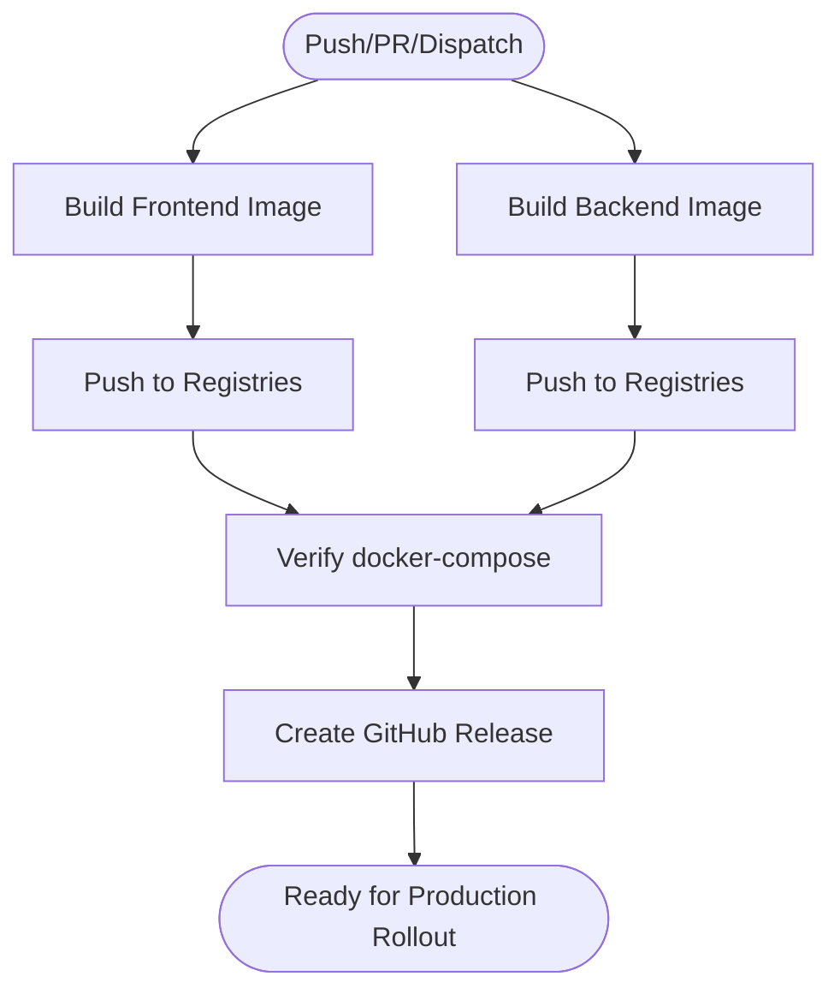
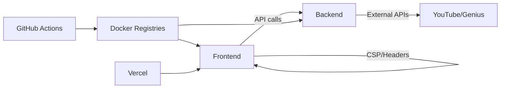

# Production Deployment

<cite>
**Referenced Files in This Document**
- [docker-compose.prod.yml](file://docker-compose.prod.yml)
- [docker/docker-compose.yml](file://docker/docker-compose.yml)
- [docker/docker-compose.dev.yml](file://docker/docker-compose.dev.yml)
- [.github/workflows/docker-publish.yml](file://.github/workflows/docker-publish.yml)
- [.github/workflows/deploy.yml](file://.github/workflows/deploy.yml)
- [scripts/pre-deployment-checklist.sh](file://scripts/pre-deployment-checklist.sh)
- [scripts/post-deployment-verification.sh](file://scripts/post-deployment-verification.sh)
- [scripts/publish-docker-images.sh](file://scripts/publish-docker-images.sh)
- [Dockerfile](file://Dockerfile)
- [python_backend/Dockerfile](file://python_backend/Dockerfile)
- [python_backend/app.py](file://python_backend/app.py)
- [python_backend/config.py](file://python_backend/config.py)
- [vercel.json](file://vercel.json)
- [next.config.js](file://next.config.js)
- [package.json](file://package.json)
</cite>

## Table of Contents
1. [Introduction](#introduction)
2. [Project Structure](#project-structure)
3. [Core Components](#core-components)
4. [Architecture Overview](#architecture-overview)
5. [Detailed Component Analysis](#detailed-component-analysis)
6. [Dependency Analysis](#dependency-analysis)
7. [Performance Considerations](#performance-considerations)
8. [Troubleshooting Guide](#troubleshooting-guide)
9. [Conclusion](#conclusion)
10. [Appendices](#appendices)

## Introduction
This document provides a comprehensive guide to deploying ChordMiniApp in production. It covers the production Docker Compose configuration, CI/CD pipeline for automated builds and publishing, infrastructure requirements, deployment workflow, monitoring, and security considerations. It also includes practical commands, configuration management tips, and troubleshooting guidance.

## Project Structure
ChordMiniApp consists of:
- A Next.js frontend packaged in a multi-stage Dockerfile for production
- A Python Flask backend with ML services, packaged in a separate multi-stage Dockerfile
- CI/CD workflows for Docker image builds and publishing
- Scripts for pre-deployment validation and post-deployment verification
- Vercel configuration for cron jobs and serverless deployment

**Diagram sources**
- [docker-compose.prod.yml:14-102](file://docker-compose.prod.yml#L14-L102)
- [Dockerfile:1-87](file://Dockerfile#L1-L87)
- [python_backend/Dockerfile:1-116](file://python_backend/Dockerfile#L1-L116)
- [python_backend/app.py:1-186](file://python_backend/app.py#L1-L186)
- [python_backend/config.py:16-215](file://python_backend/config.py#L16-L215)
- [.github/workflows/docker-publish.yml:19-426](file://.github/workflows/docker-publish.yml#L19-L426)
- [.github/workflows/deploy.yml:27-287](file://.github/workflows/deploy.yml#L27-L287)
- [scripts/publish-docker-images.sh:1-164](file://scripts/publish-docker-images.sh#L1-L164)
- [vercel.json:1-9](file://vercel.json#L1-L9)
- [next.config.js:42-384](file://next.config.js#L42-L384)

**Section sources**
- [docker-compose.prod.yml:1-102](file://docker-compose.prod.yml#L1-L102)
- [Dockerfile:1-87](file://Dockerfile#L1-L87)
- [python_backend/Dockerfile:1-116](file://python_backend/Dockerfile#L1-L116)
- [.github/workflows/docker-publish.yml:19-426](file://.github/workflows/docker-publish.yml#L19-L426)
- [.github/workflows/deploy.yml:27-287](file://.github/workflows/deploy.yml#L27-L287)
- [scripts/pre-deployment-checklist.sh:1-353](file://scripts/pre-deployment-checklist.sh#L1-L353)
- [scripts/post-deployment-verification.sh:1-319](file://scripts/post-deployment-verification.sh#L1-L319)
- [scripts/publish-docker-images.sh:1-164](file://scripts/publish-docker-images.sh#L1-L164)
- [vercel.json:1-9](file://vercel.json#L1-L9)
- [next.config.js:42-384](file://next.config.js#L42-L384)

## Core Components
- Production Docker Compose
  - Frontend service: Next.js application with health checks, environment variables, and port exposure
  - Backend service: Python Flask ML service with health checks, environment variables, and persistent cache volume
- CI/CD
  - Docker image build and publish workflows for frontend and backend
  - Pre-deployment and post-deployment verification scripts
- Vercel
  - Serverless deployment with cron scheduling and security headers

**Section sources**
- [docker-compose.prod.yml:14-102](file://docker-compose.prod.yml#L14-L102)
- [.github/workflows/docker-publish.yml:19-426](file://.github/workflows/docker-publish.yml#L19-L426)
- [scripts/pre-deployment-checklist.sh:1-353](file://scripts/pre-deployment-checklist.sh#L1-L353)
- [scripts/post-deployment-verification.sh:1-319](file://scripts/post-deployment-verification.sh#L1-L319)
- [vercel.json:1-9](file://vercel.json#L1-L9)

## Architecture Overview
The production deployment uses Docker Compose to orchestrate two primary services: the Next.js frontend and the Python Flask backend. The CI/CD pipeline automates building and publishing Docker images, followed by verification steps. Vercel handles serverless hosting for the frontend with scheduled cron jobs.

**Diagram sources**
- [.github/workflows/docker-publish.yml:19-426](file://.github/workflows/docker-publish.yml#L19-L426)
- [docker-compose.prod.yml:14-102](file://docker-compose.prod.yml#L14-L102)

## Detailed Component Analysis

### Production Docker Compose
- Services
  - frontend: Runs the Next.js app, exposes port 3000, sets environment variables for Firebase, YouTube, and API base URL, and defines health checks against the frontend health endpoint
  - backend: Runs the Flask app, exposes port 8080, sets production environment variables, mounts a persistent cache volume for model caching, and defines health checks against the backend root
- Networks and volumes
  - A bridge network named chordmini-network connects frontend and backend
  - A named volume chordmini-backend-cache persists model cache across restarts
- Scaling
  - The current configuration runs single replicas for both services. To scale horizontally, increase replica counts and ensure shared state is externalized (e.g., Redis for rate limiting, persistent storage for models)

**Diagram sources**
- [docker-compose.prod.yml:93-102](file://docker-compose.prod.yml#L93-L102)

**Section sources**
- [docker-compose.prod.yml:14-102](file://docker-compose.prod.yml#L14-L102)

### CI/CD Pipeline
- Docker Build and Publish
  - Builds frontend and backend images using Docker Buildx
  - Tags images with semantic versions and latest
  - Pushes to Docker Hub and GitHub Container Registry
  - Verifies images and docker-compose configuration
  - Creates GitHub Releases with quick-start instructions
- Pre-deployment and Post-deployment Checks
  - Pre-deployment checklist validates build, TypeScript, linting, environment variables, Firebase configuration, backend connectivity, and dependencies
  - Post-deployment verification tests main pages, API endpoints, backend health, Firebase integration, and performance

**Diagram sources**
- [.github/workflows/docker-publish.yml:19-426](file://.github/workflows/docker-publish.yml#L19-L426)

**Section sources**
- [.github/workflows/docker-publish.yml:19-426](file://.github/workflows/docker-publish.yml#L19-L426)
- [scripts/pre-deployment-checklist.sh:1-353](file://scripts/pre-deployment-checklist.sh#L1-L353)
- [scripts/post-deployment-verification.sh:1-319](file://scripts/post-deployment-verification.sh#L1-L319)

### Frontend Dockerfile
- Multi-stage build
  - Dependencies stage installs production dependencies
  - Builder stage compiles the Next.js app with increased Node.js heap size
  - Runner stage prepares a secure runtime with yt-dlp and ffmpeg, exposes port 3000, and defines health checks
- Security
  - Non-root user and minimal runtime dependencies

**Section sources**
- [Dockerfile:1-87](file://Dockerfile#L1-L87)

### Backend Dockerfile
- Multi-stage build
  - Builder stage installs system dependencies and Python packages, including specialized ML libraries and Spleeter model downloads
  - Runtime stage copies the virtual environment, exposes port 8080, and runs with Gunicorn
- Production runtime
  - Optimized worker settings for ML processing

**Section sources**
- [python_backend/Dockerfile:1-116](file://python_backend/Dockerfile#L1-L116)

### Backend Application and Configuration
- Application factory pattern initializes the Flask app and registers blueprints for health, beats, chords, lyrics, docs, and debug endpoints
- Configuration classes define production vs development settings, CORS origins, rate limits, timeouts, and model availability toggles
- Environment-driven production mode detection and logging configuration

**Section sources**
- [python_backend/app.py:1-186](file://python_backend/app.py#L1-L186)
- [python_backend/config.py:16-215](file://python_backend/config.py#L16-L215)

### Vercel Configuration
- Cron scheduling for cleanup tasks
- Security headers and CSP policies for API and general routes
- Standalone output for Docker deployments and server external packages configuration

**Section sources**
- [vercel.json:1-9](file://vercel.json#L1-L9)
- [next.config.js:42-384](file://next.config.js#L42-L384)

## Dependency Analysis
- Internal dependencies
  - Frontend depends on backend services via environment variables for API URLs
  - Backend depends on ML models and external services (YouTube, Genius)
- External dependencies
  - Docker registries for image distribution
  - Vercel for serverless hosting and cron jobs
- CI/CD dependencies
  - GitHub Actions workflows depend on Docker metadata and buildx actions

**Diagram sources**
- [docker-compose.prod.yml:48-54](file://docker-compose.prod.yml#L48-L54)
- [python_backend/config.py:32-46](file://python_backend/config.py#L32-L46)
- [.github/workflows/docker-publish.yml:68-94](file://.github/workflows/docker-publish.yml#L68-L94)
- [vercel.json:1-9](file://vercel.json#L1-L9)

**Section sources**
- [docker-compose.prod.yml:48-54](file://docker-compose.prod.yml#L48-L54)
- [python_backend/config.py:32-46](file://python_backend/config.py#L32-L46)
- [.github/workflows/docker-publish.yml:68-94](file://.github/workflows/docker-publish.yml#L68-L94)
- [vercel.json:1-9](file://vercel.json#L1-L9)

## Performance Considerations
- Frontend
  - Standalone output and optimized bundle splitting reduce initial load times
  - Hidden source maps in production improve performance without exposing source maps
- Backend
  - Gunicorn worker configuration tuned for ML workloads
  - Persistent cache volume reduces model loading overhead
- CI/CD
  - Buildx caching minimizes build times
  - Separate frontend and backend builds enable independent releases

**Section sources**
- [next.config.js:198-344](file://next.config.js#L198-L344)
- [python_backend/Dockerfile:102-116](file://python_backend/Dockerfile#L102-L116)
- [.github/workflows/docker-publish.yml:91-93](file://.github/workflows/docker-publish.yml#L91-L93)

## Troubleshooting Guide
- Pre-deployment checklist
  - Validates build, TypeScript, linting, environment variables, Firebase configuration, backend connectivity, and dependencies
- Post-deployment verification
  - Tests main pages, API endpoints, backend health, Firebase integration, and performance
- Common issues
  - Backend cold start: Expected for serverless deployments; verification accounts for this behavior
  - CORS and CSP: Ensure domains are included in CORS origins and CSP directives
  - Docker health checks: Confirm curl-based health checks are reachable inside containers

**Section sources**
- [scripts/pre-deployment-checklist.sh:1-353](file://scripts/pre-deployment-checklist.sh#L1-L353)
- [scripts/post-deployment-verification.sh:1-319](file://scripts/post-deployment-verification.sh#L1-L319)
- [python_backend/config.py:32-46](file://python_backend/config.py#L32-L46)
- [next.config.js:130-184](file://next.config.js#L130-L184)

## Conclusion
ChordMiniApp’s production deployment leverages Docker Compose for service orchestration, GitHub Actions for CI/CD automation, and Vercel for serverless hosting. The provided scripts and configurations ensure robust pre-deployment validation, reliable post-deployment verification, and secure runtime practices. By following the documented workflow and addressing the troubleshooting guidance, teams can achieve dependable and scalable deployments.

## Appendices

### Infrastructure Requirements
- Servers
  - Docker host capable of running two services with sufficient CPU and memory for audio processing and ML inference
- Networking
  - Bridge network for service communication
  - Public ports 3000 (frontend) and 8080 (backend) exposed as needed
- Storage
  - Persistent volume for backend model cache
- Load Balancer
  - Optional reverse proxy or platform load balancing for scaling beyond single instances
- SSL/TLS
  - HTTPS termination at the ingress (e.g., Nginx or platform-managed TLS)

[No sources needed since this section provides general guidance]

### Deployment Workflow
- Prerequisites
  - Configure environment variables for API keys and service endpoints
- Steps
  - Build and publish Docker images via CI/CD
  - Verify docker-compose configuration locally
  - Deploy to production host using docker-compose
  - Run post-deployment verification
- Rollback
  - Re-deploy previous image tags if verification fails
- Monitoring
  - Monitor health checks and logs for both services
  - Track API latency and error rates

**Section sources**
- [.github/workflows/docker-publish.yml:178-246](file://.github/workflows/docker-publish.yml#L178-L246)
- [scripts/post-deployment-verification.sh:1-319](file://scripts/post-deployment-verification.sh#L1-L319)

### Practical Commands
- Build and publish images
  - Use the publish script to tag and push images to registries
- Local production simulation
  - Use docker-compose prod to simulate production locally
- Health checks
  - Frontend: curl http://localhost:3000/api/health
  - Backend: curl http://localhost:8080/

**Section sources**
- [scripts/publish-docker-images.sh:1-164](file://scripts/publish-docker-images.sh#L1-L164)
- [docker-compose.prod.yml:58-91](file://docker-compose.prod.yml#L58-L91)

### Security Considerations
- Firewall
  - Allow inbound traffic on ports 80/443 at the ingress and internal ports 3000/8080 within the Docker network
- Certificates
  - Manage certificates at the load balancer or platform level
- Access controls
  - Restrict administrative access to CI/CD secrets and registries
  - Enforce least privilege for service accounts

**Section sources**
- [docker-compose.prod.yml:19-54](file://docker-compose.prod.yml#L19-L54)
- [python_backend/config.py:32-46](file://python_backend/config.py#L32-L46)