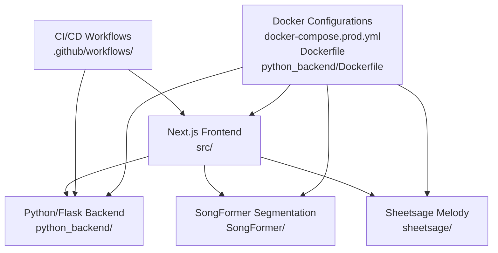
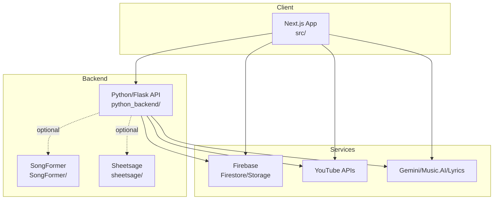
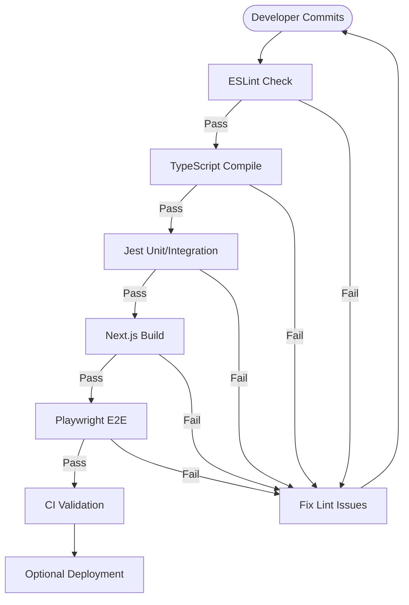
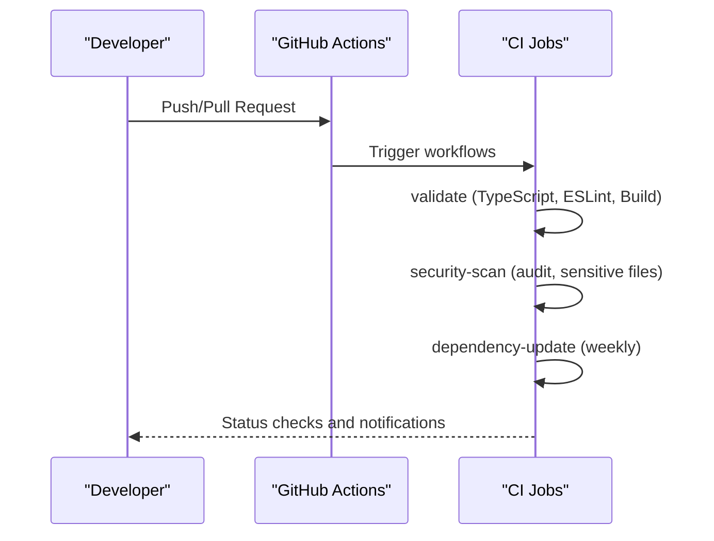
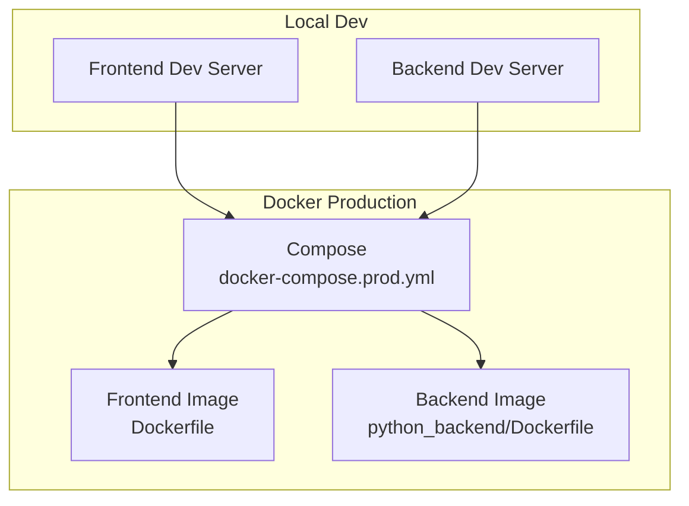
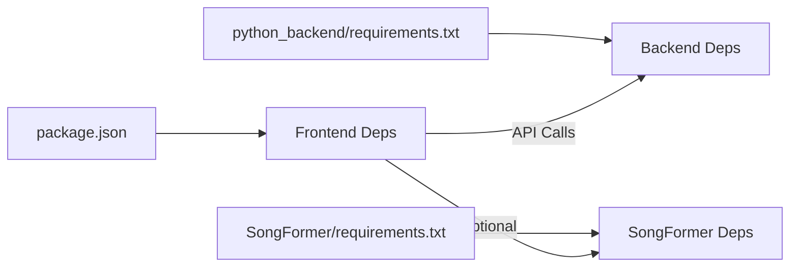

# Development Guidelines

<cite>
**Referenced Files in This Document**
- [CONTRIBUTING.md](file://CONTRIBUTING.md)
- [README.md](file://README.md)
- [package.json](file://package.json)
- [tsconfig.json](file://tsconfig.json)
- [.eslintrc.json](file://.eslintrc.json)
- [eslint.config.mjs](file://eslint.config.mjs)
- [jest.config.js](file://jest.config.js)
- [python_backend/requirements.txt](file://python_backend/requirements.txt)
- [SongFormer/requirements.txt](file://SongFormer/requirements.txt)
- [.github/workflows/deploy.yml](file://.github/workflows/deploy.yml)
- [.github/workflows/dependency-update.yml](file://.github/workflows/dependency-update.yml)
- [docker-compose.prod.yml](file://docker-compose.prod.yml)
- [Dockerfile](file://Dockerfile)
- [python_backend/Dockerfile](file://python_backend/Dockerfile)
- `Machine Learning Models/Adding New Models.md`
</cite>

## Table of Contents
1. [Introduction](#introduction)
2. [Project Structure](#project-structure)
3. [Core Components](#core-components)
4. [Architecture Overview](#architecture-overview)
5. [Detailed Component Analysis](#detailed-component-analysis)
6. [Dependency Analysis](#dependency-analysis)
7. [Performance Considerations](#performance-considerations)
8. [Troubleshooting Guide](#troubleshooting-guide)
9. [Conclusion](#conclusion)
10. [Appendices](#appendices)

## Introduction
This document provides comprehensive development guidelines for contributing to ChordMiniApp. It consolidates coding standards, project structure conventions, testing strategy, code review and PR processes, development workflow, documentation standards, deployment procedures, community guidelines, tooling setup, and guidance for extending the application while maintaining code quality. Developers adding ML capabilities should also follow the model-agnostic workflow in `Machine Learning Models/Adding New Models.md`.

## Project Structure
ChordMiniApp is a full-stack application composed of:
- A modern Next.js frontend (TypeScript/React) under src/
- A Python/Flask backend under python_backend/
- An optional SongFormer segmentation service under SongFormer/
- A Sheetsage melody service under sheetsage/
- Shared documentation under docs/
- CI/CD under .github/workflows/
- Docker configurations for local and production deployment

Key conventions observed:
- Frontend uses absolute imports with the @/ alias mapped in tsconfig.json.
- Feature-based grouping of components, services, hooks, and stores.
- Strict TypeScript configuration with noEmit and bundler module resolution.
- ESLint configured via both .eslintrc.json and eslint.config.mjs for Next.js and TypeScript defaults.
- Jest-based unit/integration testing with Babel/JSDOM environment and module name mapping to @/.

**Diagram sources**
- [docker-compose.prod.yml:1-102](file://docker-compose.prod.yml#L1-L102)
- [Dockerfile:1-87](file://Dockerfile#L1-L87)
- [python_backend/Dockerfile:1-116](file://python_backend/Dockerfile#L1-L116)

**Section sources**
- [tsconfig.json:25-29](file://tsconfig.json#L25-L29)
- [.eslintrc.json:1-23](file://.eslintrc.json#L1-L23)
- [eslint.config.mjs:1-49](file://eslint.config.mjs#L1-L49)
- [jest.config.js:1-51](file://jest.config.js#L1-L51)

## Core Components
- Frontend (Next.js + React + TypeScript)
  - Strict TypeScript compiler options, absolute imports via @/, and enforced noEmit for production builds.
  - ESLint configured with Next.js core-web-vitals and TypeScript presets; ignores backend and build artifacts.
  - Jest configured for unit and integration tests with jsdom, module name mapping, and Babel transforms.
- Backend (Python/Flask)
  - Flask application with CORS, rate limiting, and audio processing libraries.
  - Dockerized with multi-stage build, pre-downloaded Spleeter models, and health checks.
- Optional Services
  - SongFormer: standalone Flask service for segmentation with PyTorch/TensorFlow stack.
  - Sheetsage: optional melody transcription service with Docker support.

**Section sources**
- [tsconfig.json:1-43](file://tsconfig.json#L1-L43)
- [.eslintrc.json:1-23](file://.eslintrc.json#L1-L23)
- [eslint.config.mjs:1-49](file://eslint.config.mjs#L1-L49)
- [jest.config.js:1-51](file://jest.config.js#L1-L51)
- [python_backend/requirements.txt:1-131](file://python_backend/requirements.txt#L1-L131)
- [SongFormer/requirements.txt:1-26](file://SongFormer/requirements.txt#L1-L26)
- [python_backend/Dockerfile:1-116](file://python_backend/Dockerfile#L1-L116)

## Architecture Overview
High-level architecture integrates:
- Frontend Next.js serving the UI and orchestrating API calls to the Python backend.
- Python backend exposing ML/audio processing endpoints and coordinating external services.
- Optional SongFormer segmentation and Sheetsage melody services behind feature toggles.
- CI/CD validating TypeScript, linting, builds, and security audits; Docker-based production deployment.

**Diagram sources**
- [README.md:341-507](file://README.md#L341-L507)
- [python_backend/Dockerfile:1-116](file://python_backend/Dockerfile#L1-L116)
- [docker-compose.prod.yml:1-102](file://docker-compose.prod.yml#L1-L102)

**Section sources**
- [README.md:341-507](file://README.md#L341-L507)

## Detailed Component Analysis

### Coding Standards and Conventions
- TypeScript/React
  - Strict mode enabled; avoid any types; prefer explicit interfaces.
  - Naming: PascalCase for components/interfaces; camelCase for variables/functions; UPPER_SNAKE_CASE for constants.
  - Absolute imports with @/ prefix; feature-based folder organization.
  - Accessibility and responsive design with Tailwind; HeroUI component usage encouraged.
- Python/Flask
  - Flask application with CORS and rate limiting; environment-driven configuration.
  - Dockerized with multi-stage builds and pre-downloaded model caches.
- ESLint and TypeScript
  - Next.js core-web-vitals and TypeScript presets; ignore patterns exclude backend, build, and test artifacts.
  - React version explicitly set in eslint config to avoid API deprecations.

**Section sources**
- [CONTRIBUTING.md:11-31](file://CONTRIBUTING.md#L11-L31)
- [tsconfig.json:1-43](file://tsconfig.json#L1-L43)
- [.eslintrc.json:1-23](file://.eslintrc.json#L1-L23)
- [eslint.config.mjs:1-49](file://eslint.config.mjs#L1-L49)

### Testing Strategy
- Unit Tests
  - Jest with React Testing Library for components, hooks, services, and stores.
  - Module name mapping to @/ and Babel transform for TS/TSX.
- Integration Tests
  - Jest-based integration coverage for API routes and workflow-heavy features.
- End-to-End Tests
  - Playwright configured with a playwright config file; scripts include e2e and e2e:ui modes.
- Build Verification
  - Production build validation via npm run build; bundle analysis scripts available.

**Diagram sources**
- [jest.config.js:1-51](file://jest.config.js#L1-L51)
- [package.json:11-31](file://package.json#L11-L31)
- [.github/workflows/deploy.yml:48-55](file://.github/workflows/deploy.yml#L48-L55)

**Section sources**
- [CONTRIBUTING.md:41-71](file://CONTRIBUTING.md#L41-L71)
- [jest.config.js:1-51](file://jest.config.js#L1-L51)
- [package.json:11-31](file://package.json#L11-L31)

### Code Review and Pull Request Process
- Before Submitting
  - Fork and branch from main; ensure tests and lint clean; update documentation; verify build.
- PR Requirements
  - Descriptive title and detailed description; link related issues; include screenshots for UI changes; document breaking changes.
- Review Process
  - Automated checks: TypeScript compile, ESLint, production build.
  - Maintainer review required; add targeted automated tests and manual verification for complex features; update documentation.
- Merge Criteria
  - All checks passing, approval, no conflicts, documentation updated, performance impact assessed when applicable.

**Section sources**
- [CONTRIBUTING.md:72-99](file://CONTRIBUTING.md#L72-L99)

### Issue Reporting Procedures
- Bug Reports
  - Include environment, steps to reproduce, expected vs actual, screenshots/videos, and console logs.
- Feature Requests
  - Describe use case, proposed solution, alternatives, and additional context.
- Performance Issues
  - Include metrics, environment/device/network, reproduction steps, and impact.

**Section sources**
- [CONTRIBUTING.md:100-121](file://CONTRIBUTING.md#L100-L121)

### Development Workflow and Branch Management
- Branching
  - Create feature branches from main; keep PRs small and focused.
- Commit Conventions
  - Follow semantic commit messages; include issue references where applicable.
- Continuous Integration
  - Pre-deployment validation includes TypeScript, ESLint, build, and pre-deployment checklist.
  - Security scan audits dependencies and checks for sensitive files; verifies environment configuration.
  - Automated dependency updates workflow schedules weekly patch/minor updates and creates PRs; major updates surfaced via issues.

**Diagram sources**
- [.github/workflows/deploy.yml:1-287](file://.github/workflows/deploy.yml#L1-L287)
- [.github/workflows/dependency-update.yml:1-243](file://.github/workflows/dependency-update.yml#L1-L243)

**Section sources**
- [.github/workflows/deploy.yml:27-68](file://.github/workflows/deploy.yml#L27-L68)
- [.github/workflows/dependency-update.yml:14-143](file://.github/workflows/dependency-update.yml#L14-L143)

### Documentation Standards
- Inline Documentation
  - Prefer self-documenting code; add comments for complex logic and non-obvious decisions.
- API Documentation
  - Document endpoints, request/response schemas, headers, and error codes in API docs.
- User Documentation
  - Maintain user guides, tutorials, and feature explanations in docs/.
- Developer Documentation
  - Keep architecture guides, contribution workflows, and setup instructions current.

**Section sources**
- [CONTRIBUTING.md:148-153](file://CONTRIBUTING.md#L148-L153)

### Deployment Procedures
- Development
  - Local setup with Node.js 20+, Python 3.10.x, Docker, Firebase, and API keys as per README.
- Staging/Production
  - Docker Compose with pre-built images; configure environment variables; health checks included.
  - Backend Dockerfile includes multi-stage build, pre-downloaded Spleeter models, and Gunicorn worker tuning.
  - Frontend Dockerfile multi-stage build with yt-dlp and ffmpeg for audio extraction.

**Diagram sources**
- [README.md:192-260](file://README.md#L192-L260)
- [docker-compose.prod.yml:1-102](file://docker-compose.prod.yml#L1-L102)
- [Dockerfile:1-87](file://Dockerfile#L1-L87)
- [python_backend/Dockerfile:1-116](file://python_backend/Dockerfile#L1-L116)

**Section sources**
- [README.md:192-260](file://README.md#L192-L260)
- [docker-compose.prod.yml:1-102](file://docker-compose.prod.yml#L1-L102)
- [Dockerfile:1-87](file://Dockerfile#L1-L87)
- [python_backend/Dockerfile:1-116](file://python_backend/Dockerfile#L1-L116)

### Community Guidelines, Communication, and Recognition
- Code of Conduct
  - Respectful, inclusive, collaborative, and quality-focused communication.
- Getting Help
  - Use GitHub Discussions for questions, Issues for bugs and features, and refer to existing documentation.
- Recognition
  - Contributors acknowledged in README, Changelog, and Release Notes.

**Section sources**
- [CONTRIBUTING.md:154-171](file://CONTRIBUTING.md#L154-L171)

### Tooling Setup
- IDE and Editor
  - Use TypeScript strict mode; configure ESLint and Prettier per project settings.
- Linting
  - Run npm run lint; address issues before opening PRs.
- Debugging
  - Use browser devtools for frontend; backend logs via Flask/Gunicorn; Docker logs for containerized services.
- Build and Bundle Analysis
  - Use npm run analyze, analyze:server, analyze:browser for bundle insights.

**Section sources**
- [CONTRIBUTING.md:33-39](file://CONTRIBUTING.md#L33-L39)
- [package.json:11-31](file://package.json#L11-L31)

### Extending the Application and Maintaining Quality
- Adding New Features
  - Follow feature-based folder structure; add tests; update documentation; ensure build passes.
- Backend Extensions
  - Integrate new ML models or services following Flask blueprint patterns; add Dockerfile if standalone.
- Frontend Extensions
  - Use functional components with hooks; group related components; leverage absolute imports.
- Quality Gates
  - Enforce TypeScript compilation, ESLint, Jest coverage, and build verification in CI.

**Section sources**
- [CONTRIBUTING.md:122-153](file://CONTRIBUTING.md#L122-L153)
- [python_backend/Dockerfile:1-116](file://python_backend/Dockerfile#L1-L116)

## Dependency Analysis
- Frontend Dependencies
  - Next.js, React 19, HeroUI, Tailwind, Firebase, Tone.js, ffmpeg, and more as defined in package.json.
- Backend Dependencies
  - Flask, librosa, spleeter, madmom, TensorFlow/PyTorch, and more as defined in python_backend/requirements.txt.
- Optional Services
  - SongFormer and Sheetsage have dedicated requirements and Dockerfiles.

**Diagram sources**
- [package.json:37-89](file://package.json#L37-L89)
- [python_backend/requirements.txt:1-131](file://python_backend/requirements.txt#L1-L131)
- [SongFormer/requirements.txt:1-26](file://SongFormer/requirements.txt#L1-L26)

**Section sources**
- [package.json:37-89](file://package.json#L37-L89)
- [python_backend/requirements.txt:1-131](file://python_backend/requirements.txt#L1-L131)
- [SongFormer/requirements.txt:1-26](file://SongFormer/requirements.txt#L1-L26)

## Performance Considerations
- Frontend
  - Use Next.js build analysis scripts; optimize bundles; leverage lazy loading and dynamic imports.
- Backend
  - Tune Gunicorn workers and timeouts; pre-download heavy models; monitor memory usage.
- Observability
  - Enable logging and health checks; monitor container resource utilization.

[No sources needed since this section provides general guidance]

## Troubleshooting Guide
- Backend Connectivity
  - Verify backend health endpoint and port 5001; check environment variables and CORS origins.
- Firebase Storage
  - Ensure Anonymous Auth enabled; verify storage rules and temp folder cleanup configuration.
- Docker Platform Issues
  - On Windows/x86_64, build local linux/amd64 images instead of pulling arm64 ones.
- Dependency Conflicts
  - Use WSL2/Ubuntu or Docker for backend installs when native Windows fails due to dependency resolution.

**Section sources**
- [README.md:447-490](file://README.md#L447-L490)

## Conclusion
These guidelines consolidate the project’s coding standards, testing strategy, CI/CD practices, deployment procedures, and community norms. By following these practices, contributors can efficiently extend ChordMiniApp while maintaining high code quality and reliability.

## Appendices
- Quick Commands
  - Frontend: npm run dev, lint, test, build, analyze
  - Backend: Python virtual environment, pip install, python app.py
  - Docker: docker-compose up/down with .env.docker

**Section sources**
- [package.json:11-31](file://package.json#L11-L31)
- [README.md:136-189](file://README.md#L136-L189)
- [docker-compose.prod.yml:1-102](file://docker-compose.prod.yml#L1-L102)
