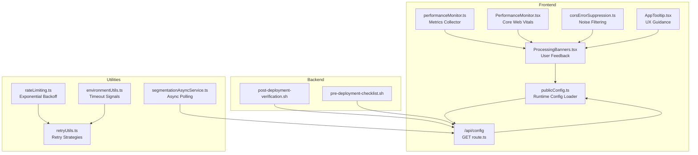
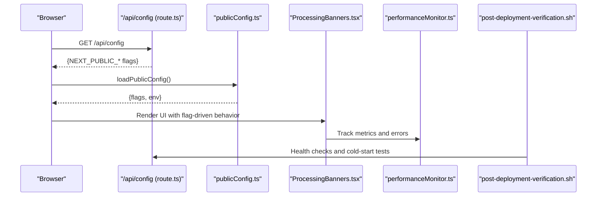
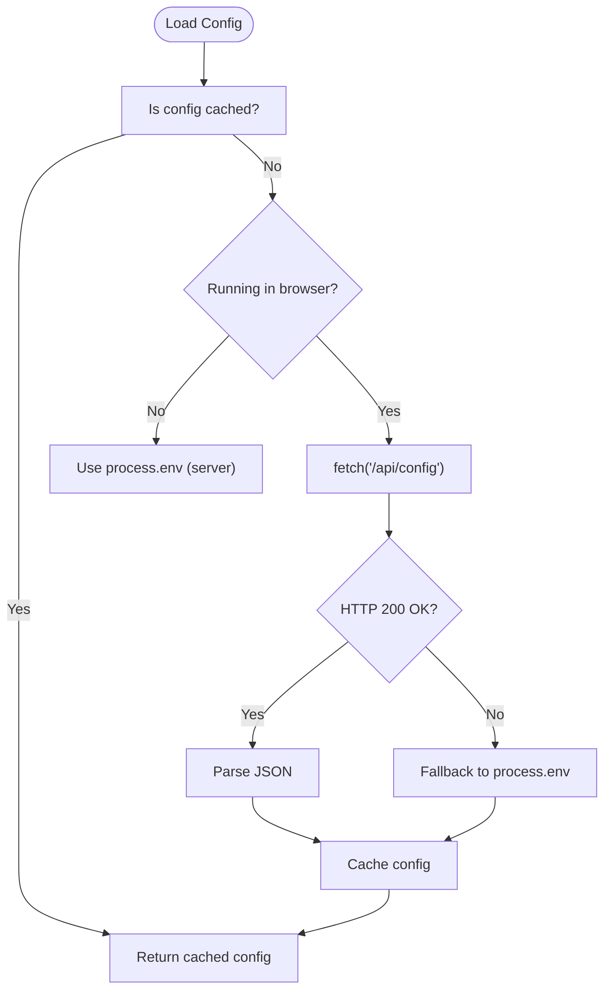
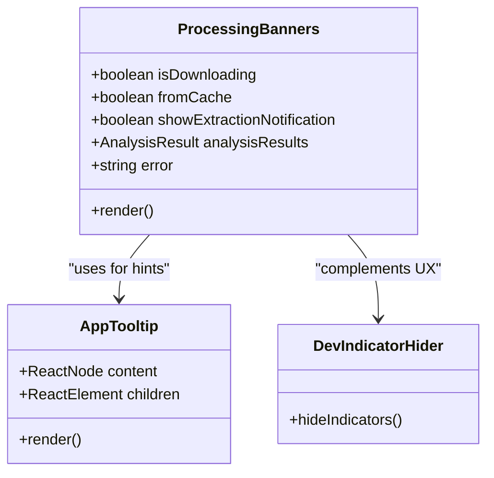
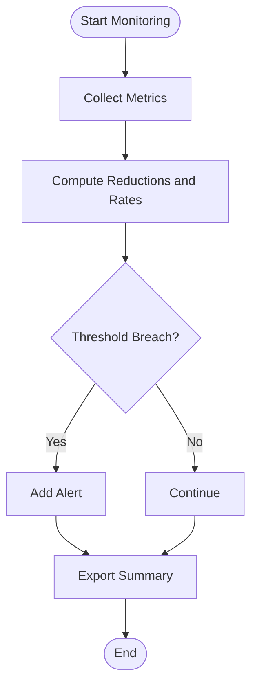
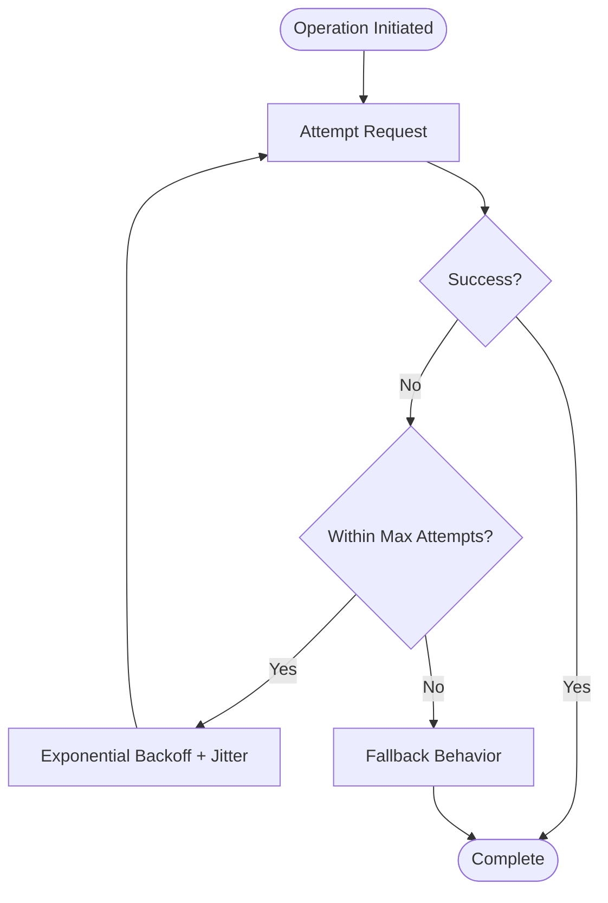

# Experimental Feature Management

<cite>
**Referenced Files in This Document**
- [publicConfig.ts](file://src/config/publicConfig.ts)
- [route.ts](file://src/app/api/config/route.ts)
- [performanceMonitor.ts](file://src/services/performance/performanceMonitor.ts)
- [PerformanceMonitor.tsx](file://src/components/layout/PerformanceMonitor.tsx)
- [corsErrorSuppression.ts](file://src/utils/corsErrorSuppression.ts)
- [rateLimiting.ts](file://src/utils/rateLimiting.ts)
- [retryUtils.ts](file://src/utils/retryUtils.ts)
- [environmentUtils.ts](file://src/utils/environmentUtils.ts)
- [segmentationAsyncService.ts](file://src/services/api/segmentationAsyncService.ts)
- [post-deployment-verification.sh](file://scripts/post-deployment-verification.sh)
- [pre-deployment-checklist.sh](file://scripts/pre-deployment-checklist.sh)
- [DevIndicatorHider.tsx](file://src/components/layout/DevIndicatorHider.tsx)
- [ProcessingBanners.tsx](file://src/components/analysis/ProcessingBanners.tsx)
- [AppTooltip.tsx](file://src/components/common/AppTooltip.tsx)
- [ApiKeyModal.tsx](file://src/components/settings/ApiKeyModal.tsx)
- [page.tsx](file://src/app/settings/page.tsx)
- [btc_config.yaml](file://python_backend/config/btc_config.yaml)
- [SongFormer.yaml](file://SongFormer/src/SongFormer/configs/SongFormer.yaml)
</cite>

## Table of Contents
1. [Introduction](#introduction)
2. [Project Structure](#project-structure)
3. [Core Components](#core-components)
4. [Architecture Overview](#architecture-overview)
5. [Detailed Component Analysis](#detailed-component-analysis)
6. [Dependency Analysis](#dependency-analysis)
7. [Performance Considerations](#performance-considerations)
8. [Troubleshooting Guide](#troubleshooting-guide)
9. [Conclusion](#conclusion)
10. [Appendices](#appendices)

## Introduction
This document defines a comprehensive experimental feature management framework for ChordMiniApp. It covers configuration systems for enabling/disabling experimental features via environment variables and feature flags, deployment-specific settings, performance impact assessment and monitoring, user interface controls for experimental features, rollback and fallback mechanisms, telemetry and analytics, governance, testing strategies, and communication guidelines for beta users.

## Project Structure
ChordMiniApp organizes experimental feature management across:
- Frontend runtime configuration and feature flags
- Backend configuration API and environment exposure
- Performance monitoring and error suppression
- UI banners and tooltips for user feedback
- Deployment verification and retry/backoff utilities



**Diagram sources**
- [publicConfig.ts:1-218](file://src/config/publicConfig.ts#L1-L218)
- [route.ts:1-100](file://src/app/api/config/route.ts#L1-L100)
- [performanceMonitor.ts:141-312](file://src/services/performance/performanceMonitor.ts#L141-L312)
- [PerformanceMonitor.tsx:1-89](file://src/components/layout/PerformanceMonitor.tsx#L1-L89)
- [corsErrorSuppression.ts:74-138](file://src/utils/corsErrorSuppression.ts#L74-L138)
- [ProcessingBanners.tsx:1-104](file://src/components/analysis/ProcessingBanners.tsx#L1-L104)
- [AppTooltip.tsx:1-43](file://src/components/common/AppTooltip.tsx#L1-L43)
- [rateLimiting.ts:56-115](file://src/utils/rateLimiting.ts#L56-L115)
- [retryUtils.ts:1-34](file://src/utils/retryUtils.ts#L1-L34)
- [environmentUtils.ts:60-84](file://src/utils/environmentUtils.ts#L60-L84)
- [segmentationAsyncService.ts:87-118](file://src/services/api/segmentationAsyncService.ts#L87-L118)
- [post-deployment-verification.sh:135-167](file://scripts/post-deployment-verification.sh#L135-L167)
- [pre-deployment-checklist.sh:212-237](file://scripts/pre-deployment-checklist.sh#L212-L237)

**Section sources**
- [publicConfig.ts:1-218](file://src/config/publicConfig.ts#L1-L218)
- [route.ts:1-100](file://src/app/api/config/route.ts#L1-L100)

## Core Components
- Runtime configuration loader and API endpoint for feature flags and environment variables
- Performance monitoring and Core Web Vitals tracking
- Error suppression and user-friendly error banners
- Retry/backoff and timeout utilities for resilience
- Deployment verification scripts for post-deployment checks

**Section sources**
- [publicConfig.ts:22-47](file://src/config/publicConfig.ts#L22-L47)
- [route.ts:29-80](file://src/app/api/config/route.ts#L29-L80)
- [performanceMonitor.ts:158-200](file://src/services/performance/performanceMonitor.ts#L158-L200)
- [PerformanceMonitor.tsx:17-89](file://src/components/layout/PerformanceMonitor.tsx#L17-L89)
- [corsErrorSuppression.ts:108-138](file://src/utils/corsErrorSuppression.ts#L108-L138)
- [ProcessingBanners.tsx:46-100](file://src/components/analysis/ProcessingBanners.tsx#L46-L100)
- [rateLimiting.ts:59-115](file://src/utils/rateLimiting.ts#L59-L115)
- [environmentUtils.ts:63-84](file://src/utils/environmentUtils.ts#L63-L84)
- [post-deployment-verification.sh:135-167](file://scripts/post-deployment-verification.sh#L135-L167)
- [pre-deployment-checklist.sh:212-237](file://scripts/pre-deployment-checklist.sh#L212-L237)

## Architecture Overview
The experimental feature lifecycle integrates configuration, UI feedback, performance monitoring, and deployment verification.



**Diagram sources**
- [route.ts:29-80](file://src/app/api/config/route.ts#L29-L80)
- [publicConfig.ts:63-108](file://src/config/publicConfig.ts#L63-L108)
- [ProcessingBanners.tsx:46-100](file://src/components/analysis/ProcessingBanners.tsx#L46-L100)
- [performanceMonitor.ts:158-200](file://src/services/performance/performanceMonitor.ts#L158-L200)
- [post-deployment-verification.sh:135-167](file://scripts/post-deployment-verification.sh#L135-L167)

## Detailed Component Analysis

### Configuration System for Experimental Features
- Purpose: Provide runtime feature flags and environment variables to the frontend without baking secrets into the build.
- Key elements:
  - Feature flags: NEXT_PUBLIC_AUDIO_STRATEGY, NEXT_PUBLIC_ENABLE_TRUE_STREAMING, NEXT_DISABLE_DEV_OVERLAY
  - Allowed keys: NEXT_PUBLIC_* plus selected explicit names
  - Blocked keys: Certain internal URLs to prevent leakage
  - Caching and fallback: Client-side cache with graceful fallback to process.env



**Diagram sources**
- [publicConfig.ts:63-108](file://src/config/publicConfig.ts#L63-L108)
- [route.ts:29-80](file://src/app/api/config/route.ts#L29-L80)

**Section sources**
- [publicConfig.ts:22-47](file://src/config/publicConfig.ts#L22-L47)
- [publicConfig.ts:63-108](file://src/config/publicConfig.ts#L63-L108)
- [route.ts:29-80](file://src/app/api/config/route.ts#L29-L80)

### User Interface Controls for Experimental Features
- Visibility toggles: Use feature flags to conditionally render experimental controls.
- Warning messages: Use ProcessingBanners to surface actionable errors and suggestions.
- UX guidance: Use AppTooltip to explain experimental behavior and risks.
- Developer overlay: NEXT_DISABLE_DEV_OVERLAY and DevIndicatorHider can suppress noisy dev UI.



**Diagram sources**
- [ProcessingBanners.tsx:46-100](file://src/components/analysis/ProcessingBanners.tsx#L46-L100)
- [AppTooltip.tsx:16-41](file://src/components/common/AppTooltip.tsx#L16-L41)
- [DevIndicatorHider.tsx:9-38](file://src/components/layout/DevIndicatorHider.tsx#L9-L38)

**Section sources**
- [ProcessingBanners.tsx:46-100](file://src/components/analysis/ProcessingBanners.tsx#L46-L100)
- [AppTooltip.tsx:16-41](file://src/components/common/AppTooltip.tsx#L16-L41)
- [DevIndicatorHider.tsx:9-38](file://src/components/layout/DevIndicatorHider.tsx#L9-L38)

### Performance Impact Assessment and Monitoring
- Metrics: Firebase query reduction, cache hit rate, error reduction percentage, Core Web Vitals (LCP, FID, CLS, TTFB, FCP).
- Alerts: Threshold-based notifications for degradation.
- CWV monitoring: Development-only Core Web Vitals observer.



**Diagram sources**
- [performanceMonitor.ts:158-200](file://src/services/performance/performanceMonitor.ts#L158-L200)
- [performanceMonitor.ts:226-250](file://src/services/performance/performanceMonitor.ts#L226-L250)
- [PerformanceMonitor.tsx:26-89](file://src/components/layout/PerformanceMonitor.tsx#L26-L89)

**Section sources**
- [performanceMonitor.ts:158-200](file://src/services/performance/performanceMonitor.ts#L158-L200)
- [performanceMonitor.ts:226-250](file://src/services/performance/performanceMonitor.ts#L226-L250)
- [PerformanceMonitor.tsx:26-89](file://src/components/layout/PerformanceMonitor.tsx#L26-L89)

### Rollback Procedures and Fallback Mechanisms
- Graceful fallback: Config loader falls back to process.env if /api/config fails.
- Error suppression: Harmless CORS/dev noise filtered to reduce alert fatigue.
- Resilience utilities: Exponential backoff, timeouts, and retry strategies for transient failures.
- Async polling: Adjustable delays and max attempts for long-running jobs.



**Diagram sources**
- [publicConfig.ts:97-105](file://src/config/publicConfig.ts#L97-L105)
- [corsErrorSuppression.ts:108-138](file://src/utils/corsErrorSuppression.ts#L108-L138)
- [rateLimiting.ts:78-100](file://src/utils/rateLimiting.ts#L78-L100)
- [environmentUtils.ts:63-84](file://src/utils/environmentUtils.ts#L63-L84)
- [segmentationAsyncService.ts:87-99](file://src/services/api/segmentationAsyncService.ts#L87-L99)

**Section sources**
- [publicConfig.ts:97-105](file://src/config/publicConfig.ts#L97-L105)
- [corsErrorSuppression.ts:74-138](file://src/utils/corsErrorSuppression.ts#L74-L138)
- [rateLimiting.ts:56-115](file://src/utils/rateLimiting.ts#L56-L115)
- [environmentUtils.ts:60-84](file://src/utils/environmentUtils.ts#L60-L84)
- [segmentationAsyncService.ts:87-118](file://src/services/api/segmentationAsyncService.ts#L87-L118)

### Telemetry and Analytics Collection
- Usage metrics: Track feature adoption via configuration flags and UI interactions.
- Error rates: Monitor suppressed warnings and legacy error reductions.
- Performance benchmarks: Firebase query reduction, cache hit rate, Core Web Vitals.
- Export: Summarize metrics and alerts for diagnostics.

**Section sources**
- [performanceMonitor.ts:158-200](file://src/services/performance/performanceMonitor.ts#L158-L200)
- [performanceMonitor.ts:202-212](file://src/services/performance/performanceMonitor.ts#L202-L212)

### Governance Framework
- Approval: Feature flags remain under controlled environment variables; avoid exposing secrets.
- Timeline: Use deployment verification scripts to validate health and cold starts.
- Transition: Gradually enable/disable flags; maintain blocked keys to protect sensitive endpoints.

**Section sources**
- [route.ts:34-49](file://src/app/api/config/route.ts#L34-L49)
- [post-deployment-verification.sh:135-167](file://scripts/post-deployment-verification.sh#L135-L167)
- [pre-deployment-checklist.sh:212-237](file://scripts/pre-deployment-checklist.sh#L212-L237)

### Testing Strategies
- A/B testing: Toggle feature flags per user cohort via environment variables.
- Gradual rollout: Enable flags in staging first; verify with deployment scripts.
- User feedback: Use ProcessingBanners and tooltips to guide users and collect feedback.

**Section sources**
- [ProcessingBanners.tsx:46-100](file://src/components/analysis/ProcessingBanners.tsx#L46-L100)
- [AppTooltip.tsx:16-41](file://src/components/common/AppTooltip.tsx#L16-L41)
- [post-deployment-verification.sh:135-167](file://scripts/post-deployment-verification.sh#L135-L167)

### Communication and Expectations
- Transparent UX: Use tooltips and banners to explain experimental behavior and limitations.
- Settings visibility: Ensure API key modals and settings pages reflect current capability state.
- Dev overlay control: NEXT_DISABLE_DEV_OVERLAY and DevIndicatorHider reduce noise.

**Section sources**
- [AppTooltip.tsx:16-41](file://src/components/common/AppTooltip.tsx#L16-L41)
- [ApiKeyModal.tsx:123-157](file://src/components/settings/ApiKeyModal.tsx#L123-L157)
- [page.tsx:40-68](file://src/app/settings/page.tsx#L40-L68)
- [DevIndicatorHider.tsx:9-38](file://src/components/layout/DevIndicatorHider.tsx#L9-L38)

## Dependency Analysis
- Frontend depends on runtime config for feature flags.
- UI components depend on config and performance metrics.
- Backend config API depends on environment variables and blocks sensitive keys.
- Deployment scripts depend on backend health and cold-start behavior.

```mermaid
graph LR
ConfigAPI["/api/config (route.ts)"] <- --> ConfigLoader["publicConfig.ts"]
ConfigLoader --> UI["ProcessingBanners.tsx"]
UI --> Perf["performanceMonitor.ts"]
Perf --> CWV["PerformanceMonitor.tsx"]
ConfigAPI --> Deploy["post-deployment-verification.sh"]
ConfigAPI --> PreDeploy["pre-deployment-checklist.sh"]
```

**Diagram sources**
- [route.ts:29-80](file://src/app/api/config/route.ts#L29-L80)
- [publicConfig.ts:63-108](file://src/config/publicConfig.ts#L63-L108)
- [ProcessingBanners.tsx:46-100](file://src/components/analysis/ProcessingBanners.tsx#L46-L100)
- [performanceMonitor.ts:158-200](file://src/services/performance/performanceMonitor.ts#L158-L200)
- [PerformanceMonitor.tsx:26-89](file://src/components/layout/PerformanceMonitor.tsx#L26-L89)
- [post-deployment-verification.sh:135-167](file://scripts/post-deployment-verification.sh#L135-L167)
- [pre-deployment-checklist.sh:212-237](file://scripts/pre-deployment-checklist.sh#L212-L237)

**Section sources**
- [route.ts:29-80](file://src/app/api/config/route.ts#L29-L80)
- [publicConfig.ts:63-108](file://src/config/publicConfig.ts#L63-L108)
- [ProcessingBanners.tsx:46-100](file://src/components/analysis/ProcessingBanners.tsx#L46-L100)
- [performanceMonitor.ts:158-200](file://src/services/performance/performanceMonitor.ts#L158-L200)
- [PerformanceMonitor.tsx:26-89](file://src/components/layout/PerformanceMonitor.tsx#L26-L89)
- [post-deployment-verification.sh:135-167](file://scripts/post-deployment-verification.sh#L135-L167)
- [pre-deployment-checklist.sh:212-237](file://scripts/pre-deployment-checklist.sh#L212-L237)

## Performance Considerations
- Prefer client-side caching of configuration to minimize network overhead.
- Use Core Web Vitals monitoring in development to catch regressions early.
- Apply exponential backoff and jitter to reduce thundering herd effects.
- Suppress harmless console noise to keep error signals meaningful.

[No sources needed since this section provides general guidance]

## Troubleshooting Guide
- Config endpoint failures: Verify allowed keys and blocked keys; confirm no-cache headers; check fallback to process.env.
- Poor Core Web Vitals: Review CWV logs and adjust resource loading strategies.
- Excessive errors: Investigate suppressed vs. real errors; tune error suppression thresholds.
- Deployment health: Use pre-deployment and post-deployment scripts to validate backend readiness.

**Section sources**
- [route.ts:29-80](file://src/app/api/config/route.ts#L29-L80)
- [PerformanceMonitor.tsx:26-89](file://src/components/layout/PerformanceMonitor.tsx#L26-L89)
- [performanceMonitor.ts:282-300](file://src/services/performance/performanceMonitor.ts#L282-L300)
- [post-deployment-verification.sh:135-167](file://scripts/post-deployment-verification.sh#L135-L167)
- [pre-deployment-checklist.sh:212-237](file://scripts/pre-deployment-checklist.sh#L212-L237)

## Conclusion
ChordMiniApp’s experimental feature management centers on a secure, runtime configuration system, robust performance monitoring, resilient UI feedback, and deployment verification. By leveraging feature flags, careful error suppression, and structured testing, teams can safely iterate on experimental capabilities while maintaining user trust and system reliability.

[No sources needed since this section summarizes without analyzing specific files]

## Appendices

### Appendix A: Feature Flag Reference
- NEXT_PUBLIC_AUDIO_STRATEGY: Select audio processing strategy.
- NEXT_PUBLIC_ENABLE_TRUE_STREAMING: Enable true streaming behavior.
- NEXT_DISABLE_DEV_OVERLAY: Hide development overlays.

**Section sources**
- [publicConfig.ts:37-40](file://src/config/publicConfig.ts#L37-L40)
- [DevIndicatorHider.tsx:9-38](file://src/components/layout/DevIndicatorHider.tsx#L9-L38)

### Appendix B: Backend Configuration Exposure
- Allowed prefixes: NEXT_PUBLIC_*
- Explicit names: NEXT_DISABLE_DEV_OVERLAY, NODE_ENV
- Blocked keys: Internal service URLs

**Section sources**
- [route.ts:34-49](file://src/app/api/config/route.ts#L34-L49)

### Appendix C: Model Configuration Context
- BTC and SongFormer configurations demonstrate experiment-like tuning parameters and training schedules that mirror feature experimentation.

**Section sources**
- [btc_config.yaml:18-61](file://python_backend/config/btc_config.yaml#L18-L61)
- [SongFormer.yaml:67-186](file://SongFormer/src/SongFormer/configs/SongFormer.yaml#L67-L186)