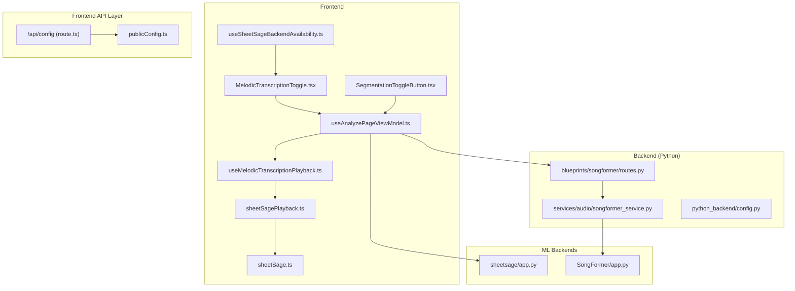
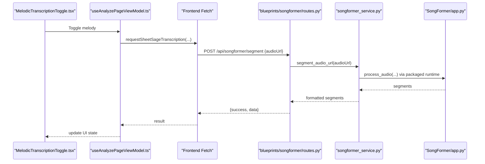
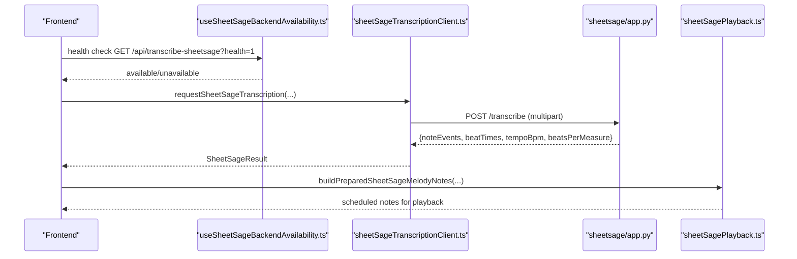
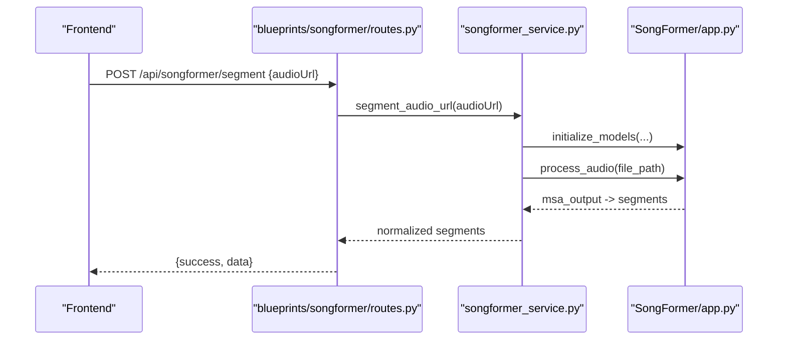
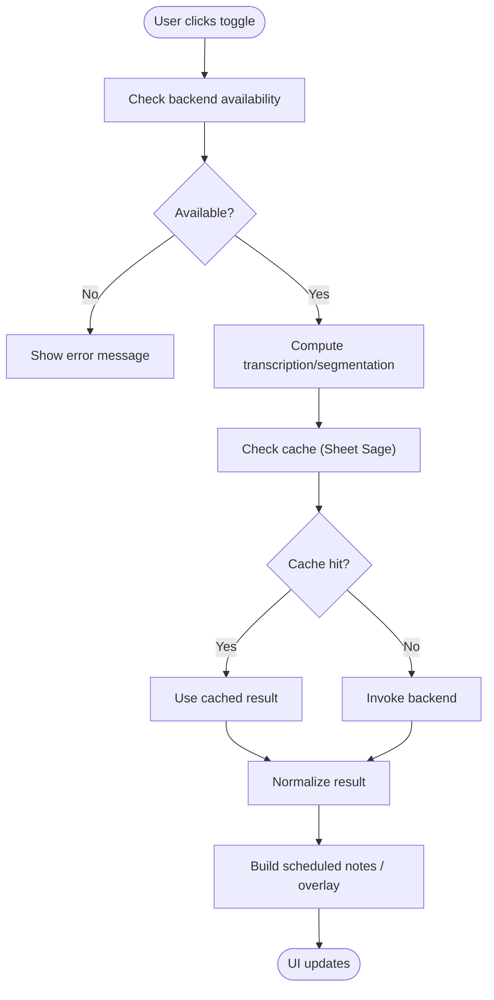
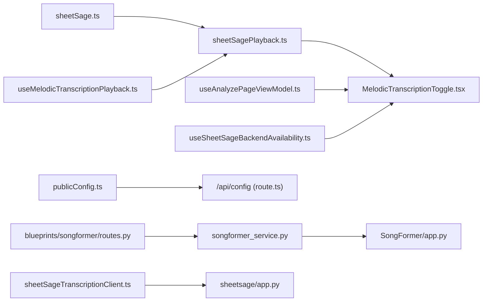

# Experimental Features

<cite>
**Referenced Files in This Document**
- [sheetsage/app.py](file://sheetsage/app.py)
- [SongFormer/app.py](file://SongFormer/app.py)
- [python_backend/blueprints/songformer/routes.py](file://python_backend/blueprints/songformer/routes.py)
- [python_backend/services/audio/songformer_service.py](file://python_backend/services/audio/songformer_service.py)
- [src/services/sheetsage/sheetSageTranscriptionClient.ts](file://src/services/sheetsage/sheetSageTranscriptionClient.ts)
- [src/hooks/sheetsage/useSheetSageBackendAvailability.ts](file://src/hooks/sheetsage/useSheetSageBackendAvailability.ts)
- [src/services/lyrics/songSegmentationService.ts](file://src/services/lyrics/songSegmentationService.ts)
- [src/components/analysis/MelodicTranscriptionToggle.tsx](file://src/components/analysis/MelodicTranscriptionToggle.tsx)
- [src/components/analysis/SegmentationToggleButton.tsx](file://src/components/analysis/SegmentationToggleButton.tsx)
- [src/utils/sheetSagePlayback.ts](file://src/utils/sheetSagePlayback.ts)
- [src/types/sheetSage.ts](file://src/types/sheetSage.ts)
- [python_backend/config.py](file://python_backend/config.py)
- [src/config/publicConfig.ts](file://src/config/publicConfig.ts)
- [src/app/api/config/route.ts](file://src/app/api/config/route.ts)
- [src/app/analyze/[videoId]/_hooks/useAnalyzePageViewModel.ts](file://src/app/analyze/[videoId]/_hooks/useAnalyzePageViewModel.ts)
- [src/hooks/chord-playback/useMelodicTranscriptionPlayback.ts](file://src/hooks/chord-playback/useMelodicTranscriptionPlayback.ts)
- [src/services/sheetsage/sheetSageCacheClient.ts](file://src/services/sheetsage/sheetSageCacheClient.ts)
- [spleeter_service.py](file://python_backend/services/audio/spleeter_service.py)
</cite>

## Table of Contents
1. [Introduction](#introduction)
2. [Project Structure](#project-structure)
3. [Core Components](#core-components)
4. [Architecture Overview](#architecture-overview)
5. [Detailed Component Analysis](#detailed-component-analysis)
6. [Dependency Analysis](#dependency-analysis)
7. [Performance Considerations](#performance-considerations)
8. [Troubleshooting Guide](#troubleshooting-guide)
9. [Conclusion](#conclusion)
10. [Appendices](#appendices)

## Introduction
This document explains the experimental features in ChordMiniApp: Sheet Sage melody transcription and SongFormer song segmentation. It covers the underlying algorithms, integration patterns, performance characteristics, limitations, configuration, deployment, and roadmap considerations. Both features are marked as experimental and subject to change.

## Project Structure
The experimental features span three layers:
- Frontend (Next.js): UI toggles, orchestration hooks, and playback utilities
- Backend (Python): Route handlers and service adapters
- Standalone ML backends: Sheet Sage and SongFormer

**Diagram sources**
- [src/components/analysis/MelodicTranscriptionToggle.tsx:1-208](file://src/components/analysis/MelodicTranscriptionToggle.tsx#L1-L208)
- [src/components/analysis/SegmentationToggleButton.tsx:1-85](file://src/components/analysis/SegmentationToggleButton.tsx#L1-L85)
- [src/hooks/sheetsage/useSheetSageBackendAvailability.ts:1-60](file://src/hooks/sheetsage/useSheetSageBackendAvailability.ts#L1-L60)
- [src/app/analyze/[videoId]/_hooks/useAnalyzePageViewModel.ts](file://src/app/analyze/[videoId]/_hooks/useAnalyzePageViewModel.ts#L751-L793)
- [src/hooks/chord-playback/useMelodicTranscriptionPlayback.ts:50-83](file://src/hooks/chord-playback/useMelodicTranscriptionPlayback.ts#L50-L83)
- [src/utils/sheetSagePlayback.ts:1-365](file://src/utils/sheetSagePlayback.ts#L1-L365)
- [src/types/sheetSage.ts:1-19](file://src/types/sheetSage.ts#L1-L19)
- [src/app/api/config/route.ts:1-87](file://src/app/api/config/route.ts#L1-L87)
- [src/config/publicConfig.ts:1-218](file://src/config/publicConfig.ts#L1-L218)
- [python_backend/blueprints/songformer/routes.py:1-53](file://python_backend/blueprints/songformer/routes.py#L1-L53)
- [python_backend/services/audio/songformer_service.py:1-140](file://python_backend/services/audio/songformer_service.py#L1-L140)
- [python_backend/config.py:1-215](file://python_backend/config.py#L1-L215)
- [sheetsage/app.py:1-175](file://sheetsage/app.py#L1-L175)
- [SongFormer/app.py:1-698](file://SongFormer/app.py#L1-L698)

**Section sources**
- [src/components/analysis/MelodicTranscriptionToggle.tsx:1-208](file://src/components/analysis/MelodicTranscriptionToggle.tsx#L1-L208)
- [src/components/analysis/SegmentationToggleButton.tsx:1-85](file://src/components/analysis/SegmentationToggleButton.tsx#L1-L85)
- [src/hooks/sheetsage/useSheetSageBackendAvailability.ts:1-60](file://src/hooks/sheetsage/useSheetSageBackendAvailability.ts#L1-L60)
- [src/app/analyze/[videoId]/_hooks/useAnalyzePageViewModel.ts](file://src/app/analyze/[videoId]/_hooks/useAnalyzePageViewModel.ts#L751-L793)
- [src/hooks/chord-playback/useMelodicTranscriptionPlayback.ts:50-83](file://src/hooks/chord-playback/useMelodicTranscriptionPlayback.ts#L50-L83)
- [src/utils/sheetSagePlayback.ts:1-365](file://src/utils/sheetSagePlayback.ts#L1-L365)
- [src/types/sheetSage.ts:1-19](file://src/types/sheetSage.ts#L1-L19)
- [src/app/api/config/route.ts:1-87](file://src/app/api/config/route.ts#L1-L87)
- [src/config/publicConfig.ts:1-218](file://src/config/publicConfig.ts#L1-L218)
- [python_backend/blueprints/songformer/routes.py:1-53](file://python_backend/blueprints/songformer/routes.py#L1-L53)
- [python_backend/services/audio/songformer_service.py:1-140](file://python_backend/services/audio/songformer_service.py#L1-L140)
- [python_backend/config.py:1-215](file://python_backend/config.py#L1-L215)
- [sheetsage/app.py:1-175](file://sheetsage/app.py#L1-L175)
- [SongFormer/app.py:1-698](file://SongFormer/app.py#L1-L698)

## Core Components
- Sheet Sage (melody transcription): Standalone Flask service exposing POST /transcribe. Returns note events, beats, tempo, and beats-per-measure. Integrates with frontend via multipart upload or offloaded uploads.
- SongFormer (song segmentation): Standalone Flask service exposing POST /api/songformer/segment. Accepts audioUrl or multipart file, returns labeled segments. Backend Python route proxies to a packaged runtime and caches results.
- Frontend integration: UI toggles, availability checks, orchestration hooks, and playback utilities. Uses typed results and normalization helpers for segmentation.

**Section sources**
- [sheetsage/app.py:124-156](file://sheetsage/app.py#L124-L156)
- [SongFormer/app.py:597-686](file://SongFormer/app.py#L597-L686)
- [python_backend/blueprints/songformer/routes.py:14-42](file://python_backend/blueprints/songformer/routes.py#L14-L42)
- [src/services/sheetsage/sheetSageTranscriptionClient.ts:41-78](file://src/services/sheetsage/sheetSageTranscriptionClient.ts#L41-L78)
- [src/services/lyrics/songSegmentationService.ts:162-181](file://src/services/lyrics/songSegmentationService.ts#L162-L181)

## Architecture Overview
The experimental features follow a layered integration pattern:
- Frontend triggers computation via Next.js API routes or direct fetches
- Backend routes validate inputs and delegate to service adapters
- Service adapters invoke standalone ML backends (either packaged runtime or external services)
- Results are normalized and returned to the UI

**Diagram sources**
- [src/components/analysis/MelodicTranscriptionToggle.tsx:1-208](file://src/components/analysis/MelodicTranscriptionToggle.tsx#L1-L208)
- [src/app/analyze/[videoId]/_hooks/useAnalyzePageViewModel.ts](file://src/app/analyze/[videoId]/_hooks/useAnalyzePageViewModel.ts#L751-L793)
- [src/services/sheetsage/sheetSageTranscriptionClient.ts:41-78](file://src/services/sheetsage/sheetSageTranscriptionClient.ts#L41-L78)
- [python_backend/blueprints/songformer/routes.py:14-42](file://python_backend/blueprints/songformer/routes.py#L14-L42)
- [python_backend/services/audio/songformer_service.py:118-140](file://python_backend/services/audio/songformer_service.py#L118-L140)
- [SongFormer/app.py:597-686](file://SongFormer/app.py#L597-L686)

## Detailed Component Analysis

### Sheet Sage Melody Transcription
- Algorithm and behavior: Receives audio via multipart/form-data, optionally offloaded, and returns note events with onset/offset/pitch/velocity, plus beat times, tempo, and beats-per-measure. The upstream model supports optional Jukebox enhancement for improved quality under GPU constraints.
- Frontend integration:
  - Availability check via GET /api/transcribe-sheetsage?health=1
  - Transcription request via multipart POST /api/transcribe-sheetsage
  - Optional offload upload path for large files
  - Playback utilities convert note events to scheduled notes and apply dynamics
- UI toggle: Provides a “BETA” indicator and volume controls for melody playback

**Diagram sources**
- [src/hooks/sheetsage/useSheetSageBackendAvailability.ts:21-46](file://src/hooks/sheetsage/useSheetSageBackendAvailability.ts#L21-L46)
- [src/services/sheetsage/sheetSageTranscriptionClient.ts:41-78](file://src/services/sheetsage/sheetSageTranscriptionClient.ts#L41-L78)
- [sheetsage/app.py:124-156](file://sheetsage/app.py#L124-L156)
- [src/utils/sheetSagePlayback.ts:230-329](file://src/utils/sheetSagePlayback.ts#L230-L329)
- [src/types/sheetSage.ts:8-18](file://src/types/sheetSage.ts#L8-L18)

**Section sources**
- [sheetsage/app.py:124-156](file://sheetsage/app.py#L124-L156)
- [src/services/sheetsage/sheetSageTranscriptionClient.ts:41-78](file://src/services/sheetsage/sheetSageTranscriptionClient.ts#L41-L78)
- [src/hooks/sheetsage/useSheetSageBackendAvailability.ts:21-46](file://src/hooks/sheetsage/useSheetSageBackendAvailability.ts#L21-L46)
- [src/utils/sheetSagePlayback.ts:230-329](file://src/utils/sheetSagePlayback.ts#L230-L329)
- [src/types/sheetSage.ts:1-19](file://src/types/sheetSage.ts#L1-L19)
- [src/components/analysis/MelodicTranscriptionToggle.tsx:1-208](file://src/components/analysis/MelodicTranscriptionToggle.tsx#L1-L208)

### SongFormer Song Segmentation
- Algorithm and behavior: Accepts audioUrl or multipart file, downloads or reads local audio, computes structural segments, applies post-processing rules, and returns labeled segments. Includes result caching and async callback support for long-running jobs.
- Backend integration:
  - Next.js route validates payload and delegates to a service adapter
  - Service adapter loads the packaged runtime and executes inference
  - Results are normalized to UI-friendly segments with type inference and gap filling

**Diagram sources**
- [python_backend/blueprints/songformer/routes.py:14-42](file://python_backend/blueprints/songformer/routes.py#L14-L42)
- [python_backend/services/audio/songformer_service.py:118-140](file://python_backend/services/audio/songformer_service.py#L118-L140)
- [SongFormer/app.py:332-381](file://SongFormer/app.py#L332-L381)
- [src/services/lyrics/songSegmentationService.ts:162-181](file://src/services/lyrics/songSegmentationService.ts#L162-L181)

**Section sources**
- [SongFormer/app.py:597-686](file://SongFormer/app.py#L597-L686)
- [python_backend/blueprints/songformer/routes.py:14-42](file://python_backend/blueprints/songformer/routes.py#L14-L42)
- [python_backend/services/audio/songformer_service.py:118-140](file://python_backend/services/audio/songformer_service.py#L118-L140)
- [src/services/lyrics/songSegmentationService.ts:162-181](file://src/services/lyrics/songSegmentationService.ts#L162-L181)

### UI Integration and Orchestration
- Availability and toggles: UI components surface “BETA” indicators and provide user controls for enabling/disabling experimental features.
- Orchestration hooks: ViewModel and playback hooks coordinate fetching, caching, and playback of results.
- Configuration exposure: Runtime configuration endpoint serves public environment variables to the frontend.

**Diagram sources**
- [src/components/analysis/MelodicTranscriptionToggle.tsx:74-82](file://src/components/analysis/MelodicTranscriptionToggle.tsx#L74-L82)
- [src/components/analysis/SegmentationToggleButton.tsx:34-42](file://src/components/analysis/SegmentationToggleButton.tsx#L34-L42)
- [src/hooks/sheetsage/useSheetSageBackendAvailability.ts:21-46](file://src/hooks/sheetsage/useSheetSageBackendAvailability.ts#L21-L46)
- [src/app/analyze/[videoId]/_hooks/useAnalyzePageViewModel.ts](file://src/app/analyze/[videoId]/_hooks/useAnalyzePageViewModel.ts#L751-L793)
- [src/services/sheetsage/sheetSageCacheClient.ts:3-16](file://src/services/sheetsage/sheetSageCacheClient.ts#L3-L16)

**Section sources**
- [src/components/analysis/MelodicTranscriptionToggle.tsx:1-208](file://src/components/analysis/MelodicTranscriptionToggle.tsx#L1-L208)
- [src/components/analysis/SegmentationToggleButton.tsx:1-85](file://src/components/analysis/SegmentationToggleButton.tsx#L1-L85)
- [src/hooks/sheetsage/useSheetSageBackendAvailability.ts:1-60](file://src/hooks/sheetsage/useSheetSageBackendAvailability.ts#L1-L60)
- [src/app/analyze/[videoId]/_hooks/useAnalyzePageViewModel.ts](file://src/app/analyze/[videoId]/_hooks/useAnalyzePageViewModel.ts#L751-L793)
- [src/services/sheetsage/sheetSageCacheClient.ts:1-17](file://src/services/sheetsage/sheetSageCacheClient.ts#L1-L17)

## Dependency Analysis
- Frontend depends on typed results and playback utilities; Sheet Sage results feed directly into melody playback and sheet music rendering.
- Backend routes depend on service adapters that encapsulate runtime initialization and inference.
- Standalone backends expose health/info endpoints and enforce upload limits and timeouts.

**Diagram sources**
- [src/types/sheetSage.ts:1-19](file://src/types/sheetSage.ts#L1-L19)
- [src/utils/sheetSagePlayback.ts:1-365](file://src/utils/sheetSagePlayback.ts#L1-L365)
- [src/components/analysis/MelodicTranscriptionToggle.tsx:1-208](file://src/components/analysis/MelodicTranscriptionToggle.tsx#L1-L208)
- [src/hooks/chord-playback/useMelodicTranscriptionPlayback.ts:50-83](file://src/hooks/chord-playback/useMelodicTranscriptionPlayback.ts#L50-L83)
- [src/app/analyze/[videoId]/_hooks/useAnalyzePageViewModel.ts](file://src/app/analyze/[videoId]/_hooks/useAnalyzePageViewModel.ts#L751-L793)
- [src/hooks/sheetsage/useSheetSageBackendAvailability.ts:1-60](file://src/hooks/sheetsage/useSheetSageBackendAvailability.ts#L1-L60)
- [src/config/publicConfig.ts:1-218](file://src/config/publicConfig.ts#L1-L218)
- [src/app/api/config/route.ts:1-87](file://src/app/api/config/route.ts#L1-L87)
- [python_backend/blueprints/songformer/routes.py:1-53](file://python_backend/blueprints/songformer/routes.py#L1-L53)
- [python_backend/services/audio/songformer_service.py:1-140](file://python_backend/services/audio/songformer_service.py#L1-L140)
- [SongFormer/app.py:1-698](file://SongFormer/app.py#L1-L698)
- [src/services/sheetsage/sheetSageTranscriptionClient.ts:1-79](file://src/services/sheetsage/sheetSageTranscriptionClient.ts#L1-L79)
- [sheetsage/app.py:1-175](file://sheetsage/app.py#L1-L175)

**Section sources**
- [src/types/sheetSage.ts:1-19](file://src/types/sheetSage.ts#L1-L19)
- [src/utils/sheetSagePlayback.ts:1-365](file://src/utils/sheetSagePlayback.ts#L1-L365)
- [src/components/analysis/MelodicTranscriptionToggle.tsx:1-208](file://src/components/analysis/MelodicTranscriptionToggle.tsx#L1-L208)
- [src/hooks/chord-playback/useMelodicTranscriptionPlayback.ts:50-83](file://src/hooks/chord-playback/useMelodicTranscriptionPlayback.ts#L50-L83)
- [src/app/analyze/[videoId]/_hooks/useAnalyzePageViewModel.ts](file://src/app/analyze/[videoId]/_hooks/useAnalyzePageViewModel.ts#L751-L793)
- [src/hooks/sheetsage/useSheetSageBackendAvailability.ts:1-60](file://src/hooks/sheetsage/useSheetSageBackendAvailability.ts#L1-L60)
- [src/config/publicConfig.ts:1-218](file://src/config/publicConfig.ts#L1-L218)
- [src/app/api/config/route.ts:1-87](file://src/app/api/config/route.ts#L1-L87)
- [python_backend/blueprints/songformer/routes.py:1-53](file://python_backend/blueprints/songformer/routes.py#L1-L53)
- [python_backend/services/audio/songformer_service.py:1-140](file://python_backend/services/audio/songformer_service.py#L1-L140)
- [SongFormer/app.py:1-698](file://SongFormer/app.py#L1-L698)
- [src/services/sheetsage/sheetSageTranscriptionClient.ts:1-79](file://src/services/sheetsage/sheetSageTranscriptionClient.ts#L1-L79)
- [sheetsage/app.py:1-175](file://sheetsage/app.py#L1-L175)

## Performance Considerations
- Sheet Sage
  - Upload size limit enforced by MAX_CONTENT_LENGTH
  - Health endpoint supports warmup to initialize runtime
  - Processing time included in response for diagnostics
- SongFormer
  - Device selection policy: production defaults to CPU; local development may use CUDA or MPS depending on environment and flags
  - Result caching reduces repeated inference for identical sources
  - Batch processing for 30-second chunks can improve throughput for long tracks
  - Timings logged for each stage (MuQ, MusicFM, MSA inference)
- Frontend
  - Playback utilities smooth dynamics and schedule notes with latency compensation
  - UI toggles guard against disabled states and loading conditions

[No sources needed since this section provides general guidance]

## Troubleshooting Guide
- Sheet Sage
  - Health check failures: verify backend availability and required assets; inspect error payloads for asset details and runtime info
  - Asset unavailability: ensure required model assets are present; upstream license warning applies
  - Runtime errors: review logs and error messages; temporary files are cleaned up automatically
- SongFormer
  - Missing local assets: backend refuses to fall back to remote downloads; ensure checkpoints and configs exist
  - Device issues: verify CUDA/MPS availability; production defaults to CPU; experimental MPS requires explicit opt-in
  - Async callbacks: failures are retried with exponential backoff; inspect callback payloads for detailed errors
- Frontend
  - Availability checks: handle network errors and show user-friendly messages
  - Playback: ensure audio context is ready and dynamics analyzer is configured

**Section sources**
- [sheetsage/app.py:37-89](file://sheetsage/app.py#L37-L89)
- [SongFormer/app.py:562-579](file://SongFormer/app.py#L562-L579)
- [SongFormer/app.py:647-679](file://SongFormer/app.py#L647-L679)
- [src/hooks/sheetsage/useSheetSageBackendAvailability.ts:21-46](file://src/hooks/sheetsage/useSheetSageBackendAvailability.ts#L21-L46)

## Conclusion
Sheet Sage and SongFormer are experimental features integrated into ChordMiniApp to deliver melody transcription and structural segmentation. They rely on standalone ML backends, robust frontend orchestration, and careful performance tuning. Users should expect evolving behavior and plan for potential changes as these features mature.

[No sources needed since this section summarizes without analyzing specific files]

## Appendices

### Configuration Requirements and Deployment
- Environment variables
  - Sheet Sage: SHEETSAGE_MAX_UPLOAD_BYTES, SHEETSAGE_LOG_LEVEL, SHEETSAGE_PRELOAD, PORT
  - SongFormer: SONGFORMER_ROOT, SONGFORMER_MODEL_NAME, SONGFORMER_CHECKPOINT, SONGFORMER_CONFIG, SONGFORMER_DOWNLOAD_TIMEOUT, SONGFORMER_MAX_UPLOAD_BYTES, SONGFORMER_RESULT_CACHE_TTL_SECONDS, SONGFORMER_RESULT_CACHE_MAX_ITEMS, SONGFORMER_ENABLE_30S_BATCHING, SONGFORMER_30S_BATCH_SIZE, SONGFORMER_CALLBACK_TIMEOUT, SONGFORMER_CALLBACK_RETRY_COUNT, SONGFORMER_DEVICE, SONGFORMER_FORCE_LOCAL_ACCELERATION, SONGFORMER_ENABLE_EXPERIMENTAL_MPS, PYTORCH_ENABLE_MPS_FALLBACK
  - Backend rate limits and CORS are configured centrally
- Runtime configuration exposure
  - Public config endpoint filters and serves NEXT_PUBLIC_* variables and selected names
- Deployment
  - Standalone Docker images are provided for Sheet Sage and SongFormer
  - Backend route supports packaged runtime initialization and result caching

**Section sources**
- [sheetsage/app.py:13-175](file://sheetsage/app.py#L13-L175)
- [SongFormer/app.py:54-104](file://SongFormer/app.py#L54-L104)
- [SongFormer/app.py:157-177](file://SongFormer/app.py#L157-L177)
- [python_backend/config.py:48-60](file://python_backend/config.py#L48-L60)
- [src/app/api/config/route.ts:34-49](file://src/app/api/config/route.ts#L34-L49)
- [src/config/publicConfig.ts:63-108](file://src/config/publicConfig.ts#L63-L108)

### API Communication and Data Flow
- Sheet Sage
  - GET /health with optional warmup
  - GET /info for capabilities
  - POST /transcribe with multipart audio
- SongFormer
  - GET /api/songformer/health
  - GET /api/songformer/info
  - POST /api/songformer/segment with audioUrl or multipart file; supports async callback
- Frontend
  - Uses typed SheetSageResult and normalization helpers for segmentation
  - Orchestrates availability checks and caching

**Section sources**
- [sheetsage/app.py:26-122](file://sheetsage/app.py#L26-L122)
- [sheetsage/app.py:124-156](file://sheetsage/app.py#L124-L156)
- [SongFormer/app.py:554-595](file://SongFormer/app.py#L554-L595)
- [SongFormer/app.py:597-686](file://SongFormer/app.py#L597-L686)
- [src/types/sheetSage.ts:8-18](file://src/types/sheetSage.ts#L8-L18)
- [src/services/lyrics/songSegmentationService.ts:162-181](file://src/services/lyrics/songSegmentationService.ts#L162-L181)

### Limitations and Recommendations
- Sheet Sage
  - Experimental integration; upstream model/data assets are not licensed for unrestricted commercial use
  - Melody timing and accuracy are approximate and may vary by song
- SongFormer
  - Device policy defaults to CPU in production; MPS support is experimental
  - Requires local model assets; remote downloads are intentionally disabled
  - Long audio benefits from 30-second batching and result caching
- Recommendations
  - Prefer local development for GPU acceleration; production uses CPU by default
  - Use caching to reduce repeated computations
  - Monitor processing times and adjust batch sizes for long tracks

**Section sources**
- [sheetsage/app.py:116-121](file://sheetsage/app.py#L116-L121)
- [SongFormer/app.py:137-154](file://SongFormer/app.py#L137-L154)
- [SongFormer/app.py:232-239](file://SongFormer/app.py#L232-L239)
- [SongFormer/app.py:358-381](file://SongFormer/app.py#L358-L381)

### Roadmap and Future Improvements
- Sheet Sage
  - Expand supported audio formats and refine transcription quality
  - Improve caching and offload workflows
- SongFormer
  - Enhance structural labeling and quality metrics
  - Investigate MPS stability and broader accelerator support
  - Introduce asynchronous job management and progress reporting
- General
  - Strengthen error handling and observability
  - Provide richer UI overlays and export options

[No sources needed since this section provides general guidance]

### Enabling/Disabling Experimental Features
- UI toggles
  - Melodic transcription toggle: enables/disables melody playback and volume controls
  - Segmentation toggle: enables/disables structural overlay
- Availability checks
  - Health endpoints inform whether features are available
- Backend routing
  - Routes gate access based on environment availability
- Frontend configuration
  - Runtime config endpoint exposes public variables to control feature visibility

**Section sources**
- [src/components/analysis/MelodicTranscriptionToggle.tsx:74-82](file://src/components/analysis/MelodicTranscriptionToggle.tsx#L74-L82)
- [src/components/analysis/SegmentationToggleButton.tsx:34-42](file://src/components/analysis/SegmentationToggleButton.tsx#L34-L42)
- [src/hooks/sheetsage/useSheetSageBackendAvailability.ts:21-46](file://src/hooks/sheetsage/useSheetSageBackendAvailability.ts#L21-L46)
- [python_backend/blueprints/songformer/routes.py:14-33](file://python_backend/blueprints/songformer/routes.py#L14-L33)
- [src/app/api/config/route.ts:34-49](file://src/app/api/config/route.ts#L34-L49)

### Additional Audio Separation Context
- Spleeter service demonstrates GPU-aware separation and resource management patterns that complement experimental features.

**Section sources**
- [spleeter_service.py:1-286](file://python_backend/services/audio/spleeter_service.py#L1-L286)