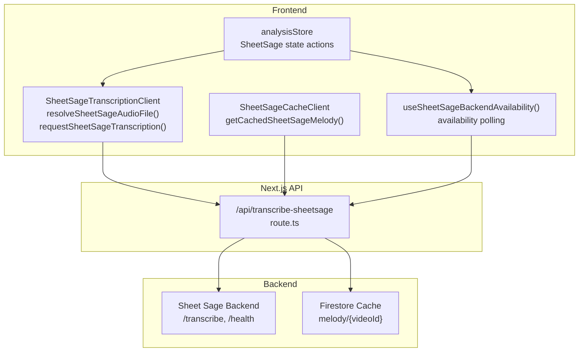
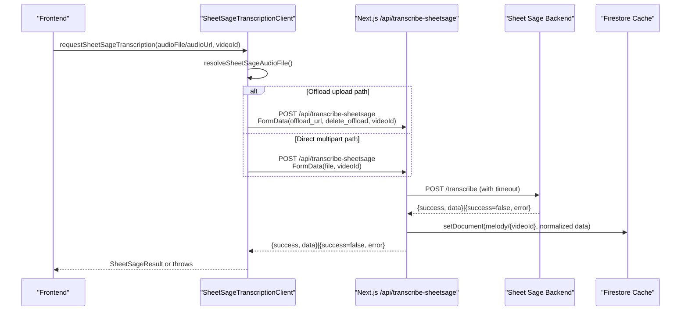
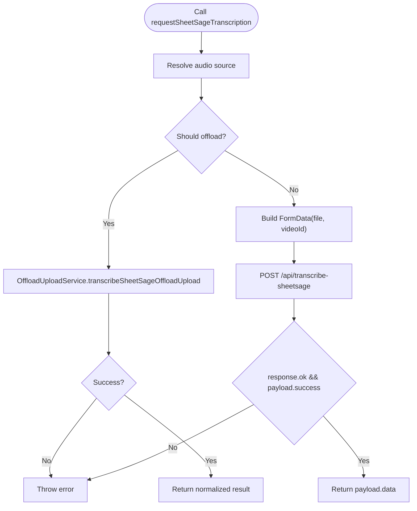
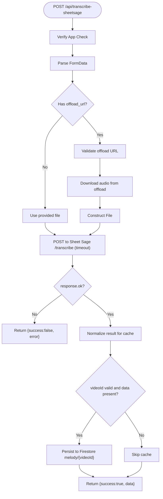
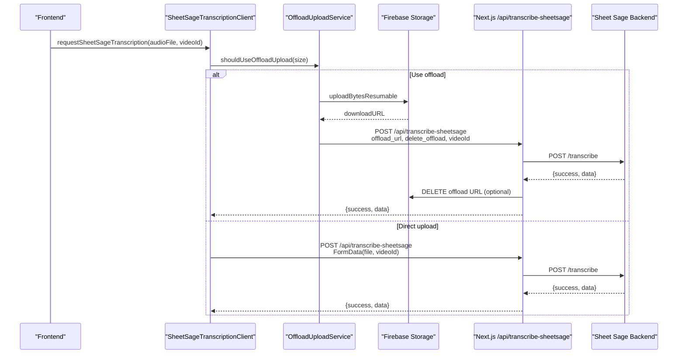
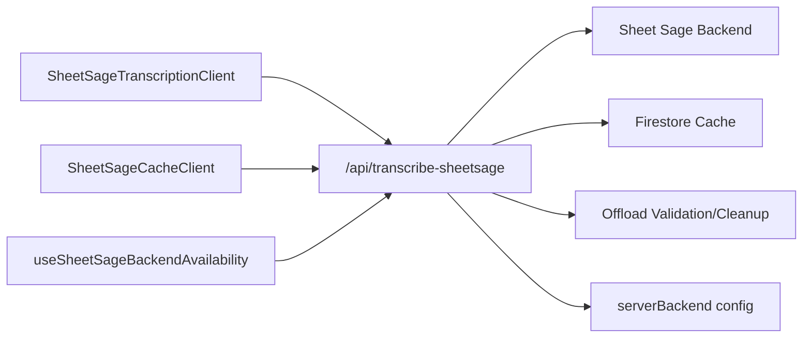

# API Integration

<cite>
**Referenced Files in This Document**
- [route.ts](file://src/app/api/transcribe-sheetsage/route.ts)
- [sheetSageTranscriptionClient.ts](file://src/services/sheetsage/sheetSageTranscriptionClient.ts)
- [sheetSageCacheClient.ts](file://src/services/sheetsage/sheetSageCacheClient.ts)
- [useSheetSageBackendAvailability.ts](file://src/hooks/sheetsage/useSheetSageBackendAvailability.ts)
- [sheetSage.ts](file://src/types/sheetSage.ts)
- [offloadUploadService.ts](file://src/services/storage/offloadUploadService.ts)
- [offloadValidation.ts](file://src/utils/offloadValidation.ts)
- [offloadCleanupService.ts](file://src/services/storage/offloadCleanupService.ts)
- [analysisStore.ts](file://src/stores/analysisStore.ts)
- [serverBackend.ts](file://src/config/serverBackend.ts)
</cite>

## Table of Contents
1. [Introduction](#introduction)
2. [Project Structure](#project-structure)
3. [Core Components](#core-components)
4. [Architecture Overview](#architecture-overview)
5. [Detailed Component Analysis](#detailed-component-analysis)
6. [Dependency Analysis](#dependency-analysis)
7. [Performance Considerations](#performance-considerations)
8. [Troubleshooting Guide](#troubleshooting-guide)
9. [Conclusion](#conclusion)

## Introduction
This document explains the Sheet Sage API integration within ChordMiniApp. It covers the SheetsageTranscriptionClient service, the POST /api/transcribe-sheetsage endpoint with multipart/form-data support for audio uploads, the SheetSageCacheClient for caching and retrieval, and the frontend availability hook. It also documents the request/response format, including the noteEvents array structure, cache normalization, and the end-to-end workflow from audio upload to transcription completion. Practical examples, error handling, rate limiting, timeouts, and performance optimization strategies for large audio files are included.

## Project Structure
The Sheet Sage integration spans three layers:
- Frontend client services: transcription and caching clients
- Next.js API route: request proxy and response forwarding
- Backend Sheet Sage service: inference engine and health checks

**Diagram sources**
- [route.ts:132-209](file://src/app/api/transcribe-sheetsage/route.ts#L132-L209)
- [sheetSageTranscriptionClient.ts:41-78](file://src/services/sheetsage/sheetSageTranscriptionClient.ts#L41-L78)
- [sheetSageCacheClient.ts:3-17](file://src/services/sheetsage/sheetSageCacheClient.ts#L3-L17)
- [useSheetSageBackendAvailability.ts:4-58](file://src/hooks/sheetsage/useSheetSageBackendAvailability.ts#L4-L58)
- [analysisStore.ts:45-98](file://src/stores/analysisStore.ts#L45-L98)

**Section sources**
- [route.ts:132-209](file://src/app/api/transcribe-sheetsage/route.ts#L132-L209)
- [sheetSageTranscriptionClient.ts:41-78](file://src/services/sheetsage/sheetSageTranscriptionClient.ts#L41-L78)
- [sheetSageCacheClient.ts:3-17](file://src/services/sheetsage/sheetSageCacheClient.ts#L3-L17)
- [useSheetSageBackendAvailability.ts:4-58](file://src/hooks/sheetsage/useSheetSageBackendAvailability.ts#L4-L58)
- [analysisStore.ts:45-98](file://src/stores/analysisStore.ts#L45-L98)

## Core Components
- SheetsageTranscriptionClient: resolves audio source, builds multipart/form-data, and posts to the Next.js API route. It supports direct uploads and offloaded uploads via Firebase.
- SheetSageCacheClient: retrieves cached melody transcription for a given videoId.
- useSheetSageBackendAvailability: polls the Next.js API health endpoint to determine backend availability and errors.
- Next.js API route: validates App Check, extracts audio from form data, forwards to Sheet Sage backend, caches normalized results, and handles timeouts and errors.
- Types: SheetSageNoteEvent and SheetSageResult define the response schema.

**Section sources**
- [sheetSageTranscriptionClient.ts:41-78](file://src/services/sheetsage/sheetSageTranscriptionClient.ts#L41-L78)
- [sheetSageCacheClient.ts:3-17](file://src/services/sheetsage/sheetSageCacheClient.ts#L3-L17)
- [useSheetSageBackendAvailability.ts:4-58](file://src/hooks/sheetsage/useSheetSageBackendAvailability.ts#L4-L58)
- [route.ts:132-209](file://src/app/api/transcribe-sheetsage/route.ts#L132-L209)
- [sheetSage.ts:1-19](file://src/types/sheetSage.ts#L1-L19)

## Architecture Overview
The integration uses a proxy pattern: the frontend sends audio to the Next.js route, which validates requests, optionally offloads large files, forwards to the Sheet Sage backend, normalizes and caches results, and returns structured JSON to the client.

**Diagram sources**
- [sheetSageTranscriptionClient.ts:41-78](file://src/services/sheetsage/sheetSageTranscriptionClient.ts#L41-L78)
- [route.ts:132-209](file://src/app/api/transcribe-sheetsage/route.ts#L132-L209)
- [offloadUploadService.ts:323-352](file://src/services/storage/offloadUploadService.ts#L323-L352)

## Detailed Component Analysis

### SheetsageTranscriptionClient
Responsibilities:
- Resolve audio source from File or external URL.
- Build multipart/form-data and send to the Next.js API route.
- Support offload upload path for large files and return normalized results.
- Propagate errors with meaningful messages.

Key behaviors:
- Audio resolution: accepts File or external audio URL; downloads blob and constructs a File.
- Offload path: delegates to OffloadUploadService when appropriate; passes videoId for caching.
- Direct multipart: appends file and optional videoId to FormData and posts to /api/transcribe-sheetsage.
- Error handling: throws descriptive errors when response indicates failure.

**Diagram sources**
- [sheetSageTranscriptionClient.ts:41-78](file://src/services/sheetsage/sheetSageTranscriptionClient.ts#L41-L78)
- [offloadUploadService.ts:323-352](file://src/services/storage/offloadUploadService.ts#L323-L352)

**Section sources**
- [sheetSageTranscriptionClient.ts:41-78](file://src/services/sheetsage/sheetSageTranscriptionClient.ts#L41-L78)

### SheetSageCacheClient
Responsibilities:
- Retrieve cached melody transcription for a given videoId via GET /api/melody-cache.
- Normalize and return the cached SheetSageResult or null if not found.

Behavior:
- Sends GET request with videoId query parameter.
- Parses JSON and returns cached data if present; otherwise returns null.
- Throws on non-2xx responses.

**Section sources**
- [sheetSageCacheClient.ts:3-17](file://src/services/sheetsage/sheetSageCacheClient.ts#L3-L17)

### useSheetSageBackendAvailability Hook
Responsibilities:
- Poll backend health endpoint to determine availability.
- Update store state for availability, checking flag, and error message.
- Cancel ongoing requests on unmount.

Behavior:
- On enable, sets checking flag, clears previous error, and fetches /api/transcribe-sheetsage?health=1.
- Sets availability and error based on payload; handles network and timeout errors.

**Section sources**
- [useSheetSageBackendAvailability.ts:4-58](file://src/hooks/sheetsage/useSheetSageBackendAvailability.ts#L4-L58)
- [analysisStore.ts:265-291](file://src/stores/analysisStore.ts#L265-L291)

### Next.js API Route: POST /api/transcribe-sheetsage
Responsibilities:
- Validate App Check token.
- Extract audio from FormData or offload URL.
- Forward to Sheet Sage backend with a safe timeout.
- Normalize and cache results in Firestore.
- Return standardized JSON responses.

Key logic:
- App Check verification.
- Audio resolution: supports direct file or offload URL with validation and optional deletion.
- Timeout: uses a configurable proxy timeout for backend requests.
- Caching: normalizes noteEvents and metadata, then persists to Firestore under melody/{videoId}.
- Error mapping: translates fetch failures and timeouts into user-friendly messages.

**Diagram sources**
- [route.ts:132-209](file://src/app/api/transcribe-sheetsage/route.ts#L132-L209)

**Section sources**
- [route.ts:132-209](file://src/app/api/transcribe-sheetsage/route.ts#L132-L209)

### Request/Response Format
- Endpoint: POST /api/transcribe-sheetsage
- Content-Type: multipart/form-data
- Fields:
  - file: audio file (direct upload)
  - offload_url: signed Firebase Storage URL (offload path)
  - delete_offload: "0"/"false"/"no" to skip deletion after processing
  - videoId: optional YouTube video identifier for caching
- Response:
  - success: boolean
  - data: SheetSageResult
  - error: string (when success is false)

SheetSageResult fields:
- source: string
- sourceName?: string | null
- noteEvents: array of SheetSageNoteEvent
- noteEventCount: number
- beatTimes: number[]
- beatsPerMeasure: number
- tempoBpm: number
- processingTime?: number
- usedJukebox: boolean

SheetSageNoteEvent fields:
- onset: number (seconds)
- offset: number (seconds)
- pitch: number (MIDI note number)
- velocity: number (MIDI velocity)

Note: The API route normalizes noteEvents and metadata before caching.

**Section sources**
- [sheetSage.ts:1-19](file://src/types/sheetSage.ts#L1-L19)
- [route.ts:84-130](file://src/app/api/transcribe-sheetsage/route.ts#L84-L130)

### Cache Management
- Retrieval: GET /api/melody-cache?videoId={id} returns cached SheetSageResult or null.
- Persistence: On successful transcription with a valid videoId, the API route normalizes and persists the result to Firestore under melody/{videoId}.
- Normalization: Filters and sorts noteEvents, clamps pitch and velocity to MIDI range, ensures positive offsets, and sets derived fields.

**Section sources**
- [sheetSageCacheClient.ts:3-17](file://src/services/sheetsage/sheetSageCacheClient.ts#L3-L17)
- [route.ts:180-188](file://src/app/api/transcribe-sheetsage/route.ts#L180-L188)
- [route.ts:84-130](file://src/app/api/transcribe-sheetsage/route.ts#L84-L130)

### Offload Upload Pipeline
- Decision: OffloadUploadService.shouldUseOffloadUpload determines when to offload based on environment and configuration.
- Upload: Uploads File to Firebase Storage and returns a download URL.
- Processing: Posts the offload URL to the Next.js route; deletes the offload file after processing if requested.
- Progress: Provides callbacks for upload and total processing time.

**Diagram sources**
- [offloadUploadService.ts:323-352](file://src/services/storage/offloadUploadService.ts#L323-L352)
- [offloadValidation.ts:32-56](file://src/utils/offloadValidation.ts#L32-L56)
- [offloadCleanupService.ts:147-160](file://src/services/storage/offloadCleanupService.ts#L147-L160)
- [route.ts:44-82](file://src/app/api/transcribe-sheetsage/route.ts#L44-L82)

**Section sources**
- [offloadUploadService.ts:53-73](file://src/services/storage/offloadUploadService.ts#L53-L73)
- [offloadUploadService.ts:323-352](file://src/services/storage/offloadUploadService.ts#L323-L352)
- [offloadValidation.ts:32-56](file://src/utils/offloadValidation.ts#L32-L56)
- [offloadCleanupService.ts:147-160](file://src/services/storage/offloadCleanupService.ts#L147-L160)

### Frontend Integration and Store
- Store fields: sheetSageResult, isComputingSheetSage, sheetSageError, isCheckingSheetSageBackend, isSheetSageBackendAvailable, sheetSageBackendError.
- Actions: setters and clearSheetSage for managing Sheet Sage state.
- Hook: useSheetSageBackendAvailability updates availability and error messages.

**Section sources**
- [analysisStore.ts:45-98](file://src/stores/analysisStore.ts#L45-L98)
- [analysisStore.ts:357-366](file://src/stores/analysisStore.ts#L357-L366)
- [useSheetSageBackendAvailability.ts:4-58](file://src/hooks/sheetsage/useSheetSageBackendAvailability.ts#L4-L58)

## Dependency Analysis
- Frontend clients depend on Next.js API route for orchestration and on Firebase for offload storage when applicable.
- Next.js route depends on:
  - App Check verification
  - Offload validation and cleanup
  - Sheet Sage backend URL resolution
  - Firestore for caching
- Backend Sheet Sage service is invoked via a proxied POST with a timeout.

**Diagram sources**
- [sheetSageTranscriptionClient.ts:41-78](file://src/services/sheetsage/sheetSageTranscriptionClient.ts#L41-L78)
- [sheetSageCacheClient.ts:3-17](file://src/services/sheetsage/sheetSageCacheClient.ts#L3-L17)
- [useSheetSageBackendAvailability.ts:4-58](file://src/hooks/sheetsage/useSheetSageBackendAvailability.ts#L4-L58)
- [route.ts:132-209](file://src/app/api/transcribe-sheetsage/route.ts#L132-L209)
- [offloadValidation.ts:32-56](file://src/utils/offloadValidation.ts#L32-L56)
- [offloadCleanupService.ts:147-160](file://src/services/storage/offloadCleanupService.ts#L147-L160)
- [serverBackend.ts:43-47](file://src/config/serverBackend.ts#L43-L47)

**Section sources**
- [route.ts:132-209](file://src/app/api/transcribe-sheetsage/route.ts#L132-L209)
- [offloadValidation.ts:32-56](file://src/utils/offloadValidation.ts#L32-L56)
- [offloadCleanupService.ts:147-160](file://src/services/storage/offloadCleanupService.ts#L147-L160)
- [serverBackend.ts:43-47](file://src/config/serverBackend.ts#L43-L47)

## Performance Considerations
- Large audio files:
  - Offload upload is automatically used in production environments when Firebase is configured.
  - The offload pipeline reduces serverless request size limits and improves reliability.
- Timeouts:
  - Proxy timeout is configurable via SHEETSAGE_BACKEND_TIMEOUT_MS with a default of 10 minutes.
  - Health checks use a shorter timeout for readiness checks.
- Caching:
  - Normalized results are persisted to Firestore for reuse; retrieval uses a dedicated endpoint.
- Network resilience:
  - Offload deletion is best-effort; failures are logged but do not block the main flow.
- UI responsiveness:
  - Availability polling uses cache-control and cancellation to avoid redundant work.

[No sources needed since this section provides general guidance]

## Troubleshooting Guide
Common issues and resolutions:
- Backend unreachable:
  - The API maps network failures to a user-friendly message and returns 500.
- Timeout exceeded:
  - The API detects aborted/timeout messages and suggests increasing the proxy timeout or using shorter audio segments.
- Missing upstream assets:
  - Health endpoint normalizes messages mentioning missing upstream assets; the API route surfaces a tailored message.
- Offload URL validation:
  - Invalid or unauthorized offload URLs are rejected early with descriptive errors.
- Cache retrieval failures:
  - Non-2xx responses during cache retrieval throw errors; verify videoId and backend connectivity.

**Section sources**
- [route.ts:191-208](file://src/app/api/transcribe-sheetsage/route.ts#L191-L208)
- [route.ts:211-258](file://src/app/api/transcribe-sheetsage/route.ts#L211-L258)
- [offloadValidation.ts:32-56](file://src/utils/offloadValidation.ts#L32-L56)
- [sheetSageCacheClient.ts:11-14](file://src/services/sheetsage/sheetSageCacheClient.ts#L11-L14)

## Conclusion
The Sheet Sage integration in ChordMiniApp provides a robust, scalable pipeline for melodic transcription. The frontend clients handle audio resolution and offload uploads, the Next.js API route enforces security, manages timeouts, and caches normalized results, and the backend Sheet Sage service performs inference. The availability hook and store state enable responsive UI feedback, while offload validation and cleanup ensure reliable processing for large files.