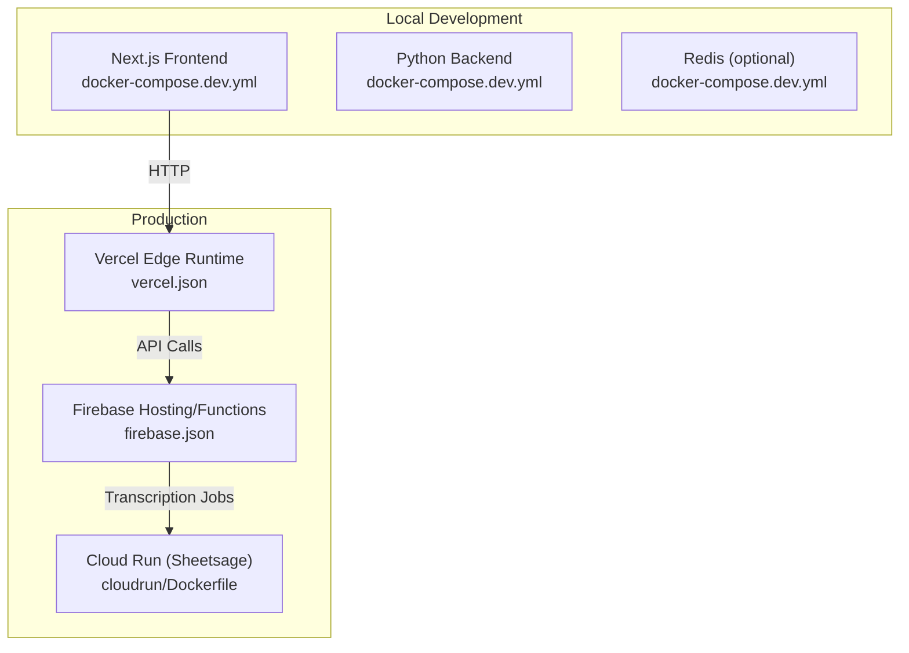
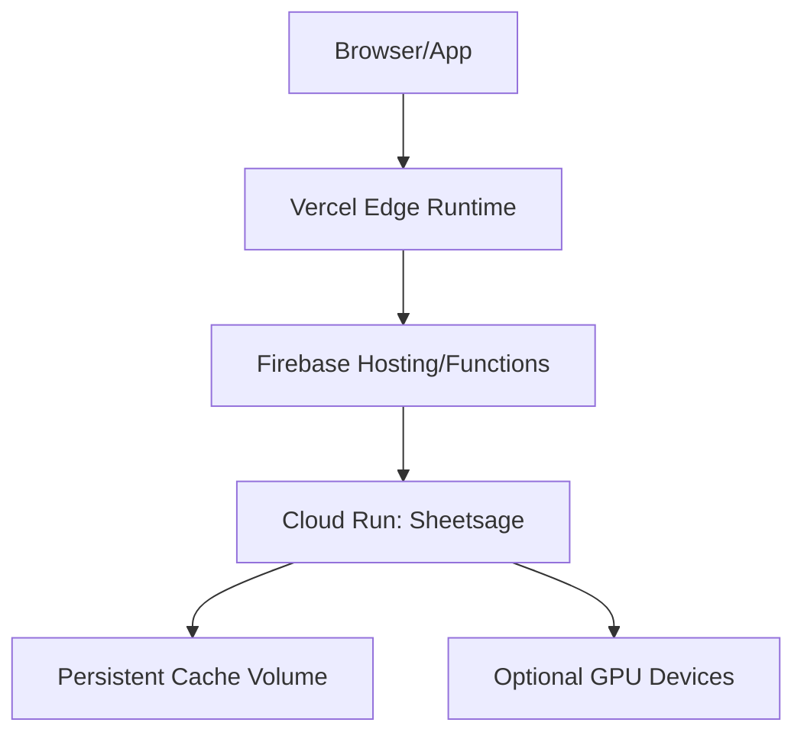
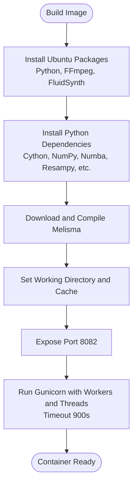
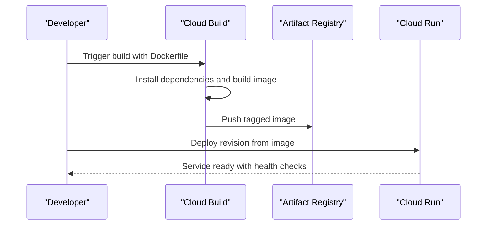
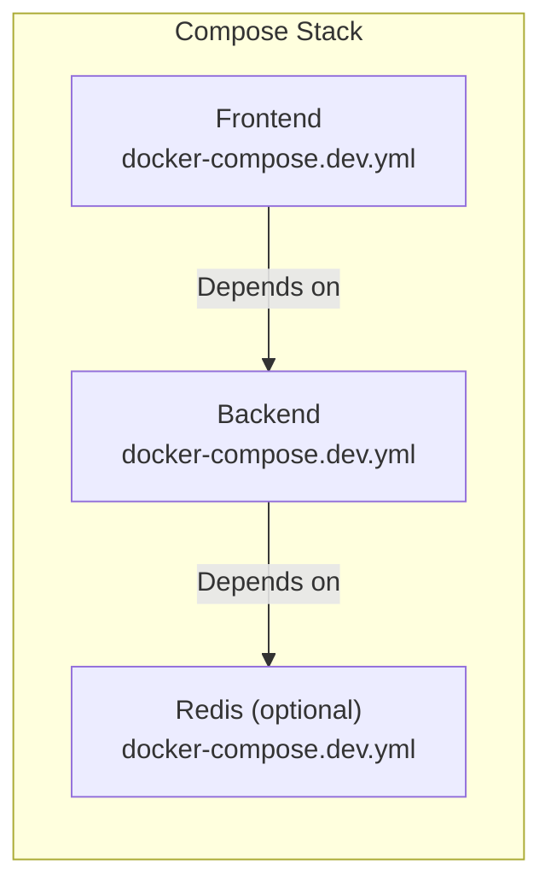
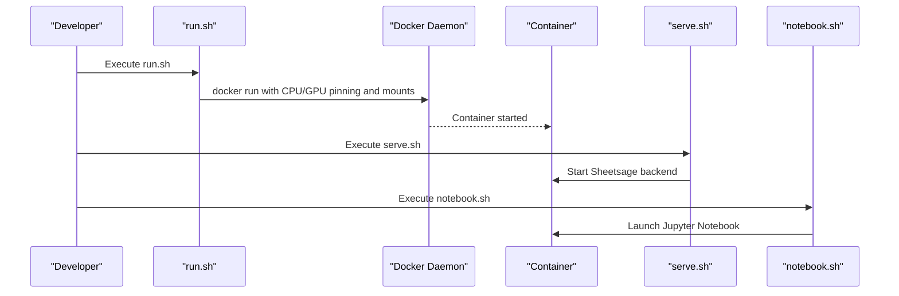
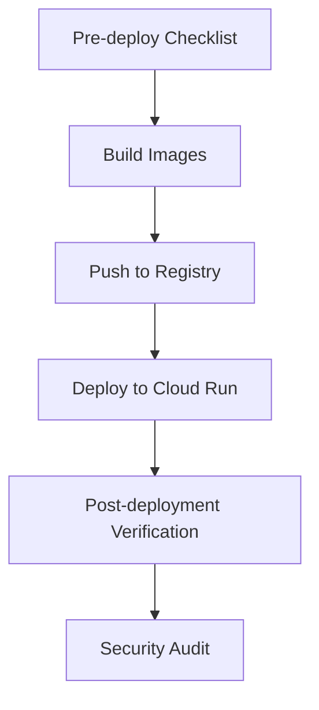
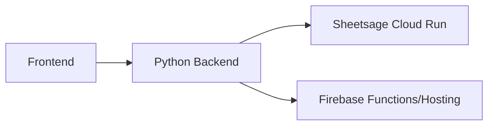

# Deployment Configuration

<cite>
**Referenced Files in This Document**
- [docker-compose.yml](file://docker/docker-compose.yml)
- [docker-compose.dev.yml](file://docker/docker-compose.dev.yml)
- [Dockerfile](file://sheetsage/Dockerfile)
- [cloudrun/Dockerfile](file://sheetsage/src/sheetsage_upstream/cloudrun/Dockerfile)
- [build.sh](file://sheetsage/src/sheetsage_upstream/cloudrun/build.sh)
- [release.sh](file://sheetsage/src/sheetsage_upstream/docker/release.sh)
- [build.sh](file://sheetsage/src/sheetsage_upstream/docker/build.sh)
- [run.sh](file://sheetsage/src/sheetsage_upstream/docker/run.sh)
- [serve.sh](file://sheetsage/src/sheetsage_upstream/docker/serve.sh)
- [notebook.sh](file://sheetsage/src/sheetsage_upstream/docker/notebook.sh)
- [python_backend/Dockerfile](file://python_backend/Dockerfile)
- [python_backend/app.py](file://python_backend/app.py)
- [python_backend/app_factory.py](file://python_backend/app_factory.py)
- [python_backend/config.py](file://python_backend/config.py)
- [python_backend/error_handlers.py](file://python_backend/error_handlers.py)
- [python_backend/extensions.py](file://python_backend/extensions.py)
- [python_backend/requirements.txt](file://python_backend/requirements.txt)
- [next.config.js](file://next.config.js)
- [vercel.json](file://vercel.json)
- [firebase.json](file://firebase/firebase.json)
- [docker-compose.prod.yml](file://docker-compose.prod.yml)
- [scripts/build-and-push.sh](file://scripts/build-and-push.sh)
- [scripts/publish-docker-images.sh](file://scripts/publish-docker-images.sh)
- [scripts/post-deployment-verification.sh](file://scripts/post-deployment-verification.sh)
- [scripts/pre-deployment-checklist.sh](file://scripts/pre-deployment-checklist.sh)
- [scripts/security-check.sh](file://scripts/security-check.sh)
</cite>

## Table of Contents
1. [Introduction](#introduction)
2. [Project Structure](#project-structure)
3. [Core Components](#core-components)
4. [Architecture Overview](#architecture-overview)
5. [Detailed Component Analysis](#detailed-component-analysis)
6. [Dependency Analysis](#dependency-analysis)
7. [Performance Considerations](#performance-considerations)
8. [Troubleshooting Guide](#troubleshooting-guide)
9. [Conclusion](#conclusion)
10. [Appendices](#appendices)

## Introduction
This document provides comprehensive deployment guidance for the Sheet Sage melody transcription service. It covers Docker configuration (including multi-stage builds), environment variables, resource allocation, Cloud Run deployment strategy, local development with docker-compose, build and release automation, production topology, security considerations, and operational troubleshooting.

## Project Structure
The deployment spans three primary layers:
- Frontend: Next.js application configured for production and development environments.
- Backend: Python Flask microservice hosting ML inference endpoints.
- Sheetsage service: Specialized transcription service packaged in a dedicated Docker image.

**Diagram sources**
- [docker-compose.dev.yml:1-116](file://docker/docker-compose.dev.yml#L1-L116)
- [vercel.json](file://vercel.json)
- [firebase.json](file://firebase/firebase.json)
- [cloudrun/Dockerfile:1-100](file://sheetsage/src/sheetsage_upstream/cloudrun/Dockerfile#L1-L100)

**Section sources**
- [docker-compose.yml:1-115](file://docker/docker-compose.yml#L1-L115)
- [docker-compose.dev.yml:1-116](file://docker/docker-compose.dev.yml#L1-L116)
- [vercel.json](file://vercel.json)
- [firebase.json](file://firebase/firebase.json)

## Core Components
- Sheetsage transcription service container:
  - Base image: Ubuntu 18.04 with Python 3, FFmpeg, FluidSynth, and system tools.
  - Installs Python dependencies and builds Melisma key extraction utility.
  - Exposes port 8082 and runs via Gunicorn with configurable workers and threads.
  - Environment variables include port, cache directory, and preloading flags.

- Python backend container:
  - Multi-stage build Dockerfile defines builder and runtime stages.
  - Production runtime exposes port 8080 and sets Flask-specific environment variables.
  - Upload timeout and content length limits configured for large audio uploads.

- Frontend container:
  - Built from the repository root Dockerfile targeting the “runner” stage for production.
  - Health checks probe the Next.js health endpoint.

**Section sources**
- [Dockerfile:1-55](file://sheetsage/Dockerfile#L1-L55)
- [cloudrun/Dockerfile:1-100](file://sheetsage/src/sheetsage_upstream/cloudrun/Dockerfile#L1-L100)
- [python_backend/Dockerfile](file://python_backend/Dockerfile)
- [docker-compose.dev.yml:36-81](file://docker/docker-compose.dev.yml#L36-L81)

## Architecture Overview
The production deployment integrates:
- Vercel Edge Runtime for frontend routing and API exposure.
- Firebase Hosting/Functions for static assets and serverless functions.
- Cloud Run for the Sheetsage transcription service with persistent caching and GPU scheduling support in local scripts.

**Diagram sources**
- [vercel.json](file://vercel.json)
- [firebase.json](file://firebase/firebase.json)
- [cloudrun/Dockerfile:1-100](file://sheetsage/src/sheetsage_upstream/cloudrun/Dockerfile#L1-L100)

## Detailed Component Analysis

### Sheetsage Container Configuration
- Base OS and tools: Ubuntu 18.04 with Python 3, FFmpeg, FluidSynth, and build essentials.
- Dependencies: Includes specific versions for Cython, NumPy, Numba, Resampy, SciPy, and others.
- Build-time assets: Downloads and compiles Melisma key extraction tool from CMU.
- Runtime: Exposes port 8082; runs Gunicorn with 1 worker and 4 threads; timeout set to 900 seconds.
- Environment variables: PORT, SHEETSAGE_PRELOAD, SHEETSAGE_CACHE_DIR.

**Diagram sources**
- [Dockerfile:1-55](file://sheetsage/Dockerfile#L1-L55)

**Section sources**
- [Dockerfile:1-55](file://sheetsage/Dockerfile#L1-L55)

### Cloud Run Deployment (Sheetsage)
- Multi-stage build Dockerfile tailored for Cloud Run:
  - Installs Python, FFmpeg, Jukebox, pretty_midi, madmom, and other ML libraries.
  - Creates work directory and cache; installs the sheetsage library in editable mode.
  - Entrypoint starts the Sheetsage backend server on the configured port.
- Build script copies the Cloud Run Dockerfile into the repo root, submits a build to Google Cloud, and tags the resulting image.
- Release script builds a release image and pushes it to the registry.

**Diagram sources**
- [cloudrun/Dockerfile:1-100](file://sheetsage/src/sheetsage_upstream/cloudrun/Dockerfile#L1-L100)
- [build.sh:1-9](file://sheetsage/src/sheetsage_upstream/cloudrun/build.sh#L1-L9)

**Section sources**
- [cloudrun/Dockerfile:1-100](file://sheetsage/src/sheetsage_upstream/cloudrun/Dockerfile#L1-L100)
- [build.sh:1-9](file://sheetsage/src/sheetsage_upstream/cloudrun/build.sh#L1-L9)
- [release.sh:1-7](file://sheetsage/src/sheetsage_upstream/docker/release.sh#L1-L7)

### Local Development with docker-compose
- Development stack includes:
  - Frontend service built from the root Dockerfile with “runner” target.
  - Backend service built from python_backend/Dockerfile with “runtime” target.
  - Optional Redis for rate limiting and caching.
- Health checks:
  - Frontend probes http://localhost:3000/api/health.
  - Backend probes http://localhost:8080/health.
- Environment variables:
  - Frontend: NODE_ENV, NEXT_PUBLIC_* Firebase keys, PUBLIC API keys, PYTHON_API_URL, SONGFORMER_API_URL, secrets.
  - Backend: Flask environment, model selection flags, upload limits, Redis URL.

**Diagram sources**
- [docker-compose.dev.yml:1-116](file://docker/docker-compose.dev.yml#L1-L116)

**Section sources**
- [docker-compose.dev.yml:1-116](file://docker/docker-compose.dev.yml#L1-L116)

### Local Scripts for Interactive Development (Sheetsage)
- run.sh: Detects host CPU/GPU affinity and runs the container with pinned CPUs/GPUs, IPC sharing, and mounted volumes for cache, notebooks, and credentials.
- serve.sh: Executes the Sheetsage backend main module inside the running container.
- notebook.sh: Starts a Jupyter notebook server inside the container for interactive experimentation.

**Diagram sources**
- [run.sh:1-33](file://sheetsage/src/sheetsage_upstream/docker/run.sh#L1-L33)
- [serve.sh:1-4](file://sheetsage/src/sheetsage_upstream/docker/serve.sh#L1-L4)
- [notebook.sh:1-12](file://sheetsage/src/sheetsage_upstream/docker/notebook.sh#L1-L12)

**Section sources**
- [run.sh:1-33](file://sheetsage/src/sheetsage_upstream/docker/run.sh#L1-L33)
- [serve.sh:1-4](file://sheetsage/src/sheetsage_upstream/docker/serve.sh#L1-L4)
- [notebook.sh:1-12](file://sheetsage/src/sheetsage_upstream/docker/notebook.sh#L1-L12)

### Build and Release Automation
- Cloud Run build script:
  - Copies the Cloud Run Dockerfile into the repo root, submits a build to Google Cloud Build, and tags the image.
- Sheetsage release script:
  - Builds a release image using the release Dockerfile and pushes it to the registry.
- Additional automation scripts:
  - build-and-push.sh and publish-docker-images.sh for CI-friendly image publishing.
  - post-deployment-verification.sh and pre-deployment-checklist.sh for operational safety.
  - security-check.sh for vulnerability scanning.

**Diagram sources**
- [build.sh:1-9](file://sheetsage/src/sheetsage_upstream/cloudrun/build.sh#L1-L9)
- [release.sh:1-7](file://sheetsage/src/sheetsage_upstream/docker/release.sh#L1-L7)
- [scripts/build-and-push.sh](file://scripts/build-and-push.sh)
- [scripts/publish-docker-images.sh](file://scripts/publish-docker-images.sh)
- [scripts/post-deployment-verification.sh](file://scripts/post-deployment-verification.sh)
- [scripts/pre-deployment-checklist.sh](file://scripts/pre-deployment-checklist.sh)
- [scripts/security-check.sh](file://scripts/security-check.sh)

**Section sources**
- [build.sh:1-9](file://sheetsage/src/sheetsage_upstream/cloudrun/build.sh#L1-L9)
- [release.sh:1-7](file://sheetsage/src/sheetsage_upstream/docker/release.sh#L1-L7)
- [scripts/build-and-push.sh](file://scripts/build-and-push.sh)
- [scripts/publish-docker-images.sh](file://scripts/publish-docker-images.sh)
- [scripts/post-deployment-verification.sh](file://scripts/post-deployment-verification.sh)
- [scripts/pre-deployment-checklist.sh](file://scripts/pre-deployment-checklist.sh)
- [scripts/security-check.sh](file://scripts/security-check.sh)

## Dependency Analysis
- Frontend-to-Backend:
  - Frontend communicates with the Python backend via environment-configured URLs (PYTHON_API_URL, SONGFORMER_API_URL).
- Backend-to-Sheetsage:
  - Python backend orchestrates transcription jobs that route to the Sheetsage Cloud Run service.
- External Services:
  - Firebase Hosting/Functions for static assets and serverless functions.
  - Vercel Edge Runtime for routing and API exposure.

**Diagram sources**
- [docker-compose.dev.yml:16-49](file://docker/docker-compose.dev.yml#L16-L49)
- [vercel.json](file://vercel.json)
- [firebase.json](file://firebase/firebase.json)

**Section sources**
- [docker-compose.dev.yml:16-49](file://docker/docker-compose.dev.yml#L16-L49)
- [vercel.json](file://vercel.json)
- [firebase.json](file://firebase/firebase.json)

## Performance Considerations
- Resource allocation:
  - Sheetsage container exposes port 8082 and runs with 1 worker and 4 threads; timeout configured to 900 seconds.
  - Backend container sets upload timeout to 600 seconds and content length limit suitable for large audio files.
- Scaling:
  - Cloud Run supports automatic scaling; configure concurrency and max instances per revision based on workload.
- Caching:
  - Persistent cache volume for Sheetsage reduces cold-start latency and recomputation overhead.
- GPU scheduling:
  - Local run.sh demonstrates GPU pinning and CPU pinning for deterministic performance.

**Section sources**
- [Dockerfile:52-55](file://sheetsage/Dockerfile#L52-L55)
- [docker-compose.dev.yml:55-55](file://docker/docker-compose.dev.yml#L55-L55)
- [docker-compose.yml:76-76](file://docker/docker-compose.yml#L76-L76)
- [run.sh:9-12](file://sheetsage/src/sheetsage_upstream/docker/run.sh#L9-L12)

## Troubleshooting Guide
- Health check failures:
  - Verify health endpoints for frontend and backend using the compose health checks.
- Upload timeouts:
  - Increase upload timeout and content length limits in the backend environment if processing long audio files.
- Model cache issues:
  - Ensure the backend cache volume is mounted and writable.
- GPU availability:
  - Confirm GPU visibility and proper device pinning in local run.sh.
- Post-deployment verification:
  - Use the post-deployment verification script to validate service readiness after updates.

**Section sources**
- [docker-compose.dev.yml:29-34](file://docker/docker-compose.dev.yml#L29-L34)
- [docker-compose.dev.yml:75-80](file://docker/docker-compose.dev.yml#L75-L80)
- [docker-compose.yml:55-60](file://docker/docker-compose.yml#L55-L60)
- [docker-compose.yml:85-90](file://docker/docker-compose.yml#L85-L90)
- [scripts/post-deployment-verification.sh](file://scripts/post-deployment-verification.sh)

## Conclusion
This deployment guide consolidates Docker configurations, Cloud Run packaging, local development workflows, and production topology for the Sheet Sage transcription service. By leveraging the provided scripts and compose files, teams can reliably build, test, and operate the service with appropriate health checks, timeouts, and caching strategies.

## Appendices

### Environment Variables Reference
- Frontend (compose):
  - NODE_ENV, NEXT_PUBLIC_* Firebase keys, NEXT_PUBLIC_YOUTUBE_API_KEY, NEXT_PUBLIC_BASE_URL, NEXT_PUBLIC_AUDIO_STRATEGY, NEXT_PUBLIC_ENABLE_TRUE_STREAMING, NEXT_DISABLE_DEV_OVERLAY, PYTHON_API_URL, SONGFORMER_API_URL, MUSIC_AI_API_KEY, GEMINI_API_KEY, GENIUS_API_KEY, USE_MOCK_MUSIC_AI, USE_FIREBASE_EMULATOR.
- Backend (compose):
  - FLASK_ENV, FLASK_DEBUG, PYTHONUNBUFFERED, PYTHONDONTWRITEBYTECODE, DEFAULT_BEAT_MODEL, DEFAULT_CHORD_MODEL, MAX_CONTENT_LENGTH, UPLOAD_TIMEOUT, REDIS_URL, USE_BEAT_TRANSFORMER, USE_CHORD_CNN_LSTM, USE_BTC_SL, USE_BTC_PL.
- Sheetsage (container):
  - PORT, SHEETSAGE_PRELOAD, SHEETSAGE_CACHE_DIR.

**Section sources**
- [docker-compose.dev.yml:16-62](file://docker/docker-compose.dev.yml#L16-L62)
- [docker-compose.yml:17-49](file://docker/docker-compose.yml#L17-L49)
- [Dockerfile:3-10](file://sheetsage/Dockerfile#L3-L10)

### Production Topology Notes
- Load balancing:
  - Cloud Run handles global load balancing; configure regional endpoints and traffic splitting as needed.
- Monitoring and logging:
  - Enable Cloud Run metrics and Cloud Logging; integrate with Vercel and Firebase monitoring dashboards.
- Security:
  - Enforce HTTPS, restrict API keys, and apply least-privilege access to Cloud Run and Firebase resources.

[No sources needed since this section provides general guidance]