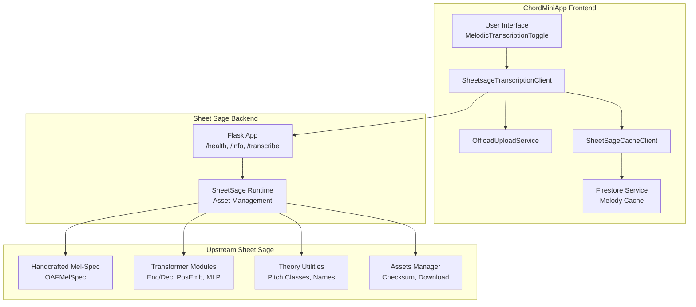
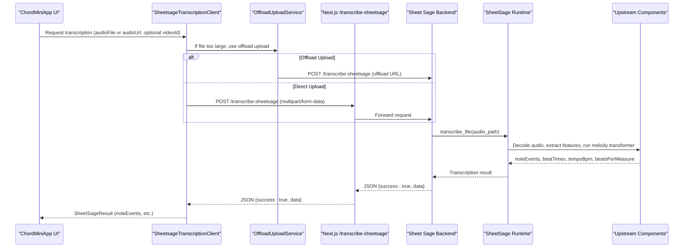
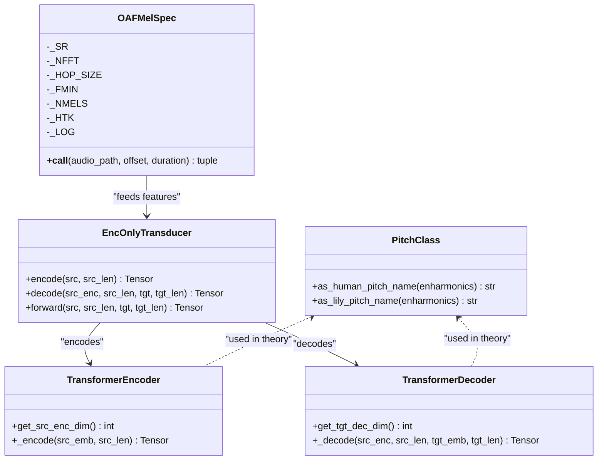
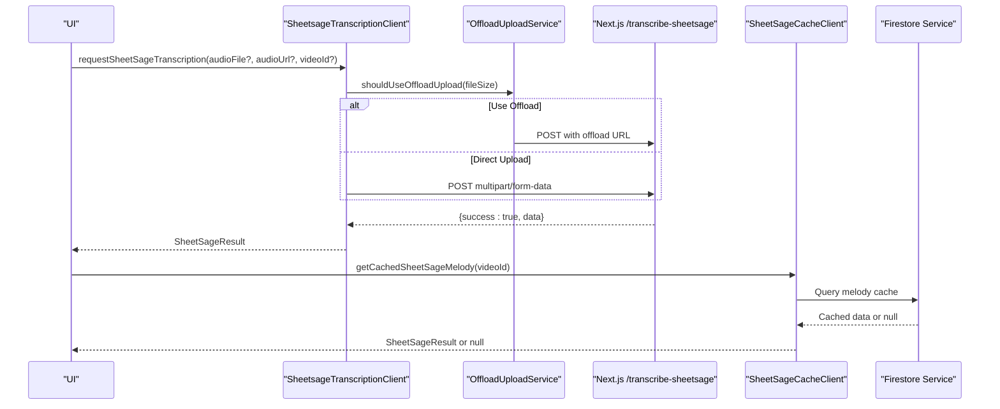
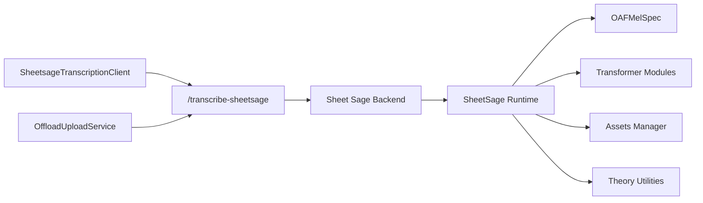

# Melody Transcription

<cite>
**Referenced Files in This Document**
- [README.md](file://sheetsage/README.md)
- [app.py](file://sheetsage/app.py)
- [service.py](file://sheetsage/service.py)
- [sheetSageTranscriptionClient.ts](file://src/services/sheetsage/sheetSageTranscriptionClient.ts)
- [sheetSageCacheClient.ts](file://src/services/sheetsage/sheetSageCacheClient.ts)
- [offloadUploadService.ts](file://src/services/storage/offloadUploadService.ts)
- [handcrafted.py](file://sheetsage/src/sheetsage_upstream/sheetsage/representations/handcrafted.py)
- [jukebox.py](file://sheetsage/src/sheetsage_upstream/sheetsage/representations/jukebox.py)
- [modules.py](file://sheetsage/src/sheetsage_upstream/sheetsage/modules/modules.py)
- [assets.py](file://sheetsage/src/sheetsage_upstream/sheetsage/assets.py)
- [basic.py](file://sheetsage/src/sheetsage_upstream/sheetsage/theory/basic.py)
- [firestoreService.ts](file://src/services/firebase/firestoreService.ts)
- [docker-compose.yml](file://docker/docker-compose.yml)
- [docker-compose.dev.yml](file://docker/docker-compose.dev.yml)
- [Dockerfile](file://Dockerfile)
</cite>

## Table of Contents
1. [Introduction](#introduction)
2. [Project Structure](#project-structure)
3. [Core Components](#core-components)
4. [Architecture Overview](#architecture-overview)
5. [Detailed Component Analysis](#detailed-component-analysis)
6. [Dependency Analysis](#dependency-analysis)
7. [Performance Considerations](#performance-considerations)
8. [Troubleshooting Guide](#troubleshooting-guide)
9. [Conclusion](#conclusion)
10. [Appendices](#appendices)

## Introduction
This document explains the melody transcription feature powered by Sheet Sage integration. It covers the experimental non-Jukebox handcrafted melody transformer approach, the Sheet Sage upstream architecture and model components, asset dependencies, API endpoints, and the integration with ChordMiniApp including the SheetsageTranscriptionClient service, cache management, and frontend UI integration. It also documents performance requirements, Docker deployment strategies for local development and Cloud Run, limitations, accuracy considerations, use-case recommendations, and troubleshooting guidance.

## Project Structure
The melody transcription feature spans three primary areas:
- Standalone Sheet Sage backend service exposing a Flask API for transcription.
- Upstream Sheet Sage algorithmic components (handcrafted mel-spectrogram representation, transformer modules, theory utilities).
- ChordMiniApp frontend services that orchestrate audio sourcing, offloading, and caching, and present transcription results.

**Diagram sources**
- [app.py:21-163](file://sheetsage/app.py#L21-L163)
- [service.py:163-194](file://sheetsage/service.py#L163-L194)
- [sheetSageTranscriptionClient.ts:41-78](file://src/services/sheetsage/sheetSageTranscriptionClient.ts#L41-L78)
- [sheetSageCacheClient.ts:3-17](file://src/services/sheetsage/sheetSageCacheClient.ts#L3-L17)
- [offloadUploadService.ts:298-352](file://src/services/storage/offloadUploadService.ts#L298-L352)
- [handcrafted.py:10-44](file://sheetsage/src/sheetsage_upstream/sheetsage/representations/handcrafted.py#L10-L44)
- [modules.py:41-144](file://sheetsage/src/sheetsage_upstream/sheetsage/modules/modules.py#L41-L144)
- [basic.py:16-126](file://sheetsage/src/sheetsage_upstream/sheetsage/theory/basic.py#L16-L126)
- [assets.py:54-133](file://sheetsage/src/sheetsage_upstream/sheetsage/assets.py#L54-L133)
- [firestoreService.ts:250-274](file://src/services/firebase/firestoreService.ts#L250-L274)

**Section sources**
- [README.md:1-87](file://sheetsage/README.md#L1-L87)
- [app.py:21-163](file://sheetsage/app.py#L21-L163)
- [service.py:163-194](file://sheetsage/service.py#L163-L194)

## Core Components
- Sheet Sage Flask API: Provides GET /health, GET /info, and POST /transcribe endpoints. Accepts multipart audio uploads and returns noteEvents in a standardized format.
- Sheet Sage Runtime: Initializes and manages required assets, performs transcription, and reports runtime status.
- ChordMiniApp SheetsageTranscriptionClient: Resolves audio sources (file or URL), optionally uses offload upload for large files, and posts to /transcribe-sheetsage.
- OffloadUploadService: Handles large audio uploads via an offload mechanism and polls for results.
- SheetSageCacheClient: Retrieves cached melody transcription results keyed by videoId.
- Firestore Service: Stores melody transcription data under a dedicated collection and model identifier.
- Upstream Sheet Sage Components: Handcrafted mel-spectrogram representation, transformer encoder/decoder modules, theory utilities, and asset manager.

**Section sources**
- [README.md:5-27](file://sheetsage/README.md#L5-L27)
- [app.py:124-163](file://sheetsage/app.py#L124-L163)
- [service.py:163-194](file://sheetsage/service.py#L163-L194)
- [sheetSageTranscriptionClient.ts:41-78](file://src/services/sheetsage/sheetSageTranscriptionClient.ts#L41-L78)
- [offloadUploadService.ts:298-352](file://src/services/storage/offloadUploadService.ts#L298-L352)
- [sheetSageCacheClient.ts:3-17](file://src/services/sheetsage/sheetSageCacheClient.ts#L3-L17)
- [firestoreService.ts:250-274](file://src/services/firebase/firestoreService.ts#L250-L274)
- [handcrafted.py:10-44](file://sheetsage/src/sheetsage_upstream/sheetsage/representations/handcrafted.py#L10-L44)
- [modules.py:41-144](file://sheetsage/src/sheetsage_upstream/sheetsage/modules/modules.py#L41-L144)
- [basic.py:16-126](file://sheetsage/src/sheetsage_upstream/sheetsage/theory/basic.py#L16-L126)
- [assets.py:54-133](file://sheetsage/src/sheetsage_upstream/sheetsage/assets.py#L54-L133)

## Architecture Overview
The transcription pipeline integrates frontend orchestration with the Sheet Sage backend and upstream algorithmic components.

**Diagram sources**
- [sheetSageTranscriptionClient.ts:41-78](file://src/services/sheetsage/sheetSageTranscriptionClient.ts#L41-L78)
- [offloadUploadService.ts:298-352](file://src/services/storage/offloadUploadService.ts#L298-L352)
- [app.py:124-163](file://sheetsage/app.py#L124-L163)
- [service.py:185-194](file://sheetsage/service.py#L185-L194)
- [handcrafted.py:22-44](file://sheetsage/src/sheetsage_upstream/sheetsage/representations/handcrafted.py#L22-L44)
- [modules.py:372-400](file://sheetsage/src/sheetsage_upstream/sheetsage/modules/modules.py#L372-L400)

## Detailed Component Analysis

### Sheet Sage Backend API
- Endpoints:
  - GET /health: Returns service status and initialization details; supports warmup flag.
  - GET /info: Returns endpoint details, accepted formats, and example noteEvents structure.
  - POST /transcribe: Accepts multipart file uploads and returns a structured transcription result.
- Response format includes:
  - success: boolean
  - data: object containing source, noteEvents, noteEventCount, beatTimes, beatsPerMeasure, tempoBpm
- Error handling:
  - Missing file: 400
  - Asset unavailable: 503
  - Runtime errors: 500
  - Temporary upload cleanup in finally block

**Section sources**
- [README.md:5-27](file://sheetsage/README.md#L5-L27)
- [app.py:37-163](file://sheetsage/app.py#L37-L163)

### Sheet Sage Runtime and Asset Management
- Initialization ensures required assets are present and verified via checksums.
- Asset retrieval:
  - Tags mapped to asset metadata with checksums and remote URLs.
  - Downloads missing assets and validates integrity.
- Transcription:
  - Ensures initialization before processing.
  - Emits status updates during processing.

**Section sources**
- [service.py:163-194](file://sheetsage/service.py#L163-L194)
- [assets.py:54-133](file://sheetsage/src/sheetsage_upstream/sheetsage/assets.py#L54-L133)

### Upstream Sheet Sage Algorithmic Components
- Handcrafted Mel-Spectrogram Representation:
  - Decodes audio at fixed sample rate and hop size.
  - Computes Mel-spectrogram features and applies power-to-db conversion.
- Transformer Modules:
  - Encoder/Decoder implementations with positional embedding, token embedding, and transformer layers.
  - Supports identity and MLP encoders, and transformer encoders/decoders.
- Theory Utilities:
  - Pitch class and human/lilypond pitch name conversions.
- Jukebox Path (non-used in current runtime):
  - Provides a separate representation path requiring GPU resources and larger models.

**Diagram sources**
- [handcrafted.py:10-44](file://sheetsage/src/sheetsage_upstream/sheetsage/representations/handcrafted.py#L10-L44)
- [modules.py:41-144](file://sheetsage/src/sheetsage_upstream/sheetsage/modules/modules.py#L41-L144)
- [modules.py:257-400](file://sheetsage/src/sheetsage_upstream/sheetsage/modules/modules.py#L257-L400)
- [basic.py:16-126](file://sheetsage/src/sheetsage_upstream/sheetsage/theory/basic.py#L16-L126)

**Section sources**
- [handcrafted.py:10-44](file://sheetsage/src/sheetsage_upstream/sheetsage/representations/handcrafted.py#L10-L44)
- [modules.py:41-144](file://sheetsage/src/sheetsage_upstream/sheetsage/modules/modules.py#L41-L144)
- [modules.py:257-400](file://sheetsage/src/sheetsage_upstream/sheetsage/modules/modules.py#L257-L400)
- [basic.py:16-126](file://sheetsage/src/sheetsage_upstream/sheetsage/theory/basic.py#L16-L126)

### ChordMiniApp Integration
- SheetsageTranscriptionClient:
  - Resolves audio file from File or URL, optionally proxies via audio proxy.
  - Uses offload upload when file exceeds threshold; otherwise posts to /transcribe-sheetsage.
  - Parses JSON response and throws on failure.
- OffloadUploadService:
  - Uploads audio to offload storage, then posts to /transcribe-sheetsage with delete-after-processing option.
  - Tracks processing time and progress.
- SheetSageCacheClient:
  - Fetches cached melody transcription keyed by videoId.
- Firestore Service:
  - Stores melody transcription data under a dedicated collection and model identifier.

**Diagram sources**
- [sheetSageTranscriptionClient.ts:41-78](file://src/services/sheetsage/sheetSageTranscriptionClient.ts#L41-L78)
- [offloadUploadService.ts:298-352](file://src/services/storage/offloadUploadService.ts#L298-L352)
- [sheetSageCacheClient.ts:3-17](file://src/services/sheetsage/sheetSageCacheClient.ts#L3-L17)
- [firestoreService.ts:250-274](file://src/services/firebase/firestoreService.ts#L250-L274)

**Section sources**
- [sheetSageTranscriptionClient.ts:41-78](file://src/services/sheetsage/sheetSageTranscriptionClient.ts#L41-L78)
- [offloadUploadService.ts:298-352](file://src/services/storage/offloadUploadService.ts#L298-L352)
- [sheetSageCacheClient.ts:3-17](file://src/services/sheetsage/sheetSageCacheClient.ts#L3-L17)
- [firestoreService.ts:250-274](file://src/services/firebase/firestoreService.ts#L250-L274)

### Non-Jukebox Handcrafted Melody Transformer Approach
- Current runtime uses the non-Jukebox handcrafted melody transformer path.
- The handcrafted mel-spectrogram representation decodes audio and computes Mel-spectrogram features at a fixed sampling rate and hop size.
- The upstream modules implement an encoder-decoder architecture suitable for sequence modeling tasks.

**Section sources**
- [README.md:80-87](file://sheetsage/README.md#L80-L87)
- [handcrafted.py:10-44](file://sheetsage/src/sheetsage_upstream/sheetsage/representations/handcrafted.py#L10-L44)
- [modules.py:41-144](file://sheetsage/src/sheetsage_upstream/sheetsage/modules/modules.py#L41-L144)

### API Endpoints for Transcription
- POST /transcribe (Sheet Sage backend):
  - Accepts multipart form data with field file.
  - Returns JSON with success and data fields.
  - Example noteEvents include onset, offset, pitch, velocity.
- GET /info (Sheet Sage backend):
  - Describes accepted formats and returns example noteEvents structure.
- GET /health (Sheet Sage backend):
  - Reports service status and initialization state; supports warmup.

**Section sources**
- [README.md:5-27](file://sheetsage/README.md#L5-L27)
- [app.py:91-122](file://sheetsage/app.py#L91-L122)
- [app.py:37-89](file://sheetsage/app.py#L37-L89)

### Response Format: noteEvents
- Fields:
  - source: string indicating transcription source
  - noteEvents: array of events with onset, offset, pitch, velocity
  - noteEventCount: integer count of note events
  - beatTimes: array of beat timestamps
  - beatsPerMeasure: integer indicating beats per measure
  - tempoBpm: floating-point tempo in beats per minute

**Section sources**
- [README.md:11-27](file://sheetsage/README.md#L11-L27)

## Dependency Analysis
- Frontend to Backend:
  - SheetsageTranscriptionClient posts to Next.js /transcribe-sheetsage endpoint.
  - OffloadUploadService posts to the same endpoint with an offload URL.
- Backend to Upstream:
  - Sheet Sage Backend delegates transcription to SheetSage Runtime.
  - Runtime uses handcrafted mel-spectrogram representation and transformer modules.
- Asset Dependencies:
  - Assets are managed centrally with checksum verification and download logic.
- Theory and Data Structures:
  - Theory utilities support pitch class and human/lilypond pitch name conversions.
  - Data structures include noteEvents and beat metadata.

**Diagram sources**
- [sheetSageTranscriptionClient.ts:41-78](file://src/services/sheetsage/sheetSageTranscriptionClient.ts#L41-L78)
- [offloadUploadService.ts:298-352](file://src/services/storage/offloadUploadService.ts#L298-L352)
- [app.py:124-163](file://sheetsage/app.py#L124-L163)
- [service.py:185-194](file://sheetsage/service.py#L185-L194)
- [handcrafted.py:10-44](file://sheetsage/src/sheetsage_upstream/sheetsage/representations/handcrafted.py#L10-L44)
- [modules.py:41-144](file://sheetsage/src/sheetsage_upstream/sheetsage/modules/modules.py#L41-L144)
- [assets.py:54-133](file://sheetsage/src/sheetsage_upstream/sheetsage/assets.py#L54-L133)
- [basic.py:16-126](file://sheetsage/src/sheetsage_upstream/sheetsage/theory/basic.py#L16-L126)

**Section sources**
- [sheetSageTranscriptionClient.ts:41-78](file://src/services/sheetsage/sheetSageTranscriptionClient.ts#L41-L78)
- [offloadUploadService.ts:298-352](file://src/services/storage/offloadUploadService.ts#L298-L352)
- [app.py:124-163](file://sheetsage/app.py#L124-L163)
- [service.py:163-194](file://sheetsage/service.py#L163-L194)
- [assets.py:54-133](file://sheetsage/src/sheetsage_upstream/sheetsage/assets.py#L54-L133)

## Performance Considerations
- CPU and Memory:
  - Cloud Run deployment specifies 6 vCPUs and 4Gi memory for Sheet Sage backend.
- Timeout:
  - Backend timeout configured to 900 seconds; frontend timeout configurable via environment variable.
- Concurrency:
  - Cloud Run concurrency set to 1 for deterministic resource usage.
- Docker:
  - Frontend Dockerfile sets Node.js heap size to 4GB and installs runtime dependencies including ffmpeg and yt-dlp.

**Section sources**
- [README.md:60-68](file://sheetsage/README.md#L60-L68)
- [docker-compose.yml:66-76](file://docker/docker-compose.yml#L66-L76)
- [docker-compose.dev.yml:43-55](file://docker/docker-compose.dev.yml#L43-L55)
- [Dockerfile:37-38](file://Dockerfile#L37-L38)

## Troubleshooting Guide
- Model Loading and Asset Availability:
  - Symptoms: 503 Service Unavailable on /health with assetUnavailable true.
  - Resolution: Verify asset host accessibility and required asset tags; ensure assets are seeded into cache directory or replace upstream asset URLs.
- Transcription Timeouts:
  - Symptoms: 504/500 errors during transcription.
  - Resolution: Increase backend timeout; ensure adequate CPU/memory allocation; consider offloading large files.
- Audio Format Compatibility:
  - Symptoms: 400 Bad Request indicating rejection.
  - Resolution: Ensure uploaded audio matches accepted formats (.wav, .mp3, .flac, .ogg, .m4a).
- Large File Uploads:
  - Symptoms: Upload failures or timeouts.
  - Resolution: Use OffloadUploadService to upload to offload storage and post the offload URL to /transcribe-sheetsage.

**Section sources**
- [app.py:37-89](file://sheetsage/app.py#L37-L89)
- [service.py:163-194](file://sheetsage/service.py#L163-L194)
- [README.md:60-68](file://sheetsage/README.md#L60-L68)
- [offloadUploadService.ts:298-352](file://src/services/storage/offloadUploadService.ts#L298-L352)

## Conclusion
The melody transcription feature leverages Sheet Sage’s non-Jukebox handcrafted melody transformer approach, integrating tightly with ChordMiniApp’s frontend services for audio sourcing, offloading, caching, and UI presentation. The backend exposes a clear API with robust error handling and asset management. Deployment configurations specify strong resource guarantees and timeouts suitable for transcription workloads. Users should be aware of upstream licensing terms and consider the current experimental nature of the integration.

## Appendices

### Deployment Strategies
- Local Development:
  - Docker Compose configurations define frontend, backend, and optional Redis services with health checks and environment variables for API endpoints and model toggles.
- Cloud Run Production:
  - Build and push the Sheet Sage backend image to Artifact Registry, then deploy with 6 vCPUs, 4Gi memory, 900s timeout, and concurrency 1.

**Section sources**
- [docker-compose.yml:10-115](file://docker/docker-compose.yml#L10-L115)
- [docker-compose.dev.yml:6-116](file://docker/docker-compose.dev.yml#L6-L116)
- [README.md:50-68](file://sheetsage/README.md#L50-L68)