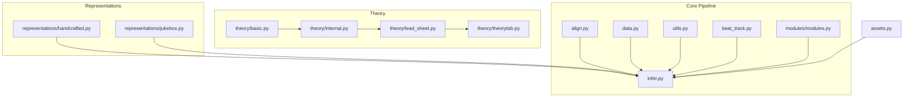
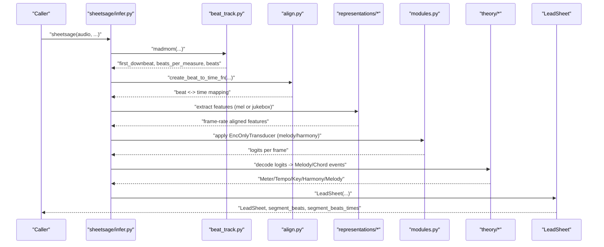
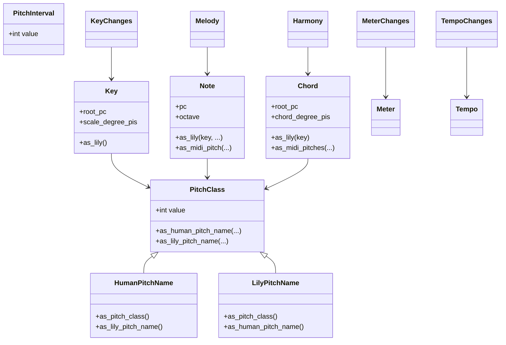
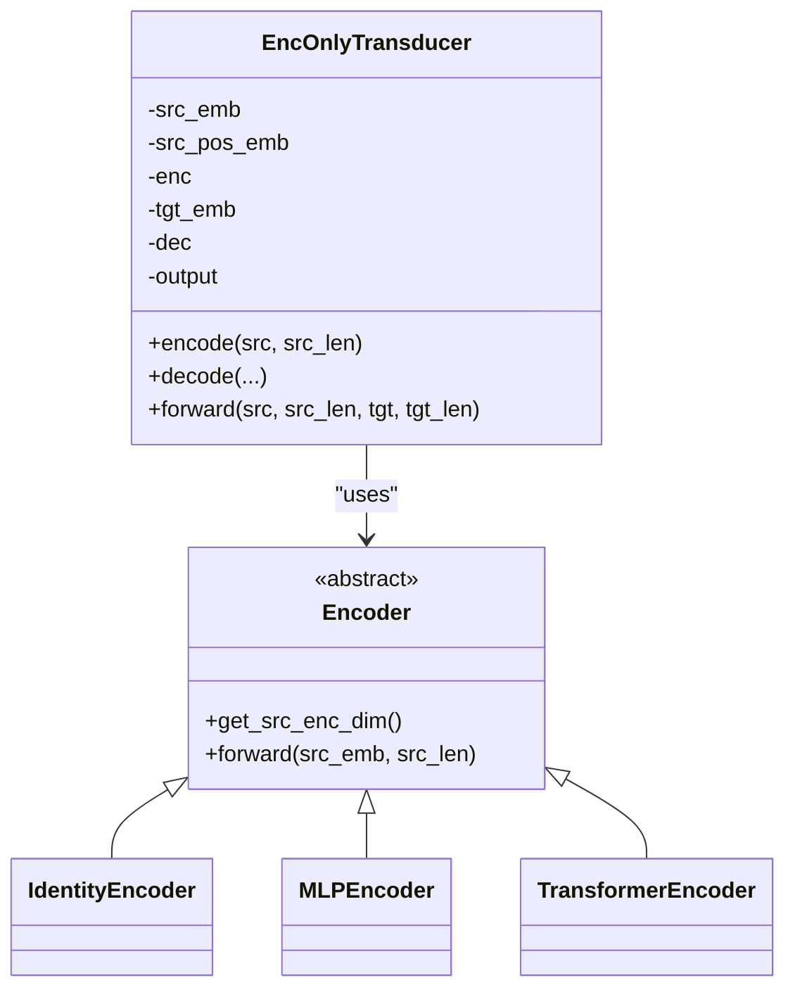
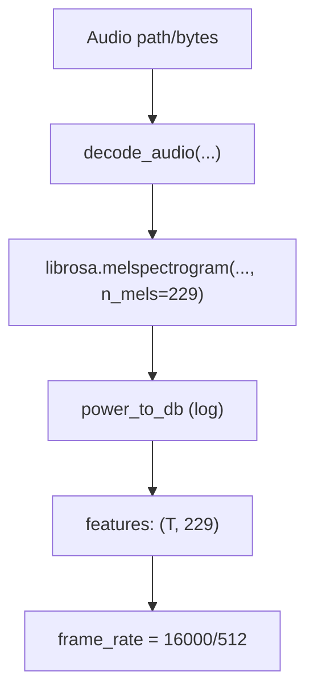
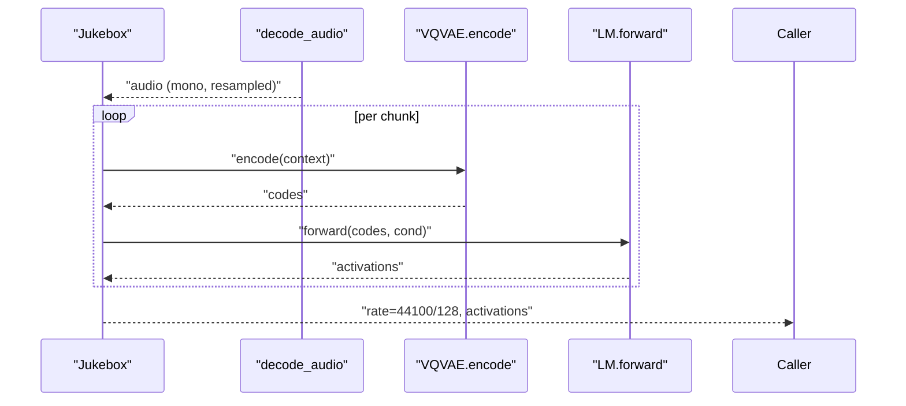
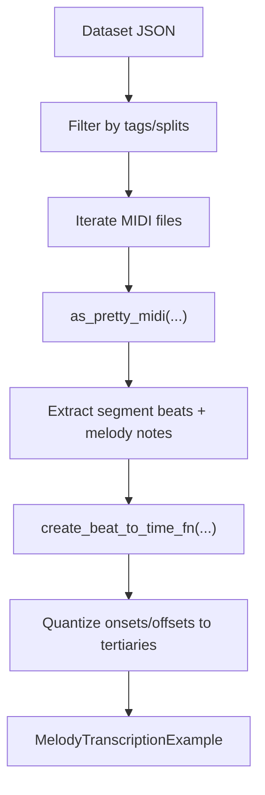
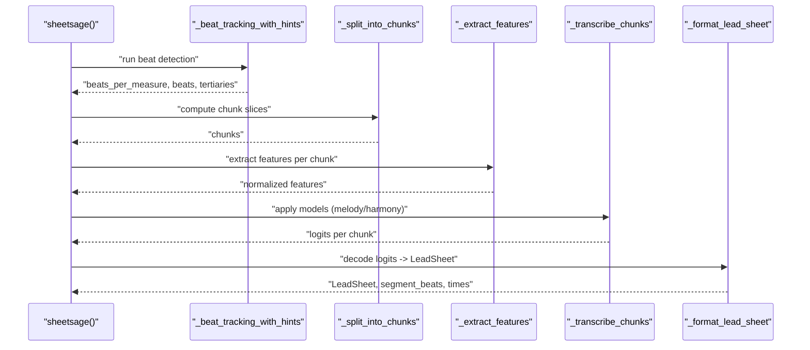
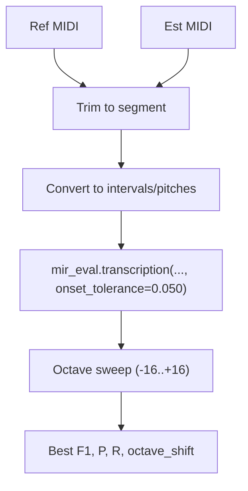
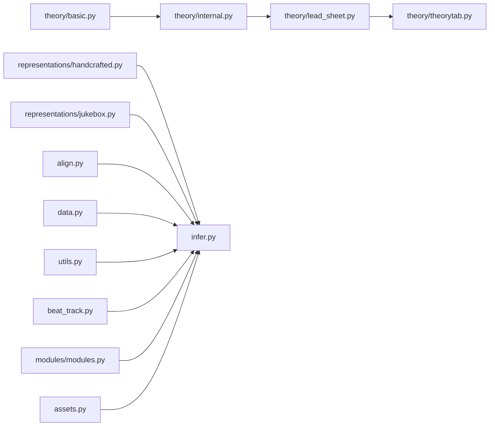

# Sheet Sage Algorithm

<cite>
**Referenced Files in This Document**
- [modules.py](file://sheetsage/src/sheetsage_upstream/sheetsage/modules/modules.py)
- [basic.py](file://sheetsage/src/sheetsage_upstream/sheetsage/theory/basic.py)
- [internal.py](file://sheetsage/src/sheetsage_upstream/sheetsage/theory/internal.py)
- [lead_sheet.py](file://sheetsage/src/sheetsage_upstream/sheetsage/theory/lead_sheet.py)
- [theorytab.py](file://sheetsage/src/sheetsage_upstream/sheetsage/theory/theorytab.py)
- [handcrafted.py](file://sheetsage/src/sheetsage_upstream/sheetsage/representations/handcrafted.py)
- [jukebox.py](file://sheetsage/src/sheetsage_upstream/sheetsage/representations/jukebox.py)
- [data.py](file://sheetsage/src/sheetsage_upstream/sheetsage/data.py)
- [align.py](file://sheetsage/src/sheetsage_upstream/sheetsage/align.py)
- [infer.py](file://sheetsage/src/sheetsage_upstream/sheetsage/infer.py)
- [assets.py](file://sheetsage/src/sheetsage_upstream/sheetsage/assets.py)
- [utils.py](file://sheetsage/src/sheetsage_upstream/sheetsage/utils.py)
- [beat_track.py](file://sheetsage/src/sheetsage_upstream/sheetsage/beat_track.py)
- [eval.py](file://sheetsage/src/sheetsage_upstream/sheetsage/eval.py)
</cite>

## Table of Contents
1. [Introduction](#introduction)
2. [Project Structure](#project-structure)
3. [Core Components](#core-components)
4. [Architecture Overview](#architecture-overview)
5. [Detailed Component Analysis](#detailed-component-analysis)
6. [Dependency Analysis](#dependency-analysis)
7. [Performance Considerations](#performance-considerations)
8. [Troubleshooting Guide](#troubleshooting-guide)
9. [Conclusion](#conclusion)
10. [Appendices](#appendices)

## Introduction
Sheet Sage is a non-Jukebox handcrafted melody transcription system that produces lead sheets from music audio. It combines a mel-spectrogram-based handcrafted representation with a lightweight Transformer encoder to predict per-timing-frame melody and harmony. A Jukebox-based representation is optionally available to improve quality at the cost of GPU memory and runtime. The algorithm emphasizes monophonic melody transcription and interpretable theory-aware representations, while handling 3/4 and 4/4 meters and deriving tempo and key from beat tracking.

## Project Structure
The Sheet Sage upstream module organizes functionality into theory representations, feature representations, data loading, alignment, inference, and evaluation utilities.

**Diagram sources**
- [modules.py:1-400](file://sheetsage/src/sheetsage_upstream/sheetsage/modules/modules.py#L1-L400)
- [basic.py:1-126](file://sheetsage/src/sheetsage_upstream/sheetsage/theory/basic.py#L1-L126)
- [internal.py:1-305](file://sheetsage/src/sheetsage_upstream/sheetsage/theory/internal.py#L1-L305)
- [lead_sheet.py:1-515](file://sheetsage/src/sheetsage_upstream/sheetsage/theory/lead_sheet.py#L1-L515)
- [theorytab.py](file://sheetsage/src/sheetsage_upstream/sheetsage/theory/theorytab.py)
- [handcrafted.py:1-44](file://sheetsage/src/sheetsage_upstream/sheetsage/representations/handcrafted.py#L1-L44)
- [jukebox.py:1-242](file://sheetsage/src/sheetsage_upstream/sheetsage/representations/jukebox.py#L1-L242)
- [data.py:1-289](file://sheetsage/src/sheetsage_upstream/sheetsage/data.py#L1-L289)
- [align.py:1-30](file://sheetsage/src/sheetsage_upstream/sheetsage/align.py#L1-L30)
- [infer.py:1-882](file://sheetsage/src/sheetsage_upstream/sheetsage/infer.py#L1-L882)
- [assets.py:1-166](file://sheetsage/src/sheetsage_upstream/sheetsage/assets.py#L1-L166)
- [utils.py:1-458](file://sheetsage/src/sheetsage_upstream/sheetsage/utils.py#L1-L458)
- [beat_track.py:1-87](file://sheetsage/src/sheetsage_upstream/sheetsage/beat_track.py#L1-L87)

**Section sources**
- [modules.py:1-400](file://sheetsage/src/sheetsage_upstream/sheetsage/modules/modules.py#L1-L400)
- [basic.py:1-126](file://sheetsage/src/sheetsage_upstream/sheetsage/theory/basic.py#L1-L126)
- [internal.py:1-305](file://sheetsage/src/sheetsage_upstream/sheetsage/theory/internal.py#L1-L305)
- [lead_sheet.py:1-515](file://sheetsage/src/sheetsage_upstream/sheetsage/theory/lead_sheet.py#L1-L515)
- [theorytab.py](file://sheetsage/src/sheetsage_upstream/sheetsage/theory/theorytab.py)
- [handcrafted.py:1-44](file://sheetsage/src/sheetsage_upstream/sheetsage/representations/handcrafted.py#L1-L44)
- [jukebox.py:1-242](file://sheetsage/src/sheetsage_upstream/sheetsage/representations/jukebox.py#L1-L242)
- [data.py:1-289](file://sheetsage/src/sheetsage_upstream/sheetsage/data.py#L1-L289)
- [align.py:1-30](file://sheetsage/src/sheetsage_upstream/sheetsage/align.py#L1-L30)
- [infer.py:1-882](file://sheetsage/src/sheetsage_upstream/sheetsage/infer.py#L1-L882)
- [assets.py:1-166](file://sheetsage/src/sheetsage_upstream/sheetsage/assets.py#L1-L166)
- [utils.py:1-458](file://sheetsage/src/sheetsage_upstream/sheetsage/utils.py#L1-L458)
- [beat_track.py:1-87](file://sheetsage/src/sheetsage_upstream/sheetsage/beat_track.py#L1-L87)

## Core Components
- Theory foundation: pitch classes, intervals, keys, notes, chords, and change lists (meter, tempo, key, harmony, melody).
- Feature representations: mel-spectrograms (handcrafted) and Jukebox VQVAE-language model activations.
- Transformer-based transcription: an encoder-only Transformer that maps frame-level features to melody/harmony logits.
- Data and alignment: Hooktheory/RWC datasets, beat-to-time interpolation, and MIDI-based melody examples.
- Inference pipeline: beat detection, chunking, feature extraction, model inference, decoding, and lead sheet generation.
- Evaluation: onset-focused metrics aligned with transcription literature.

**Section sources**
- [basic.py:1-126](file://sheetsage/src/sheetsage_upstream/sheetsage/theory/basic.py#L1-L126)
- [internal.py:1-305](file://sheetsage/src/sheetsage_upstream/sheetsage/theory/internal.py#L1-L305)
- [handcrafted.py:1-44](file://sheetsage/src/sheetsage_upstream/sheetsage/representations/handcrafted.py#L1-L44)
- [jukebox.py:1-242](file://sheetsage/src/sheetsage_upstream/sheetsage/representations/jukebox.py#L1-L242)
- [modules.py:1-400](file://sheetsage/src/sheetsage_upstream/sheetsage/modules/modules.py#L1-L400)
- [data.py:1-289](file://sheetsage/src/sheetsage_upstream/sheetsage/data.py#L1-L289)
- [align.py:1-30](file://sheetsage/src/sheetsage_upstream/sheetsage/align.py#L1-L30)
- [infer.py:1-882](file://sheetsage/src/sheetsage_upstream/sheetsage/infer.py#L1-L882)
- [eval.py:1-205](file://sheetsage/src/sheetsage_upstream/sheetsage/eval.py#L1-L205)

## Architecture Overview
Sheet Sage’s end-to-end flow transforms audio into a lead sheet with melody and harmony:

**Diagram sources**
- [infer.py:534-710](file://sheetsage/src/sheetsage_upstream/sheetsage/infer.py#L534-L710)
- [beat_track.py:9-87](file://sheetsage/src/sheetsage_upstream/sheetsage/beat_track.py#L9-L87)
- [align.py:24-29](file://sheetsage/src/sheetsage_upstream/sheetsage/align.py#L24-L29)
- [handcrafted.py:22-44](file://sheetsage/src/sheetsage_upstream/sheetsage/representations/handcrafted.py#L22-L44)
- [jukebox.py:227-242](file://sheetsage/src/sheetsage_upstream/sheetsage/representations/jukebox.py#L227-L242)
- [modules.py:372-400](file://sheetsage/src/sheetsage_upstream/sheetsage/modules/modules.py#L372-L400)
- [lead_sheet.py:77-146](file://sheetsage/src/sheetsage_upstream/sheetsage/theory/lead_sheet.py#L77-L146)

## Detailed Component Analysis

### Theory Foundation and Representation Learning
- Pitch classes and intervals: integer-backed classes with conversions to human/LilyPond pitch names.
- Keys, notes, chords: immutable tuples with semantic constructors and rendering to theory formats.
- Change lists: meter/tempo/key as instantaneous changes; harmony as instantaneous chords; melody as sustained notes.
- Representation learning: theorytab utilities and estimation routines inform key and harmony parsing.

**Diagram sources**
- [basic.py:16-126](file://sheetsage/src/sheetsage_upstream/sheetsage/theory/basic.py#L16-L126)
- [internal.py:61-305](file://sheetsage/src/sheetsage_upstream/sheetsage/theory/internal.py#L61-L305)

**Section sources**
- [basic.py:1-126](file://sheetsage/src/sheetsage_upstream/sheetsage/theory/basic.py#L1-L126)
- [internal.py:1-305](file://sheetsage/src/sheetsage_upstream/sheetsage/theory/internal.py#L1-L305)
- [theorytab.py](file://sheetsage/src/sheetsage_upstream/sheetsage/theory/theorytab.py)
- [lead_sheet.py:147-306](file://sheetsage/src/sheetsage_upstream/sheetsage/theory/lead_sheet.py#L147-L306)

### Handcrafted Melody Transformer
- Encoder-only Transformer with optional positional embedding and identity/MLP encoders.
- Input projection to model dimension; sequence masking; linear output head per task (melody/harmony).
- Lightweight design enabling CPU inference with minimal overhead.

**Diagram sources**
- [modules.py:41-144](file://sheetsage/src/sheetsage_upstream/sheetsage/modules/modules.py#L41-L144)
- [modules.py:257-400](file://sheetsage/src/sheetsage_upstream/sheetsage/modules/modules.py#L257-L400)

**Section sources**
- [modules.py:1-400](file://sheetsage/src/sheetsage_upstream/sheetsage/modules/modules.py#L1-L400)

### Handcrafted Mel-Spectrogram Representation
- Mel-spectrogram extraction at 16000 Hz, 512-hop, 229 mel bins, log-power scaling.
- Frame rate: 16000/512 ≈ 31.25 Hz; normalized per training moments during inference.

**Diagram sources**
- [handcrafted.py:22-44](file://sheetsage/src/sheetsage_upstream/sheetsage/representations/handcrafted.py#L22-L44)
- [utils.py:216-299](file://sheetsage/src/sheetsage_upstream/sheetsage/utils.py#L216-L299)

**Section sources**
- [handcrafted.py:1-44](file://sheetsage/src/sheetsage_upstream/sheetsage/representations/handcrafted.py#L1-L44)
- [utils.py:1-458](file://sheetsage/src/sheetsage_upstream/sheetsage/utils.py#L1-L458)

### Jukebox-Based Representation
- VQVAE encoding and language model activations at 44100 Hz, 128-sample hop.
- Chunked processing with metadata conditioning; fp16 optional; memory cleanup via CUDA cache flush.
- Frame rate: 44100/128 ≈ 344.53 Hz; suitable for higher-quality transcription.

**Diagram sources**
- [jukebox.py:79-242](file://sheetsage/src/sheetsage_upstream/sheetsage/representations/jukebox.py#L79-L242)
- [utils.py:216-299](file://sheetsage/src/sheetsage_upstream/sheetsage/utils.py#L216-L299)

**Section sources**
- [jukebox.py:1-242](file://sheetsage/src/sheetsage_upstream/sheetsage/representations/jukebox.py#L1-L242)
- [utils.py:1-458](file://sheetsage/src/sheetsage_upstream/sheetsage/utils.py#L1-L458)

### Data Pipeline and Temporal Alignment
- Hooktheory and RWC datasets: MIDI-based melody examples with quantized onsets/offsets and beat-aligned timing.
- Alignment: linear interpolation between beat indices and timestamps; extrapolation enabled.
- Iterators: filter by tags, splits, and alignment variants; construct MelodyTranscriptionExample.

**Diagram sources**
- [data.py:174-289](file://sheetsage/src/sheetsage_upstream/sheetsage/data.py#L174-L289)
- [align.py:24-29](file://sheetsage/src/sheetsage_upstream/sheetsage/align.py#L24-L29)

**Section sources**
- [data.py:1-289](file://sheetsage/src/sheetsage_upstream/sheetsage/data.py#L1-L289)
- [align.py:1-30](file://sheetsage/src/sheetsage_upstream/sheetsage/align.py#L1-L30)

### Inference Execution
- Beat detection with madmom; derive tertiaries (1/4 beats) and segment boundaries.
- Chunking by measures; beat-resample features; normalize handcrafted features using cached moments.
- Model selection by asset tags; load state dicts; run forward passes; decode logits to melody/harmony.
- Construct LeadSheet with meter, tempo, key, harmony, and melody; export MIDI and LilyPond.

**Diagram sources**
- [infer.py:534-710](file://sheetsage/src/sheetsage_upstream/sheetsage/infer.py#L534-L710)
- [infer.py:297-430](file://sheetsage/src/sheetsage_upstream/sheetsage/infer.py#L297-L430)
- [infer.py:432-532](file://sheetsage/src/sheetsage_upstream/sheetsage/infer.py#L432-L532)

**Section sources**
- [infer.py:1-882](file://sheetsage/src/sheetsage_upstream/sheetsage/infer.py#L1-L882)

### Evaluation Procedures
- Trim estimated MIDI to reference segment; convert to mir_eval intervals/pitches.
- Onset-based precision/recall/F1 with 50 ms tolerance; pitch tolerance applied in Hz domain.
- Octave-invariant evaluation across a radius; report best octave shift.

**Diagram sources**
- [eval.py:69-129](file://sheetsage/src/sheetsage_upstream/sheetsage/eval.py#L69-L129)

**Section sources**
- [eval.py:1-205](file://sheetsage/src/sheetsage_upstream/sheetsage/eval.py#L1-L205)

## Dependency Analysis
- Theory modules depend on basic pitch classes and intervals; internal change lists compose theory constructs; lead sheet renders theory to LilyPond and MIDI.
- Representations depend on librosa and, for Jukebox, external libraries; both produce frame-aligned arrays.
- Inference orchestrates beat tracking, alignment, representations, models, and theory formatting.
- Assets manage model configurations and weights; utils provide audio decoding, checksums, and engraving.

**Diagram sources**
- [basic.py:1-126](file://sheetsage/src/sheetsage_upstream/sheetsage/theory/basic.py#L1-L126)
- [internal.py:1-305](file://sheetsage/src/sheetsage_upstream/sheetsage/theory/internal.py#L1-L305)
- [lead_sheet.py:1-515](file://sheetsage/src/sheetsage_upstream/sheetsage/theory/lead_sheet.py#L1-L515)
- [theorytab.py](file://sheetsage/src/sheetsage_upstream/sheetsage/theory/theorytab.py)
- [handcrafted.py:1-44](file://sheetsage/src/sheetsage_upstream/sheetsage/representations/handcrafted.py#L1-L44)
- [jukebox.py:1-242](file://sheetsage/src/sheetsage_upstream/sheetsage/representations/jukebox.py#L1-L242)
- [align.py:1-30](file://sheetsage/src/sheetsage_upstream/sheetsage/align.py#L1-L30)
- [data.py:1-289](file://sheetsage/src/sheetsage_upstream/sheetsage/data.py#L1-L289)
- [utils.py:1-458](file://sheetsage/src/sheetsage_upstream/sheetsage/utils.py#L1-L458)
- [beat_track.py:1-87](file://sheetsage/src/sheetsage_upstream/sheetsage/beat_track.py#L1-L87)
- [modules.py:1-400](file://sheetsage/src/sheetsage_upstream/sheetsage/modules/modules.py#L1-L400)
- [assets.py:1-166](file://sheetsage/src/sheetsage_upstream/sheetsage/assets.py#L1-L166)
- [infer.py:1-882](file://sheetsage/src/sheetsage_upstream/sheetsage/infer.py#L1-L882)

**Section sources**
- [modules.py:1-400](file://sheetsage/src/sheetsage_upstream/sheetsage/modules/modules.py#L1-L400)
- [assets.py:1-166](file://sheetsage/src/sheetsage_upstream/sheetsage/assets.py#L1-L166)
- [infer.py:1-882](file://sheetsage/src/sheetsage_upstream/sheetsage/infer.py#L1-L882)

## Performance Considerations
- Handcrafted features: low GPU requirement, CPU-friendly; normalization performed per chunk to match training statistics.
- Jukebox features: higher fidelity but requires significant GPU memory and time; chunked processing mitigates memory spikes.
- Beat resolution: tertiaries (1/4 beats) balance temporal granularity and computational cost.
- Model size: encoder-only Transformer with small feed-forward and dropout; configurable depth via hacks.
- Practical tips: tune measures_per_chunk to phrase length; use melody/harmony thresholds to trade off sensitivity; leverage beat_detection_padding to stabilize beat tracking near segment edges.

[No sources needed since this section provides general guidance]

## Troubleshooting Guide
- Beat detection failures: ensure sufficient audio around segment hints; verify madmom availability; adjust beats_per_minute_hint to avoid doubling/halving issues.
- Segment too short: the pipeline enforces minimum measures; increase segment hints or disable avoid_chunking_if_possible.
- Feature frame rate issues: tempo too high leads to zero-length mean pooling windows; reduce tempo or increase hop size.
- Jukebox initialization: singleton pattern restricts model/layers; initialize once with consistent settings.
- Asset verification: checksum mismatches trigger re-download; confirm network connectivity and disk permissions.

**Section sources**
- [infer.py:156-295](file://sheetsage/src/sheetsage_upstream/sheetsage/infer.py#L156-L295)
- [infer.py:345-389](file://sheetsage/src/sheetsage_upstream/sheetsage/infer.py#L345-L389)
- [jukebox.py:26-77](file://sheetsage/src/sheetsage_upstream/sheetsage/representations/jukebox.py#L26-L77)
- [assets.py:54-134](file://sheetsage/src/sheetsage_upstream/sheetsage/assets.py#L54-L134)

## Conclusion
Sheet Sage offers a practical, non-Jukebox melody transcription pipeline built on handcrafted mel-spectrograms and a compact Transformer encoder. It excels at monophonic melody transcription and produces readable lead sheets with harmony and melody aligned to beat grids. While Jukebox-based features can improve quality, they come with substantial hardware requirements. The system’s modular design enables easy extension to richer theory modeling and evaluation.

[No sources needed since this section summarizes without analyzing specific files]

## Appendices

### Mathematical Formulations and Feature Extraction
- Mel-spectrogram: $$ X = \mathcal{M}(x),\quad \text{where } \mathcal{M} \text{ uses } (n_\text{fft}, \text{hop}, n_\text{mel}, f_\min) $$
- Frame rate: $$ r = \frac{\text{sr}}{\text{hop}} $$
- Normalization: per-chunk z-score using cached means and stds.
- Jukebox activations: $$ h_t = \text{LM}(\text{VQVAE}(x_{[t-\Delta,t]})\ |\ \text{metadata}),\quad \text{with } \Delta = 128 \text{ samples} $$

**Section sources**
- [handcrafted.py:22-44](file://sheetsage/src/sheetsage_upstream/sheetsage/representations/handcrafted.py#L22-L44)
- [jukebox.py:111-242](file://sheetsage/src/sheetsage_upstream/sheetsage/representations/jukebox.py#L111-L242)
- [infer.py:377-388](file://sheetsage/src/sheetsage_upstream/sheetsage/infer.py#L377-L388)

### Model Training Procedures
- Tasks: melody (89-class pitch vocabulary) and harmony (97-class chord-family plus root).
- Inputs: handcrafted (229-dim) or Jukebox (4800-dim) features.
- Training: encoder-only Transformer with Xavier initialization; masked sequence attention; positional embedding optional; 4–6 layers depending on asset.
- Inference: load asset-specific configs and weights; run forward pass over padded chunks; decode logits to onsets and chords.

**Section sources**
- [infer.py:94-148](file://sheetsage/src/sheetsage_upstream/sheetsage/infer.py#L94-L148)
- [modules.py:106-136](file://sheetsage/src/sheetsage_upstream/sheetsage/modules/modules.py#L106-L136)

### Asset Dependencies
- Datasets: hooktheory.json, rwc.json, sheetsage.json, test.json.
- Models: SHEETSAGE_V02_*_CFG and SHEETSAGE_V02_*_MODEL assets keyed by input features and task.
- Moments: SHEETSAGE_V02_HANDCRAFTED_MOMENTS for feature normalization.

**Section sources**
- [assets.py:13-37](file://sheetsage/src/sheetsage_upstream/sheetsage/assets.py#L13-L37)
- [infer.py:99-148](file://sheetsage/src/sheetsage_upstream/sheetsage/infer.py#L99-L148)

### Evaluation Metrics and Benchmarks
- Metric: onset-based precision, recall, F1 at 50 ms tolerance; pitch tolerance in Hz; octave-invariant best shift.
- Dataset: Hooktheory/RWC with beat-aligned MIDI; mir_eval transcription scoring.

**Section sources**
- [eval.py:69-129](file://sheetsage/src/sheetsage_upstream/sheetsage/eval.py#L69-L129)
- [data.py:174-289](file://sheetsage/src/sheetsage_upstream/sheetsage/data.py#L174-L289)

### Strengths and Limitations
- Strengths:
  - Monophonic melody transcription robustness.
  - Interpretable theory-aware representations and lead sheet output.
  - Lightweight, CPU-friendly design with optional GPU acceleration via Jukebox.
- Limitations:
  - Primarily focused on melody; harmony handled via chord families; less expressive for complex voicings.
  - Assumes 3/4 and 4/4 meters; meter changes constrained in current implementation.
  - Relies on beat tracking; misalignment affects temporal granularity.

[No sources needed since this section provides general guidance]