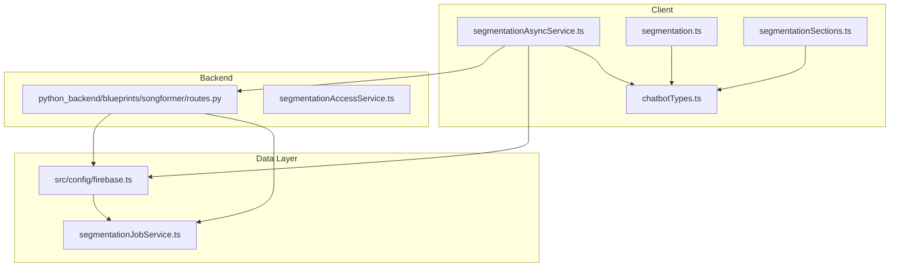
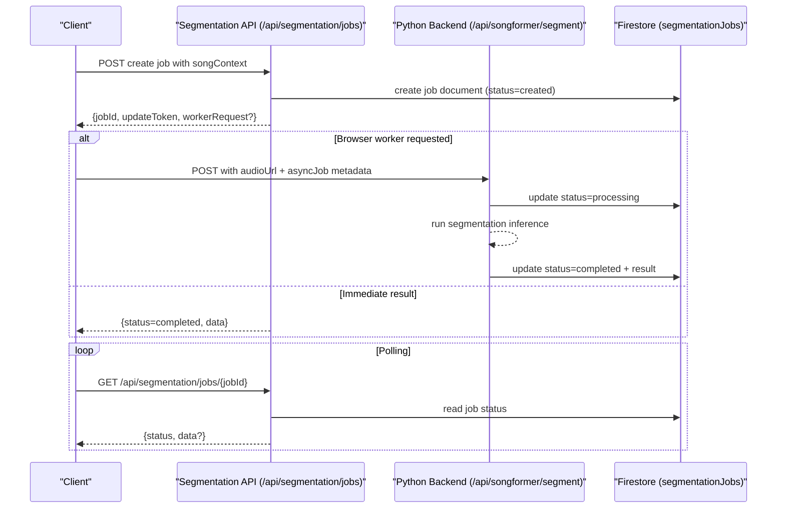
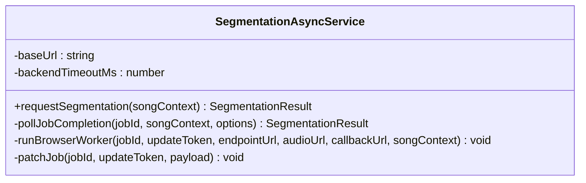
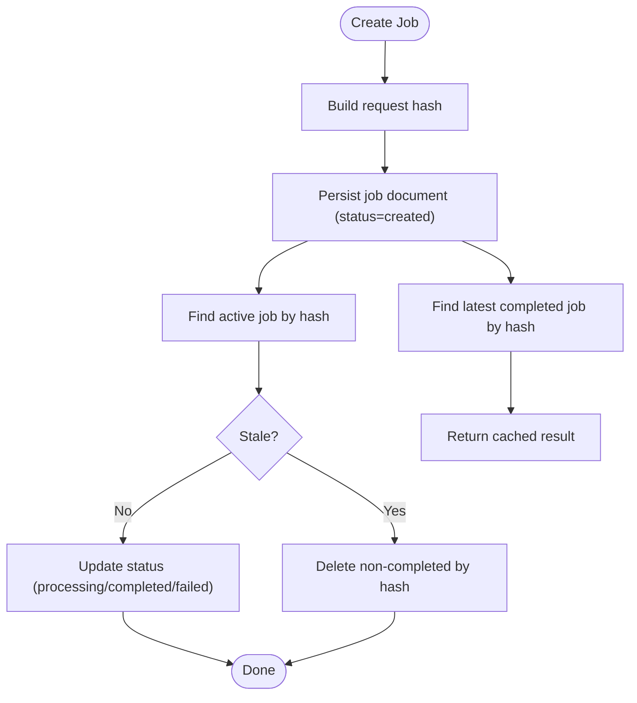
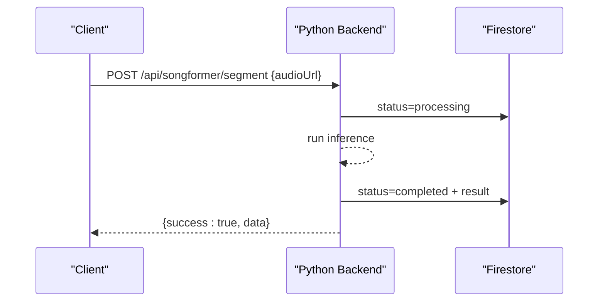
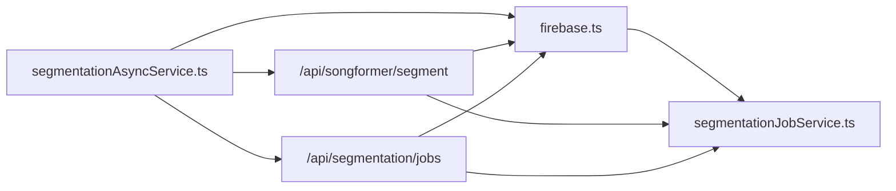

# Job Management

<cite>
**Referenced Files in This Document**
- [segmentationAsyncService.ts](file://src/services/api/segmentationAsyncService.ts)
- [segmentationJobService.ts](file://src/services/firebase/segmentationJobService.ts)
- [segmentationAccessService.ts](file://src/services/api/segmentationAccessService.ts)
- [chatbotTypes.ts](file://src/types/chatbotTypes.ts)
- [firebase.ts](file://src/config/firebase.ts)
- [routes.py](file://python_backend/blueprints/songformer/routes.py)
- [segmentation.ts](file://src/utils/chordFormatting/segmentation.ts)
- [segmentationSections.ts](file://src/utils/segmentationSections.ts)
- [segmentation-jobs.route.test.ts](file://__tests__/integration/api/segmentation-jobs.route.test.ts)
- [segmentationAsyncService.test.ts](file://__tests__/unit/services/segmentationAsyncService.test.ts)
- [segmentationJobService.test.ts](file://__tests__/unit/services/segmentationJobService.test.ts)
</cite>

## Table of Contents
1. [Introduction](#introduction)
2. [Project Structure](#project-structure)
3. [Core Components](#core-components)
4. [Architecture Overview](#architecture-overview)
5. [Detailed Component Analysis](#detailed-component-analysis)
6. [Dependency Analysis](#dependency-analysis)
7. [Performance Considerations](#performance-considerations)
8. [Troubleshooting Guide](#troubleshooting-guide)
9. [Security and Access Control](#security-and-access-control)
10. [Conclusion](#conclusion)

## Introduction
This document describes the song segmentation job management system in ChordMiniApp. It covers the asynchronous job processing architecture, including job creation, queuing, execution, and result delivery. It explains how Firebase is used for job state persistence, progress tracking, and result storage, and documents the job lifecycle from initiation through completion, including status updates, error handling, and cleanup procedures. It also details the API endpoints for job management, client-side integration patterns using segmentationAsyncService, job prioritization and queue management strategies, monitoring and debugging capabilities, and security considerations.

## Project Structure
The segmentation job system spans client-side services, backend API routes, and Firebase persistence:
- Client-side orchestration and polling are handled by segmentationAsyncService.
- Job state and results are persisted in a Firestore collection named segmentationJobs.
- Backend routes in Python handle the actual segmentation inference and expose endpoints for external workers.
- Supporting utilities provide access control checks and segmentation result formatting helpers.

**Diagram sources**
- [segmentationAsyncService.ts:1-261](file://src/services/api/segmentationAsyncService.ts#L1-L261)
- [segmentationJobService.ts:1-336](file://src/services/firebase/segmentationJobService.ts#L1-L336)
- [segmentationAccessService.ts:1-64](file://src/services/api/segmentationAccessService.ts#L1-L64)
- [chatbotTypes.ts:1-126](file://src/types/chatbotTypes.ts#L1-L126)
- [firebase.ts:331-336](file://src/config/firebase.ts#L331-L336)
- [routes.py:14-53](file://python_backend/blueprints/songformer/routes.py#L14-L53)

**Section sources**
- [segmentationAsyncService.ts:101-261](file://src/services/api/segmentationAsyncService.ts#L101-L261)
- [segmentationJobService.ts:29-60](file://src/services/firebase/segmentationJobService.ts#L29-L60)
- [routes.py:14-53](file://python_backend/blueprints/songformer/routes.py#L14-L53)
- [firebase.ts:331-336](file://src/config/firebase.ts#L331-L336)

## Core Components
- Client-side job orchestration and polling:
  - Creates segmentation jobs, polls for completion, and coordinates browser-based worker execution.
  - Implements adaptive polling strategies based on song duration and reuse hints.
- Firebase job persistence:
  - Manages job documents with TTLs, staleness detection, and cleanup.
  - Provides lookup by request hash for deduplication and reuse.
- Backend worker and access control:
  - Exposes endpoints for segmentation inference and validates access codes in production.
- Utilities:
  - Formatting helpers for segmentation results and instrumental/instrumental-like segment detection.

**Section sources**
- [segmentationAsyncService.ts:101-261](file://src/services/api/segmentationAsyncService.ts#L101-L261)
- [segmentationJobService.ts:147-336](file://src/services/firebase/segmentationJobService.ts#L147-L336)
- [segmentationAccessService.ts:9-64](file://src/services/api/segmentationAccessService.ts#L9-L64)
- [segmentation.ts:1-57](file://src/utils/chordFormatting/segmentation.ts#L1-L57)
- [segmentationSections.ts:1-36](file://src/utils/segmentationSections.ts#L1-L36)

## Architecture Overview
The system uses a hybrid client-initiated and backend-worker model:
- The client sends a segmentation request and receives either immediate results or metadata to run a browser worker against a backend endpoint.
- The backend performs the heavy inference and updates job state in Firestore.
- The client polls the job status endpoint until completion or failure.

**Diagram sources**
- [segmentationAsyncService.ts:120-196](file://src/services/api/segmentationAsyncService.ts#L120-L196)
- [segmentationAsyncService.ts:198-235](file://src/services/api/segmentationAsyncService.ts#L198-L235)
- [segmentationJobService.ts:147-226](file://src/services/firebase/segmentationJobService.ts#L147-L226)
- [routes.py:14-42](file://python_backend/blueprints/songformer/routes.py#L14-L42)

## Detailed Component Analysis

### Client-Side Orchestration: SegmentationAsyncService
Responsibilities:
- Build segmentation requests with optional access code.
- Create jobs via the backend API and handle immediate results or worker metadata.
- Run a browser worker against the backend endpoint with a timeout.
- Poll job status with adaptive delays and caps.
- Patch job status on failures to ensure cleanup.

Key behaviors:
- Adaptive polling strategy based on song duration and reuse hints.
- Timeout handling for worker requests and status polling.
- Error propagation with meaningful messages.

**Diagram sources**
- [segmentationAsyncService.ts:101-261](file://src/services/api/segmentationAsyncService.ts#L101-L261)

**Section sources**
- [segmentationAsyncService.ts:120-196](file://src/services/api/segmentationAsyncService.ts#L120-L196)
- [segmentationAsyncService.ts:198-235](file://src/services/api/segmentationAsyncService.ts#L198-L235)

### Firebase Job Persistence: SegmentationJobService
Responsibilities:
- Create job documents with hashed request signatures for deduplication.
- Enforce TTLs per status and compute staleness windows.
- Update job status and timestamps atomically.
- Find active or completed jobs by request hash.
- Cleanup stale jobs and delete non-completed jobs by request hash.

**Diagram sources**
- [segmentationJobService.ts:147-274](file://src/services/firebase/segmentationJobService.ts#L147-L274)
- [segmentationJobService.ts:276-336](file://src/services/firebase/segmentationJobService.ts#L276-L336)

**Section sources**
- [segmentationJobService.ts:147-226](file://src/services/firebase/segmentationJobService.ts#L147-L226)
- [segmentationJobService.ts:228-274](file://src/services/firebase/segmentationJobService.ts#L228-L274)
- [segmentationJobService.ts:276-336](file://src/services/firebase/segmentationJobService.ts#L276-L336)

### Backend Worker: Python SongFormer Routes
Responsibilities:
- Validate incoming payload and service availability.
- Perform segmentation inference and return structured results.
- Update job state in Firestore via the worker flow orchestrated by the client.

**Diagram sources**
- [routes.py:14-42](file://python_backend/blueprints/songformer/routes.py#L14-L42)
- [segmentationAsyncService.ts:198-235](file://src/services/api/segmentationAsyncService.ts#L198-L235)

**Section sources**
- [routes.py:14-53](file://python_backend/blueprints/songformer/routes.py#L14-L53)

### Access Control and Authorization
- Access code validation is enforced in production environments.
- Validation uses constant-time comparison to mitigate timing attacks.
- Users can request access via a configured email address.

**Section sources**
- [segmentationAccessService.ts:9-64](file://src/services/api/segmentationAccessService.ts#L9-L64)

### Client-Side Utilities for Segment Display
- Helpers map beat indices to segmentation colors and cell classes for visualization.
- Instrumental-like segment detection supports UI decisions (e.g., disabling certain controls).

**Section sources**
- [segmentation.ts:1-57](file://src/utils/chordFormatting/segmentation.ts#L1-L57)
- [segmentationSections.ts:1-36](file://src/utils/segmentationSections.ts#L1-L36)

## Dependency Analysis
- Client depends on:
  - Backend API endpoints for job creation and status polling.
  - Python backend worker for inference.
  - Firebase SDK for job persistence and token management.
- Backend depends on:
  - Firebase for job state updates.
  - Access control service for validating codes.
- Tests validate:
  - End-to-end job lifecycle and client polling behavior.
  - Job service deduplication and cleanup logic.

**Diagram sources**
- [segmentationAsyncService.ts:120-196](file://src/services/api/segmentationAsyncService.ts#L120-L196)
- [routes.py:14-42](file://python_backend/blueprints/songformer/routes.py#L14-L42)
- [firebase.ts:331-336](file://src/config/firebase.ts#L331-L336)
- [segmentationJobService.ts:147-226](file://src/services/firebase/segmentationJobService.ts#L147-L226)

**Section sources**
- [segmentationAsyncService.test.ts:1-261](file://__tests__/unit/services/segmentationAsyncService.test.ts#L1-L261)
- [segmentationJobService.test.ts:1-336](file://__tests__/unit/services/segmentationJobService.test.ts#L1-L336)
- [segmentation-jobs.route.test.ts:1-200](file://__tests__/integration/api/segmentation-jobs.route.test.ts#L1-L200)

## Performance Considerations
- Adaptive polling:
  - Initial delay scales with song duration for long tracks, reducing unnecessary polling.
  - Reused jobs use shorter intervals to reflect faster completion expectations.
- Worker timeout:
  - Long-running inference is permitted with a generous client-side timeout to accommodate backend processing.
- Deduplication:
  - Request hashing prevents duplicate work for identical inputs, improving throughput and reducing cost.
- TTL and cleanup:
  - Jobs expire after configurable durations; stale job cleanup removes orphaned entries.

[No sources needed since this section provides general guidance]

## Troubleshooting Guide
Common issues and remedies:
- Job not found or expired:
  - Verify jobId validity and that the job is not stale.
  - Confirm TTL settings and recent cleanup runs.
- Worker failure:
  - Check backend logs for exceptions and ensure the worker endpoint is reachable.
  - Validate access code presence and correctness in production.
- Client polling timeouts:
  - Increase max attempts or adjust polling strategy for very long songs.
- Duplicate jobs:
  - Use request hash to detect and reuse existing jobs; delete non-completed duplicates if needed.

**Section sources**
- [segmentationAsyncService.ts:164-196](file://src/services/api/segmentationAsyncService.ts#L164-L196)
- [segmentationJobService.ts:276-336](file://src/services/firebase/segmentationJobService.ts#L276-L336)
- [segmentationAccessService.ts:26-64](file://src/services/api/segmentationAccessService.ts#L26-L64)

## Security and Access Control
- Access code enforcement:
  - Production requires a configured access code; validation uses constant-time comparison.
  - Users receive guidance on requesting access via a designated email.
- Update token integrity:
  - Job updates require a valid update token; tokens are hashed and verified before applying changes.
- Firebase configuration:
  - Runtime configuration enables secure deployments across environments; App Check integration is supported.

**Section sources**
- [segmentationAccessService.ts:9-64](file://src/services/api/segmentationAccessService.ts#L9-L64)
- [segmentationJobService.ts:192-202](file://src/services/firebase/segmentationJobService.ts#L192-L202)
- [firebase.ts:475-536](file://src/config/firebase.ts#L475-L536)

## Conclusion
The segmentation job management system combines a robust client-side orchestration layer with reliable backend inference and durable job persistence in Firestore. It supports adaptive polling, deduplication, and cleanup to maintain performance and reliability. Access control and secure token verification protect resources while enabling scalable, asynchronous processing of audio segmentation tasks.