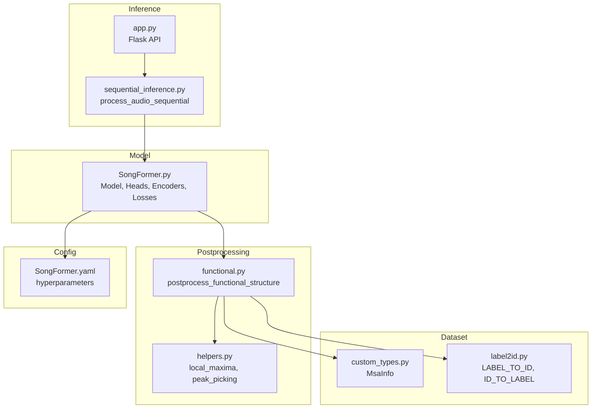
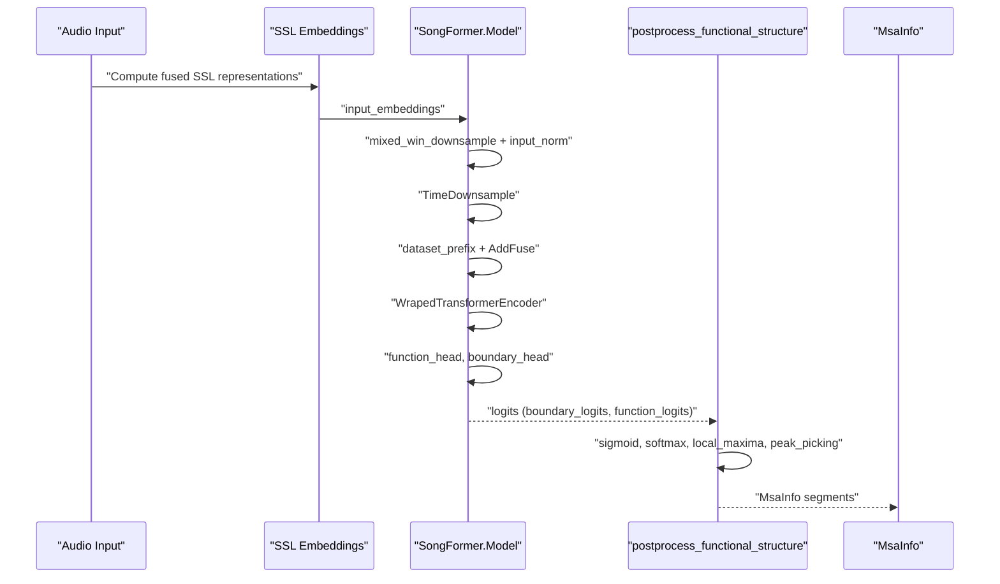
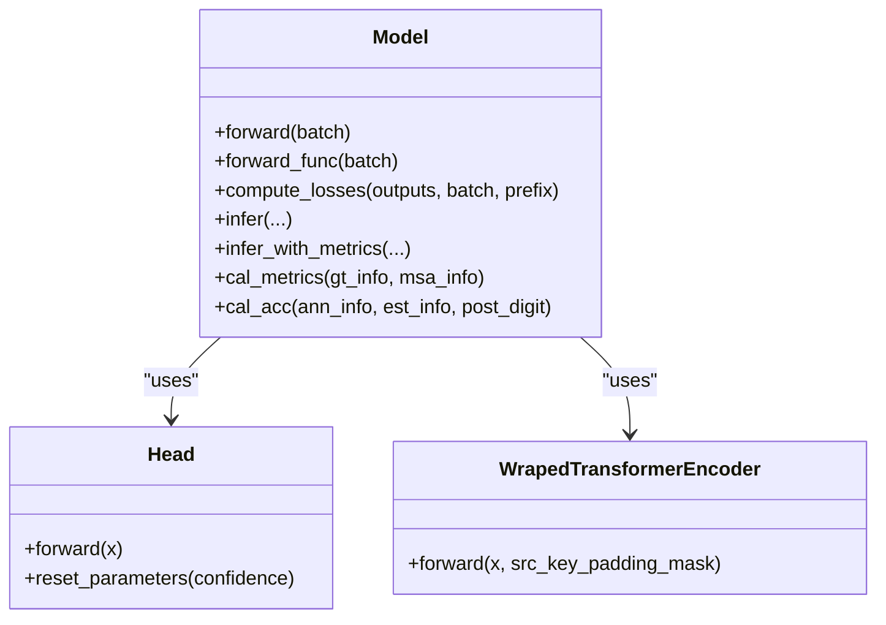
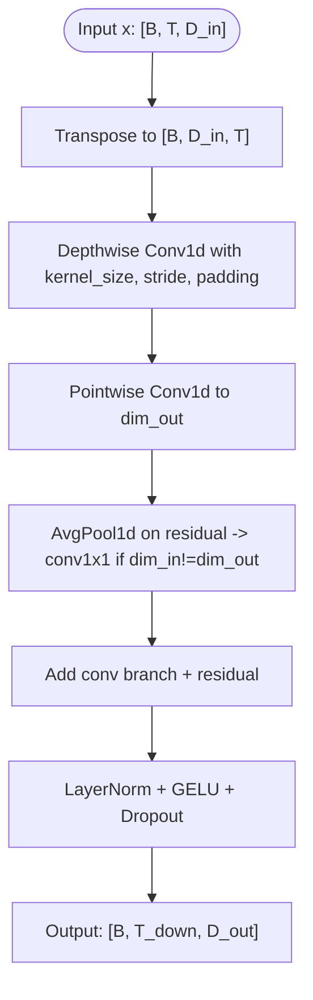
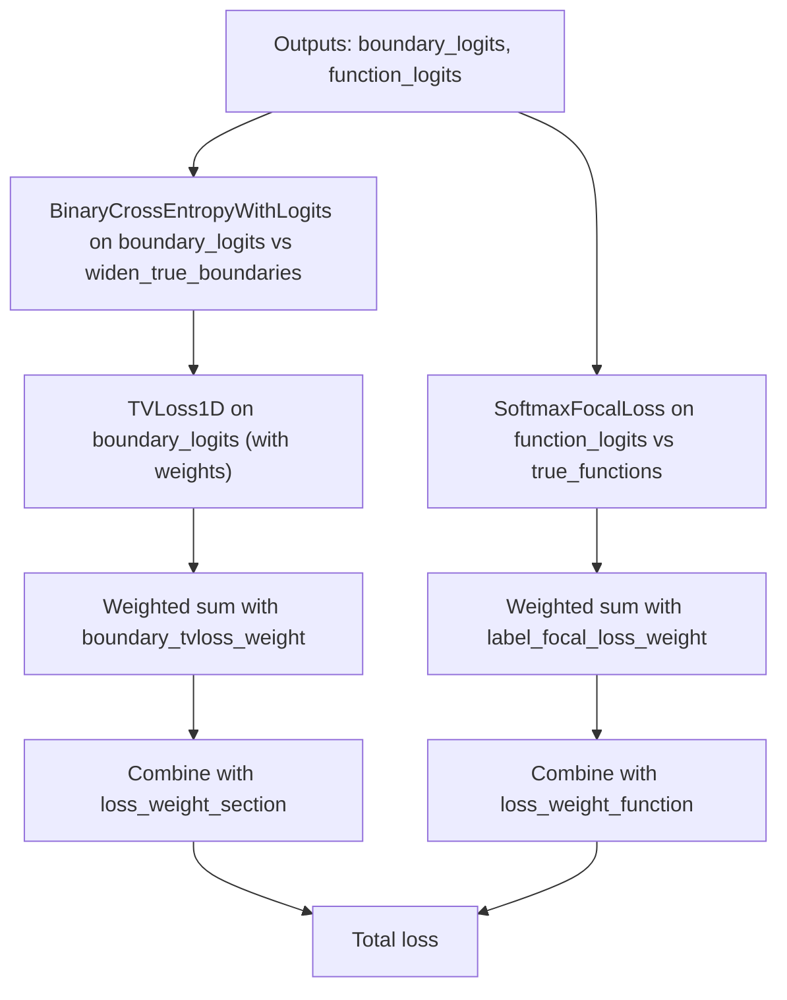
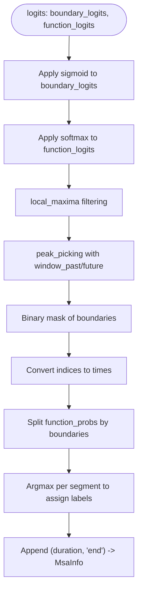
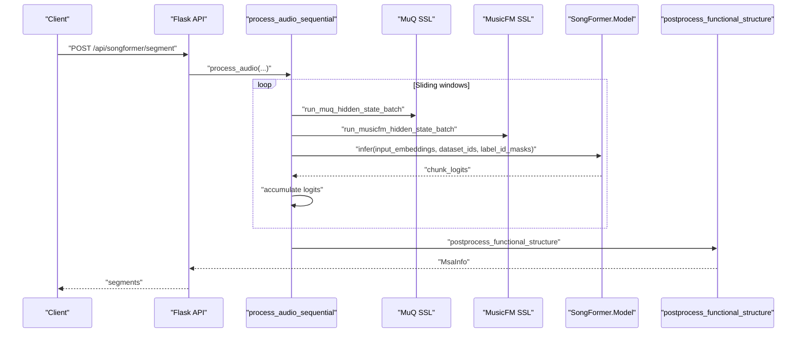
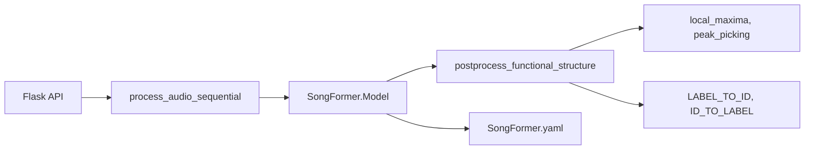

# Segmentation Algorithm

<cite>
**Referenced Files in This Document**
- [SongFormer.py](file://SongFormer/src/SongFormer/models/SongFormer.py)
- [functional.py](file://SongFormer/src/SongFormer/postprocessing/functional.py)
- [helpers.py](file://SongFormer/src/SongFormer/postprocessing/helpers.py)
- [custom_types.py](file://SongFormer/src/SongFormer/dataset/custom_types.py)
- [label2id.py](file://SongFormer/src/SongFormer/dataset/label2id.py)
- [SongFormer.yaml](file://SongFormer/src/SongFormer/configs/SongFormer.yaml)
- [sequential_inference.py](file://SongFormer/sequential_inference.py)
- [app.py](file://SongFormer/app.py)
</cite>

## Table of Contents
1. [Introduction](#introduction)
2. [Project Structure](#project-structure)
3. [Core Components](#core-components)
4. [Architecture Overview](#architecture-overview)
5. [Detailed Component Analysis](#detailed-component-analysis)
6. [Dependency Analysis](#dependency-analysis)
7. [Performance Considerations](#performance-considerations)
8. [Troubleshooting Guide](#troubleshooting-guide)
9. [Conclusion](#conclusion)

## Introduction
This document explains the song segmentation algorithm implemented in SongFormer. It focuses on the functional structure detection pipeline: boundary detection using temporal convolutional layers and transformer encoders, post-processing to convert raw model outputs into meaningful structural segments (verses, choruses, intros, outros), label encoding via label2id mappings, the MsaInfo data structure, temporal downsampling with TimeDownsample layers, loss functions (TV loss and focal loss), and the end-to-end inference process. It also covers performance characteristics, computational complexity, and parameter tuning guidelines for optimal segmentation results.

## Project Structure
The segmentation pipeline spans several modules:
- Model definition and training/inference logic
- Post-processing utilities for boundary detection and label assignment
- Dataset-level label encoding and type definitions
- Configuration controlling model hyperparameters and inference behavior
- Sequential inference orchestration for long-form audio

**Diagram sources**
- [SongFormer.py:247-523](file://SongFormer/src/SongFormer/models/SongFormer.py#L247-L523)
- [functional.py:21-72](file://SongFormer/src/SongFormer/postprocessing/functional.py#L21-L72)
- [helpers.py:15-102](file://SongFormer/src/SongFormer/postprocessing/helpers.py#L15-L102)
- [custom_types.py:1-14](file://SongFormer/src/SongFormer/dataset/custom_types.py#L1-L14)
- [label2id.py:1-164](file://SongFormer/src/SongFormer/dataset/label2id.py#L1-L164)
- [SongFormer.yaml:1-186](file://SongFormer/src/SongFormer/configs/SongFormer.yaml#L1-L186)
- [sequential_inference.py:35-246](file://SongFormer/sequential_inference.py#L35-L246)
- [app.py:332-440](file://SongFormer/app.py#L332-L440)

**Section sources**
- [SongFormer.py:247-523](file://SongFormer/src/SongFormer/models/SongFormer.py#L247-L523)
- [functional.py:21-72](file://SongFormer/src/SongFormer/postprocessing/functional.py#L21-L72)
- [helpers.py:15-102](file://SongFormer/src/SongFormer/postprocessing/helpers.py#L15-L102)
- [custom_types.py:1-14](file://SongFormer/src/SongFormer/dataset/custom_types.py#L1-L14)
- [label2id.py:1-164](file://SongFormer/src/SongFormer/dataset/label2id.py#L1-L164)
- [SongFormer.yaml:1-186](file://SongFormer/src/SongFormer/configs/SongFormer.yaml#L1-L186)
- [sequential_inference.py:35-246](file://SongFormer/sequential_inference.py#L35-L246)
- [app.py:332-440](file://SongFormer/app.py#L332-L440)

## Core Components
- Model backbone: Normalization, mixed-window downsampling, dataset-aware prefix fusion, transformer encoder, and two heads (boundary and functional labels).
- Temporal downsampling: TimeDownsample performs depthwise convolution along time with residual pooling to reduce temporal resolution while preserving dimensionality.
- Transformer encoder: Wrapped transformer encoder with rotary positional embeddings and flash attention.
- Heads: Fully connected heads with configurable hidden layers for boundary and functional classification.
- Losses: Binary cross-entropy for boundaries plus Total Variation (TV) loss for boundary smoothing; focal loss for functional classification.
- Post-processing: Converts logits to boundary candidates via local maxima filtering and peak picking, assigns labels per segment, and produces MsaInfo.

**Section sources**
- [SongFormer.py:247-523](file://SongFormer/src/SongFormer/models/SongFormer.py#L247-L523)
- [SongFormer.py:90-142](file://SongFormer/src/SongFormer/models/SongFormer.py#L90-L142)
- [SongFormer.py:39-82](file://SongFormer/src/SongFormer/models/SongFormer.py#L39-L82)
- [SongFormer.py:152-245](file://SongFormer/src/SongFormer/models/SongFormer.py#L152-L245)
- [SongFormer.py:21-37](file://SongFormer/src/SongFormer/models/SongFormer.py#L21-L37)
- [SongFormer.py:442-497](file://SongFormer/src/SongFormer/models/SongFormer.py#L442-L497)
- [functional.py:21-72](file://SongFormer/src/SongFormer/postprocessing/functional.py#L21-L72)
- [helpers.py:15-102](file://SongFormer/src/SongFormer/postprocessing/helpers.py#L15-L102)

## Architecture Overview
The segmentation pipeline transforms raw SSL embeddings into structural segments. The model downsamples temporally, fuses dataset-specific prefixes, encodes with a transformer, predicts boundaries and functional labels, and post-processes to produce MsaInfo.

**Diagram sources**
- [SongFormer.py:499-523](file://SongFormer/src/SongFormer/models/SongFormer.py#L499-L523)
- [SongFormer.py:401-440](file://SongFormer/src/SongFormer/models/SongFormer.py#L401-L440)
- [functional.py:21-72](file://SongFormer/src/SongFormer/postprocessing/functional.py#L21-L72)

## Detailed Component Analysis

### Model and Heads
- Head: A flexible MLP head with configurable hidden layers and activation, reshaping inputs to per-frame logits.
- WrapedTransformerEncoder: Projects input dimensionality if needed, then applies an efficient transformer encoder with rotary embeddings and flash attention.
- Model: Orchestrates normalization, downsampling, dataset prefix fusion, transformer encoding, and dual heads for boundary and functional classification. It exposes forward, compute_losses, infer, and infer_with_metrics.

**Diagram sources**
- [SongFormer.py:11-37](file://SongFormer/src/SongFormer/models/SongFormer.py#L11-L37)
- [SongFormer.py:39-82](file://SongFormer/src/SongFormer/models/SongFormer.py#L39-L82)
- [SongFormer.py:247-523](file://SongFormer/src/SongFormer/models/SongFormer.py#L247-L523)

**Section sources**
- [SongFormer.py:11-37](file://SongFormer/src/SongFormer/models/SongFormer.py#L11-L37)
- [SongFormer.py:39-82](file://SongFormer/src/SongFormer/models/SongFormer.py#L39-L82)
- [SongFormer.py:247-523](file://SongFormer/src/SongFormer/models/SongFormer.py#L247-L523)

### Temporal Downsampling (TimeDownsample)
- Implements a depthwise convolution along the time dimension followed by a pointwise convolution, residual connection via average pooling, normalization, activation, and dropout.
- Reduces temporal resolution by stride while maintaining or adjusting channel dimensionality.

**Diagram sources**
- [SongFormer.py:90-142](file://SongFormer/src/SongFormer/models/SongFormer.py#L90-L142)

**Section sources**
- [SongFormer.py:90-142](file://SongFormer/src/SongFormer/models/SongFormer.py#L90-L142)

### Transformer Encoder Wrapper
- Conditionally projects input dimensions to match transformer input dim, then applies an efficient encoder with dropout and rotary positional embeddings.

**Section sources**
- [SongFormer.py:39-82](file://SongFormer/src/SongFormer/models/SongFormer.py#L39-L82)

### Heads: Boundary and Functional Classification
- Boundary head: Predicts per-frame boundary logits (single output).
- Functional head: Predicts per-frame functional class logits (num_classes).

**Section sources**
- [SongFormer.py:283-284](file://SongFormer/src/SongFormer/models/SongFormer.py#L283-L284)

### Loss Functions
- Boundary loss: Binary cross-entropy with logits on widened boundaries.
- TV loss: 1D Total Variation loss on boundary logits to smooth predictions and penalize rapid changes, with optional spatial weighting near boundaries.
- Functional loss: Cross-entropy with optional focal weighting to handle class imbalance.

**Diagram sources**
- [SongFormer.py:442-497](file://SongFormer/src/SongFormer/models/SongFormer.py#L442-L497)
- [SongFormer.py:152-199](file://SongFormer/src/SongFormer/models/SongFormer.py#L152-L199)
- [SongFormer.py:201-245](file://SongFormer/src/SongFormer/models/SongFormer.py#L201-L245)

**Section sources**
- [SongFormer.py:442-497](file://SongFormer/src/SongFormer/models/SongFormer.py#L442-L497)
- [SongFormer.py:152-199](file://SongFormer/src/SongFormer/models/SongFormer.py#L152-L199)
- [SongFormer.py:201-245](file://SongFormer/src/SongFormer/models/SongFormer.py#L201-L245)

### Post-processing: From Logits to MsaInfo
- Converts boundary logits to probabilities and functional logits to per-frame class probabilities.
- Applies local maxima filtering and peak picking to obtain boundary candidates.
- Ensures first and last boundaries are at start and end times.
- Splits functional probabilities by detected boundaries and assigns labels by majority vote per segment.
- Produces MsaInfo: a list of (time, label) tuples ending with "end".

**Diagram sources**
- [functional.py:21-72](file://SongFormer/src/SongFormer/postprocessing/functional.py#L21-L72)
- [helpers.py:15-102](file://SongFormer/src/SongFormer/postprocessing/helpers.py#L15-L102)

**Section sources**
- [functional.py:21-72](file://SongFormer/src/SongFormer/postprocessing/functional.py#L21-L72)
- [helpers.py:15-102](file://SongFormer/src/SongFormer/postprocessing/helpers.py#L15-L102)

### Label Encoding and MsaInfo
- LABEL_TO_ID and ID_TO_LABEL define the mapping from labels to integer IDs and back.
- MsaInfo is a typed list of (timestamp: float, label: str) tuples, used to represent structural segments.

**Section sources**
- [label2id.py:1-164](file://SongFormer/src/SongFormer/dataset/label2id.py#L1-L164)
- [custom_types.py:1-14](file://SongFormer/src/SongFormer/dataset/custom_types.py#L1-L14)

### Inference Pipeline
- Sequential inference processes long audio by sliding windows, computes SSL embeddings, fuses representations, runs SongFormer inference, averages logits across overlapping windows, and post-processes to MsaInfo.
- The Flask API initializes models, orchestrates inference, and returns formatted segments.

**Diagram sources**
- [sequential_inference.py:35-246](file://SongFormer/sequential_inference.py#L35-L246)
- [SongFormer.py:401-440](file://SongFormer/src/SongFormer/models/SongFormer.py#L401-L440)
- [functional.py:21-72](file://SongFormer/src/SongFormer/postprocessing/functional.py#L21-L72)
- [app.py:332-440](file://SongFormer/app.py#L332-L440)

**Section sources**
- [sequential_inference.py:35-246](file://SongFormer/sequential_inference.py#L35-L246)
- [SongFormer.py:401-440](file://SongFormer/src/SongFormer/models/SongFormer.py#L401-L440)
- [functional.py:21-72](file://SongFormer/src/SongFormer/postprocessing/functional.py#L21-L72)
- [app.py:332-440](file://SongFormer/app.py#L332-L440)

## Dependency Analysis
- Model depends on:
  - Post-processing functions for converting logits to segments.
  - Dataset label mappings for decoding labels.
  - Configuration for frame rates, downsampling, and loss weights.
- Post-processing depends on:
  - Helpers for local maxima filtering and peak picking.
  - Label mappings for decoding IDs to labels.
- Inference depends on:
  - Sequential inference to accumulate logits across windows.
  - Flask API to orchestrate model loading and request handling.

**Diagram sources**
- [SongFormer.py:247-523](file://SongFormer/src/SongFormer/models/SongFormer.py#L247-L523)
- [functional.py:21-72](file://SongFormer/src/SongFormer/postprocessing/functional.py#L21-L72)
- [helpers.py:15-102](file://SongFormer/src/SongFormer/postprocessing/helpers.py#L15-L102)
- [label2id.py:1-164](file://SongFormer/src/SongFormer/dataset/label2id.py#L1-L164)
- [SongFormer.yaml:1-186](file://SongFormer/src/SongFormer/configs/SongFormer.yaml#L1-L186)
- [sequential_inference.py:35-246](file://SongFormer/sequential_inference.py#L35-L246)
- [app.py:332-440](file://SongFormer/app.py#L332-L440)

**Section sources**
- [SongFormer.py:247-523](file://SongFormer/src/SongFormer/models/SongFormer.py#L247-L523)
- [functional.py:21-72](file://SongFormer/src/SongFormer/postprocessing/functional.py#L21-L72)
- [helpers.py:15-102](file://SongFormer/src/SongFormer/postprocessing/helpers.py#L15-L102)
- [label2id.py:1-164](file://SongFormer/src/SongFormer/dataset/label2id.py#L1-L164)
- [SongFormer.yaml:1-186](file://SongFormer/src/SongFormer/configs/SongFormer.yaml#L1-L186)
- [sequential_inference.py:35-246](file://SongFormer/sequential_inference.py#L35-L246)
- [app.py:332-440](file://SongFormer/app.py#L332-L440)

## Performance Considerations
- Temporal downsampling reduces computation by decreasing sequence length while preserving representation capacity via dimension matching.
- Transformer encoder with rotary embeddings and flash attention improves efficiency and scalability.
- Post-processing uses vectorized operations (sliding windows and argrelextrema) for boundary detection; peak picking and local maxima filtering are efficient for the given frame rates.
- Batch processing of 30-second chunks and averaging logits across overlapping windows improve robustness and reduce artifacts.
- Device selection defaults to CPU on Apple Silicon due to MPS op coverage; CUDA or MPS can be used with caution.

[No sources needed since this section provides general guidance]

## Troubleshooting Guide
- Incorrect boundary detection:
  - Verify local maxima filter size and peak picking windows in configuration.
  - Check that boundary logits are not masked incorrectly by label_id_masks.
- Label misclassification:
  - Inspect label_focal_loss parameters and dataset-specific allowed label IDs.
  - Ensure dataset_id_allowed_label_ids align with the chosen dataset label.
- Inference artifacts:
  - Confirm frame rates and downsampling ratios match configuration.
  - Validate that the first and last boundaries are enforced in post-processing.
- Performance issues:
  - Prefer CPU on Apple Silicon unless MPS fallback is acceptable.
  - Use CUDA when available and memory permits.

**Section sources**
- [SongFormer.py:442-497](file://SongFormer/src/SongFormer/models/SongFormer.py#L442-L497)
- [SongFormer.py:401-440](file://SongFormer/src/SongFormer/models/SongFormer.py#L401-L440)
- [SongFormer.yaml:34-78](file://SongFormer/src/SongFormer/configs/SongFormer.yaml#L34-L78)
- [label2id.py:90-164](file://SongFormer/src/SongFormer/dataset/label2id.py#L90-L164)
- [app.py:117-155](file://SongFormer/app.py#L117-L155)

## Conclusion
SongFormer’s segmentation algorithm combines temporal convolutional downsampling, a transformer encoder, and dual heads for boundary and functional classification. Robust post-processing converts raw logits into interpretable structural segments using local maxima filtering, peak picking, and label assignment. The label encoding scheme and MsaInfo structure ensure consistent labeling across datasets. Proper configuration of downsampling, frame rates, and loss weights yields strong segmentation performance, with careful tuning recommended for optimal results.