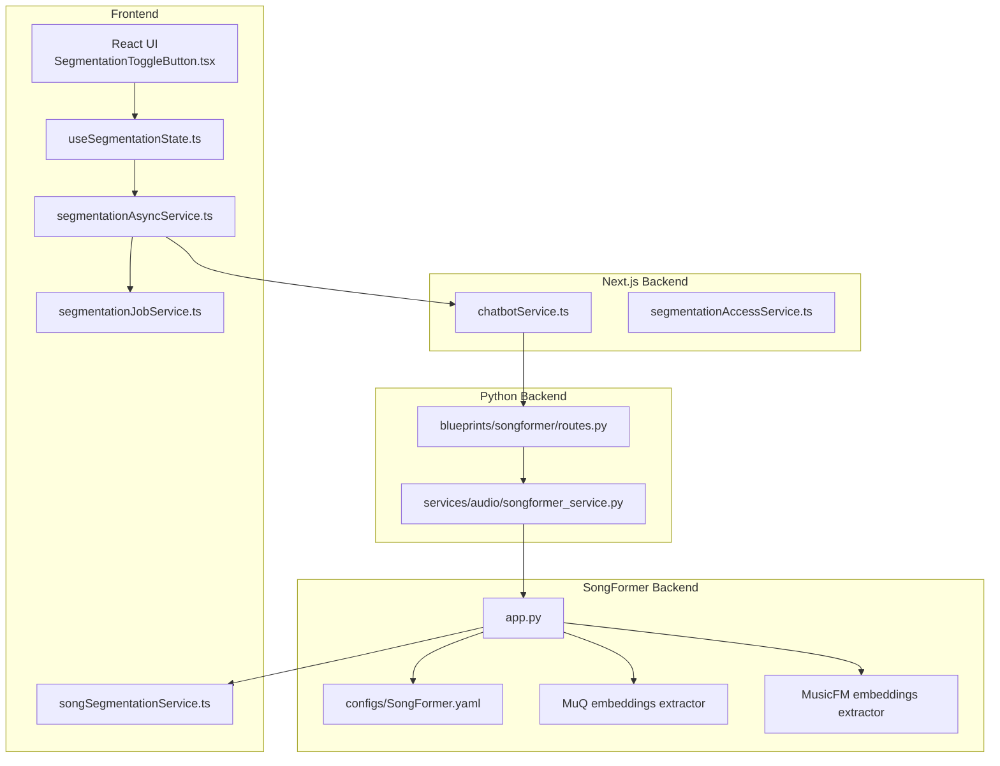
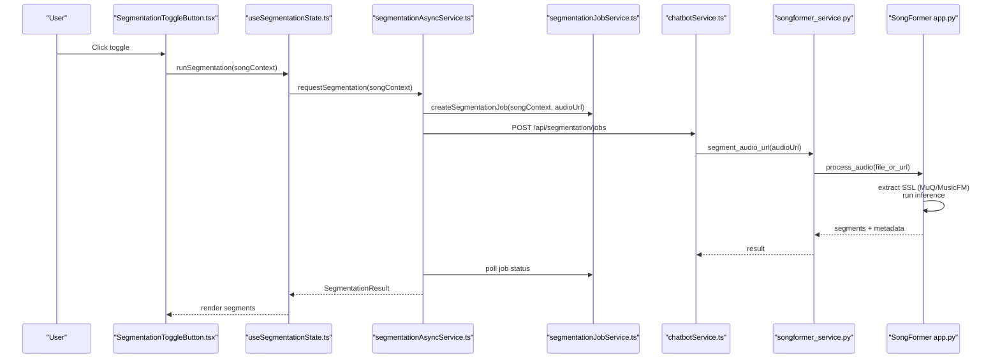
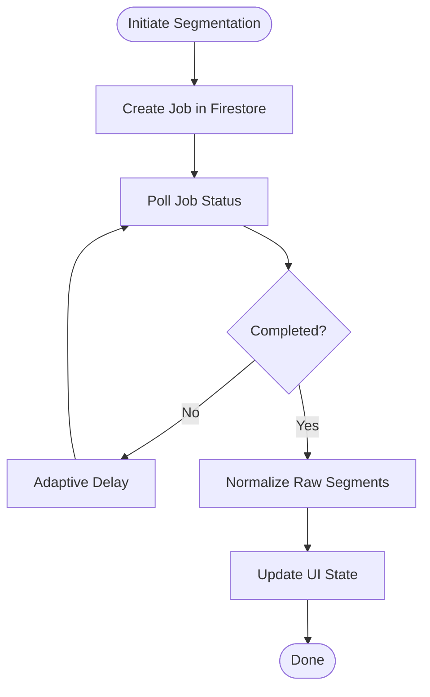
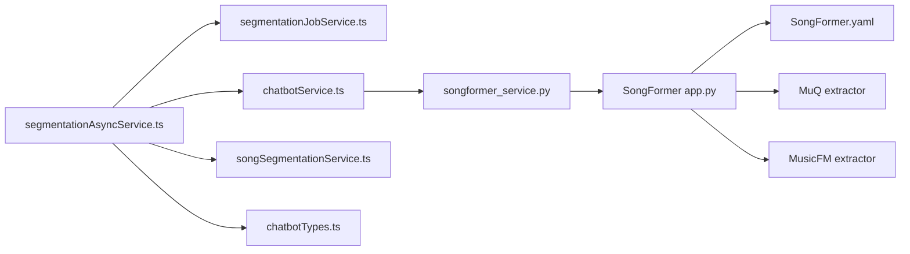

# Song Segmentation

<cite>
**Referenced Files in This Document**
- [README.md](file://SongFormer/README.md)
- [app.py](file://SongFormer/app.py)
- [SongFormer.yaml](file://SongFormer/src/SongFormer/configs/SongFormer.yaml)
- [routes.py](file://python_backend/blueprints/songformer/routes.py)
- [songformer_service.py](file://python_backend/services/audio/songformer_service.py)
- [segmentationAsyncService.ts](file://src/services/api/segmentationAsyncService.ts)
- [segmentationJobService.ts](file://src/services/firebase/segmentationJobService.ts)
- [songSegmentationService.ts](file://src/services/lyrics/songSegmentationService.ts)
- [chatbotService.ts](file://src/services/api/chatbotService.ts)
- [useSegmentationState.ts](file://src/hooks/lyrics/useSegmentationState.ts)
- [SegmentationToggleButton.tsx](file://src/components/analysis/SegmentationToggleButton.tsx)
- [segmentationSections.ts](file://src/utils/segmentationSections.ts)
- [chatbotTypes.ts](file://src/types/chatbotTypes.ts)
- [get_embeddings.py](file://SongFormer/src/data_pipeline/obtain_SSL_representation/MuQ/get_embeddings.py)
- [get_embeddings_mp.py](file://SongFormer/src/data_pipeline/obtain_SSL_representation/MusicFM/get_embeddings_mp.py)
- [segmentationAccessService.ts](file://src/services/api/segmentationAccessService.ts)
</cite>

## Table of Contents
1. [Introduction](#introduction)
2. [Project Structure](#project-structure)
3. [Core Components](#core-components)
4. [Architecture Overview](#architecture-overview)
5. [Detailed Component Analysis](#detailed-component-analysis)
6. [Dependency Analysis](#dependency-analysis)
7. [Performance Considerations](#performance-considerations)
8. [Troubleshooting Guide](#troubleshooting-guide)
9. [Conclusion](#conclusion)
10. [Appendices](#appendices)

## Introduction
This document explains the SongFormer-based song segmentation feature integrated into ChordMiniApp. It covers the SongFormer architecture, the SSL representation extraction pipeline for MuQ and MusicFM models, the segmentation algorithm for structural sections (verses, choruses, bridges, etc.), and the integration with ChordMiniApp’s frontend and backend. It documents the asynchronous job processing, Firebase-backed caching and persistence, configuration options, user workflow, performance characteristics, and troubleshooting guidance.

## Project Structure
The segmentation feature spans three main areas:
- Standalone SongFormer backend (Flask) for structural segmentation
- Python backend service that wraps and initializes SongFormer
- Frontend orchestration and UI integration for asynchronous job processing and result visualization

**Diagram sources**
- [app.py:549-687](file://SongFormer/app.py#L549-L687)
- [routes.py:14-42](file://python_backend/blueprints/songformer/routes.py#L14-L42)
- [songformer_service.py:118-140](file://python_backend/services/audio/songformer_service.py#L118-L140)
- [segmentationAsyncService.ts:120-162](file://src/services/api/segmentationAsyncService.ts#L120-L162)
- [segmentationJobService.ts:147-179](file://src/services/firebase/segmentationJobService.ts#L147-L179)
- [songSegmentationService.ts:162-181](file://src/services/lyrics/songSegmentationService.ts#L162-L181)
- [SongFormer.yaml:1-186](file://SongFormer/src/SongFormer/configs/SongFormer.yaml#L1-L186)
- [get_embeddings.py:1-203](file://SongFormer/src/data_pipeline/obtain_SSL_representation/MuQ/get_embeddings.py#L1-L203)
- [get_embeddings_mp.py:1-215](file://SongFormer/src/data_pipeline/obtain_SSL_representation/MusicFM/get_embeddings_mp.py#L1-L215)

**Section sources**
- [README.md:1-170](file://SongFormer/README.md#L1-L170)
- [app.py:549-687](file://SongFormer/app.py#L549-L687)
- [routes.py:1-53](file://python_backend/blueprints/songformer/routes.py#L1-L53)
- [songformer_service.py:1-140](file://python_backend/services/audio/songformer_service.py#L1-L140)

## Core Components
- SongFormer backend (Flask): Provides health checks, info, and segmentation endpoints. Handles model initialization, audio ingestion, SSL embedding extraction (MuQ and MusicFM), downstream inference, and result caching.
- Python backend service: Wraps the SongFormer runtime, manages model loading, and executes segmentation for given audio URLs.
- Frontend orchestration: Asynchronous job creation and polling, progress reporting, and result normalization for UI consumption.
- Firebase job store: Persistent job lifecycle tracking, TTL-based cleanup, and deduplication by request hash.
- SSL representation extractors: Batched extraction of hidden states from MuQ and MusicFM for training/inference.

**Section sources**
- [app.py:562-687](file://SongFormer/app.py#L562-L687)
- [songformer_service.py:21-140](file://python_backend/services/audio/songformer_service.py#L21-L140)
- [segmentationAsyncService.ts:101-261](file://src/services/api/segmentationAsyncService.ts#L101-L261)
- [segmentationJobService.ts:29-336](file://src/services/firebase/segmentationJobService.ts#L29-L336)
- [get_embeddings.py:1-203](file://SongFormer/src/data_pipeline/obtain_SSL_representation/MuQ/get_embeddings.py#L1-L203)
- [get_embeddings_mp.py:1-215](file://SongFormer/src/data_pipeline/obtain_SSL_representation/MusicFM/get_embeddings_mp.py#L1-L215)

## Architecture Overview
The end-to-end flow:
1. User initiates segmentation from the UI.
2. Frontend creates a segmentation job and polls status asynchronously.
3. Backend validates access code and forwards the request to the Python backend.
4. Python backend initializes SongFormer and calls the SongFormer backend.
5. SongFormer extracts SSL embeddings from MuQ and MusicFM, runs inference, and returns normalized segments.
6. Frontend normalizes raw segments and renders them in the analysis UI.

**Diagram sources**
- [SegmentationToggleButton.tsx:18-85](file://src/components/analysis/SegmentationToggleButton.tsx#L18-L85)
- [useSegmentationState.ts:39-82](file://src/hooks/lyrics/useSegmentationState.ts#L39-L82)
- [segmentationAsyncService.ts:120-196](file://src/services/api/segmentationAsyncService.ts#L120-L196)
- [segmentationJobService.ts:147-179](file://src/services/firebase/segmentationJobService.ts#L147-L179)
- [chatbotService.ts:265-284](file://src/services/api/chatbotService.ts#L265-L284)
- [songformer_service.py:118-140](file://python_backend/services/audio/songformer_service.py#L118-L140)
- [app.py:597-687](file://SongFormer/app.py#L597-L687)

## Detailed Component Analysis

### SongFormer Backend (Flask)
- Endpoints:
  - Health: optional warmup to preload models
  - Info: runtime and environment details
  - Segment: accepts audioUrl or multipart file; supports async callback
- Device selection:
  - Auto-selects CPU for production; CUDA or MPS for local dev; MPS fallback can be enabled experimentally
- Caching:
  - In-memory result cache with TTL and max entries
- Embedding extraction:
  - Uses MuQ and MusicFM to produce hidden states from 420s windows; optional batching for 30s chunks
- Post-processing:
  - Rule-based cleaning and formatting into labeled segments

**Section sources**
- [README.md:5-170](file://SongFormer/README.md#L5-L170)
- [app.py:562-687](file://SongFormer/app.py#L562-L687)
- [SongFormer.yaml:1-186](file://SongFormer/src/SongFormer/configs/SongFormer.yaml#L1-L186)

### Python Backend Service Wrapper
- Loads SongFormer runtime dynamically from a configurable root
- Initializes models (MuQ, MusicFM, SongFormer) once
- Downloads remote audio or reads local files, then delegates to SongFormer
- Returns structured segments with model/device metadata

**Section sources**
- [songformer_service.py:21-140](file://python_backend/services/audio/songformer_service.py#L21-L140)

### Frontend Orchestration and Job Management
- Asynchronous job creation and polling with adaptive delays based on song duration
- Browser worker invokes SongFormer backend directly with async callback
- Firebase-backed job store tracks created/processing/completed/failed states with TTLs
- Access code validation enforced in production

**Diagram sources**
- [segmentationAsyncService.ts:164-196](file://src/services/api/segmentationAsyncService.ts#L164-L196)
- [segmentationJobService.ts:147-179](file://src/services/firebase/segmentationJobService.ts#L147-L179)
- [songSegmentationService.ts:162-181](file://src/services/lyrics/songSegmentationService.ts#L162-L181)

**Section sources**
- [segmentationAsyncService.ts:101-261](file://src/services/api/segmentationAsyncService.ts#L101-L261)
- [segmentationJobService.ts:29-336](file://src/services/firebase/segmentationJobService.ts#L29-L336)
- [segmentationAccessService.ts:9-64](file://src/services/api/segmentationAccessService.ts#L9-L64)

### SSL Representation Extraction Pipeline (MuQ and MusicFM)
- MuQ:
  - Loads pretrained model, iterates 420s windows with 420s hop, saves hidden states from a specific layer
  - Multi-process with GPU assignment and slow start to avoid GPU overload
- MusicFM:
  - Loads model with stats and weights, computes hidden states similarly
  - Parallelized with GPU utilization and periodic cache clearing

**Section sources**
- [get_embeddings.py:1-203](file://SongFormer/src/data_pipeline/obtain_SSL_representation/MuQ/get_embeddings.py#L1-L203)
- [get_embeddings_mp.py:1-215](file://SongFormer/src/data_pipeline/obtain_SSL_representation/MusicFM/get_embeddings_mp.py#L1-L215)

### Segmentation Algorithm and Normalization
- SongFormer produces ordered boundary-time plus label tuples; normalization:
  - Clamp times to effective duration
  - Merge adjacent segments of identical type/label
  - Fill gaps with inferred labels (e.g., intro/outro)
  - Build normalized result with metadata and analysis summary

**Section sources**
- [app.py:384-421](file://SongFormer/app.py#L384-L421)
- [songSegmentationService.ts:71-143](file://src/services/lyrics/songSegmentationService.ts#L71-L143)

### Integration with ChordMiniApp UI
- Toggle button controls visibility of segmentation overlay
- Hook validates prerequisites (beat data, accessible audio URL) and triggers segmentation
- UI toast informs about access code requirements

**Section sources**
- [SegmentationToggleButton.tsx:18-85](file://src/components/analysis/SegmentationToggleButton.tsx#L18-L85)
- [useSegmentationState.ts:39-82](file://src/hooks/lyrics/useSegmentationState.ts#L39-L82)

## Dependency Analysis
- Frontend depends on:
  - Async service for job orchestration
  - Firebase job service for persistence
  - Normalization service for raw segments
  - Access service for code validation
- Backend depends on:
  - SongFormer runtime and models
  - SSL extractors for training/inference
- Data types define the contract between frontend and backend

**Diagram sources**
- [segmentationAsyncService.ts:101-261](file://src/services/api/segmentationAsyncService.ts#L101-L261)
- [segmentationJobService.ts:147-179](file://src/services/firebase/segmentationJobService.ts#L147-L179)
- [chatbotService.ts:265-284](file://src/services/api/chatbotService.ts#L265-L284)
- [songformer_service.py:118-140](file://python_backend/services/audio/songformer_service.py#L118-L140)
- [app.py:597-687](file://SongFormer/app.py#L597-L687)
- [SongFormer.yaml:1-186](file://SongFormer/src/SongFormer/configs/SongFormer.yaml#L1-L186)
- [get_embeddings.py:1-203](file://SongFormer/src/data_pipeline/obtain_SSL_representation/MuQ/get_embeddings.py#L1-L203)
- [get_embeddings_mp.py:1-215](file://SongFormer/src/data_pipeline/obtain_SSL_representation/MusicFM/get_embeddings_mp.py#L1-L215)
- [songSegmentationService.ts:162-181](file://src/services/lyrics/songSegmentationService.ts#L162-L181)
- [chatbotTypes.ts:93-126](file://src/types/chatbotTypes.ts#L93-L126)

**Section sources**
- [chatbotTypes.ts:93-126](file://src/types/chatbotTypes.ts#L93-L126)

## Performance Considerations
- Device selection:
  - Production defaults to CPU; local dev may use CUDA or MPS (with caveats)
  - Experimental MPS fallback can be enabled via environment variables
- Memory and GPU:
  - SongFormer is heavier than lighter models; prefer CPU for testing and GPU only when latency demands it
  - Torch thread counts and device cache clearing are logged during processing
- Processing time estimation:
  - Initial delay scales with song duration for long songs; polling intervals are adaptive
- Caching:
  - SongFormer result cache reduces repeated processing for identical audio sources

**Section sources**
- [README.md:93-170](file://SongFormer/README.md#L93-L170)
- [app.py:117-154](file://SongFormer/app.py#L117-L154)
- [app.py:184-218](file://SongFormer/app.py#L184-L218)
- [segmentationAsyncService.ts:52-99](file://src/services/api/segmentationAsyncService.ts#L52-L99)

## Troubleshooting Guide
Common issues and resolutions:
- Model loading failures:
  - Verify SONGFORMER_ROOT points to a valid SongFormer installation
  - Ensure required model assets (MuQ/MusicFM/SongFormer) are present
- Embedding extraction errors:
  - Confirm SSL extractor scripts have proper GPU availability and permissions
  - Check input lists and output directories for write permissions
- Segmentation quality problems:
  - Validate audio URL accessibility and duration
  - Ensure beat data is available before segmentation
  - Review normalized segments for gaps or mislabeled regions
- Access code errors:
  - In production, missing or invalid access code will block requests; request or configure the code appropriately

**Section sources**
- [songformer_service.py:24-44](file://python_backend/services/audio/songformer_service.py#L24-L44)
- [get_embeddings.py:1-203](file://SongFormer/src/data_pipeline/obtain_SSL_representation/MuQ/get_embeddings.py#L1-L203)
- [get_embeddings_mp.py:1-215](file://SongFormer/src/data_pipeline/obtain_SSL_representation/MusicFM/get_embeddings_mp.py#L1-L215)
- [useSegmentationState.ts:46-57](file://src/hooks/lyrics/useSegmentationState.ts#L46-L57)
- [segmentationAccessService.ts:26-64](file://src/services/api/segmentationAccessService.ts#L26-L64)

## Conclusion
The SongFormer integration provides robust, asynchronous song segmentation with a clear separation of concerns across frontend, backend, and model layers. The system leverages SSL embeddings from MuQ and MusicFM, applies a rule-based post-processor, and normalizes results for seamless UI integration. With Firebase-backed job management and adaptive polling, it delivers a reliable user experience for structural analysis.

## Appendices

### Configuration Options
- SongFormer backend:
  - Environment variables for device selection, MPS fallback, result cache, and batching
  - Model name, checkpoint, and config paths
- Frontend:
  - Access code enforcement and request email for support
  - Base URL for API calls

**Section sources**
- [README.md:43-91](file://SongFormer/README.md#L43-L91)
- [app.py:54-64](file://SongFormer/app.py#L54-L64)
- [segmentationAccessService.ts:13-24](file://src/services/api/segmentationAccessService.ts#L13-L24)

### User Workflow
1. Ensure beat data is available and audio URL is accessible
2. Click the segmentation toggle to initiate processing
3. Observe progress and receive normalized segments in the analysis UI
4. Toggle overlay visibility or reset state as needed

**Section sources**
- [useSegmentationState.ts:39-82](file://src/hooks/lyrics/useSegmentationState.ts#L39-L82)
- [SegmentationToggleButton.tsx:18-85](file://src/components/analysis/SegmentationToggleButton.tsx#L18-L85)