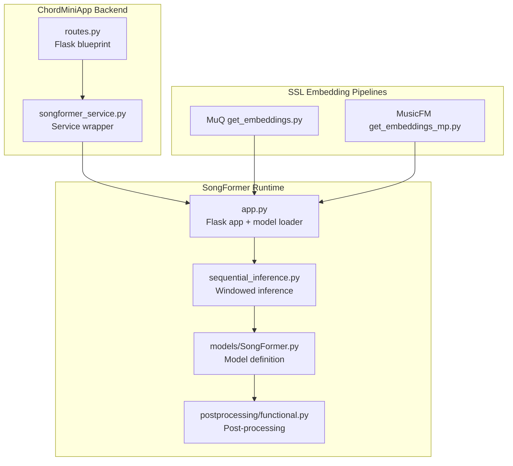
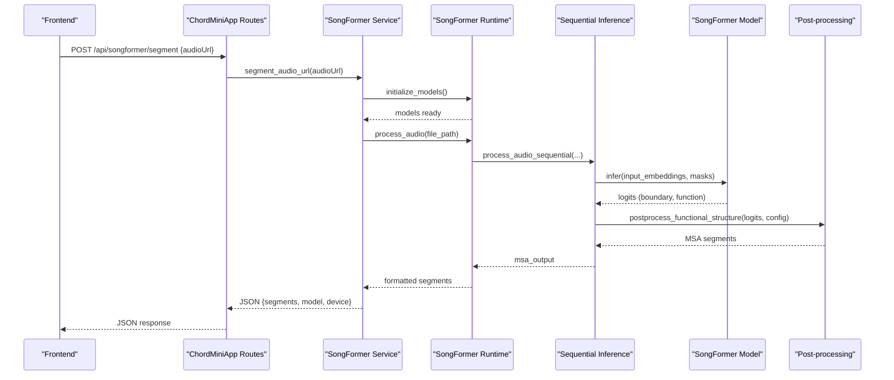
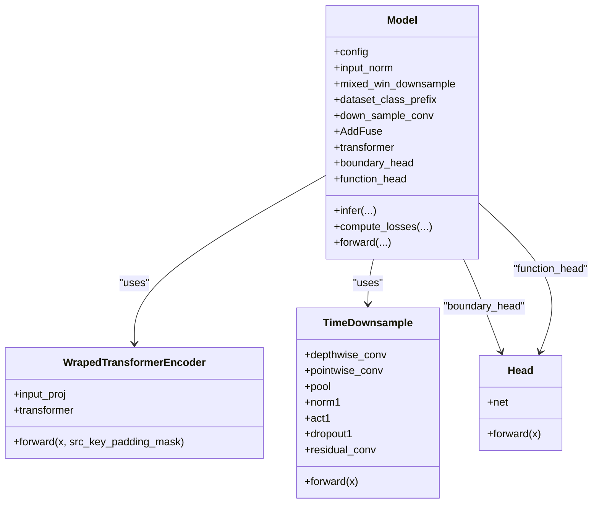
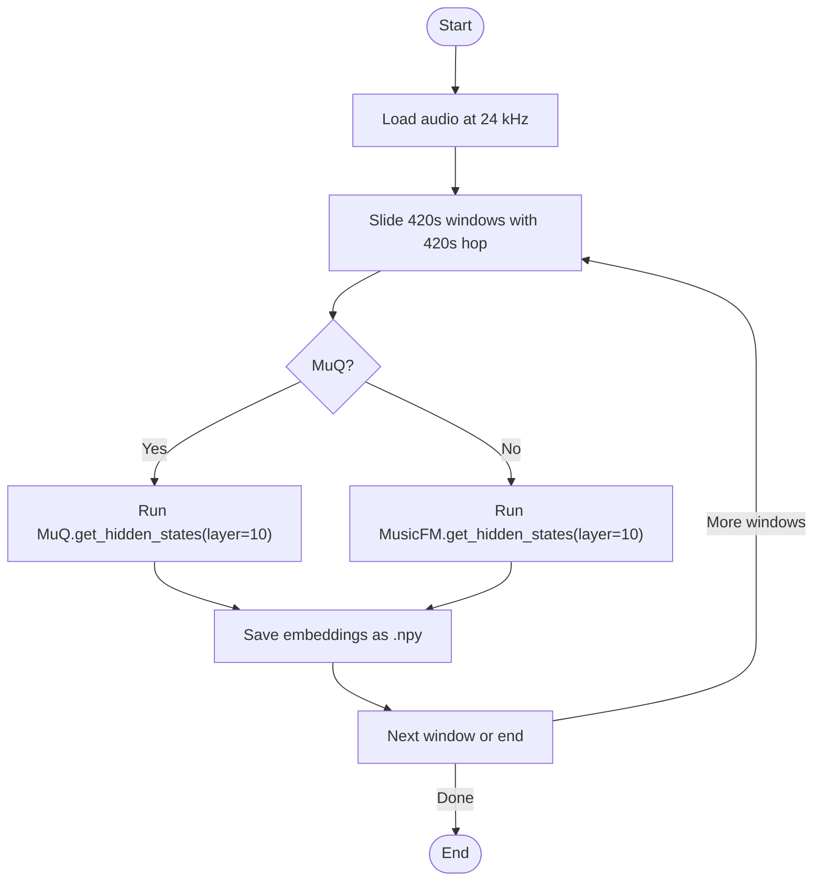
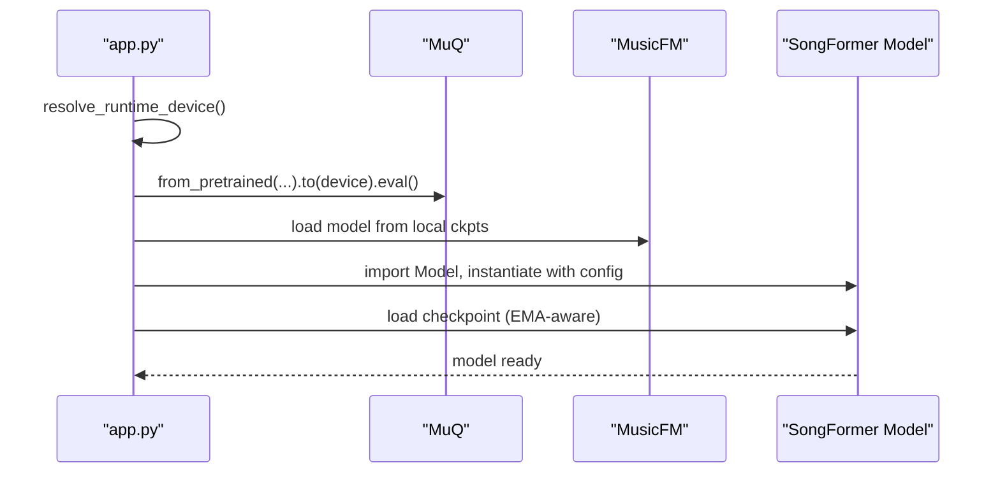
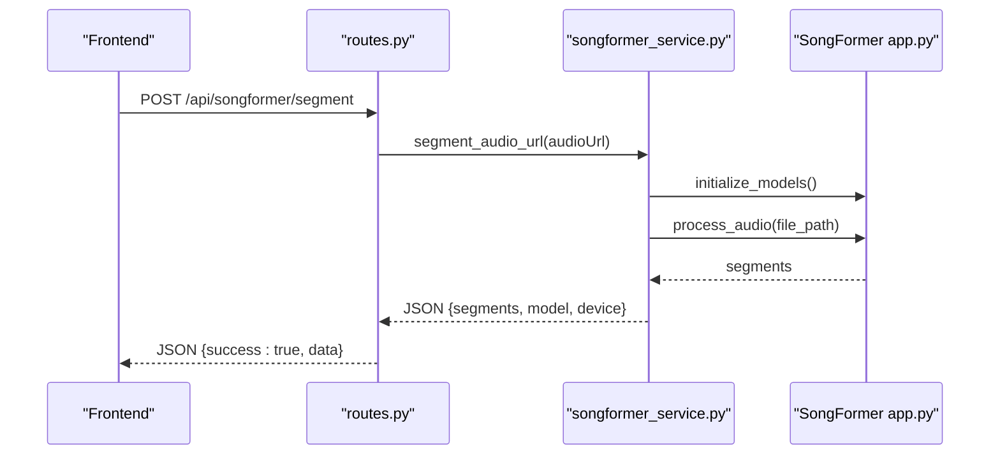
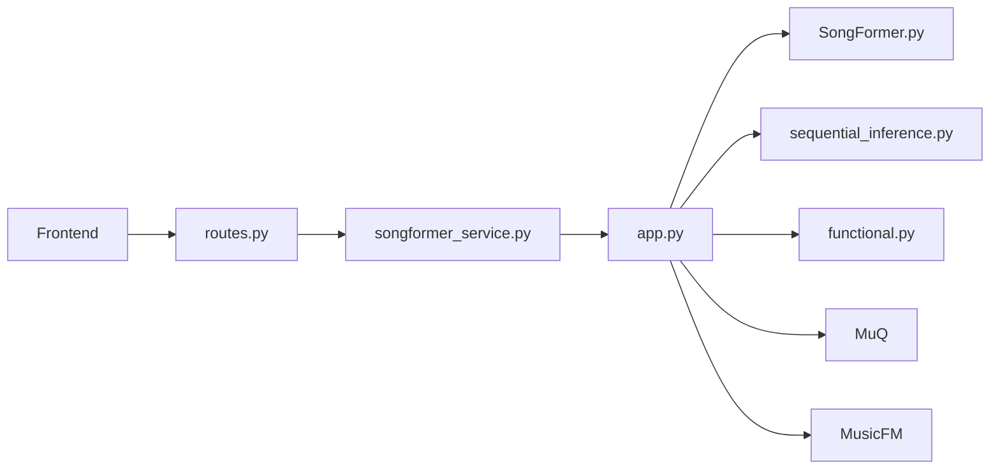

# SongFormer Integration

<cite>
**Referenced Files in This Document**
- [SongFormer.yaml](file://SongFormer/src/SongFormer/configs/SongFormer.yaml)
- [SongFormer.py](file://SongFormer/src/SongFormer/models/SongFormer.py)
- [get_embeddings.py](file://SongFormer/src/data_pipeline/obtain_SSL_representation/MuQ/get_embeddings.py)
- [get_embeddings_mp.py](file://SongFormer/src/data_pipeline/obtain_SSL_representation/MusicFM/get_embeddings_mp.py)
- [app.py](file://SongFormer/app.py)
- [sequential_inference.py](file://SongFormer/sequential_inference.py)
- [routes.py](file://python_backend/blueprints/songformer/routes.py)
- [songformer_service.py](file://python_backend/services/audio/songformer_service.py)
- [functional.py](file://SongFormer/src/SongFormer/postprocessing/functional.py)
- [helpers.py](file://SongFormer/src/SongFormer/postprocessing/helpers.py)
- [custom_types.py](file://SongFormer/src/SongFormer/dataset/custom_types.py)
- [label2id.py](file://SongFormer/src/SongFormer/dataset/label2id.py)
</cite>

## Table of Contents
1. [Introduction](#introduction)
2. [Project Structure](#project-structure)
3. [Core Components](#core-components)
4. [Architecture Overview](#architecture-overview)
5. [Detailed Component Analysis](#detailed-component-analysis)
6. [Dependency Analysis](#dependency-analysis)
7. [Performance Considerations](#performance-considerations)
8. [Troubleshooting Guide](#troubleshooting-guide)
9. [Conclusion](#conclusion)

## Introduction
This document explains the SongFormer integration within ChordMiniApp. It covers the SongFormer model architecture (transformer encoder, boundary detection head, and functional structure classification head), the SSL representation extraction pipeline for MuQ and MusicFM, configuration options, model loading and initialization, GPU memory considerations, inference optimization, integration with ChordMiniApp’s backend, and troubleshooting guidance.

## Project Structure
The SongFormer integration spans two primary areas:
- The standalone SongFormer runtime (Python + Flask) that performs segmentation and exposes an API endpoint.
- The ChordMiniApp Python backend that orchestrates audio ingestion, invokes the SongFormer runtime via a service wrapper, and returns structured results.

**Diagram sources**
- [routes.py:14-53](file://python_backend/blueprints/songformer/routes.py#L14-L53)
- [songformer_service.py:21-140](file://python_backend/services/audio/songformer_service.py#L21-L140)
- [app.py:549-687](file://SongFormer/app.py#L549-L687)
- [sequential_inference.py:35-246](file://SongFormer/sequential_inference.py#L35-L246)
- [SongFormer.py:247-523](file://SongFormer/src/SongFormer/models/SongFormer.py#L247-L523)
- [functional.py:21-72](file://SongFormer/src/SongFormer/postprocessing/functional.py#L21-L72)
- [get_embeddings.py:106-203](file://SongFormer/src/data_pipeline/obtain_SSL_representation/MuQ/get_embeddings.py#L106-L203)
- [get_embeddings_mp.py:122-215](file://SongFormer/src/data_pipeline/obtain_SSL_representation/MusicFM/get_embeddings_mp.py#L122-L215)

**Section sources**
- [routes.py:14-53](file://python_backend/blueprints/songformer/routes.py#L14-L53)
- [songformer_service.py:21-140](file://python_backend/services/audio/songformer_service.py#L21-L140)
- [app.py:549-687](file://SongFormer/app.py#L549-L687)
- [sequential_inference.py:35-246](file://SongFormer/sequential_inference.py#L35-L246)
- [SongFormer.py:247-523](file://SongFormer/src/SongFormer/models/SongFormer.py#L247-L523)
- [functional.py:21-72](file://SongFormer/src/SongFormer/postprocessing/functional.py#L21-L72)
- [get_embeddings.py:106-203](file://SongFormer/src/data_pipeline/obtain_SSL_representation/MuQ/get_embeddings.py#L106-L203)
- [get_embeddings_mp.py:122-215](file://SongFormer/src/data_pipeline/obtain_SSL_representation/MusicFM/get_embeddings_mp.py#L122-L215)

## Core Components
- Model architecture
  - Input normalization and projection to a mixed-window fused representation.
  - Temporal downsampling via a depthwise + pointwise convolution.
  - Transformer encoder built with x-transformers, with rotary positional embeddings and flash attention.
  - Heads:
    - Boundary head: binary classification for segment boundaries.
    - Functional structure head: multi-class classification over 128 functional labels.
  - Losses:
    - Binary cross-entropy with TV regularization for boundaries.
    - Focal loss for functional labels.
    - Weighted combination of section and function losses.

- SSL embedding extraction
  - MuQ: loads a pretrained model, extracts hidden states from a specific layer, saves per-window embeddings.
  - MusicFM: loads a pretrained model, extracts hidden states from a specific layer, saves per-window embeddings.
  - Both support multi-process batched extraction and configurable window sizes.

- Configuration
  - Input dimensions, downsampling parameters, transformer parameters, loss weights, training hyperparameters, and dataset configuration are defined in the YAML.

**Section sources**
- [SongFormer.py:247-523](file://SongFormer/src/SongFormer/models/SongFormer.py#L247-L523)
- [SongFormer.yaml:1-186](file://SongFormer/src/SongFormer/configs/SongFormer.yaml#L1-L186)
- [get_embeddings.py:106-203](file://SongFormer/src/data_pipeline/obtain_SSL_representation/MuQ/get_embeddings.py#L106-L203)
- [get_embeddings_mp.py:122-215](file://SongFormer/src/data_pipeline/obtain_SSL_representation/MusicFM/get_embeddings_mp.py#L122-L215)

## Architecture Overview
End-to-end flow from ChordMiniApp to SongFormer segmentation:

**Diagram sources**
- [routes.py:14-53](file://python_backend/blueprints/songformer/routes.py#L14-L53)
- [songformer_service.py:105-140](file://python_backend/services/audio/songformer_service.py#L105-L140)
- [app.py:332-440](file://SongFormer/app.py#L332-L440)
- [sequential_inference.py:35-246](file://SongFormer/sequential_inference.py#L35-L246)
- [SongFormer.py:401-441](file://SongFormer/src/SongFormer/models/SongFormer.py#L401-L441)
- [functional.py:21-72](file://SongFormer/src/SongFormer/postprocessing/functional.py#L21-L72)

## Detailed Component Analysis

### SongFormer Model Architecture
The model composes:
- Normalization and linear projection to a mixed-window fused embedding dimension.
- A temporal downsampling block that reduces sequence length and matches transformer input channels.
- An x-transformers encoder with rotary embeddings and flash attention.
- Two heads:
  - Boundary head produces per-frame boundary logits.
  - Functional head predicts per-frame functional labels.

**Diagram sources**
- [SongFormer.py:247-523](file://SongFormer/src/SongFormer/models/SongFormer.py#L247-L523)
- [SongFormer.py:39-82](file://SongFormer/src/SongFormer/models/SongFormer.py#L39-L82)
- [SongFormer.py:90-142](file://SongFormer/src/SongFormer/models/SongFormer.py#L90-L142)
- [SongFormer.py:11-37](file://SongFormer/src/SongFormer/models/SongFormer.py#L11-L37)

**Section sources**
- [SongFormer.py:247-523](file://SongFormer/src/SongFormer/models/SongFormer.py#L247-L523)

### SSL Representation Extraction Pipeline (MuQ and MusicFM)
Both pipelines:
- Load audio at 24 kHz.
- Slide fixed-size windows (default 420 seconds) with a hop (default 420 seconds).
- Extract hidden states from a specific layer and save as NumPy arrays keyed by stem and window index.
- Use multiprocessing per GPU to parallelize work.

**Diagram sources**
- [get_embeddings.py:48-96](file://SongFormer/src/data_pipeline/obtain_SSL_representation/MuQ/get_embeddings.py#L48-L96)
- [get_embeddings_mp.py:42-112](file://SongFormer/src/data_pipeline/obtain_SSL_representation/MusicFM/get_embeddings_mp.py#L42-L112)

**Section sources**
- [get_embeddings.py:106-203](file://SongFormer/src/data_pipeline/obtain_SSL_representation/MuQ/get_embeddings.py#L106-L203)
- [get_embeddings_mp.py:122-215](file://SongFormer/src/data_pipeline/obtain_SSL_representation/MusicFM/get_embeddings_mp.py#L122-L215)

### Configuration Options in SongFormer.yaml
Key categories:
- Input and downsampling: input dimensions, downsampling kernel/stride/padding/dropout.
- Transformer: input/hidden dimensions, number of layers, attention heads, dropout.
- Heads: boundary and functional head hidden dimensions.
- Losses: focal loss alpha/gamma, boundary TV loss beta/lambda/reduction weight, and task weights.
- Training and scheduling: warmup steps, total steps, learning rate, EMA settings.
- Dataset and dataloader: dataset definitions, frame rates, neighbors, slicing duration, and DataLoader settings.
- Optimizer: learning rate, betas, epsilon, weight decay.
- Run configuration: run name, model name, checkpoint directory, max epochs/steps.

**Section sources**
- [SongFormer.yaml:1-186](file://SongFormer/src/SongFormer/configs/SongFormer.yaml#L1-L186)

### Model Loading and Initialization
- Device selection supports CPU, CUDA, and MPS with environment-driven policies.
- Models loaded in order: MuQ, MusicFM, SongFormer.
- SongFormer checkpoint supports .pt or .safetensors; EMA checkpoint loading supported.
- Sequential inference aggregates logits across windows and applies post-processing.

**Diagram sources**
- [app.py:117-154](file://SongFormer/app.py#L117-L154)
- [app.py:242-285](file://SongFormer/app.py#L242-L285)

**Section sources**
- [app.py:117-154](file://SongFormer/app.py#L117-L154)
- [app.py:242-285](file://SongFormer/app.py#L242-L285)

### Inference Optimization Techniques
- Windowed processing with 420s windows and 420s hops.
- Optional batching of 30s chunks when full-sized frames are available.
- Periodic accelerator cache clearing to reduce memory pressure.
- Post-processing filters local maxima and applies peak-picking with configurable windows.
- Aggregation of logits across overlapping windows with averaging.

**Section sources**
- [sequential_inference.py:35-246](file://SongFormer/sequential_inference.py#L35-L246)
- [functional.py:21-72](file://SongFormer/src/SongFormer/postprocessing/functional.py#L21-L72)
- [helpers.py:68-102](file://SongFormer/src/SongFormer/postprocessing/helpers.py#L68-L102)

### Integration Pattern with ChordMiniApp
- Frontend calls /api/songformer/segment with an audioUrl.
- Flask route validates payload and delegates to a service.
- Service resolves SONGFORMER_ROOT, loads the runtime module, initializes models, and runs segmentation.
- Results are returned as segments with labels and timing.

**Diagram sources**
- [routes.py:14-53](file://python_backend/blueprints/songformer/routes.py#L14-L53)
- [songformer_service.py:105-140](file://python_backend/services/audio/songformer_service.py#L105-L140)
- [app.py:332-440](file://SongFormer/app.py#L332-L440)

**Section sources**
- [routes.py:14-53](file://python_backend/blueprints/songformer/routes.py#L14-L53)
- [songformer_service.py:105-140](file://python_backend/services/audio/songformer_service.py#L105-L140)
- [app.py:332-440](file://SongFormer/app.py#L332-L440)

## Dependency Analysis
- The runtime depends on:
  - MuQ and MusicFM for SSL embeddings.
  - x-transformers for the encoder backbone.
  - Post-processing helpers for boundary detection and label assignment.
- The backend depends on:
  - A service wrapper that dynamically imports the runtime module and initializes models.
  - Flask routes that enforce rate limits and handle errors.

**Diagram sources**
- [songformer_service.py:54-104](file://python_backend/services/audio/songformer_service.py#L54-L104)
- [app.py:242-285](file://SongFormer/app.py#L242-L285)
- [SongFormer.py:247-523](file://SongFormer/src/SongFormer/models/SongFormer.py#L247-L523)
- [sequential_inference.py:35-246](file://SongFormer/sequential_inference.py#L35-L246)
- [functional.py:21-72](file://SongFormer/src/SongFormer/postprocessing/functional.py#L21-L72)
- [routes.py:14-53](file://python_backend/blueprints/songformer/routes.py#L14-L53)

**Section sources**
- [songformer_service.py:54-104](file://python_backend/services/audio/songformer_service.py#L54-L104)
- [app.py:242-285](file://SongFormer/app.py#L242-L285)
- [SongFormer.py:247-523](file://SongFormer/src/SongFormer/models/SongFormer.py#L247-L523)
- [sequential_inference.py:35-246](file://SongFormer/sequential_inference.py#L35-L246)
- [functional.py:21-72](file://SongFormer/src/SongFormer/postprocessing/functional.py#L21-L72)
- [routes.py:14-53](file://python_backend/blueprints/songformer/routes.py#L14-L53)

## Performance Considerations
- Device selection:
  - Local development prefers CUDA or MPS; production defaults to CPU.
  - MPS is disabled by default due to unsupported ops; can be enabled via environment variable.
- Memory management:
  - Clear accelerator caches after each model call.
  - Reduce batch size or disable 30s batching if memory constrained.
- Throughput:
  - Increase threads per GPU and GPU count for embedding extraction.
  - Use larger hop sizes to reduce overlap and speed up inference at cost of resolution.
- Accuracy:
  - Adjust local maxima filter size and peak-picking windows to balance precision/recall.

[No sources needed since this section provides general guidance]

## Troubleshooting Guide
Common issues and resolutions:
- CUDA out-of-memory errors
  - Reduce batch size for 30s chunks or disable 30s batching.
  - Clear accelerator cache between stages.
  - Lower window/hop durations to reduce memory footprint.
  - Switch to CPU if GPU memory remains insufficient.

- Model loading failures
  - Verify SONGFORMER_ROOT points to a valid SongFormer directory containing app.py.
  - Ensure local model checkpoints exist for MuQ and MusicFM.
  - Confirm checkpoint format (.pt or .safetensors) and EMA compatibility.

- Embedding extraction problems
  - Ensure input audio list exists and is readable.
  - Confirm output directories are writable.
  - Validate window/hop sizes and minimum audio samples.

- Backend errors
  - Check Flask logs for FileNotFoundError/ValueError exceptions.
  - Inspect async callback failures and network timeouts.
  - Verify audio URLs are accessible and properly formatted.

**Section sources**
- [app.py:117-154](file://SongFormer/app.py#L117-L154)
- [app.py:306-316](file://SongFormer/app.py#L306-L316)
- [songformer_service.py:24-44](file://python_backend/services/audio/songformer_service.py#L24-L44)
- [get_embeddings.py:106-203](file://SongFormer/src/data_pipeline/obtain_SSL_representation/MuQ/get_embeddings.py#L106-L203)
- [get_embeddings_mp.py:122-215](file://SongFormer/src/data_pipeline/obtain_SSL_representation/MusicFM/get_embeddings_mp.py#L122-L215)
- [routes.py:35-42](file://python_backend/blueprints/songformer/routes.py#L35-L42)

## Conclusion
The SongFormer integration in ChordMiniApp combines a robust segmentation model with efficient SSL embedding pipelines and a scalable backend orchestration. By understanding the model architecture, configuration, and runtime behavior, teams can optimize performance, troubleshoot issues, and maintain reliable deployments across environments.