# API Integration and Service Layer

<cite>
**Referenced Files in This Document**
- [apiService.ts](file://src/services/api/apiService.ts)
- [rateLimiting.ts](file://src/utils/rateLimiting.ts)
- [parallelPipelineService.ts](file://src/services/api/parallelPipelineService.ts)
- [segmentationAsyncService.ts](file://src/services/api/segmentationAsyncService.ts)
- [segmentationAsyncService.ts](file://src/services/api/segmentationAsyncService.ts)
- [lyricsService.ts](file://src/services/lyrics/lyricsService.ts)
- [lrclibService.ts](file://src/services/lyrics/lrclibService.ts)
- [customMusicAiClient.ts](file://src/services/api/customMusicAiClient.ts)
- [firebase.ts](file://src/config/firebase.ts)
- [streamingFirebaseUpload.ts](file://src/services/firebase/streamingFirebaseUpload.ts)
- [api.ts](file://src/config/api.ts)
- [genius_service.py](file://python_backend/services/lyrics/genius_service.py)
- [lrclib_service.py](file://python_backend/services/lyrics/lrclib_service.py)
- [orchestrator.py](file://python_backend/services/lyrics/orchestrator.py)
- [error_handlers.py](file://python_backend/error_handlers.py)
- [app.py](file://python_backend/app.py)
</cite>

## Table of Contents
1. [Introduction](#introduction)
2. [Project Structure](#project-structure)
3. [Core Components](#core-components)
4. [Architecture Overview](#architecture-overview)
5. [Detailed Component Analysis](#detailed-component-analysis)
6. [Dependency Analysis](#dependency-analysis)
7. [Performance Considerations](#performance-considerations)
8. [Troubleshooting Guide](#troubleshooting-guide)
9. [Conclusion](#conclusion)

## Introduction
This document explains the API integration architecture, focusing on the service layer pattern, API client implementations, and robust error handling strategies. It covers integrations with backend services, Firebase, and external APIs such as Genius and LRClib. It also documents caching mechanisms, rate limiting, retry strategies, and the parallel pipeline service for concurrent operations and job management. Examples of API calls, response handling, and error recovery patterns are included, along with authentication and security considerations for API interactions.

## Project Structure
The API integration spans three primary areas:
- Frontend API service layer: centralized request orchestration, rate limiting, and retries
- Backend Python services: ML inference and lyrics orchestration
- Firebase integration: secure storage and App Check attestation

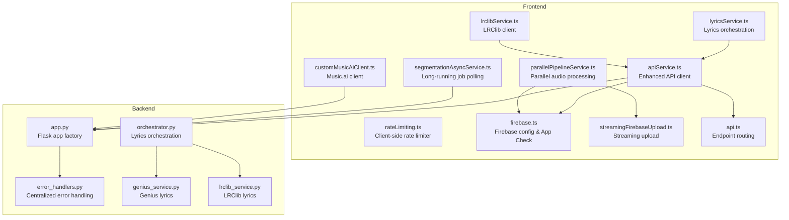

**Diagram sources**
- [apiService.ts:1-407](file://src/services/api/apiService.ts#L1-L407)
- [rateLimiting.ts:1-266](file://src/utils/rateLimiting.ts#L1-L266)
- [parallelPipelineService.ts:1-350](file://src/services/api/parallelPipelineService.ts#L1-L350)
- [segmentationAsyncService.ts:1-211](file://src/services/api/segmentationAsyncService.ts#L1-L211)
- [lyricsService.ts:1-197](file://src/services/lyrics/lyricsService.ts#L1-L197)
- [lrclibService.ts:1-266](file://src/services/lyrics/lrclibService.ts#L1-L266)
- [customMusicAiClient.ts:1-711](file://src/services/api/customMusicAiClient.ts#L1-L711)
- [firebase.ts:1-537](file://src/config/firebase.ts#L1-L537)
- [streamingFirebaseUpload.ts:1-563](file://src/services/firebase/streamingFirebaseUpload.ts#L1-L563)
- [api.ts:1-158](file://src/config/api.ts#L1-L158)
- [app.py:1-186](file://python_backend/app.py#L1-L186)
- [error_handlers.py:1-161](file://python_backend/error_handlers.py#L1-L161)
- [orchestrator.py:1-184](file://python_backend/services/lyrics/orchestrator.py#L1-L184)
- [genius_service.py:1-215](file://python_backend/services/lyrics/genius_service.py#L1-L215)
- [lrclib_service.py:1-172](file://python_backend/services/lyrics/lrclib_service.py#L1-L172)

**Section sources**
- [apiService.ts:1-407](file://src/services/api/apiService.ts#L1-L407)
- [api.ts:1-158](file://src/config/api.ts#L1-L158)

## Core Components
- Enhanced API service with rate limiting and retries
- Client-side rate limiter and exponential backoff
- Parallel pipeline service for concurrent audio processing and Firebase uploads
- Async job service for long-running tasks exceeding platform timeouts
- Lyrics orchestration with Genius and LRClib fallback
- Firebase configuration with App Check and streaming upload utilities
- Backend error handling and centralized response formatting

**Section sources**
- [apiService.ts:29-407](file://src/services/api/apiService.ts#L29-L407)
- [rateLimiting.ts:210-266](file://src/utils/rateLimiting.ts#L210-L266)
- [parallelPipelineService.ts:34-350](file://src/services/api/parallelPipelineService.ts#L34-L350)
- [segmentationAsyncService.ts:30-211](file://src/services/api/segmentationAsyncService.ts#L30-L211)
- [lyricsService.ts:72-197](file://src/services/lyrics/lyricsService.ts#L72-L197)
- [firebase.ts:475-537](file://src/config/firebase.ts#L475-L537)
- [streamingFirebaseUpload.ts:273-431](file://src/services/firebase/streamingFirebaseUpload.ts#L273-L431)
- [error_handlers.py:13-161](file://python_backend/error_handlers.py#L13-L161)

## Architecture Overview
The frontend API layer encapsulates all outbound requests, applies rate limiting and retries, attaches App Check tokens, and routes endpoints to either Vercel-hosted routes or external Python backend. The backend exposes ML and lyrics endpoints with centralized error handling. Firebase provides secure storage and App Check attestation for API requests.

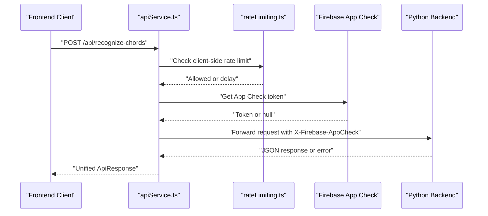

**Diagram sources**
- [apiService.ts:56-241](file://src/services/api/apiService.ts#L56-L241)
- [rateLimiting.ts:210-266](file://src/utils/rateLimiting.ts#L210-L266)
- [firebase.ts:522-536](file://src/config/firebase.ts#L522-L536)
- [app.py:87-186](file://python_backend/app.py#L87-L186)

## Detailed Component Analysis

### Enhanced API Service
The API service centralizes request construction, timeout handling, rate limiting, retries, and response parsing. It supports GET/POST/FormData endpoints and integrates with Firebase App Check.

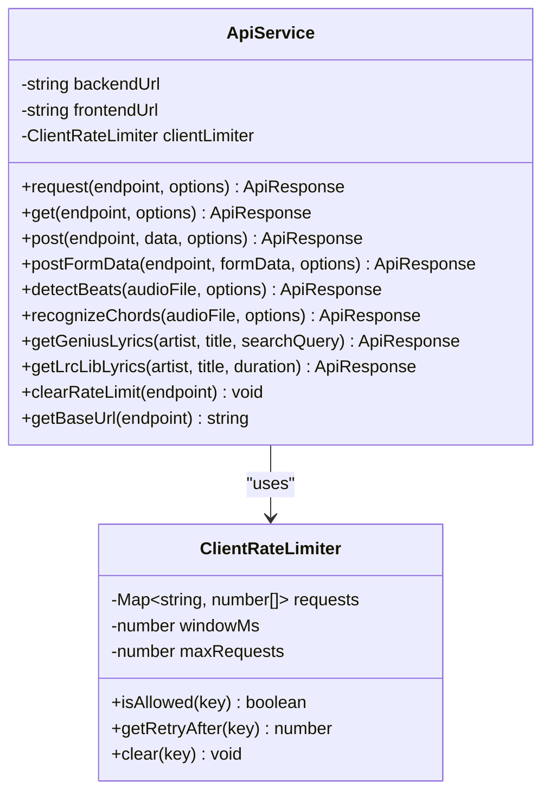

**Diagram sources**
- [apiService.ts:29-407](file://src/services/api/apiService.ts#L29-L407)
- [rateLimiting.ts:210-266](file://src/utils/rateLimiting.ts#L210-L266)

Key behaviors:
- Client-side rate limiting per endpoint key
- Timeout management with AbortController
- Retry with exponential backoff for transient failures
- Specialized endpoints for beats/chords with long timeouts
- Lyrics endpoints for Genius and LRClib
- App Check token injection for API requests

**Section sources**
- [apiService.ts:56-241](file://src/services/api/apiService.ts#L56-L241)
- [rateLimiting.ts:120-187](file://src/utils/rateLimiting.ts#L120-L187)

### Rate Limiting Utilities
Provides client-side rate limiting, exponential backoff, and retry logic for both client and server responses.

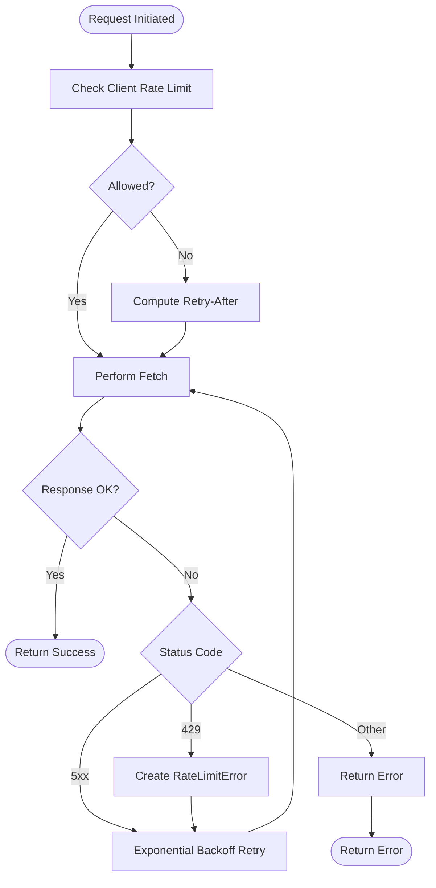

**Diagram sources**
- [rateLimiting.ts:120-187](file://src/utils/rateLimiting.ts#L120-L187)
- [rateLimiting.ts:210-266](file://src/utils/rateLimiting.ts#L210-L266)

**Section sources**
- [rateLimiting.ts:20-54](file://src/utils/rateLimiting.ts#L20-L54)
- [rateLimiting.ts:59-115](file://src/utils/rateLimiting.ts#L59-L115)
- [rateLimiting.ts:120-187](file://src/utils/rateLimiting.ts#L120-L187)

### Parallel Pipeline Service
Optimizes audio processing by downloading the complete audio file and running Google Cloud Run processing in parallel with Firebase upload. Includes caching, background uploads, and result retrieval.

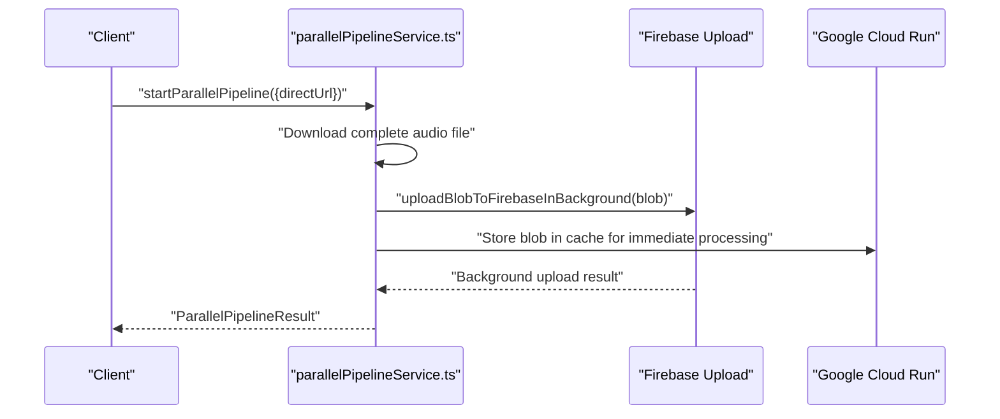

**Diagram sources**
- [parallelPipelineService.ts:34-98](file://src/services/api/parallelPipelineService.ts#L34-L98)
- [parallelPipelineService.ts:173-203](file://src/services/api/parallelPipelineService.ts#L173-L203)
- [streamingFirebaseUpload.ts:436-483](file://src/services/firebase/streamingFirebaseUpload.ts#L436-L483)

**Section sources**
- [parallelPipelineService.ts:34-98](file://src/services/api/parallelPipelineService.ts#L34-L98)
- [parallelPipelineService.ts:148-261](file://src/services/api/parallelPipelineService.ts#L148-L261)

### Async Job Service
Manages long-running jobs that exceed platform timeouts. Creates jobs, polls for completion, and provides progress updates.

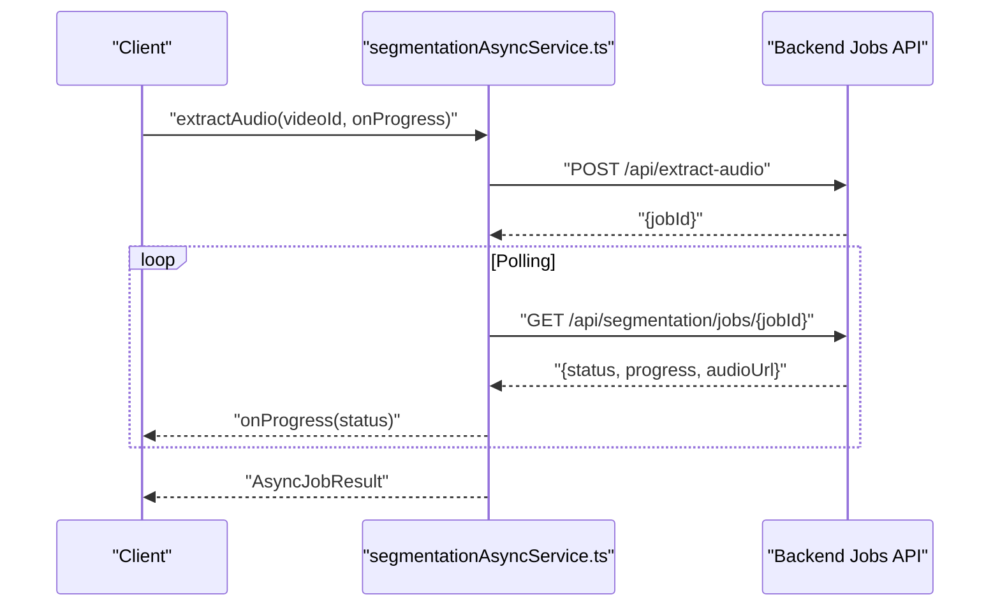

**Diagram sources**
- [segmentationAsyncService.ts:52-101](file://src/services/api/segmentationAsyncService.ts#L52-L101)
- [segmentationAsyncService.ts:106-177](file://src/services/api/segmentationAsyncService.ts#L106-L177)

**Section sources**
- [segmentationAsyncService.ts:30-211](file://src/services/api/segmentationAsyncService.ts#L30-L211)

### Lyrics Orchestration and Providers
The frontend lyrics service coordinates LRClib and Genius fallback strategies. The backend orchestrator composes provider services and normalizes responses.

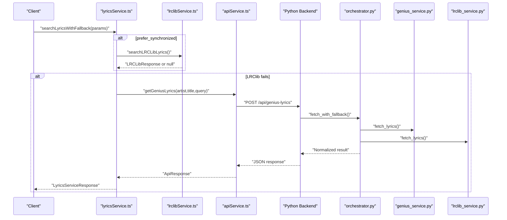

**Diagram sources**
- [lyricsService.ts:72-172](file://src/services/lyrics/lyricsService.ts#L72-L172)
- [lrclibService.ts:32-145](file://src/services/lyrics/lrclibService.ts#L32-L145)
- [apiService.ts:348-366](file://src/services/api/apiService.ts#L348-L366)
- [orchestrator.py:95-147](file://python_backend/services/lyrics/orchestrator.py#L95-L147)
- [genius_service.py:135-215](file://python_backend/services/lyrics/genius_service.py#L135-L215)
- [lrclib_service.py:76-172](file://python_backend/services/lyrics/lrclib_service.py#L76-L172)

**Section sources**
- [lyricsService.ts:72-172](file://src/services/lyrics/lyricsService.ts#L72-L172)
- [orchestrator.py:95-147](file://python_backend/services/lyrics/orchestrator.py#L95-L147)

### Firebase Integration and Security
Firebase configuration initializes App Check and provides streaming upload utilities. App Check tokens are attached to API requests for attestation.

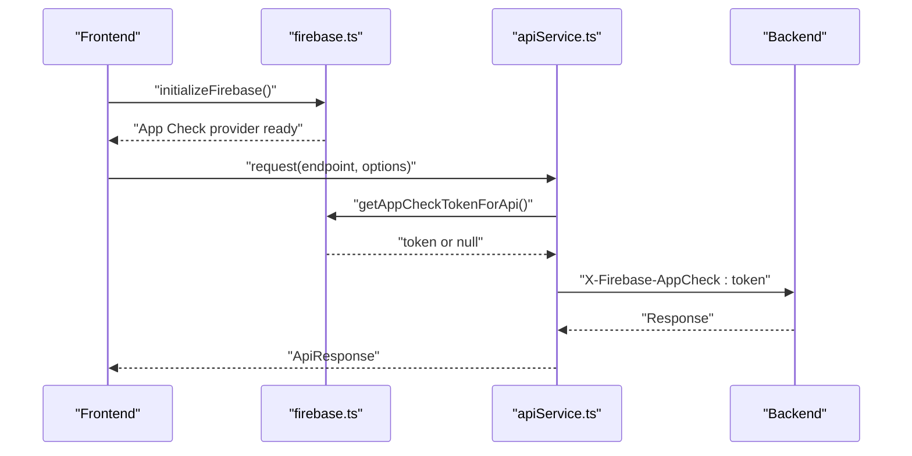

**Diagram sources**
- [firebase.ts:475-537](file://src/config/firebase.ts#L475-L537)
- [apiService.ts:106-121](file://src/services/api/apiService.ts#L106-L121)

**Section sources**
- [firebase.ts:475-537](file://src/config/firebase.ts#L475-L537)
- [streamingFirebaseUpload.ts:273-431](file://src/services/firebase/streamingFirebaseUpload.ts#L273-L431)

### Backend Error Handling
Centralized error handlers return consistent JSON responses for HTTP exceptions and application-specific errors.

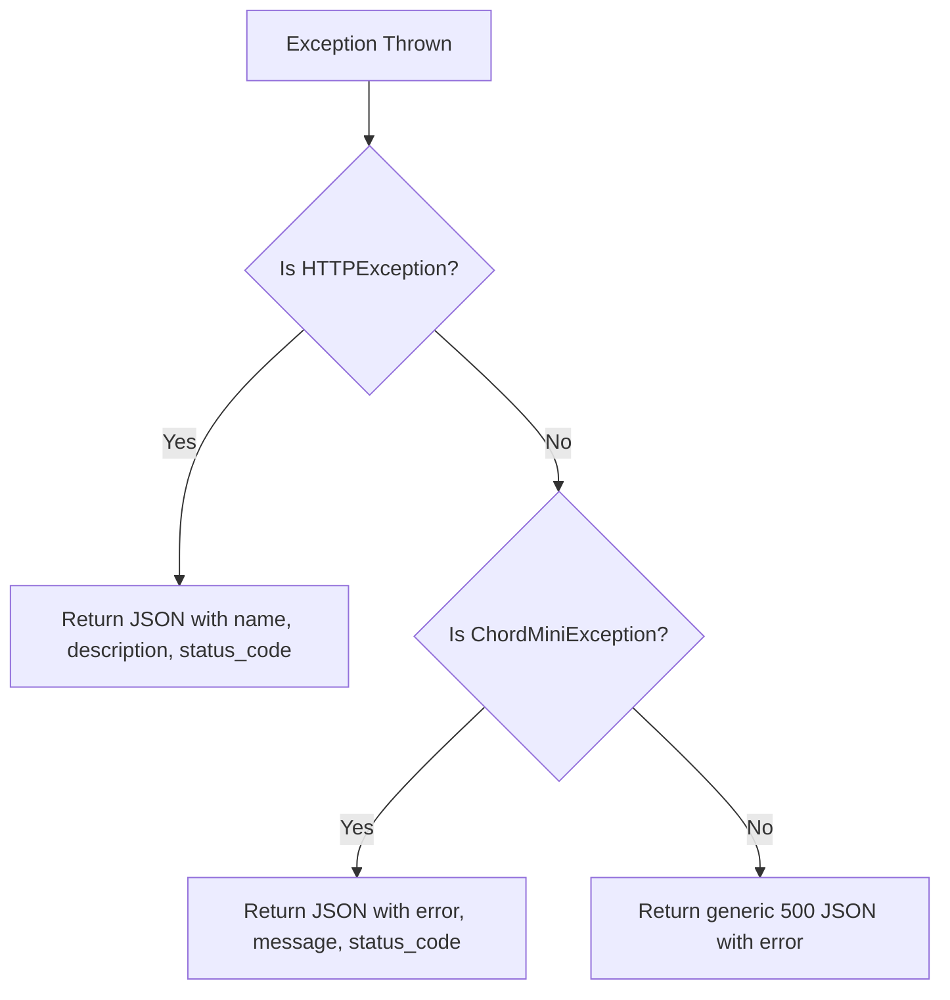

**Diagram sources**
- [error_handlers.py:13-94](file://python_backend/error_handlers.py#L13-L94)
- [error_handlers.py:142-161](file://python_backend/error_handlers.py#L142-L161)

**Section sources**
- [error_handlers.py:13-161](file://python_backend/error_handlers.py#L13-L161)

### Music.ai Client
A flexible client for Music.ai with multiple endpoint/auth fallbacks, job creation, polling, and file upload utilities.

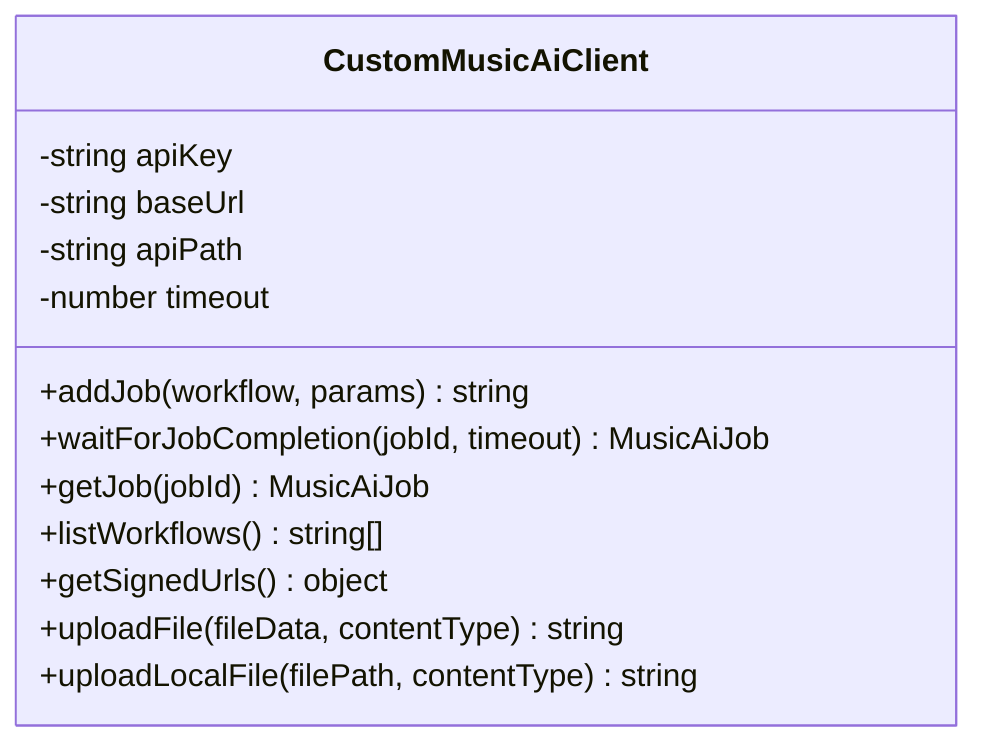

**Diagram sources**
- [customMusicAiClient.ts:77-711](file://src/services/api/customMusicAiClient.ts#L77-L711)

**Section sources**
- [customMusicAiClient.ts:77-711](file://src/services/api/customMusicAiClient.ts#L77-L711)

## Dependency Analysis
- Frontend API service depends on rate limiting utilities, Firebase App Check, and endpoint routing configuration.
- Lyrics orchestration depends on frontend API service for Genius and on LRClib client for direct API calls.
- Backend Flask app registers error handlers and routes to blueprints; the orchestrator composes provider services.
- Parallel pipeline service depends on streaming Firebase upload utilities and maintains in-memory caches.

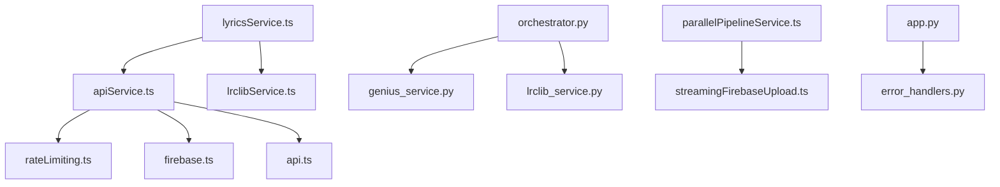

**Diagram sources**
- [apiService.ts:1-407](file://src/services/api/apiService.ts#L1-L407)
- [rateLimiting.ts:1-266](file://src/utils/rateLimiting.ts#L1-L266)
- [firebase.ts:1-537](file://src/config/firebase.ts#L1-L537)
- [api.ts:1-158](file://src/config/api.ts#L1-L158)
- [lyricsService.ts:1-197](file://src/services/lyrics/lyricsService.ts#L1-L197)
- [lrclibService.ts:1-266](file://src/services/lyrics/lrclibService.ts#L1-L266)
- [orchestrator.py:1-184](file://python_backend/services/lyrics/orchestrator.py#L1-L184)
- [genius_service.py:1-215](file://python_backend/services/lyrics/genius_service.py#L1-L215)
- [lrclib_service.py:1-172](file://python_backend/services/lyrics/lrclib_service.py#L1-L172)
- [parallelPipelineService.ts:1-350](file://src/services/api/parallelPipelineService.ts#L1-L350)
- [streamingFirebaseUpload.ts:1-563](file://src/services/firebase/streamingFirebaseUpload.ts#L1-L563)
- [app.py:1-186](file://python_backend/app.py#L1-L186)
- [error_handlers.py:1-161](file://python_backend/error_handlers.py#L1-L161)

**Section sources**
- [apiService.ts:1-407](file://src/services/api/apiService.ts#L1-L407)
- [lyricsService.ts:1-197](file://src/services/lyrics/lyricsService.ts#L1-L197)
- [parallelPipelineService.ts:1-350](file://src/services/api/parallelPipelineService.ts#L1-L350)

## Performance Considerations
- Client-side rate limiting prevents overload and reduces wasted retries.
- Exponential backoff with jitter mitigates thundering herd and server spikes.
- Parallel pipeline downloads the complete audio file and runs processing concurrently with Firebase upload to reduce total latency.
- Long-running jobs are polled with tuned intervals based on song duration to balance responsiveness and cost.
- Streaming uploads avoid local buffering and respect Vercel operation budgets.

[No sources needed since this section provides general guidance]

## Troubleshooting Guide
Common issues and recovery patterns:
- Rate limit exceeded: The API service detects 429 responses and returns a structured error with retry-after guidance. Client-side rate limiter also enforces quotas.
- Network timeouts: The API service sets AbortController timeouts and returns user-friendly messages. For long operations, use async job service or parallel pipeline.
- External provider failures: Lyrics orchestration falls back from LRClib to Genius and vice versa. Health checks can be used to monitor provider availability.
- Firebase upload failures: Streaming upload utilities implement retry logic and budget-aware delays. Background results are tracked and can be queried.
- Backend errors: Centralized error handlers return consistent JSON with status codes and messages for debugging.

**Section sources**
- [apiService.ts:137-241](file://src/services/api/apiService.ts#L137-L241)
- [rateLimiting.ts:190-205](file://src/utils/rateLimiting.ts#L190-L205)
- [lyricsService.ts:176-197](file://src/services/lyrics/lyricsService.ts#L176-L197)
- [streamingFirebaseUpload.ts:334-431](file://src/services/firebase/streamingFirebaseUpload.ts#L334-L431)
- [error_handlers.py:13-94](file://python_backend/error_handlers.py#L13-L94)

## Conclusion
The API integration architecture employs a robust service layer with client-side rate limiting, exponential backoff, and parallel processing to optimize performance and reliability. The frontend API service unifies endpoint routing, authentication via App Check, and response handling, while backend services provide centralized error handling and provider orchestration. Firebase integration ensures secure storage and attestation, and specialized clients manage external APIs with resilient fallback strategies.