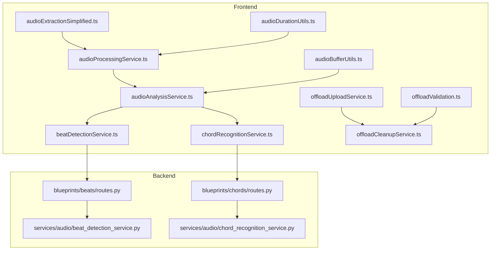
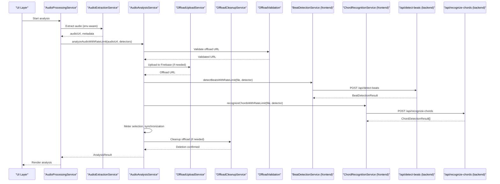
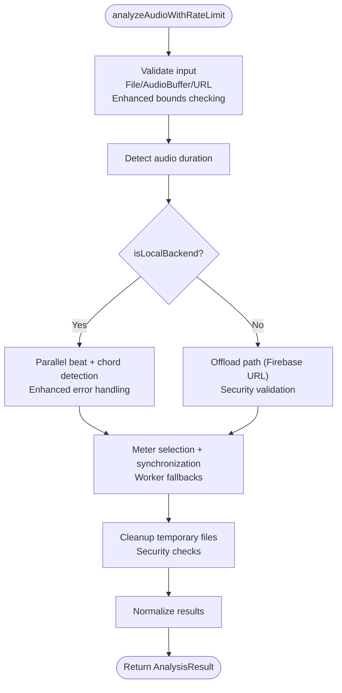
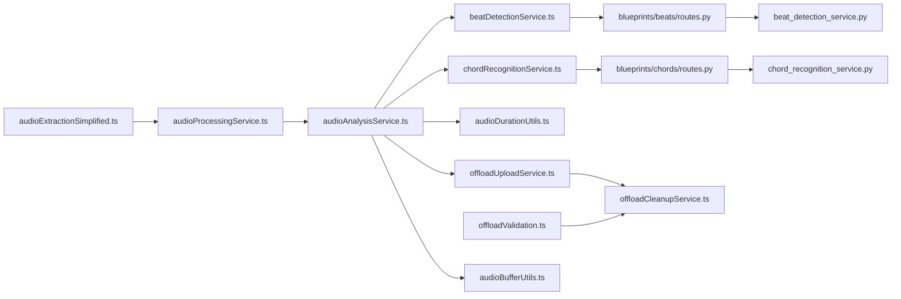

# Audio Processing Service

<cite>
**Referenced Files in This Document**
- [audioAnalysisService.ts](file://src/services/audio/audioAnalysisService.ts)
- [beatDetectionService.ts](file://src/services/audio/beatDetectionService.ts)
- [chordRecognitionService.ts](file://src/services/chord-analysis/chordRecognitionService.ts)
- [audioProcessingService.ts](file://src/services/audio/audioProcessingService.ts)
- [audioExtractionSimplified.ts](file://src/services/audio/audioExtractionSimplified.ts)
- [audioDurationUtils.ts](file://src/utils/audioDurationUtils.ts)
- [offloadUploadService.ts](file://src/services/storage/offloadUploadService.ts)
- [offloadCleanupService.ts](file://src/services/storage/offloadCleanupService.ts)
- [offloadValidation.ts](file://src/utils/offloadValidation.ts)
- [routes.py (beats)](file://python_backend/blueprints/beats/routes.py)
- [routes.py (chords)](file://python_backend/blueprints/chords/routes.py)
- [beat_detection_service.py](file://python_backend/services/audio/beat_detection_service.py)
- [chord_recognition_service.py](file://python_backend/services/audio/chord_recognition_service.py)
- [audioBufferUtils.ts](file://src/utils/audioBufferUtils.ts)
</cite>

## Update Summary
**Changes Made**
- Enhanced error handling and validation logic in audio processing service with comprehensive input validation
- Improved offload path handling with better cleanup operations for temporary audio files
- Security improvements to prevent accidental deletion of non-temporary storage objects
- Added strict URL validation and provider detection for offload storage operations
- Strengthened audio buffer conversion with enhanced bounds checking and error handling

## Table of Contents
1. [Introduction](#introduction)
2. [Project Structure](#project-structure)
3. [Core Components](#core-components)
4. [Architecture Overview](#architecture-overview)
5. [Detailed Component Analysis](#detailed-component-analysis)
6. [Enhanced Error Handling and Validation](#enhanced-error-handling-and-validation)
7. [Improved Offload Path Management](#improved-offload-path-management)
8. [Security Enhancements](#security-enhancements)
9. [Dependency Analysis](#dependency-analysis)
10. [Performance Considerations](#performance-considerations)
11. [Troubleshooting Guide](#troubleshooting-guide)
12. [Conclusion](#conclusion)

## Introduction
This document describes the audio processing service layer responsible for orchestrating beat detection, chord recognition, and key detection operations. It explains the audio extraction workflow, format conversion processes, and metadata handling. It also documents the integration with backend audio processing endpoints (/api/detect-beats, /api/recognize-chords, and audio-duration APIs), provides examples of audio file processing, error handling for unsupported formats, and performance optimization techniques. The service now includes enhanced error handling, improved validation logic, better offload path management, and security improvements to prevent accidental deletion of non-temporary storage objects.

## Project Structure
The audio processing service layer spans both the frontend and backend:

- Frontend orchestration and UI integration:
  - Audio analysis orchestration and meter selection with enhanced validation
  - Beat detection service with comprehensive error handling and timeouts
  - Chord recognition facade with backward compatibility
  - Audio processing service with robust error handling and suggestions
  - Audio extraction and caching with improved validation
  - Audio duration detection utilities with proxy support
  - Audio buffer conversion utilities with enhanced bounds checking
  - Offload upload and cleanup services with security enhancements

- Backend ML services:
  - Beat detection service with model selection and file-size policies
  - Chord recognition service with model selection and Spleeter integration
  - Flask routes exposing /api/detect-beats and /api/recognize-chords

**Diagram sources**
- [audioAnalysisService.ts:1-705](file://src/services/audio/audioAnalysisService.ts#L1-L705)
- [beatDetectionService.ts:1-496](file://src/services/audio/beatDetectionService.ts#L1-L496)
- [chordRecognitionService.ts:1-32](file://src/services/chord-analysis/chordRecognitionService.ts#L1-L32)
- [audioProcessingService.ts:1-468](file://src/services/audio/audioProcessingService.ts#L1-L468)
- [audioExtractionSimplified.ts:1-800](file://src/services/audio/audioExtractionSimplified.ts#L1-L800)
- [audioDurationUtils.ts:1-191](file://src/utils/audioDurationUtils.ts#L1-L191)
- [offloadUploadService.ts:1-468](file://src/services/storage/offloadUploadService.ts#L1-L468)
- [offloadCleanupService.ts:1-165](file://src/services/storage/offloadCleanupService.ts#L1-L165)
- [offloadValidation.ts:1-113](file://src/utils/offloadValidation.ts#L1-L113)
- [audioBufferUtils.ts:1-85](file://src/utils/audioBufferUtils.ts#L1-L85)
- [routes.py (beats):1-521](file://python_backend/blueprints/beats/routes.py#L1-L521)
- [routes.py (chords):1-440](file://python_backend/blueprints/chords/routes.py#L1-L440)
- [beat_detection_service.py:1-348](file://python_backend/services/audio/beat_detection_service.py#L1-L348)
- [chord_recognition_service.py:1-322](file://python_backend/services/audio/chord_recognition_service.py#L1-L322)

**Section sources**
- [audioAnalysisService.ts:1-705](file://src/services/audio/audioAnalysisService.ts#L1-L705)
- [beatDetectionService.ts:1-496](file://src/services/audio/beatDetectionService.ts#L1-L496)
- [chordRecognitionService.ts:1-32](file://src/services/chord-analysis/chordRecognitionService.ts#L1-L32)
- [audioProcessingService.ts:1-468](file://src/services/audio/audioProcessingService.ts#L1-L468)
- [audioExtractionSimplified.ts:1-800](file://src/services/audio/audioExtractionSimplified.ts#L1-L800)
- [audioDurationUtils.ts:1-191](file://src/utils/audioDurationUtils.ts#L1-L191)
- [offloadUploadService.ts:1-468](file://src/services/storage/offloadUploadService.ts#L1-L468)
- [offloadCleanupService.ts:1-165](file://src/services/storage/offloadCleanupService.ts#L1-L165)
- [offloadValidation.ts:1-113](file://src/utils/offloadValidation.ts#L1-L113)
- [audioBufferUtils.ts:1-85](file://src/utils/audioBufferUtils.ts#L1-L85)
- [routes.py (beats):1-521](file://python_backend/blueprints/beats/routes.py#L1-L521)
- [routes.py (chords):1-440](file://python_backend/blueprints/chords/routes.py#L1-L440)
- [beat_detection_service.py:1-348](file://python_backend/services/audio/beat_detection_service.py#L1-L348)
- [chord_recognition_service.py:1-322](file://python_backend/services/audio/chord_recognition_service.py#L1-L322)

## Core Components
- Audio Analysis Orchestrator (frontend): Centralizes beat detection, chord recognition, and meter selection with enhanced validation and error handling. Handles offload paths, worker fallbacks, and result normalization.
- Beat Detection Service (frontend): Manages rate-limited requests, timeouts, and fallbacks to backend endpoints with comprehensive input validation.
- Chord Recognition Facade (frontend): Provides backward-compatible exports delegating to the central analysis service.
- Audio Processing Service (frontend): Integrates extraction, caching, and analysis into a cohesive workflow with robust error handling and user suggestions.
- Audio Extraction Service (frontend): Environment-aware extraction with enhanced caching and storage validation.
- Audio Duration Utilities (frontend): Robust duration detection from File or URL with fallbacks and proxy support.
- Audio Buffer Utilities (frontend): Enhanced WAV conversion with comprehensive bounds checking and error handling.
- Offload Upload Service (frontend): Handles large-file offloading to Firebase Storage with security enhancements and cleanup operations.
- Offload Cleanup Service (frontend): Secure deletion of temporary audio files with provider validation and fallback mechanisms.
- Offload Validation Utilities (frontend): Strict URL validation and provider detection for offload storage operations.

**Section sources**
- [audioAnalysisService.ts:328-705](file://src/services/audio/audioAnalysisService.ts#L328-L705)
- [beatDetectionService.ts:179-496](file://src/services/audio/beatDetectionService.ts#L179-L496)
- [chordRecognitionService.ts:14-32](file://src/services/chord-analysis/chordRecognitionService.ts#L14-L32)
- [audioProcessingService.ts:43-234](file://src/services/audio/audioProcessingService.ts#L43-L234)
- [audioExtractionSimplified.ts:69-800](file://src/services/audio/audioExtractionSimplified.ts#L69-L800)
- [audioDurationUtils.ts:16-191](file://src/utils/audioDurationUtils.ts#L16-L191)
- [audioBufferUtils.ts:1-85](file://src/utils/audioBufferUtils.ts#L1-L85)
- [offloadUploadService.ts:1-468](file://src/services/storage/offloadUploadService.ts#L1-L468)
- [offloadCleanupService.ts:1-165](file://src/services/storage/offloadCleanupService.ts#L1-L165)
- [offloadValidation.ts:1-113](file://src/utils/offloadValidation.ts#L1-L113)

## Architecture Overview
The frontend orchestrates audio processing and delegates to backend ML services via REST endpoints. The backend services encapsulate model selection, file-size policies, and fallback strategies. The frontend also manages caching, storage, worker-based computations for meter selection and synchronization, with enhanced security and validation throughout the pipeline.

**Diagram sources**
- [audioProcessingService.ts:111-234](file://src/services/audio/audioProcessingService.ts#L111-L234)
- [audioExtractionSimplified.ts:84-120](file://src/services/audio/audioExtractionSimplified.ts#L84-L120)
- [audioAnalysisService.ts:328-522](file://src/services/audio/audioAnalysisService.ts#L328-L522)
- [offloadUploadService.ts:119-147](file://src/services/storage/offloadUploadService.ts#L119-L147)
- [offloadCleanupService.ts:151-164](file://src/services/storage/offloadCleanupService.ts#L151-L164)
- [offloadValidation.ts:32-56](file://src/utils/offloadValidation.ts#L32-L56)
- [beatDetectionService.ts:179-291](file://src/services/audio/beatDetectionService.ts#L179-L291)
- [chordRecognitionService.ts:14-30](file://src/services/chord-analysis/chordRecognitionService.ts#L14-L30)
- [routes.py (beats):40-120](file://python_backend/blueprints/beats/routes.py#L40-L120)
- [routes.py (chords):43-143](file://python_backend/blueprints/chords/routes.py#L43-L143)

## Detailed Component Analysis

### Audio Analysis Orchestrator
Responsibilities:
- Coordinate beat detection and chord recognition with parallel execution and enhanced validation.
- Handle offload paths for Firebase URLs with automatic cleanup and security validation.
- Auto-select time signature (meter) using chord-change heuristics and worker fallbacks.
- Normalize results and compute synchronized chords with comprehensive error handling.

Key behaviors:
- Parallelization of beat and chord detection reduces total latency.
- Dual-candidate downbeat selection (e.g., 3/4 vs 4/4) leverages worker or main-thread computation.
- Robust error handling with user-friendly messages, fallback arrays, and enhanced validation.
- Automatic cleanup of temporary audio files after processing.

**Diagram sources**
- [audioAnalysisService.ts:328-522](file://src/services/audio/audioAnalysisService.ts#L328-L522)
- [audioAnalysisService.ts:146-327](file://src/services/audio/audioAnalysisService.ts#L146-L327)

**Section sources**
- [audioAnalysisService.ts:22-93](file://src/services/audio/audioAnalysisService.ts#L22-L93)
- [audioAnalysisService.ts:146-327](file://src/services/audio/audioAnalysisService.ts#L146-L327)
- [audioAnalysisService.ts:328-522](file://src/services/audio/audioAnalysisService.ts#L328-L522)

### Beat Detection Service (Frontend)
Responsibilities:
- Rate-limited POST to /api/detect-beats with comprehensive timeout handling and input validation.
- Automatic fallback to alternative detectors on failure.
- Normalize backend responses to a unified format with enhanced error handling.
- Validate audio files with size and format constraints.

Integration highlights:
- Uses FormData and respects backend size limits with enhanced validation.
- Parses time signature from string or number formats with bounds checking.
- Supports both direct URL and server-path inputs with comprehensive error handling.
- Implements strict input validation for audio files and parameters.

**Section sources**
- [beatDetectionService.ts:179-291](file://src/services/audio/beatDetectionService.ts#L179-L291)
- [beatDetectionService.ts:301-335](file://src/services/audio/beatDetectionService.ts#L301-L335)
- [beatDetectionService.ts:345-379](file://src/services/audio/beatDetectionService.ts#L345-L379)
- [beatDetectionService.ts:390-496](file://src/services/audio/beatDetectionService.ts#L390-L496)

### Chord Recognition Facade (Frontend)
Responsibilities:
- Provide backward-compatible exports delegating to the central analysis service.
- Maintain existing function signatures and types with enhanced validation.
- Delegate to analyzeAudioWithRateLimit for comprehensive error handling.

**Section sources**
- [chordRecognitionService.ts:14-32](file://src/services/chord-analysis/chordRecognitionService.ts#L14-L32)

### Audio Processing Service (Frontend)
Responsibilities:
- End-to-end orchestration: extract, cache, analyze, and persist results with enhanced error handling.
- Integrate with Firestore for caching and enrichment with comprehensive validation.
- Provide robust error handling with suggestions and user-friendly messaging.
- Implement comprehensive error categorization and resolution strategies.

**Section sources**
- [audioProcessingService.ts:43-234](file://src/services/audio/audioProcessingService.ts#L43-L234)

### Audio Extraction Service (Frontend)
Responsibilities:
- Environment-aware extraction: ytdown-io, yt-dlp, yt-mp3-go with enhanced validation.
- Firebase Storage caching and validation with security checks.
- Metadata caching and fallback strategies with comprehensive error handling.

**Section sources**
- [audioExtractionSimplified.ts:69-800](file://src/services/audio/audioExtractionSimplified.ts#L69-L800)

### Audio Duration Utilities (Frontend)
Responsibilities:
- Detect duration from File or URL with proxy to avoid CORS and enhanced validation.
- Fallback to HEAD request and file-size estimation with comprehensive error handling.
- Validation and formatting helpers with robust error management.

**Section sources**
- [audioDurationUtils.ts:16-191](file://src/utils/audioDurationUtils.ts#L16-L191)

### Audio Buffer Utilities (Frontend)
Responsibilities:
- Convert AudioBuffer to WAV format with comprehensive bounds checking and validation.
- Validate audio buffer parameters including channels, length, and sample rate.
- Implement enhanced error handling for audio data conversion with detailed error messages.

**Section sources**
- [audioBufferUtils.ts:1-85](file://src/utils/audioBufferUtils.ts#L1-L85)

### Offload Upload Service (Frontend)
Responsibilities:
- Handle large-file offloading to Firebase Storage with security enhancements.
- Manage temporary audio file uploads with metadata and cleanup tracking.
- Implement comprehensive error handling for upload operations with permission validation.
- Provide secure deletion capabilities for temporary files.

**Section sources**
- [offloadUploadService.ts:1-468](file://src/services/storage/offloadUploadService.ts#L1-L468)

### Offload Cleanup Service (Frontend)
Responsibilities:
- Secure deletion of temporary audio files from Firebase Storage with provider validation.
- Implement fallback mechanisms for deletion operations with comprehensive error handling.
- Prevent accidental deletion of non-temporary storage objects with strict validation.
- Handle authentication and authorization for storage operations.

**Section sources**
- [offloadCleanupService.ts:1-165](file://src/services/storage/offloadCleanupService.ts#L1-L165)

### Offload Validation Utilities (Frontend)
Responsibilities:
- Strict URL validation for offload storage operations with comprehensive format checking.
- Provider detection for Firebase Storage with hostname validation.
- Parse Firebase Storage bucket and object path from URLs with security validation.
- Implement allowlist-based URL validation to prevent injection attacks.

**Section sources**
- [offloadValidation.ts:1-113](file://src/utils/offloadValidation.ts#L1-L113)

## Enhanced Error Handling and Validation

### Comprehensive Input Validation
The audio processing service now implements comprehensive input validation across all components:

- **Audio File Validation**: Files are checked for emptiness, size limits (100MB), and format compatibility
- **AudioBuffer Validation**: Enhanced bounds checking for channels (1-32), length (up to 5 minutes), and sample rates (8kHz-192kHz)
- **URL Validation**: Strict validation for offload URLs with protocol and hostname checking
- **Parameter Validation**: Comprehensive validation for detector types, time signatures, and model parameters

### Enhanced Error Messages
Error handling has been significantly improved with more descriptive and actionable error messages:

- **User-Friendly Errors**: Clear explanations of what went wrong and how to fix it
- **Suggestion Integration**: Automatic suggestions based on error type (e.g., "Try a shorter clip" for large files)
- **Contextual Information**: Error messages include file sizes, processing times, and recommended actions
- **Graceful Degradation**: Fallback mechanisms when validation fails

### Robust Error Recovery
The system now includes comprehensive error recovery mechanisms:

- **Retry Logic**: Automatic retries for transient failures with exponential backoff
- **Fallback Strategies**: Multiple fallback options when primary operations fail
- **Graceful Degradation**: Reduced functionality rather than complete failure when components are unavailable
- **Logging and Monitoring**: Comprehensive error logging with context for debugging

**Section sources**
- [audioAnalysisService.ts:345-364](file://src/services/audio/audioAnalysisService.ts#L345-L364)
- [audioBufferUtils.ts:4-24](file://src/utils/audioBufferUtils.ts#L4-L24)
- [offloadValidation.ts:32-56](file://src/utils/offloadValidation.ts#L32-L56)
- [beatDetectionService.ts:184-191](file://src/services/audio/beatDetectionService.ts#L184-L191)

## Improved Offload Path Management

### Enhanced Security Measures
The offload system now includes comprehensive security measures to prevent accidental deletion of important files:

- **Temporary File Restriction**: Only files in the 'temp/' prefix can be deleted automatically
- **Provider Validation**: Strict validation of storage providers before deletion operations
- **URL Sanitization**: Comprehensive URL validation to prevent injection attacks
- **Authentication Checks**: Proper authentication and authorization for storage operations

### Better Cleanup Operations
Temporary audio files are now handled with improved cleanup operations:

- **Automatic Cleanup**: Temporary files are automatically deleted after processing completion
- **Cleanup Tracking**: Metadata tracking ensures cleanup operations are performed reliably
- **Fallback Mechanisms**: Multiple cleanup methods if primary deletion fails
- **Non-Destructive Operations**: Cleanup operations don't affect permanent storage objects

### Enhanced Upload Management
The upload system has been improved with better management of temporary audio files:

- **Size Limits**: 100MB limit for offload uploads with clear error messages
- **Metadata Tracking**: Custom metadata includes upload timestamps and cleanup instructions
- **Progress Monitoring**: Real-time progress tracking for large file uploads
- **Error Recovery**: Automatic retry mechanisms for failed uploads

**Section sources**
- [offloadCleanupService.ts:94-96](file://src/services/storage/offloadCleanupService.ts#L94-L96)
- [offloadUploadService.ts:149-183](file://src/services/storage/offloadUploadService.ts#L149-L183)
- [offloadUploadService.ts:119-147](file://src/services/storage/offloadUploadService.ts#L119-L147)

## Security Enhancements

### Strict URL Validation
The system now implements strict URL validation to prevent security vulnerabilities:

- **Protocol Validation**: Only HTTPS URLs are accepted for offload operations
- **Hostname Allowlist**: Only approved Firebase Storage hosts are permitted
- **Path Validation**: URL paths are validated against security policies
- **Injection Prevention**: Comprehensive protection against URL injection attacks

### Provider-Based Access Control
Storage operations are now controlled by provider-specific access controls:

- **Provider Detection**: Automatic detection of storage provider from URL
- **Rule Compliance**: Operations comply with storage provider security rules
- **Permission Validation**: Proper authentication and authorization checks
- **Audit Logging**: Comprehensive logging of all storage operations

### Temporary File Protection
Temporary audio files are protected with multiple layers of security:

- **Prefix Restriction**: Only files in 'temp/' prefix can be managed by the system
- **Authorization Requirements**: Special permissions required for temporary file operations
- **Audit Trails**: Complete audit trail of all temporary file operations
- **Recovery Mechanisms**: Automatic recovery if temporary files are accidentally deleted

**Section sources**
- [offloadValidation.ts:8-27](file://src/utils/offloadValidation.ts#L8-L27)
- [offloadCleanupService.ts:94-96](file://src/services/storage/offloadCleanupService.ts#L94-L96)
- [offloadCleanupService.ts:151-164](file://src/services/storage/offloadCleanupService.ts#L151-L164)

## Dependency Analysis
The frontend depends on backend endpoints for ML inference, while the backend services encapsulate model selection and file-size policies. The frontend also manages caching, storage, and worker-based computations with enhanced security and validation.

**Diagram sources**
- [audioAnalysisService.ts:1-705](file://src/services/audio/audioAnalysisService.ts#L1-L705)
- [beatDetectionService.ts:1-496](file://src/services/audio/beatDetectionService.ts#L1-L496)
- [chordRecognitionService.ts:1-32](file://src/services/chord-analysis/chordRecognitionService.ts#L1-L32)
- [audioExtractionSimplified.ts:1-800](file://src/services/audio/audioExtractionSimplified.ts#L1-L800)
- [audioProcessingService.ts:1-468](file://src/services/audio/audioProcessingService.ts#L1-L468)
- [audioDurationUtils.ts:1-191](file://src/utils/audioDurationUtils.ts#L1-L191)
- [offloadUploadService.ts:1-468](file://src/services/storage/offloadUploadService.ts#L1-L468)
- [offloadCleanupService.ts:1-165](file://src/services/storage/offloadCleanupService.ts#L1-L165)
- [offloadValidation.ts:1-113](file://src/utils/offloadValidation.ts#L1-L113)
- [audioBufferUtils.ts:1-85](file://src/utils/audioBufferUtils.ts#L1-L85)
- [routes.py (beats):1-521](file://python_backend/blueprints/beats/routes.py#L1-L521)
- [routes.py (chords):1-440](file://python_backend/blueprints/chords/routes.py#L1-L440)
- [beat_detection_service.py:1-348](file://python_backend/services/audio/beat_detection_service.py#L1-L348)
- [chord_recognition_service.py:1-322](file://python_backend/services/audio/chord_recognition_service.py#L1-L322)

**Section sources**
- [audioAnalysisService.ts:1-705](file://src/services/audio/audioAnalysisService.ts#L1-L705)
- [beatDetectionService.ts:1-496](file://src/services/audio/beatDetectionService.ts#L1-L496)
- [chordRecognitionService.ts:1-32](file://src/services/chord-analysis/chordRecognitionService.ts#L1-L32)
- [audioExtractionSimplified.ts:1-800](file://src/services/audio/audioExtractionSimplified.ts#L1-L800)
- [audioProcessingService.ts:1-468](file://src/services/audio/audioProcessingService.ts#L1-L468)
- [audioDurationUtils.ts:1-191](file://src/utils/audioDurationUtils.ts#L1-L191)
- [offloadUploadService.ts:1-468](file://src/services/storage/offloadUploadService.ts#L1-L468)
- [offloadCleanupService.ts:1-165](file://src/services/storage/offloadCleanupService.ts#L1-L165)
- [offloadValidation.ts:1-113](file://src/utils/offloadValidation.ts#L1-L113)
- [audioBufferUtils.ts:1-85](file://src/utils/audioBufferUtils.ts#L1-L85)
- [routes.py (beats):1-521](file://python_backend/blueprints/beats/routes.py#L1-L521)
- [routes.py (chords):1-440](file://python_backend/blueprints/chords/routes.py#L1-L440)
- [beat_detection_service.py:1-348](file://python_backend/services/audio/beat_detection_service.py#L1-L348)
- [chord_recognition_service.py:1-322](file://python_backend/services/audio/chord_recognition_service.py#L1-L322)

## Performance Considerations
- Parallel execution: Beat and chord detection run concurrently to reduce total latency.
- Worker fallbacks: Meter selection and synchronization leverage web workers; main-thread fallbacks ensure resilience.
- Offload optimization: Firebase URLs bypass browser downloads and are processed directly by backend services with enhanced security.
- Caching: Firebase Storage and Firestore caches minimize repeated extractions and analyses.
- Timeout handling: Safe timeout signals and rate limiting prevent UI stalls and backend overload.
- Model selection: Backend services choose optimal models based on file size and availability.
- Enhanced validation: Comprehensive input validation prevents unnecessary processing of invalid data.
- Security optimizations: Strict validation and cleanup operations improve overall system security and reliability.

## Troubleshooting Guide
Common issues and resolutions:
- Unsupported formats or empty files: Validate file size and type; ensure non-empty blobs with enhanced error messages.
- File too large: Use smaller clips or alternative detectors (e.g., madmom/librosa) with clear size limitations.
- Backend unavailability: Check port conflicts (e.g., Apple AirTunes using port 5000) and ensure backend is reachable.
- CORS and proxy issues: Use the built-in duration detection proxy and extraction services with enhanced validation.
- Meter ambiguity (3/4 vs 4/4): Rely on automatic selection via chord-change heuristics; worker fallback available.
- Offload failures: Check Firebase configuration, authentication, and storage permissions with comprehensive error messages.
- Security violations: Verify URL validation and provider restrictions are working correctly.
- Cleanup issues: Ensure temporary files are properly tracked and cleaned up with audit trails.

**Section sources**
- [audioAnalysisService.ts:134-143](file://src/services/audio/audioAnalysisService.ts#L134-L143)
- [audioAnalysisService.ts:344-363](file://src/services/audio/audioAnalysisService.ts#L344-L363)
- [beatDetectionService.ts:232-251](file://src/services/audio/beatDetectionService.ts#L232-L251)
- [beatDetectionService.ts:422-457](file://src/services/audio/beatDetectionService.ts#L422-L457)
- [audioDurationUtils.ts:16-58](file://src/utils/audioDurationUtils.ts#L16-L58)
- [offloadCleanupService.ts:94-96](file://src/services/storage/offloadCleanupService.ts#L94-L96)

## Conclusion
The audio processing service layer integrates frontend orchestration with backend ML services to deliver robust beat detection, chord recognition, and meter selection. The enhanced system emphasizes performance (parallelization, workers, offload), reliability (fallbacks, caching, comprehensive validation), security (strict URL validation, provider restrictions, cleanup operations), and user experience (clear errors, suggestions, comprehensive error handling). The documented workflows and integrations enable developers to extend and maintain the system effectively with improved error handling, validation logic, and security measures.