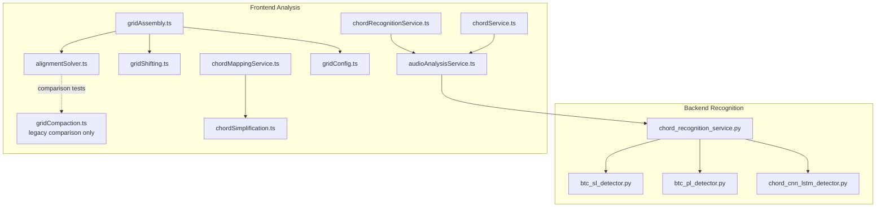
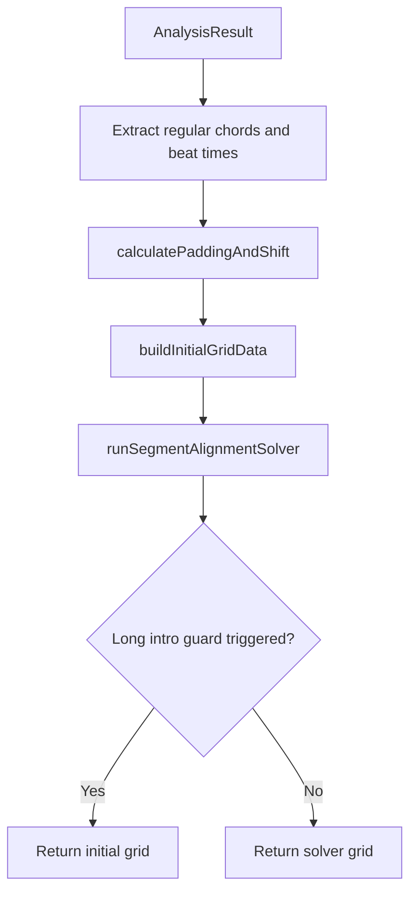
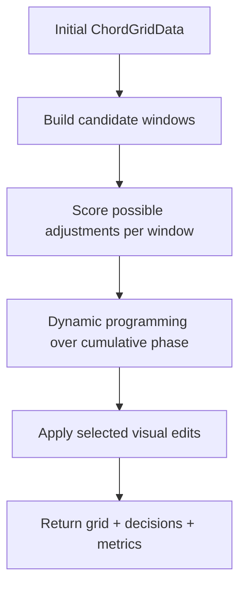

# Chord Analysis Service

<cite>
**Referenced Files in This Document**
- [chord_recognition_service.py](file://python_backend/services/audio/chord_recognition_service.py)
- [btc_sl_detector.py](file://python_backend/services/detectors/btc_sl_detector.py)
- [btc_pl_detector.py](file://python_backend/services/detectors/btc_pl_detector.py)
- [chord_cnn_lstm_detector.py](file://python_backend/services/detectors/chord_cnn_lstm_detector.py)
- [chordRecognitionService.ts](file://src/services/chord-analysis/chordRecognitionService.ts)
- [chordService.ts](file://src/services/chord-analysis/chordService.ts)
- [audioAnalysisService.ts](file://src/services/audio/audioAnalysisService.ts)
- [gridAssembly.ts](file://src/services/chord-analysis/gridAssembly.ts)
- [alignmentSolver.ts](file://src/services/chord-analysis/alignmentSolver.ts)
- [gridShifting.ts](file://src/services/chord-analysis/gridShifting.ts)
- [gridCompaction.ts](file://src/services/chord-analysis/gridCompaction.ts)
- [gridConfig.ts](file://src/services/chord-analysis/gridConfig.ts)
- [gridTypes.ts](file://src/services/chord-analysis/gridTypes.ts)
- [gridShared.ts](file://src/services/chord-analysis/gridShared.ts)
- [chordMappingService.ts](file://src/services/chord-analysis/chordMappingService.ts)
- [chordSimplification.ts](file://src/utils/chordSimplification.ts)
</cite>

## Introduction
The chord analysis service turns beat and chord recognition output into a beat-aligned visual grid. The backend still performs model inference, while the frontend assembles a stable grid for display, playback jumps, exports, and chord rendering.

The production visual-alignment path now uses `alignmentSolver.ts`. The older `gridCompaction.ts` ad-hoc pipeline is retained only for old-vs-new comparison tests and regression coverage.

## Architecture

## Grid Assembly
`getChordGridData` in `gridAssembly.ts` performs these steps:
- Reads synchronized chords, beat times, BPM, and time signature.
- Computes padding and global shift through `calculatePaddingAndShift`.
- Normalizes leading offsets so full empty measures are not kept as visual padding.
- Builds the initial `ChordGridData`, including `originalAudioMapping` for click-to-seek behavior.
- Calls `runSegmentAlignmentSolver` as the production local-alignment pass.
- Preserves the initial grid when long-intro protection detects that a local edit would move protected early music.

## Segment Alignment Solver
`alignmentSolver.ts` treats visual alignment as a constrained optimization problem over local edit windows.

Window sources:
- Chord gaps from chord interval timing.
- Silent runs between musical regions.
- Confirmed tempo changes, including short ramped transitions.
- Leading silence expansion only when a later local boundary exists.

Scoring:
- Rewards chord starts landing on beat 1.
- Adds weight for first phrase starts and long chord runs.
- Penalizes beat 2/beat 4 clustering, weak-beat starts, and unnecessary visual edits.
- Preserves musical order and remaps `originalAudioMapping` after edits.

## Legacy Compaction Boundary
`gridCompaction.ts` contains the previous sequence of gap compaction, silent-run compaction, tempo compaction, and targeted bias corrections. It is no longer used by `gridAssembly.ts` production assembly. It remains useful for:
- Comparison tests through `compareAlignmentStrategies`.
- Regression tests for known historical edge cases.
- Documentation of the previous approach while the solver is validated.

## Grid Shifting
`gridShifting.ts` still handles global phase selection before the local solver runs:
- Chooses padding and shift counts to maximize downbeat-aligned chord changes.
- Preserves competitive opening phrases in long intros.
- Normalizes full-measure leading offsets.
- Trims visual shift before real padding when offset normalization is possible.

## Public Facade
`chordGridCalculationService.ts` exports:
- `calculateOptimalShift`
- `calculatePaddingAndShift`
- `getChordGridData`
- `runSegmentAlignmentSolver`
- `evaluateAlignmentQuality`
- `compareAlignmentStrategies`

## Tests and Edge Cases
The solver is covered by:
- [alignmentSolver.test.ts](file://__tests__/unit/services/alignmentSolver.test.ts)
- [gridAlignment.edge.test.ts](file://__tests__/unit/services/gridAlignment.edge.test.ts)
- [gridAssembly.test.ts](file://__tests__/unit/services/gridAssembly.test.ts)
- Chord synchronization integration and unit tests

Known covered cases include silent gaps, stable leading silence, short intro with later local boundary, tempo changes, ramped tempo changes, beat-4-heavy phrases, beat-2 drift after tempo changes, and one-beat timing blips.

## Section Sources
- [gridAssembly.ts:1-320](file://src/services/chord-analysis/gridAssembly.ts#L1-L320)
- [alignmentSolver.ts:1-873](file://src/services/chord-analysis/alignmentSolver.ts#L1-L873)
- [gridShifting.ts:1-234](file://src/services/chord-analysis/gridShifting.ts#L1-L234)
- [gridCompaction.ts:1-900](file://src/services/chord-analysis/gridCompaction.ts#L1-L900)
- [gridConfig.ts:1-120](file://src/services/chord-analysis/gridConfig.ts#L1-L120)
