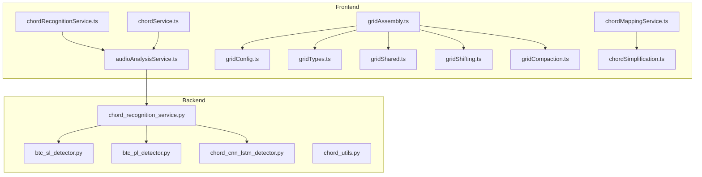
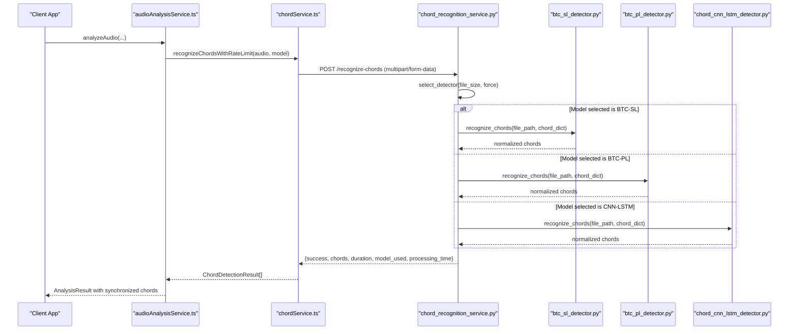
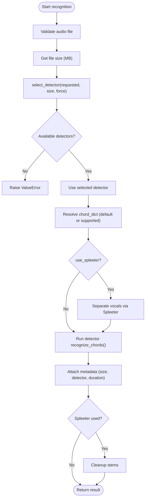
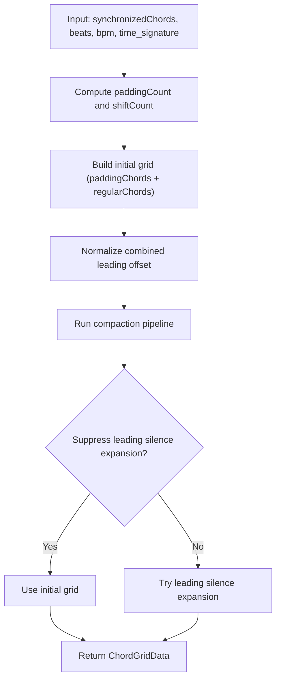
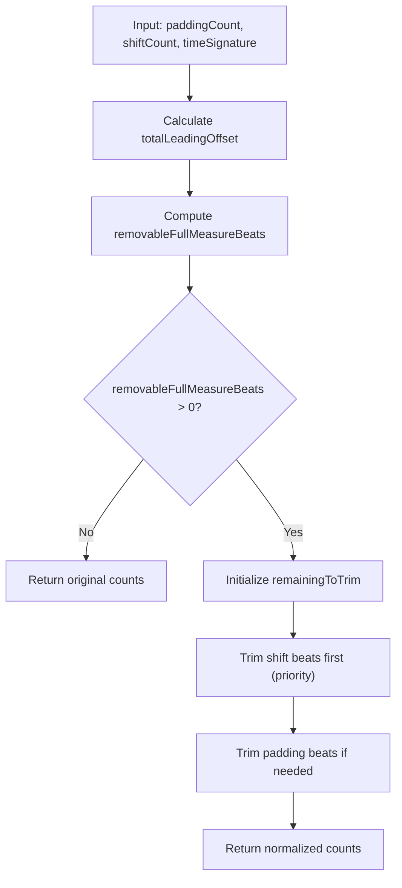
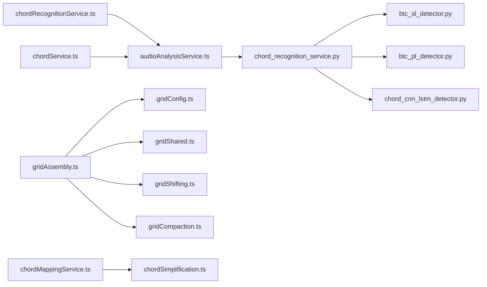

# Chord Analysis Service

<cite>
**Referenced Files in This Document**
- [chord_recognition_service.py](file://python_backend/services/audio/chord_recognition_service.py)
- [btc_sl_detector.py](file://python_backend/services/detectors/btc_sl_detector.py)
- [btc_pl_detector.py](file://python_backend/services/detectors/btc_pl_detector.py)
- [chord_cnn_lstm_detector.py](file://python_backend/services/detectors/chord_cnn_lstm_detector.py)
- [chord_utils.py](file://python_backend/services/audio/chord_utils.py)
- [chordRecognitionService.ts](file://src/services/chord-analysis/chordRecognitionService.ts)
- [chordService.ts](file://src/services/chord-analysis/chordService.ts)
- [audioAnalysisService.ts](file://src/services/audio/audioAnalysisService.ts)
- [gridAssembly.ts](file://src/services/chord-analysis/gridAssembly.ts)
- [gridConfig.ts](file://src/services/chord-analysis/gridConfig.ts)
- [gridTypes.ts](file://src/services/chord-analysis/gridTypes.ts)
- [gridShared.ts](file://src/services/chord-analysis/gridShared.ts)
- [gridShifting.ts](file://src/services/chord-analysis/gridShifting.ts)
- [gridCompaction.ts](file://src/services/chord-analysis/gridCompaction.ts)
- [chordMappingService.ts](file://src/services/chord-analysis/chordMappingService.ts)
- [chordSimplification.ts](file://src/utils/chordSimplification.ts)
</cite>

## Update Summary
**Changes Made**
- Updated Grid Shifting Algorithm section to document the new `normalizeCombinedLeadingOffset` function
- Documented long-intro downbeat preservation for songs whose opening musical phrase was previously pulled ahead by later chord-change statistics
- Added detailed explanation of UI stability improvements and visual alignment enhancements
- Updated Grid Assembly Algorithm section to reflect the integration of the normalization function
- Enhanced troubleshooting guide with new considerations for offset normalization

## Table of Contents
1. [Introduction](#introduction)
2. [Project Structure](#project-structure)
3. [Core Components](#core-components)
4. [Architecture Overview](#architecture-overview)
5. [Detailed Component Analysis](#detailed-component-analysis)
6. [Dependency Analysis](#dependency-analysis)
7. [Performance Considerations](#performance-considerations)
8. [Troubleshooting Guide](#troubleshooting-guide)
9. [Conclusion](#conclusion)

## Introduction
This document describes the chord analysis service architecture that processes audio input to produce synchronized chord progressions with precise timing. It covers the backend chord recognition service, the frontend orchestration, the grid assembly algorithm for organizing chord data into a visual grid, chord mapping for standardizing chord names, and the chord service that manages chord-related operations. The system integrates multiple backend models (BTC-SL, BTC-PL, CNN-LSTM) and selects the optimal model based on file size and availability. It also demonstrates chord simplification and timing synchronization features, with enhanced UI stability through advanced offset normalization techniques.

## Project Structure
The chord analysis service spans both the frontend and backend:
- Frontend orchestration and UI rendering:
  - Audio analysis orchestration and worker integration
  - Grid assembly and visual alignment with offset normalization
  - Chord mapping and simplification utilities
- Backend services:
  - Chord recognition service with model selection and fallback
  - Model-specific detector wrappers
  - Audio processing utilities

**Diagram sources**
- [audioAnalysisService.ts:1-704](file://src/services/audio/audioAnalysisService.ts#L1-L704)
- [chordRecognitionService.ts:1-32](file://src/services/chord-analysis/chordRecognitionService.ts#L1-L32)
- [chordService.ts:1-139](file://src/services/chord-analysis/chordService.ts#L1-L139)
- [gridAssembly.ts:1-237](file://src/services/chord-analysis/gridAssembly.ts#L1-L237)
- [gridConfig.ts:1-50](file://src/services/chord-analysis/gridConfig.ts#L1-L50)
- [gridTypes.ts:1-46](file://src/services/chord-analysis/gridTypes.ts#L1-L46)
- [gridShared.ts:1-74](file://src/services/chord-analysis/gridShared.ts#L1-L74)
- [gridShifting.ts:1-234](file://src/services/chord-analysis/gridShifting.ts#L1-L234)
- [gridCompaction.ts:1-666](file://src/services/chord-analysis/gridCompaction.ts#L1-L666)
- [chordMappingService.ts:1-568](file://src/services/chord-analysis/chordMappingService.ts#L1-L568)
- [chordSimplification.ts:1-201](file://src/utils/chordSimplification.ts#L1-L201)
- [chord_recognition_service.py:1-322](file://python_backend/services/audio/chord_recognition_service.py#L1-L322)
- [btc_sl_detector.py:1-246](file://python_backend/services/detectors/btc_sl_detector.py#L1-L246)
- [btc_pl_detector.py:1-246](file://python_backend/services/detectors/btc_pl_detector.py#L1-L246)
- [chord_cnn_lstm_detector.py:1-249](file://python_backend/services/detectors/chord_cnn_lstm_detector.py#L1-L249)
- [chord_utils.py:1-294](file://python_backend/services/audio/chord_utils.py#L1-L294)

**Section sources**
- [audioAnalysisService.ts:1-704](file://src/services/audio/audioAnalysisService.ts#L1-L704)
- [chord_recognition_service.py:1-322](file://python_backend/services/audio/chord_recognition_service.py#L1-L322)

## Core Components
- Chord Recognition Service (Python): Central orchestrator that selects the best model (BTC-SL, BTC-PL, CNN-LSTM) based on availability and file size, validates inputs, and coordinates audio separation via Spleeter when requested.
- Detector Wrappers (Python): Unified interfaces for each model that parse outputs into a normalized chord format.
- Frontend Chord Service: Client-side wrapper that posts audio to the backend and validates responses.
- Audio Analysis Service (Frontend): Orchestrates beat detection and chord recognition, synchronizes results, and handles offload paths.
- Grid Assembly (Frontend): Builds a visual grid from synchronized chords, computes padding and shift counts, runs a compaction pipeline to optimize alignment, and applies advanced offset normalization for UI stability.
- Chord Mapping Service (Frontend): Normalizes chord names to a standardized database format, resolves enharmonic equivalents, and supports slash inversions.
- Chord Utilities (Python): Provides chord simplification, normalization, merging, filtering, and validation helpers.

**Section sources**
- [chord_recognition_service.py:25-322](file://python_backend/services/audio/chord_recognition_service.py#L25-L322)
- [btc_sl_detector.py:17-246](file://python_backend/services/detectors/btc_sl_detector.py#L17-L246)
- [btc_pl_detector.py:17-246](file://python_backend/services/detectors/btc_pl_detector.py#L17-L246)
- [chord_cnn_lstm_detector.py:17-249](file://python_backend/services/detectors/chord_cnn_lstm_detector.py#L17-L249)
- [chordService.ts:1-139](file://src/services/chord-analysis/chordService.ts#L1-L139)
- [audioAnalysisService.ts:1-704](file://src/services/audio/audioAnalysisService.ts#L1-L704)
- [gridAssembly.ts:1-237](file://src/services/chord-analysis/gridAssembly.ts#L1-L237)
- [chordMappingService.ts:1-568](file://src/services/chord-analysis/chordMappingService.ts#L1-L568)
- [chord_utils.py:1-294](file://python_backend/services/audio/chord_utils.py#L1-L294)

## Architecture Overview
The system follows a client-server architecture:
- The frontend sends audio to the backend for processing.
- The backend selects an appropriate chord recognition model, runs inference, and returns normalized chord annotations with timing.
- The frontend synchronizes chords to beats, constructs a visual grid with offset normalization, and applies mapping and simplification.

**Diagram sources**
- [audioAnalysisService.ts:328-522](file://src/services/audio/audioAnalysisService.ts#L328-L522)
- [chordService.ts:17-108](file://src/services/chord-analysis/chordService.ts#L17-L108)
- [chord_recognition_service.py:173-296](file://python_backend/services/audio/chord_recognition_service.py#L173-L296)
- [btc_sl_detector.py:87-169](file://python_backend/services/detectors/btc_sl_detector.py#L87-L169)
- [btc_pl_detector.py:87-169](file://python_backend/services/detectors/btc_pl_detector.py#L87-L169)
- [chord_cnn_lstm_detector.py:78-191](file://python_backend/services/detectors/chord_cnn_lstm_detector.py#L78-L191)

## Detailed Component Analysis

### Chord Recognition Service (Backend)
Responsibilities:
- Model selection and fallback logic based on availability and file size.
- Audio validation and optional Spleeter vocal separation.
- Normalized result composition with metadata (detector used, processing time, duration).

Key behaviors:
- Detector selection prioritizes model capability and file size constraints.
- Automatic fallback to BTC models for small files and CNN-LSTM for larger files when available.
- Validates chord dictionary compatibility per model and falls back to defaults.

**Diagram sources**
- [chord_recognition_service.py:61-172](file://python_backend/services/audio/chord_recognition_service.py#L61-L172)
- [chord_recognition_service.py:173-296](file://python_backend/services/audio/chord_recognition_service.py#L173-L296)

**Section sources**
- [chord_recognition_service.py:25-322](file://python_backend/services/audio/chord_recognition_service.py#L25-L322)

### Detector Wrappers (Backend)
Each detector provides:
- Availability checks for required model files and dependencies.
- Recognition method returning normalized chord annotations with timing and model metadata.
- Lab file parsing and generation for standardized output.

Behavior highlights:
- BTC-SL and BTC-PL use a unified wrapper that generates a .lab file and parses it into chord segments.
- CNN-LSTM recognizes chords and writes a .lab file; includes a fallback to mock data for testing response format.

**Section sources**
- [btc_sl_detector.py:17-246](file://python_backend/services/detectors/btc_sl_detector.py#L17-L246)
- [btc_pl_detector.py:17-246](file://python_backend/services/detectors/btc_pl_detector.py#L17-L246)
- [chord_cnn_lstm_detector.py:17-249](file://python_backend/services/detectors/chord_cnn_lstm_detector.py#L17-L249)

### Frontend Chord Service
Responsibilities:
- Validates input file size and builds multipart form data with explicit detector selection.
- Calls backend endpoints and normalizes responses into ChordDetectionResult arrays.
- Supports offload URL path for production orchestration.

**Section sources**
- [chordService.ts:1-139](file://src/services/chord-analysis/chordService.ts#L1-L139)

### Audio Analysis Service (Frontend Orchestration)
Responsibilities:
- Coordinates beat detection and chord recognition in parallel.
- Synchronizes chords to beats and auto-selects meter (3/4 vs 4/4) using a heuristic.
- Handles offload paths for large files and Firebase storage URLs.

Key features:
- Worker integration for heavy computations (meter selection, synchronization).
- Robust error handling and rate-limiting semantics.

**Section sources**
- [audioAnalysisService.ts:1-704](file://src/services/audio/audioAnalysisService.ts#L1-L704)

### Grid Assembly Algorithm
Purpose:
- Construct a visual chord grid aligned to beats, compute padding and shift counts, apply compaction to improve alignment, and normalize combined leading offsets for UI stability.

Core steps:
- Extract beat times from synchronized chords.
- Compute padding count based on the first detected beat and BPM.
- Compute shift count to maximize downbeat-aligned chord changes.
- Preserve long-intro first-phrase alignment when the first musical chord can land on a downbeat without sacrificing too much global chord-change alignment.
- Build initial grid with padding chords and timestamps.
- Apply offset normalization to remove full measure beats from combined leading offset.
- Run compaction pipeline to shrink gaps, remove silent runs, adjust for tempo changes, and optionally expand leading silence.

**Updated** Enhanced with advanced offset normalization to improve UI stability and visual alignment.

**Diagram sources**
- [gridAssembly.ts:157-236](file://src/services/chord-analysis/gridAssembly.ts#L157-L236)
- [gridShifting.ts:150-187](file://src/services/chord-analysis/gridShifting.ts#L150-L187)
- [gridCompaction.ts:600-665](file://src/services/chord-analysis/gridCompaction.ts#L600-L665)

**Section sources**
- [gridAssembly.ts:1-237](file://src/services/chord-analysis/gridAssembly.ts#L1-L237)
- [gridShifting.ts:1-234](file://src/services/chord-analysis/gridShifting.ts#L1-L234)
- [gridCompaction.ts:1-666](file://src/services/chord-analysis/gridCompaction.ts#L1-L666)
- [gridConfig.ts:1-50](file://src/services/chord-analysis/gridConfig.ts#L1-L50)
- [gridTypes.ts:1-46](file://src/services/chord-analysis/gridTypes.ts#L1-L46)
- [gridShared.ts:1-74](file://src/services/chord-analysis/gridShared.ts#L1-L74)

### Grid Shifting Algorithm
Purpose:
- Calculate optimal padding and shift counts for musical grid alignment, with advanced normalization for UI stability.

Key capabilities:
- **Offset Normalization**: The `normalizeCombinedLeadingOffset` function removes full measure beats from the combined leading offset (padding + shift) to improve visual alignment.
- **Long Intro Downbeat Preservation**: Long leading silence is now eligible for first-musical-chord downbeat preservation. The selector prefers the intro-aligned shift when it remains globally competitive, preventing later song sections from pulling the opening phrase one beat early.
- **Priority-based Trimming**: Prefers trimming visual-only shift beats before trimming real padding beats to maintain audio integrity.
- **Configuration-driven**: Uses GRID_ALIGNMENT_CONFIG settings for short intro alignment, long intro alignment, and long intro compaction protection.

**Updated** Added comprehensive offset normalization functionality and long-intro downbeat preservation to address UI stability issues and improve visual alignment of musical grid layouts.

**Diagram sources**
- [gridShifting.ts:150-187](file://src/services/chord-analysis/gridShifting.ts#L150-L187)

**Section sources**
- [gridShifting.ts:1-234](file://src/services/chord-analysis/gridShifting.ts#L1-L234)
- [gridConfig.ts:1-50](file://src/services/chord-analysis/gridConfig.ts#L1-L50)

### Chord Mapping Service
Purpose:
- Normalize ML model chord outputs to a standardized database format for guitar chord diagrams.
- Handle enharmonic equivalents, slash inversions, and fallback strategies.

Key capabilities:
- Parse chord names supporting both standard notation and colon notation.
- Normalize roots and suffixes to database keys.
- Resolve preferred diagram chord names and provide chord variations.

**Section sources**
- [chordMappingService.ts:1-568](file://src/services/chord-analysis/chordMappingService.ts#L1-L568)

### Chord Utilities (Backend)
Capabilities:
- Simplify chords to basic forms (major, minor, augmented, diminished, suspended).
- Normalize chord labels and validate dictionary support.
- Convert LAB files to chord data, merge consecutive chords, filter short chords, and calculate statistics.

**Section sources**
- [chord_utils.py:1-294](file://python_backend/services/audio/chord_utils.py#L1-L294)

### Chord Simplification (Frontend)
Features:
- Simplifies chord labels to five basic types for display.
- Preserves enharmonic spelling and ignores slash inversions during simplification.
- Applies simplification to corrections and sequences to maintain consistency.

**Section sources**
- [chordSimplification.ts:1-201](file://src/utils/chordSimplification.ts#L1-L201)

## Dependency Analysis
High-level dependencies:
- Frontend depends on backend for chord recognition and on worker threads for heavy computations.
- Backend depends on detector wrappers and model-specific libraries.
- Grid assembly depends on configuration, shared utilities, shifting, and compaction modules.

**Diagram sources**
- [chordRecognitionService.ts:1-32](file://src/services/chord-analysis/chordRecognitionService.ts#L1-L32)
- [audioAnalysisService.ts:1-704](file://src/services/audio/audioAnalysisService.ts#L1-L704)
- [chordService.ts:1-139](file://src/services/chord-analysis/chordService.ts#L1-L139)
- [chord_recognition_service.py:1-322](file://python_backend/services/audio/chord_recognition_service.py#L1-L322)
- [btc_sl_detector.py:1-246](file://python_backend/services/detectors/btc_sl_detector.py#L1-L246)
- [btc_pl_detector.py:1-246](file://python_backend/services/detectors/btc_pl_detector.py#L1-L246)
- [chord_cnn_lstm_detector.py:1-249](file://python_backend/services/detectors/chord_cnn_lstm_detector.py#L1-L249)
- [gridAssembly.ts:1-237](file://src/services/chord-analysis/gridAssembly.ts#L1-L237)
- [gridConfig.ts:1-50](file://src/services/chord-analysis/gridConfig.ts#L1-L50)
- [gridShared.ts:1-74](file://src/services/chord-analysis/gridShared.ts#L1-L74)
- [gridShifting.ts:1-234](file://src/services/chord-analysis/gridShifting.ts#L1-L234)
- [gridCompaction.ts:1-666](file://src/services/chord-analysis/gridCompaction.ts#L1-L666)
- [chordMappingService.ts:1-568](file://src/services/chord-analysis/chordMappingService.ts#L1-L568)
- [chordSimplification.ts:1-201](file://src/utils/chordSimplification.ts#L1-L201)

**Section sources**
- [chord_recognition_service.py:1-322](file://python_backend/services/audio/chord_recognition_service.py#L1-L322)
- [audioAnalysisService.ts:1-704](file://src/services/audio/audioAnalysisService.ts#L1-L704)
- [gridAssembly.ts:1-237](file://src/services/chord-analysis/gridAssembly.ts#L1-L237)

## Performance Considerations
- Model selection favors smaller files for BTC models and larger files for CNN-LSTM when available, balancing accuracy and throughput.
- Frontend orchestrates beat detection and chord recognition in parallel to reduce total latency.
- Grid compaction reduces visual clutter by shrinking gaps and silent runs, improving readability.
- Worker integration offloads heavy computations (meter selection, synchronization) to web workers.
- **Offset Normalization**: Advanced offset normalization improves UI stability without impacting computational performance significantly.

## Troubleshooting Guide
Common issues and resolutions:
- No detectors available: The service raises an error when no model is available; verify model directories and dependencies.
- File too large: The service enforces size limits per model; use smaller clips or the CNN-LSTM model for larger files.
- Spleeter failures: If vocal separation fails, the service continues with the original audio and logs the error.
- Offload errors: For production offload paths, ensure Firebase storage URLs and network connectivity; the service deletes offload resources after processing.
- Invalid responses: Frontend validates chord results and filters invalid entries; check backend logs for detailed errors.
- **UI Alignment Issues**: If musical grid layouts appear misaligned, verify that the `normalizeCombinedLeadingOffset` function is properly trimming full measure beats from the combined leading offset.
- **Long Intro Starts One Beat Early**: Check `longIntroAlignment` thresholds in GRID_ALIGNMENT_CONFIG and verify that the first musical chord remains on visual beat 1 when the intro-aligned shift is globally competitive.
- **Offset Normalization Problems**: Check GRID_ALIGNMENT_CONFIG settings for short intro alignment, long intro alignment, and long intro protection parameters if visual alignment issues persist.

**Section sources**
- [chord_recognition_service.py:77-105](file://python_backend/services/audio/chord_recognition_service.py#L77-L105)
- [chord_recognition_service.py:235-250](file://python_backend/services/audio/chord_recognition_service.py#L235-L250)
- [audioAnalysisService.ts:146-326](file://src/services/audio/audioAnalysisService.ts#L146-L326)
- [chordService.ts:53-76](file://src/services/chord-analysis/chordService.ts#L53-L76)
- [gridShifting.ts:150-187](file://src/services/chord-analysis/gridShifting.ts#L150-L187)

## Conclusion
The chord analysis service provides a robust, modular architecture for recognizing chords from audio, synchronizing them to beats, and assembling a visual grid optimized for alignment. It integrates multiple backend models with intelligent selection, offers chord mapping and simplification for display, and supports both local and offloaded processing. The frontend orchestrator coordinates timing-sensitive operations efficiently, while the backend ensures reliability through validation, fallback strategies, and standardized output formats. **Enhanced with advanced offset normalization and long-intro downbeat preservation**, the system now provides improved UI stability and visual alignment for musical grid layouts, addressing common alignment issues while maintaining optimal performance characteristics.
