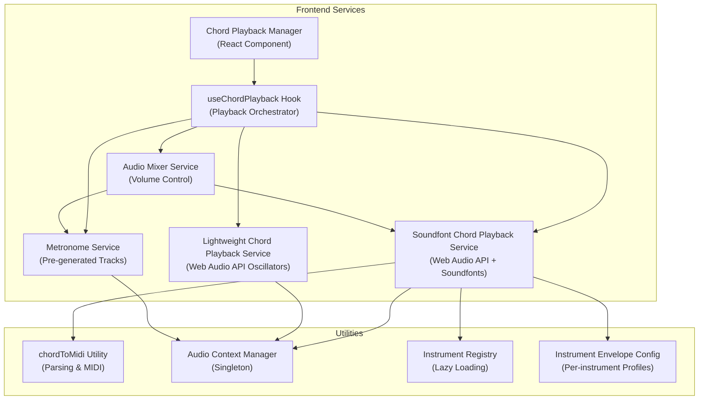
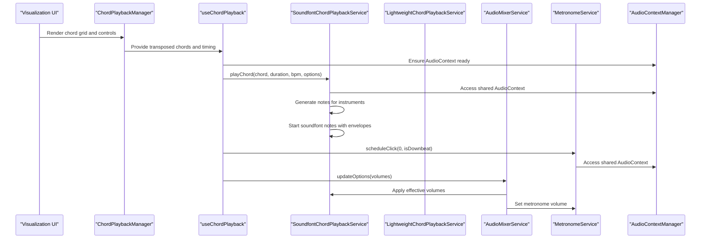
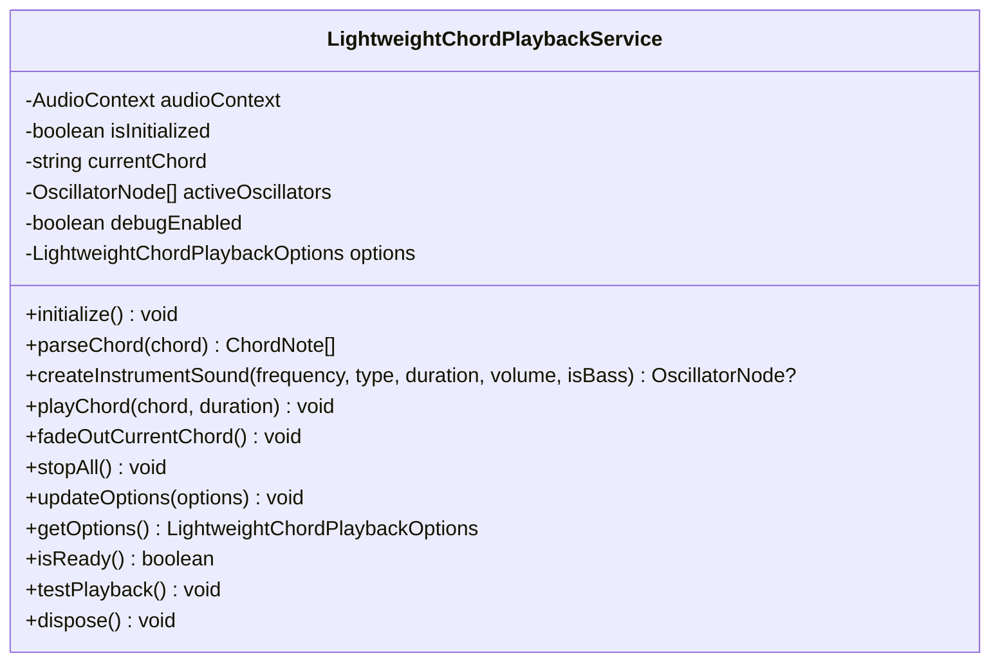
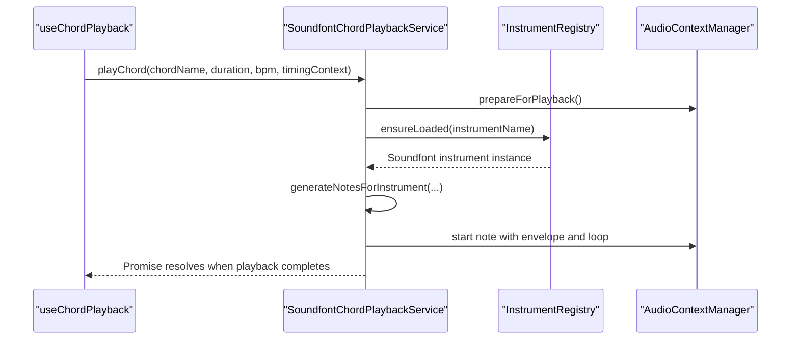
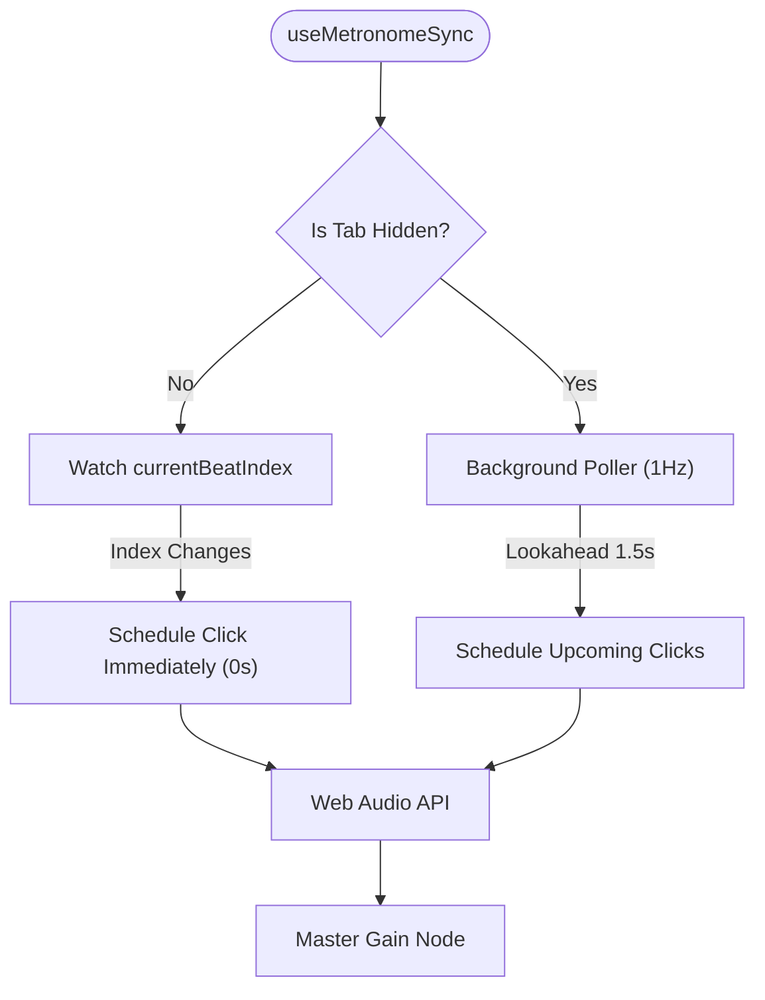
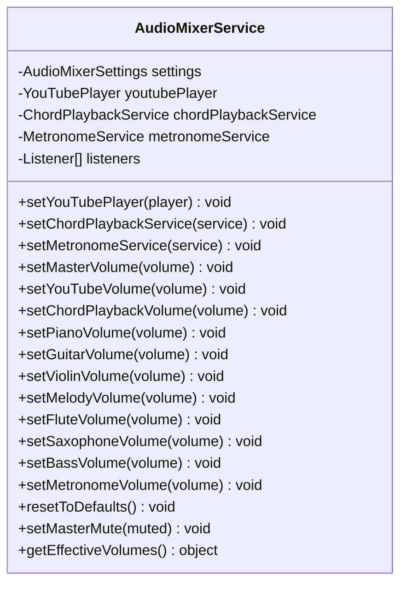
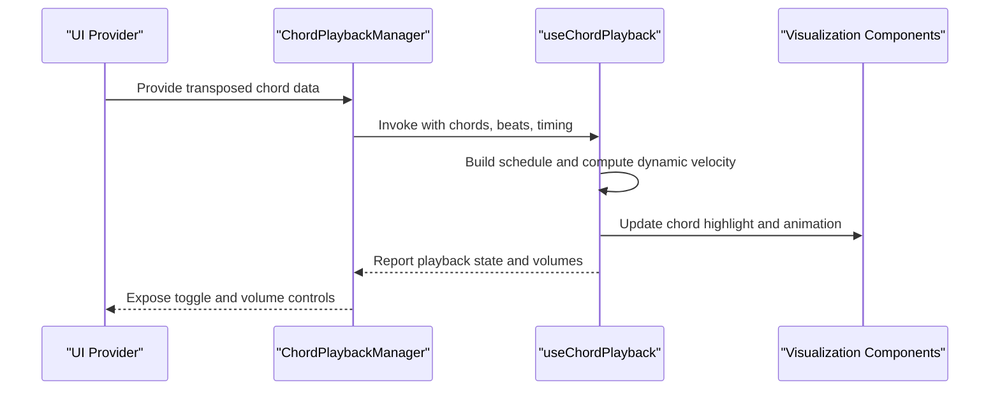
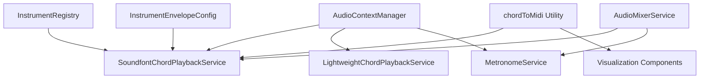

# Chord Playback Service

<cite>
**Referenced Files in This Document**
- [lightweightChordPlaybackService.ts](file://src/services/chord-playback/lightweightChordPlaybackService.ts)
- [soundfontChordPlaybackService.ts](file://src/services/chord-playback/soundfontChordPlaybackService.ts)
- [metronomeService.ts](file://src/services/chord-playback/metronomeService.ts)
- [audioMixerService.ts](file://src/services/chord-playback/audioMixerService.ts)
- [instrumentEnvelopeConfig.ts](file://src/services/chord-playback/instrumentEnvelopeConfig.ts)
- [instrumentRegistry.ts](file://src/services/chord-playback/soundfont/instrumentRegistry.ts)
- [constants.ts](file://src/services/chord-playback/soundfont/constants.ts)
- [audioContextManager.ts](file://src/services/audio/audioContextManager.ts)
- [ChordPlaybackManager.tsx](file://src/components/chord-playback/ChordPlaybackManager.tsx)
- [useChordPlayback.ts](file://src/hooks/chord-playback/useChordPlayback.ts)
- [useMetronomeSync.ts](file://src/hooks/chord-playback/useMetronomeSync.ts)
- [MetronomeControls.tsx](file://src/components/chord-playback/MetronomeControls.tsx)
- [chordToMidi.ts](file://src/utils/chordToMidi.ts)
- [usePitchShiftAudio.ts](file://src/hooks/chord-playback/usePitchShiftAudio.ts)
</cite>

## Table of Contents
1. [Introduction](#introduction)
2. [Project Structure](#project-structure)
3. [Core Components](#core-components)
4. [Architecture Overview](#architecture-overview)
5. [Detailed Component Analysis](#detailed-component-analysis)
6. [Dependency Analysis](#dependency-analysis)
7. [Performance Considerations](#performance-considerations)
8. [Troubleshooting Guide](#troubleshooting-guide)
9. [Conclusion](#conclusion)

## Introduction
This document describes the chord playback service architecture designed for synchronized audio playback. It covers:
- A lightweight chord playback service for basic chord rendering using Web Audio API oscillators
- A production-grade soundfont-based playback service for realistic instrument sounds
- A metronome service for rhythm accompaniment with pre-generated audio tracks
- Integration with Web Audio API, audio buffer management, and real-time playback controls
- Examples of chord progression playback, loop functionality, pitch shifting capabilities, and metronome synchronization
- The relationship between playback services and visualization components

## Project Structure
The chord playback system spans backend Python services and frontend React components and hooks:
- Backend services manage audio extraction, beat detection, and chord recognition
- Frontend services orchestrate Web Audio API playback, mixing, and synchronization
- Visualization components render chord grids and piano roll displays

**Diagram sources**
- [ChordPlaybackManager.tsx:55-122](file://src/components/chord-playback/ChordPlaybackManager.tsx#L55-L122)
- [useChordPlayback.ts:250-738](file://src/hooks/chord-playback/useChordPlayback.ts#L250-L738)
- [soundfontChordPlaybackService.ts:64-706](file://src/services/chord-playback/soundfontChordPlaybackService.ts#L64-L706)
- [lightweightChordPlaybackService.ts:148-439](file://src/services/chord-playback/lightweightChordPlaybackService.ts#L148-L439)
- [metronomeService.ts:34-498](file://src/services/chord-playback/metronomeService.ts#L34-L498)
- [audioMixerService.ts:39-370](file://src/services/chord-playback/audioMixerService.ts#L39-L370)
- [chordToMidi.ts:227-296](file://src/utils/chordToMidi.ts#L227-L296)
- [audioContextManager.ts:8-124](file://src/services/audio/audioContextManager.ts#L8-L124)
- [instrumentRegistry.ts:7-120](file://src/services/chord-playback/soundfont/instrumentRegistry.ts#L7-L120)
- [instrumentEnvelopeConfig.ts:1-106](file://src/services/chord-playback/instrumentEnvelopeConfig.ts#L1-L106)

**Section sources**
- [ChordPlaybackManager.tsx:1-123](file://src/components/chord-playback/ChordPlaybackManager.tsx#L1-L123)
- [useChordPlayback.ts:1-739](file://src/hooks/chord-playback/useChordPlayback.ts#L1-L739)
- [soundfontChordPlaybackService.ts:1-716](file://src/services/chord-playback/soundfontChordPlaybackService.ts#L1-L716)
- [lightweightChordPlaybackService.ts:1-440](file://src/services/chord-playback/lightweightChordPlaybackService.ts#L1-L440)
- [metronomeService.ts:1-499](file://src/services/chord-playback/metronomeService.ts#L1-L499)
- [audioMixerService.ts:1-371](file://src/services/chord-playback/audioMixerService.ts#L1-L371)
- [chordToMidi.ts:1-383](file://src/utils/chordToMidi.ts#L1-L383)
- [audioContextManager.ts:1-125](file://src/services/audio/audioContextManager.ts#L1-L125)
- [instrumentRegistry.ts:1-121](file://src/services/chord-playback/soundfont/instrumentRegistry.ts#L1-L121)
- [instrumentEnvelopeConfig.ts:1-106](file://src/services/chord-playback/instrumentEnvelopeConfig.ts#L1-L106)

## Core Components
- Lightweight Chord Playback Service: Generates synthetic chord sounds using Web Audio API oscillators, filters, and envelopes. Designed for performance and simplicity.
- Soundfont Chord Playback Service: Produces realistic instrument sounds using soundfonts via the smplr library. Supports multiple instruments, dynamic velocities, and looped playback.
- Metronome Service: Provides precise rhythmic clicks synchronized with the visual beat grid using `currentBeatIndex`.
- Audio Mixer Service: Centralized volume management for YouTube, chord playback, and metronome across the application.
- Audio Context Manager: Singleton wrapper around Web Audio API AudioContext with resume/suspend handling and lifecycle management.
- Instrument Registry: Lazy loads and manages soundfont instruments, with automatic unloading to conserve memory.
- Instrument Envelope Config: Per-instrument ADSR-like profiles for realistic note shaping and sustain tails.
- chordToMidi Utility: Parses chord names into MIDI notes for visualization and playback.

**Section sources**
- [lightweightChordPlaybackService.ts:148-439](file://src/services/chord-playback/lightweightChordPlaybackService.ts#L148-L439)
- [soundfontChordPlaybackService.ts:64-706](file://src/services/chord-playback/soundfontChordPlaybackService.ts#L64-L706)
- [metronomeService.ts:34-498](file://src/services/chord-playback/metronomeService.ts#L34-L498)
- [audioMixerService.ts:39-370](file://src/services/chord-playback/audioMixerService.ts#L39-L370)
- [audioContextManager.ts:8-124](file://src/services/audio/audioContextManager.ts#L8-L124)
- [instrumentRegistry.ts:7-120](file://src/services/chord-playback/soundfont/instrumentRegistry.ts#L7-L120)
- [instrumentEnvelopeConfig.ts:1-106](file://src/services/chord-playback/instrumentEnvelopeConfig.ts#L1-L106)
- [chordToMidi.ts:227-296](file://src/utils/chordToMidi.ts#L227-L296)

## Architecture Overview
The playback architecture integrates frontend hooks and services with visualization components to deliver synchronized audio and visual experiences.

**Diagram sources**
- [ChordPlaybackManager.tsx:55-122](file://src/components/chord-playback/ChordPlaybackManager.tsx#L55-L122)
- [useChordPlayback.ts:250-738](file://src/hooks/chord-playback/useChordPlayback.ts#L250-L738)
- [soundfontChordPlaybackService.ts:192-287](file://src/services/chord-playback/soundfontChordPlaybackService.ts#L192-L287)
- [lightweightChordPlaybackService.ts:342-378](file://src/services/chord-playback/lightweightChordPlaybackService.ts#L342-L378)
- [audioMixerService.ts:276-296](file://src/services/chord-playback/audioMixerService.ts#L276-L296)
- [metronomeService.ts:131-215](file://src/services/chord-playback/metronomeService.ts#L131-L215)
- [audioContextManager.ts:26-91](file://src/services/audio/audioContextManager.ts#L26-L91)

## Detailed Component Analysis

### Lightweight Chord Playback Service
- Purpose: Fast, low-overhead chord playback using Web Audio API oscillators and filters
- Features:
  - Parses chord names into frequencies and generates root-position and inverted chords
  - Creates layered oscillator voices with main, harmonic, and sub-oscillators
  - Applies filters, delays, and reverbs for realistic tone shaping
  - Supports piano and guitar timbres with distinct envelopes and gains
  - Automatic fade-out between chords and graceful cleanup
- Options:
  - Separate volumes for piano and guitar channels
  - Enable/disable flag for activation
- Integration:
  - Uses shared AudioContext via AudioContextManager
  - Can be toggled independently of soundfont playback

**Diagram sources**
- [lightweightChordPlaybackService.ts:148-439](file://src/services/chord-playback/lightweightChordPlaybackService.ts#L148-L439)

**Section sources**
- [lightweightChordPlaybackService.ts:1-440](file://src/services/chord-playback/lightweightChordPlaybackService.ts#L1-L440)
- [audioContextManager.ts:26-91](file://src/services/audio/audioContextManager.ts#L26-L91)

### Soundfont Chord Playback Service
- Purpose: Realistic instrument playback using soundfonts with dynamic note generation and per-instrument envelopes
- Features:
  - Multi-instrument support: piano, guitar, violin, flute, saxophone, bass
  - Dynamic velocity scaling based on signal dynamics and beat context
  - Density compensation for strummed chords and block chords
  - Native loop support and sustain retrigger for long notes
  - Automatic instrument loading and unloading to manage memory
- Playback pipeline:
  - Prepare AudioContext and ensure instruments are loaded
  - Generate scheduled notes per instrument with onset timing and velocities
  - Start notes with appropriate envelopes and loop settings
  - Soft-stop or hard-stop on chord switches and playback pauses
- Options:
  - Per-instrument volumes and master enable flag
  - Target key and guitar voicing selections for transposition and voicing

**Diagram sources**
- [soundfontChordPlaybackService.ts:192-287](file://src/services/chord-playback/soundfontChordPlaybackService.ts#L192-L287)
- [instrumentRegistry.ts:60-101](file://src/services/chord-playback/soundfont/instrumentRegistry.ts#L60-L101)
- [audioContextManager.ts:108-121](file://src/services/audio/audioContextManager.ts#L108-L121)

**Section sources**
- [soundfontChordPlaybackService.ts:64-706](file://src/services/chord-playback/soundfontChordPlaybackService.ts#L64-L706)
- [instrumentRegistry.ts:1-121](file://src/services/chord-playback/soundfont/instrumentRegistry.ts#L1-L121)
- [instrumentEnvelopeConfig.ts:1-106](file://src/services/chord-playback/instrumentEnvelopeConfig.ts#L1-L106)
- [constants.ts:1-62](file://src/services/chord-playback/soundfont/constants.ts#L1-L62)

### Metronome Service
- Purpose: Precise rhythmic clicks synchronized directly with the visual beat grid.
- Approach: Event-driven synchronization based on `currentBeatIndex` in the foreground, with lookahead polling in the background.
- Features:
  - Multiple sound styles and drum track modes
  - Exact 1:1 synchronization with visual beat grid highlighting
  - Seamless background tab support using Web Audio lookahead
  - Master gain node control for immediate termination on pause/stop
  - Volume boost for drum tracks and configurable click duration
- Integration:
  - Foreground playback listens to `currentBeatIndex` updates from `useAnalyzePageViewModel`
  - Background playback uses a `setInterval` poller mapping against `chordGridBeats` when rAF stops

**Diagram sources**
- [useMetronomeSync.ts:1-120](file://src/hooks/chord-playback/useMetronomeSync.ts#L1-L120)

**Section sources**
- [metronomeService.ts:1-350](file://src/services/chord-playback/metronomeService.ts#L1-L350)
- [useMetronomeSync.ts:1-120](file://src/hooks/chord-playback/useMetronomeSync.ts#L1-L120)

### Audio Mixer Service
- Purpose: Centralized volume management across all audio sources
- Features:
  - Master volume and per-source sliders (YouTube, chord playback, metronome)
  - Effective volume calculation combining master and source-specific volumes
  - Real-time updates to chord playback and metronome volumes
  - Persistence via sessionStorage and listener notifications
- Integration:
  - Registers YouTube player, chord playback service, and metronome service
  - Applies effective volumes immediately upon changes

**Diagram sources**
- [audioMixerService.ts:39-370](file://src/services/chord-playback/audioMixerService.ts#L39-L370)

**Section sources**
- [audioMixerService.ts:1-371](file://src/services/chord-playback/audioMixerService.ts#L1-L371)

### Integration with Visualization Components
- ChordPlaybackManager:
  - Wraps playback logic and applies pitch shift transposition when enabled
  - Exposes stable playback state and volume controls to parent components
- useChordPlayback:
  - Builds a pre-scheduled chord timeline from chord grid and beats
  - Handles foreground and background tab playback with recovery mechanisms
  - Integrates with audio dynamics analyzer for velocity scaling
  - Manages instrument-specific volumes and dynamic velocity adjustments
- MetronomeControls:
  - UI for enabling/disabling metronome and selecting track mode
  - Triggers synchronized toggle with current playback time awareness

**Diagram sources**
- [ChordPlaybackManager.tsx:55-122](file://src/components/chord-playback/ChordPlaybackManager.tsx#L55-L122)
- [useChordPlayback.ts:250-738](file://src/hooks/chord-playback/useChordPlayback.ts#L250-L738)
- [MetronomeControls.tsx:36-62](file://src/components/chord-playback/MetronomeControls.tsx#L36-L62)

**Section sources**
- [ChordPlaybackManager.tsx:1-123](file://src/components/chord-playback/ChordPlaybackManager.tsx#L1-L123)
- [useChordPlayback.ts:1-739](file://src/hooks/chord-playback/useChordPlayback.ts#L1-L739)
- [MetronomeControls.tsx:1-138](file://src/components/chord-playback/MetronomeControls.tsx#L1-L138)

## Dependency Analysis
The playback services depend on shared infrastructure and utilities:
- AudioContextManager: Ensures a single, properly resumed AudioContext across services
- InstrumentRegistry: Lazily loads and manages soundfont instruments with unloading timers
- InstrumentEnvelopeConfig: Provides per-instrument envelope profiles for realistic playback
- chordToMidi: Converts chord names to MIDI notes for visualization and playback
- AudioMixerService: Applies effective volumes to all audio sources

**Diagram sources**
- [audioContextManager.ts:26-91](file://src/services/audio/audioContextManager.ts#L26-L91)
- [soundfontChordPlaybackService.ts:84-91](file://src/services/chord-playback/soundfontChordPlaybackService.ts#L84-L91)
- [lightweightChordPlaybackService.ts:169-183](file://src/services/chord-playback/lightweightChordPlaybackService.ts#L169-L183)
- [metronomeService.ts:51-80](file://src/services/chord-playback/metronomeService.ts#L51-L80)
- [instrumentRegistry.ts:14-19](file://src/services/chord-playback/soundfont/instrumentRegistry.ts#L14-L19)
- [instrumentEnvelopeConfig.ts:98-100](file://src/services/chord-playback/instrumentEnvelopeConfig.ts#L98-L100)
- [chordToMidi.ts:227-296](file://src/utils/chordToMidi.ts#L227-L296)
- [audioMixerService.ts:276-296](file://src/services/chord-playback/audioMixerService.ts#L276-L296)

**Section sources**
- [audioContextManager.ts:1-125](file://src/services/audio/audioContextManager.ts#L1-L125)
- [instrumentRegistry.ts:1-121](file://src/services/chord-playback/soundfont/instrumentRegistry.ts#L1-L121)
- [instrumentEnvelopeConfig.ts:1-106](file://src/services/chord-playback/instrumentEnvelopeConfig.ts#L1-L106)
- [chordToMidi.ts:1-383](file://src/utils/chordToMidi.ts#L1-L383)
- [audioMixerService.ts:1-371](file://src/services/chord-playback/audioMixerService.ts#L1-L371)

## Performance Considerations
- Lightweight vs. Soundfont trade-offs:
  - Lightweight service prioritizes speed and minimal resource usage
  - Soundfont service delivers richer realism at higher CPU/memory cost
- Instrument loading and unloading:
  - Instruments are lazily loaded and unloaded after a delay to conserve memory
  - Avoids unnecessary preload overhead for rarely used instruments
- Dynamic velocity and density compensation:
  - Reduces perceived loudness inconsistencies across instruments and voicings
- Background tab handling for metronome and chords:
  - Falls back to polling audio time to schedule upcoming beats using Web Audio lookahead when rAF is inactive
- Background tab handling:
  - Falls back to polling audio time to maintain synchronization when rAF is inactive
- Volume management:
  - Centralized mixer reduces redundant gain nodes and simplifies volume control

[No sources needed since this section provides general guidance]

## Troubleshooting Guide
Common issues and resolutions:
- Autoplay policy failures:
  - Ensure user interaction occurs before resuming AudioContext
  - AudioContextManager attaches auto-resume listeners on first user gesture
- No sound from soundfont service:
  - Verify service is enabled and instruments are loaded
  - Check that AudioContext is running and not suspended
- Metronome not playing:
  - Confirm track generation succeeded and parameters match
  - Ensure service is enabled and start time is valid
- Volume discrepancies:
  - Use AudioMixerService to verify effective volumes
  - Check master volume and per-source sliders
- Background tab desync:
  - The playback hook automatically switches to background polling
  - Recovery logic resets playback state and resumes on tab focus

**Section sources**
- [audioContextManager.ts:50-91](file://src/services/audio/audioContextManager.ts#L50-L91)
- [soundfontChordPlaybackService.ts:128-148](file://src/services/chord-playback/soundfontChordPlaybackService.ts#L128-L148)
- [metronomeService.ts:230-244](file://src/services/chord-playback/metronomeService.ts#L230-L244)
- [audioMixerService.ts:276-296](file://src/services/chord-playback/audioMixerService.ts#L276-L296)
- [useChordPlayback.ts:502-540](file://src/hooks/chord-playback/useChordPlayback.ts#L502-L540)

## Conclusion
The chord playback service architecture combines lightweight and soundfont-based playback with a robust metronome system and centralized audio mixing. It leverages Web Audio API for precise timing, pre-generated tracks for smooth rhythm accompaniment, and dynamic velocity scaling for expressive playback. The integration with visualization components ensures synchronized audio and visual experiences, while the mixer service provides unified volume control across all audio sources.