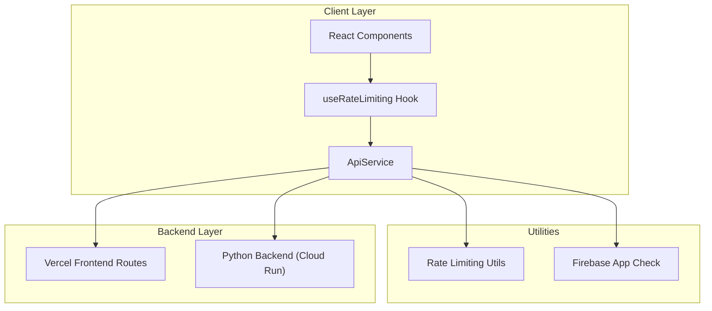
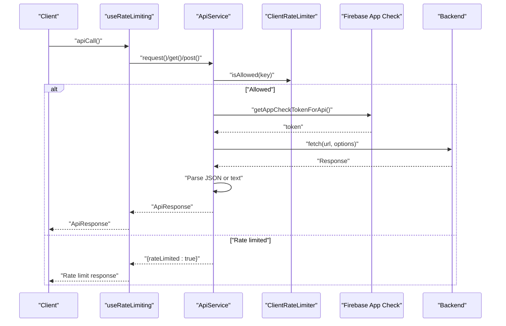
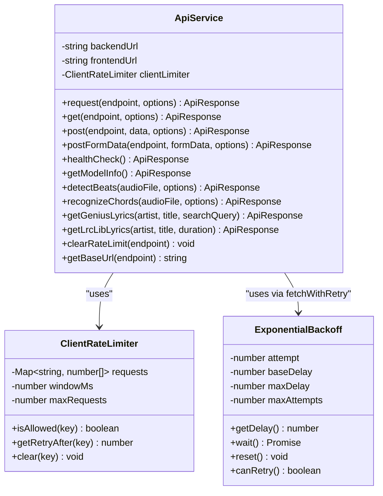
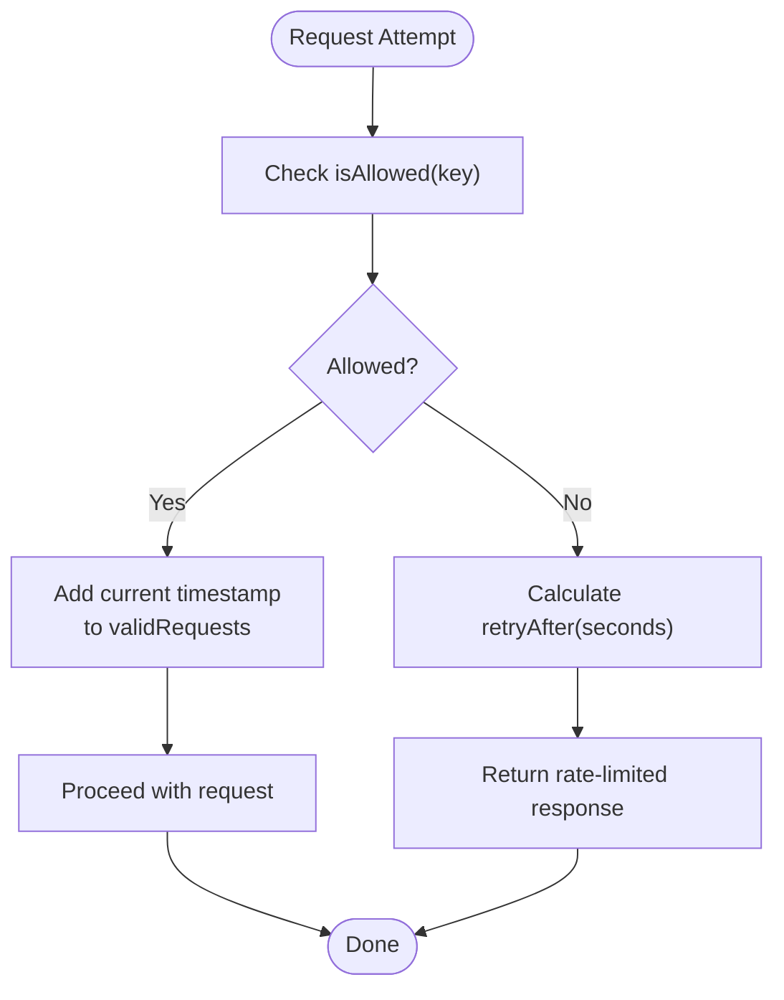
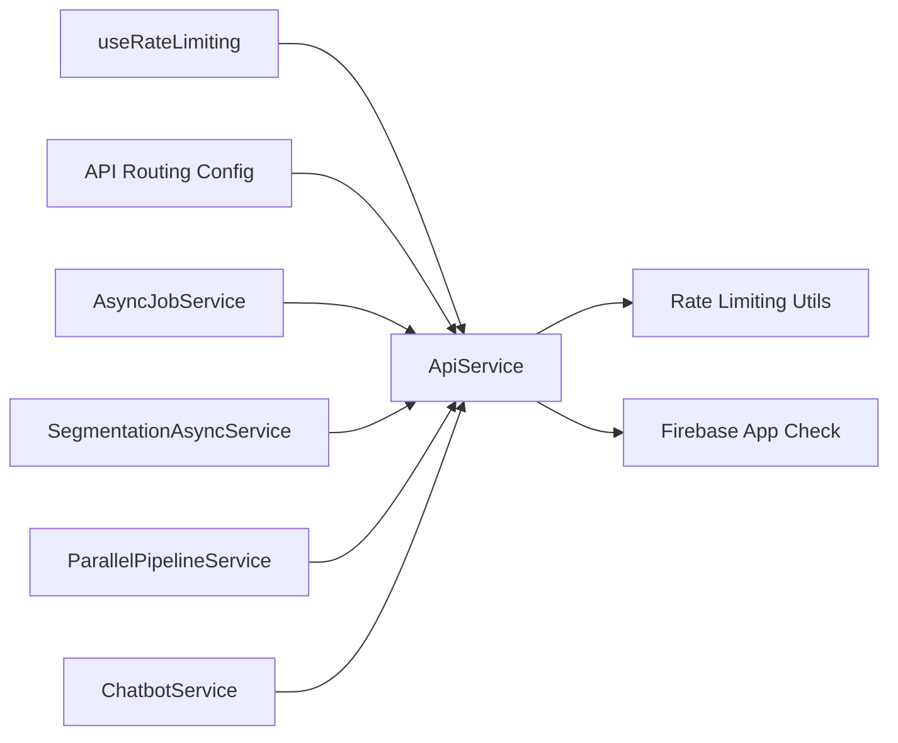

# Core API Service

<cite>
**Referenced Files in This Document**
- [apiService.ts](file://src/services/api/apiService.ts)
- [rateLimiting.ts](file://src/utils/rateLimiting.ts)
- [useRateLimiting.ts](file://src/hooks/api/useRateLimiting.ts)
- [firebase.ts](file://src/config/firebase.ts)
- [serverAppCheck.ts](file://src/utils/serverAppCheck.ts)
- [api.ts](file://src/config/api.ts)
- [asyncJobService.ts](file://src/services/api/asyncJobService.ts)
- [segmentationAsyncService.ts](file://src/services/api/segmentationAsyncService.ts)
- [parallelPipelineService.ts](file://src/services/api/parallelPipelineService.ts)
- [chatbotService.ts](file://src/services/api/chatbotService.ts)
</cite>

## Table of Contents
1. [Introduction](#introduction)
2. [Project Structure](#project-structure)
3. [Core Components](#core-components)
4. [Architecture Overview](#architecture-overview)
5. [Detailed Component Analysis](#detailed-component-analysis)
6. [Dependency Analysis](#dependency-analysis)
7. [Performance Considerations](#performance-considerations)
8. [Troubleshooting Guide](#troubleshooting-guide)
9. [Conclusion](#conclusion)

## Introduction
This document describes the core API service architecture centered around the enhanced ApiService class. The service acts as the primary HTTP client for all API interactions, integrating client-side rate limiting, timeout handling, retry mechanisms, and Firebase App Check authentication. It standardizes request/response handling, error management, and provides convenience methods for common operations such as beat detection, chord recognition, and lyrics retrieval. The document also covers client-side rate limiter configuration and how it prevents overwhelming backend services.

## Project Structure
The API service architecture spans several modules:
- Core HTTP client: ApiService with request/response handling, timeouts, retries, and rate limiting
- Client-side rate limiting utilities: exponential backoff, retry helpers, and client-side limiter
- React integration: useRateLimiting hook for UI-driven rate limit handling
- Authentication: Firebase App Check token injection for API requests
- Routing and configuration: API endpoint routing and fetch options
- Supporting services: async job orchestration, parallel pipeline optimization, and chatbot integration

**Diagram sources**
- [apiService.ts:29-407](file://src/services/api/apiService.ts#L29-L407)
- [rateLimiting.ts:117-266](file://src/utils/rateLimiting.ts#L117-L266)
- [firebase.ts:517-536](file://src/config/firebase.ts#L517-L536)
- [api.ts:27-51](file://src/config/api.ts#L27-L51)

**Section sources**
- [apiService.ts:29-407](file://src/services/api/apiService.ts#L29-L407)
- [rateLimiting.ts:117-266](file://src/utils/rateLimiting.ts#L117-L266)
- [firebase.ts:517-536](file://src/config/firebase.ts#L517-L536)
- [api.ts:27-51](file://src/config/api.ts#L27-L51)

## Core Components
- ApiService: Central HTTP client with request(), get(), post(), postFormData(), and specialized methods for ML tasks. Implements client-side rate limiting, timeout handling, and retry logic. Injects Firebase App Check tokens and parses responses with robust error handling.
- Rate limiting utilities: Exponential backoff, retry helpers, and a client-side limiter to throttle requests per endpoint key.
- useRateLimiting hook: React hook that wraps ApiService calls and manages rate limit state, optional auto-retry, and UI notifications.
- Firebase App Check: Token acquisition and injection into outbound API requests.
- API routing configuration: Endpoint keys and routing logic for frontend vs backend services.

**Section sources**
- [apiService.ts:29-407](file://src/services/api/apiService.ts#L29-L407)
- [rateLimiting.ts:117-266](file://src/utils/rateLimiting.ts#L117-L266)
- [useRateLimiting.ts:20-144](file://src/hooks/api/useRateLimiting.ts#L20-L144)
- [firebase.ts:517-536](file://src/config/firebase.ts#L517-L536)
- [api.ts:27-51](file://src/config/api.ts#L27-L51)

## Architecture Overview
The ApiService integrates multiple concerns:
- Request orchestration: URL construction, method selection, body serialization, and header management
- Timeout control: AbortController-based timeouts with validation and error reporting
- Retry and resilience: fetchWithRetry for exponential backoff and rate-limit-aware retries
- Rate limiting: ClientRateLimiter to cap concurrent requests per endpoint key
- Authentication: X-Firebase-AppCheck header injection via getAppCheckTokenForApi
- Response parsing: JSON-first parsing with fallbacks and structured error responses

**Diagram sources**
- [apiService.ts:56-241](file://src/services/api/apiService.ts#L56-L241)
- [rateLimiting.ts:210-265](file://src/utils/rateLimiting.ts#L210-L265)
- [firebase.ts:517-536](file://src/config/firebase.ts#L517-L536)
- [useRateLimiting.ts:82-107](file://src/hooks/api/useRateLimiting.ts#L82-L107)

## Detailed Component Analysis

### ApiService: Enhanced HTTP Client
Responsibilities:
- Unified request orchestration with configurable timeouts and retries
- Client-side rate limiting per endpoint key
- Automatic Firebase App Check token injection
- Robust response parsing and error formatting
- Convenience methods for common operations (health checks, ML tasks)

Key behaviors:
- Timeout handling: AbortController with validation and detailed logs
- Retry logic: fetchWithRetry with exponential backoff and rate-limit-aware waits
- Rate limiting: ClientRateLimiter enforces per-minute caps
- Authentication: X-Firebase-AppCheck header when token is available
- Response parsing: JSON-first with fallback text parsing and structured error responses

Example usage patterns:
- GET request: apiService.get("/api/health", { timeout: 25000 })
- POST JSON: apiService.post("/api/recognize-chords", payload, { timeout: 800000 })
- POST FormData: apiService.postFormData("/api/detect-beats", formData, { timeout: 800000 })
- Specialized methods: detectBeats(), recognizeChords(), getGeniusLyrics(), getLrcLibLyrics()

Error handling:
- HTTP 429: Structured rate limit response with retryAfter
- Timeout: AbortError mapped to user-friendly message
- Network errors: Generic network error message
- Unknown errors: Fallback error message

**Section sources**
- [apiService.ts:29-407](file://src/services/api/apiService.ts#L29-L407)

#### Class Diagram: ApiService and Related Types

**Diagram sources**
- [apiService.ts:29-407](file://src/services/api/apiService.ts#L29-L407)
- [rateLimiting.ts:210-265](file://src/utils/rateLimiting.ts#L210-L265)
- [rateLimiting.ts:59-115](file://src/utils/rateLimiting.ts#L59-L115)

### Rate Limiting Utilities
Components:
- ClientRateLimiter: Tracks request timestamps per endpoint key and calculates retry-after windows
- ExponentialBackoff: Implements exponential backoff with jitter and max attempts
- fetchWithRetry: Orchestrates retries for 5xx and 429 responses, respecting server Retry-After
- isRateLimitError/getRateLimitMessage: Type guards and user-friendly messages for rate limit errors

Configuration:
- Client-side limiter defaults to 4 requests per 60 seconds for beat/chord models
- Backoff parameters configurable via ApiRequestOptions (maxAttempts, baseDelay, maxDelay)

**Section sources**
- [rateLimiting.ts:117-266](file://src/utils/rateLimiting.ts#L117-L266)

#### Flowchart: ClientRateLimiter Decision

**Diagram sources**
- [rateLimiting.ts:210-265](file://src/utils/rateLimiting.ts#L210-L265)

### React Integration: useRateLimiting Hook
Purpose:
- Wraps ApiService calls to handle rate limit responses
- Manages rate limit state, optional auto-retry timers, and UI notifications
- Provides typed API method wrappers for common endpoints

Behavior:
- On rate-limited response: sets retryAfter and optional auto-retry
- On success: clears rate limit state
- Error handling: returns structured error responses

**Section sources**
- [useRateLimiting.ts:20-144](file://src/hooks/api/useRateLimiting.ts#L20-L144)

### Authentication: Firebase App Check
Implementation:
- getAppCheckTokenForApi obtains a token from Firebase App Check
- ApiService injects the token into the X-Firebase-AppCheck header for outgoing requests
- Token retrieval is non-blocking and gracefully handled when unavailable

Server-side enforcement:
- verifyAppCheckRequest validates tokens on backend routes
- Enforced in production based on environment variables

**Section sources**
- [firebase.ts:517-536](file://src/config/firebase.ts#L517-L536)
- [serverAppCheck.ts:76-98](file://src/utils/serverAppCheck.ts#L76-L98)

### API Routing and Configuration
Routing:
- API_ROUTES defines endpoint keys and their paths
- isExternalBackendEndpoint determines whether an endpoint targets external backend
- apiRequest/apiPost/apiGet provide unified fetch options and error handling

Fetch options:
- DEFAULT_FETCH_OPTIONS for internal routes
- EXTERNAL_BACKEND_FETCH_OPTIONS for cross-origin requests (CORS, no cookies)

**Section sources**
- [api.ts:27-51](file://src/config/api.ts#L27-L51)
- [api.ts:96-157](file://src/config/api.ts#L96-L157)

### Supporting Services
- AsyncJobService: Manages long-running jobs exceeding platform timeouts with polling and progress callbacks
- SegmentationAsyncService: Orchestrates SongFormer segmentation with dynamic polling strategies based on song duration
- ParallelPipelineService: Optimizes audio processing by downloading complete files and uploading to Firebase in parallel
- ChatbotService: Integrates with chatbot APIs, formats song context, and retrieves lyrics for enhanced conversations

**Section sources**
- [asyncJobService.ts:30-211](file://src/services/api/asyncJobService.ts#L30-L211)
- [segmentationAsyncService.ts:101-261](file://src/services/api/segmentationAsyncService.ts#L101-L261)
- [parallelPipelineService.ts:34-350](file://src/services/api/parallelPipelineService.ts#L34-L350)
- [chatbotService.ts:17-285](file://src/services/api/chatbotService.ts#L17-L285)

## Dependency Analysis
High-level dependencies:
- ApiService depends on rateLimiting utilities and Firebase App Check
- useRateLimiting depends on ApiService and React state
- API routing utilities depend on server backend configuration
- Supporting services depend on ApiService and external APIs

**Diagram sources**
- [apiService.ts:5-11](file://src/services/api/apiService.ts#L5-L11)
- [firebase.ts:517-536](file://src/config/firebase.ts#L517-L536)
- [useRateLimiting.ts:6-6](file://src/hooks/api/useRateLimiting.ts#L6-L6)
- [api.ts:13-13](file://src/config/api.ts#L13-L13)
- [asyncJobService.ts:32-40](file://src/services/api/asyncJobService.ts#L32-L40)
- [segmentationAsyncService.ts:103-110](file://src/services/api/segmentationAsyncService.ts#L103-L110)
- [parallelPipelineService.ts:34-38](file://src/services/api/parallelPipelineService.ts#L34-L38)
- [chatbotService.ts:8-12](file://src/services/api/chatbotService.ts#L8-L12)

**Section sources**
- [apiService.ts:5-11](file://src/services/api/apiService.ts#L5-L11)
- [useRateLimiting.ts:6-6](file://src/hooks/api/useRateLimiting.ts#L6-L6)
- [api.ts:13-13](file://src/config/api.ts#L13-L13)

## Performance Considerations
- Client-side rate limiting: Defaults to 4 requests per minute to avoid overwhelming backend services and to stay below server limits for beat/chord models
- Timeout tuning: Default 2 minutes; ML endpoints use longer timeouts (up to 13+ minutes) to accommodate processing durations
- Retry strategy: Exponential backoff with jitter reduces thundering herd effects and improves resilience
- Parallel processing: ParallelPipelineService downloads complete files and uploads to Firebase concurrently to reduce bottlenecks
- Async job handling: AsyncJobService and SegmentationAsyncService manage long-running tasks with polling strategies optimized by song duration

## Troubleshooting Guide
Common issues and resolutions:
- Rate limit exceeded: The client-side limiter returns a rate-limited response with retryAfter. Use clearRateLimit to reset and retry after the indicated interval
- Timeout errors: Validate timeout values and consider increasing for long-running operations; check AbortError messages for actionable guidance
- Network errors: Confirm connectivity and retry; generic network error messages indicate connectivity issues
- App Check token failures: Ensure Firebase App Check is initialized and tokens are available; backend verifies tokens in production
- Server-side rate limits: fetchWithRetry respects server Retry-After headers and applies exponential backoff automatically

**Section sources**
- [apiService.ts:187-240](file://src/services/api/apiService.ts#L187-L240)
- [rateLimiting.ts:117-187](file://src/utils/rateLimiting.ts#L117-L187)
- [firebase.ts:517-536](file://src/config/firebase.ts#L517-L536)

## Conclusion
The core API service architecture centers on a robust, rate-aware HTTP client that standardizes API interactions across the application. By combining client-side rate limiting, timeout handling, retry mechanisms, and Firebase App Check authentication, ApiService ensures reliable and resilient communication with backend services. The accompanying utilities and React hook provide a cohesive developer experience, while supporting services optimize performance for long-running tasks and complex workflows.