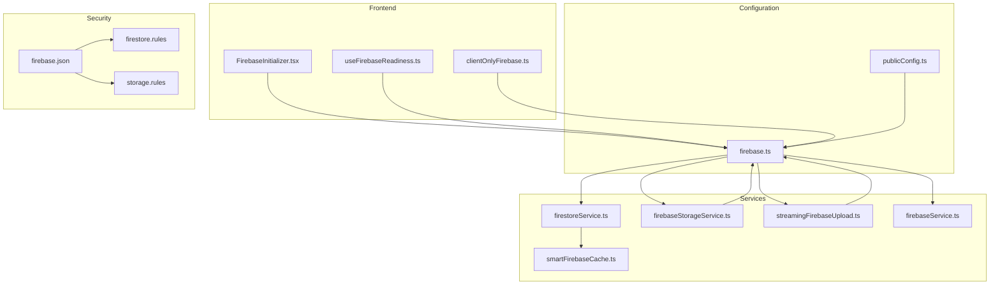
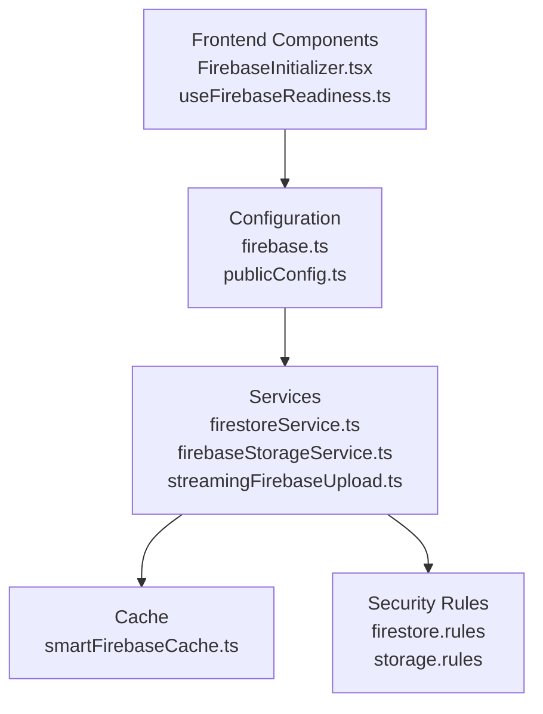
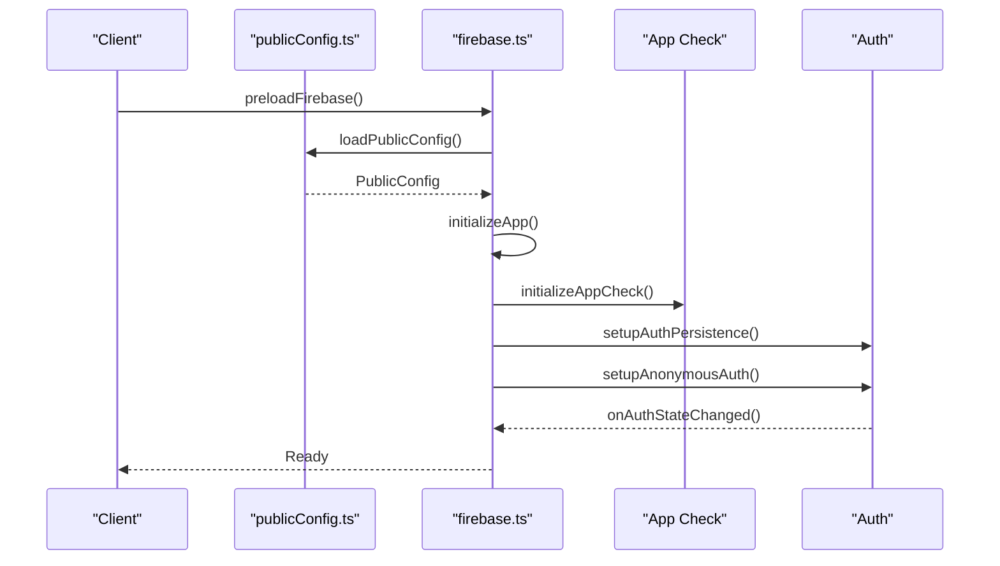
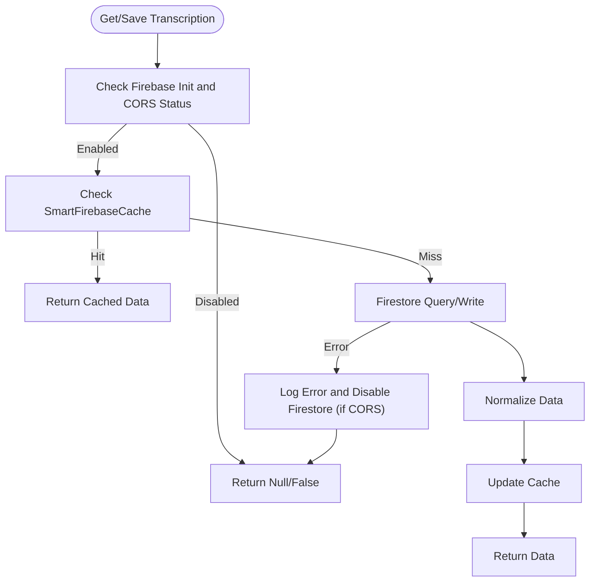
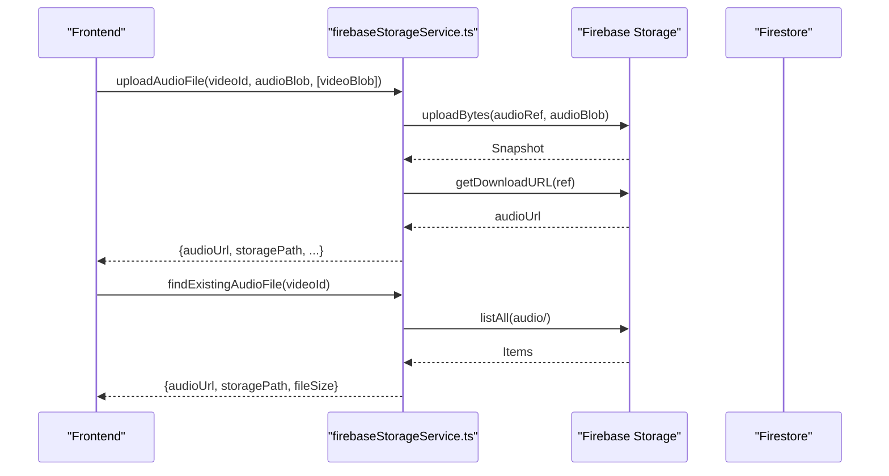
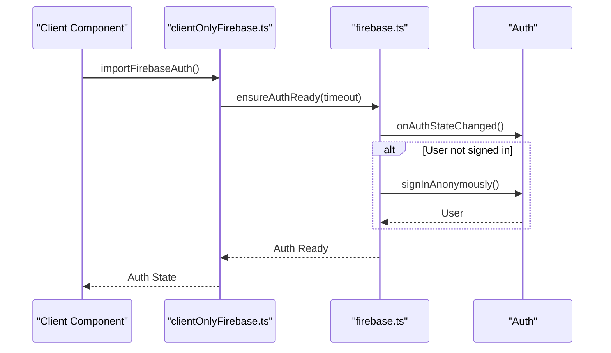
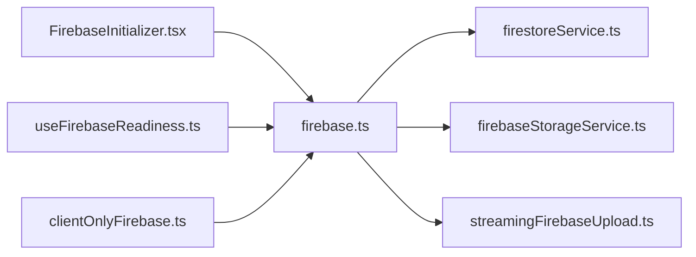
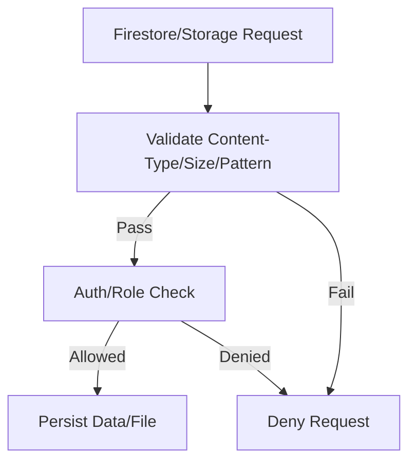
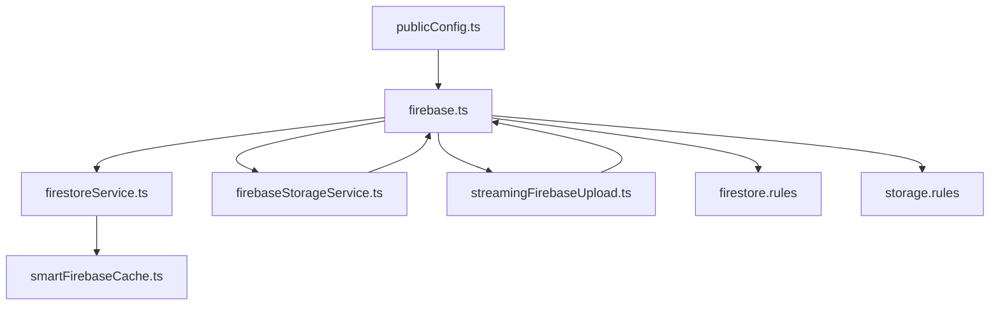

# Firebase Service

<cite>
**Referenced Files in This Document**
- [firebase.ts](file://src/config/firebase.ts)
- [firebaseService.ts](file://src/services/firebase/firebaseService.ts)
- [firestoreService.ts](file://src/services/firebase/firestoreService.ts)
- [firebaseStorageService.ts](file://src/services/firebase/firebaseStorageService.ts)
- [streamingFirebaseUpload.ts](file://src/services/firebase/streamingFirebaseUpload.ts)
- [FirebaseInitializer.tsx](file://src/components/layout/FirebaseInitializer.tsx)
- [useFirebaseReadiness.ts](file://src/hooks/firebase/useFirebaseReadiness.ts)
- [clientOnlyFirebase.ts](file://src/utils/clientOnlyFirebase.ts)
- [smartFirebaseCache.ts](file://src/services/cache/smartFirebaseCache.ts)
- [publicConfig.ts](file://src/config/publicConfig.ts)
- [firebase.json](file://firebase/firebase.json)
- [firestore.rules](file://firebase/firestore.rules)
- [storage.rules](file://firebase/storage.rules)
</cite>

## Table of Contents
1. [Introduction](#introduction)
2. [Project Structure](#project-structure)
3. [Core Components](#core-components)
4. [Architecture Overview](#architecture-overview)
5. [Detailed Component Analysis](#detailed-component-analysis)
6. [Dependency Analysis](#dependency-analysis)
7. [Performance Considerations](#performance-considerations)
8. [Troubleshooting Guide](#troubleshooting-guide)
9. [Conclusion](#conclusion)

## Introduction
This document describes the Firebase service integration powering authentication, real-time database access, and storage management in the ChordMiniApp. It covers Firestore for document-based data storage, Firebase Storage for audio file management, authentication workflows, frontend integration patterns, security rules enforcement, and offline data synchronization strategies. It also includes practical examples for data persistence, file upload/download operations, and real-time updates for collaborative features.

## Project Structure
The Firebase integration spans configuration, services, frontend initialization, and security rules:

- Configuration and initialization: centralized in a single module that supports runtime configuration loading for Docker deployments.
- Services: dedicated modules for Firestore operations, Storage operations, and streaming uploads.
- Frontend integration: client components and hooks to preload and monitor Firebase readiness.
- Security: Firestore and Storage rules enforcing validation, rate limits, and access controls.

**Diagram sources**
- [firebase.ts:1-537](file://src/config/firebase.ts#L1-L537)
- [firebaseService.ts:1-156](file://src/services/firebase/firebaseService.ts#L1-L156)
- [firestoreService.ts:1-800](file://src/services/firebase/firestoreService.ts#L1-L800)
- [firebaseStorageService.ts:1-414](file://src/services/firebase/firebaseStorageService.ts#L1-L414)
- [streamingFirebaseUpload.ts:1-563](file://src/services/firebase/streamingFirebaseUpload.ts#L1-L563)
- [FirebaseInitializer.tsx:1-62](file://src/components/layout/FirebaseInitializer.tsx#L1-L62)
- [useFirebaseReadiness.ts:1-61](file://src/hooks/firebase/useFirebaseReadiness.ts#L1-L61)
- [clientOnlyFirebase.ts:1-146](file://src/utils/clientOnlyFirebase.ts#L1-L146)
- [smartFirebaseCache.ts:1-343](file://src/services/cache/smartFirebaseCache.ts#L1-L343)
- [publicConfig.ts:1-218](file://src/config/publicConfig.ts#L1-L218)
- [firebase.json:1-10](file://firebase/firebase.json#L1-L10)
- [firestore.rules:1-289](file://firebase/firestore.rules#L1-L289)
- [storage.rules:1-92](file://firebase/storage.rules#L1-L92)

**Section sources**
- [firebase.ts:1-537](file://src/config/firebase.ts#L1-L537)
- [firebase.json:1-10](file://firebase/firebase.json#L1-L10)

## Core Components
- Firebase configuration and initialization: runtime configuration loading, lazy initialization, App Check integration, and anonymous authentication with robust retry logic.
- Firestore service: typed transcription and melody data models, normalization utilities, caching, and resilient read/write operations with CORS handling.
- Firebase Storage service: audio file upload, metadata retrieval, batch search, and streaming upload with retry and timeout strategies.
- Frontend integration: initializer component and readiness hook to ensure Firebase is ready before performing operations.
- Security rules: Firestore and Storage rules enforcing validation, rate limits, and access control.

**Section sources**
- [firebase.ts:1-537](file://src/config/firebase.ts#L1-L537)
- [firestoreService.ts:1-800](file://src/services/firebase/firestoreService.ts#L1-L800)
- [firebaseStorageService.ts:1-414](file://src/services/firebase/firebaseStorageService.ts#L1-L414)
- [streamingFirebaseUpload.ts:1-563](file://src/services/firebase/streamingFirebaseUpload.ts#L1-L563)
- [FirebaseInitializer.tsx:1-62](file://src/components/layout/FirebaseInitializer.tsx#L1-L62)
- [useFirebaseReadiness.ts:1-61](file://src/hooks/firebase/useFirebaseReadiness.ts#L1-L61)
- [firestore.rules:1-289](file://firebase/firestore.rules#L1-L289)
- [storage.rules:1-92](file://firebase/storage.rules#L1-L92)

## Architecture Overview
The Firebase integration follows a layered architecture:
- Configuration layer: runtime config loading and initialization orchestration.
- Service layer: Firestore and Storage operations with typed models and caching.
- Frontend integration: client-side initialization and readiness monitoring.
- Security layer: Firestore and Storage rules.

**Diagram sources**
- [firebase.ts:1-537](file://src/config/firebase.ts#L1-L537)
- [firestoreService.ts:1-800](file://src/services/firebase/firestoreService.ts#L1-L800)
- [firebaseStorageService.ts:1-414](file://src/services/firebase/firebaseStorageService.ts#L1-L414)
- [streamingFirebaseUpload.ts:1-563](file://src/services/firebase/streamingFirebaseUpload.ts#L1-L563)
- [smartFirebaseCache.ts:1-343](file://src/services/cache/smartFirebaseCache.ts#L1-L343)
- [firestore.rules:1-289](file://firebase/firestore.rules#L1-L289)
- [storage.rules:1-92](file://firebase/storage.rules#L1-L92)

## Detailed Component Analysis

### Firebase Configuration and Initialization
- Runtime configuration loading: fetches environment variables from a server endpoint for Docker compatibility.
- Lazy initialization: defers Firebase initialization until needed, avoiding SSR issues and enabling graceful fallbacks.
- App Check integration: initializes reCAPTCHA v3 provider for client-side request protection.
- Authentication: sets persistence and anonymous sign-in with exponential backoff retry logic and timeouts.
- Instance exports: provides async getters for Firestore, Storage, and Auth instances.

**Diagram sources**
- [firebase.ts:43-125](file://src/config/firebase.ts#L43-L125)
- [publicConfig.ts:63-108](file://src/config/publicConfig.ts#L63-L108)

**Section sources**
- [firebase.ts:1-537](file://src/config/firebase.ts#L1-L537)
- [publicConfig.ts:1-218](file://src/config/publicConfig.ts#L1-L218)

### Firestore Service for Document-Based Data Storage
- Typed models: transcription and melody data interfaces with normalization utilities.
- Caching: SmartFirebaseCache reduces repeated queries and handles incomplete records with TTL and error suppression.
- Resilient operations: graceful handling of CORS/network errors with automatic disabling of Firestore for the session.
- Enrichment and usage tracking: update operations with merge semantics and usage counters.

**Diagram sources**
- [firestoreService.ts:405-469](file://src/services/firebase/firestoreService.ts#L405-L469)
- [smartFirebaseCache.ts:1-343](file://src/services/cache/smartFirebaseCache.ts#L1-L343)

**Section sources**
- [firestoreService.ts:1-800](file://src/services/firebase/firestoreService.ts#L1-L800)
- [smartFirebaseCache.ts:1-343](file://src/services/cache/smartFirebaseCache.ts#L1-L343)

### Firebase Storage Service for Audio File Management
- Upload operations: converts ArrayBuffer/Blob to Blob, uploads to Storage, and returns download URLs.
- Metadata retrieval: retrieves audio metadata from Storage and composes a standardized model.
- Batch search: lists files under audio/ and matches by video ID pattern.
- Streaming upload: converts ReadableStream to Blob, performs resumable upload with progress tracking and retry logic.
- URL-based upload: fetches audio stream directly and uploads to Storage with budget-aware retries.

**Diagram sources**
- [firebaseStorageService.ts:196-301](file://src/services/firebase/firebaseStorageService.ts#L196-L301)
- [firebaseStorageService.ts:40-97](file://src/services/firebase/firebaseStorageService.ts#L40-L97)

**Section sources**
- [firebaseStorageService.ts:1-414](file://src/services/firebase/firebaseStorageService.ts#L1-L414)
- [streamingFirebaseUpload.ts:1-563](file://src/services/firebase/streamingFirebaseUpload.ts#L1-L563)

### Authentication Workflows
- Anonymous authentication: sets persistence, listens for auth state changes, and attempts anonymous sign-in with exponential backoff.
- Readiness utilities: ensureAuthReady waits for authentication with configurable timeouts and returns user state.
- Client-only operations: guards against SSR and provides safe wrappers for auth operations.

**Diagram sources**
- [clientOnlyFirebase.ts:76-131](file://src/utils/clientOnlyFirebase.ts#L76-L131)
- [firebase.ts:148-329](file://src/config/firebase.ts#L148-L329)

**Section sources**
- [firebase.ts:1-537](file://src/config/firebase.ts#L1-L537)
- [clientOnlyFirebase.ts:1-146](file://src/utils/clientOnlyFirebase.ts#L1-L146)

### Frontend Integration Patterns
- Initialization: FirebaseInitializer preloads Firebase and initializes collections early to prevent cache race conditions.
- Readiness: useFirebaseReadiness monitors Firebase availability and retries on failure.
- Client-only utilities: safe wrappers ensure operations run only on the client and provide fallbacks on SSR.

**Diagram sources**
- [FirebaseInitializer.tsx:1-62](file://src/components/layout/FirebaseInitializer.tsx#L1-L62)
- [useFirebaseReadiness.ts:1-61](file://src/hooks/firebase/useFirebaseReadiness.ts#L1-L61)
- [clientOnlyFirebase.ts:1-146](file://src/utils/clientOnlyFirebase.ts#L1-L146)
- [firebase.ts:1-537](file://src/config/firebase.ts#L1-L537)

**Section sources**
- [FirebaseInitializer.tsx:1-62](file://src/components/layout/FirebaseInitializer.tsx#L1-L62)
- [useFirebaseReadiness.ts:1-61](file://src/hooks/firebase/useFirebaseReadiness.ts#L1-L61)
- [clientOnlyFirebase.ts:1-146](file://src/utils/clientOnlyFirebase.ts#L1-L146)

### Security Rules Enforcement
- Firestore rules: strict validation functions, rate limiting, and per-collection permissions. Public caches allow read access; admin-only deletions; relaxed validation for cold start scenarios.
- Storage rules: content-type and size validation, filename patterns, and per-path access control. Anonymous uploads allowed with validation; temp path supports larger files for processing.

**Diagram sources**
- [firestore.rules:1-289](file://firebase/firestore.rules#L1-L289)
- [storage.rules:1-92](file://firebase/storage.rules#L1-L92)

**Section sources**
- [firestore.rules:1-289](file://firebase/firestore.rules#L1-L289)
- [storage.rules:1-92](file://firebase/storage.rules#L1-L92)

## Dependency Analysis
- Configuration depends on runtime config loader for environment variables.
- Services depend on configuration for Firestore/Storage/Auth instances.
- Frontend components depend on configuration and readiness hooks.
- Security rules govern all service operations.

**Diagram sources**
- [publicConfig.ts:1-218](file://src/config/publicConfig.ts#L1-L218)
- [firebase.ts:1-537](file://src/config/firebase.ts#L1-L537)
- [firestoreService.ts:1-800](file://src/services/firebase/firestoreService.ts#L1-L800)
- [firebaseStorageService.ts:1-414](file://src/services/firebase/firebaseStorageService.ts#L1-L414)
- [streamingFirebaseUpload.ts:1-563](file://src/services/firebase/streamingFirebaseUpload.ts#L1-L563)
- [smartFirebaseCache.ts:1-343](file://src/services/cache/smartFirebaseCache.ts#L1-L343)
- [firestore.rules:1-289](file://firebase/firestore.rules#L1-L289)
- [storage.rules:1-92](file://firebase/storage.rules#L1-L92)

**Section sources**
- [publicConfig.ts:1-218](file://src/config/publicConfig.ts#L1-L218)
- [firebase.ts:1-537](file://src/config/firebase.ts#L1-L537)
- [firestoreService.ts:1-800](file://src/services/firebase/firestoreService.ts#L1-L800)
- [firebaseStorageService.ts:1-414](file://src/services/firebase/firebaseStorageService.ts#L1-L414)
- [streamingFirebaseUpload.ts:1-563](file://src/services/firebase/streamingFirebaseUpload.ts#L1-L563)
- [smartFirebaseCache.ts:1-343](file://src/services/cache/smartFirebaseCache.ts#L1-L343)
- [firestore.rules:1-289](file://firebase/firestore.rules#L1-L289)
- [storage.rules:1-92](file://firebase/storage.rules#L1-L92)

## Performance Considerations
- Caching: SmartFirebaseCache reduces repeated queries and suppresses warning spam for incomplete records.
- Lazy initialization: defers Firebase initialization to avoid blocking initial render.
- Streaming uploads: converts streams to blobs efficiently and uses resumable uploads with progress tracking.
- Retry strategies: exponential backoff and budget-aware retries for URL-based uploads.
- CORS resilience: disables Firestore for the session upon CORS/network errors to prevent repeated failures.

[No sources needed since this section provides general guidance]

## Troubleshooting Guide
- Authentication failures: verify anonymous authentication is enabled in Firebase Console; check error codes and retry with exponential backoff.
- CORS/network errors: Firestore operations automatically disable Firestore for the session; inspect logs for CORS-related messages.
- Storage upload issues: validate content-type and size; ensure filenames match storage rules; use streaming upload for large files.
- Initialization delays: preload Firebase early via FirebaseInitializer and use readiness hooks to coordinate operations.

**Section sources**
- [firebase.ts:200-252](file://src/config/firebase.ts#L200-L252)
- [firestoreService.ts:462-467](file://src/services/firebase/firestoreService.ts#L462-L467)
- [firebaseStorageService.ts:282-300](file://src/services/firebase/firebaseStorageService.ts#L282-L300)
- [streamingFirebaseUpload.ts:334-431](file://src/services/firebase/streamingFirebaseUpload.ts#L334-L431)

## Conclusion
The Firebase integration in ChordMiniApp provides a robust foundation for authentication, document storage, and audio file management. The architecture emphasizes resilience through caching, graceful degradation on network errors, and strong security rules. Frontend integration patterns ensure smooth initialization and readiness monitoring, while streaming and batch operations optimize performance for audio workflows.