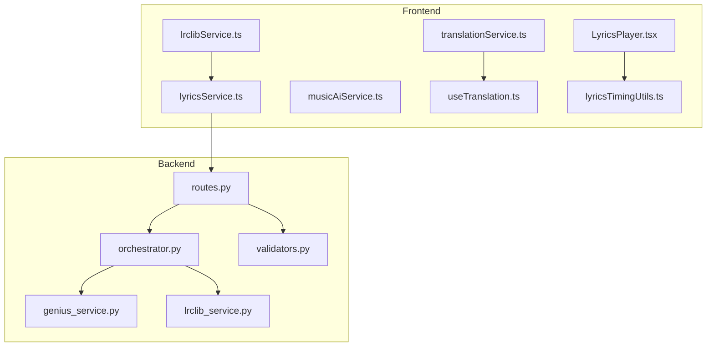
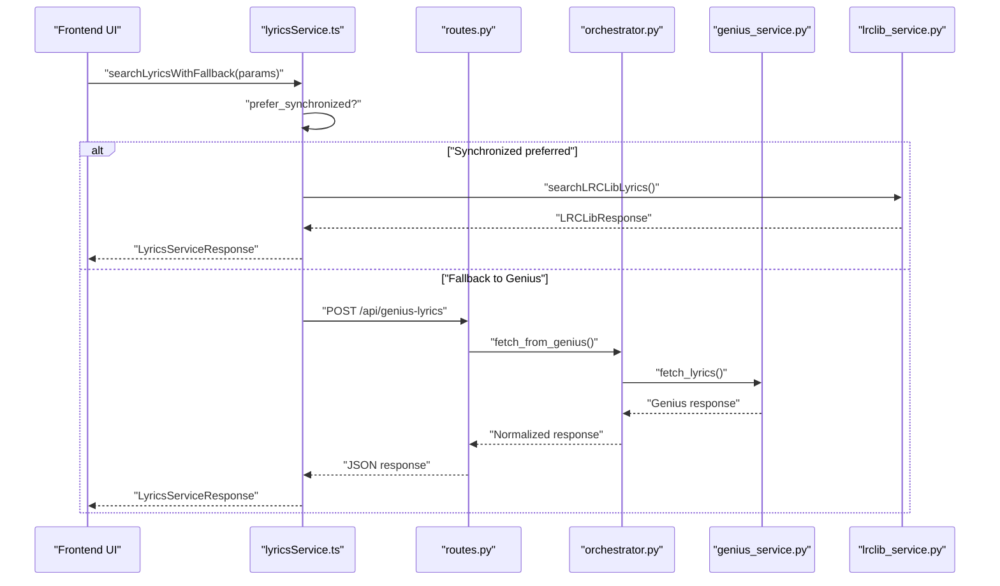
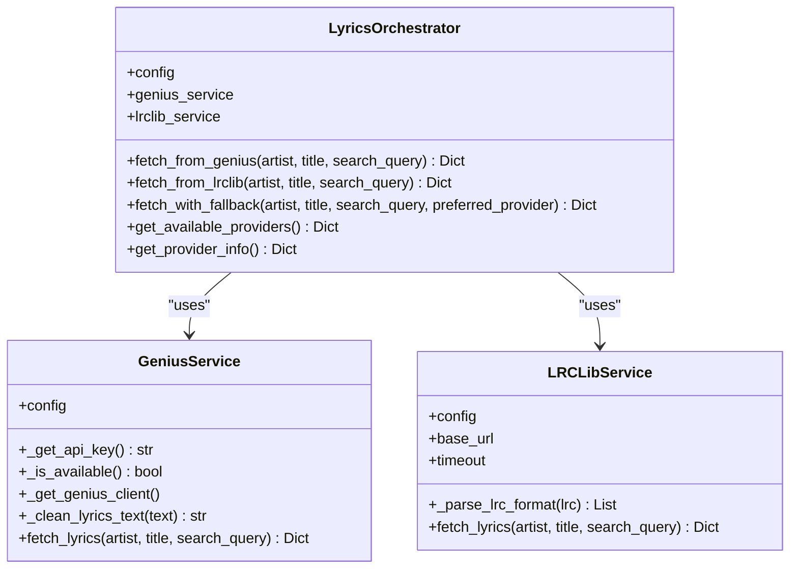
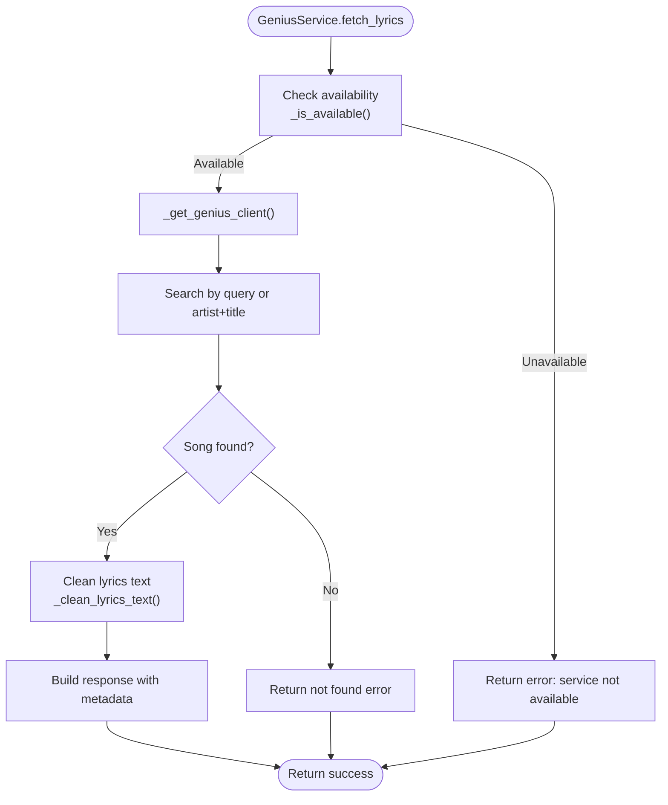
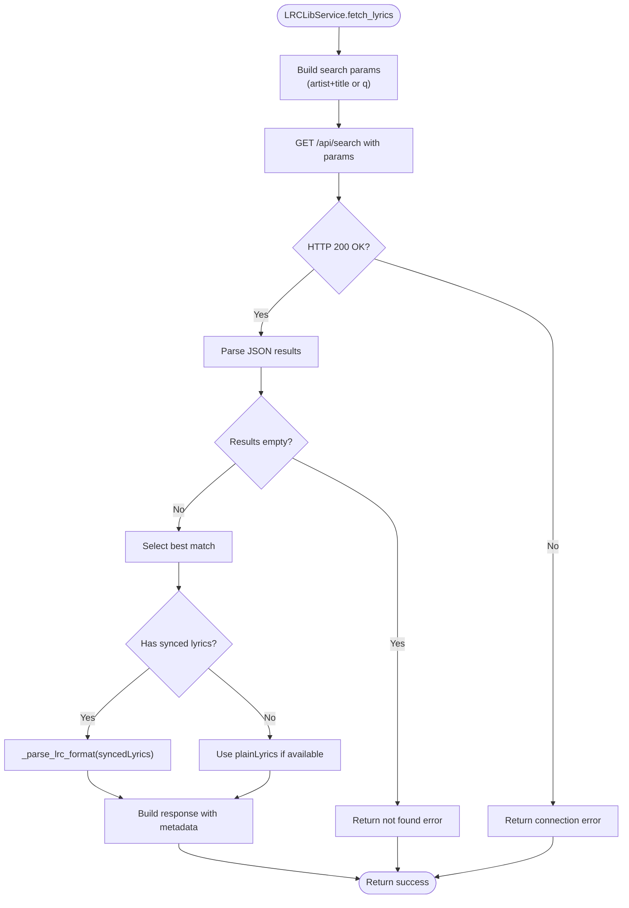
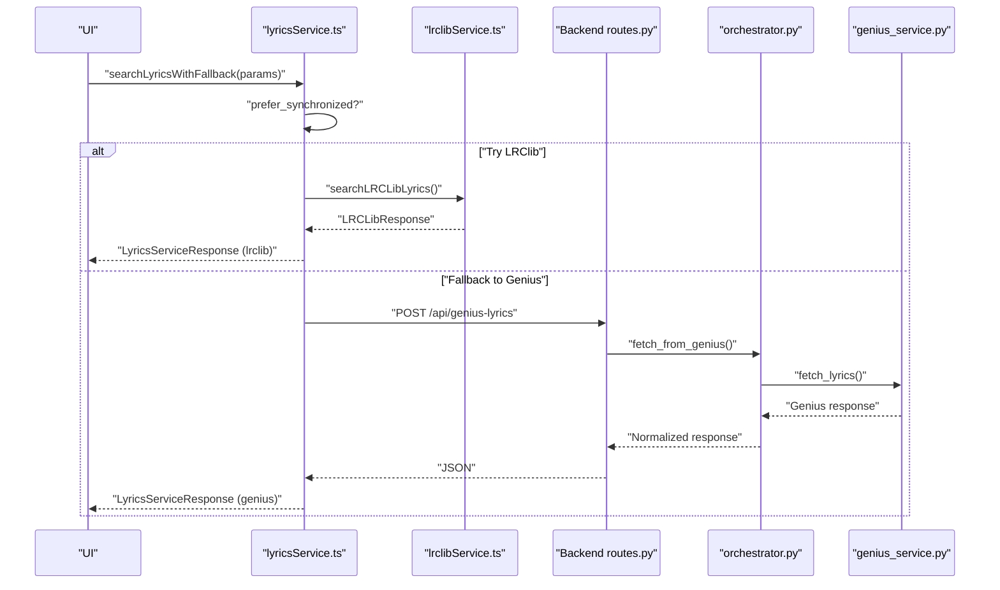
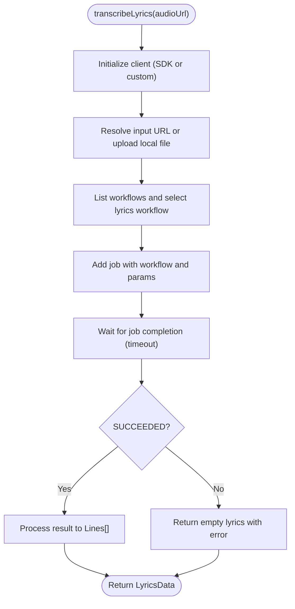
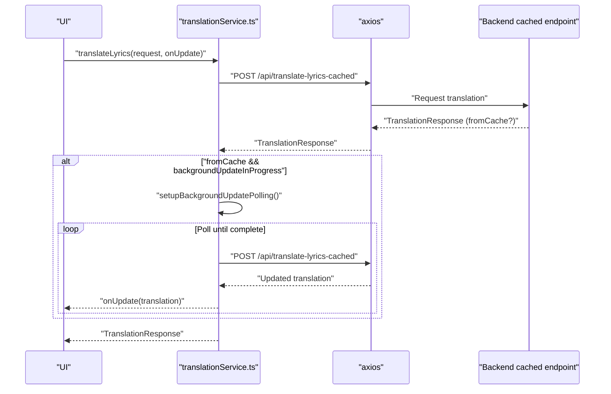
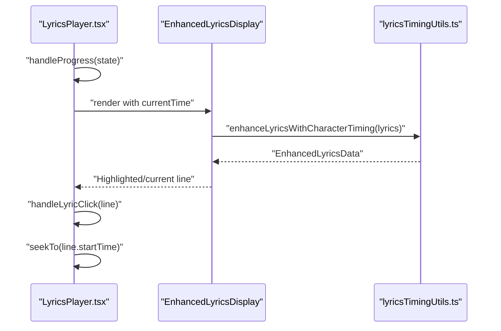
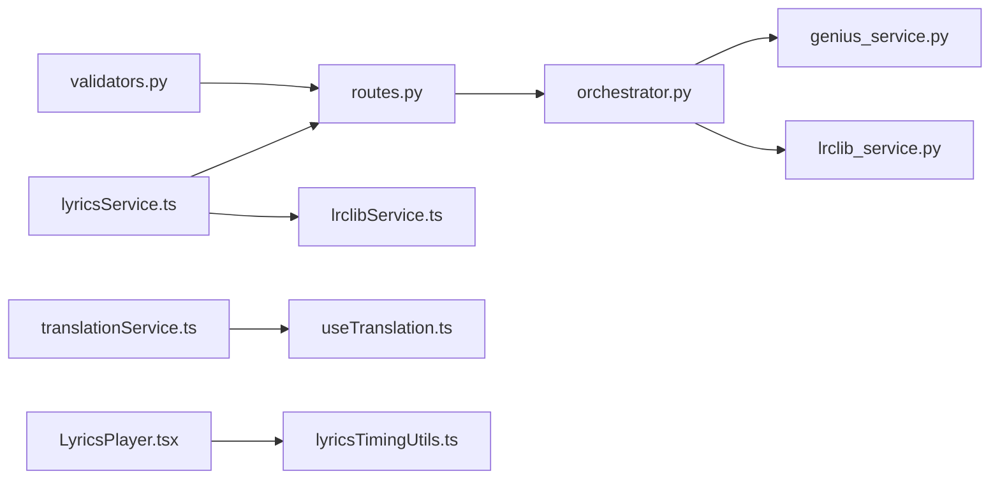

# Lyrics Service

<cite>
**Referenced Files in This Document**
- [orchestrator.py](file://python_backend/services/lyrics/orchestrator.py)
- [genius_service.py](file://python_backend/services/lyrics/genius_service.py)
- [lrclib_service.py](file://python_backend/services/lyrics/lrclib_service.py)
- [routes.py](file://python_backend/blueprints/lyrics/routes.py)
- [validators.py](file://python_backend/blueprints/lyrics/validators.py)
- [lyricsService.ts](file://src/services/lyrics/lyricsService.ts)
- [lrclibService.ts](file://src/services/lyrics/lrclibService.ts)
- [musicAiService.ts](file://src/services/lyrics/musicAiService.ts)
- [translationService.ts](file://src/services/lyrics/translationService.ts)
- [useTranslation.ts](file://src/hooks/lyrics/useTranslation.ts)
- [LyricsPlayer.tsx](file://src/components/lyrics/LyricsPlayer.tsx)
- [lyricsTimingUtils.ts](file://src/utils/lyricsTimingUtils.ts)
</cite>

## Table of Contents
1. [Introduction](#introduction)
2. [Project Structure](#project-structure)
3. [Core Components](#core-components)
4. [Architecture Overview](#architecture-overview)
5. [Detailed Component Analysis](#detailed-component-analysis)
6. [Dependency Analysis](#dependency-analysis)
7. [Performance Considerations](#performance-considerations)
8. [Troubleshooting Guide](#troubleshooting-guide)
9. [Conclusion](#conclusion)

## Introduction
This document describes the lyrics service layer powering the ChordMiniApp. It covers the orchestration of multiple lyrics sources (Genius, LRClib), the integration with external APIs, synchronization with audio playback, translation services for international users, caching strategies, and fallback mechanisms. It also explains the frontend-to-backend flow, timing synchronization utilities, and quality assurance for lyrics matching.

## Project Structure
The lyrics service spans both the Python backend and the Next.js frontend:
- Backend: Flask blueprints expose endpoints for Genius and LRClib, with a central orchestrator coordinating providers and validation utilities.
- Frontend: Services and hooks coordinate lyrics retrieval, timing synchronization, translation, and UI rendering.

**Diagram sources**
- [lyricsService.ts:1-197](file://src/services/lyrics/lyricsService.ts#L1-L197)
- [lrclibService.ts:1-266](file://src/services/lyrics/lrclibService.ts#L1-L266)
- [musicAiService.ts:1-1108](file://src/services/lyrics/musicAiService.ts#L1-L1108)
- [translationService.ts:1-255](file://src/services/lyrics/translationService.ts#L1-L255)
- [useTranslation.ts:1-179](file://src/hooks/lyrics/useTranslation.ts#L1-L179)
- [LyricsPlayer.tsx:1-203](file://src/components/lyrics/LyricsPlayer.tsx#L1-L203)
- [lyricsTimingUtils.ts:1-213](file://src/utils/lyricsTimingUtils.ts#L1-L213)
- [orchestrator.py:1-184](file://python_backend/services/lyrics/orchestrator.py#L1-L184)
- [genius_service.py:1-215](file://python_backend/services/lyrics/genius_service.py#L1-L215)
- [lrclib_service.py:1-172](file://python_backend/services/lyrics/lrclib_service.py#L1-L172)
- [routes.py:1-126](file://python_backend/blueprints/lyrics/routes.py#L1-L126)
- [validators.py:1-146](file://python_backend/blueprints/lyrics/validators.py#L1-L146)

**Section sources**
- [orchestrator.py:1-184](file://python_backend/services/lyrics/orchestrator.py#L1-L184)
- [routes.py:1-126](file://python_backend/blueprints/lyrics/routes.py#L1-L126)
- [lyricsService.ts:1-197](file://src/services/lyrics/lyricsService.ts#L1-L197)

## Core Components
- Backend orchestrator: Coordinates Genius and LRClib, exposes unified fetch methods, and provides provider availability and metadata.
- Genius service: Integrates with Genius.com via lyricsgenius, cleans lyrics, and returns metadata.
- LRClib service: Queries lrclib.net for synchronized lyrics, parses LRC format, and returns structured timing data.
- Frontend lyrics service: Implements fallback between LRClib and Genius, health checks, and graceful degradation.
- MusicAI service: Provides lyrics transcription and chord generation with synchronization.
- Translation service: Implements cache-first translation with background updates and BYOK Gemini support.
- Timing utilities: Enhance lyrics with character-level timing for smoother UI rendering.
- Playback component: Synchronizes lyrics display with YouTube playback and supports seeking.

**Section sources**
- [orchestrator.py:14-184](file://python_backend/services/lyrics/orchestrator.py#L14-L184)
- [genius_service.py:14-215](file://python_backend/services/lyrics/genius_service.py#L14-L215)
- [lrclib_service.py:14-172](file://python_backend/services/lyrics/lrclib_service.py#L14-L172)
- [lyricsService.ts:72-172](file://src/services/lyrics/lyricsService.ts#L72-L172)
- [musicAiService.ts:233-800](file://src/services/lyrics/musicAiService.ts#L233-L800)
- [translationService.ts:38-244](file://src/services/lyrics/translationService.ts#L38-L244)
- [lyricsTimingUtils.ts:36-213](file://src/utils/lyricsTimingUtils.ts#L36-L213)
- [LyricsPlayer.tsx:16-203](file://src/components/lyrics/LyricsPlayer.tsx#L16-L203)

## Architecture Overview
The lyrics service follows a layered architecture:
- Frontend services and hooks orchestrate user-facing flows.
- Backend routes validate requests and delegate to the orchestrator.
- The orchestrator selects providers, applies fallback logic, and normalizes responses.
- External APIs (Genius, LRClib) are accessed with robust error handling and sanitization.

**Diagram sources**
- [lyricsService.ts:72-172](file://src/services/lyrics/lyricsService.ts#L72-L172)
- [routes.py:22-72](file://python_backend/blueprints/lyrics/routes.py#L22-L72)
- [orchestrator.py:33-62](file://python_backend/services/lyrics/orchestrator.py#L33-L62)
- [genius_service.py:135-215](file://python_backend/services/lyrics/genius_service.py#L135-L215)
- [lrclib_service.py:76-172](file://python_backend/services/lyrics/lrclib_service.py#L76-L172)

## Detailed Component Analysis

### Backend Orchestrator
The orchestrator coordinates multiple lyrics providers, exposes unified fetch methods, and normalizes results with provider metadata.

**Diagram sources**
- [orchestrator.py:14-184](file://python_backend/services/lyrics/orchestrator.py#L14-L184)
- [genius_service.py:14-215](file://python_backend/services/lyrics/genius_service.py#L14-L215)
- [lrclib_service.py:14-172](file://python_backend/services/lyrics/lrclib_service.py#L14-L172)

**Section sources**
- [orchestrator.py:22-147](file://python_backend/services/lyrics/orchestrator.py#L22-L147)

### Genius Service
Handles Genius API integration, including API key resolution, client creation, lyrics cleaning, and metadata extraction.

**Diagram sources**
- [genius_service.py:135-215](file://python_backend/services/lyrics/genius_service.py#L135-L215)

**Section sources**
- [genius_service.py:28-215](file://python_backend/services/lyrics/genius_service.py#L28-L215)

### LRClib Service
Queries lrclib.net for synchronized lyrics, parses LRC format, and returns structured timing data.

**Diagram sources**
- [lrclib_service.py:76-172](file://python_backend/services/lyrics/lrclib_service.py#L76-L172)

**Section sources**
- [lrclib_service.py:28-172](file://python_backend/services/lyrics/lrclib_service.py#L28-L172)

### Frontend Lyrics Service and Fallback
Implements a robust fallback system: tries LRClib first for synchronized lyrics, then falls back to Genius API via backend endpoints.

**Diagram sources**
- [lyricsService.ts:72-172](file://src/services/lyrics/lyricsService.ts#L72-L172)
- [lrclibService.ts:32-145](file://src/services/lyrics/lrclibService.ts#L32-L145)
- [routes.py:22-72](file://python_backend/blueprints/lyrics/routes.py#L22-L72)
- [orchestrator.py:33-62](file://python_backend/services/lyrics/orchestrator.py#L33-L62)
- [genius_service.py:135-215](file://python_backend/services/lyrics/genius_service.py#L135-L215)

**Section sources**
- [lyricsService.ts:72-172](file://src/services/lyrics/lyricsService.ts#L72-L172)
- [lrclibService.ts:32-145](file://src/services/lyrics/lrclibService.ts#L32-L145)

### MusicAI Service
Provides lyrics transcription and chord generation with synchronization. Supports local file uploads and workflow selection.

**Diagram sources**
- [musicAiService.ts:313-575](file://src/services/lyrics/musicAiService.ts#L313-L575)

**Section sources**
- [musicAiService.ts:233-800](file://src/services/lyrics/musicAiService.ts#L233-L800)

### Translation Service
Implements a cache-first approach with background updates and optional BYOK Gemini API key.

**Diagram sources**
- [translationService.ts:48-212](file://src/services/lyrics/translationService.ts#L48-L212)

**Section sources**
- [translationService.ts:38-244](file://src/services/lyrics/translationService.ts#L38-L244)
- [useTranslation.ts:74-164](file://src/hooks/lyrics/useTranslation.ts#L74-L164)

### Timing Synchronization and Playback
Synchronizes lyrics display with audio playback and enhances timing with character-level granularity.

**Diagram sources**
- [LyricsPlayer.tsx:34-88](file://src/components/lyrics/LyricsPlayer.tsx#L34-L88)
- [lyricsTimingUtils.ts:36-213](file://src/utils/lyricsTimingUtils.ts#L36-L213)

**Section sources**
- [LyricsPlayer.tsx:16-203](file://src/components/lyrics/LyricsPlayer.tsx#L16-L203)
- [lyricsTimingUtils.ts:36-213](file://src/utils/lyricsTimingUtils.ts#L36-L213)

## Dependency Analysis
- Backend dependencies:
  - Flask routes depend on the orchestrator and validators.
  - Orchestrator depends on Genius and LRClib services.
  - Genius service depends on lyricsgenius and environment configuration.
  - LRClib service depends on requests and regex parsing.
- Frontend dependencies:
  - lyricsService.ts depends on lrclibService.ts and apiService.
  - translationService.ts depends on axios and cache-first endpoints.
  - LyricsPlayer.tsx depends on lyricsTimingUtils.ts for enhanced timing.

**Diagram sources**
- [routes.py:1-126](file://python_backend/blueprints/lyrics/routes.py#L1-L126)
- [orchestrator.py:1-184](file://python_backend/services/lyrics/orchestrator.py#L1-L184)
- [genius_service.py:1-215](file://python_backend/services/lyrics/genius_service.py#L1-L215)
- [lrclib_service.py:1-172](file://python_backend/services/lyrics/lrclib_service.py#L1-L172)
- [validators.py:1-146](file://python_backend/blueprints/lyrics/validators.py#L1-L146)
- [lyricsService.ts:1-197](file://src/services/lyrics/lyricsService.ts#L1-L197)
- [lrclibService.ts:1-266](file://src/services/lyrics/lrclibService.ts#L1-L266)
- [translationService.ts:1-255](file://src/services/lyrics/translationService.ts#L1-L255)
- [useTranslation.ts:1-179](file://src/hooks/lyrics/useTranslation.ts#L1-L179)
- [LyricsPlayer.tsx:1-203](file://src/components/lyrics/LyricsPlayer.tsx#L1-L203)
- [lyricsTimingUtils.ts:1-213](file://src/utils/lyricsTimingUtils.ts#L1-L213)

**Section sources**
- [routes.py:1-126](file://python_backend/blueprints/lyrics/routes.py#L1-L126)
- [orchestrator.py:1-184](file://python_backend/services/lyrics/orchestrator.py#L1-L184)
- [lyricsService.ts:1-197](file://src/services/lyrics/lyricsService.ts#L1-L197)

## Performance Considerations
- Timeout configuration: LRClib service sets a fixed timeout for external requests to prevent hanging.
- Graceful fallback: Frontend prioritizes synchronized lyrics but falls back to plain Genius lyrics if needed.
- Caching and background updates: Translation service returns cached results immediately while refreshing in the background.
- Client-side sanitization: Backend validates and sanitizes inputs to reduce error rates and protect downstream APIs.
- Character-level timing: Natural speech-weighted timing improves perceived smoothness without heavy computation.

[No sources needed since this section provides general guidance]

## Troubleshooting Guide
Common issues and resolutions:
- Genius API key missing or invalid:
  - Ensure the Genius API key is configured via environment variable or forwarded header.
  - Verify the key format and permissions.
- LRClib connectivity failures:
  - Confirm network access to lrclib.net and handle transient errors gracefully.
- Lyrics not found:
  - Try alternative search queries or artist/title combinations.
  - Prefer synchronized lyrics when available; otherwise fall back to plain lyrics.
- Translation service unavailable:
  - Use fallback translation API when cache-first endpoint fails.
  - Provide a user-specified Gemini API key if required.
- Playback synchronization issues:
  - Verify timing data completeness and adjust character-level timing if needed.

**Section sources**
- [genius_service.py:28-86](file://python_backend/services/lyrics/genius_service.py#L28-L86)
- [lrclib_service.py:158-172](file://python_backend/services/lyrics/lrclib_service.py#L158-L172)
- [lyricsService.ts:117-171](file://src/services/lyrics/lyricsService.ts#L117-L171)
- [translationService.ts:188-212](file://src/services/lyrics/translationService.ts#L188-L212)
- [LyricsPlayer.tsx:34-58](file://src/components/lyrics/LyricsPlayer.tsx#L34-L58)

## Conclusion
The lyrics service layer integrates multiple providers (Genius, LRClib), offers robust fallback strategies, and provides synchronized lyrics display with timing enhancements. It supports translation workflows with caching and background refresh, and ensures a resilient user experience through validation, timeouts, and graceful degradation. The modular design enables easy maintenance and extension for additional providers or features.