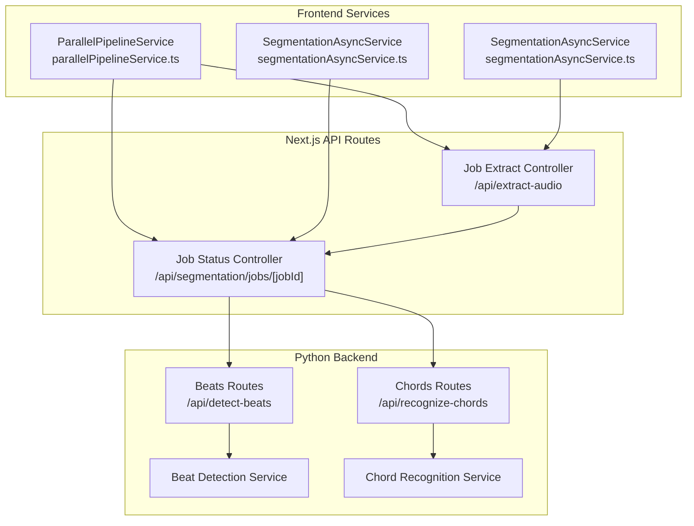
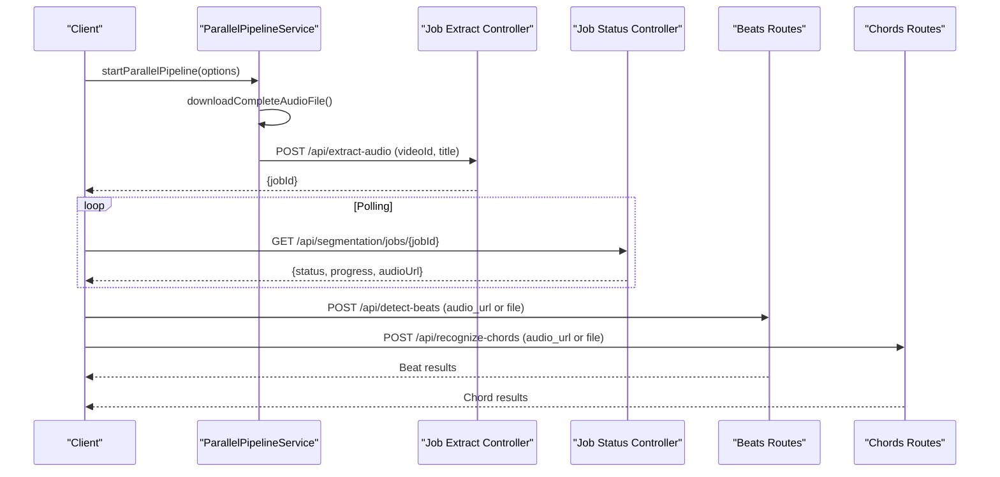
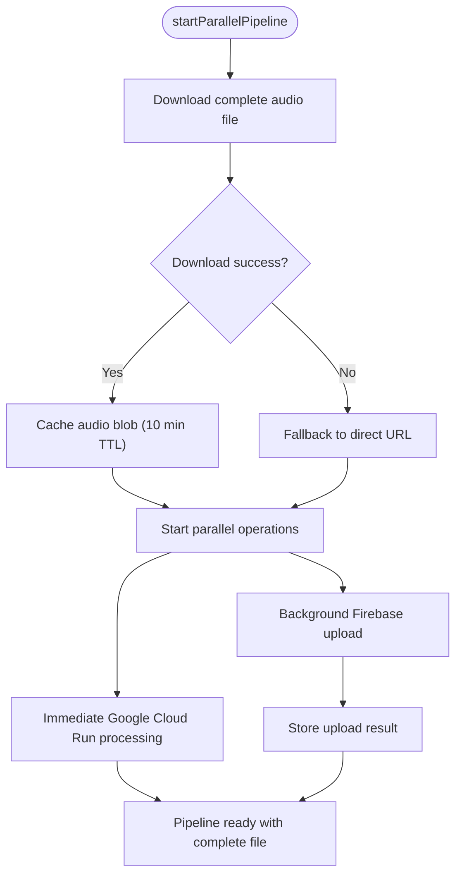
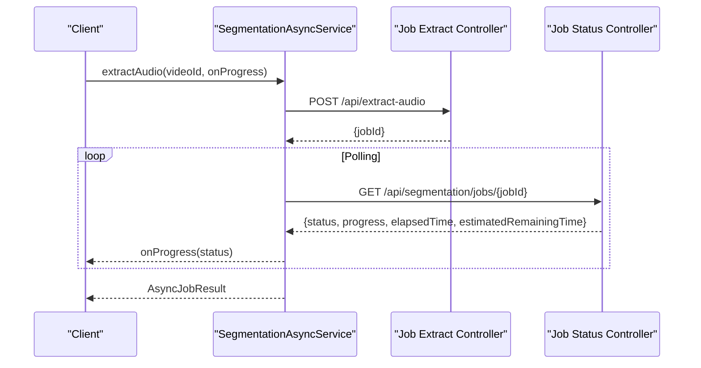
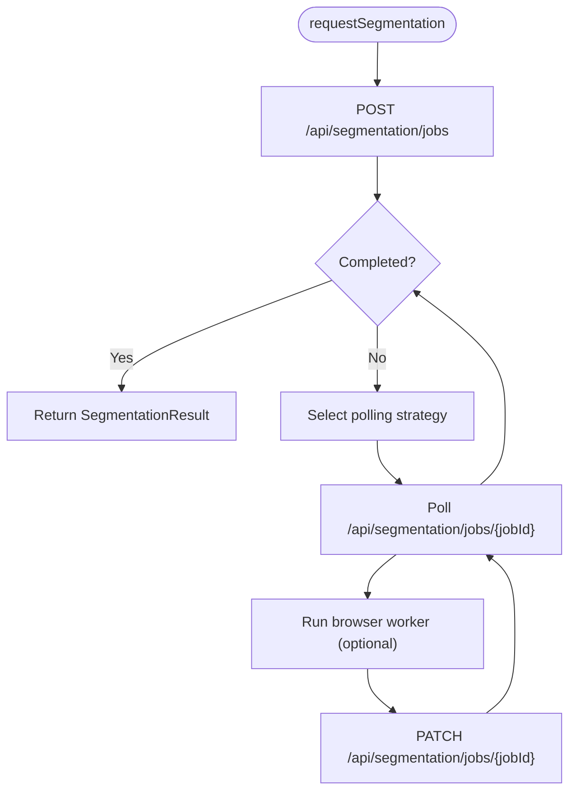
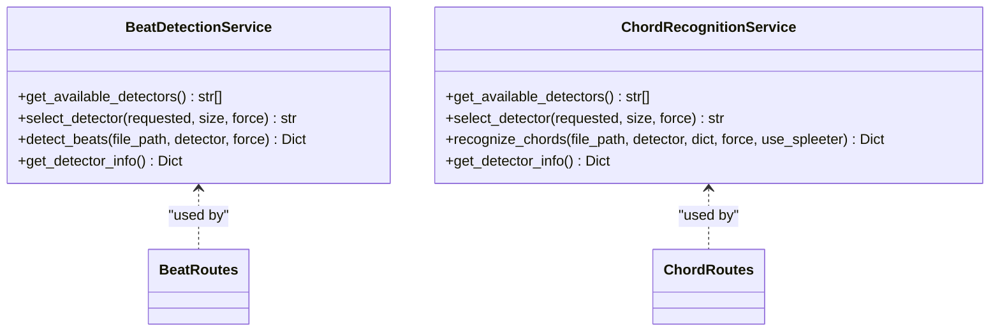
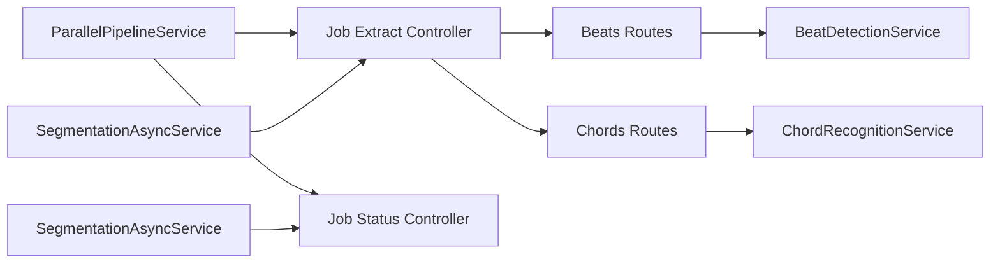

# Parallel Pipeline Service

<cite>
**Referenced Files in This Document**
- [parallelPipelineService.ts](file://src/services/api/parallelPipelineService.ts)
- [segmentationAsyncService.ts](file://src/services/api/segmentationAsyncService.ts)
- [segmentationAsyncService.ts](file://src/services/api/segmentationAsyncService.ts)
- [routes.ts](file://src/app/api/segmentation/jobs/[jobId]/route.ts)
- [routes.ts](file://src/app/api/extract-audio/route.ts)
- [routes.py](file://python_backend/blueprints/beats/routes.py)
- [routes.py](file://python_backend/blueprints/chords/routes.py)
- [beat_detection_service.py](file://python_backend/services/audio/beat_detection_service.py)
- [chord_recognition_service.py](file://python_backend/services/audio/chord_recognition_service.py)
</cite>

## Table of Contents
1. [Introduction](#introduction)
2. [Project Structure](#project-structure)
3. [Core Components](#core-components)
4. [Architecture Overview](#architecture-overview)
5. [Detailed Component Analysis](#detailed-component-analysis)
6. [Dependency Analysis](#dependency-analysis)
7. [Performance Considerations](#performance-considerations)
8. [Troubleshooting Guide](#troubleshooting-guide)
9. [Conclusion](#conclusion)

## Introduction
This document explains the parallel pipeline service that coordinates concurrent API operations for audio processing, and the async job service for managing long-running tasks. It covers the job queuing system, progress tracking, and result aggregation patterns. It also details the implementation of concurrent beat detection and chord recognition, error handling for partial failures, and resource management for multiple simultaneous operations. Examples of pipeline configuration, job monitoring, and performance optimization for parallel processing are included.

## Project Structure
The system spans three main areas:
- Frontend services that orchestrate parallel processing and async jobs
- Backend Flask routes that implement beat detection and chord recognition
- Next.js API routes that manage job lifecycle and status

**Diagram sources**
- [parallelPipelineService.ts:1-350](file://src/services/api/parallelPipelineService.ts#L1-L350)
- [segmentationAsyncService.ts:1-211](file://src/services/api/segmentationAsyncService.ts#L1-L211)
- [segmentationAsyncService.ts:1-261](file://src/services/api/segmentationAsyncService.ts#L1-L261)
- [routes.ts:1-115](file://src/app/api/segmentation/jobs/[jobId]/route.ts#L1-L115)
- [routes.ts:96-193](file://src/app/api/extract-audio/route.ts#L96-L193)
- [routes.py:40-120](file://python_backend/blueprints/beats/routes.py#L40-L120)
- [routes.py:43-144](file://python_backend/blueprints/chords/routes.py#L43-L144)

**Section sources**
- [parallelPipelineService.ts:1-350](file://src/services/api/parallelPipelineService.ts#L1-L350)
- [segmentationAsyncService.ts:1-211](file://src/services/api/segmentationAsyncService.ts#L1-L211)
- [segmentationAsyncService.ts:1-261](file://src/services/api/segmentationAsyncService.ts#L1-L261)
- [routes.ts:1-115](file://src/app/api/segmentation/jobs/[jobId]/route.ts#L1-L115)
- [routes.ts:96-193](file://src/app/api/extract-audio/route.ts#L96-L193)
- [routes.py:40-120](file://python_backend/blueprints/beats/routes.py#L40-L120)
- [routes.py:43-144](file://python_backend/blueprints/chords/routes.py#L43-L144)

## Core Components
- ParallelPipelineService: Orchestrates parallel processing by downloading complete audio files and starting both Google Cloud Run processing and Firebase uploads concurrently. It maintains caches and background results for efficient reuse and fallbacks.
- SegmentationAsyncService: Manages long-running jobs that exceed platform timeouts. It creates jobs, polls for completion, and provides progress callbacks with status, progress percentage, elapsed time, and estimated remaining time.
- SegmentationAsyncService: Handles SongFormer segmentation jobs with adaptive polling strategies based on song duration and caching behavior. It supports browser-side worker execution and job patching.

**Section sources**
- [parallelPipelineService.ts:34-98](file://src/services/api/parallelPipelineService.ts#L34-L98)
- [segmentationAsyncService.ts:30-101](file://src/services/api/segmentationAsyncService.ts#L30-L101)
- [segmentationAsyncService.ts:101-162](file://src/services/api/segmentationAsyncService.ts#L101-L162)

## Architecture Overview
The system separates concerns across layers:
- Frontend orchestration: Uses ParallelPipelineService to coordinate parallel operations and SegmentationAsyncService for long-running tasks.
- Job management: Next.js API routes maintain job state and expose status endpoints for polling.
- Backend inference: Python Flask routes implement beat detection and chord recognition with model selection and size-aware fallbacks.

**Diagram sources**
- [parallelPipelineService.ts:34-98](file://src/services/api/parallelPipelineService.ts#L34-L98)
- [routes.ts:96-193](file://src/app/api/extract-audio/route.ts#L96-L193)
- [routes.ts:36-101](file://src/app/api/segmentation/jobs/[jobId]/route.ts#L36-L101)
- [routes.py:40-120](file://python_backend/blueprints/beats/routes.py#L40-L120)
- [routes.py:43-144](file://python_backend/blueprints/chords/routes.py#L43-L144)

## Detailed Component Analysis

### Parallel Pipeline Service
The parallel pipeline downloads a complete audio file and initiates two concurrent operations:
- Immediate processing via Google Cloud Run using a cached audio blob
- Background Firebase upload with retry and result caching

Key behaviors:
- Caching: Stores audio blobs with timestamps and content types for up to 10 minutes
- Background uploads: Tracks success/failure and Firebase URLs in a result map
- Fallback: If download fails, falls back to direct URL processing and background upload
- URL compatibility: Validates HTTP/HTTPS URLs and excludes Firebase Storage URLs for direct processing

**Diagram sources**
- [parallelPipelineService.ts:34-98](file://src/services/api/parallelPipelineService.ts#L34-L98)
- [parallelPipelineService.ts:158-203](file://src/services/api/parallelPipelineService.ts#L158-L203)

**Section sources**
- [parallelPipelineService.ts:11-25](file://src/services/api/parallelPipelineService.ts#L11-L25)
- [parallelPipelineService.ts:34-98](file://src/services/api/parallelPipelineService.ts#L34-L98)
- [parallelPipelineService.ts:149-153](file://src/services/api/parallelPipelineService.ts#L149-L153)
- [parallelPipelineService.ts:208-261](file://src/services/api/parallelPipelineService.ts#L208-L261)
- [parallelPipelineService.ts:318-350](file://src/services/api/parallelPipelineService.ts#L318-L350)

### Async Job Service
The async job service manages long-running operations that exceed platform timeouts:
- Creates jobs via POST to the extract-audio endpoint
- Polls status via GET to the status endpoint with exponential-like delays
- Provides progress callbacks with status, progress percentage, elapsed time, and estimated remaining time
- Supports availability checks and graceful error handling

**Diagram sources**
- [segmentationAsyncService.ts:52-101](file://src/services/api/segmentationAsyncService.ts#L52-L101)
- [segmentationAsyncService.ts:106-177](file://src/services/api/segmentationAsyncService.ts#L106-L177)
- [routes.ts:96-193](file://src/app/api/extract-audio/route.ts#L96-L193)
- [routes.ts:36-101](file://src/app/api/segmentation/jobs/[jobId]/route.ts#L36-L101)

**Section sources**
- [segmentationAsyncService.ts:8-28](file://src/services/api/segmentationAsyncService.ts#L8-L28)
- [segmentationAsyncService.ts:30-101](file://src/services/api/segmentationAsyncService.ts#L30-L101)
- [segmentationAsyncService.ts:106-177](file://src/services/api/segmentationAsyncService.ts#L106-L177)
- [routes.ts:36-101](file://src/app/api/segmentation/jobs/[jobId]/route.ts#L36-L101)

### Segmentation Async Service
Handles SongFormer segmentation jobs with dynamic polling strategies:
- Estimates duration from song context and selects polling intervals accordingly
- Supports job reuse scenarios and browser worker execution
- Patches job state with progress and completion data

**Diagram sources**
- [segmentationAsyncService.ts:120-162](file://src/services/api/segmentationAsyncService.ts#L120-L162)
- [segmentationAsyncService.ts:164-196](file://src/services/api/segmentationAsyncService.ts#L164-L196)
- [segmentationAsyncService.ts:198-235](file://src/services/api/segmentationAsyncService.ts#L198-L235)

**Section sources**
- [segmentationAsyncService.ts:65-99](file://src/services/api/segmentationAsyncService.ts#L65-L99)
- [segmentationAsyncService.ts:120-162](file://src/services/api/segmentationAsyncService.ts#L120-L162)
- [segmentationAsyncService.ts:164-196](file://src/services/api/segmentationAsyncService.ts#L164-L196)

### Backend Beat and Chord Recognition
The backend routes implement robust audio processing:
- Beat detection: Validates requests, streams remote audio to temporary files, selects detectors based on size and availability, and returns normalized results
- Chord recognition: Supports multiple models, chord dictionaries, and optional Spleeter separation with cleanup

**Diagram sources**
- [beat_detection_service.py:20-348](file://python_backend/services/audio/beat_detection_service.py#L20-L348)
- [chord_recognition_service.py:25-322](file://python_backend/services/audio/chord_recognition_service.py#L25-L322)
- [routes.py:40-120](file://python_backend/blueprints/beats/routes.py#L40-L120)
- [routes.py:43-144](file://python_backend/blueprints/chords/routes.py#L43-L144)

**Section sources**
- [routes.py:40-120](file://python_backend/blueprints/beats/routes.py#L40-L120)
- [routes.py:145-220](file://python_backend/blueprints/chords/routes.py#L145-L220)
- [beat_detection_service.py:163-311](file://python_backend/services/audio/beat_detection_service.py#L163-L311)
- [chord_recognition_service.py:173-296](file://python_backend/services/audio/chord_recognition_service.py#L173-L296)

## Dependency Analysis
The services depend on each other in a layered manner:
- Frontend services depend on Next.js API routes for job lifecycle
- Next.js routes depend on backend Flask routes for inference
- Backend services encapsulate model selection and size-aware fallbacks

**Diagram sources**
- [parallelPipelineService.ts:34-98](file://src/services/api/parallelPipelineService.ts#L34-L98)
- [segmentationAsyncService.ts:52-101](file://src/services/api/segmentationAsyncService.ts#L52-L101)
- [segmentationAsyncService.ts:120-162](file://src/services/api/segmentationAsyncService.ts#L120-L162)
- [routes.ts:96-193](file://src/app/api/extract-audio/route.ts#L96-L193)
- [routes.ts:36-101](file://src/app/api/segmentation/jobs/[jobId]/route.ts#L36-L101)
- [routes.py:40-120](file://python_backend/blueprints/beats/routes.py#L40-L120)
- [routes.py:43-144](file://python_backend/blueprints/chords/routes.py#L43-L144)

**Section sources**
- [parallelPipelineService.ts:34-98](file://src/services/api/parallelPipelineService.ts#L34-L98)
- [segmentationAsyncService.ts:30-101](file://src/services/api/segmentationAsyncService.ts#L30-L101)
- [segmentationAsyncService.ts:101-162](file://src/services/api/segmentationAsyncService.ts#L101-L162)
- [routes.ts:36-101](file://src/app/api/segmentation/jobs/[jobId]/route.ts#L36-L101)
- [routes.ts:96-193](file://src/app/api/extract-audio/route.ts#L96-L193)
- [routes.py:40-120](file://python_backend/blueprints/beats/routes.py#L40-L120)
- [routes.py:43-144](file://python_backend/blueprints/chords/routes.py#L43-L144)

## Performance Considerations
- Parallel processing: The pipeline downloads the complete audio file once and reuses it for immediate processing while uploading to Firebase in the background, reducing total latency.
- Caching: Audio blobs are cached for up to 10 minutes, and background upload results are tracked for up to 5 minutes, minimizing redundant work.
- Adaptive polling: SegmentationAsyncService adjusts polling intervals based on song duration, reducing unnecessary requests for short tracks and optimizing long-track processing.
- Model selection: Backend services choose detectors based on file size and availability, ensuring optimal performance and avoiding oversized file errors.
- Timeout management: Next.js status endpoints are configured for quick responses, enabling frequent polling without overloading the system.

[No sources needed since this section provides general guidance]

## Troubleshooting Guide
Common issues and resolutions:
- Job not found or expired: Verify the jobId exists and hasn't exceeded retention limits. Check Next.js job store cleanup logic.
- Status check failures: Retry polling with exponential backoff. Ensure the status endpoint is reachable and returning valid JSON.
- Partial failures in parallel pipeline: If background upload fails, the system continues with direct URL processing. Monitor background results and clean up stale entries.
- Model unavailability: Backend routes test model availability and return appropriate errors. Adjust detector selection or file sizes to meet limits.
- Resource cleanup: Ensure temporary files and cached blobs are cleaned up according to TTL policies to prevent memory leaks.

**Section sources**
- [routes.ts:36-101](file://src/app/api/segmentation/jobs/[jobId]/route.ts#L36-L101)
- [parallelPipelineService.ts:289-308](file://src/services/api/parallelPipelineService.ts#L289-L308)
- [routes.py:252-380](file://python_backend/blueprints/beats/routes.py#L252-L380)
- [routes.py:377-440](file://python_backend/blueprints/chords/routes.py#L377-L440)

## Conclusion
The parallel pipeline service and async job service together enable efficient, concurrent audio processing at scale. By combining parallel downloads and uploads, adaptive polling, and intelligent model selection, the system achieves low latency and high throughput. Robust error handling and resource management ensure reliability under varying loads and partial failures.