# Analysis Interface Components

<cite>
**Referenced Files in This Document**
- [AnalysisControls.tsx](file://src/components/analysis/AnalysisControls.tsx)
- [AnalysisHeader.tsx](file://src/components/analysis/AnalysisHeader.tsx)
- [BeatTimeline.tsx](file://src/components/analysis/BeatTimeline.tsx)
- [AudioPlaybackDock.tsx](file://src/components/analysis/AudioPlaybackDock.tsx)
- [ProcessingBanners.tsx](file://src/components/analysis/ProcessingBanners.tsx)
- [ProcessingStatusBanner.tsx](file://src/components/analysis/ProcessingStatusBanner.tsx)
- [PlaybackPromptToast.tsx](file://src/components/analysis/PlaybackPromptToast.tsx)
- [AnalyzePageChrome.tsx](file://src/app/analyze/[videoId]/_components/AnalyzePageChrome.tsx)
- [DownloadingIndicator.tsx](file://src/components/analysis/DownloadingIndicator.tsx)
- [ExtractionNotification.tsx](file://src/components/analysis/ExtractionNotification.tsx)
- [HeroUIBeatModelSelector.tsx](file://src/components/analysis/HeroUIBeatModelSelector.tsx)
- [HeroUIChordModelSelector.tsx](file://src/components/analysis/HeroUIChordModelSelector.tsx)
- [useModelState.ts](file://src/hooks/chord-analysis/useModelState.ts)
- [analysisStore.ts](file://src/stores/analysisStore.ts)
- [useAnalyzePageOrchestrator.ts](file://src/hooks/analyze/useAnalyzePageOrchestrator.ts)
- [audioAnalysisService.ts](file://src/services/audio/audioAnalysisService.ts)
- [chordRecognitionService.ts](file://src/services/chord-analysis/chordRecognitionService.ts)
- [modelFiltering.ts](file://src/utils/modelFiltering.ts)
- [firestoreService.ts](file://src/services/firebase/firestoreService.ts)
- [firebaseStorageSimplified.ts](file://src/services/firebase/firebaseStorageSimplified.ts)
- [audioExtractionSimplified.ts](file://src/services/audio/audioExtractionSimplified.ts)
</cite>

## Update Summary
**Changes Made**
- Enhanced cache pipeline system documentation with new `applyCachedTranscriptionIfAvailable` function
- Updated cache availability logic during audio extraction process
- Improved user experience documentation for accessing cached results
- Added support for immediate cached result access even when audio extraction is in progress

## Table of Contents
1. [Introduction](#introduction)
2. [Project Structure](#project-structure)
3. [Core Components](#core-components)
4. [Architecture Overview](#architecture-overview)
5. [Detailed Component Analysis](#detailed-component-analysis)
6. [Enhanced Cache Pipeline System](#enhanced-cache-pipeline-system)
7. [Dependency Analysis](#dependency-analysis)
8. [Performance Considerations](#performance-considerations)
9. [Troubleshooting Guide](#troubleshooting-guide)
10. [Conclusion](#conclusion)

## Introduction
This document provides a comprehensive analysis of the analysis interface components that power the music analysis functionality. It covers the interactive controls for model selection, real-time processing feedback, audio playback, and timeline visualization. The focus is on component hierarchy, state management integration, real-time update mechanisms, user interaction patterns, and integration with the analysis pipeline services.

**Updated** Enhanced with new cache pipeline system that provides immediate access to cached results during audio extraction, improving user experience and reducing wait times.

## Project Structure
The analysis interface is composed of several focused UI components and supporting utilities:
- Control panels: AnalysisControls, AnalysisHeader, AudioPlaybackDock
- Visualization: BeatTimeline
- Model selection: HeroUIBeatModelSelector, HeroUIChordModelSelector
- Processing feedback: ProcessingBanners, ProcessingStatusBanner, PlaybackPromptToast, DownloadingIndicator, ExtractionNotification
- State management: useModelState hook, analysisStore store
- Orchestration: useAnalyzePageOrchestrator hook with enhanced cache pipeline
- Services: audioAnalysisService, chordRecognitionService
- Utilities: modelFiltering
- Cache systems: Firestore transcription cache, Firebase storage cache, parallel pipeline cache

```mermaid
graph TB
subgraph "UI Components"
AC["AnalysisControls"]
AH["AnalysisHeader"]
APD["AudioPlaybackDock"]
BT["BeatTimeline"]
HBMS["HeroUIBeatModelSelector"]
HCMS["HeroUIChordModelSelector"]
PB["ProcessingBanners"]
PSB["ProcessingStatusBanner"]
PPT["PlaybackPromptToast"]
DI["DownloadingIndicator"]
EN["ExtractionNotification"]
APC["AnalyzePageChrome"]
end
subgraph "State Management"
UMS["useModelState"]
AS["analysisStore"]
UAO["useAnalyzePageOrchestrator"]
end
subgraph "Enhanced Cache Pipeline"
CTI["applyCachedTranscriptionIfAvailable"]
FSC["firestoreService"]
FSS["firebaseStorageSimplified"]
AES["audioExtractionSimplified"]
end
subgraph "Services"
AAS["audioAnalysisService"]
CRS["chordRecognitionService"]
MF["modelFiltering"]
end
AC --> HBMS
AC --> HCMS
AC --> AS
AH --> AS
APD --> AS
BT --> AS
PB --> PSB
APC --> PPT
PB --> DI
PB --> EN
UMS --> AS
UAO --> CTI
CTI --> FSC
CTI --> FSS
AES --> FSS
UAO --> AAS
AAS --> CRS
HCMS --> MF
HBMS --> MF
```

**Diagram sources**
- [AnalysisControls.tsx:1-222](file://src/components/analysis/AnalysisControls.tsx#L1-L222)
- [AnalysisHeader.tsx:1-201](file://src/components/analysis/AnalysisHeader.tsx#L1-L201)
- [AudioPlaybackDock.tsx:1-145](file://src/components/analysis/AudioPlaybackDock.tsx#L1-L145)
- [BeatTimeline.tsx:1-228](file://src/components/analysis/BeatTimeline.tsx#L1-L228)
- [HeroUIBeatModelSelector.tsx:1-209](file://src/components/analysis/HeroUIBeatModelSelector.tsx#L1-L209)
- [HeroUIChordModelSelector.tsx:1-234](file://src/components/analysis/HeroUIChordModelSelector.tsx#L1-L234)
- [ProcessingBanners.tsx:1-104](file://src/components/analysis/ProcessingBanners.tsx#L1-L104)
- [ProcessingStatusBanner.tsx:1-234](file://src/components/analysis/ProcessingStatusBanner.tsx#L1-L234)
- [PlaybackPromptToast.tsx:1-105](file://src/components/analysis/PlaybackPromptToast.tsx#L1-L105)
- [AnalyzePageChrome.tsx:1-31](file://src/app/analyze/[videoId]/_components/AnalyzePageChrome.tsx#L1-L31)
- [DownloadingIndicator.tsx:1-56](file://src/components/analysis/DownloadingIndicator.tsx#L1-L56)
- [ExtractionNotification.tsx:1-46](file://src/components/analysis/ExtractionNotification.tsx#L1-L46)
- [useModelState.ts:1-147](file://src/hooks/chord-analysis/useModelState.ts#L1-L147)
- [analysisStore.ts:1-367](file://src/stores/analysisStore.ts#L1-L367)
- [useAnalyzePageOrchestrator.ts:622-720](file://src/hooks/analyze/useAnalyzePageOrchestrator.ts#L622-L720)
- [audioAnalysisService.ts:1-704](file://src/services/audio/audioAnalysisService.ts#L1-L704)
- [chordRecognitionService.ts:1-32](file://src/services/chord-analysis/chordRecognitionService.ts#L1-L32)
- [modelFiltering.ts:1-179](file://src/utils/modelFiltering.ts#L1-L179)
- [firestoreService.ts:423-470](file://src/services/firebase/firestoreService.ts#L423-L470)
- [firebaseStorageSimplified.ts:169-259](file://src/services/firebase/firebaseStorageSimplified.ts#L169-L259)
- [audioExtractionSimplified.ts:632-1606](file://src/services/audio/audioExtractionSimplified.ts#L632-L1606)

**Section sources**
- [AnalysisControls.tsx:1-222](file://src/components/analysis/AnalysisControls.tsx#L1-L222)
- [HeroUIBeatModelSelector.tsx:1-209](file://src/components/analysis/HeroUIBeatModelSelector.tsx#L1-L209)
- [HeroUIChordModelSelector.tsx:1-234](file://src/components/analysis/HeroUIChordModelSelector.tsx#L1-L234)
- [ProcessingBanners.tsx:1-104](file://src/components/analysis/ProcessingBanners.tsx#L1-L104)
- [PlaybackPromptToast.tsx:1-105](file://src/components/analysis/PlaybackPromptToast.tsx#L1-L105)
- [AnalyzePageChrome.tsx:1-31](file://src/app/analyze/[videoId]/_components/AnalyzePageChrome.tsx#L1-L31)
- [useModelState.ts:1-147](file://src/hooks/chord-analysis/useModelState.ts#L1-L147)
- [analysisStore.ts:1-367](file://src/stores/analysisStore.ts#L1-L367)
- [useAnalyzePageOrchestrator.ts:622-720](file://src/hooks/analyze/useAnalyzePageOrchestrator.ts#L622-L720)
- [audioAnalysisService.ts:1-704](file://src/services/audio/audioAnalysisService.ts#L1-L704)
- [chordRecognitionService.ts:1-32](file://src/services/chord-analysis/chordRecognitionService.ts#L1-L32)
- [modelFiltering.ts:1-179](file://src/utils/modelFiltering.ts#L1-L179)
- [firestoreService.ts:423-470](file://src/services/firebase/firestoreService.ts#L423-L470)
- [firebaseStorageSimplified.ts:169-259](file://src/services/firebase/firebaseStorageSimplified.ts#L169-L259)
- [audioExtractionSimplified.ts:632-1606](file://src/services/audio/audioExtractionSimplified.ts#L632-L1606)

## Core Components
This section examines the primary components that form the analysis interface and their responsibilities.

- AnalysisControls: Provides model selection UI and action controls for initiating analysis. It manages visibility based on extraction and analysis state, and displays cache availability status with enhanced immediate access capabilities.
- AnalysisHeader: Manages the page header with editable title, enharmonic correction toggle, and lyrics transcription controls.
- AudioPlaybackDock: Offers playback controls with seek, play/pause, and tempo adjustment, integrating with audio duration and BPM display.
- BeatTimeline: Visualizes beat events and downbeats with automatic scrolling to the current beat and measure markers.
- ProcessingBanners: Aggregates downloading, extraction, processing status, and error banners for cohesive user feedback with cache-aware notifications.
- PlaybackPromptToast: Renderless prompt mounted by AnalyzePageChrome. It waits 5 seconds after analysis is ready, prompts the user to start YouTube playback if needed, and consumes the prompt once per analysis prompt ID so it does not reappear after pauses or song end.
- Model Selection Interfaces: HeroUIBeatModelSelector and HeroUIChordModelSelector provide environment-aware model selection with dynamic descriptions and availability filtering.

**Updated** Enhanced cache pipeline integration allows immediate access to cached results even when audio extraction is in progress, significantly improving user experience.

**Section sources**
- [AnalysisControls.tsx:1-222](file://src/components/analysis/AnalysisControls.tsx#L1-L222)
- [AnalysisHeader.tsx:1-201](file://src/components/analysis/AnalysisHeader.tsx#L1-L201)
- [AudioPlaybackDock.tsx:1-145](file://src/components/analysis/AudioPlaybackDock.tsx#L1-L145)
- [BeatTimeline.tsx:1-228](file://src/components/analysis/BeatTimeline.tsx#L1-L228)
- [ProcessingBanners.tsx:1-104](file://src/components/analysis/ProcessingBanners.tsx#L1-L104)
- [PlaybackPromptToast.tsx:1-105](file://src/components/analysis/PlaybackPromptToast.tsx#L1-L105)
- [AnalyzePageChrome.tsx:21-28](file://src/app/analyze/[videoId]/_components/AnalyzePageChrome.tsx#L21-L28)
- [HeroUIBeatModelSelector.tsx:1-209](file://src/components/analysis/HeroUIBeatModelSelector.tsx#L1-L209)
- [HeroUIChordModelSelector.tsx:1-234](file://src/components/analysis/HeroUIChordModelSelector.tsx#L1-L234)

## Architecture Overview
The analysis interface follows a unidirectional data flow with explicit state management and orchestration:
- State initialization and persistence: useModelState initializes and persists model selections in localStorage.
- Centralized store: analysisStore holds analysis results, processing flags, cache state, and actions.
- Enhanced orchestration: useAnalyzePageOrchestrator coordinates audio extraction, cache checks, and analysis execution with immediate cached result access.
- Services: audioAnalysisService orchestrates beat detection and chord recognition, handling both local and offloaded processing.
- UI components: React components consume state from hooks and store, emit user actions, and render real-time updates.

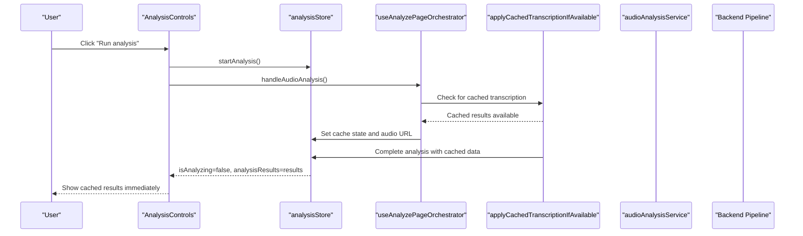

**Updated** The enhanced cache pipeline allows immediate access to cached results through the `applyCachedTranscriptionIfAvailable` function, which can be called during audio extraction to provide instant results.

**Diagram sources**
- [AnalysisControls.tsx:1-222](file://src/components/analysis/AnalysisControls.tsx#L1-L222)
- [analysisStore.ts:1-367](file://src/stores/analysisStore.ts#L1-L367)
- [useAnalyzePageOrchestrator.ts:622-720](file://src/hooks/analyze/useAnalyzePageOrchestrator.ts#L622-L720)
- [audioAnalysisService.ts:328-522](file://src/services/audio/audioAnalysisService.ts#L328-L522)

**Section sources**
- [useModelState.ts:1-147](file://src/hooks/chord-analysis/useModelState.ts#L1-L147)
- [analysisStore.ts:1-367](file://src/stores/analysisStore.ts#L1-L367)
- [useAnalyzePageOrchestrator.ts:622-720](file://src/hooks/analyze/useAnalyzePageOrchestrator.ts#L622-L720)
- [audioAnalysisService.ts:1-704](file://src/services/audio/audioAnalysisService.ts#L1-L704)

## Detailed Component Analysis

### AnalysisControls
AnalysisControls serves as the primary control panel for model selection and initiating analysis. It:
- Renders model chips for beat and chord detectors with environment-aware labels.
- Displays status messaging indicating preparation, cache availability, or analysis readiness.
- Provides a primary action button that triggers analysis or opens cached results based on state.
- Hides itself when analysis is complete to declutter the interface.
- **Enhanced**: Now supports immediate cached result access through `canOpenCachedResults` flag.

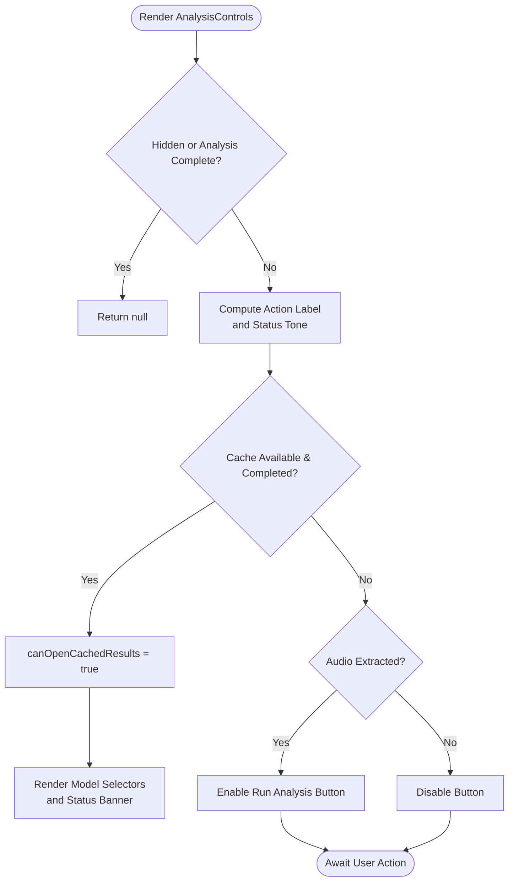

**Updated** Enhanced cache availability logic allows users to open cached results immediately when they become available, even if audio extraction is still in progress.

**Diagram sources**
- [AnalysisControls.tsx:1-222](file://src/components/analysis/AnalysisControls.tsx#L1-L222)

**Section sources**
- [AnalysisControls.tsx:1-222](file://src/components/analysis/AnalysisControls.tsx#L1-L222)

### AnalysisHeader
AnalysisHeader manages the top-of-page metadata and interactive controls:
- Editable video title with save/cancel actions.
- Enharmonic correction toggle with tooltip guidance.
- Lyrics transcription control with API key gating and caching awareness.

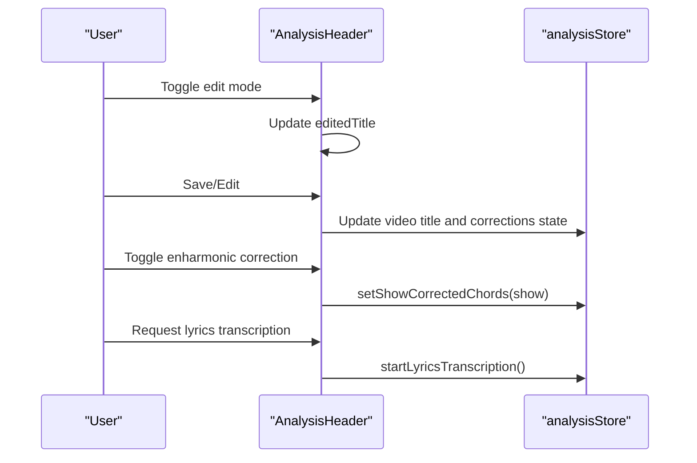

**Diagram sources**
- [AnalysisHeader.tsx:1-201](file://src/components/analysis/AnalysisHeader.tsx#L1-L201)
- [analysisStore.ts:1-367](file://src/stores/analysisStore.ts#L1-L367)

**Section sources**
- [AnalysisHeader.tsx:1-201](file://src/components/analysis/AnalysisHeader.tsx#L1-L201)
- [analysisStore.ts:1-367](file://src/stores/analysisStore.ts#L1-L367)

### AudioPlaybackDock
AudioPlaybackDock provides integrated playback controls:
- Play/Pause toggling with disabled states during processing.
- Seek slider bound to audio duration with formatted time labels.
- Playback rate selector in a popover with BPM display that reflects tempo adjustments.

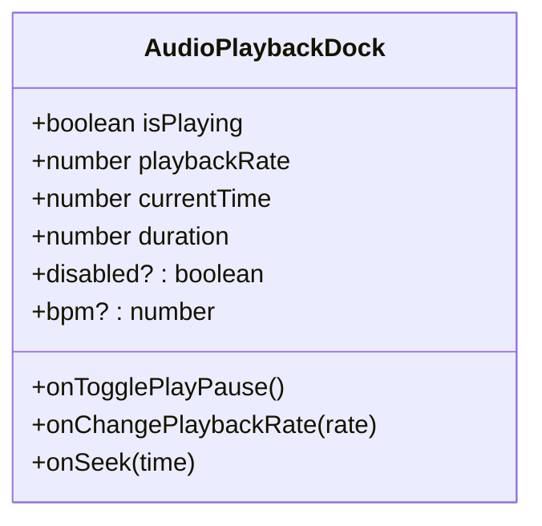

**Diagram sources**
- [AudioPlaybackDock.tsx:1-145](file://src/components/analysis/AudioPlaybackDock.tsx#L1-L145)

**Section sources**
- [AudioPlaybackDock.tsx:1-145](file://src/components/analysis/AudioPlaybackDock.tsx#L1-L145)

### BeatTimeline
BeatTimeline visualizes beat events and downbeats:
- Processes raw beat data into a normalized structure with beat numbers and downbeat flags.
- Computes measure start times from provided downbeats or inferred from downbeat positions.
- Automatically scrolls to the current beat index and highlights current beat/downbeat.
- Supports embedded rendering within other cards.

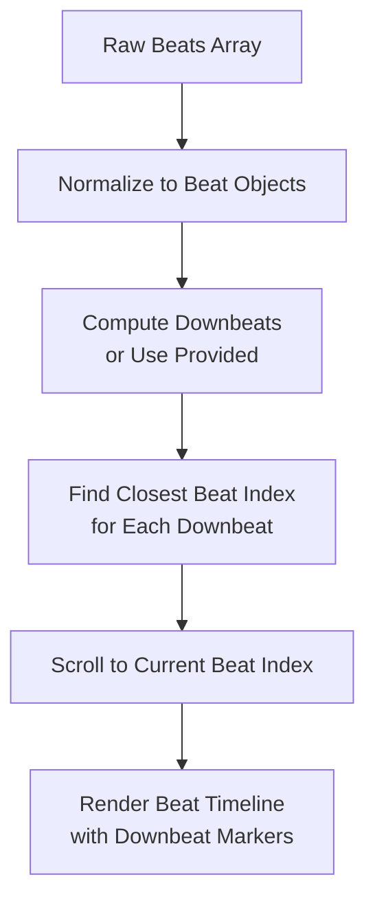

**Diagram sources**
- [BeatTimeline.tsx:1-228](file://src/components/analysis/BeatTimeline.tsx#L1-L228)

**Section sources**
- [BeatTimeline.tsx:1-228](file://src/components/analysis/BeatTimeline.tsx#L1-L228)

### ProcessingBanners
ProcessingBanners aggregates multiple feedback mechanisms:
- DownloadingIndicator: Toast banner shown during initial download/extraction.
- ExtractionNotification: Toast banner upon successful extraction with cache awareness.
- ProcessingStatusBanner: Real-time progress toasts for beat and chord recognition stages with duration-based timeouts.
- Error display: User-friendly error messages with retry and alternative video options.

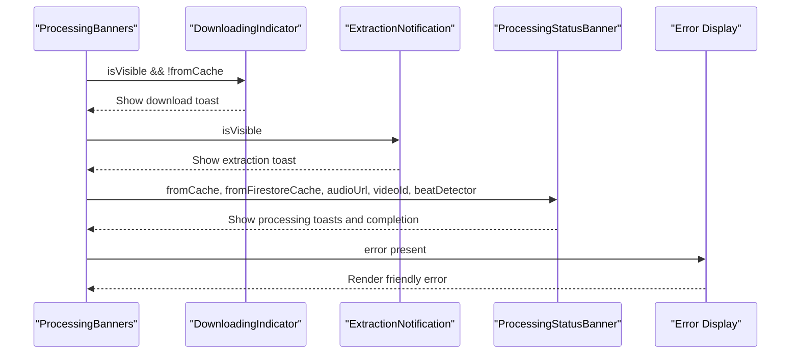

**Diagram sources**
- [ProcessingBanners.tsx:1-104](file://src/components/analysis/ProcessingBanners.tsx#L1-L104)
- [DownloadingIndicator.tsx:1-56](file://src/components/analysis/DownloadingIndicator.tsx#L1-L56)
- [ExtractionNotification.tsx:1-46](file://src/components/analysis/ExtractionNotification.tsx#L1-L46)
- [ProcessingStatusBanner.tsx:1-234](file://src/components/analysis/ProcessingStatusBanner.tsx#L1-L234)

**Section sources**
- [ProcessingBanners.tsx:1-104](file://src/components/analysis/ProcessingBanners.tsx#L1-L104)
- [ProcessingStatusBanner.tsx:1-234](file://src/components/analysis/ProcessingStatusBanner.tsx#L1-L234)
- [DownloadingIndicator.tsx:1-56](file://src/components/analysis/DownloadingIndicator.tsx#L1-L56)
- [ExtractionNotification.tsx:1-46](file://src/components/analysis/ExtractionNotification.tsx#L1-L46)

### Model Selection Interfaces
HeroUIBeatModelSelector and HeroUIChordModelSelector provide environment-aware model selection:
- Dynamic model info fetching with non-blocking UI rendering.
- Environment-based filtering via modelFiltering utilities.
- Availability indicators and development-only warnings for experimental models.
- Safe fallback selection when requested models are unavailable.

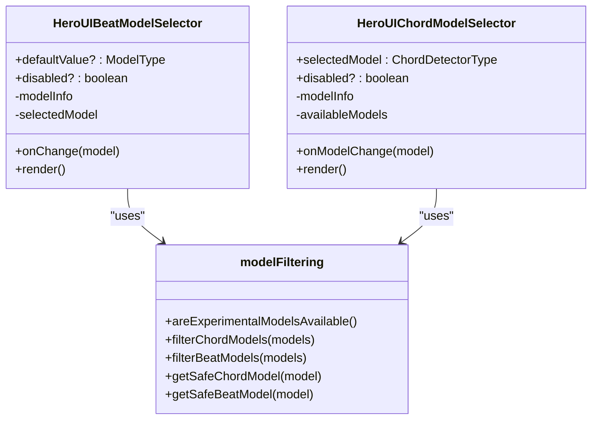

**Diagram sources**
- [HeroUIBeatModelSelector.tsx:1-209](file://src/components/analysis/HeroUIBeatModelSelector.tsx#L1-L209)
- [HeroUIChordModelSelector.tsx:1-234](file://src/components/analysis/HeroUIChordModelSelector.tsx#L1-L234)
- [modelFiltering.ts:1-179](file://src/utils/modelFiltering.ts#L1-L179)

**Section sources**
- [HeroUIBeatModelSelector.tsx:1-209](file://src/components/analysis/HeroUIBeatModelSelector.tsx#L1-L209)
- [HeroUIChordModelSelector.tsx:1-234](file://src/components/analysis/HeroUIChordModelSelector.tsx#L1-L234)
- [modelFiltering.ts:1-179](file://src/utils/modelFiltering.ts#L1-L179)

### State Management Integration
State management spans hooks, zustand store, and orchestration:
- useModelState: Initializes and persists model selections, exposes refs for latest values.
- analysisStore: Centralized state for analysis results, processing flags, cache state, and actions.
- useAnalyzePageOrchestrator: Coordinates extraction, cache checks, and analysis execution, updating store accordingly.

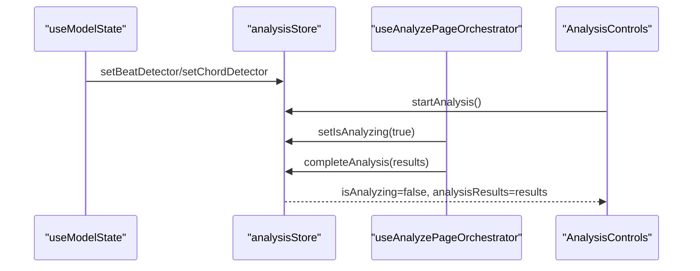

**Diagram sources**
- [useModelState.ts:1-147](file://src/hooks/chord-analysis/useModelState.ts#L1-L147)
- [analysisStore.ts:1-367](file://src/stores/analysisStore.ts#L1-L367)
- [useAnalyzePageOrchestrator.ts:622-720](file://src/hooks/analyze/useAnalyzePageOrchestrator.ts#L622-L720)
- [AnalysisControls.tsx:1-222](file://src/components/analysis/AnalysisControls.tsx#L1-L222)

**Section sources**
- [useModelState.ts:1-147](file://src/hooks/chord-analysis/useModelState.ts#L1-L147)
- [analysisStore.ts:1-367](file://src/stores/analysisStore.ts#L1-L367)
- [useAnalyzePageOrchestrator.ts:622-720](file://src/hooks/analyze/useAnalyzePageOrchestrator.ts#L622-L720)

### Integration with Analysis Pipeline Services
The analysis pipeline integrates multiple services:
- chordRecognitionService: Facade that delegates to audioAnalysisService for backward compatibility.
- audioAnalysisService: Orchestrates beat detection and chord recognition, handles offload uploads, and synchronizes results.
- useAnalyzePageOrchestrator: Executes extraction, cache checks, and analysis, updating UI state and store.

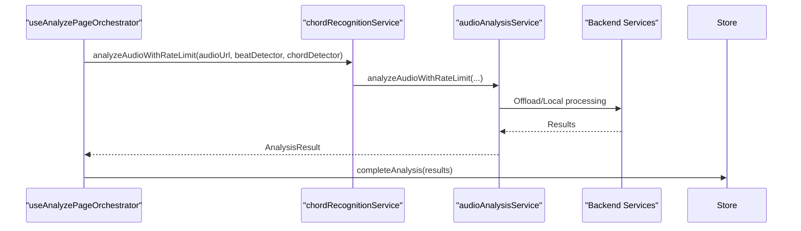

**Diagram sources**
- [useAnalyzePageOrchestrator.ts:541-616](file://src/hooks/analyze/useAnalyzePageOrchestrator.ts#L541-L616)
- [chordRecognitionService.ts:1-32](file://src/services/chord-analysis/chordRecognitionService.ts#L1-L32)
- [audioAnalysisService.ts:328-522](file://src/services/audio/audioAnalysisService.ts#L328-L522)

**Section sources**
- [chordRecognitionService.ts:1-32](file://src/services/chord-analysis/chordRecognitionService.ts#L1-L32)
- [audioAnalysisService.ts:1-704](file://src/services/audio/audioAnalysisService.ts#L1-L704)
- [useAnalyzePageOrchestrator.ts:622-720](file://src/hooks/analyze/useAnalyzePageOrchestrator.ts#L622-L720)

## Enhanced Cache Pipeline System

**New Section** The enhanced cache pipeline system provides immediate access to cached results during audio extraction, significantly improving user experience.

### applyCachedTranscriptionIfAvailable Function
The `applyCachedTranscriptionIfAvailable` function enables immediate cached result access:
- Checks Firestore for cached transcription snapshots with the current model combination
- Sets cache availability state and updates UI immediately
- Loads cached audio URL and duration when available
- Updates video title from cached data
- Allows users to access results while extraction continues

### Cache Availability Logic During Extraction
The system implements sophisticated cache checking during audio extraction:
- **Parallel cache checks**: Cache lookup runs concurrently with audio extraction
- **Immediate UI updates**: Results appear as soon as cache is found
- **Fallback handling**: If cache not found, continues with extraction
- **Error resilience**: Cache failures don't block the extraction process

### Enhanced User Experience
Users now benefit from:
- **Reduced wait times**: Cached results appear immediately when available
- **Continuous workflow**: Can start working while extraction completes
- **Better feedback**: Clear indication of cache availability and status
- **Seamless transition**: Smooth switch from extraction to cached results

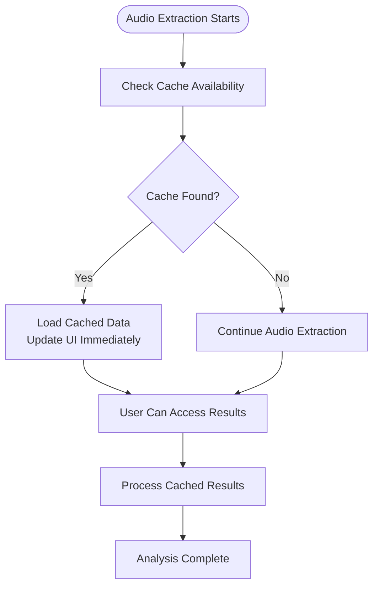

**Diagram sources**
- [useAnalyzePageOrchestrator.ts:622-720](file://src/hooks/analyze/useAnalyzePageOrchestrator.ts#L622-L720)
- [firestoreService.ts:423-470](file://src/services/firebase/firestoreService.ts#L423-L470)
- [firebaseStorageSimplified.ts:169-259](file://src/services/firebase/firebaseStorageSimplified.ts#L169-L259)

**Section sources**
- [useAnalyzePageOrchestrator.ts:622-720](file://src/hooks/analyze/useAnalyzePageOrchestrator.ts#L622-L720)
- [firestoreService.ts:423-470](file://src/services/firebase/firestoreService.ts#L423-L470)
- [firebaseStorageSimplified.ts:169-259](file://src/services/firebase/firebaseStorageSimplified.ts#L169-L259)

## Dependency Analysis
The components exhibit clear dependency relationships:
- UI components depend on state hooks and store for reactive updates.
- Model selectors depend on modelFiltering for environment-aware availability.
- Processing banners depend on processing context and service durations.
- AnalysisControls depends on model selectors and store for action enabling/disabling.
- Orchestrator coordinates services and updates store, driving UI state.
- **Enhanced**: Cache pipeline adds dependencies on Firestore and Firebase services.

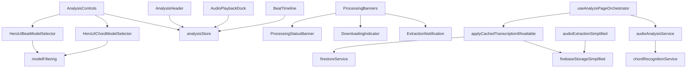

**Updated** Added cache pipeline dependencies for enhanced functionality.

**Diagram sources**
- [AnalysisControls.tsx:1-222](file://src/components/analysis/AnalysisControls.tsx#L1-L222)
- [HeroUIBeatModelSelector.tsx:1-209](file://src/components/analysis/HeroUIBeatModelSelector.tsx#L1-L209)
- [HeroUIChordModelSelector.tsx:1-234](file://src/components/analysis/HeroUIChordModelSelector.tsx#L1-L234)
- [ProcessingBanners.tsx:1-104](file://src/components/analysis/ProcessingBanners.tsx#L1-L104)
- [ProcessingStatusBanner.tsx:1-234](file://src/components/analysis/ProcessingStatusBanner.tsx#L1-L234)
- [DownloadingIndicator.tsx:1-56](file://src/components/analysis/DownloadingIndicator.tsx#L1-L56)
- [ExtractionNotification.tsx:1-46](file://src/components/analysis/ExtractionNotification.tsx#L1-L46)
- [useModelState.ts:1-147](file://src/hooks/chord-analysis/useModelState.ts#L1-L147)
- [analysisStore.ts:1-367](file://src/stores/analysisStore.ts#L1-L367)
- [useAnalyzePageOrchestrator.ts:622-720](file://src/hooks/analyze/useAnalyzePageOrchestrator.ts#L622-L720)
- [audioAnalysisService.ts:1-704](file://src/services/audio/audioAnalysisService.ts#L1-L704)
- [chordRecognitionService.ts:1-32](file://src/services/chord-analysis/chordRecognitionService.ts#L1-L32)
- [modelFiltering.ts:1-179](file://src/utils/modelFiltering.ts#L1-L179)
- [firestoreService.ts:423-470](file://src/services/firebase/firestoreService.ts#L423-L470)
- [firebaseStorageSimplified.ts:169-259](file://src/services/firebase/firebaseStorageSimplified.ts#L169-L259)
- [audioExtractionSimplified.ts:632-1606](file://src/services/audio/audioExtractionSimplified.ts#L632-L1606)

**Section sources**
- [AnalysisControls.tsx:1-222](file://src/components/analysis/AnalysisControls.tsx#L1-L222)
- [HeroUIBeatModelSelector.tsx:1-209](file://src/components/analysis/HeroUIBeatModelSelector.tsx#L1-L209)
- [HeroUIChordModelSelector.tsx:1-234](file://src/components/analysis/HeroUIChordModelSelector.tsx#L1-L234)
- [ProcessingBanners.tsx:1-104](file://src/components/analysis/ProcessingBanners.tsx#L1-L104)
- [ProcessingStatusBanner.tsx:1-234](file://src/components/analysis/ProcessingStatusBanner.tsx#L1-L234)
- [DownloadingIndicator.tsx:1-56](file://src/components/analysis/DownloadingIndicator.tsx#L1-L56)
- [ExtractionNotification.tsx:1-46](file://src/components/analysis/ExtractionNotification.tsx#L1-L46)
- [useModelState.ts:1-147](file://src/hooks/chord-analysis/useModelState.ts#L1-L147)
- [analysisStore.ts:1-367](file://src/stores/analysisStore.ts#L1-L367)
- [useAnalyzePageOrchestrator.ts:622-720](file://src/hooks/analyze/useAnalyzePageOrchestrator.ts#L622-L720)
- [audioAnalysisService.ts:1-704](file://src/services/audio/audioAnalysisService.ts#L1-L704)
- [chordRecognitionService.ts:1-32](file://src/services/chord-analysis/chordRecognitionService.ts#L1-L32)
- [modelFiltering.ts:1-179](file://src/utils/modelFiltering.ts#L1-L179)
- [firestoreService.ts:423-470](file://src/services/firebase/firestoreService.ts#L423-L470)
- [firebaseStorageSimplified.ts:169-259](file://src/services/firebase/firebaseStorageSimplified.ts#L169-L259)
- [audioExtractionSimplified.ts:632-1606](file://src/services/audio/audioExtractionSimplified.ts#L632-L1606)

## Performance Considerations
- Non-blocking model info fetching: Model selectors fetch metadata asynchronously to avoid UI stalls.
- Memoization and minimal re-renders: BeatTimeline uses useMemo and useEffect to compute indices efficiently.
- Parallel processing: audioAnalysisService runs beat detection and chord recognition concurrently to reduce total latency.
- Duration-based toasts: ProcessingStatusBanner computes timeouts based on audio duration to provide realistic progress feedback.
- Environment-aware filtering: modelFiltering hides experimental models in production to prevent unnecessary complexity.
- **Enhanced**: Parallel cache checking during extraction reduces overall wait times.
- **Enhanced**: Immediate cached result access prevents redundant processing when results are available.
- **Enhanced**: Background cache updates improve subsequent access performance.

## Troubleshooting Guide
Common issues and resolutions:
- Rate limit errors: audioAnalysisService surfaces rate limit messages for both beat detection and chord recognition. Users should retry or shorten the audio clip.
- Large file errors: Exceeding size limits triggers user-friendly messages; use smaller clips or the madmom detector.
- Timeout errors: Long processing times result in timeout messages; retry after ensuring stable connectivity.
- Cache availability: ProcessingBanners indicate whether cached audio or analysis results are available, guiding users to reuse prior work.
- Model unavailability: modelFiltering hides experimental models in production; users can enable via environment overrides if available.
- **Enhanced**: Cache lookup failures are handled gracefully without blocking extraction process.
- **Enhanced**: Users can continue with fresh analysis if cached results are not available.

**Section sources**
- [audioAnalysisService.ts:374-421](file://src/services/audio/audioAnalysisService.ts#L374-L421)
- [ProcessingStatusBanner.tsx:1-234](file://src/components/analysis/ProcessingStatusBanner.tsx#L1-L234)
- [modelFiltering.ts:1-179](file://src/utils/modelFiltering.ts#L1-L179)
- [useAnalyzePageOrchestrator.ts:622-720](file://src/hooks/analyze/useAnalyzePageOrchestrator.ts#L622-L720)

## Conclusion
The analysis interface components provide a cohesive, responsive, and user-friendly system for selecting models, monitoring processing progress, and interacting with audio and chord results. Through careful state management, environment-aware model filtering, and robust integration with the analysis pipeline services, the system delivers reliable performance and clear feedback throughout the analysis workflow.

**Updated** The enhanced cache pipeline system significantly improves user experience by providing immediate access to cached results during audio extraction, reducing wait times and enabling continuous workflow. The `applyCachedTranscriptionIfAvailable` function and parallel cache checking mechanisms ensure that users can access previous analysis results as soon as they become available, even while new extraction processes are running.
