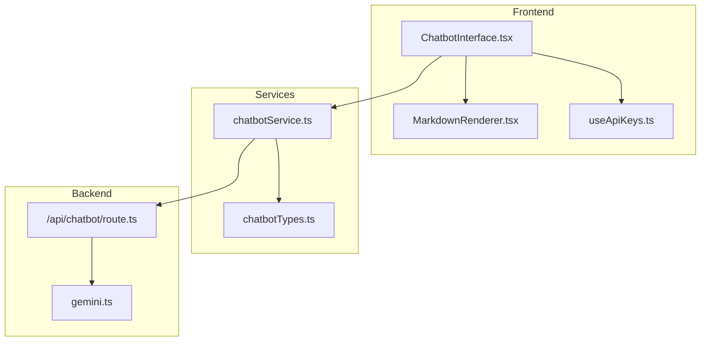
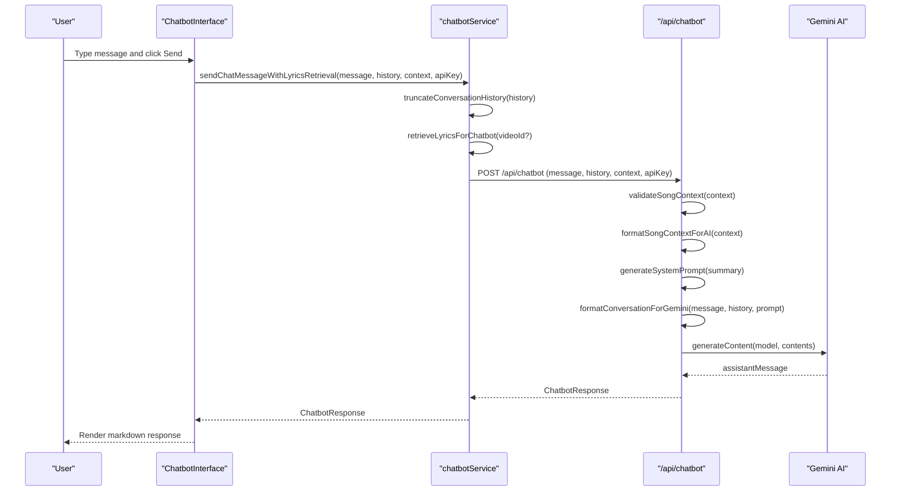
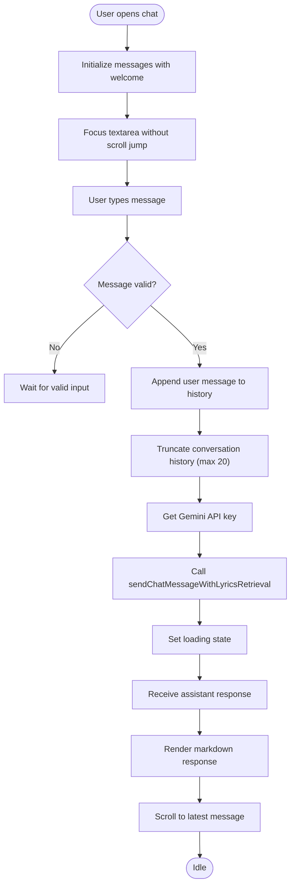
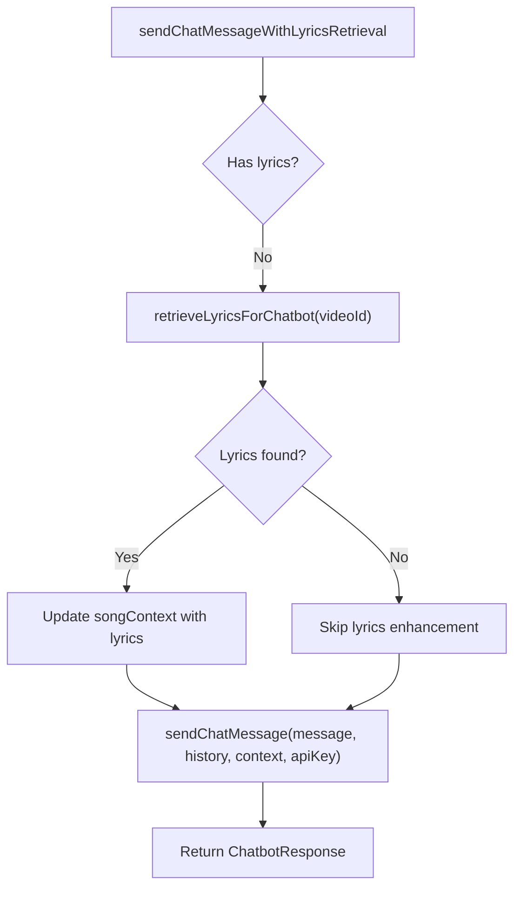
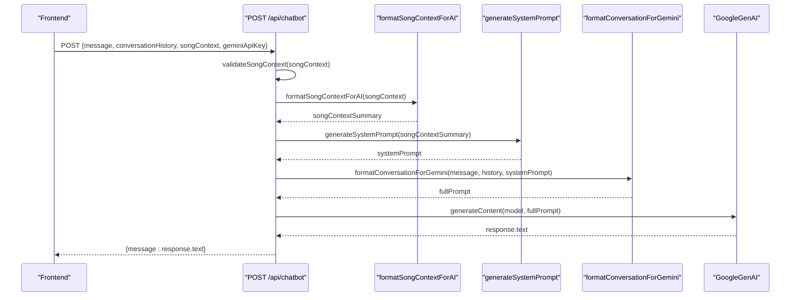
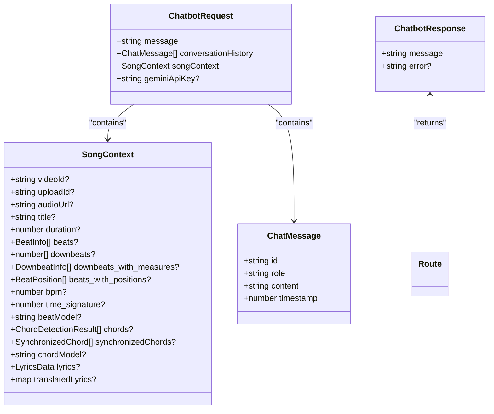
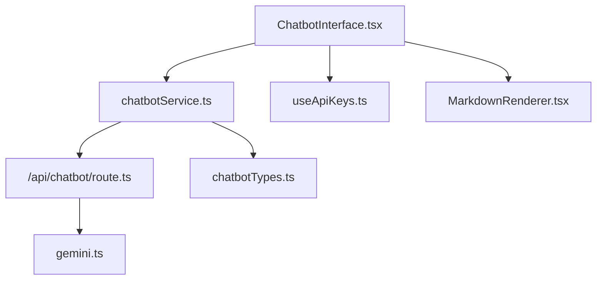

# Chatbot Interface Component

<cite>
**Referenced Files in This Document**
- [ChatbotInterface.tsx](file://src/components/chatbot/ChatbotInterface.tsx)
- [chatbotService.ts](file://src/services/api/chatbotService.ts)
- [chatbotTypes.ts](file://src/types/chatbotTypes.ts)
- [route.ts](file://src/app/api/chatbot/route.ts)
- [gemini.ts](file://src/config/gemini.ts)
- [useApiKeys.ts](file://src/hooks/settings/useApiKeys.ts)
- [MarkdownRenderer.tsx](file://src/components/common/MarkdownRenderer.tsx)
- [page.tsx](file://src/app/analyze/page.tsx)
</cite>

## Table of Contents
1. [Introduction](#introduction)
2. [Project Structure](#project-structure)
3. [Core Components](#core-components)
4. [Architecture Overview](#architecture-overview)
5. [Detailed Component Analysis](#detailed-component-analysis)
6. [Dependency Analysis](#dependency-analysis)
7. [Performance Considerations](#performance-considerations)
8. [Troubleshooting Guide](#troubleshooting-guide)
9. [Conclusion](#conclusion)

## Introduction
This document provides comprehensive technical documentation for the Chatbot Interface component that powers AI-assisted music analysis within the application. It explains the integration with Gemini AI services, conversation management, real-time response handling, and the underlying architecture for natural language processing, context management, and user interaction patterns. The documentation also covers API communication, message formatting, error handling, and user experience optimization strategies.

## Project Structure
The Chatbot Interface spans three primary layers:
- Frontend UI component: renders the chat panel, manages user input, displays assistant responses, and integrates with API services.
- Service layer: encapsulates API communication, conversation history truncation, and song context formatting for AI consumption.
- Backend API route: validates inputs, constructs prompts, interacts with Gemini AI, and returns formatted responses.

**Diagram sources**
- [ChatbotInterface.tsx:1-203](file://src/components/chatbot/ChatbotInterface.tsx#L1-L203)
- [chatbotService.ts:1-285](file://src/services/api/chatbotService.ts#L1-L285)
- [chatbotTypes.ts:1-126](file://src/types/chatbotTypes.ts#L1-L126)
- [route.ts:1-173](file://src/app/api/chatbot/route.ts#L1-L173)
- [gemini.ts:1-43](file://src/config/gemini.ts#L1-L43)
- [MarkdownRenderer.tsx:1-119](file://src/components/common/MarkdownRenderer.tsx#L1-L119)
- [useApiKeys.ts:1-209](file://src/hooks/settings/useApiKeys.ts#L1-L209)

**Section sources**
- [ChatbotInterface.tsx:1-203](file://src/components/chatbot/ChatbotInterface.tsx#L1-L203)
- [chatbotService.ts:1-285](file://src/services/api/chatbotService.ts#L1-L285)
- [chatbotTypes.ts:1-126](file://src/types/chatbotTypes.ts#L1-L126)
- [route.ts:1-173](file://src/app/api/chatbot/route.ts#L1-L173)
- [gemini.ts:1-43](file://src/config/gemini.ts#L1-L43)
- [MarkdownRenderer.tsx:1-119](file://src/components/common/MarkdownRenderer.tsx#L1-L119)
- [useApiKeys.ts:1-209](file://src/hooks/settings/useApiKeys.ts#L1-L209)

## Core Components
- ChatbotInterface: A React client component that renders the floating chat panel, manages conversation state, handles user input, and displays AI responses with markdown rendering.
- chatbotService: Provides API communication utilities, message creation, song context formatting, lyrics retrieval, conversation history truncation, and validation helpers.
- Backend route: Validates inputs, constructs a system prompt enriched with song context, formats conversation history, calls Gemini AI, and returns assistant responses.
- Gemini configuration: Manages client creation with optional user-provided API keys and caching for server-side reuse.
- useApiKeys hook: Centralizes API key management, validation, and availability checks for Gemini and other services.
- MarkdownRenderer: Renders assistant messages with styled markdown elements for improved readability.

**Section sources**
- [ChatbotInterface.tsx:1-203](file://src/components/chatbot/ChatbotInterface.tsx#L1-L203)
- [chatbotService.ts:1-285](file://src/services/api/chatbotService.ts#L1-L285)
- [route.ts:1-173](file://src/app/api/chatbot/route.ts#L1-L173)
- [gemini.ts:1-43](file://src/config/gemini.ts#L1-L43)
- [useApiKeys.ts:1-209](file://src/hooks/settings/useApiKeys.ts#L1-L209)
- [MarkdownRenderer.tsx:1-119](file://src/components/common/MarkdownRenderer.tsx#L1-L119)

## Architecture Overview
The Chatbot Interface follows a layered architecture:
- UI Layer: Presents the chat panel, collects user input, and renders responses.
- Service Layer: Handles API communication, context formatting, and conversation management.
- Backend Layer: Processes requests, constructs prompts, integrates with Gemini AI, and returns responses.
- Configuration Layer: Provides Gemini client configuration and fallback mechanisms.

**Diagram sources**
- [ChatbotInterface.tsx:48-75](file://src/components/chatbot/ChatbotInterface.tsx#L48-L75)
- [chatbotService.ts:200-231](file://src/services/api/chatbotService.ts#L200-L231)
- [route.ts:73-146](file://src/app/api/chatbot/route.ts#L73-L146)
- [gemini.ts:13-42](file://src/config/gemini.ts#L13-L42)

## Detailed Component Analysis

### ChatbotInterface Component
Responsibilities:
- Manages conversation state (messages, input, loading, error).
- Integrates with API keys for Gemini authentication.
- Handles user input submission, clears conversations, and scrolls to latest messages.
- Renders user and assistant messages with timestamps and markdown formatting.
- Supports embedded and floating panel modes with responsive sizing.

Key behaviors:
- Welcome message initialization when the panel opens.
- Auto-resize textarea based on content height.
- Smooth animations for opening/closing the panel.
- Real-time loading indicators during AI response generation.

**Diagram sources**
- [ChatbotInterface.tsx:48-101](file://src/components/chatbot/ChatbotInterface.tsx#L48-L101)

**Section sources**
- [ChatbotInterface.tsx:1-203](file://src/components/chatbot/ChatbotInterface.tsx#L1-L203)
- [MarkdownRenderer.tsx:1-119](file://src/components/common/MarkdownRenderer.tsx#L1-L119)

### chatbotService: API Communication and Context Management
Responsibilities:
- Send chat messages to the backend with conversation history and song context.
- Create chat messages with unique IDs and timestamps.
- Format song context comprehensively for AI consumption.
- Retrieve lyrics for chatbot context when missing.
- Enhance conversation with automatic lyrics retrieval.
- Validate song context and truncate conversation history to optimize payload size.
- Integrate with segmentation services for advanced analysis.

Implementation highlights:
- Axios-based POST request to /api/chatbot with a 30-second timeout.
- Comprehensive song context formatting including beats, chords, lyrics, and translations.
- Automatic lyrics retrieval for YouTube videos, with safeguards for uploads.
- Robust error handling with user-friendly messages for timeouts, invalid requests, and service unavailability.

**Diagram sources**
- [chatbotService.ts:198-231](file://src/services/api/chatbotService.ts#L198-L231)

**Section sources**
- [chatbotService.ts:1-285](file://src/services/api/chatbotService.ts#L1-L285)

### Backend Route: Prompt Construction and Gemini Integration
Responsibilities:
- Validate incoming request body and song context.
- Construct a system prompt enriched with formatted song context.
- Format conversation history and current user message into a single prompt.
- Create a Gemini client with user-provided or environment-provided API key.
- Generate content using the configured model and return cleaned assistant response.
- Handle errors with appropriate HTTP status codes and user-facing messages.

Key logic:
- System prompt emphasizes music analysis capabilities and song segmentation.
- Conversation history is appended with clear role markers.
- Gemini client supports BYOK (Bring Your Own Key) with fallback to environment variables.

**Diagram sources**
- [route.ts:73-146](file://src/app/api/chatbot/route.ts#L73-L146)
- [gemini.ts:13-42](file://src/config/gemini.ts#L13-L42)

**Section sources**
- [route.ts:1-173](file://src/app/api/chatbot/route.ts#L1-L173)
- [gemini.ts:1-43](file://src/config/gemini.ts#L1-L43)

### Data Models and Types
The system defines clear interfaces for chat messages, song context, requests, and responses. These types ensure consistent data flow between frontend, service, and backend layers.

**Diagram sources**
- [chatbotTypes.ts:12-81](file://src/types/chatbotTypes.ts#L12-L81)

**Section sources**
- [chatbotTypes.ts:1-126](file://src/types/chatbotTypes.ts#L1-L126)

### Integration Examples and Conversation Flow
Typical user interaction:
- User opens the chat panel and receives a welcome message.
- User asks a question about chords, beats, or lyrics.
- The system retrieves lyrics if missing and formats song context.
- The backend constructs a prompt and calls Gemini AI.
- The assistant responds with markdown-formatted insights.

Example scenarios:
- Asking about chord progressions: The system references formatted chord data and timestamps.
- Requesting song segmentation: The system leverages the AI's special capabilities to identify sections with precise timestamps.
- Practicing techniques: The system suggests strumming patterns or fingerings based on detected chords and beats.

**Section sources**
- [ChatbotInterface.tsx:22-101](file://src/components/chatbot/ChatbotInterface.tsx#L22-L101)
- [chatbotService.ts:74-169](file://src/services/api/chatbotService.ts#L74-L169)
- [route.ts:14-44](file://src/app/api/chatbot/route.ts#L14-L44)

## Dependency Analysis
The Chatbot Interface component depends on:
- Service layer for API communication and context formatting.
- API key management for Gemini authentication.
- Markdown rendering for assistant responses.
- Backend route for AI processing and response generation.

**Diagram sources**
- [ChatbotInterface.tsx:1-203](file://src/components/chatbot/ChatbotInterface.tsx#L1-L203)
- [chatbotService.ts:1-285](file://src/services/api/chatbotService.ts#L1-L285)
- [useApiKeys.ts:1-209](file://src/hooks/settings/useApiKeys.ts#L1-L209)
- [MarkdownRenderer.tsx:1-119](file://src/components/common/MarkdownRenderer.tsx#L1-L119)
- [route.ts:1-173](file://src/app/api/chatbot/route.ts#L1-L173)
- [gemini.ts:1-43](file://src/config/gemini.ts#L1-L43)
- [chatbotTypes.ts:1-126](file://src/types/chatbotTypes.ts#L1-L126)

**Section sources**
- [ChatbotInterface.tsx:1-203](file://src/components/chatbot/ChatbotInterface.tsx#L1-L203)
- [chatbotService.ts:1-285](file://src/services/api/chatbotService.ts#L1-L285)
- [useApiKeys.ts:1-209](file://src/hooks/settings/useApiKeys.ts#L1-L209)
- [MarkdownRenderer.tsx:1-119](file://src/components/common/MarkdownRenderer.tsx#L1-L119)
- [route.ts:1-173](file://src/app/api/chatbot/route.ts#L1-L173)
- [gemini.ts:1-43](file://src/config/gemini.ts#L1-L43)
- [chatbotTypes.ts:1-126](file://src/types/chatbotTypes.ts#L1-L126)

## Performance Considerations
- Conversation history truncation: Limits payload size to improve response times and reduce API costs.
- Auto-resize textarea: Prevents layout thrashing and improves typing experience.
- Embedded vs floating panels: Optimizes rendering and responsiveness for different screen sizes.
- Timeout configuration: Balances user experience with resource constraints for both frontend and backend requests.
- Lyrics retrieval fallback: Avoids blocking chat interactions by attempting retrieval before sending the message.

[No sources needed since this section provides general guidance]

## Troubleshooting Guide
Common issues and resolutions:
- Missing Gemini API key: The backend returns a 500 error indicating misconfiguration. Users should add a valid key via the settings panel.
- Invalid song context: The backend validates context and returns a 400 error if insufficient data is provided. Ensure at least one identifier (videoId or uploadId) and supporting data (beats, chords, or lyrics) are present.
- Empty AI response: The backend checks for empty responses and returns a 500 error with a user-friendly message.
- Rate limits or quota exceeded: The backend detects quota or rate limit errors and returns a 429 status with guidance to retry later.
- Request timeout: Frontend and backend enforce timeouts; users should retry or reduce message length.
- Lyrics retrieval failures: The service attempts to fetch lyrics and falls back gracefully if unavailable.

**Section sources**
- [route.ts:79-93](file://src/app/api/chatbot/route.ts#L79-L93)
- [route.ts:129-137](file://src/app/api/chatbot/route.ts#L129-L137)
- [route.ts:150-170](file://src/app/api/chatbot/route.ts#L150-L170)
- [chatbotService.ts:39-54](file://src/services/api/chatbotService.ts#L39-L54)
- [chatbotService.ts:174-195](file://src/services/api/chatbotService.ts#L174-L195)

## Conclusion
The Chatbot Interface component delivers a robust, user-friendly AI-assisted music analysis experience. It integrates seamlessly with Gemini AI, manages conversation context effectively, and provides real-time responses with markdown rendering. The architecture balances performance, reliability, and user experience, with clear error handling and extensibility for future enhancements.