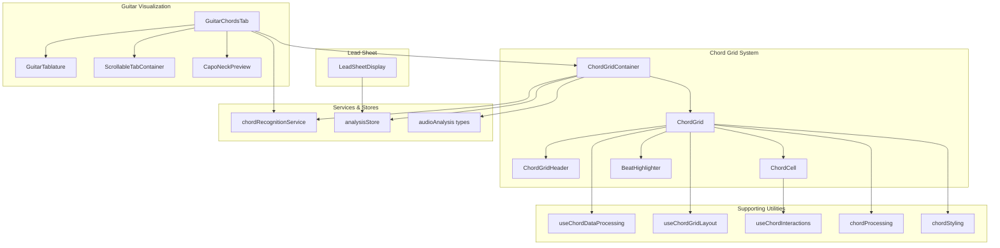
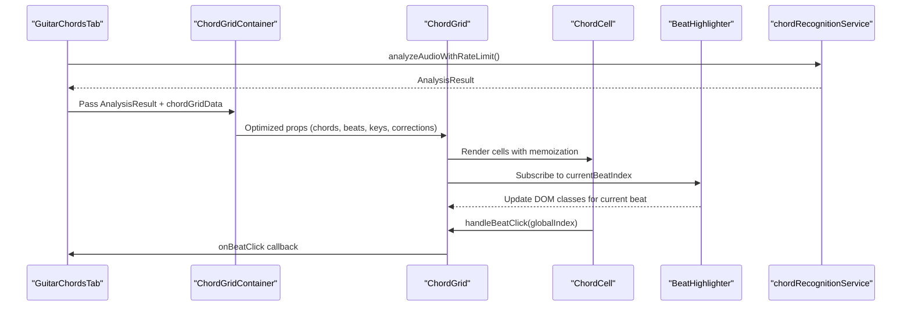
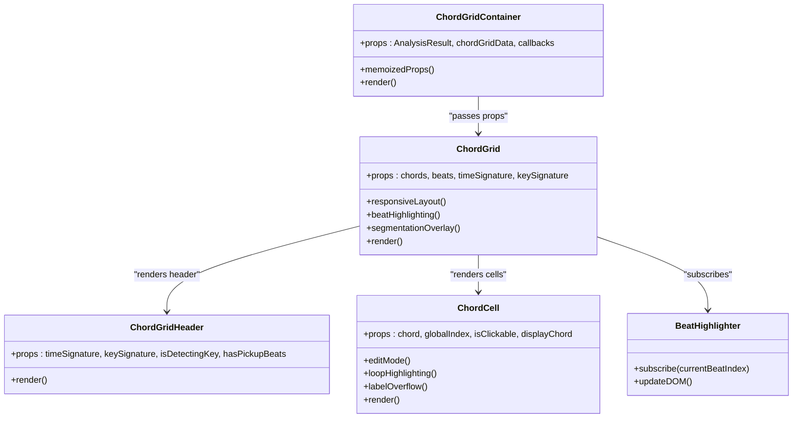
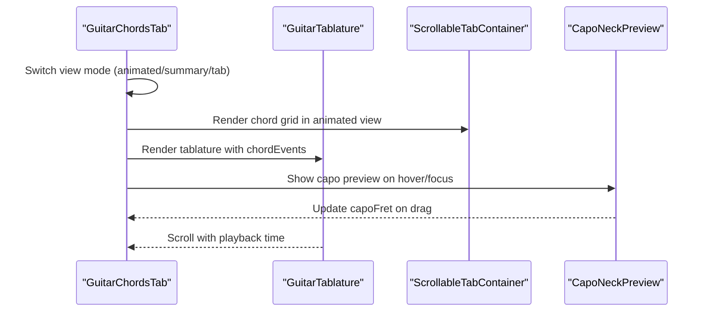
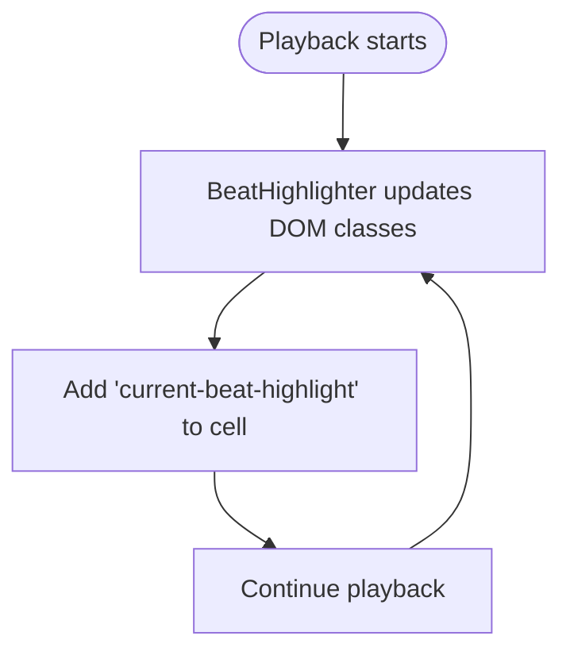
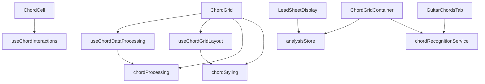

# Chord Analysis Components

<cite>
**Referenced Files in This Document**
- [ChordGrid.tsx](file://src/components/chord-analysis/ChordGrid.tsx)
- [ChordGridContainer.tsx](file://src/components/chord-analysis/ChordGridContainer.tsx)
- [ChordGridHeader.tsx](file://src/components/chord-analysis/ChordGridHeader.tsx)
- [ChordCell.tsx](file://src/components/chord-analysis/ChordCell.tsx)
- [GuitarChordsTab.tsx](file://src/components/chord-analysis/GuitarChordsTab.tsx)
- [GuitarTablature.tsx](file://src/components/chord-analysis/GuitarTablature.tsx)
- [LeadSheetDisplay.tsx](file://src/components/chord-analysis/LeadSheetDisplay.tsx)
- [BeatHighlighter.tsx](file://src/components/chord-analysis/BeatHighlighter.tsx)
- [ScrollableTabContainer.tsx](file://src/components/chord-analysis/ScrollableTabContainer.tsx)
- [CapoNeckPreview.tsx](file://src/components/chord-analysis/CapoNeckPreview.tsx)
- [chordRecognitionService.ts](file://src/services/chord-analysis/chordRecognitionService.ts)
- [useChordDataProcessing.ts](file://src/hooks/chord-analysis/useChordDataProcessing.ts)
- [useChordGridLayout.ts](file://src/hooks/chord-analysis/useChordGridLayout.ts)
- [useChordInteractions.ts](file://src/hooks/chord-analysis/useChordInteractions.ts)
- [chordProcessing.ts](file://src/utils/chordProcessing.ts)
- [chordStyling.ts](file://src/utils/chordStyling.ts)
- [analysisStore.ts](file://src/stores/analysisStore.ts)
- [audioAnalysis.ts](file://src/types/audioAnalysis.ts)
</cite>

## Table of Contents
1. [Introduction](#introduction)
2. [Project Structure](#project-structure)
3. [Core Components](#core-components)
4. [Architecture Overview](#architecture-overview)
5. [Detailed Component Analysis](#detailed-component-analysis)
6. [Dependency Analysis](#dependency-analysis)
7. [Performance Considerations](#performance-considerations)
8. [Troubleshooting Guide](#troubleshooting-guide)
9. [Conclusion](#conclusion)

## Introduction
This document provides comprehensive documentation for the chord analysis component suite in the ChordMiniApp. It covers the chord grid system (ChordGrid, ChordGridContainer, ChordGridHeader, and ChordCell), guitar chord visualization components (GuitarChordsTab and GuitarTablature), lead sheet display functionality, and beat highlighting mechanisms. The guide explains component composition patterns, data binding, interactive features, and integration with chord recognition services, including practical examples for chord progression visualization, grid manipulation, and service integration.

## Project Structure
The chord analysis components are organized into focused modules:
- Chord grid system: responsible for displaying chord progressions in a grid layout with beat highlighting and segmentation overlays
- Guitar visualization: provides animated chord diagrams, summary views, and tablature for guitar playback
- Lead sheet display: synchronizes lyrics with chords and highlights active lines during playback
- Supporting utilities: hooks for data processing, layout calculations, styling, and interaction handling
- Stores and services: state management for analysis results and integration with chord recognition APIs

**Diagram sources**
- [ChordGridContainer.tsx:70-219](file://src/components/chord-analysis/ChordGridContainer.tsx#L70-L219)
- [ChordGrid.tsx:178-831](file://src/components/chord-analysis/ChordGrid.tsx#L178-L831)
- [ChordGridHeader.tsx:16-76](file://src/components/chord-analysis/ChordGridHeader.tsx#L16-L76)
- [ChordCell.tsx:115-357](file://src/components/chord-analysis/ChordCell.tsx#L115-L357)
- [BeatHighlighter.tsx:19-46](file://src/components/chord-analysis/BeatHighlighter.tsx#L19-L46)
- [GuitarChordsTab.tsx:108-809](file://src/components/chord-analysis/GuitarChordsTab.tsx#L108-L809)
- [GuitarTablature.tsx:455-757](file://src/components/chord-analysis/GuitarTablature.tsx#L455-L757)
- [ScrollableTabContainer.tsx:16-38](file://src/components/chord-analysis/ScrollableTabContainer.tsx#L16-L38)
- [CapoNeckPreview.tsx:31-252](file://src/components/chord-analysis/CapoNeckPreview.tsx#L31-L252)
- [LeadSheetDisplay.tsx:59-239](file://src/components/chord-analysis/LeadSheetDisplay.tsx#L59-L239)
- [useChordDataProcessing.ts:25-88](file://src/hooks/chord-analysis/useChordDataProcessing.ts#L25-L88)
- [useChordGridLayout.ts:8-124](file://src/hooks/chord-analysis/useChordGridLayout.ts#L8-L124)
- [useChordInteractions.ts:21-64](file://src/hooks/chord-analysis/useChordInteractions.ts#L21-L64)
- [chordProcessing.ts:433-451](file://src/utils/chordProcessing.ts#L433-L451)
- [chordStyling.ts:166-270](file://src/utils/chordStyling.ts#L166-L270)
- [chordRecognitionService.ts:14-32](file://src/services/chord-analysis/chordRecognitionService.ts#L14-L32)
- [analysisStore.ts:101-295](file://src/stores/analysisStore.ts#L101-L295)
- [audioAnalysis.ts:48-71](file://src/types/audioAnalysis.ts#L48-L71)

**Section sources**
- [ChordGrid.tsx:1-831](file://src/components/chord-analysis/ChordGrid.tsx#L1-L831)
- [ChordGridContainer.tsx:1-219](file://src/components/chord-analysis/ChordGridContainer.tsx#L1-L219)
- [GuitarChordsTab.tsx:1-809](file://src/components/chord-analysis/GuitarChordsTab.tsx#L1-L809)
- [GuitarTablature.tsx:1-757](file://src/components/chord-analysis/GuitarTablature.tsx#L1-L757)
- [LeadSheetDisplay.tsx:1-239](file://src/components/chord-analysis/LeadSheetDisplay.tsx#L1-L239)
- [BeatHighlighter.tsx:1-46](file://src/components/chord-analysis/BeatHighlighter.tsx#L1-L46)
- [ScrollableTabContainer.tsx:1-38](file://src/components/chord-analysis/ScrollableTabContainer.tsx#L1-L38)
- [CapoNeckPreview.tsx:1-252](file://src/components/chord-analysis/CapoNeckPreview.tsx#L1-L252)
- [chordRecognitionService.ts:1-32](file://src/services/chord-analysis/chordRecognitionService.ts#L1-L32)
- [useChordDataProcessing.ts:1-88](file://src/hooks/chord-analysis/useChordDataProcessing.ts#L1-L88)
- [useChordGridLayout.ts:1-124](file://src/hooks/chord-analysis/useChordGridLayout.ts#L1-L124)
- [useChordInteractions.ts:1-64](file://src/hooks/chord-analysis/useChordInteractions.ts#L1-L64)
- [chordProcessing.ts:1-451](file://src/utils/chordProcessing.ts#L1-L451)
- [chordStyling.ts:1-270](file://src/utils/chordStyling.ts#L1-L270)
- [analysisStore.ts:1-367](file://src/stores/analysisStore.ts#L1-L367)
- [audioAnalysis.ts:1-71](file://src/types/audioAnalysis.ts#L1-L71)

## Core Components
This section introduces the primary components and their roles in the chord analysis workflow.

- ChordGridContainer: Orchestrates chord grid data, integrates with analysis results and UI stores, and passes optimized props to ChordGrid. It manages key signature display adjustments for pitch-shift scenarios and resolves chord display data with corrections and sequence-based enhancements.
- ChordGrid: Renders the chord progression grid with responsive layout, beat highlighting, segmentation overlays, and optional Roman numeral analysis. It handles click interactions, loop mode, and edit mode for chord corrections.
- ChordGridHeader: Displays time signature, key signature, key detection status, and pickup beats metadata.
- ChordCell: Individual grid cell with memoized rendering, edit mode, loop range highlighting, modulation indicators, and label overflow handling for compact displays.
- BeatHighlighter: Lightweight side-effect component that updates DOM classes for current beat highlighting without triggering React re-renders.
- GuitarChordsTab: Provides three views—animated chord diagrams, summary chord display, and guitar tablature—along with capo control, label mode switching, and guitar-only playback integration.
- GuitarTablature: Renders a scrolling six-string tablature synchronized with chord events, including strum arrows, fret labels, and dynamic voicing resolution.
- LeadSheetDisplay: Displays lyrics in a lead sheet format with chords positioned above corresponding words, synchronized with playback and segmentation overlays.

**Section sources**
- [ChordGridContainer.tsx:70-219](file://src/components/chord-analysis/ChordGridContainer.tsx#L70-L219)
- [ChordGrid.tsx:178-831](file://src/components/chord-analysis/ChordGrid.tsx#L178-L831)
- [ChordGridHeader.tsx:16-76](file://src/components/chord-analysis/ChordGridHeader.tsx#L16-L76)
- [ChordCell.tsx:115-357](file://src/components/chord-analysis/ChordCell.tsx#L115-L357)
- [BeatHighlighter.tsx:19-46](file://src/components/chord-analysis/BeatHighlighter.tsx#L19-L46)
- [GuitarChordsTab.tsx:108-809](file://src/components/chord-analysis/GuitarChordsTab.tsx#L108-L809)
- [GuitarTablature.tsx:455-757](file://src/components/chord-analysis/GuitarTablature.tsx#L455-L757)
- [LeadSheetDisplay.tsx:59-239](file://src/components/chord-analysis/LeadSheetDisplay.tsx#L59-L239)

## Architecture Overview
The chord analysis architecture follows a layered pattern:
- Presentation Layer: Components (ChordGrid, ChordCell, GuitarChordsTab, LeadSheetDisplay) render data and manage user interactions.
- Data Processing Layer: Hooks (useChordDataProcessing, useChordGridLayout, useChordInteractions) encapsulate logic for chord transformations, layout calculations, and interaction handling.
- Utility Layer: Pure functions (chordProcessing, chordStyling) provide reusable computations for chord normalization, corrections, and styling.
- State Management: Stores (analysisStore) centralize analysis results, UI toggles, and corrections state.
- Services Integration: Services (chordRecognitionService) provide unified access to chord recognition APIs and maintain backward compatibility.

**Diagram sources**
- [GuitarChordsTab.tsx:108-264](file://src/components/chord-analysis/GuitarChordsTab.tsx#L108-L264)
- [ChordGridContainer.tsx:70-219](file://src/components/chord-analysis/ChordGridContainer.tsx#L70-L219)
- [ChordGrid.tsx:178-831](file://src/components/chord-analysis/ChordGrid.tsx#L178-L831)
- [ChordCell.tsx:115-357](file://src/components/chord-analysis/ChordCell.tsx#L115-L357)
- [BeatHighlighter.tsx:19-46](file://src/components/chord-analysis/BeatHighlighter.tsx#L19-L46)
- [chordRecognitionService.ts:14-32](file://src/services/chord-analysis/chordRecognitionService.ts#L14-L32)

**Section sources**
- [GuitarChordsTab.tsx:108-264](file://src/components/chord-analysis/GuitarChordsTab.tsx#L108-L264)
- [ChordGridContainer.tsx:70-219](file://src/components/chord-analysis/ChordGridContainer.tsx#L70-L219)
- [ChordGrid.tsx:178-831](file://src/components/chord-analysis/ChordGrid.tsx#L178-L831)
- [BeatHighlighter.tsx:19-46](file://src/components/chord-analysis/BeatHighlighter.tsx#L19-L46)
- [chordRecognitionService.ts:14-32](file://src/services/chord-analysis/chordRecognitionService.ts#L14-L32)

## Detailed Component Analysis

### Chord Grid System
The chord grid system provides a responsive, interactive display of chord progressions with advanced features for corrections, segmentation, and playback synchronization.

- ChordGridContainer
  - Resolves chord display data with corrections and sequence-based enhancements
  - Manages key signature display adjustments for pitch-shift scenarios
  - Integrates with analysis results and UI stores for toggles and corrections
  - Memoizes props to prevent unnecessary re-renders
  - Example path: [ChordGridContainer props resolution:126-189](file://src/components/chord-analysis/ChordGridContainer.tsx#L126-L189)

- ChordGrid
  - Implements responsive grid layout with dynamic measures per row
  - Handles beat highlighting via BeatHighlighter side-effect component
  - Supports segmentation overlays with color-coded section blocks
  - Provides Roman numeral analysis with key-relative mapping
  - Edit mode for chord corrections with temporary edits
  - Example path: [ChordGrid rendering and props:178-831](file://src/components/chord-analysis/ChordGrid.tsx#L178-L831)

- ChordGridHeader
  - Displays time signature, key signature, key detection status, and pickup beats
  - Example path: [ChordGridHeader rendering:16-76](file://src/components/chord-analysis/ChordGridHeader.tsx#L16-L76)

- ChordCell
  - Memoized rendering with custom comparison function
  - Edit mode with inline input and keyboard shortcuts
  - Loop range highlighting and modulation indicators
  - Label overflow handling for compact displays
  - Example path: [ChordCell memoization and rendering:115-357](file://src/components/chord-analysis/ChordCell.tsx#L115-L357)

**Diagram sources**
- [ChordGridContainer.tsx:70-219](file://src/components/chord-analysis/ChordGridContainer.tsx#L70-L219)
- [ChordGrid.tsx:178-831](file://src/components/chord-analysis/ChordGrid.tsx#L178-L831)
- [ChordGridHeader.tsx:16-76](file://src/components/chord-analysis/ChordGridHeader.tsx#L16-L76)
- [ChordCell.tsx:115-357](file://src/components/chord-analysis/ChordCell.tsx#L115-L357)
- [BeatHighlighter.tsx:19-46](file://src/components/chord-analysis/BeatHighlighter.tsx#L19-L46)

**Section sources**
- [ChordGridContainer.tsx:70-219](file://src/components/chord-analysis/ChordGridContainer.tsx#L70-L219)
- [ChordGrid.tsx:178-831](file://src/components/chord-analysis/ChordGrid.tsx#L178-L831)
- [ChordGridHeader.tsx:16-76](file://src/components/chord-analysis/ChordGridHeader.tsx#L16-L76)
- [ChordCell.tsx:115-357](file://src/components/chord-analysis/ChordCell.tsx#L115-L357)
- [BeatHighlighter.tsx:19-46](file://src/components/chord-analysis/BeatHighlighter.tsx#L19-L46)

### Guitar Chord Visualization
The guitar visualization components provide multiple perspectives for understanding chord progressions on guitar.

- GuitarChordsTab
  - Three view modes: animated chord diagrams, summary chord display, and guitar tablature
  - Capo control with preview and suggestion logic
  - Label mode switching between shape and sound names
  - Guitar-only playback integration with dynamics and segmentation
  - Example path: [GuitarChordsTab view modes and capo control:108-264](file://src/components/chord-analysis/GuitarChordsTab.tsx#L108-L264)

- GuitarTablature
  - Renders scrolling six-string tablature synchronized with chord events
  - Resolves voicings and generates strum arrows with direction inference
  - Integrates with dynamics analyzer and segmentation data
  - Example path: [GuitarTablature rendering and layout:455-757](file://src/components/chord-analysis/GuitarTablature.tsx#L455-L757)

- Supporting Components
  - ScrollableTabContainer: Shared scrollable container for tab content
  - CapoNeckPreview: Interactive capo position selector with drag support
  - Example path: [ScrollableTabContainer:16-38](file://src/components/chord-analysis/ScrollableTabContainer.tsx#L16-L38), [CapoNeckPreview:31-252](file://src/components/chord-analysis/CapoNeckPreview.tsx#L31-L252)

**Diagram sources**
- [GuitarChordsTab.tsx:108-264](file://src/components/chord-analysis/GuitarChordsTab.tsx#L108-L264)
- [GuitarTablature.tsx:455-757](file://src/components/chord-analysis/GuitarTablature.tsx#L455-L757)
- [ScrollableTabContainer.tsx:16-38](file://src/components/chord-analysis/ScrollableTabContainer.tsx#L16-L38)
- [CapoNeckPreview.tsx:31-252](file://src/components/chord-analysis/CapoNeckPreview.tsx#L31-L252)

**Section sources**
- [GuitarChordsTab.tsx:108-264](file://src/components/chord-analysis/GuitarChordsTab.tsx#L108-L264)
- [GuitarTablature.tsx:455-757](file://src/components/chord-analysis/GuitarTablature.tsx#L455-L757)
- [ScrollableTabContainer.tsx:16-38](file://src/components/chord-analysis/ScrollableTabContainer.tsx#L16-L38)
- [CapoNeckPreview.tsx:31-252](file://src/components/chord-analysis/CapoNeckPreview.tsx#L31-L252)

### Lead Sheet Display and Beat Highlighting
The lead sheet display synchronizes lyrics with chords and provides beat highlighting during playback.

- LeadSheetDisplay
  - Processes and merges lyrics with beat-aligned chords
  - Highlights active lines and manages translation and font size
  - Integrates with segmentation data for section labels
  - Example path: [LeadSheetDisplay rendering and hooks:59-239](file://src/components/chord-analysis/LeadSheetDisplay.tsx#L59-L239)

- BeatHighlighter
  - Subscribes to current beat index and updates DOM classes
  - Avoids React re-renders by manipulating DOM directly
  - Example path: [BeatHighlighter subscription and updates:19-46](file://src/components/chord-analysis/BeatHighlighter.tsx#L19-L46)

**Diagram sources**
- [BeatHighlighter.tsx:19-46](file://src/components/chord-analysis/BeatHighlighter.tsx#L19-L46)

**Section sources**
- [LeadSheetDisplay.tsx:59-239](file://src/components/chord-analysis/LeadSheetDisplay.tsx#L59-L239)
- [BeatHighlighter.tsx:19-46](file://src/components/chord-analysis/BeatHighlighter.tsx#L19-L46)

### Component Composition Patterns and Data Binding
The components follow consistent composition patterns:
- Props-driven rendering: Components receive data via props and expose callbacks for interactions
- Memoization: React.memo with custom comparison functions minimizes re-renders
- Hook-based logic: useChordDataProcessing, useChordGridLayout, and useChordInteractions encapsulate complex logic
- Store integration: Zustand stores manage global state for analysis results, UI toggles, and corrections
- Service integration: chordRecognitionService provides unified access to chord recognition APIs

Key implementation patterns:
- Stable prop memoization in containers to prevent unnecessary re-renders
- Ref-based DOM manipulation for beat highlighting to avoid React updates
- Sequence-based chord corrections with occurrence-aware mapping
- Responsive layout calculations with dynamic font sizing and grid columns

**Section sources**
- [ChordGridContainer.tsx:70-219](file://src/components/chord-analysis/ChordGridContainer.tsx#L70-L219)
- [ChordGrid.tsx:178-831](file://src/components/chord-analysis/ChordGrid.tsx#L178-L831)
- [ChordCell.tsx:115-357](file://src/components/chord-analysis/ChordCell.tsx#L115-L357)
- [BeatHighlighter.tsx:19-46](file://src/components/chord-analysis/BeatHighlighter.tsx#L19-L46)
- [useChordDataProcessing.ts:25-88](file://src/hooks/chord-analysis/useChordDataProcessing.ts#L25-L88)
- [useChordGridLayout.ts:8-124](file://src/hooks/chord-analysis/useChordGridLayout.ts#L8-L124)
- [useChordInteractions.ts:21-64](file://src/hooks/chord-analysis/useChordInteractions.ts#L21-L64)
- [analysisStore.ts:101-295](file://src/stores/analysisStore.ts#L101-L295)
- [chordRecognitionService.ts:14-32](file://src/services/chord-analysis/chordRecognitionService.ts#L14-L32)

### Interactive Features and Examples
Interactive features include:
- Chord progression visualization: Grid displays chords with corrections and segmentation overlays
- Grid manipulation: Users can toggle edit mode, adjust capo position, and switch view modes
- Beat highlighting: Real-time highlighting of the current beat without re-rendering
- Integration with chord recognition services: Seamless analysis pipeline from audio to visualization

Example paths:
- [ChordGrid props and rendering:178-831](file://src/components/chord-analysis/ChordGrid.tsx#L178-L831)
- [ChordGridContainer props resolution:126-189](file://src/components/chord-analysis/ChordGridContainer.tsx#L126-L189)
- [GuitarChordsTab view modes:108-264](file://src/components/chord-analysis/GuitarChordsTab.tsx#L108-L264)
- [BeatHighlighter DOM updates:19-46](file://src/components/chord-analysis/BeatHighlighter.tsx#L19-L46)

**Section sources**
- [ChordGrid.tsx:178-831](file://src/components/chord-analysis/ChordGrid.tsx#L178-L831)
- [ChordGridContainer.tsx:126-189](file://src/components/chord-analysis/ChordGridContainer.tsx#L126-L189)
- [GuitarChordsTab.tsx:108-264](file://src/components/chord-analysis/GuitarChordsTab.tsx#L108-L264)
- [BeatHighlighter.tsx:19-46](file://src/components/chord-analysis/BeatHighlighter.tsx#L19-L46)

## Dependency Analysis
The chord analysis components depend on several supporting layers:
- Hooks depend on utility functions for chord processing and styling
- Components rely on stores for state and services for data
- Utilities provide pure functions for normalization, corrections, and layout calculations

**Diagram sources**
- [useChordDataProcessing.ts:25-88](file://src/hooks/chord-analysis/useChordDataProcessing.ts#L25-L88)
- [useChordGridLayout.ts:8-124](file://src/hooks/chord-analysis/useChordGridLayout.ts#L8-L124)
- [useChordInteractions.ts:21-64](file://src/hooks/chord-analysis/useChordInteractions.ts#L21-L64)
- [chordProcessing.ts:433-451](file://src/utils/chordProcessing.ts#L433-L451)
- [chordStyling.ts:166-270](file://src/utils/chordStyling.ts#L166-L270)
- [ChordGrid.tsx:178-831](file://src/components/chord-analysis/ChordGrid.tsx#L178-L831)
- [ChordCell.tsx:115-357](file://src/components/chord-analysis/ChordCell.tsx#L115-L357)
- [ChordGridContainer.tsx:70-219](file://src/components/chord-analysis/ChordGridContainer.tsx#L70-L219)
- [GuitarChordsTab.tsx:108-264](file://src/components/chord-analysis/GuitarChordsTab.tsx#L108-L264)
- [LeadSheetDisplay.tsx:59-239](file://src/components/chord-analysis/LeadSheetDisplay.tsx#L59-L239)
- [analysisStore.ts:101-295](file://src/stores/analysisStore.ts#L101-L295)
- [chordRecognitionService.ts:14-32](file://src/services/chord-analysis/chordRecognitionService.ts#L14-L32)

**Section sources**
- [useChordDataProcessing.ts:25-88](file://src/hooks/chord-analysis/useChordDataProcessing.ts#L25-L88)
- [useChordGridLayout.ts:8-124](file://src/hooks/chord-analysis/useChordGridLayout.ts#L8-L124)
- [useChordInteractions.ts:21-64](file://src/hooks/chord-analysis/useChordInteractions.ts#L21-L64)
- [chordProcessing.ts:433-451](file://src/utils/chordProcessing.ts#L433-L451)
- [chordStyling.ts:166-270](file://src/utils/chordStyling.ts#L166-L270)
- [ChordGrid.tsx:178-831](file://src/components/chord-analysis/ChordGrid.tsx#L178-L831)
- [ChordCell.tsx:115-357](file://src/components/chord-analysis/ChordCell.tsx#L115-L357)
- [ChordGridContainer.tsx:70-219](file://src/components/chord-analysis/ChordGridContainer.tsx#L70-L219)
- [GuitarChordsTab.tsx:108-264](file://src/components/chord-analysis/GuitarChordsTab.tsx#L108-L264)
- [LeadSheetDisplay.tsx:59-239](file://src/components/chord-analysis/LeadSheetDisplay.tsx#L59-L239)
- [analysisStore.ts:101-295](file://src/stores/analysisStore.ts#L101-L295)
- [chordRecognitionService.ts:14-32](file://src/services/chord-analysis/chordRecognitionService.ts#L14-L32)

## Performance Considerations
Performance optimizations implemented across the chord analysis components:
- Memoization: React.memo with custom comparison functions reduces unnecessary re-renders
- Side-effect highlighting: BeatHighlighter manipulates DOM classes directly to avoid React updates
- Responsive layout: Dynamic font sizing and grid columns adapt to screen size and time signature
- Efficient data processing: Sequence-based corrections and occurrence mapping minimize computation overhead
- Lazy loading: Guitar chord diagrams are loaded on demand to reduce initial bundle size

Recommendations:
- Keep props stable across renders to maximize memoization benefits
- Use the provided hooks to avoid recomputing layout and styling
- Leverage segmentation and correction caches for improved responsiveness
- Monitor cellRefsMap usage to prevent memory leaks during rapid navigation

[No sources needed since this section provides general guidance]

## Troubleshooting Guide
Common issues and resolutions:
- Beat highlighting not updating: Verify BeatHighlighter is present and currentBeatIndex is changing
- Chord corrections not applied: Ensure sequenceCorrections are provided and chordSequenceIndexMap is built correctly
- Guitar diagrams not loading: Check chordDataCache and ensure chord names are normalized
- Layout issues on small screens: Confirm useChordGridLayout is calculating appropriate measuresPerRow
- Edit mode not working: Verify isEditMode is enabled and onChordEdit callback is provided

**Section sources**
- [BeatHighlighter.tsx:19-46](file://src/components/chord-analysis/BeatHighlighter.tsx#L19-L46)
- [chordProcessing.ts:269-319](file://src/utils/chordProcessing.ts#L269-L319)
- [GuitarChordsTab.tsx:436-461](file://src/components/chord-analysis/GuitarChordsTab.tsx#L436-L461)
- [useChordGridLayout.ts:47-57](file://src/hooks/chord-analysis/useChordGridLayout.ts#L47-L57)

## Conclusion
The chord analysis component suite delivers a robust, performant, and interactive system for visualizing chord progressions. The modular architecture, extensive memoization, and seamless integration with chord recognition services enable smooth user experiences across different devices and use cases. The guitar visualization components provide multiple perspectives for understanding chord progressions, while the lead sheet display enhances the musical context. By following the composition patterns and performance guidelines outlined in this document, developers can effectively extend and integrate the chord analysis capabilities.