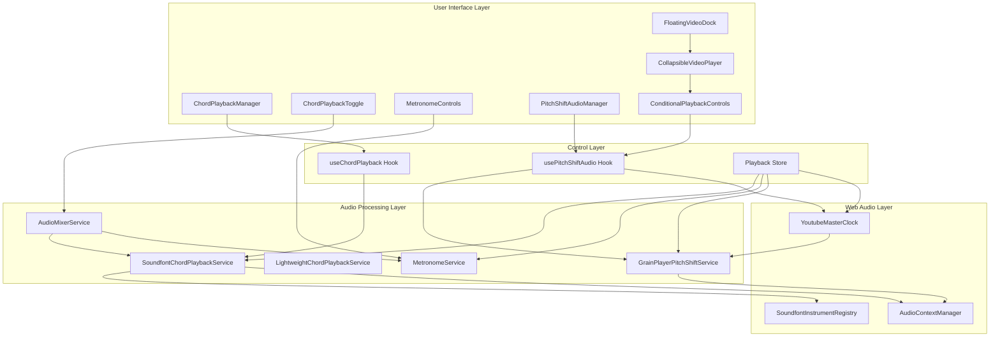
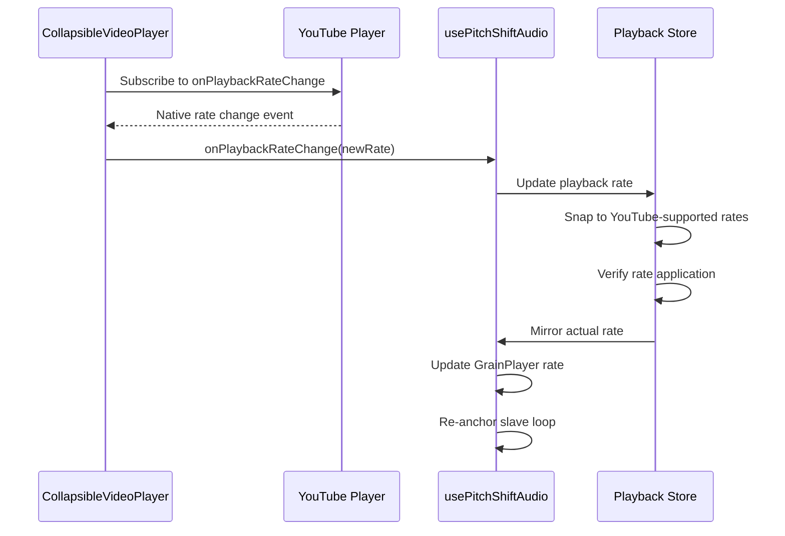
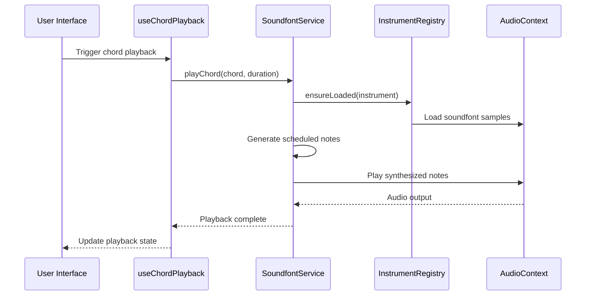
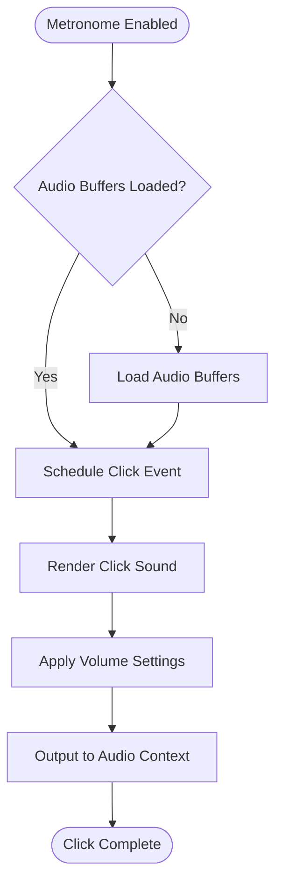
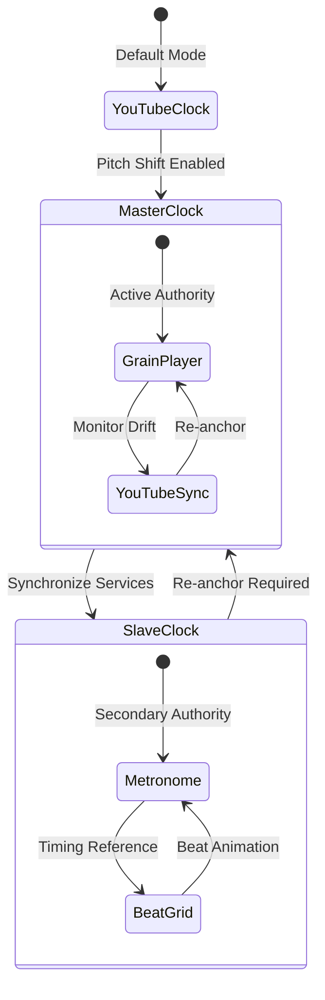
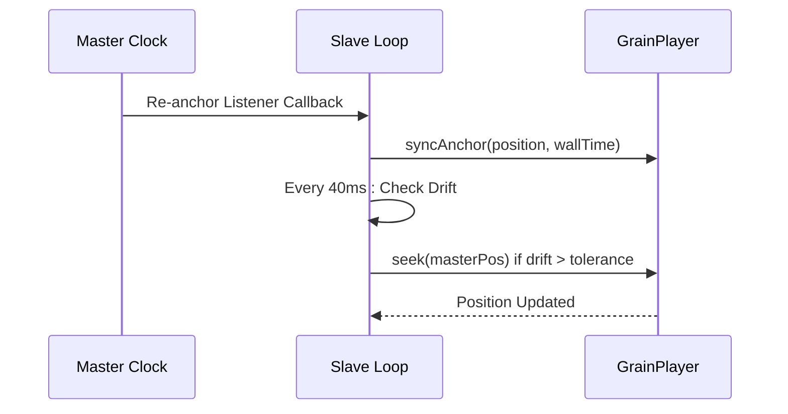
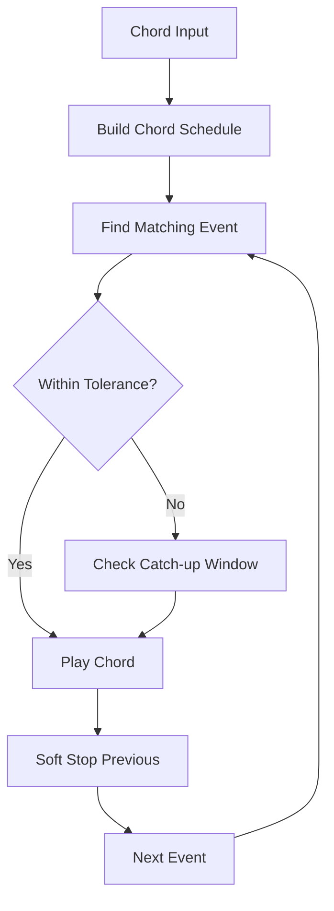
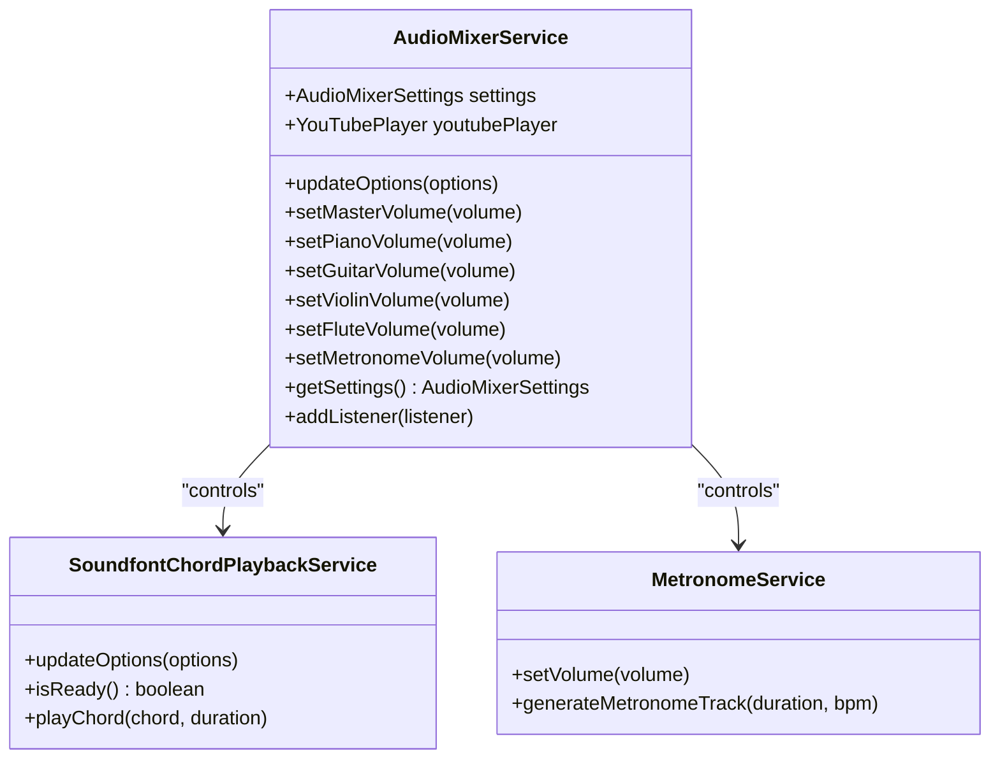

# Chord Playback Components

<cite>
**Referenced Files in This Document**
- [ChordPlaybackManager.tsx](file://src/components/chord-playback/ChordPlaybackManager.tsx)
- [ChordPlaybackToggle.tsx](file://src/components/chord-playback/ChordPlaybackToggle.tsx)
- [MetronomeControls.tsx](file://src/components/chord-playback/MetronomeControls.tsx)
- [PitchShiftAudioManager.tsx](file://src/components/chord-playback/PitchShiftAudioManager.tsx)
- [ConditionalPlaybackControls.tsx](file://src/components/chord-playback/ConditionalPlaybackControls.tsx)
- [useChordPlayback.ts](file://src/hooks/chord-playback/useChordPlayback.ts)
- [usePitchShiftAudio.ts](file://src/hooks/chord-playback/usePitchShiftAudio.ts)
- [soundfontChordPlaybackService.ts](file://src/services/chord-playback/soundfontChordPlaybackService.ts)
- [lightweightChordPlaybackService.ts](file://src/services/chord-playback/lightweightChordPlaybackService.ts)
- [metronomeService.ts](file://src/services/chord-playback/metronomeService.ts)
- [audioMixerService.ts](file://src/services/chord-playback/audioMixerService.ts)
- [audioContextManager.ts](file://src/services/audio/audioContextManager.ts)
- [chordToMidi.ts](file://src/utils/chordToMidi.ts)
- [instrumentNoteGeneration/index.ts](file://src/utils/instrumentNoteGeneration/index.ts)
- [audioDefaults.ts](file://src/config/audioDefaults.ts)
- [playbackStore.ts](file://src/stores/playbackStore.ts)
- [youtubeMasterClock.ts](file://src/services/audio/youtubeMasterClock.ts)
- [grainPlayerPitchShiftService.ts](file://src/services/audio/grainPlayerPitchShiftService.ts)
- [CollapsibleVideoPlayer.tsx](file://src/components/analysis/CollapsibleVideoPlayer.tsx)
- [FloatingVideoDock.tsx](file://src/components/analysis/FloatingVideoDock.tsx)
</cite>

## Update Summary
**Changes Made**
- Enhanced video player components with additional event handling capabilities for better pitch shift audio system integration
- Improved synchronization mechanisms with YouTube's native onPlaybackRateChange event support
- Added comprehensive playback rate change detection and propagation
- Updated conditional playback controls to ensure YouTube visual sync during pitch shift operations
- Strengthened master clock authority model with enhanced rate synchronization

## Table of Contents
1. [Introduction](#introduction)
2. [System Architecture](#system-architecture)
3. [Core Components](#core-components)
4. [Enhanced Video Player Integration](#enhanced-video-player-integration)
5. [Audio Playback Architecture](#audio-playback-architecture)
6. [Metronome Synchronization](#metronome-synchronization)
7. [Pitch Shift Implementation](#pitch-shift-implementation)
8. [Chord Progression Control](#chord-progression-control)
9. [Real-time Playback Features](#real-time-playback-features)
10. [Audio Mixing and Volume Control](#audio-mixing-and-volume-control)
11. [Technical Implementation Details](#technical-implementation-details)
12. [Performance Considerations](#performance-considerations)
13. [Troubleshooting Guide](#troubleshooting-guide)
14. [Conclusion](#conclusion)

## Introduction

The chord playback component system in ChordMiniApp provides a comprehensive solution for musical chord progression playback with advanced synchronization capabilities. This system integrates Web Audio API-based sound synthesis, real-time metronome synchronization, and sophisticated pitch-shifting functionality to deliver precise musical timing and high-quality audio reproduction.

The architecture centers around five primary components: ChordPlaybackManager for orchestration, ChordPlaybackToggle for user interface and volume control, MetronomeControls for rhythmic synchronization, PitchShiftAudioManager for pitch manipulation, and enhanced video player components for seamless YouTube integration. These components work together to provide seamless chord progression playback with professional-grade timing precision and audio quality.

## System Architecture

The chord playback system follows a layered architecture that separates concerns between user interface, audio processing, and timing synchronization:

**Diagram sources**
- [ChordPlaybackManager.tsx:1-123](file://src/components/chord-playback/ChordPlaybackManager.tsx#L1-L123)
- [ChordPlaybackToggle.tsx:1-694](file://src/components/chord-playback/ChordPlaybackToggle.tsx#L1-L694)
- [MetronomeControls.tsx:1-138](file://src/components/chord-playback/MetronomeControls.tsx#L1-L138)
- [PitchShiftAudioManager.tsx:1-39](file://src/components/chord-playback/PitchShiftAudioManager.tsx#L1-L39)
- [ConditionalPlaybackControls.tsx:1-113](file://src/components/chord-playback/ConditionalPlaybackControls.tsx#L1-L113)
- [CollapsibleVideoPlayer.tsx:1-403](file://src/components/analysis/CollapsibleVideoPlayer.tsx#L1-L403)
- [FloatingVideoDock.tsx:1-386](file://src/components/analysis/FloatingVideoDock.tsx#L1-L386)

## Core Components

### ChordPlaybackManager

The ChordPlaybackManager serves as the central orchestrator for chord progression playback. It manages pitch transposition, coordinates with the chord playback hook, and maintains stable state references to prevent unnecessary re-renders.

Key responsibilities include:
- Transposing chord data based on pitch shift settings
- Managing the chord playback lifecycle
- Providing stable state objects to parent components
- Coordinating with timing and synchronization systems

### ChordPlaybackToggle

This component provides the user interface for controlling chord playback with comprehensive volume adjustment capabilities. It integrates with the audio mixer service to provide real-time volume control for multiple instruments and audio sources.

Features include:
- Individual instrument volume controls (piano, guitar, violin, flute, bass)
- Master volume and chord playback volume controls
- Real-time audio testing capabilities
- Integration with YouTube player volume control
- Persistent volume settings across sessions

### MetronomeControls

The metronome component offers precise rhythmic synchronization with multiple sound style options and track modes. It provides both traditional metronome clicks and drum track alternatives for different musical contexts.

### PitchShiftAudioManager

This component manages the initialization and lifecycle of pitch-shifted audio playback. It coordinates between YouTube video synchronization and internal audio processing to maintain precise timing alignment.

### ConditionalPlaybackControls

**New** This component provides enhanced playback controls that ensure YouTube visual synchronization during pitch shift operations. It guarantees that YouTube playback continues even when pitch shift audio is active, maintaining visual timeline consistency.

Key features:
- Always controls YouTube playback for visual sync during pitch shift
- Handles both YouTube and pitch shift audio seeking independently
- Manages playback rate synchronization across both audio sources
- Provides fallback mechanisms for enhanced reliability

**Section sources**
- [ChordPlaybackManager.tsx:1-123](file://src/components/chord-playback/ChordPlaybackManager.tsx#L1-L123)
- [ChordPlaybackToggle.tsx:1-694](file://src/components/chord-playback/ChordPlaybackToggle.tsx#L1-L694)
- [MetronomeControls.tsx:1-138](file://src/components/chord-playback/MetronomeControls.tsx#L1-L138)
- [PitchShiftAudioManager.tsx:1-39](file://src/components/chord-playback/PitchShiftAudioManager.tsx#L1-L39)
- [ConditionalPlaybackControls.tsx:1-113](file://src/components/chord-playback/ConditionalPlaybackControls.tsx#L1-L113)

## Enhanced Video Player Integration

**Updated** The video player components have been significantly enhanced with additional event handling capabilities for better integration with the pitch shift audio system.

### CollapsibleVideoPlayer Enhancements

The CollapsibleVideoPlayer now includes comprehensive event handling for YouTube's native playback rate changes:

**Diagram sources**
- [CollapsibleVideoPlayer.tsx:170-186](file://src/components/analysis/CollapsibleVideoPlayer.tsx#L170-L186)
- [usePitchShiftAudio.ts:707-732](file://src/hooks/chord-playback/usePitchShiftAudio.ts#L707-L732)
- [playbackStore.ts:201-351](file://src/stores/playbackStore.ts#L201-L351)

### FloatingVideoDock Integration

The FloatingVideoDock coordinates multiple video player components with enhanced synchronization:

- **Responsive Design**: Adapts to different screen sizes with mobile collapse functionality
- **Event Propagation**: Forwards YouTube events to the pitch shift audio system
- **State Management**: Coordinates playback state across all video components
- **Rate Synchronization**: Ensures consistent playback rates across YouTube and pitch shift audio

### Playback Rate Change Detection

**New** The system now includes sophisticated playback rate change detection:

- **YouTube Native Events**: Listens for onPlaybackRateChange events from YouTube's iframe
- **Rate Clamping**: Automatically snaps requested rates to YouTube-supported values
- **Cross-Platform Synchronization**: Ensures all audio surfaces maintain consistent rates
- **Verification Mechanisms**: Confirms rate changes were applied correctly

**Section sources**
- [CollapsibleVideoPlayer.tsx:67-97](file://src/components/analysis/CollapsibleVideoPlayer.tsx#L67-L97)
- [CollapsibleVideoPlayer.tsx:170-186](file://src/components/analysis/CollapsibleVideoPlayer.tsx#L170-L186)
- [FloatingVideoDock.tsx:358-378](file://src/components/analysis/FloatingVideoDock.tsx#L358-L378)
- [usePitchShiftAudio.ts:707-732](file://src/hooks/chord-playback/usePitchShiftAudio.ts#L707-L732)
- [playbackStore.ts:201-351](file://src/stores/playbackStore.ts#L201-L351)

## Audio Playback Architecture

The audio playback system utilizes a dual-service architecture supporting both high-quality soundfonts and lightweight synthetic audio generation.

### Soundfont-Based Playback

The SoundfontChordPlaybackService provides professional-grade instrument sounds using the Web Audio API:

**Diagram sources**
- [soundfontChordPlaybackService.ts:192-239](file://src/services/chord-playback/soundfontChordPlaybackService.ts#L192-L239)
- [instrumentNoteGeneration/index.ts:17](file://src/utils/instrumentNoteGeneration/index.ts#L17)

### Lightweight Synthetic Audio

For performance-critical scenarios, the LightweightChordPlaybackService generates chord sounds using Web Audio API oscillators without external dependencies.

**Section sources**
- [soundfontChordPlaybackService.ts:64-716](file://src/services/chord-playback/soundfontChordPlaybackService.ts#L64-L716)
- [lightweightChordPlaybackService.ts:148-440](file://src/services/chord-playback/lightweightChordPlaybackService.ts#L148-L440)

## Metronome Synchronization

The metronome system provides precise rhythmic timing through multiple synchronization mechanisms:

### Click Generation Pipeline

**Diagram sources**
- [metronomeService.ts:98-129](file://src/services/chord-playback/metronomeService.ts#L98-L129)

### Track Modes and Sound Styles

The metronome supports two primary modes:
- **Traditional Mode**: Classic metronome click sounds with selectable sound styles
- **Drum Mode**: Full drum track with kick, snare, and hi-hat patterns

Sound styles include traditional, digital, wood, bell, and librosa-based options with customizable click durations.

**Section sources**
- [metronomeService.ts:34-499](file://src/services/chord-playback/metronomeService.ts#L34-L499)

## Pitch Shift Implementation

The pitch shift system provides seamless key transposition with advanced synchronization mechanisms:

### Clock Authority Model

**Updated** The system establishes a master clock authority hierarchy that has been refined to use a more robust slave re-anchor mechanism:

**Diagram sources**
- [usePitchShiftAudio.ts:23-32](file://src/hooks/chord-playback/usePitchShiftAudio.ts#L23-L32)

### Master Clock Authority Hierarchy

The system implements a unified clock authority model where YouTube iframe serves as the permanent master of position and rate:

- **YouTube iframe**: Permanent master of {position, rate}
- **Master Clock**: Smoothly extrapolated position derived from last YouTube sample plus `performance.now()` × rate
- **GrainPlayer**: Pure slave that produces audio but does not advance any counter on its own
- **Beat Grid**: Reads rawTime from the master clock authority

### Slave Re-Anchor Loop

**New** The old drift-correction loop has been replaced by a sophisticated 40ms slave re-anchor mechanism:

**Diagram sources**
- [usePitchShiftAudio.ts:568-670](file://src/hooks/chord-playback/usePitchShiftAudio.ts#L568-L670)

### Enhanced Synchronization Mechanisms

The pitch shift implementation includes several critical synchronization features:

- **Master Clock Authority**: When pitch shift is active, the GrainPlayer becomes the master clock
- **40ms Slave Re-Anchor Loop**: Dense re-synchronization loop that runs every 40ms while pitch shift is active
- **Rate-Scaled Tolerance**: Drift threshold scales with rate: `0.08 * max(rate, 1)`
- **Absolute Floor Protection**: Minimum 40ms interval to prevent audible "ticks" from re-seeks
- **Seek Safety**: Respects the seek fence (R2) to prevent smeared user seeks across multiple re-anchors
- **Self-Healing**: Automatically recovers when master is playing but grain is not
- **YouTube Event Integration**: Seamless integration with YouTube's native event system

**Section sources**
- [usePitchShiftAudio.ts:568-670](file://src/hooks/chord-playback/usePitchShiftAudio.ts#L568-L670)
- [youtubeMasterClock.ts:17-28](file://src/services/audio/youtubeMasterClock.ts#L17-L28)
- [grainPlayerPitchShiftService.ts:634-654](file://src/services/audio/grainPlayerPitchShiftService.ts#L634-L654)

## Chord Progression Control

The chord progression system provides sophisticated timing and synchronization capabilities:

### Foreground vs Background Mode

The system operates in two modes depending on browser tab visibility:

**Foreground Mode (Active Tab)**:
- Uses requestAnimationFrame for precise timing
- Direct beat index synchronization
- Real-time chord matching with tolerance windows

**Background Mode (Hidden Tab)**:
- Uses setInterval polling for reliability
- Reads audio element currentTime directly
- Maintains playback continuity despite timing suspension

### Timing Precision Features

**Diagram sources**
- [useChordPlayback.ts:152-197](file://src/hooks/chord-playback/useChordPlayback.ts#L152-L197)

### Dynamic Volume Control

The system incorporates real-time audio dynamics analysis to adjust chord velocities based on:
- Signal dynamics detected in the audio source
- Beat position and chord progression context
- Musical segmentation data for appropriate emphasis

**Section sources**
- [useChordPlayback.ts:242-665](file://src/hooks/chord-playback/useChordPlayback.ts#L242-L665)

## Real-time Playback Features

### Cross-platform Compatibility

The system provides seamless playback across different audio sources:

**YouTube Integration**:
- Full iframe API integration for video synchronization
- Volume control through YouTube's native API
- Playback rate synchronization with YouTube's supported rates
- Native event handling for enhanced reliability

**Local Audio Support**:
- HTML5 Audio element integration for uploaded files
- Direct volume control for local audio sources
- Independent playback rate control

### Advanced Synchronization

The system implements sophisticated synchronization mechanisms:

- **Seek Coordination**: Prevents timing conflicts during user-initiated seeks
- **Rate Synchronization**: Ensures consistent playback rates across all audio surfaces
- **Volume Balancing**: Maintains proper audio balance between different sources
- **Event Propagation**: Seamless forwarding of YouTube events to pitch shift system

**Section sources**
- [playbackStore.ts:172-351](file://src/stores/playbackStore.ts#L172-L351)

## Audio Mixing and Volume Control

### Centralized Audio Management

The AudioMixerService provides comprehensive volume control across all audio components:

**Diagram sources**
- [audioMixerService.ts:39-371](file://src/services/chord-playback/audioMixerService.ts#L39-L371)

### Volume Control Hierarchy

The audio mixing system implements a hierarchical volume control structure:

1. **Master Volume**: Overall application volume control
2. **Source Volume**: Separate control for YouTube, pitch-shifted audio, and chord playback
3. **Instrument Volume**: Individual control for each instrument (piano, guitar, violin, flute, bass)
4. **Metronome Volume**: Dedicated control for rhythmic synchronization

### Default Volume Configuration

The system uses carefully calibrated default volumes for optimal audio balance:

- **Master Volume**: 80% for balanced overall audio
- **YouTube Volume**: 70% for video accompaniment
- **Pitch-shifted Audio**: 20% to maintain video prominence
- **Chord Playback**: 70% for musical accompaniment
- **Individual Instruments**: 45-50% for balanced ensemble sound

**Section sources**
- [audioMixerService.ts:1-371](file://src/services/chord-playback/audioMixerService.ts#L1-L371)
- [audioDefaults.ts:1-73](file://src/config/audioDefaults.ts#L1-L73)

## Technical Implementation Details

### Web Audio API Integration

The system leverages the Web Audio API for high-performance audio processing:

**AudioContext Management**:
- Centralized AudioContext creation and management
- Automatic resume/suspend handling for autoplay policy compliance
- Cross-browser compatibility with Safari/Webkit fallbacks

**Sound Generation**:
- Soundfont-based synthesis for realistic instrument sounds
- Lightweight oscillator-based generation for performance scenarios
- Dynamic instrument loading and unloading for memory efficiency

### Chord Synthesis Engine

The chord synthesis system provides sophisticated musical note generation:

**Note Generation Pipeline**:
1. Chord name parsing and normalization
2. MIDI note conversion for accurate pitch representation
3. Instrument-specific note scheduling and timing
4. Dynamic velocity and envelope shaping
5. Realistic articulation and sustain modeling

### Timing Precision Mechanisms

**Updated** The system implements multiple layers of timing precision with the new slave re-anchor mechanism:

**Microsecond-Level Timing**:
- High-resolution timekeeping using AudioContext currentTime
- Sub-millisecond precision for chord transitions
- Real-time drift monitoring and correction via 40ms intervals

**Synchronization Guards**:
- Prevents timing conflicts between different audio sources
- Handles browser tab visibility changes gracefully
- Maintains audio continuity during playback interruptions

**New Slave Re-Anchor Loop**:
- 40ms interval monitoring with configurable tolerance thresholds
- Rate-scaled drift detection: `0.08 * max(rate, 1)`
- Absolute floor protection to prevent audible re-seek artifacts
- Self-healing mechanism for automatic recovery

**Enhanced Video Integration**:
- Comprehensive YouTube event handling for rate changes
- Seamless synchronization between video and audio playback
- Robust error handling for various YouTube player configurations

**Section sources**
- [usePitchShiftAudio.ts:568-670](file://src/hooks/chord-playback/usePitchShiftAudio.ts#L568-L670)
- [youtubeMasterClock.ts:84-92](file://src/services/audio/youtubeMasterClock.ts#L84-L92)
- [grainPlayerPitchShiftService.ts:634-654](file://src/services/audio/grainPlayerPitchShiftService.ts#L634-L654)

## Performance Considerations

### Memory Management

The system implements aggressive memory management for optimal performance:

**Instrument Unloading**:
- Automatic instrument unloading after 30-second idle periods
- Selective loading based on active instrument requirements
- Memory-efficient soundfont caching strategies

**Audio Resource Optimization**:
- Lazy loading of soundfont resources
- Dynamic resource allocation based on usage patterns
- Efficient cleanup of unused audio nodes and connections

### Computational Efficiency

**Background Processing**:
- Offloads heavy computations to background threads
- Minimizes main thread blocking during audio processing
- Optimized chord scheduling algorithms

**Resource Pooling**:
- Reusable audio nodes and connections
- Efficient buffer management for audio data
- Reduced garbage collection overhead

**Enhanced Video Player Performance**:
- Optimized rendering for mobile and desktop
- Efficient event handling with proper cleanup
- Memory-efficient video component architecture

## Troubleshooting Guide

### Common Issues and Solutions

**Audio Not Playing**:
- Check browser autoplay policy compliance
- Verify AudioContext state and resume procedures
- Ensure proper user interaction for audio initialization

**Timing Drift Issues**:
- Monitor drift correction loop effectiveness
- Verify pitch shift synchronization settings
- Check for conflicting audio source modifications

**Performance Problems**:
- Monitor instrument loading and unloading cycles
- Check for excessive audio node creation
- Verify memory usage patterns and cleanup

**Video Synchronization Issues**:
- Verify YouTube event handling is properly configured
- Check playback rate synchronization across platforms
- Ensure conditional playback controls are functioning correctly

### Debugging Tools

The system includes comprehensive debugging capabilities:

**Diagnostic Logging**:
- Detailed timing synchronization logs
- Audio processing pipeline diagnostics
- Performance monitoring and profiling tools

**State Inspection**:
- Real-time audio context state monitoring
- Component state debugging tools
- Audio resource usage tracking

**Enhanced Video Debugging**:
- YouTube event flow monitoring
- Rate change detection verification
- Playback state synchronization tracking

**Section sources**
- [usePitchShiftAudio.ts:78-83](file://src/hooks/chord-playback/usePitchShiftAudio.ts#L78-L83)

## Conclusion

The chord playback component system represents a sophisticated integration of Web Audio API technologies, real-time synchronization mechanisms, and user-friendly interface design. The system successfully balances audio quality, timing precision, and computational efficiency while providing extensive customization capabilities.

Key achievements include:
- Seamless integration of multiple audio sources with precise synchronization
- Advanced pitch-shifting capabilities with comprehensive timing control
- Professional-grade audio synthesis using soundfont technology
- Robust error handling and performance optimization
- Extensive user control over audio parameters and playback behavior
- Enhanced video player integration with comprehensive event handling
- Improved YouTube synchronization with native event support

The modular architecture ensures maintainability and extensibility, while the comprehensive feature set provides professional-grade functionality for musical chord progression playback applications.

**Updated** The recent implementation of the master clock authority model and slave re-anchor loop represents a significant advancement in timing precision and synchronization reliability. The new 40ms re-anchor mechanism with rate-scaled tolerance provides superior drift correction compared to the previous approach, ensuring professional-grade timing accuracy across all playback scenarios.

The enhanced video player components with additional event handling capabilities represent a major improvement in system integration. The comprehensive YouTube event handling, rate change detection, and conditional playback controls ensure seamless synchronization between video and audio playback, providing users with a professional-grade musical learning experience.