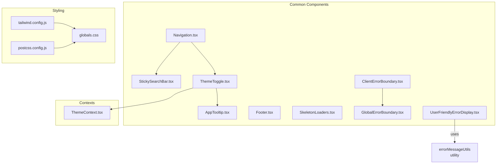
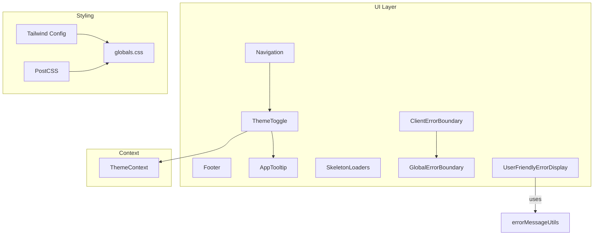
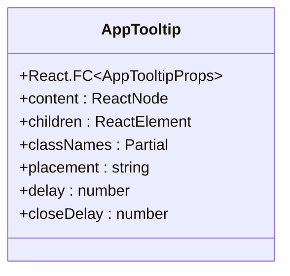
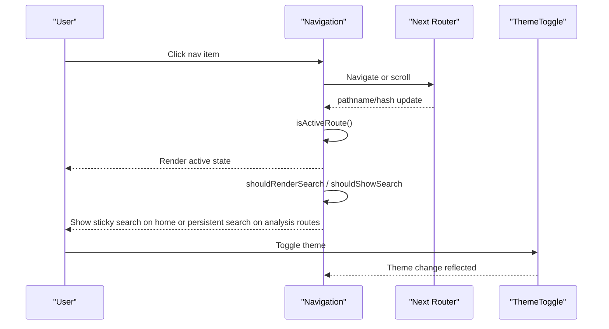
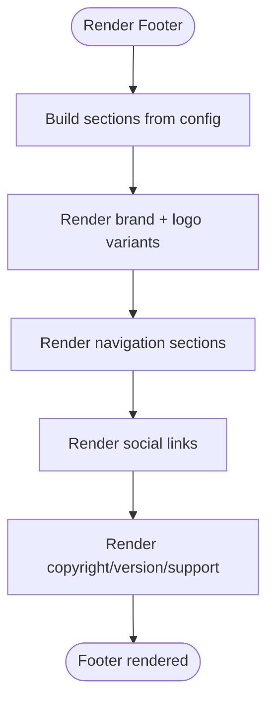
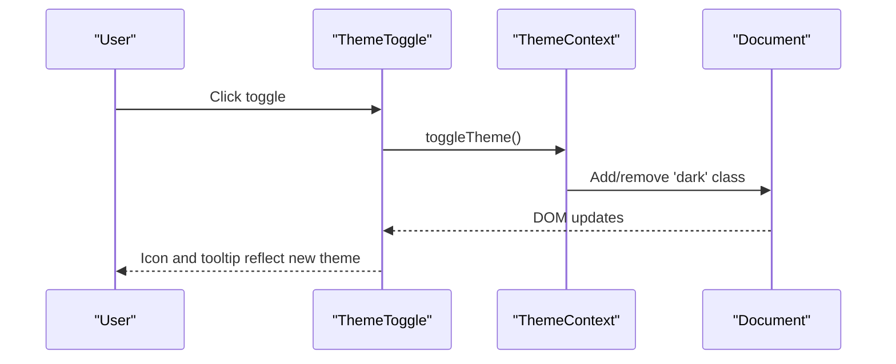
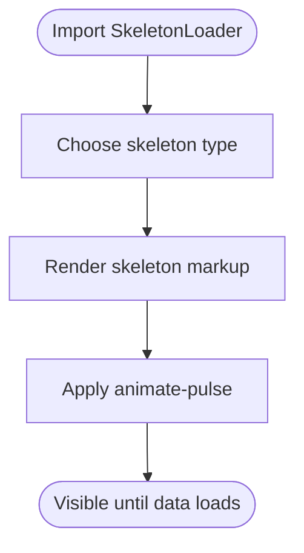
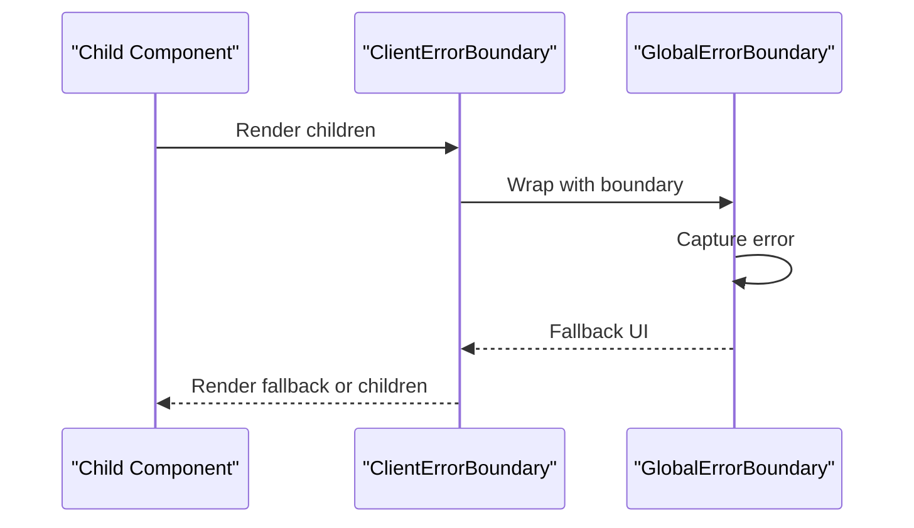
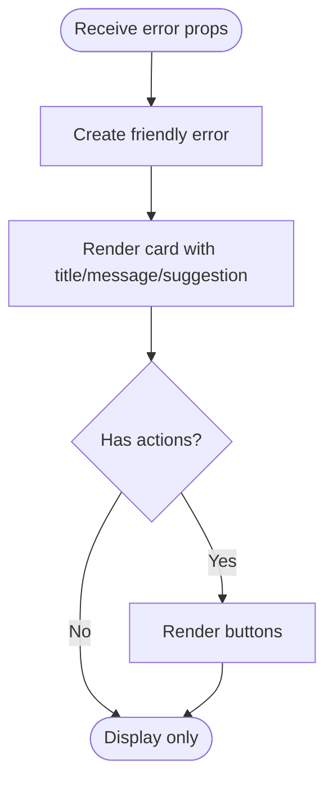
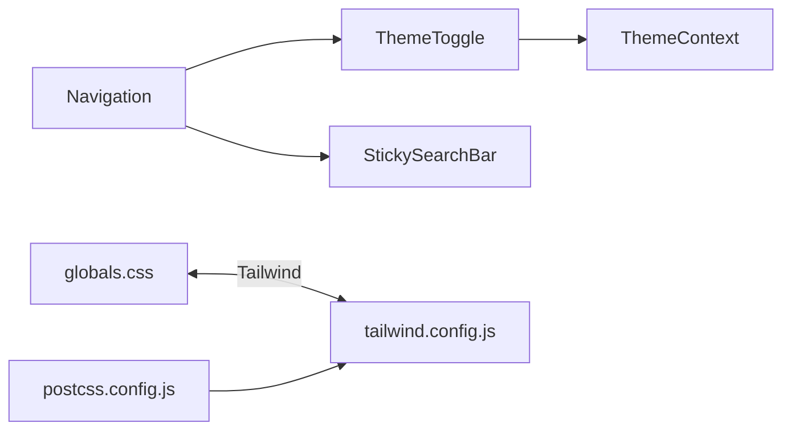

# Common Components

<cite>
**Referenced Files in This Document**
- [AppTooltip.tsx](file://src/components/common/AppTooltip.tsx)
- [Navigation.tsx](file://src/components/common/Navigation.tsx)
- [StickySearchBar.tsx](file://src/components/common/StickySearchBar.tsx)
- [Footer.tsx](file://src/components/common/Footer.tsx)
- [ThemeToggle.tsx](file://src/components/common/ThemeToggle.tsx)
- [SkeletonLoaders.tsx](file://src/components/common/SkeletonLoaders.tsx)
- [ClientErrorBoundary.tsx](file://src/components/common/ClientErrorBoundary.tsx)
- [GlobalErrorBoundary.tsx](file://src/components/common/GlobalErrorBoundary.tsx)
- [UserFriendlyErrorDisplay.tsx](file://src/components/common/UserFriendlyErrorDisplay.tsx)
- [ThemeContext.tsx](file://src/contexts/ThemeContext.tsx)
- [globals.css](file://src/app/globals.css)
- [tailwind.config.js](file://tailwind.config.js)
- [postcss.config.js](file://postcss.config.js)
</cite>

## Table of Contents
1. [Introduction](#introduction)
2. [Project Structure](#project-structure)
3. [Core Components](#core-components)
4. [Architecture Overview](#architecture-overview)
5. [Detailed Component Analysis](#detailed-component-analysis)
6. [Dependency Analysis](#dependency-analysis)
7. [Performance Considerations](#performance-considerations)
8. [Accessibility and Responsiveness](#accessibility-and-responsiveness)
9. [Integration Guidelines](#integration-guidelines)
10. [Troubleshooting Guide](#troubleshooting-guide)
11. [Conclusion](#conclusion)

## Introduction
This document describes the common component library used across the application. It focuses on reusable UI primitives that appear in multiple pages and layouts, including tooltips, navigation, footer, theme toggle, skeleton loaders, and error boundaries. It explains composition patterns, prop interfaces, styling approaches using Tailwind CSS and theme tokens, accessibility features, responsive design patterns, and integration guidelines. Examples of usage and customization options are provided to maintain consistency across the application.

## Project Structure
The common components live under the shared components directory and are consumed by pages and layouts. Styling is centralized via Tailwind CSS and global CSS, with theme tokens configured in the Tailwind configuration.

**Diagram sources**
- [AppTooltip.tsx:1-43](file://src/components/common/AppTooltip.tsx#L1-L43)
- [Navigation.tsx:1-297](file://src/components/common/Navigation.tsx#L1-L297)
- [StickySearchBar.tsx:1-182](file://src/components/common/StickySearchBar.tsx#L1-L182)
- [Footer.tsx:1-187](file://src/components/common/Footer.tsx#L1-L187)
- [ThemeToggle.tsx:1-95](file://src/components/common/ThemeToggle.tsx#L1-L95)
- [SkeletonLoaders.tsx:1-152](file://src/components/common/SkeletonLoaders.tsx#L1-L152)
- [ClientErrorBoundary.tsx:1-13](file://src/components/common/ClientErrorBoundary.tsx#L1-L13)
- [GlobalErrorBoundary.tsx:1-88](file://src/components/common/GlobalErrorBoundary.tsx#L1-L88)
- [UserFriendlyErrorDisplay.tsx:1-70](file://src/components/common/UserFriendlyErrorDisplay.tsx#L1-L70)
- [ThemeContext.tsx:1-71](file://src/contexts/ThemeContext.tsx#L1-L71)
- [tailwind.config.js:1-194](file://tailwind.config.js#L1-L194)
- [postcss.config.js:1-7](file://postcss.config.js#L1-L7)
- [globals.css:1-657](file://src/app/globals.css#L1-L657)

**Section sources**
- [AppTooltip.tsx:1-43](file://src/components/common/AppTooltip.tsx#L1-L43)
- [Navigation.tsx:1-297](file://src/components/common/Navigation.tsx#L1-L297)
- [StickySearchBar.tsx:1-182](file://src/components/common/StickySearchBar.tsx#L1-L182)
- [Footer.tsx:1-187](file://src/components/common/Footer.tsx#L1-L187)
- [ThemeToggle.tsx:1-95](file://src/components/common/ThemeToggle.tsx#L1-L95)
- [SkeletonLoaders.tsx:1-152](file://src/components/common/SkeletonLoaders.tsx#L1-L152)
- [ClientErrorBoundary.tsx:1-13](file://src/components/common/ClientErrorBoundary.tsx#L1-L13)
- [GlobalErrorBoundary.tsx:1-88](file://src/components/common/GlobalErrorBoundary.tsx#L1-L88)
- [UserFriendlyErrorDisplay.tsx:1-70](file://src/components/common/UserFriendlyErrorDisplay.tsx#L1-L70)
- [ThemeContext.tsx:1-71](file://src/contexts/ThemeContext.tsx#L1-L71)
- [tailwind.config.js:1-194](file://tailwind.config.js#L1-L194)
- [postcss.config.js:1-7](file://postcss.config.js#L1-L7)
- [globals.css:1-657](file://src/app/globals.css#L1-L657)

## Core Components
- AppTooltip: A thin wrapper around a UI library tooltip with default dark/light theme-aware styling and optional test-mode bypass.
- Navigation: Sticky header with responsive behavior, mobile menu, logo variants per theme, active-route highlighting, and route-aware search visibility.
- StickySearchBar: Shared YouTube search control used in the navbar. It syncs with the homepage search state, can optionally hide its upload shortcut, and uses the same inactive gray color treatment as the analysis utility bar buttons.
- Footer: Multi-column footer with brand, navigation sections, social links, and metadata.
- ThemeToggle: Interactive theme switcher using a shared theme context and tooltip.
- SkeletonLoaders: Multiple skeleton variants for audio player, analysis controls, chord grid, lyrics, chatbot, and processing status.
- Error Boundaries: Client wrapper and a class-based global error boundary with a friendly fallback UI.
- UserFriendlyErrorDisplay: Presentational card that renders a user-friendly error with optional actions.

**Section sources**
- [AppTooltip.tsx:1-43](file://src/components/common/AppTooltip.tsx#L1-L43)
- [Navigation.tsx:1-297](file://src/components/common/Navigation.tsx#L1-L297)
- [StickySearchBar.tsx:1-182](file://src/components/common/StickySearchBar.tsx#L1-L182)
- [Footer.tsx:1-187](file://src/components/common/Footer.tsx#L1-L187)
- [ThemeToggle.tsx:1-95](file://src/components/common/ThemeToggle.tsx#L1-L95)
- [SkeletonLoaders.tsx:1-152](file://src/components/common/SkeletonLoaders.tsx#L1-L152)
- [ClientErrorBoundary.tsx:1-13](file://src/components/common/ClientErrorBoundary.tsx#L1-L13)
- [GlobalErrorBoundary.tsx:1-88](file://src/components/common/GlobalErrorBoundary.tsx#L1-L88)
- [UserFriendlyErrorDisplay.tsx:1-70](file://src/components/common/UserFriendlyErrorDisplay.tsx#L1-L70)

## Architecture Overview
The common components rely on:
- Shared theming via a context provider that reads and writes the dark class on the document element.
- UI primitives from a component library for navigation and interactive elements.
- Tailwind CSS for responsive and theme-aware styling, with custom tokens and animations.
- Global CSS for base styles, animations, and device-specific optimizations.

**Diagram sources**
- [Navigation.tsx:1-297](file://src/components/common/Navigation.tsx#L1-L297)
- [ThemeToggle.tsx:1-95](file://src/components/common/ThemeToggle.tsx#L1-L95)
- [Footer.tsx:1-187](file://src/components/common/Footer.tsx#L1-L187)
- [AppTooltip.tsx:1-43](file://src/components/common/AppTooltip.tsx#L1-L43)
- [SkeletonLoaders.tsx:1-152](file://src/components/common/SkeletonLoaders.tsx#L1-L152)
- [ClientErrorBoundary.tsx:1-13](file://src/components/common/ClientErrorBoundary.tsx#L1-L13)
- [GlobalErrorBoundary.tsx:1-88](file://src/components/common/GlobalErrorBoundary.tsx#L1-L88)
- [UserFriendlyErrorDisplay.tsx:1-70](file://src/components/common/UserFriendlyErrorDisplay.tsx#L1-L70)
- [ThemeContext.tsx:1-71](file://src/contexts/ThemeContext.tsx#L1-L71)
- [tailwind.config.js:1-194](file://tailwind.config.js#L1-L194)
- [postcss.config.js:1-7](file://postcss.config.js#L1-L7)
- [globals.css:1-657](file://src/app/globals.css#L1-L657)

## Detailed Component Analysis

### AppTooltip
- Purpose: Provide a consistent, theme-aware tooltip with sensible defaults and optional test-mode bypass.
- Composition pattern: Accepts children and content, merges default class names with overrides, forwards props to the underlying tooltip component.
- Props interface: Extends the underlying tooltip’s props, with content and children typed as React nodes and elements respectively.
- Styling approach: Uses Tailwind classes for base, content, and border/background colors, with dark mode variants.
- Accessibility: Inherits focus and keyboard behavior from the underlying tooltip component; content is passed as ReactNode to support rich tooltips.
- Customization: Pass classNames to override defaults; placement and delays are configurable.

**Diagram sources**
- [AppTooltip.tsx:6-41](file://src/components/common/AppTooltip.tsx#L6-L41)

**Section sources**
- [AppTooltip.tsx:1-43](file://src/components/common/AppTooltip.tsx#L1-L43)

### Navigation
- Purpose: Sticky header with responsive behavior, active route highlighting, mobile menu, and route-aware search access.
- Composition pattern: Uses a UI library navbar, integrates ThemeToggle and StickySearchBar, computes active state from Next.js path and hash, and derives `isAnalyzeRoute`, `shouldRenderSearch`, and `shouldShowSearch` from the current route.
- Props interface: Optional className, showStickySearch flag, and overlay flag.
- Styling approach: Tailwind classes for backdrop blur, borders, and theme-aware backgrounds; responsive variants for desktop and mobile. The navbar search input inherits the analysis utility bar inactive button palette (`bg-gray-200/60`, `dark:bg-gray-600/60`, `text-gray-800`, `dark:text-gray-100`) for visual consistency.
- Accessibility: Uses semantic navigation elements and proper focus management; mobile menu toggles body scroll and click-outside behavior.
- Search behavior: On the homepage, the search appears only when the hero search has scrolled out of view via `showStickySearch`. On `/analyze` and nested analysis routes, the search is always visible. The upload shortcut inside StickySearchBar is hidden on analysis routes by passing `showUpload={false}`.
- Customization: Add/remove navigation items via the configuration array; adjust active state and route-aware search logic as needed.

**Diagram sources**
- [Navigation.tsx:24-31](file://src/components/common/Navigation.tsx#L24-L31)
- [Navigation.tsx:92-118](file://src/components/common/Navigation.tsx#L92-L118)
- [Navigation.tsx:185-195](file://src/components/common/Navigation.tsx#L185-L195)
- [Navigation.tsx:240-250](file://src/components/common/Navigation.tsx#L240-L250)
- [StickySearchBar.tsx:9-18](file://src/components/common/StickySearchBar.tsx#L9-L18)
- [StickySearchBar.tsx:67-102](file://src/components/common/StickySearchBar.tsx#L67-L102)
- [ThemeToggle.tsx:1-95](file://src/components/common/ThemeToggle.tsx#L1-L95)

**Section sources**
- [Navigation.tsx:1-297](file://src/components/common/Navigation.tsx#L1-L297)
- [StickySearchBar.tsx:1-182](file://src/components/common/StickySearchBar.tsx#L1-L182)

### Footer
- Purpose: Multi-column footer with brand, sections, social links, and metadata.
- Composition pattern: Renders sections from a configuration object; handles external/internal links.
- Styling approach: Tailwind grid layout with responsive breakpoints; theme-aware backgrounds and gradients.
- Accessibility: Uses aria-labels for icons and semantic anchor tags; external links include appropriate attributes.
- Customization: Extend the sections object to add new categories; update social links as needed.

**Diagram sources**
- [Footer.tsx:12-182](file://src/components/common/Footer.tsx#L12-L182)

**Section sources**
- [Footer.tsx:1-187](file://src/components/common/Footer.tsx#L1-L187)

### ThemeToggle
- Purpose: Toggle between light and dark modes with a tooltip and hydration-safe initial state.
- Composition pattern: Reads theme from ThemeContext; conditionally renders a neutral icon during SSR; switches icons based on current theme.
- Props interface: None; relies on context.
- Styling approach: Tailwind classes for focus rings and hover states; uses theme-aware colors.
- Accessibility: Proper aria-labels and keyboard focus; tooltip provides context.
- Customization: Adjust icons or tooltip content by modifying the component internals.

**Diagram sources**
- [ThemeToggle.tsx:7-92](file://src/components/common/ThemeToggle.tsx#L7-L92)
- [ThemeContext.tsx:54-63](file://src/contexts/ThemeContext.tsx#L54-L63)

**Section sources**
- [ThemeToggle.tsx:1-95](file://src/components/common/ThemeToggle.tsx#L1-L95)
- [ThemeContext.tsx:1-71](file://src/contexts/ThemeContext.tsx#L1-L71)

### SkeletonLoaders
- Purpose: Provide realistic skeleton placeholders for various UI areas to improve perceived performance.
- Composition pattern: Stateless components returning Tailwind-styled divs with animated pulse effects.
- Props interface: None; returns a fixed skeleton layout.
- Styling approach: Tailwind classes for backgrounds, borders, and animation; dark mode variants included.
- Customization: Override container classes via parent wrappers; adjust grid sizes or shapes as needed.

**Diagram sources**
- [SkeletonLoaders.tsx:10-151](file://src/components/common/SkeletonLoaders.tsx#L10-L151)

**Section sources**
- [SkeletonLoaders.tsx:1-152](file://src/components/common/SkeletonLoaders.tsx#L1-L152)

### Error Boundaries
- Purpose: Gracefully handle runtime errors in subtrees and present a friendly fallback.
- Composition pattern: ClientErrorBoundary wraps GlobalErrorBoundary to satisfy client component constraints; GlobalErrorBoundary catches errors and logs them.
- Props interface: children and optional fallback node.
- Styling approach: Tailwind classes for borders, backgrounds, and typography in the fallback UI.
- Customization: Provide a custom fallback node to override the default UI.

**Diagram sources**
- [ClientErrorBoundary.tsx:10-12](file://src/components/common/ClientErrorBoundary.tsx#L10-L12)
- [GlobalErrorBoundary.tsx:29-84](file://src/components/common/GlobalErrorBoundary.tsx#L29-L84)

**Section sources**
- [ClientErrorBoundary.tsx:1-13](file://src/components/common/ClientErrorBoundary.tsx#L1-L13)
- [GlobalErrorBoundary.tsx:1-88](file://src/components/common/GlobalErrorBoundary.tsx#L1-L88)

### UserFriendlyErrorDisplay
- Purpose: Present a user-friendly error message with suggestions and action buttons.
- Composition pattern: Uses a utility to create a friendly error object and renders a styled card with optional actions.
- Props interface: error string, optional suggestion, optional callbacks for retry and alternate video, optional className.
- Styling approach: Tailwind classes for card, body, typography, and button variants; theme-aware colors.
- Customization: Pass onRetry or onTryAnotherVideo handlers to enable actions; supply a custom className for layout adjustments.

**Diagram sources**
- [UserFriendlyErrorDisplay.tsx:15-66](file://src/components/common/UserFriendlyErrorDisplay.tsx#L15-L66)

**Section sources**
- [UserFriendlyErrorDisplay.tsx:1-70](file://src/components/common/UserFriendlyErrorDisplay.tsx#L1-L70)

## Dependency Analysis
- Theming: ThemeToggle depends on ThemeContext for theme state and toggle function; ThemeContext reads/writes the dark class on the document element and persists preferences in localStorage.
- Navigation: Depends on ThemeToggle and StickySearchBar; uses Next.js routing utilities for active state, scroll behavior, and route-aware search visibility.
- Styling: Tailwind configuration defines theme tokens and animations; PostCSS processes Tailwind directives; global CSS adds base styles and device-specific tweaks.

**Diagram sources**
- [ThemeToggle.tsx:7-92](file://src/components/common/ThemeToggle.tsx#L7-L92)
- [ThemeContext.tsx:54-63](file://src/contexts/ThemeContext.tsx#L54-L63)
- [Navigation.tsx:1-297](file://src/components/common/Navigation.tsx#L1-L297)
- [StickySearchBar.tsx:1-182](file://src/components/common/StickySearchBar.tsx#L1-L182)
- [AppTooltip.tsx:1-43](file://src/components/common/AppTooltip.tsx#L1-L43)
- [globals.css:1-657](file://src/app/globals.css#L1-L657)
- [tailwind.config.js:1-194](file://tailwind.config.js#L1-L194)
- [postcss.config.js:1-7](file://postcss.config.js#L1-L7)

**Section sources**
- [ThemeToggle.tsx:1-95](file://src/components/common/ThemeToggle.tsx#L1-L95)
- [ThemeContext.tsx:1-71](file://src/contexts/ThemeContext.tsx#L1-L71)
- [Navigation.tsx:1-297](file://src/components/common/Navigation.tsx#L1-L297)
- [AppTooltip.tsx:1-43](file://src/components/common/AppTooltip.tsx#L1-L43)
- [globals.css:1-657](file://src/app/globals.css#L1-L657)
- [tailwind.config.js:1-194](file://tailwind.config.js#L1-L194)
- [postcss.config.js:1-7](file://postcss.config.js#L1-L7)

## Performance Considerations
- Hydration safety: ThemeToggle avoids rendering theme-dependent icons during SSR and defers to a neutral icon until mounted.
- Navigation optimizations: Uses CSS-based theme switching for logos to avoid hydration mismatches; applies performance classes for smooth scrolling and backdrop blur; keeps analysis-page search available without remounting a separate analysis-only control.
- Skeletons: Provide immediate feedback and reduce perceived load time; use minimal DOM and efficient animations.
- Tailwind purging: Keep unused classes minimal to reduce bundle size; the Tailwind configuration includes a safelist for dynamic grid columns.

[No sources needed since this section provides general guidance]

## Accessibility and Responsiveness
- Accessibility:
  - ThemeToggle and buttons use aria-labels and focus rings for keyboard navigation.
  - Navigation uses semantic elements and manages focus and click-outside behavior for the mobile menu.
  - Footer links include rel and target attributes for external resources.
- Responsiveness:
  - Navigation adapts between desktop and mobile views. The search bar appears conditionally on the homepage and persistently on analysis routes; mobile search appears inside the open mobile menu when search is active for that route.
  - Global CSS includes media queries for mobile, tablet, and landscape orientations with performance optimizations.
  - Tailwind utilities provide responsive variants for spacing, typography, and layout.

**Section sources**
- [ThemeToggle.tsx:18-45](file://src/components/common/ThemeToggle.tsx#L18-L45)
- [Navigation.tsx:77-88](file://src/components/common/Navigation.tsx#L77-L88)
- [Footer.tsx:93-106](file://src/components/common/Footer.tsx#L93-L106)
- [globals.css:202-328](file://src/app/globals.css#L202-L328)

## Integration Guidelines
- Theming:
  - Wrap your app with the ThemeProvider to enable theme-aware components.
  - Use ThemeToggle within layouts to allow user-driven theme switching.
- Navigation:
  - Place Navigation at the top of pages or layouts; pass className to extend styling; configure showStickySearch for homepage hero-scroll behavior. Analysis routes derive persistent search visibility automatically and hide the upload shortcut in the navbar search.
- Footers:
  - Use Footer in main layouts; customize sections via the configuration object.
- Tooltips:
  - Wrap actionable elements with AppTooltip; provide concise content; leverage default dark/light styling.
- Skeletons:
  - Render skeletons while data is loading; choose the appropriate skeleton type for the area being loaded.
- Error Boundaries:
  - Wrap critical sections with ClientErrorBoundary; optionally provide a custom fallback node.
  - Use UserFriendlyErrorDisplay to present friendly error messages with suggested actions.

**Section sources**
- [ThemeContext.tsx:44-70](file://src/contexts/ThemeContext.tsx#L44-L70)
- [Navigation.tsx:23-297](file://src/components/common/Navigation.tsx#L23-L297)
- [Footer.tsx:10-187](file://src/components/common/Footer.tsx#L10-L187)
- [AppTooltip.tsx:16-41](file://src/components/common/AppTooltip.tsx#L16-L41)
- [SkeletonLoaders.tsx:10-151](file://src/components/common/SkeletonLoaders.tsx#L10-L151)
- [ClientErrorBoundary.tsx:10-12](file://src/components/common/ClientErrorBoundary.tsx#L10-L12)
- [UserFriendlyErrorDisplay.tsx:15-66](file://src/components/common/UserFriendlyErrorDisplay.tsx#L15-L66)

## Troubleshooting Guide
- Hydration mismatch with theme:
  - Ensure ThemeProvider is present at the root and ThemeToggle defers to a neutral icon until mounted.
- Navigation not highlighting active route:
  - Verify pathname and hash handling logic; confirm isActiveRoute conditions match your routes.
- Tooltip not rendering in tests:
  - AppTooltip bypasses the tooltip in test environments; expect children to render directly.
- Error boundary not catching errors:
  - Confirm ClientErrorBoundary wraps the component tree and that GlobalErrorBoundary is used within a client component.
- Footer external links:
  - Ensure external links include rel="noopener noreferrer" and target="_blank".

**Section sources**
- [ThemeContext.tsx:44-70](file://src/contexts/ThemeContext.tsx#L44-L70)
- [Navigation.tsx:92-118](file://src/components/common/Navigation.tsx#L92-L118)
- [AppTooltip.tsx:25-27](file://src/components/common/AppTooltip.tsx#L25-L27)
- [ClientErrorBoundary.tsx:10-12](file://src/components/common/ClientErrorBoundary.tsx#L10-L12)
- [GlobalErrorBoundary.tsx:38-47](file://src/components/common/GlobalErrorBoundary.tsx#L38-L47)
- [Footer.tsx:118-135](file://src/components/common/Footer.tsx#L118-L135)

## Conclusion
The common component library provides a cohesive set of UI primitives that are theme-aware, accessible, and responsive. By leveraging shared contexts, Tailwind CSS, and consistent composition patterns, teams can maintain visual and behavioral consistency across the application. Use the provided guidelines to integrate, customize, and troubleshoot components effectively.
