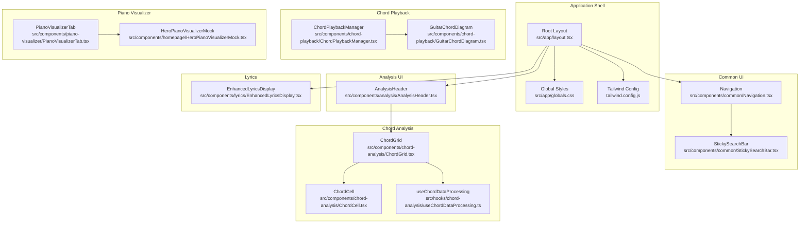
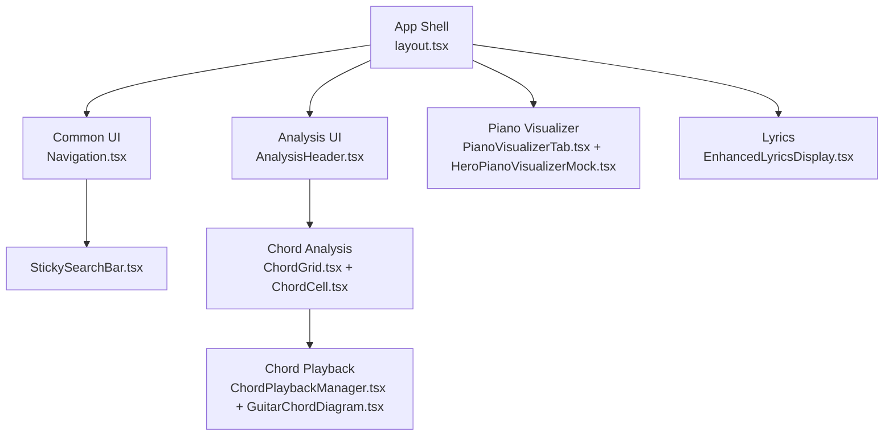
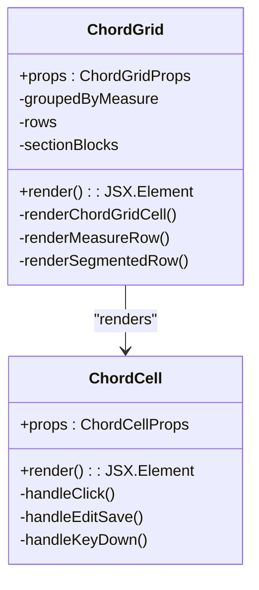
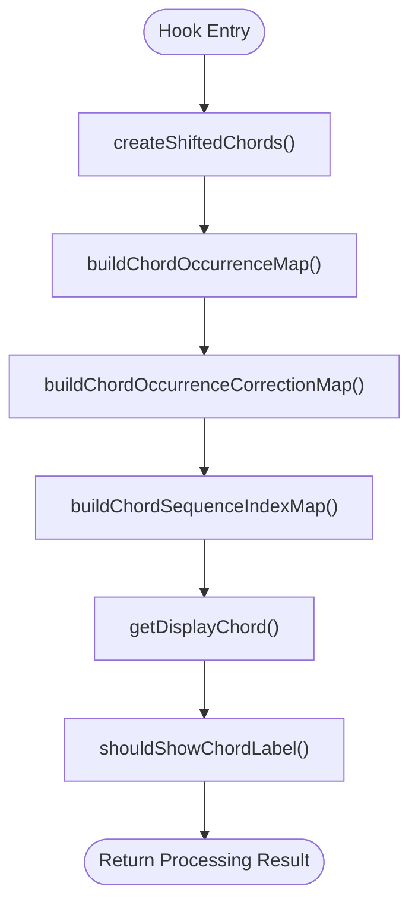
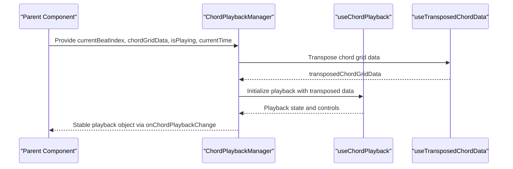
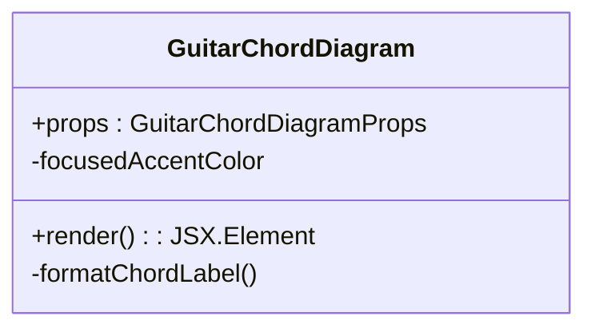
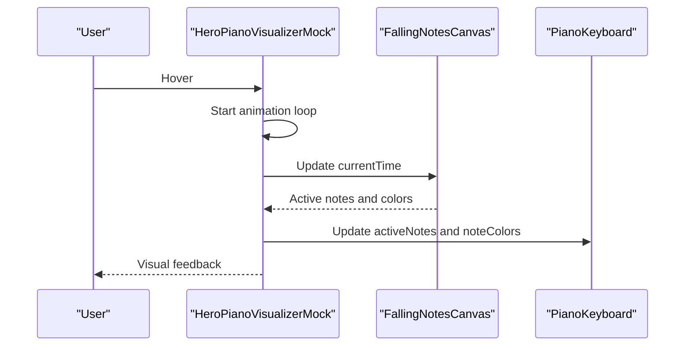
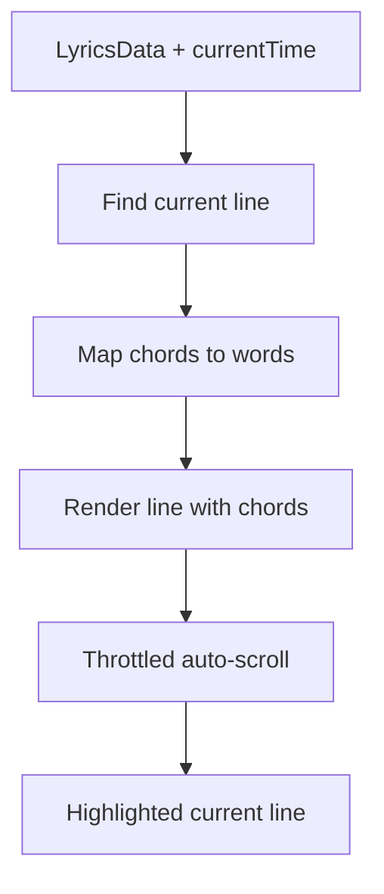
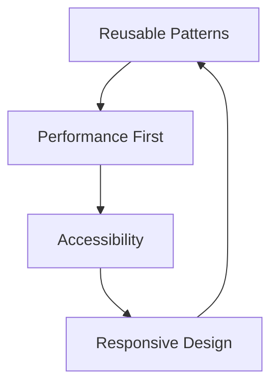
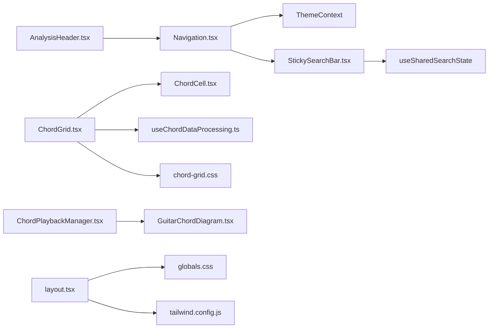

# Component Library and UI System

<cite>
**Referenced Files in This Document**
- [layout.tsx](file://src/app/layout.tsx)
- [globals.css](file://src/app/globals.css)
- [tailwind.config.js](file://tailwind.config.js)
- [chord-grid.css](file://src/styles/chord-grid.css)
- [Navigation.tsx](file://src/components/common/Navigation.tsx)
- [StickySearchBar.tsx](file://src/components/common/StickySearchBar.tsx)
- [AnalysisHeader.tsx](file://src/components/analysis/AnalysisHeader.tsx)
- [ChordGrid.tsx](file://src/components/chord-analysis/ChordGrid.tsx)
- [ChordCell.tsx](file://src/components/chord-analysis/ChordCell.tsx)
- [useChordDataProcessing.ts](file://src/hooks/chord-analysis/useChordDataProcessing.ts)
- [ChordPlaybackManager.tsx](file://src/components/chord-playback/ChordPlaybackManager.tsx)
- [GuitarChordDiagram.tsx](file://src/components/chord-playback/GuitarChordDiagram.tsx)
- [PianoVisualizerTab.tsx](file://src/components/piano-visualizer/PianoVisualizerTab.tsx)
- [HeroPianoVisualizerMock.tsx](file://src/components/homepage/HeroPianoVisualizerMock.tsx)
- [EnhancedLyricsDisplay.tsx](file://src/components/lyrics/EnhancedLyricsDisplay.tsx)
</cite>

## Table of Contents
1. [Introduction](#introduction)
2. [Project Structure](#project-structure)
3. [Core Components](#core-components)
4. [Architecture Overview](#architecture-overview)
5. [Detailed Component Analysis](#detailed-component-analysis)
6. [Dependency Analysis](#dependency-analysis)
7. [Performance Considerations](#performance-considerations)
8. [Troubleshooting Guide](#troubleshooting-guide)
9. [Conclusion](#conclusion)
10. [Appendices](#appendices)

## Introduction
This document describes the comprehensive component library and UI system of the ChordMiniApp. It covers the hierarchical organization of components, including common UI elements, music analysis interfaces, chord analysis components, piano visualizer, lyrics display, and chord playback systems. The documentation explains component composition patterns, prop interfaces, reusability principles, styling architecture using Tailwind CSS and CSS Modules, UI patterns for music analysis, interactive controls, responsive design, accessibility considerations, and cross-browser compatibility.

## Project Structure
The component library is organized by feature domains:
- Common UI: reusable elements like Navigation, Tooltips, Footers, and global loaders
- Analysis UI: headers, controls, timelines, and banners for the analysis workflow
- Chord Analysis: grid, cells, tabs, and displays for chord progression visualization
- Chord Playback: managers, diagrams, and audio controls
- Piano Visualizer: canvas-based visualizer and sheet music display
- Lyrics: synchronized lyrics with chord overlays
- Styling: global Tailwind utilities, theme-aware CSS, and performance-focused CSS modules

**Diagram sources**
- [layout.tsx:143-227](file://src/app/layout.tsx#L143-L227)
- [globals.css:1-657](file://src/app/globals.css#L1-L657)
- [tailwind.config.js:1-194](file://tailwind.config.js#L1-L194)
- [Navigation.tsx:1-297](file://src/components/common/Navigation.tsx#L1-L297)
- [StickySearchBar.tsx:1-182](file://src/components/common/StickySearchBar.tsx#L1-L182)
- [AnalysisHeader.tsx:1-201](file://src/components/analysis/AnalysisHeader.tsx#L1-L201)
- [ChordGrid.tsx:1-792](file://src/components/chord-analysis/ChordGrid.tsx#L1-L792)
- [ChordCell.tsx:1-357](file://src/components/chord-analysis/ChordCell.tsx#L1-L357)
- [useChordDataProcessing.ts:1-88](file://src/hooks/chord-analysis/useChordDataProcessing.ts#L1-L88)
- [ChordPlaybackManager.tsx:1-123](file://src/components/chord-playback/ChordPlaybackManager.tsx#L1-L123)
- [GuitarChordDiagram.tsx:1-364](file://src/components/chord-playback/GuitarChordDiagram.tsx#L1-L364)
- [PianoVisualizerTab.tsx:1-10](file://src/components/piano-visualizer/PianoVisualizerTab.tsx#L1-L10)
- [HeroPianoVisualizerMock.tsx:1-235](file://src/components/homepage/HeroPianoVisualizerMock.tsx#L1-L235)
- [EnhancedLyricsDisplay.tsx:1-231](file://src/components/lyrics/EnhancedLyricsDisplay.tsx#L1-L231)

**Section sources**
- [layout.tsx:143-227](file://src/app/layout.tsx#L143-L227)
- [globals.css:1-657](file://src/app/globals.css#L1-L657)
- [tailwind.config.js:1-194](file://tailwind.config.js#L1-L194)

## Core Components
This section outlines the primary component families and their roles:

- Common UI
  - Navigation: responsive navigation with theme toggle, route-aware sticky search, and mobile menu. Homepage search appears after the hero search scrolls away; analysis routes always show the navbar search and suppress the upload shortcut there.
  - StickySearchBar: shared search input with dropdown results, optional upload shortcut, and utility-bar-matched inactive gray colors.
  - Tooltips, Footers, Skeleton loaders, and error boundaries: consistent UX across pages

- Analysis UI
  - AnalysisHeader: editable title, enharmonic correction toggle, and lyrics transcription controls
  - Controls, timelines, and banners: orchestrate analysis workflows and user feedback

- Chord Analysis
  - ChordGrid: responsive grid with beat highlighting, segmentation colors, and Roman numerals
  - ChordCell: individual cells with memoization, edit mode, loop range, and modulation markers
  - Hooks: data processing, layout, and interaction logic

- Chord Playback
  - ChordPlaybackManager: manages playback state and transposed chord data
  - GuitarChordDiagram: renders chord diagrams with capo support and position selector

- Piano Visualizer
  - Canvas-based visualizer with animated falling notes and piano keyboard
  - Hero mockup for homepage previews

- Lyrics
  - EnhancedLyricsDisplay: synchronized lyrics with chord overlays and auto-scroll

**Section sources**
- [Navigation.tsx:1-297](file://src/components/common/Navigation.tsx#L1-L297)
- [StickySearchBar.tsx:1-182](file://src/components/common/StickySearchBar.tsx#L1-L182)
- [AnalysisHeader.tsx:1-201](file://src/components/analysis/AnalysisHeader.tsx#L1-L201)
- [ChordGrid.tsx:1-792](file://src/components/chord-analysis/ChordGrid.tsx#L1-L792)
- [ChordCell.tsx:1-357](file://src/components/chord-analysis/ChordCell.tsx#L1-L357)
- [useChordDataProcessing.ts:1-88](file://src/hooks/chord-analysis/useChordDataProcessing.ts#L1-L88)
- [ChordPlaybackManager.tsx:1-123](file://src/components/chord-playback/ChordPlaybackManager.tsx#L1-L123)
- [GuitarChordDiagram.tsx:1-364](file://src/components/chord-playback/GuitarChordDiagram.tsx#L1-L364)
- [PianoVisualizerTab.tsx:1-10](file://src/components/piano-visualizer/PianoVisualizerTab.tsx#L1-L10)
- [HeroPianoVisualizerMock.tsx:1-235](file://src/components/homepage/HeroPianoVisualizerMock.tsx#L1-L235)
- [EnhancedLyricsDisplay.tsx:1-231](file://src/components/lyrics/EnhancedLyricsDisplay.tsx#L1-L231)

## Architecture Overview
The UI system follows a layered architecture:
- Application shell sets up providers, performance optimizers, and global styles
- Feature-specific components compose common UI elements
- Hooks encapsulate domain logic (chord processing, layout, playback)
- Styling leverages Tailwind utilities and CSS Modules for performance and theme-awareness

**Diagram sources**
- [layout.tsx:143-227](file://src/app/layout.tsx#L143-L227)
- [Navigation.tsx:1-297](file://src/components/common/Navigation.tsx#L1-L297)
- [StickySearchBar.tsx:1-182](file://src/components/common/StickySearchBar.tsx#L1-L182)
- [AnalysisHeader.tsx:1-201](file://src/components/analysis/AnalysisHeader.tsx#L1-L201)
- [ChordGrid.tsx:1-792](file://src/components/chord-analysis/ChordGrid.tsx#L1-L792)
- [ChordCell.tsx:1-357](file://src/components/chord-analysis/ChordCell.tsx#L1-L357)
- [ChordPlaybackManager.tsx:1-123](file://src/components/chord-playback/ChordPlaybackManager.tsx#L1-L123)
- [GuitarChordDiagram.tsx:1-364](file://src/components/chord-playback/GuitarChordDiagram.tsx#L1-L364)
- [PianoVisualizerTab.tsx:1-10](file://src/components/piano-visualizer/PianoVisualizerTab.tsx#L1-L10)
- [HeroPianoVisualizerMock.tsx:1-235](file://src/components/homepage/HeroPianoVisualizerMock.tsx#L1-L235)
- [EnhancedLyricsDisplay.tsx:1-231](file://src/components/lyrics/EnhancedLyricsDisplay.tsx#L1-L231)

## Detailed Component Analysis

### ChordGrid and ChordCell
ChordGrid renders a responsive, segmented grid of chords with:
- Beat highlighting via CSS classes
- Segmentation coloring and modulation markers
- Edit mode for manual chord corrections
- Roman numeral overlay aligned to original chord sequence
- Performance optimizations: memoized props, cell caching, and CSS-based highlighting

**Diagram sources**
- [ChordGrid.tsx:178-792](file://src/components/chord-analysis/ChordGrid.tsx#L178-L792)
- [ChordCell.tsx:115-357](file://src/components/chord-analysis/ChordCell.tsx#L115-L357)

**Section sources**
- [ChordGrid.tsx:1-792](file://src/components/chord-analysis/ChordGrid.tsx#L1-L792)
- [ChordCell.tsx:1-357](file://src/components/chord-analysis/ChordCell.tsx#L1-L357)

### Chord Data Processing Hook
The hook centralizes chord transformations and corrections:
- Creates shifted chords aligned to time signature and padding
- Builds occurrence maps for correction resolution
- Computes display chords with enharmonic corrections
- Determines label visibility and sequence indices

**Diagram sources**
- [useChordDataProcessing.ts:25-88](file://src/hooks/chord-analysis/useChordDataProcessing.ts#L25-L88)

**Section sources**
- [useChordDataProcessing.ts:1-88](file://src/hooks/chord-analysis/useChordDataProcessing.ts#L1-L88)

### Chord Playback Manager
Manages playback state and transposed chord data:
- Applies pitch shift transposition to chord grid data
- Exposes playback controls and volume settings
- Ensures stable object references to prevent re-renders

**Diagram sources**
- [ChordPlaybackManager.tsx:55-123](file://src/components/chord-playback/ChordPlaybackManager.tsx#L55-L123)

**Section sources**
- [ChordPlaybackManager.tsx:1-123](file://src/components/chord-playback/ChordPlaybackManager.tsx#L1-L123)

### Guitar Chord Diagram
Renders interactive chord diagrams with:
- Capo support and position selector
- Focus highlighting with segmentation color
- Roman numeral overlay
- Responsive sizing and musical symbol formatting

**Diagram sources**
- [GuitarChordDiagram.tsx:99-364](file://src/components/chord-playback/GuitarChordDiagram.tsx#L99-L364)

**Section sources**
- [GuitarChordDiagram.tsx:1-364](file://src/components/chord-playback/GuitarChordDiagram.tsx#L1-L364)

### Piano Visualizer
Canvas-based visualizer with:
- Animated falling notes synchronized to tempo and time signature
- Interactive piano keyboard highlighting active notes
- Hero mockup for homepage previews with hover-triggered animation

**Diagram sources**
- [HeroPianoVisualizerMock.tsx:52-235](file://src/components/homepage/HeroPianoVisualizerMock.tsx#L52-L235)

**Section sources**
- [PianoVisualizerTab.tsx:1-10](file://src/components/piano-visualizer/PianoVisualizerTab.tsx#L1-L10)
- [HeroPianoVisualizerMock.tsx:1-235](file://src/components/homepage/HeroPianoVisualizerMock.tsx#L1-L235)

### Enhanced Lyrics Display
Synchronized lyrics with chord overlays:
- Auto-scrolls to current line with throttled smooth scroll
- Maps chords to words and positions them above the text
- Graceful fallbacks and error handling

**Diagram sources**
- [EnhancedLyricsDisplay.tsx:14-231](file://src/components/lyrics/EnhancedLyricsDisplay.tsx#L14-L231)

**Section sources**
- [EnhancedLyricsDisplay.tsx:1-231](file://src/components/lyrics/EnhancedLyricsDisplay.tsx#L1-L231)

### Conceptual Overview
The UI system emphasizes:
- Reusable patterns: common components, hooks, and utilities
- Performance-first design: memoization, CSS-based highlighting, and throttled updates
- Accessibility: keyboard navigation, ARIA labels, and focus management
- Responsive design: adaptive layouts, typography scaling, and mobile-first utilities

[No sources needed since this diagram shows conceptual workflow, not actual code structure]

[No sources needed since this section doesn't analyze specific files]

## Dependency Analysis
Component dependencies and relationships:
- ChordGrid depends on ChordCell, hooks, and theme context
- ChordPlaybackManager depends on chord playback hooks and transposed chord data
- Navigation integrates with theme and search components; it derives route-aware search visibility from `usePathname`.
- StickySearchBar shares search state with the homepage search, renders dropdown results, and uses the same inactive gray background/text palette as the analysis utility bar buttons.
- Global styles and Tailwind config define base styles and theme tokens

**Diagram sources**
- [Navigation.tsx:1-297](file://src/components/common/Navigation.tsx#L1-L297)
- [StickySearchBar.tsx:1-182](file://src/components/common/StickySearchBar.tsx#L1-L182)
- [AnalysisHeader.tsx:1-201](file://src/components/analysis/AnalysisHeader.tsx#L1-L201)
- [ChordGrid.tsx:1-792](file://src/components/chord-analysis/ChordGrid.tsx#L1-L792)
- [ChordCell.tsx:1-357](file://src/components/chord-analysis/ChordCell.tsx#L1-L357)
- [useChordDataProcessing.ts:1-88](file://src/hooks/chord-analysis/useChordDataProcessing.ts#L1-L88)
- [ChordPlaybackManager.tsx:1-123](file://src/components/chord-playback/ChordPlaybackManager.tsx#L1-L123)
- [GuitarChordDiagram.tsx:1-364](file://src/components/chord-playback/GuitarChordDiagram.tsx#L1-L364)
- [layout.tsx:143-227](file://src/app/layout.tsx#L143-L227)
- [globals.css:1-657](file://src/app/globals.css#L1-L657)
- [tailwind.config.js:1-194](file://tailwind.config.js#L1-L194)
- [chord-grid.css:1-92](file://src/styles/chord-grid.css#L1-L92)

**Section sources**
- [layout.tsx:143-227](file://src/app/layout.tsx#L143-L227)
- [globals.css:1-657](file://src/app/globals.css#L1-L657)
- [tailwind.config.js:1-194](file://tailwind.config.js#L1-L194)
- [chord-grid.css:1-92](file://src/styles/chord-grid.css#L1-L92)

## Performance Considerations
- Memoization and stable references: ChordGrid and ChordCell use custom comparison functions to minimize re-renders; ChordPlaybackManager creates a stable playback object to avoid infinite re-renders
- CSS-based beat highlighting: reduces React reconciliation overhead by updating a single data attribute and letting CSS handle styling
- Throttled auto-scroll: limits scroll frequency to prevent competing smooth-scroll calls
- Responsive sizing: dynamic font sizing and grid columns adapt to viewport and device orientation
- Hardware acceleration: transforms and will-change hints improve animation performance

[No sources needed since this section provides general guidance]

## Troubleshooting Guide
- Hydration mismatches: Navigation uses CSS-based theme switching for logos to prevent hydration issues
- Console noise suppression: Root layout injects a script to suppress noisy logs and errors
- Development overlays: CSS hides Next.js dev overlays and terminal elements to avoid interference
- Scrollbar styling: Cross-browser scrollbar styling with thin and webkit variants
- Dark mode SVG overrides: Guitar chord diagrams adjust inline SVG colors for crisp rendering in dark mode

**Section sources**
- [Navigation.tsx:29-31](file://src/components/common/Navigation.tsx#L29-L31)
- [layout.tsx:152-161](file://src/app/layout.tsx#L152-L161)
- [layout.tsx:65-109](file://src/app/layout.tsx#L65-L109)
- [globals.css:443-481](file://src/app/globals.css#L443-L481)
- [globals.css:598-657](file://src/app/globals.css#L598-L657)

## Conclusion
The ChordMiniApp component library demonstrates a cohesive, performance-conscious architecture:
- Clear separation of concerns across common UI, analysis, chord analysis, playback, visualizer, and lyrics
- Strong reuse patterns with hooks and memoization
- Tailwind-driven styling with theme-aware CSS Modules
- Responsive and accessible UI patterns
- Practical solutions for performance, cross-browser compatibility, and developer experience

[No sources needed since this section summarizes without analyzing specific files]

## Appendices

### Styling Architecture
- Global styles: base, components, and utilities via Tailwind; custom animations and theme tokens
- Tailwind configuration: theme extension, dark mode, safelist for dynamic grid columns, and Heroui integration
- CSS Modules: dedicated beat highlighting rules for ChordGrid with performance optimizations
- Dark mode overrides: SVG and component-specific adjustments for consistent appearance

**Section sources**
- [globals.css:1-657](file://src/app/globals.css#L1-L657)
- [tailwind.config.js:1-194](file://tailwind.config.js#L1-L194)
- [chord-grid.css:1-92](file://src/styles/chord-grid.css#L1-L92)

### Accessibility and Cross-Browser Compatibility
- Keyboard navigation: ChordCell supports Enter/Space activation and Escape to cancel edits
- ARIA labels: buttons and interactive elements include appropriate labels
- Focus management: focused chord diagrams receive visual accents
- Cross-browser compatibility: scrollbar styling, backdrop-filter fallbacks, and hardware acceleration hints

**Section sources**
- [ChordCell.tsx:175-187](file://src/components/chord-analysis/ChordCell.tsx#L175-L187)
- [globals.css:283-303](file://src/app/globals.css#L283-L303)
- [globals.css:443-481](file://src/app/globals.css#L443-L481)
