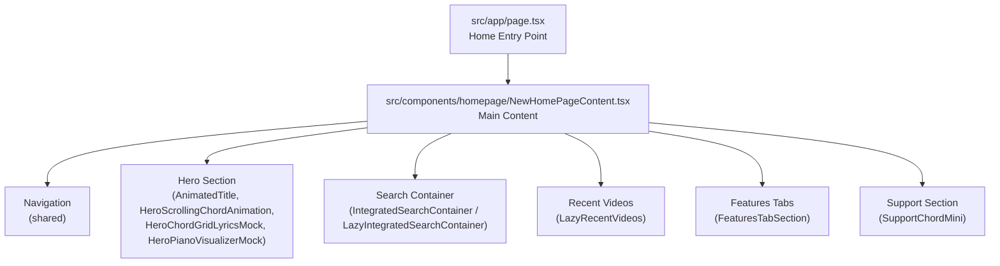
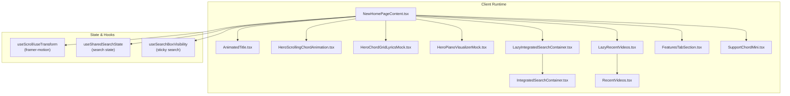
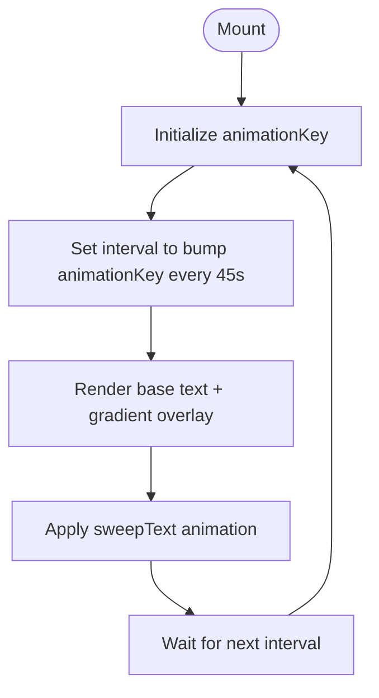
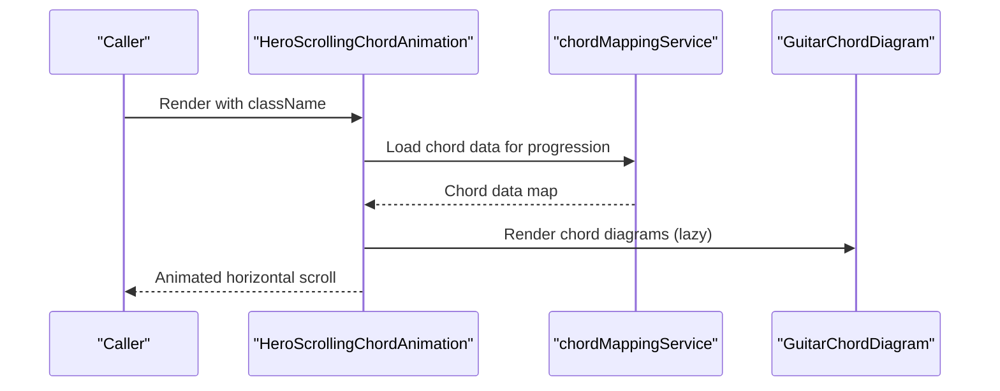
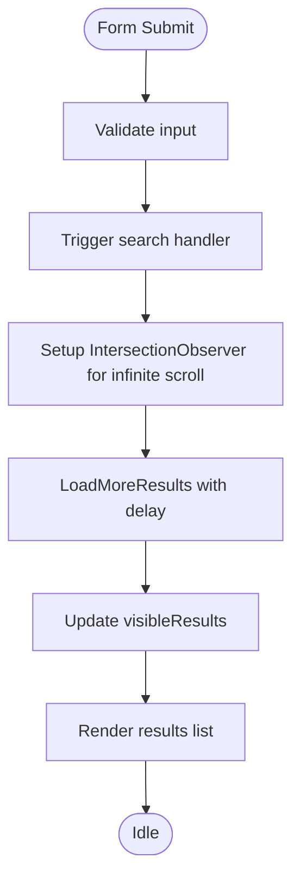
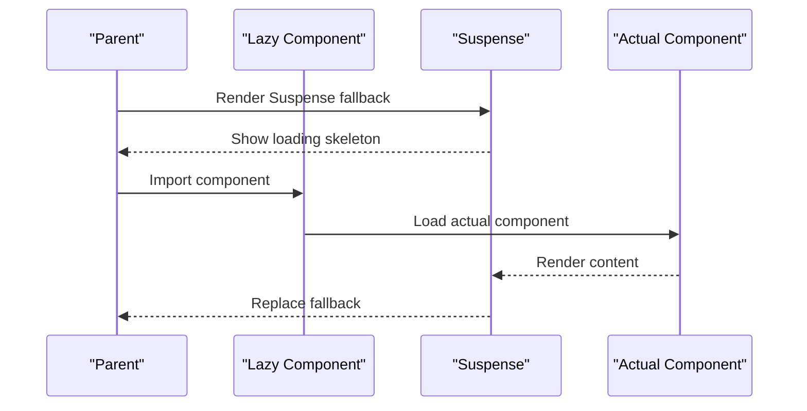
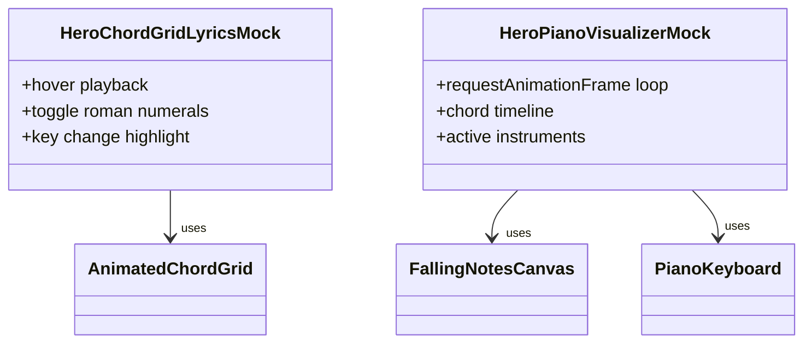
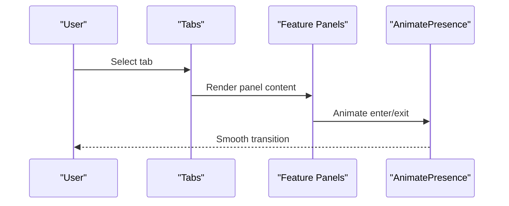
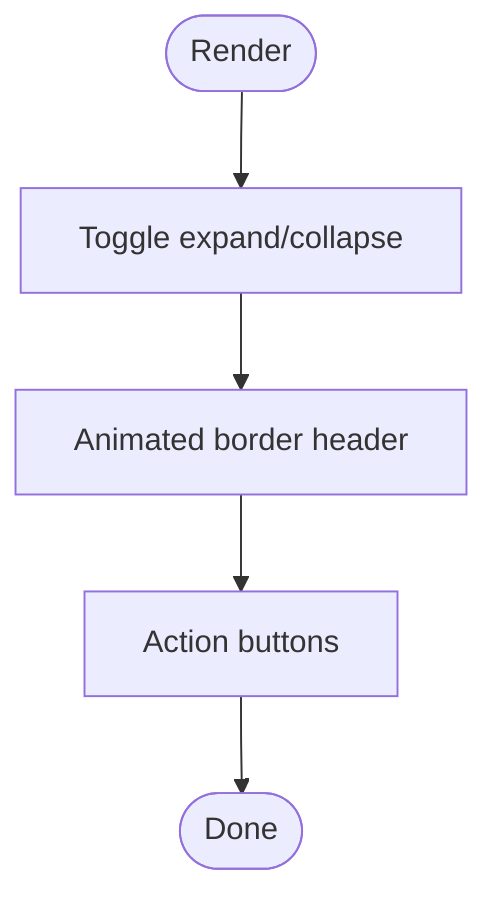
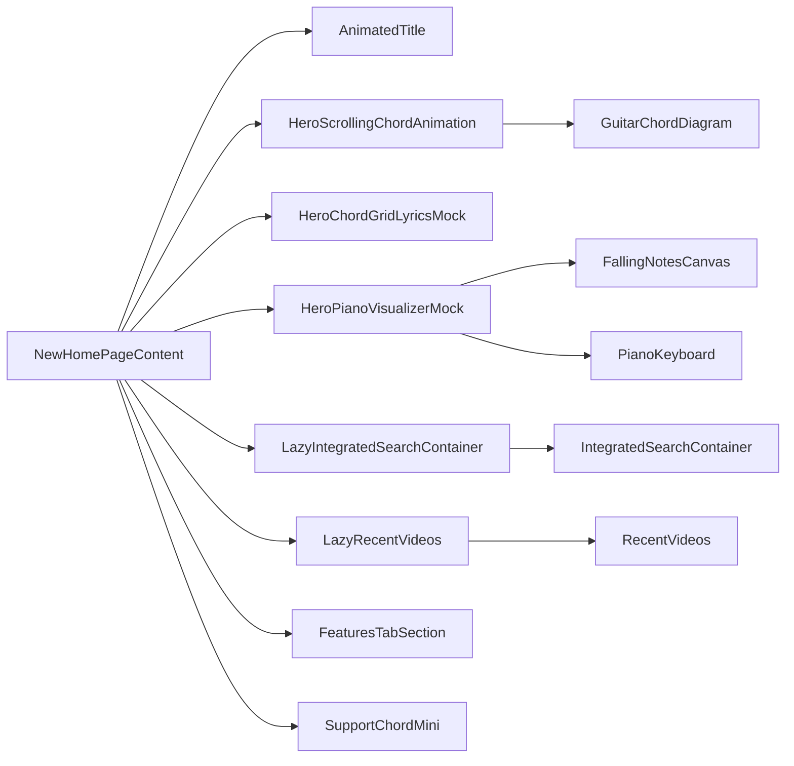

# Homepage and Landing Components

<cite>
**Referenced Files in This Document**
- [src/app/page.tsx](file://src/app/page.tsx)
- [src/components/homepage/NewHomePageContent.tsx](file://src/components/homepage/NewHomePageContent.tsx)
- [src/components/homepage/AnimatedTitle.tsx](file://src/components/homepage/AnimatedTitle.tsx)
- [src/components/homepage/AnimatedBorderText.tsx](file://src/components/homepage/AnimatedBorderText.tsx)
- [src/components/homepage/IntegratedSearchContainer.tsx](file://src/components/homepage/IntegratedSearchContainer.tsx)
- [src/components/homepage/LazyIntegratedSearchContainer.tsx](file://src/components/homepage/LazyIntegratedSearchContainer.tsx)
- [src/components/homepage/HeroScrollingChordAnimation.tsx](file://src/components/homepage/HeroScrollingChordAnimation.tsx)
- [src/components/homepage/FeaturesTabSection.tsx](file://src/components/homepage/FeaturesTabSection.tsx)
- [src/components/homepage/SupportChordMini.tsx](file://src/components/homepage/SupportChordMini.tsx)
- [src/components/homepage/LazyRecentVideos.tsx](file://src/components/homepage/LazyRecentVideos.tsx)
- [src/components/homepage/HeroChordGridLyricsMock.tsx](file://src/components/homepage/HeroChordGridLyricsMock.tsx)
- [src/components/homepage/HeroPianoVisualizerMock.tsx](file://src/components/homepage/HeroPianoVisualizerMock.tsx)
- [src/components/homepage/RecentVideos.tsx](file://src/components/homepage/RecentVideos.tsx)
- [src/app/globals.css](file://src/app/globals.css)
</cite>

## Table of Contents
1. [Introduction](#introduction)
2. [Project Structure](#project-structure)
3. [Core Components](#core-components)
4. [Architecture Overview](#architecture-overview)
5. [Detailed Component Analysis](#detailed-component-analysis)
6. [Dependency Analysis](#dependency-analysis)
7. [Performance Considerations](#performance-considerations)
8. [Troubleshooting Guide](#troubleshooting-guide)
9. [Conclusion](#conclusion)

## Introduction
This document provides comprehensive documentation for the homepage and landing page components. It covers animated text components, hero sections, integrated search containers, and feature displays. It explains responsive design patterns, progressive loading implementations, and performance optimizations. The guide also details component composition for engaging user onboarding experiences, including examples of component usage, animation configurations, and integration with search functionality, along with technical implementation notes for animations, progressive loading, and cross-device compatibility.

Current note: the homepage no longer renders the temporary "YouTube Extraction Pipeline Degradation" warning toast. Extraction status and queue messaging now live on the analysis page where the user is waiting for a specific video.

## Project Structure
The homepage entry point renders a dedicated content component that composes multiple specialized homepage components. These components are organized under a dedicated homepage module and leverage shared UI utilities and services.

**Diagram sources**
- [src/app/page.tsx:1-6](file://src/app/page.tsx#L1-L6)
- [src/components/homepage/NewHomePageContent.tsx:1-343](file://src/components/homepage/NewHomePageContent.tsx#L1-L343)

**Section sources**
- [src/app/page.tsx:1-6](file://src/app/page.tsx#L1-L6)
- [src/components/homepage/NewHomePageContent.tsx:1-343](file://src/components/homepage/NewHomePageContent.tsx#L1-L343)

## Core Components
This section introduces the primary homepage components and their roles in delivering an engaging, performant landing experience.

- AnimatedTitle: Provides a sweeping gradient text animation with periodic restarts.
- HeroScrollingChordAnimation: Renders a horizontally scrolling sequence of guitar chord diagrams with lazy loading and caching.
- IntegratedSearchContainer: A unified search form with results, infinite scroll, and YouTube metadata display.
- LazyIntegratedSearchContainer: Suspense-based lazy loader for the search container.
- HeroChordGridLyricsMock: Interactive mockup of chord grid and synchronized lyrics.
- HeroPianoVisualizerMock: Interactive piano visualizer with animated falling notes and keyboard.
- FeaturesTabSection: Tabbed feature showcase with mockups and animated content.
- LazyRecentVideos: Suspense-based lazy loader for recent videos.
- RecentVideos: Data-driven grid of recent transcriptions with filtering, pagination, and intersection observer-based loading.
- SupportChordMini: Collapsible action panel with animated border and support links.
- Operational notices: The homepage intentionally avoids the previous production-only degradation toast; user-facing extraction queue feedback is handled by `DownloadingIndicator` on analysis pages.

**Section sources**
- [src/components/homepage/AnimatedTitle.tsx:1-53](file://src/components/homepage/AnimatedTitle.tsx#L1-L53)
- [src/components/homepage/HeroScrollingChordAnimation.tsx:1-113](file://src/components/homepage/HeroScrollingChordAnimation.tsx#L1-L113)
- [src/components/homepage/IntegratedSearchContainer.tsx:1-256](file://src/components/homepage/IntegratedSearchContainer.tsx#L1-L256)
- [src/components/homepage/LazyIntegratedSearchContainer.tsx:1-70](file://src/components/homepage/LazyIntegratedSearchContainer.tsx#L1-L70)
- [src/components/homepage/HeroChordGridLyricsMock.tsx:1-219](file://src/components/homepage/HeroChordGridLyricsMock.tsx#L1-L219)
- [src/components/homepage/HeroPianoVisualizerMock.tsx:1-235](file://src/components/homepage/HeroPianoVisualizerMock.tsx#L1-L235)
- [src/components/homepage/FeaturesTabSection.tsx:1-656](file://src/components/homepage/FeaturesTabSection.tsx#L1-L656)
- [src/components/homepage/LazyRecentVideos.tsx:1-42](file://src/components/homepage/LazyRecentVideos.tsx#L1-L42)
- [src/components/homepage/RecentVideos.tsx:1-550](file://src/components/homepage/RecentVideos.tsx#L1-L550)
- [src/components/homepage/SupportChordMini.tsx:1-107](file://src/components/homepage/SupportChordMini.tsx#L1-L107)

## Architecture Overview
The homepage architecture emphasizes progressive rendering, lazy loading, and smooth animations. The main content component orchestrates scroll-triggered animations, search state synchronization, and conditional rendering of hero demos. Lazy components and suspense boundaries ensure fast initial loads and efficient resource usage.

**Diagram sources**
- [src/components/homepage/NewHomePageContent.tsx:1-343](file://src/components/homepage/NewHomePageContent.tsx#L1-L343)
- [src/components/homepage/AnimatedTitle.tsx:1-53](file://src/components/homepage/AnimatedTitle.tsx#L1-L53)
- [src/components/homepage/HeroScrollingChordAnimation.tsx:1-113](file://src/components/homepage/HeroScrollingChordAnimation.tsx#L1-L113)
- [src/components/homepage/HeroChordGridLyricsMock.tsx:1-219](file://src/components/homepage/HeroChordGridLyricsMock.tsx#L1-L219)
- [src/components/homepage/HeroPianoVisualizerMock.tsx:1-235](file://src/components/homepage/HeroPianoVisualizerMock.tsx#L1-L235)
- [src/components/homepage/LazyIntegratedSearchContainer.tsx:1-70](file://src/components/homepage/LazyIntegratedSearchContainer.tsx#L1-L70)
- [src/components/homepage/IntegratedSearchContainer.tsx:1-256](file://src/components/homepage/IntegratedSearchContainer.tsx#L1-L256)
- [src/components/homepage/LazyRecentVideos.tsx:1-42](file://src/components/homepage/LazyRecentVideos.tsx#L1-L42)
- [src/components/homepage/RecentVideos.tsx:1-550](file://src/components/homepage/RecentVideos.tsx#L1-L550)
- [src/components/homepage/FeaturesTabSection.tsx:1-656](file://src/components/homepage/FeaturesTabSection.tsx#L1-L656)
- [src/components/homepage/SupportChordMini.tsx:1-107](file://src/components/homepage/SupportChordMini.tsx#L1-L107)

## Detailed Component Analysis

### AnimatedTitle Component
AnimatedTitle renders a base text with a gradient sweep overlay that restarts periodically. It uses theme-aware styling and a key-based animation restart mechanism to maintain visual freshness.

**Diagram sources**
- [src/components/homepage/AnimatedTitle.tsx:1-53](file://src/components/homepage/AnimatedTitle.tsx#L1-L53)
- [src/app/globals.css:483-507](file://src/app/globals.css#L483-L507)

**Section sources**
- [src/components/homepage/AnimatedTitle.tsx:1-53](file://src/components/homepage/AnimatedTitle.tsx#L1-L53)
- [src/app/globals.css:483-507](file://src/app/globals.css#L483-L507)

### HeroScrollingChordAnimation Component
HeroScrollingChordAnimation creates a seamless horizontal loop of guitar chord diagrams. It lazily loads chord data, caches it, and animates the container with framer-motion.

**Diagram sources**
- [src/components/homepage/HeroScrollingChordAnimation.tsx:1-113](file://src/components/homepage/HeroScrollingChordAnimation.tsx#L1-L113)

**Section sources**
- [src/components/homepage/HeroScrollingChordAnimation.tsx:1-113](file://src/components/homepage/HeroScrollingChordAnimation.tsx#L1-L113)

### IntegratedSearchContainer Component
IntegratedSearchContainer provides a unified search experience with live results, infinite scroll, and YouTube metadata display. It manages visibility thresholds and loading states.

**Diagram sources**
- [src/components/homepage/IntegratedSearchContainer.tsx:1-256](file://src/components/homepage/IntegratedSearchContainer.tsx#L1-L256)

**Section sources**
- [src/components/homepage/IntegratedSearchContainer.tsx:1-256](file://src/components/homepage/IntegratedSearchContainer.tsx#L1-L256)

### LazyLoading Components
Lazy components wrap heavy UI with Suspense to defer rendering until needed, reducing initial bundle size and improving perceived performance.

**Diagram sources**
- [src/components/homepage/LazyIntegratedSearchContainer.tsx:1-70](file://src/components/homepage/LazyIntegratedSearchContainer.tsx#L1-L70)
- [src/components/homepage/LazyRecentVideos.tsx:1-42](file://src/components/homepage/LazyRecentVideos.tsx#L1-L42)

**Section sources**
- [src/components/homepage/LazyIntegratedSearchContainer.tsx:1-70](file://src/components/homepage/LazyIntegratedSearchContainer.tsx#L1-L70)
- [src/components/homepage/LazyRecentVideos.tsx:1-42](file://src/components/homepage/LazyRecentVideos.tsx#L1-L42)

### Hero Demos
Hero demos provide interactive previews of core features without requiring full analysis.

- HeroChordGridLyricsMock: Simulates chord grid and synchronized lyrics with hover-based playback.
- HeroPianoVisualizerMock: Renders animated falling notes and a piano keyboard with instrument indicators.

**Diagram sources**
- [src/components/homepage/HeroChordGridLyricsMock.tsx:1-219](file://src/components/homepage/HeroChordGridLyricsMock.tsx#L1-L219)
- [src/components/homepage/HeroPianoVisualizerMock.tsx:1-235](file://src/components/homepage/HeroPianoVisualizerMock.tsx#L1-L235)

**Section sources**
- [src/components/homepage/HeroChordGridLyricsMock.tsx:1-219](file://src/components/homepage/HeroChordGridLyricsMock.tsx#L1-L219)
- [src/components/homepage/HeroPianoVisualizerMock.tsx:1-235](file://src/components/homepage/HeroPianoVisualizerMock.tsx#L1-L235)

### FeaturesTabSection
FeaturesTabSection presents feature showcases in a tabbed layout with mockups and animated transitions. It includes mock chord grids, guitar diagrams, lyrics sync, and piano visualizer previews.

**Diagram sources**
- [src/components/homepage/FeaturesTabSection.tsx:1-656](file://src/components/homepage/FeaturesTabSection.tsx#L1-L656)

**Section sources**
- [src/components/homepage/FeaturesTabSection.tsx:1-656](file://src/components/homepage/FeaturesTabSection.tsx#L1-L656)

### SupportChordMini
SupportChordMini provides collapsible actions with animated borders and links to GitHub, issues, contact, and donations.

**Diagram sources**
- [src/components/homepage/SupportChordMini.tsx:1-107](file://src/components/homepage/SupportChordMini.tsx#L1-L107)
- [src/components/homepage/AnimatedBorderText.tsx:1-28](file://src/components/homepage/AnimatedBorderText.tsx#L1-L28)
- [src/app/globals.css:509-585](file://src/app/globals.css#L509-L585)

**Section sources**
- [src/components/homepage/SupportChordMini.tsx:1-107](file://src/components/homepage/SupportChordMini.tsx#L1-L107)
- [src/components/homepage/AnimatedBorderText.tsx:1-28](file://src/components/homepage/AnimatedBorderText.tsx#L1-L28)
- [src/app/globals.css:509-585](file://src/app/globals.css#L509-L585)

## Dependency Analysis
The homepage composes multiple specialized components with clear dependencies and minimal coupling. Shared utilities include theme context, scroll-based animations, and search state hooks.

**Diagram sources**
- [src/components/homepage/NewHomePageContent.tsx:1-343](file://src/components/homepage/NewHomePageContent.tsx#L1-L343)
- [src/components/homepage/LazyIntegratedSearchContainer.tsx:1-70](file://src/components/homepage/LazyIntegratedSearchContainer.tsx#L1-L70)
- [src/components/homepage/LazyRecentVideos.tsx:1-42](file://src/components/homepage/LazyRecentVideos.tsx#L1-L42)
- [src/components/homepage/HeroScrollingChordAnimation.tsx:1-113](file://src/components/homepage/HeroScrollingChordAnimation.tsx#L1-L113)
- [src/components/homepage/HeroPianoVisualizerMock.tsx:1-235](file://src/components/homepage/HeroPianoVisualizerMock.tsx#L1-L235)

**Section sources**
- [src/components/homepage/NewHomePageContent.tsx:1-343](file://src/components/homepage/NewHomePageContent.tsx#L1-L343)
- [src/components/homepage/LazyIntegratedSearchContainer.tsx:1-70](file://src/components/homepage/LazyIntegratedSearchContainer.tsx#L1-L70)
- [src/components/homepage/LazyRecentVideos.tsx:1-42](file://src/components/homepage/LazyRecentVideos.tsx#L1-L42)
- [src/components/homepage/HeroScrollingChordAnimation.tsx:1-113](file://src/components/homepage/HeroScrollingChordAnimation.tsx#L1-L113)
- [src/components/homepage/HeroPianoVisualizerMock.tsx:1-235](file://src/components/homepage/HeroPianoVisualizerMock.tsx#L1-L235)

## Performance Considerations
- Progressive loading: Lazy components and Suspense fallbacks defer expensive UI until needed.
- Animation optimization: CSS keyframe animations and framer-motion transforms leverage GPU acceleration; will-change hints improve responsiveness.
- Rendering efficiency: Memoization and caching (e.g., chord data cache) reduce redundant computations.
- Intersection Observer: Used for deferred data fetching and infinite scroll to minimize work while offscreen.
- Image optimization: Lazy loading and referrer policy applied to thumbnails; direct YouTube URLs used to avoid image optimization quotas.
- Theme-aware rendering: Minimizes reflows by switching styles at the root level.

[No sources needed since this section provides general guidance]

## Troubleshooting Guide
- Search container not appearing: Verify Suspense boundary is wrapping the lazy loader and that the underlying component is imported dynamically.
- Hero demos not animating: Confirm mouse events trigger hover states and that requestAnimationFrame loops are active.
- Recent videos not loading: Check Firebase initialization and query modes; ensure Intersection Observer conditions are met and that hasMore flags are correctly managed.
- Animation stuttering: Review CSS will-change usage and ensure GPU-accelerated properties are applied; avoid layout thrashing in animations.

**Section sources**
- [src/components/homepage/LazyIntegratedSearchContainer.tsx:1-70](file://src/components/homepage/LazyIntegratedSearchContainer.tsx#L1-L70)
- [src/components/homepage/LazyRecentVideos.tsx:1-42](file://src/components/homepage/LazyRecentVideos.tsx#L1-L42)
- [src/components/homepage/HeroPianoVisualizerMock.tsx:1-235](file://src/components/homepage/HeroPianoVisualizerMock.tsx#L1-L235)
- [src/components/homepage/RecentVideos.tsx:1-550](file://src/components/homepage/RecentVideos.tsx#L1-L550)

## Conclusion
The homepage and landing components combine animated visuals, progressive loading, and responsive design to deliver an engaging onboarding experience. By leveraging lazy components, suspense boundaries, and efficient animations, the system achieves strong performance across devices. The modular composition allows for iterative enhancements while maintaining a cohesive user experience.
