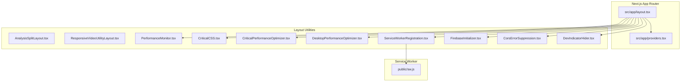
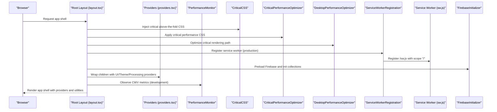
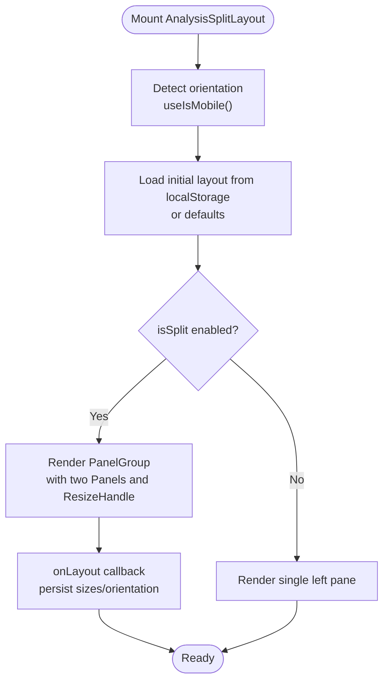
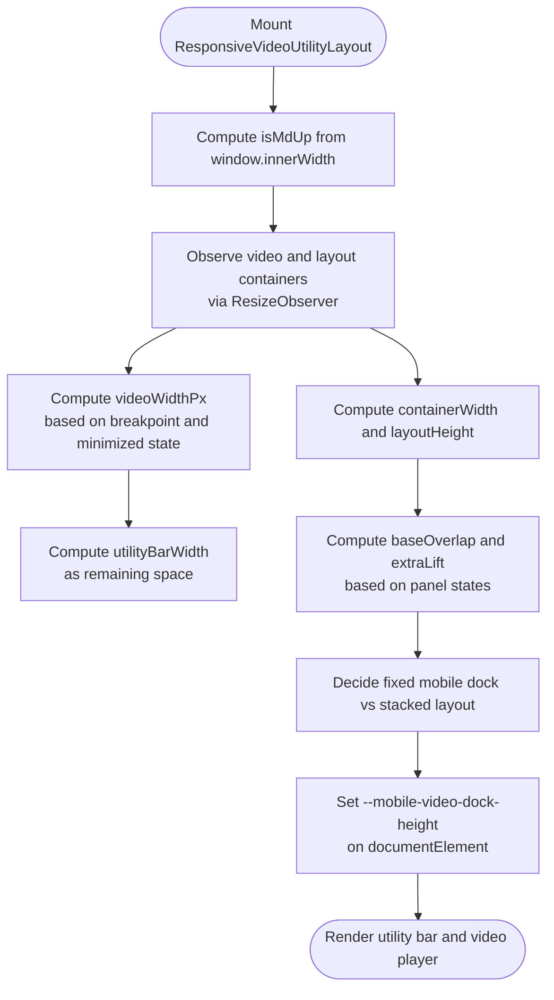
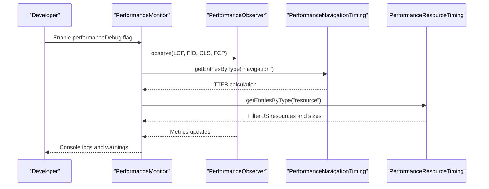
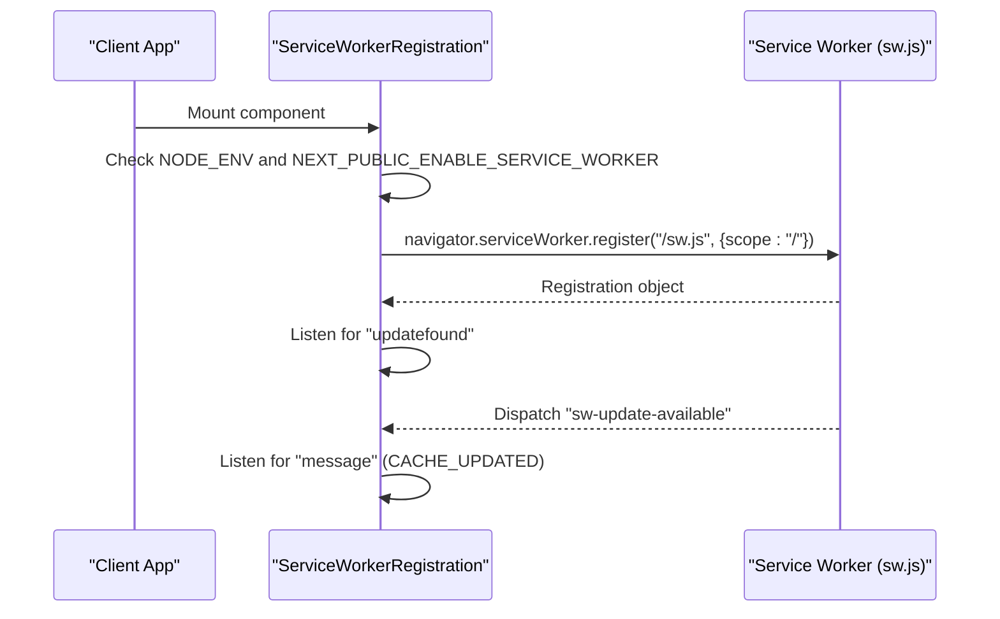
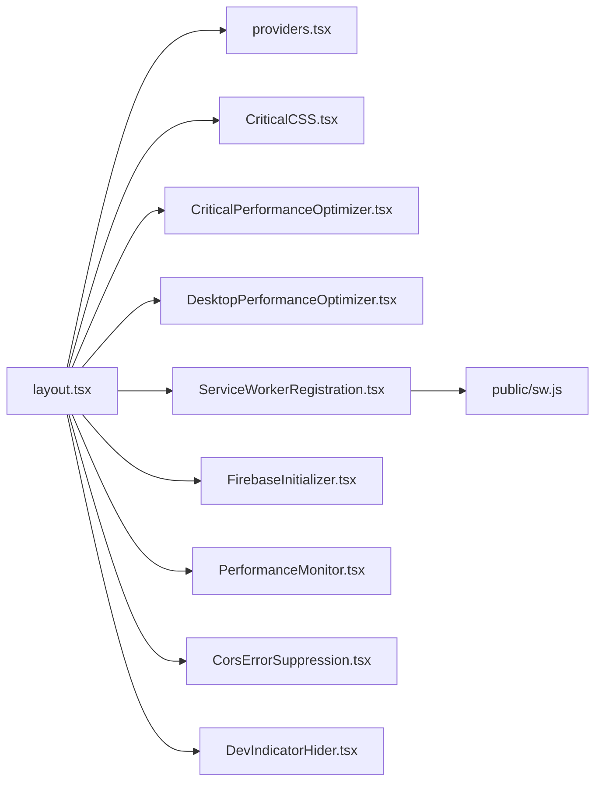

# Layout and Utility Components

<cite>
**Referenced Files in This Document**
- [AnalysisSplitLayout.tsx](file://src/components/layout/AnalysisSplitLayout.tsx)
- [ResponsiveVideoUtilityLayout.tsx](file://src/components/layout/ResponsiveVideoUtilityLayout.tsx)
- [PerformanceMonitor.tsx](file://src/components/layout/PerformanceMonitor.tsx)
- [CriticalCSS.tsx](file://src/components/layout/CriticalCSS.tsx)
- [ServiceWorkerRegistration.tsx](file://src/components/layout/ServiceWorkerRegistration.tsx)
- [CriticalPerformanceOptimizer.tsx](file://src/components/layout/CriticalPerformanceOptimizer.tsx)
- [DesktopPerformanceOptimizer.tsx](file://src/components/layout/DesktopPerformanceOptimizer.tsx)
- [FirebaseInitializer.tsx](file://src/components/layout/FirebaseInitializer.tsx)
- [CorsErrorSuppression.tsx](file://src/components/layout/CorsErrorSuppression.tsx)
- [DevIndicatorHider.tsx](file://src/components/layout/DevIndicatorHider.tsx)
- [layout.tsx](file://src/app/layout.tsx)
- [providers.tsx](file://src/app/providers.tsx)
- [sw.js](file://public/sw.js)
</cite>

## Table of Contents
1. [Introduction](#introduction)
2. [Project Structure](#project-structure)
3. [Core Components](#core-components)
4. [Architecture Overview](#architecture-overview)
5. [Detailed Component Analysis](#detailed-component-analysis)
6. [Dependency Analysis](#dependency-analysis)
7. [Performance Considerations](#performance-considerations)
8. [Troubleshooting Guide](#troubleshooting-guide)
9. [Conclusion](#conclusion)
10. [Appendices](#appendices)

## Introduction
This document explains the layout and utility components that form the structural foundation of the application. It focuses on:
- AnalysisSplitLayout: a responsive resizable split layout for analysis views
- ResponsiveVideoUtilityLayout: a flexible video and utility panel arrangement
- PerformanceMonitor: runtime measurement of Core Web Vitals and related metrics
- CriticalCSS, CriticalPerformanceOptimizer, DesktopPerformanceOptimizer: critical-path performance optimizations
- ServiceWorkerRegistration and public/sw.js: service worker lifecycle and caching strategies
- FirebaseInitializer, CorsErrorSuppression, DevIndicatorHider: cross-browser and environment-specific utilities
- Integration with Next.js app router and providers

## Project Structure
The layout and utility components live under src/components/layout and are integrated into the root Next.js app layout. Providers wrap the app to supply UI, theme, and processing contexts.

**Diagram sources**
- [layout.tsx:143-228](file://src/app/layout.tsx#L143-L228)
- [providers.tsx:12-27](file://src/app/providers.tsx#L12-L27)
- [AnalysisSplitLayout.tsx:24-111](file://src/components/layout/AnalysisSplitLayout.tsx#L24-L111)
- [ResponsiveVideoUtilityLayout.tsx:13-151](file://src/components/layout/ResponsiveVideoUtilityLayout.tsx#L13-L151)
- [PerformanceMonitor.tsx:17-243](file://src/components/layout/PerformanceMonitor.tsx#L17-L243)
- [CriticalCSS.tsx:9-243](file://src/components/layout/CriticalCSS.tsx#L9-L243)
- [CriticalPerformanceOptimizer.tsx:12-53](file://src/components/layout/CriticalPerformanceOptimizer.tsx#L12-L53)
- [DesktopPerformanceOptimizer.tsx:13-128](file://src/components/layout/DesktopPerformanceOptimizer.tsx#L13-L128)
- [ServiceWorkerRegistration.tsx:9-99](file://src/components/layout/ServiceWorkerRegistration.tsx#L9-L99)
- [FirebaseInitializer.tsx:12-61](file://src/components/layout/FirebaseInitializer.tsx#L12-L61)
- [CorsErrorSuppression.tsx:10-18](file://src/components/layout/CorsErrorSuppression.tsx#L10-L18)
- [DevIndicatorHider.tsx:9-60](file://src/components/layout/DevIndicatorHider.tsx#L9-L60)
- [sw.js:1-177](file://public/sw.js#L1-L177)

**Section sources**
- [layout.tsx:143-228](file://src/app/layout.tsx#L143-L228)
- [providers.tsx:12-27](file://src/app/providers.tsx#L12-L27)

## Core Components
- AnalysisSplitLayout: Provides a responsive resizable split pane with persisted layout state and orientation-aware sizing.
- ResponsiveVideoUtilityLayout: Coordinates video player and utility bar widths and positions across breakpoints, with special handling for mobile docks and overlap adjustments.
- PerformanceMonitor: Observes and logs Core Web Vitals and related metrics during development.
- CriticalCSS: Inlines critical above-the-fold CSS to reduce render-blocking.
- CriticalPerformanceOptimizer and DesktopPerformanceOptimizer: Apply targeted CSS and runtime optimizations for performance.
- ServiceWorkerRegistration: Registers a service worker and listens for updates and cache events.
- public/sw.js: Implements caching strategies for static assets, audio, API responses, and offline fallbacks.
- FirebaseInitializer: Preloads Firebase early to avoid race conditions and initializes optional collections.
- CorsErrorSuppression: Initializes client-side CORS error suppression.
- DevIndicatorHider: Hides Next.js development UI overlays in development.

**Section sources**
- [AnalysisSplitLayout.tsx:24-111](file://src/components/layout/AnalysisSplitLayout.tsx#L24-L111)
- [ResponsiveVideoUtilityLayout.tsx:13-151](file://src/components/layout/ResponsiveVideoUtilityLayout.tsx#L13-L151)
- [PerformanceMonitor.tsx:17-243](file://src/components/layout/PerformanceMonitor.tsx#L17-L243)
- [CriticalCSS.tsx:9-243](file://src/components/layout/CriticalCSS.tsx#L9-L243)
- [CriticalPerformanceOptimizer.tsx:12-53](file://src/components/layout/CriticalPerformanceOptimizer.tsx#L12-L53)
- [DesktopPerformanceOptimizer.tsx:13-128](file://src/components/layout/DesktopPerformanceOptimizer.tsx#L13-L128)
- [ServiceWorkerRegistration.tsx:9-99](file://src/components/layout/ServiceWorkerRegistration.tsx#L9-L99)
- [sw.js:1-177](file://public/sw.js#L1-L177)
- [FirebaseInitializer.tsx:12-61](file://src/components/layout/FirebaseInitializer.tsx#L12-L61)
- [CorsErrorSuppression.tsx:10-18](file://src/components/layout/CorsErrorSuppression.tsx#L10-L18)
- [DevIndicatorHider.tsx:9-60](file://src/components/layout/DevIndicatorHider.tsx#L9-L60)

## Architecture Overview
The layout utilities are mounted in the root layout and coordinate:
- Critical CSS injection and performance CSS
- Service worker lifecycle and caching
- Firebase initialization and connection monitoring
- Development-time UI cleanup
- Cross-origin error suppression

**Diagram sources**
- [layout.tsx:143-228](file://src/app/layout.tsx#L143-L228)
- [providers.tsx:12-27](file://src/app/providers.tsx#L12-L27)
- [CriticalCSS.tsx:9-243](file://src/components/layout/CriticalCSS.tsx#L9-L243)
- [CriticalPerformanceOptimizer.tsx:12-53](file://src/components/layout/CriticalPerformanceOptimizer.tsx#L12-L53)
- [DesktopPerformanceOptimizer.tsx:13-128](file://src/components/layout/DesktopPerformanceOptimizer.tsx#L13-L128)
- [ServiceWorkerRegistration.tsx:9-99](file://src/components/layout/ServiceWorkerRegistration.tsx#L9-L99)
- [sw.js:1-177](file://public/sw.js#L1-L177)
- [FirebaseInitializer.tsx:12-61](file://src/components/layout/FirebaseInitializer.tsx#L12-L61)
- [PerformanceMonitor.tsx:17-243](file://src/components/layout/PerformanceMonitor.tsx#L17-L243)

## Detailed Component Analysis

### AnalysisSplitLayout
Responsibilities:
- Renders either a single-pane or a resizable split pane depending on props and device orientation
- Persists layout state to localStorage keyed by a configurable storage key
- Enforces min/max sizes per panel and adapts resize handle visuals for horizontal vs vertical orientation

Key behaviors:
- Orientation detection uses a custom hook with media query listener
- Initial layout loads from localStorage if present and matches current orientation
- On layout change, persists sizes and orientation to localStorage
- Uses a panel library to provide draggable resize handles with hover feedback

**Diagram sources**
- [AnalysisSplitLayout.tsx:24-111](file://src/components/layout/AnalysisSplitLayout.tsx#L24-L111)

**Section sources**
- [AnalysisSplitLayout.tsx:24-111](file://src/components/layout/AnalysisSplitLayout.tsx#L24-L111)

### ResponsiveVideoUtilityLayout
Responsibilities:
- Computes responsive widths for the utility bar and video player based on viewport and breakpoint
- Adjusts overlap and lift to accommodate open panels and maintain readability
- Manages a mobile dock that can pin above footer or float fixed at bottom
- Exposes a CSS variable for mobile dock height to influence layout spacing

Key behaviors:
- Tracks container and video heights via ResizeObserver
- Listens to window resize and scroll to decide dock pinning
- Calculates utility bar width as remaining space after video width and gaps
- Applies CSS custom property for mobile dock height to adjust safe-area and spacing

**Diagram sources**
- [ResponsiveVideoUtilityLayout.tsx:13-151](file://src/components/layout/ResponsiveVideoUtilityLayout.tsx#L13-L151)

**Section sources**
- [ResponsiveVideoUtilityLayout.tsx:13-151](file://src/components/layout/ResponsiveVideoUtilityLayout.tsx#L13-L151)

### PerformanceMonitor
Responsibilities:
- Observes Core Web Vitals and related metrics in development when a localStorage flag is set
- Logs thresholds and warns when exceeding targets
- Measures TTFB, aggregates JS bundle sizes, and optionally logs memory usage
- Generates a consolidated performance report after a delay

Key behaviors:
- Uses PerformanceObserver for LCP, FID, CLS, and FCP
- Reads navigation timing for TTFB
- Scans performance resource entries for JS bundles and logs oversized chunks
- Throttles CLS logs and warns once after initial load window

**Diagram sources**
- [PerformanceMonitor.tsx:17-243](file://src/components/layout/PerformanceMonitor.tsx#L17-L243)

**Section sources**
- [PerformanceMonitor.tsx:17-243](file://src/components/layout/PerformanceMonitor.tsx#L17-L243)

### CriticalCSS
Responsibilities:
- Inlines critical CSS for above-the-fold content to minimize render-blocking
- Covers typography, layout fundamentals, navigation, hero, buttons, forms, cards, loading animations, dark mode, responsive utilities, and below-fold transitions

Key behaviors:
- Emits scoped CSS via a style element with the Next.js "jsx" pragma
- Ensures immediate visibility and prevents layout shifts for critical elements

**Section sources**
- [CriticalCSS.tsx:9-243](file://src/components/layout/CriticalCSS.tsx#L9-L243)

### CriticalPerformanceOptimizer and DesktopPerformanceOptimizer
Responsibilities:
- CriticalPerformanceOptimizer: injects minimal performance CSS at runtime to prevent layout shift and enable GPU acceleration for critical containers
- DesktopPerformanceOptimizer: defers non-critical work, relies on Next.js for CSS and image optimization, and optionally observes performance metrics in development

Key behaviors:
- CriticalPerformanceOptimizer adds a style element with critical rules and cleans it up on unmount
- DesktopPerformanceOptimizer avoids manual CSS injection and resource preloading, preferring Next.js defaults and requestIdleCallback for deferred tasks

**Section sources**
- [CriticalPerformanceOptimizer.tsx:12-53](file://src/components/layout/CriticalPerformanceOptimizer.tsx#L12-L53)
- [DesktopPerformanceOptimizer.tsx:13-128](file://src/components/layout/DesktopPerformanceOptimizer.tsx#L13-L128)

### ServiceWorkerRegistration and public/sw.js
Responsibilities:
- ServiceWorkerRegistration: conditionally registers the service worker in production and listens for updates and cache messages
- public/sw.js: defines cache names, installs static resources, activates and cleans caches, and implements caching strategies for API, audio, static assets, and pages

Key behaviors:
- Registration respects environment and availability, delays registration slightly to avoid blocking initial load, and dispatches a custom event when a new worker is installed
- Service worker caches static assets, audio files, and selected API responses, with fallbacks to cached resources and offline handling

**Diagram sources**
- [ServiceWorkerRegistration.tsx:9-99](file://src/components/layout/ServiceWorkerRegistration.tsx#L9-L99)
- [sw.js:1-177](file://public/sw.js#L1-L177)

**Section sources**
- [ServiceWorkerRegistration.tsx:9-99](file://src/components/layout/ServiceWorkerRegistration.tsx#L9-L99)
- [sw.js:1-177](file://public/sw.js#L1-L177)

### FirebaseInitializer, CorsErrorSuppression, DevIndicatorHider
Responsibilities:
- FirebaseInitializer: preloads Firebase early to avoid race conditions during audio extraction and initializes optional collections during idle time
- CorsErrorSuppression: initializes client-side CORS error suppression
- DevIndicatorHider: aggressively hides Next.js development UI overlays in development

Key behaviors:
- FirebaseInitializer uses requestIdleCallback to defer non-critical collection initialization
- DevIndicatorHider uses MutationObserver to hide dev UI across the DOM and Shadow DOM

**Section sources**
- [FirebaseInitializer.tsx:12-61](file://src/components/layout/FirebaseInitializer.tsx#L12-L61)
- [CorsErrorSuppression.tsx:10-18](file://src/components/layout/CorsErrorSuppression.tsx#L10-L18)
- [DevIndicatorHider.tsx:9-60](file://src/components/layout/DevIndicatorHider.tsx#L9-L60)

## Dependency Analysis
The root layout composes all layout utilities and providers. Providers supply UI, theme, and processing contexts to the app tree.

**Diagram sources**
- [layout.tsx:143-228](file://src/app/layout.tsx#L143-L228)
- [providers.tsx:12-27](file://src/app/providers.tsx#L12-L27)
- [CriticalCSS.tsx:9-243](file://src/components/layout/CriticalCSS.tsx#L9-L243)
- [CriticalPerformanceOptimizer.tsx:12-53](file://src/components/layout/CriticalPerformanceOptimizer.tsx#L12-L53)
- [DesktopPerformanceOptimizer.tsx:13-128](file://src/components/layout/DesktopPerformanceOptimizer.tsx#L13-L128)
- [ServiceWorkerRegistration.tsx:9-99](file://src/components/layout/ServiceWorkerRegistration.tsx#L9-L99)
- [FirebaseInitializer.tsx:12-61](file://src/components/layout/FirebaseInitializer.tsx#L12-L61)
- [PerformanceMonitor.tsx:17-243](file://src/components/layout/PerformanceMonitor.tsx#L17-L243)
- [CorsErrorSuppression.tsx:10-18](file://src/components/layout/CorsErrorSuppression.tsx#L10-L18)
- [DevIndicatorHider.tsx:9-60](file://src/components/layout/DevIndicatorHider.tsx#L9-L60)
- [sw.js:1-177](file://public/sw.js#L1-L177)

**Section sources**
- [layout.tsx:143-228](file://src/app/layout.tsx#L143-L228)
- [providers.tsx:12-27](file://src/app/providers.tsx#L12-L27)

## Performance Considerations
- Critical CSS: Inlined critical CSS reduces render-blocking and improves FCP/FCI.
- Performance observers: Core Web Vitals are observed in development to guide optimization.
- Service worker caching: Static assets, audio, and selected API responses are cached to improve reliability and speed.
- Deferred initialization: Firebase and non-critical tasks are deferred to idle callbacks to minimize main-thread work.
- CSS and font optimizations: GPU acceleration hints and font-display swapping are applied to reduce layout shifts and improve perceived performance.

[No sources needed since this section provides general guidance]

## Troubleshooting Guide
- Service worker not registering:
  - Verify production environment and browser support for serviceWorker
  - Confirm the sw.js path and scope are correct
  - Check for console errors during registration and update events
- Performance metrics not appearing:
  - Ensure the development flag enabling performanceDebug is set
  - Confirm PerformanceObserver is available in the browser
- Layout not resizing or persisting:
  - Check localStorage availability and permissions
  - Verify orientation detection and media query listeners
- Mobile dock misalignment:
  - Inspect computed video and layout heights
  - Confirm the CSS variable for mobile dock height is applied
- Firebase race conditions:
  - Ensure Firebase is preloaded before audio extraction
  - Confirm optional collections are initialized during idle time

**Section sources**
- [ServiceWorkerRegistration.tsx:9-99](file://src/components/layout/ServiceWorkerRegistration.tsx#L9-L99)
- [PerformanceMonitor.tsx:17-243](file://src/components/layout/PerformanceMonitor.tsx#L17-L243)
- [AnalysisSplitLayout.tsx:24-111](file://src/components/layout/AnalysisSplitLayout.tsx#L24-L111)
- [ResponsiveVideoUtilityLayout.tsx:13-151](file://src/components/layout/ResponsiveVideoUtilityLayout.tsx#L13-L151)
- [FirebaseInitializer.tsx:12-61](file://src/components/layout/FirebaseInitializer.tsx#L12-L61)

## Conclusion
The layout and utility components establish a robust, performance-conscious foundation for the application. They combine responsive layouts, critical-path optimizations, service worker caching, and environment-specific utilities to deliver a smooth user experience across devices and browsers while integrating seamlessly with Next.js app router and providers.

[No sources needed since this section summarizes without analyzing specific files]

## Appendices
- Example usage patterns:
  - AnalysisSplitLayout: configure isSplit, storageKey, and defaultDesktopLayout/defaultMobileLayout to tailor the split behavior for analysis views
  - ResponsiveVideoUtilityLayout: pass videoPlayer and utilityBar nodes, and manage isVideoMinimized, isChatbotOpen, and isLyricsPanelOpen to compute responsive widths and dock behavior
  - PerformanceMonitor: enable performanceDebug in development to observe Core Web Vitals and related metrics
  - ServiceWorkerRegistration: set NEXT_PUBLIC_ENABLE_SERVICE_WORKER to true in production and ensure sw.js is served from the root path

[No sources needed since this section provides general guidance]