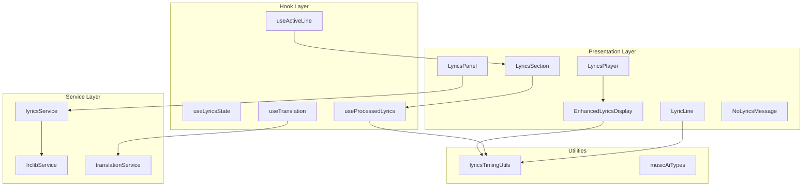
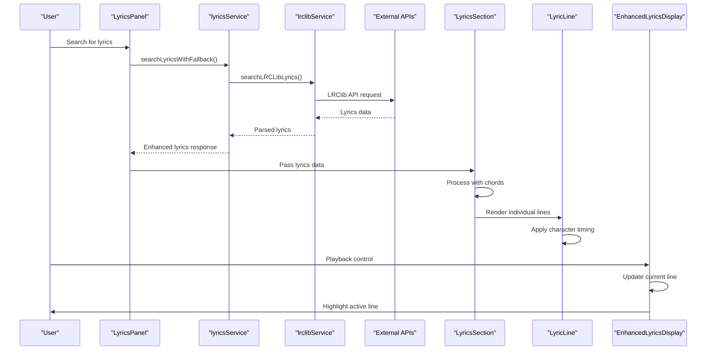
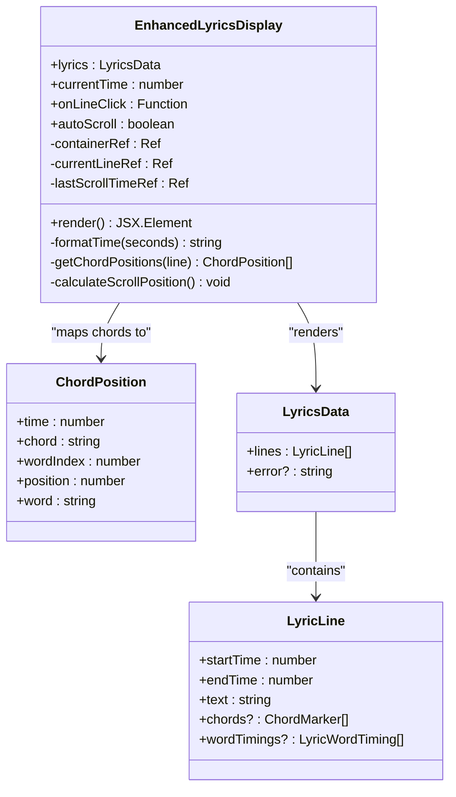
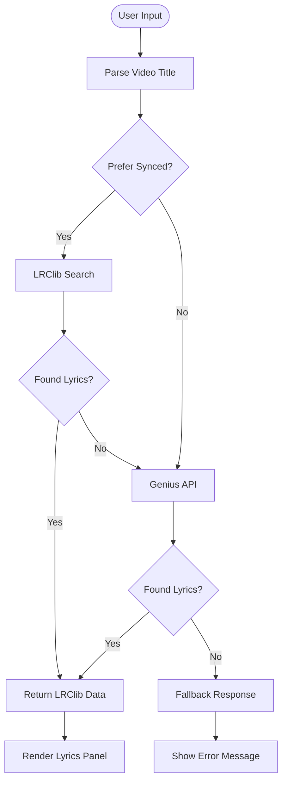
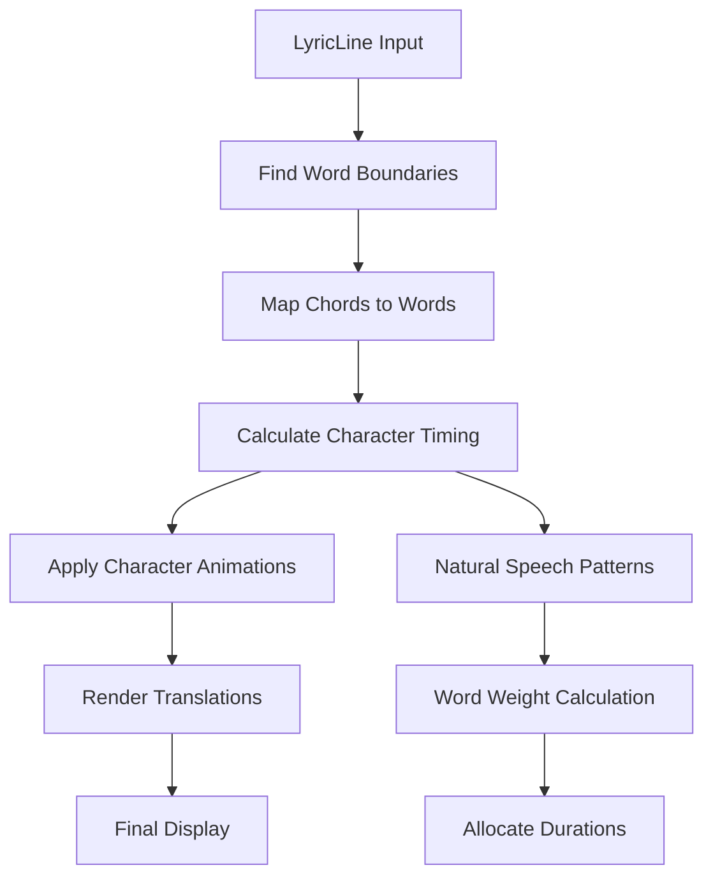
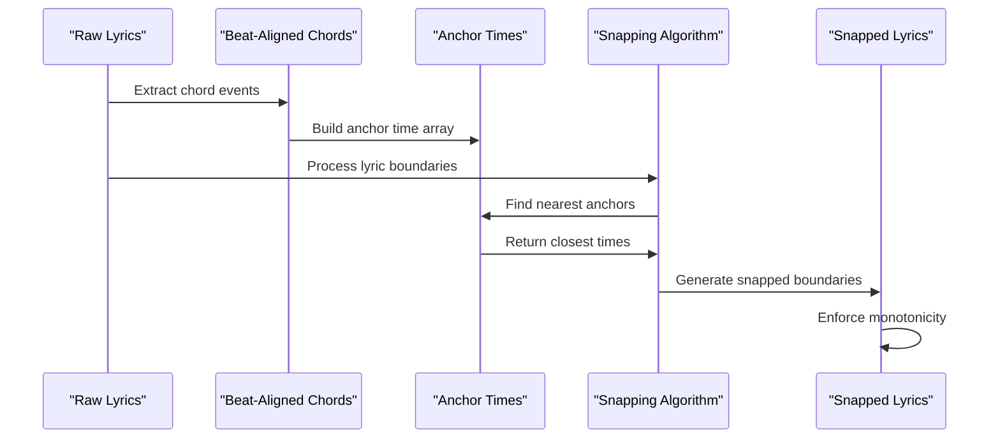
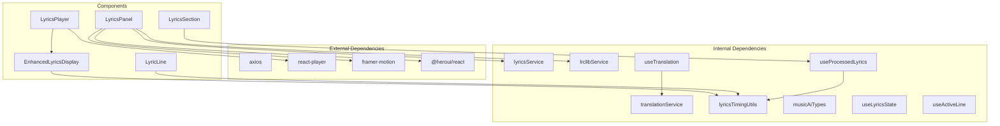

# Lyrics Display Components

<cite>
**Referenced Files in This Document**
- [EnhancedLyricsDisplay.tsx](file://src/components/lyrics/EnhancedLyricsDisplay.tsx)
- [LyricsPanel.tsx](file://src/components/lyrics/LyricsPanel.tsx)
- [LyricsPlayer.tsx](file://src/components/lyrics/LyricsPlayer.tsx)
- [LyricLine.tsx](file://src/components/lyrics/LyricLine.tsx)
- [LyricsSection.tsx](file://src/components/lyrics/LyricsSection.tsx)
- [NoLyricsMessage.tsx](file://src/components/lyrics/NoLyricsMessage.tsx)
- [lyricsService.ts](file://src/services/lyrics/lyricsService.ts)
- [lrclibService.ts](file://src/services/lyrics/lrclibService.ts)
- [lyricsTimingUtils.ts](file://src/utils/lyricsTimingUtils.ts)
- [musicAiTypes.ts](file://src/types/musicAiTypes.ts)
- [useLyricsState.ts](file://src/hooks/lyrics/useLyricsState.ts)
- [useProcessedLyrics.ts](file://src/hooks/lyrics/useProcessedLyrics.ts)
- [useActiveLine.ts](file://src/hooks/lyrics/useActiveLine.ts)
- [useTranslation.ts](file://src/hooks/lyrics/useTranslation.ts)
- [translationService.ts](file://src/services/lyrics/translationService.ts)
</cite>

## Table of Contents
1. [Introduction](#introduction)
2. [Project Structure](#project-structure)
3. [Core Components](#core-components)
4. [Architecture Overview](#architecture-overview)
5. [Detailed Component Analysis](#detailed-component-analysis)
6. [Dependency Analysis](#dependency-analysis)
7. [Performance Considerations](#performance-considerations)
8. [Troubleshooting Guide](#troubleshooting-guide)
9. [Conclusion](#conclusion)

## Introduction
This document provides comprehensive technical documentation for the lyrics display component system in the ChordMiniApp. It covers the EnhancedLyricsDisplay, LyricsPanel, LyricsPlayer, and related components that work together to render synchronized lyrics with translations, segment boundaries, and real-time playback synchronization. The system integrates external lyrics services (LRClib and Genius), chord analysis data, and advanced timing algorithms to deliver an immersive, interactive lyrics experience.

## Project Structure
The lyrics display system is organized around several key components and supporting services:

- **Presentation Layer**: EnhancedLyricsDisplay, LyricsPanel, LyricsPlayer, LyricLine, LyricsSection, NoLyricsMessage
- **Service Layer**: lyricsService, lrclibService, translationService
- **Hook Layer**: useLyricsState, useProcessedLyrics, useActiveLine, useTranslation
- **Utility Layer**: lyricsTimingUtils, musicAiTypes
- **Integration**: React components, Next.js dynamic imports, Framer Motion animations

**Diagram sources**
- [EnhancedLyricsDisplay.tsx:1-231](file://src/components/lyrics/EnhancedLyricsDisplay.tsx#L1-L231)
- [LyricsPanel.tsx:1-376](file://src/components/lyrics/LyricsPanel.tsx#L1-L376)
- [LyricsPlayer.tsx:1-203](file://src/components/lyrics/LyricsPlayer.tsx#L1-L203)
- [lyricsService.ts:1-197](file://src/services/lyrics/lyricsService.ts#L1-L197)
- [lrclibService.ts:1-266](file://src/services/lyrics/lrclibService.ts#L1-L266)
- [lyricsTimingUtils.ts:1-213](file://src/utils/lyricsTimingUtils.ts#L1-L213)

**Section sources**
- [EnhancedLyricsDisplay.tsx:1-231](file://src/components/lyrics/EnhancedLyricsDisplay.tsx#L1-L231)
- [LyricsPanel.tsx:1-376](file://src/components/lyrics/LyricsPanel.tsx#L1-L376)
- [LyricsPlayer.tsx:1-203](file://src/components/lyrics/LyricsPlayer.tsx#L1-L203)

## Core Components
This section examines the primary components that form the lyrics display system.

### EnhancedLyricsDisplay
The EnhancedLyricsDisplay component provides sophisticated lyrics rendering with automatic scrolling and chord positioning:

- **Synchronized Rendering**: Tracks current playback time to highlight active lines
- **Auto-Scrolling**: Smoothly scrolls to keep the current line centered in the viewport
- **Chord Positioning**: Maps chord markers to specific words using character position analysis
- **Error Handling**: Graceful degradation with fallback rendering for malformed data
- **Performance Optimizations**: Throttled scroll operations and efficient DOM updates

Key features include:
- Time formatting utilities for display
- Word boundary detection and chord mapping algorithms
- Responsive design with smooth scrolling behavior
- Click handlers for line navigation

**Section sources**
- [EnhancedLyricsDisplay.tsx:14-231](file://src/components/lyrics/EnhancedLyricsDisplay.tsx#L14-L231)

### LyricsPanel
The LyricsPanel serves as a floating panel interface for lyrics discovery and viewing:

- **Search Integration**: Combines LRClib and Genius APIs for comprehensive lyrics coverage
- **Dual Mode Display**: Switches between synchronized and static lyrics views
- **Real-time Updates**: Automatically scrolls to current lyrics line during playback
- **Fallback System**: Intelligent switching between lyrics providers
- **Mobile Responsiveness**: Adaptive layout for different screen sizes

The panel supports:
- Search query parsing and validation
- Loading states and error handling
- Sticky header with song metadata
- Clear and close functionality

**Section sources**
- [LyricsPanel.tsx:23-376](file://src/components/lyrics/LyricsPanel.tsx#L23-L376)

### LyricsPlayer
The LyricsPlayer combines YouTube video playback with synchronized lyrics display:

- **Dual Interface**: Side-by-side video player and lyrics display
- **Playback Synchronization**: Real-time time tracking and line highlighting
- **Interactive Controls**: Play/pause, seek, volume, and progress indicators
- **Click-to-Skip**: Jump to specific lyrics positions by clicking line text
- **Volume Management**: Separate mute/unmute functionality

Integration points include:
- ReactPlayer for YouTube video embedding
- EnhancedLyricsDisplay for synchronized rendering
- Time update propagation to parent components

**Section sources**
- [LyricsPlayer.tsx:16-203](file://src/components/lyrics/LyricsPlayer.tsx#L16-L203)

### LyricLine
The LyricLine component renders individual lyric lines with advanced timing and visual effects:

- **Character-Level Animation**: Precise timing for each character appearance
- **Word Boundary Detection**: Accurate word segmentation for timing accuracy
- **Chord Integration**: Visual chord display above relevant words
- **Translation Support**: Multi-language translation display
- **Segmentation Labels**: Section markers for musical segments
- **Performance Optimization**: Memoized calculations and efficient rendering

Advanced features include:
- Natural speech pattern modeling for timing
- Memoized character arrays for repeated rendering
- Dynamic chord positioning based on word boundaries
- Smooth color transitions with gradient effects

**Section sources**
- [LyricLine.tsx:145-681](file://src/components/lyrics/LyricLine.tsx#L145-L681)

### LyricsSection
The LyricsSection component orchestrates the complete lyrics display pipeline:

- **Chord-Centric Alignment**: Uses chord changes as authoritative timing anchors
- **Two-Pointer Algorithm**: Efficiently snaps lyric boundaries to chord timestamps
- **Segment Merging**: Integrates instrumental sections and chord-only passages
- **Downbeat Processing**: Optional filtering for downbeat-only chord changes
- **Accidental Preference**: Intelligent enharmonic spelling selection

The component provides:
- Beat-aligned chord event computation
- Monotonic line boundary enforcement
- Comprehensive error state handling
- Integration with analysis results

**Section sources**
- [LyricsSection.tsx:43-324](file://src/components/lyrics/LyricsSection.tsx#L43-L324)

### NoLyricsMessage
The NoLyricsMessage component handles error states and provides troubleshooting guidance:

- **Error Categorization**: Distinguishes between detection failures and service issues
- **Diagnostic Information**: Specific guidance based on error patterns
- **Troubleshooting Steps**: Actionable solutions for common problems
- **API-Specific Messaging**: Tailored advice for Music.ai API issues

**Section sources**
- [NoLyricsMessage.tsx:20-105](file://src/components/lyrics/NoLyricsMessage.tsx#L20-L105)

## Architecture Overview
The lyrics display system follows a layered architecture with clear separation of concerns:

**Diagram sources**
- [LyricsPanel.tsx:54-94](file://src/components/lyrics/LyricsPanel.tsx#L54-L94)
- [lyricsService.ts:72-172](file://src/services/lyrics/lyricsService.ts#L72-L172)
- [lrclibService.ts:32-145](file://src/services/lyrics/lrclibService.ts#L32-L145)
- [LyricsSection.tsx:142-224](file://src/components/lyrics/LyricsSection.tsx#L142-L224)

The architecture emphasizes:
- **Service Abstraction**: External API interactions are encapsulated
- **Data Transformation**: Raw API responses are normalized and enhanced
- **Timing Precision**: Multiple timing sources (chords, beats, character-level)
- **Performance Optimization**: Memoization, throttling, and efficient rendering

## Detailed Component Analysis

### EnhancedLyricsDisplay: Synchronized Rendering Engine
The EnhancedLyricsDisplay component implements sophisticated synchronized lyrics rendering:

**Diagram sources**
- [EnhancedLyricsDisplay.tsx:4-231](file://src/components/lyrics/EnhancedLyricsDisplay.tsx#L4-L231)
- [musicAiTypes.ts:16-30](file://src/types/musicAiTypes.ts#L16-L30)

Key synchronization algorithms include:
- **Current Line Detection**: Linear search through lyric lines using time bounds
- **Auto-Scroll Calculation**: Mathematical positioning to center active lines
- **Chord Position Mapping**: Word boundary analysis for precise chord placement
- **Performance Throttling**: Rate limiting for smooth scrolling behavior

**Section sources**
- [EnhancedLyricsDisplay.tsx:25-138](file://src/components/lyrics/EnhancedLyricsDisplay.tsx#L25-L138)

### LyricsPanel: Service Integration Hub
The LyricsPanel coordinates multiple lyrics services with intelligent fallback:

**Diagram sources**
- [LyricsPanel.tsx:54-94](file://src/components/lyrics/LyricsPanel.tsx#L54-L94)
- [lyricsService.ts:72-172](file://src/services/lyrics/lyricsService.ts#L72-L172)

Service integration features:
- **Multi-Provider Strategy**: LRClib first, Genius as fallback
- **Intelligent Parsing**: Automatic extraction of artist/title from video titles
- **Legacy Compatibility**: Seamless conversion between different response formats
- **Real-time Synchronization**: Live updating during playback

**Section sources**
- [LyricsPanel.tsx:54-150](file://src/components/lyrics/LyricsPanel.tsx#L54-L150)

### LyricLine: Advanced Timing and Animation
The LyricLine component implements sophisticated timing algorithms:

**Diagram sources**
- [LyricLine.tsx:166-313](file://src/components/lyrics/LyricLine.tsx#L166-L313)
- [lyricsTimingUtils.ts:36-145](file://src/utils/lyricsTimingUtils.ts#L36-L145)

Advanced timing features:
- **Speech Pattern Modeling**: Accounts for syllable counts and consonant clusters
- **Word Boundary Detection**: Precise identification of word positions
- **Character-Level Progression**: Individual character timing within words
- **Memoization Strategy**: Efficient character array caching for repeated renders

**Section sources**
- [LyricLine.tsx:166-480](file://src/components/lyrics/LyricLine.tsx#L166-L480)
- [lyricsTimingUtils.ts:36-145](file://src/utils/lyricsTimingUtils.ts#L36-L145)

### LyricsSection: Chord-Centric Alignment
The LyricsSection component implements authoritative chord-driven lyrics alignment:

**Diagram sources**
- [LyricsSection.tsx:142-224](file://src/components/lyrics/LyricsSection.tsx#L142-L224)

Alignment algorithm highlights:
- **Two-Pointer Technique**: Efficient O(n+m) complexity for boundary snapping
- **Monotonic Enforcement**: Prevents overlapping and gaps in line boundaries
- **Chord Priority**: Uses chord changes as primary timing anchors
- **Beat Fallback**: Falls back to beat timestamps when chord data unavailable

**Section sources**
- [LyricsSection.tsx:142-224](file://src/components/lyrics/LyricsSection.tsx#L142-L224)

## Dependency Analysis
The lyrics system exhibits well-structured dependencies with clear separation of concerns:

**Diagram sources**
- [LyricsPanel.tsx:1-11](file://src/components/lyrics/LyricsPanel.tsx#L1-L11)
- [LyricsPlayer.tsx:1-5](file://src/components/lyrics/LyricsPlayer.tsx#L1-L5)
- [LyricLine.tsx:1-11](file://src/components/lyrics/LyricLine.tsx#L1-L11)

Key dependency patterns:
- **Service Layer Abstraction**: All external API interactions are isolated
- **Hook Composition**: Business logic is encapsulated in reusable hooks
- **Utility Functions**: Pure functions for timing calculations and data transformation
- **Component Isolation**: UI components focus solely on presentation logic

**Section sources**
- [lyricsService.ts:1-197](file://src/services/lyrics/lyricsService.ts#L1-L197)
- [translationService.ts:38-244](file://src/services/lyrics/translationService.ts#L38-L244)

## Performance Considerations
The system implements multiple optimization strategies:

### Throttling and Debouncing
- **Auto-Scroll Throttling**: Limits scroll operations to ~3 per second
- **Render Throttling**: 100ms throttle for active line calculations
- **Memory Management**: Cleanup of background update polling

### Efficient Data Structures
- **Memoization**: Extensive use of useMemo for computed values
- **Character Array Caching**: Memoized character arrays for repeated rendering
- **Object Pooling**: Reuse of DOM references and element IDs

### Rendering Optimizations
- **React.memo**: Strategic memoization of components
- **Selective Updates**: Only re-render affected components
- **Batch Operations**: Coalesced DOM updates using requestAnimationFrame

### Memory Management
- **Background Update Cleanup**: Proper termination of polling operations
- **Callback Registration**: Clean removal of event listeners
- **Resource Pooling**: Shared instances for translation service

## Troubleshooting Guide

### Common Issues and Solutions

**Lyrics Not Loading**
- Verify API keys are configured correctly
- Check network connectivity to external services
- Review browser console for detailed error messages
- Ensure video has lyrics available in the database

**Synchronization Problems**
- Confirm chord analysis data is available
- Check beat detection accuracy
- Verify timing alignment between audio and lyrics
- Review console logs for timing calculation errors

**Performance Issues**
- Monitor scroll throttling effectiveness
- Check for excessive re-renders
- Verify memoization is working correctly
- Review component hierarchy for optimization opportunities

**Translation Failures**
- Validate Gemini API key configuration
- Check translation service availability
- Review cache-first mechanism behavior
- Monitor background update polling status

**Section sources**
- [NoLyricsMessage.tsx:24-101](file://src/components/lyrics/NoLyricsMessage.tsx#L24-L101)
- [lyricsService.ts:177-196](file://src/services/lyrics/lyricsService.ts#L177-L196)

## Conclusion
The lyrics display component system provides a robust, feature-rich solution for synchronized lyrics rendering with advanced timing algorithms and interactive capabilities. The architecture successfully balances performance, user experience, and technical complexity through strategic use of hooks, memoization, and service abstraction. The system's modular design enables easy maintenance and extension while maintaining high standards for code quality and user experience.

The integration of multiple lyrics services, chord-centric timing, and sophisticated animation techniques creates a comprehensive solution that enhances the overall music listening experience. Future enhancements could focus on additional lyrics providers, improved timing accuracy, and expanded translation capabilities.