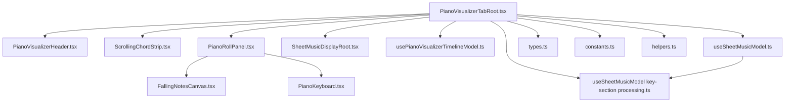
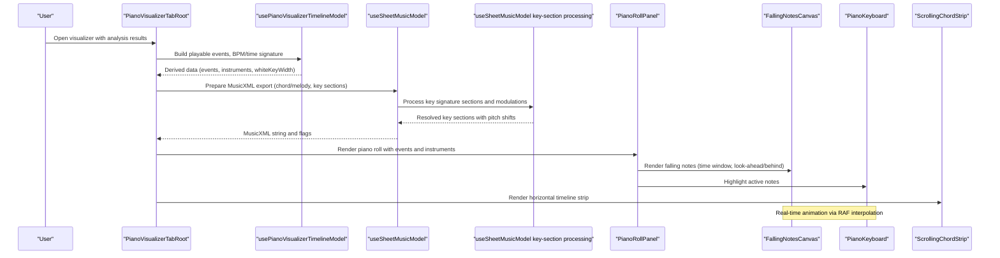
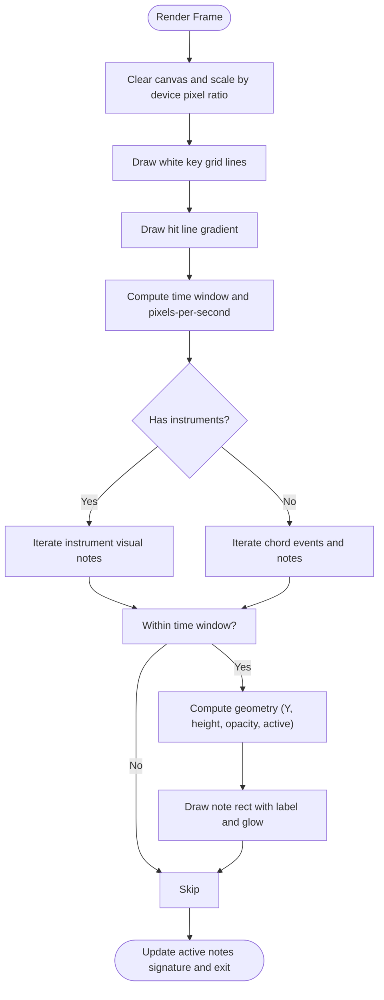
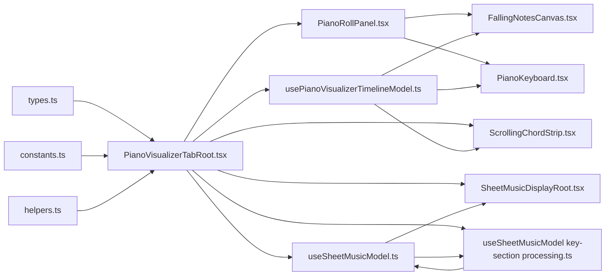

# Piano Visualizer Components

<cite>
**Referenced Files in This Document**
- [PianoVisualizerTab.tsx](file://src/components/piano-visualizer/PianoVisualizerTab.tsx)
- [PianoVisualizerTabRoot.tsx](file://src/components/piano-visualizer/piano-visualizer-tab/PianoVisualizerTabRoot.tsx)
- [PianoRollPanel.tsx](file://src/components/piano-visualizer/piano-visualizer-tab/PianoRollPanel.tsx)
- [PianoVisualizerHeader.tsx](file://src/components/piano-visualizer/piano-visualizer-tab/PianoVisualizerHeader.tsx)
- [constants.ts](file://src/components/piano-visualizer/piano-visualizer-tab/constants.ts)
- [helpers.ts](file://src/components/piano-visualizer/piano-visualizer-tab/helpers.ts)
- [types.ts](file://src/components/piano-visualizer/piano-visualizer-tab/types.ts)
- [usePianoVisualizerTimelineModel.ts](file://src/components/piano-visualizer/piano-visualizer-tab/usePianoVisualizerTimelineModel.ts)
- [useSheetMusicModel.ts](file://src/components/piano-visualizer/piano-visualizer-tab/useSheetMusicModel.ts)
- [FallingNotesCanvas.tsx](file://src/components/piano-visualizer/FallingNotesCanvas.tsx)
- [PianoKeyboard.tsx](file://src/components/piano-visualizer/PianoKeyboard.tsx)
- [ScrollingChordStrip.tsx](file://src/components/piano-visualizer/ScrollingChordStrip.tsx)
- [SheetMusicDisplay.tsx](file://src/components/piano-visualizer/SheetMusicDisplay.tsx)
- [SheetMusicDisplayRoot.tsx](file://src/components/piano-visualizer/sheet-music-display/SheetMusicDisplayRoot.tsx)
- [useSheetMusicModel key-section processing.ts](file://src/components/piano-visualizer/piano-visualizer-tab/useSheetMusicModel.ts)
</cite>

## Update Summary
**Changes Made**
- Updated Sheet Music Model Hook section to reflect centralization of key signature processing logic
- Added new section documenting the useSheetMusicModel key-section processing
- Enhanced Sheet Music Model Hook documentation to explain the extraction and utilization of key signature processing logic
- Updated architecture overview to show the relationship between the utility function and the main model hook

## Table of Contents
1. [Introduction](#introduction)
2. [Project Structure](#project-structure)
3. [Core Components](#core-components)
4. [Architecture Overview](#architecture-overview)
5. [Detailed Component Analysis](#detailed-component-analysis)
6. [Dependency Analysis](#dependency-analysis)
7. [Performance Considerations](#performance-considerations)
8. [Troubleshooting Guide](#troubleshooting-guide)
9. [Conclusion](#conclusion)

## Introduction
This document describes the piano visualizer component system that renders musical notes in real time, synchronizes with audio playback, and supports both piano roll and sheet music displays. It covers the piano roll panel, sheet music display, falling notes canvas, keyboard overlay, and scrolling chord strip. It explains real-time animation systems, MIDI note generation, synchronization mechanisms, canvas-based rendering, performance optimizations, responsive design, and integration with audio playback systems.

## Project Structure
The piano visualizer is organized into a tab-level container that composes several specialized panels and utilities:
- Tab container orchestrating state and display modes
- Piano roll panel with falling notes canvas and piano keyboard
- Scrolling chord strip for timeline navigation
- Sheet music display powered by MusicXML export and rendering
- Timeline model and sheet music model hooks for data orchestration
- Centralized key signature processing utility function
- Constants, helpers, and types supporting the system

**Diagram sources**
- [PianoVisualizerTabRoot.tsx:1-330](file://src/components/piano-visualizer/piano-visualizer-tab/PianoVisualizerTabRoot.tsx#L1-L330)
- [PianoRollPanel.tsx:1-120](file://src/components/piano-visualizer/piano-visualizer-tab/PianoRollPanel.tsx#L1-L120)
- [FallingNotesCanvas.tsx:1-568](file://src/components/piano-visualizer/FallingNotesCanvas.tsx#L1-L568)
- [PianoKeyboard.tsx:1-182](file://src/components/piano-visualizer/PianoKeyboard.tsx#L1-L182)
- [ScrollingChordStrip.tsx:1-556](file://src/components/piano-visualizer/ScrollingChordStrip.tsx#L1-L556)
- [SheetMusicDisplayRoot.tsx:1-139](file://src/components/piano-visualizer/sheet-music-display/SheetMusicDisplayRoot.tsx#L1-L139)
- [usePianoVisualizerTimelineModel.ts:1-247](file://src/components/piano-visualizer/piano-visualizer-tab/usePianoVisualizerTimelineModel.ts#L1-L247)
- [useSheetMusicModel.ts:1-697](file://src/components/piano-visualizer/piano-visualizer-tab/useSheetMusicModel.ts#L1-L697)
- [useSheetMusicModel key-section processing.ts:1-130](file://src/components/piano-visualizer/piano-visualizer-tab/useSheetMusicModel.ts#L1-L130)
- [types.ts:1-66](file://src/components/piano-visualizer/piano-visualizer-tab/types.ts#L1-L66)
- [constants.ts:1-26](file://src/components/piano-visualizer/piano-visualizer-tab/constants.ts#L1-L26)
- [helpers.ts:1-97](file://src/components/piano-visualizer/piano-visualizer-tab/helpers.ts#L1-L97)

**Section sources**
- [PianoVisualizerTab.tsx:1-10](file://src/components/piano-visualizer/PianoVisualizerTab.tsx#L1-L10)
- [PianoVisualizerTabRoot.tsx:1-330](file://src/components/piano-visualizer/piano-visualizer-tab/PianoVisualizerTabRoot.tsx#L1-L330)

## Core Components
- PianoVisualizerTabRoot: Orchestrates the entire visualizer, manages display mode, speed presets, MIDI export, and integrates timeline and sheet music models.
- PianoRollPanel: Hosts the falling notes canvas and piano keyboard, passing timing and instrument data.
- FallingNotesCanvas: Real-time canvas renderer for falling notes with precise timing, instrument-specific voicing, and optional melodic overlay.
- PianoKeyboard: Interactive keyboard overlay reflecting active notes and highlighting.
- ScrollingChordStrip: Horizontal timeline strip with smooth 60 fps scrolling synchronized to playback.
- SheetMusicDisplayRoot: Renders MusicXML-backed sheet music with measure highlighting and PDF export.
- Timeline and Sheet Music Models: Compute derived data (events, BPM/time signature, instrument lists, white key sizing, melody overlays) and manage sheet music export pipeline.
- **useSheetMusicModel key-section processing Utility**: Centralized function for processing key signature sections and modulations with pitch shifting support.

**Section sources**
- [PianoRollPanel.tsx:1-120](file://src/components/piano-visualizer/piano-visualizer-tab/PianoRollPanel.tsx#L1-L120)
- [FallingNotesCanvas.tsx:1-568](file://src/components/piano-visualizer/FallingNotesCanvas.tsx#L1-L568)
- [PianoKeyboard.tsx:1-182](file://src/components/piano-visualizer/PianoKeyboard.tsx#L1-L182)
- [ScrollingChordStrip.tsx:1-556](file://src/components/piano-visualizer/ScrollingChordStrip.tsx#L1-L556)
- [SheetMusicDisplayRoot.tsx:1-139](file://src/components/piano-visualizer/sheet-music-display/SheetMusicDisplayRoot.tsx#L1-L139)
- [usePianoVisualizerTimelineModel.ts:1-247](file://src/components/piano-visualizer/piano-visualizer-tab/usePianoVisualizerTimelineModel.ts#L1-L247)
- [useSheetMusicModel.ts:1-697](file://src/components/piano-visualizer/piano-visualizer-tab/useSheetMusicModel.ts#L1-L697)
- [useSheetMusicModel key-section processing.ts:1-130](file://src/components/piano-visualizer/piano-visualizer-tab/useSheetMusicModel.ts#L1-L130)

## Architecture Overview
The visualizer follows a data-driven architecture:
- Data ingestion: Chord grid and beat timelines from analysis results.
- Timeline model: Builds playable chord events, merges duplicates, computes BPM/time signature, and prepares instrument lists and melody overlays.
- Sheet music model: Translates chord and melody events into MusicXML, resolves pickups and key sections via centralized utility, and exports PDF.
- Rendering: Canvas-based falling notes with RAF interpolation; DOM-based keyboard overlay; horizontal strip with smooth scrolling; sheet music SVG rendering.

**Diagram sources**
- [PianoVisualizerTabRoot.tsx:129-177](file://src/components/piano-visualizer/piano-visualizer-tab/PianoVisualizerTabRoot.tsx#L129-L177)
- [usePianoVisualizerTimelineModel.ts:66-245](file://src/components/piano-visualizer/piano-visualizer-tab/usePianoVisualizerTimelineModel.ts#L66-L245)
- [useSheetMusicModel.ts:572-649](file://src/components/piano-visualizer/piano-visualizer-tab/useSheetMusicModel.ts#L572-L649)
- [useSheetMusicModel key-section processing.ts:39-130](file://src/components/piano-visualizer/piano-visualizer-tab/useSheetMusicModel.ts#L39-L130)
- [PianoRollPanel.tsx:82-102](file://src/components/piano-visualizer/piano-visualizer-tab/PianoRollPanel.tsx#L82-L102)
- [FallingNotesCanvas.tsx:513-534](file://src/components/piano-visualizer/FallingNotesCanvas.tsx#L513-L534)
- [ScrollingChordStrip.tsx:220-249](file://src/components/piano-visualizer/ScrollingChordStrip.tsx#L220-L249)

## Detailed Component Analysis

### Falling Notes Canvas
The canvas renders falling notes with:
- Time windowing: look-ahead and look-behind seconds define the visible region.
- Geometry computation: converts note start/end times to Y positions and opacities.
- Instrument-specific voicing: generates per-note timings and colors from shared generator.
- Active notes tracking: emits active MIDI notes and colors to parent for keyboard highlighting.
- Synchronization: smooth 60 fps interpolation using RAF; drift correction on time updates.

**Diagram sources**
- [FallingNotesCanvas.tsx:241-443](file://src/components/piano-visualizer/FallingNotesCanvas.tsx#L241-L443)

**Section sources**
- [FallingNotesCanvas.tsx:21-60](file://src/components/piano-visualizer/FallingNotesCanvas.tsx#L21-L60)
- [FallingNotesCanvas.tsx:105-125](file://src/components/piano-visualizer/FallingNotesCanvas.tsx#L105-L125)
- [FallingNotesCanvas.tsx:241-443](file://src/components/piano-visualizer/FallingNotesCanvas.tsx#L241-L443)
- [FallingNotesCanvas.tsx:461-495](file://src/components/piano-visualizer/FallingNotesCanvas.tsx#L461-L495)
- [FallingNotesCanvas.tsx:497-534](file://src/components/piano-visualizer/FallingNotesCanvas.tsx#L497-L534)
- [FallingNotesCanvas.tsx:536-552](file://src/components/piano-visualizer/FallingNotesCanvas.tsx#L536-L552)

### Piano Keyboard
The keyboard mirrors active notes from the canvas:
- Builds white and black key layouts from MIDI range.
- Renders interactive buttons with aria labels and pressed states.
- Highlights active notes with per-note colors.

**Section sources**
- [PianoKeyboard.tsx:8-23](file://src/components/piano-visualizer/PianoKeyboard.tsx#L8-L23)
- [PianoKeyboard.tsx:44-82](file://src/components/piano-visualizer/PianoKeyboard.tsx#L44-L82)
- [PianoKeyboard.tsx:96-174](file://src/components/piano-visualizer/PianoKeyboard.tsx#L96-L174)

### Scrolling Chord Strip
The strip provides a horizontal timeline:
- Uniform cell widths computed from median beat intervals.
- Smooth 60 fps scrolling via RAF interpolation.
- Measure separators aligned to time signature.
- Sweep line indicator and edge fades for readability.

**Section sources**
- [ScrollingChordStrip.tsx:59-82](file://src/components/piano-visualizer/ScrollingChordStrip.tsx#L59-L82)
- [ScrollingChordStrip.tsx:220-249](file://src/components/piano-visualizer/ScrollingChordStrip.tsx#L220-L249)
- [ScrollingChordStrip.tsx:416-550](file://src/components/piano-visualizer/ScrollingChordStrip.tsx#L416-L550)

### Sheet Music Display
The sheet music display:
- Exports piano visualizer events and melody to MusicXML.
- Resolves pickups, key sections, and time signatures.
- Renders MusicXML to SVG and highlights active measures.
- Provides PDF export.

**Section sources**
- [useSheetMusicModel.ts:572-649](file://src/components/piano-visualizer/piano-visualizer-tab/useSheetMusicModel.ts#L572-L649)
- [SheetMusicDisplayRoot.tsx:19-47](file://src/components/piano-visualizer/sheet-music-display/SheetMusicDisplayRoot.tsx#L19-L47)
- [SheetMusicDisplayRoot.tsx:76-112](file://src/components/piano-visualizer/sheet-music-display/SheetMusicDisplayRoot.tsx#L76-L112)

### Timeline Model Hook
The timeline model:
- Builds playable and notation chord events from chord grids.
- Merges consecutive events to reduce churn.
- Computes BPM, time signature, and total duration.
- Produces white key width and keyboard width based on container width.
- Builds instrument lists from mixer settings and melody overlay notes.

**Section sources**
- [usePianoVisualizerTimelineModel.ts:66-122](file://src/components/piano-visualizer/piano-visualizer-tab/usePianoVisualizerTimelineModel.ts#L66-L122)
- [usePianoVisualizerTimelineModel.ts:195-200](file://src/components/piano-visualizer/piano-visualizer-tab/usePianoVisualizerTimelineModel.ts#L195-L200)
- [usePianoVisualizerTimelineModel.ts:201-211](file://src/components/piano-visualizer/piano-visualizer-tab/usePianoVisualizerTimelineModel.ts#L201-L211)
- [usePianoVisualizerTimelineModel.ts:213-218](file://src/components/piano-visualizer/piano-visualizer-tab/usePianoVisualizerTimelineModel.ts#L213-L218)

### Sheet Music Model Hook
The sheet music model:
- Resolves pickup counts considering structural padding, first playable beats, and melody onset.
- Transposes key signatures and melody events according to pitch shift.
- **Centralizes key signature processing through useSheetMusicModel key-section processing**.
- Builds MusicXML with key sections and segmentation markers.
- Defer-computes XML via requestAnimationFrame and timeout to keep UI responsive.

**Updated** The sheet music model now delegates complex key signature processing to a dedicated utility function, improving code organization and maintainability.

**Section sources**
- [useSheetMusicModel.ts:451-467](file://src/components/piano-visualizer/piano-visualizer-tab/useSheetMusicModel.ts#L451-L467)
- [useSheetMusicModel.ts:572-649](file://src/components/piano-visualizer/piano-visualizer-tab/useSheetMusicModel.ts#L572-L649)
- [useSheetMusicModel.ts:663-686](file://src/components/piano-visualizer/piano-visualizer-tab/useSheetMusicModel.ts#L663-L686)

### useSheetMusicModel Key-Section Processing
**New** The useSheetMusicModel key-section processing function centralizes complex key signature processing logic:

- Processes key sections and modulations from sequence corrections
- Applies pitch shifting transformations to key signatures
- Maps sequence indices to beat positions using beat-to-chord sequence mapping
- Normalizes and deduplicates key sections
- Handles explicit origin keys and fallback scenarios
- Computes start beat indices with notation beat offset consideration

**Section sources**
- [useSheetMusicModel key-section processing.ts:39-130](file://src/components/piano-visualizer/piano-visualizer-tab/useSheetMusicModel.ts#L39-L130)

### Piano Visualizer Tab Container
The tab container:
- Manages display mode (piano roll vs sheet music).
- Controls speed presets affecting look-ahead seconds.
- Integrates MIDI export and instrument legends.
- Coordinates active notes propagation from canvas to keyboard.

**Section sources**
- [PianoVisualizerTabRoot.tsx:70-76](file://src/components/piano-visualizer/piano-visualizer-tab/PianoVisualizerTabRoot.tsx#L70-L76)
- [PianoVisualizerTabRoot.tsx:260-262](file://src/components/piano-visualizer/piano-visualizer-tab/PianoVisualizerTabRoot.tsx#L260-L262)
- [PianoVisualizerTabRoot.tsx:291-324](file://src/components/piano-visualizer/piano-visualizer-tab/PianoVisualizerTabRoot.tsx#L291-L324)
- [PianoVisualizerHeader.tsx:20-109](file://src/components/piano-visualizer/piano-visualizer-tab/PianoVisualizerHeader.tsx#L20-L109)

## Dependency Analysis
The visualizer components depend on:
- Timeline model for derived data (events, BPM, time signature, instruments).
- Sheet music model for MusicXML export and rendering.
- **useSheetMusicModel key-section processing utility for centralized key signature processing**.
- Shared utilities for MIDI note generation and chord processing.
- Audio dynamics for signal-aware note patterns.

**Diagram sources**
- [types.ts:1-66](file://src/components/piano-visualizer/piano-visualizer-tab/types.ts#L1-L66)
- [constants.ts:1-26](file://src/components/piano-visualizer/piano-visualizer-tab/constants.ts#L1-L26)
- [helpers.ts:1-97](file://src/components/piano-visualizer/piano-visualizer-tab/helpers.ts#L1-L97)
- [PianoVisualizerTabRoot.tsx:129-177](file://src/components/piano-visualizer/piano-visualizer-tab/PianoVisualizerTabRoot.tsx#L129-L177)
- [usePianoVisualizerTimelineModel.ts:66-245](file://src/components/piano-visualizer/piano-visualizer-tab/usePianoVisualizerTimelineModel.ts#L66-L245)
- [useSheetMusicModel.ts:572-649](file://src/components/piano-visualizer/piano-visualizer-tab/useSheetMusicModel.ts#L572-L649)
- [useSheetMusicModel key-section processing.ts:39-130](file://src/components/piano-visualizer/piano-visualizer-tab/useSheetMusicModel.ts#L39-L130)
- [PianoRollPanel.tsx:82-102](file://src/components/piano-visualizer/piano-visualizer-tab/PianoRollPanel.tsx#L82-L102)
- [FallingNotesCanvas.tsx:200-237](file://src/components/piano-visualizer/FallingNotesCanvas.tsx#L200-L237)
- [ScrollingChordStrip.tsx:220-249](file://src/components/piano-visualizer/ScrollingChordStrip.tsx#L220-L249)
- [SheetMusicDisplayRoot.tsx:40-47](file://src/components/piano-visualizer/sheet-music-display/SheetMusicDisplayRoot.tsx#L40-L47)

**Section sources**
- [PianoVisualizerTabRoot.tsx:129-177](file://src/components/piano-visualizer/piano-visualizer-tab/PianoVisualizerTabRoot.tsx#L129-L177)
- [usePianoVisualizerTimelineModel.ts:66-245](file://src/components/piano-visualizer/piano-visualizer-tab/usePianoVisualizerTimelineModel.ts#L66-L245)
- [useSheetMusicModel.ts:572-649](file://src/components/piano-visualizer/piano-visualizer-tab/useSheetMusicModel.ts#L572-L649)
- [useSheetMusicModel key-section processing.ts:39-130](file://src/components/piano-visualizer/piano-visualizer-tab/useSheetMusicModel.ts#L39-L130)

## Performance Considerations
- Canvas rendering:
  - Device pixel ratio scaling to support high-DPI displays.
  - Memoized MIDI key position lookups and note geometry computations.
  - Stable render function reference to avoid animation loop restarts.
- Animation loops:
  - RAF interpolation at ~60 fps for smooth note movement.
  - Drift correction blending to maintain synchronization with audio time updates (~4 Hz).
- DOM rendering:
  - ResizeObserver for responsive white key width calculation.
  - Memoized chord box layouts and uniform cell widths to prevent layout thrashing.
- Deferred computation:
  - useDeferredValue for sheet music time to decouple rendering from rapid time changes.
  - requestAnimationFrame + timeout batching for MusicXML export.
- **Centralized key signature processing**:
  - **Improved performance through extracted utility function reduces complexity in main model hook**.
  - **Better memory management through dedicated processing pipeline**.
- Accessibility and UX:
  - ARIA roles and labels for canvas and keyboard.
  - Disabled states for unavailable sheet music mode and speed controls.

## Troubleshooting Guide
- Notes not appearing:
  - Verify chord events are merged and filtered for playable notes.
  - Confirm white key range and canvas width calculations.
- Synchronization drift:
  - Check drift thresholds and blending factor; ensure currentTime updates are received.
- Sheet music not rendering:
  - Ensure playable chords or melody events exist; confirm MusicXML export completes without errors.
- **Key signature issues**:
  - **Verify useSheetMusicModel key-section processing utility processes key sections correctly**.
  - **Check pitch shift transformations are applied consistently**.
  - **Confirm sequence corrections mapping works with beat-to-chord sequence map**.
- Keyboard not highlighting:
  - Confirm active notes signature change triggers updates and colors are propagated.

**Section sources**
- [FallingNotesCanvas.tsx:461-495](file://src/components/piano-visualizer/FallingNotesCanvas.tsx#L461-L495)
- [useSheetMusicModel.ts:572-649](file://src/components/piano-visualizer/piano-visualizer-tab/useSheetMusicModel.ts#L572-L649)
- [useSheetMusicModel key-section processing.ts:39-130](file://src/components/piano-visualizer/piano-visualizer-tab/useSheetMusicModel.ts#L39-L130)
- [PianoRollPanel.tsx:192-205](file://src/components/piano-visualizer/piano-visualizer-tab/PianoRollPanel.tsx#L192-L205)

## Conclusion
The piano visualizer combines canvas-based real-time rendering with DOM overlays and MusicXML-backed sheet music to deliver an immersive, synchronized musical experience. Its modular design, robust synchronization, and performance optimizations enable responsive playback visualization across diverse input sources and display modes. **The recent centralization of key signature processing logic into the useSheetMusicModel key-section processing improves code organization, maintainability, and performance by extracting complex key signature resolution logic from the main sheet music model hook.**