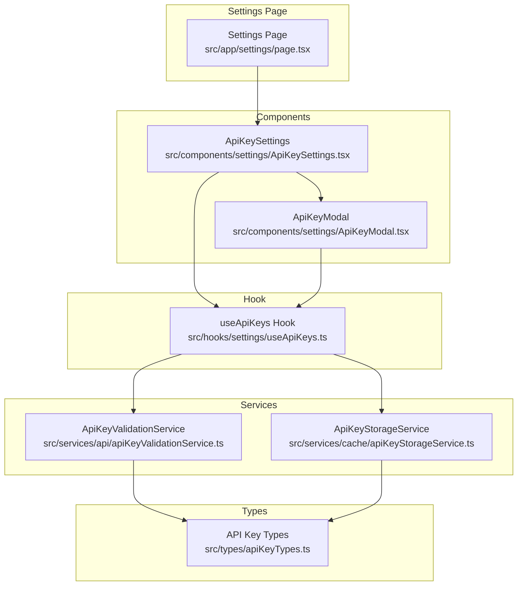
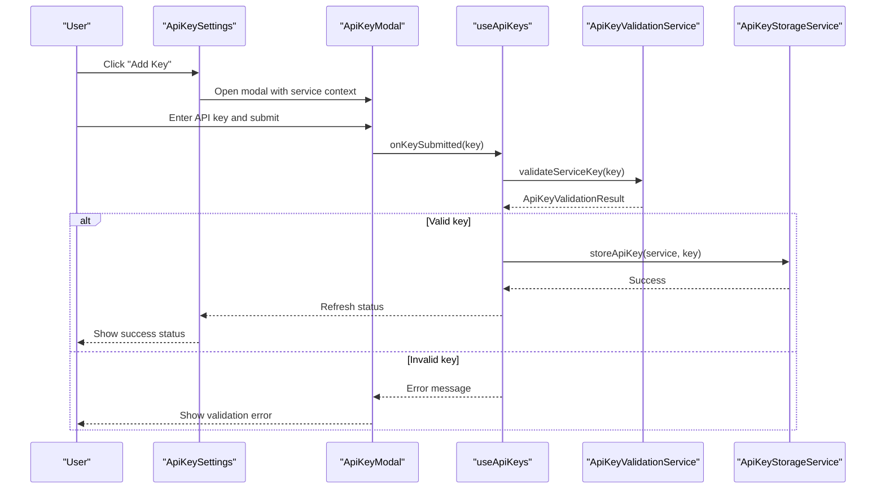
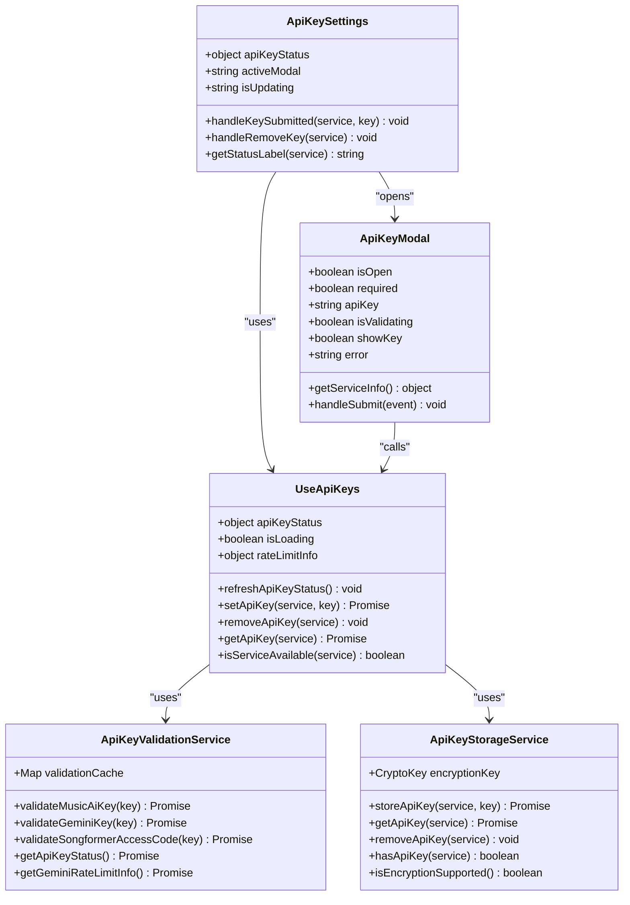

# Settings and Configuration Components

<cite>
**Referenced Files in This Document**
- [ApiKeyModal.tsx](file://src/components/settings/ApiKeyModal.tsx)
- [ApiKeySettings.tsx](file://src/components/settings/ApiKeySettings.tsx)
- [useApiKeys.ts](file://src/hooks/settings/useApiKeys.ts)
- [apiKeyValidationService.ts](file://src/services/api/apiKeyValidationService.ts)
- [apiKeyStorageService.ts](file://src/services/cache/apiKeyStorageService.ts)
- [apiKeyTypes.ts](file://src/types/apiKeyTypes.ts)
- [apiKeyUtils.ts](file://src/utils/apiKeyUtils.ts)
- [settings/page.tsx](file://src/app/settings/page.tsx)
- [firebase.ts](file://src/config/firebase.ts)
- [firebaseService.ts](file://src/services/firebase/firebaseService.ts)
</cite>

## Table of Contents
1. [Introduction](#introduction)
2. [Project Structure](#project-structure)
3. [Core Components](#core-components)
4. [Architecture Overview](#architecture-overview)
5. [Detailed Component Analysis](#detailed-component-analysis)
6. [Dependency Analysis](#dependency-analysis)
7. [Performance Considerations](#performance-considerations)
8. [Troubleshooting Guide](#troubleshooting-guide)
9. [Conclusion](#conclusion)

## Introduction
This document provides comprehensive documentation for the settings and configuration components focused on API key management and secure credential storage. It covers the ApiKeyModal and ApiKeySettings components, their integration with Firebase authentication, configuration persistence, validation mechanisms, and error handling patterns. The documentation explains the component architecture for managing sensitive configuration data, including user interface patterns, validation workflows, and user experience considerations.

## Project Structure
The settings and configuration system is organized around three primary layers:
- UI Components: ApiKeyModal and ApiKeySettings provide the user interface for adding, updating, and removing API keys.
- Hook Layer: useApiKeys centralizes API key management logic, including validation, storage, and availability checks.
- Service Layer: apiKeyValidationService handles remote validation of API keys, while apiKeyStorageService manages secure local encryption and persistence.

**Diagram sources**
- [settings/page.tsx:12-190](file://src/app/settings/page.tsx#L12-L190)
- [ApiKeySettings.tsx:10-263](file://src/components/settings/ApiKeySettings.tsx#L10-L263)
- [ApiKeyModal.tsx:10-308](file://src/components/settings/ApiKeyModal.tsx#L10-L308)
- [useApiKeys.ts:16-209](file://src/hooks/settings/useApiKeys.ts#L16-L209)
- [apiKeyValidationService.ts:15-300](file://src/services/api/apiKeyValidationService.ts#L15-L300)
- [apiKeyStorageService.ts:13-302](file://src/services/cache/apiKeyStorageService.ts#L13-L302)
- [apiKeyTypes.ts:6-110](file://src/types/apiKeyTypes.ts#L6-L110)

**Section sources**
- [settings/page.tsx:12-190](file://src/app/settings/page.tsx#L12-L190)
- [ApiKeySettings.tsx:10-263](file://src/components/settings/ApiKeySettings.tsx#L10-L263)
- [ApiKeyModal.tsx:10-308](file://src/components/settings/ApiKeyModal.tsx#L10-L308)
- [useApiKeys.ts:16-209](file://src/hooks/settings/useApiKeys.ts#L16-L209)
- [apiKeyValidationService.ts:15-300](file://src/services/api/apiKeyValidationService.ts#L15-L300)
- [apiKeyStorageService.ts:13-302](file://src/services/cache/apiKeyStorageService.ts#L13-L302)
- [apiKeyTypes.ts:6-110](file://src/types/apiKeyTypes.ts#L6-L110)

## Core Components
This section documents the two primary components responsible for API key management and configuration.

### ApiKeyModal Component
The ApiKeyModal provides a reusable modal interface for collecting and validating API keys. It supports three services: Music.ai, Gemini, and SongFormer access code. The component:
- Accepts service type, required flag, and callback for submission.
- Manages local state for API key input, validation status, visibility toggle, and error messages.
- Implements service-specific UI and messaging, including help links and usage tips.
- Integrates with the parent component via onKeySubmitted callback.

Key behaviors:
- Input validation prevents empty submissions and displays service-specific error messages.
- Uses ThemeContext for dynamic theming and responsive UI.
- Supports optional required mode for mandatory credentials.
- Displays service-specific help URLs and usage guidance.

**Section sources**
- [ApiKeyModal.tsx:10-308](file://src/components/settings/ApiKeyModal.tsx#L10-L308)

### ApiKeySettings Component
The ApiKeySettings component presents a consolidated view of API key configuration across all supported services. It:
- Displays status indicators for each service (valid/invalid/not configured).
- Provides action buttons to add/update/remove keys.
- Shows service-specific guidance and warnings (e.g., required workflow setup for Music.ai).
- Integrates with Heroui components for cards, chips, buttons, and progress bars.
- Includes quota visualization for Gemini translation usage.

User experience features:
- Status dots clearly indicate configuration validity.
- Warning banners guide users on prerequisites (e.g., required workflows).
- Progress bars visualize quota usage with color-coded thresholds.
- Help links direct users to official documentation and workflow setup.

**Section sources**
- [ApiKeySettings.tsx:10-263](file://src/components/settings/ApiKeySettings.tsx#L10-L263)

## Architecture Overview
The API key management architecture follows a layered pattern with clear separation of concerns:
- UI Layer: Components render forms, manage user interactions, and display status.
- Hook Layer: useApiKeys encapsulates business logic for validation, storage, and availability checks.
- Service Layer: Validation and storage services handle remote verification and secure persistence.
- Type System: Strongly typed interfaces define data structures and validation results.

**Diagram sources**
- [ApiKeySettings.tsx:17-34](file://src/components/settings/ApiKeySettings.tsx#L17-L34)
- [ApiKeyModal.tsx:38-60](file://src/components/settings/ApiKeyModal.tsx#L38-L60)
- [useApiKeys.ts:50-75](file://src/hooks/settings/useApiKeys.ts#L50-L75)
- [apiKeyValidationService.ts:32-65](file://src/services/api/apiKeyValidationService.ts#L32-L65)
- [apiKeyStorageService.ts:158-181](file://src/services/cache/apiKeyStorageService.ts#L158-L181)

## Detailed Component Analysis

### ApiKeyModal Implementation Details
The modal component implements a robust form with the following patterns:
- Controlled input state with useState for API key, validation status, and visibility.
- Effect hooks to reset state on open/close and propagate external error updates.
- Service-specific configuration mapping for UI customization and messaging.
- Accessibility-compliant form controls with proper labeling and keyboard navigation.

Validation and error handling:
- Prevents submission of empty keys with service-specific error messages.
- Displays validation errors returned from the validation service.
- Shows loading state during validation with spinner animation.
- Disables form controls during asynchronous operations.

Security considerations:
- Password masking with show/hide toggle.
- Client-side encryption prevents key transmission to servers.
- Secure storage using Web Crypto API AES-GCM encryption.

**Section sources**
- [ApiKeyModal.tsx:18-60](file://src/components/settings/ApiKeyModal.tsx#L18-L60)
- [ApiKeyModal.tsx:62-121](file://src/components/settings/ApiKeyModal.tsx#L62-L121)
- [ApiKeyModal.tsx:185-286](file://src/components/settings/ApiKeyModal.tsx#L185-L286)

### ApiKeySettings Implementation Details
The settings component orchestrates multiple services with unified status management:
- Status dot indicators provide immediate visual feedback on key validity.
- Action buttons conditionally render based on current configuration state.
- Warning banners communicate prerequisites and setup requirements.
- Progress bars visualize quota usage for Gemini with threshold-based coloring.

Integration patterns:
- Uses Heroui components for consistent UI/UX across services.
- Implements responsive layouts with card-based design.
- Provides contextual help links to official documentation and workflow setup.

**Section sources**
- [ApiKeySettings.tsx:36-47](file://src/components/settings/ApiKeySettings.tsx#L36-L47)
- [ApiKeySettings.tsx:49-54](file://src/components/settings/ApiKeySettings.tsx#L49-L54)
- [ApiKeySettings.tsx:62-126](file://src/components/settings/ApiKeySettings.tsx#L62-L126)
- [ApiKeySettings.tsx:179-246](file://src/components/settings/ApiKeySettings.tsx#L179-L246)

### useApiKeys Hook Deep Dive
The useApiKeys hook centralizes API key management logic with the following capabilities:
- Initial status loading with loading state management.
- Validation orchestration across multiple services with caching.
- Storage operations with encryption and metadata tracking.
- Availability determination based on environment and configuration.
- Rate limit monitoring for Gemini quota usage.

Key functions:
- refreshApiKeyStatus: Loads current status from storage and validates keys.
- setApiKey: Validates and securely stores API keys.
- removeApiKey: Removes stored keys and refreshes status.
- getApiKey: Retrieves decrypted API keys for service calls.
- isServiceAvailable: Determines service availability with environment awareness.
- requiresApiKey: Checks service requirements with fallback logic.

**Section sources**
- [useApiKeys.ts:25-48](file://src/hooks/settings/useApiKeys.ts#L25-L48)
- [useApiKeys.ts:50-81](file://src/hooks/settings/useApiKeys.ts#L50-L81)
- [useApiKeys.ts:88-116](file://src/hooks/settings/useApiKeys.ts#L88-L116)
- [useApiKeys.ts:120-158](file://src/hooks/settings/useApiKeys.ts#L120-L158)

### API Key Validation Service
The validation service provides centralized key verification with caching:
- Remote validation via dedicated endpoints for each service.
- Caching mechanism to reduce repeated validation calls.
- Quota information retrieval for Gemini with reset time tracking.
- Error handling with fallback results for network failures.

Validation endpoints:
- Music.ai key validation via POST to /api/validate-music-ai-key.
- Gemini key validation via POST to /api/validate-gemini-key.
- SongFormer access code validation via POST to /api/validate-songformer-access-code.

**Section sources**
- [apiKeyValidationService.ts:32-65](file://src/services/api/apiKeyValidationService.ts#L32-L65)
- [apiKeyValidationService.ts:70-103](file://src/services/api/apiKeyValidationService.ts#L70-L103)
- [apiKeyValidationService.ts:108-140](file://src/services/api/apiKeyValidationService.ts#L108-L140)
- [apiKeyValidationService.ts:145-212](file://src/services/api/apiKeyValidationService.ts#L145-L212)

### Secure API Key Storage
The storage service implements robust encryption and persistence:
- Web Crypto API AES-GCM encryption with random IV and salt.
- PBKDF2 key derivation with configurable iterations.
- Browser-specific encryption key binding for enhanced security.
- Metadata tracking for quick existence checks without decryption.

Storage keys:
- Music.ai: chord_app_music_ai_key
- Gemini: chord_app_gemini_key
- SongFormer access: chord_app_songformer_access_code
- Encryption salt: chord_app_key_salt_meta

**Section sources**
- [apiKeyStorageService.ts:46-94](file://src/services/cache/apiKeyStorageService.ts#L46-L94)
- [apiKeyStorageService.ts:99-140](file://src/services/cache/apiKeyStorageService.ts#L99-L140)
- [apiKeyStorageService.ts:158-181](file://src/services/cache/apiKeyStorageService.ts#L158-L181)
- [apiKeyStorageService.ts:186-207](file://src/services/cache/apiKeyStorageService.ts#L186-L207)
- [apiKeyStorageService.ts:212-230](file://src/services/cache/apiKeyStorageService.ts#L212-L230)

### Settings Page Integration
The settings page integrates the API key components with:
- Theme management via ThemeContext.
- useApiKeys hook for state and actions.
- Conditional rendering based on encryption support.
- Tabbed interface for organizing settings categories.

User flow:
- Loads initial API key status on mount.
- Handles key updates with validation and error propagation.
- Displays loading states during asynchronous operations.
- Provides privacy and general settings alongside API key configuration.

**Section sources**
- [settings/page.tsx:12-38](file://src/app/settings/page.tsx#L12-L38)
- [settings/page.tsx:40-57](file://src/app/settings/page.tsx#L40-L57)
- [settings/page.tsx:117-146](file://src/app/settings/page.tsx#L117-L146)

## Dependency Analysis
The API key management system exhibits strong modularity with clear dependency relationships:

**Diagram sources**
- [ApiKeyModal.tsx:10-308](file://src/components/settings/ApiKeyModal.tsx#L10-L308)
- [ApiKeySettings.tsx:10-263](file://src/components/settings/ApiKeySettings.tsx#L10-L263)
- [useApiKeys.ts:16-209](file://src/hooks/settings/useApiKeys.ts#L16-L209)
- [apiKeyValidationService.ts:15-300](file://src/services/api/apiKeyValidationService.ts#L15-L300)
- [apiKeyStorageService.ts:13-302](file://src/services/cache/apiKeyStorageService.ts#L13-L302)

**Section sources**
- [apiKeyTypes.ts:6-110](file://src/types/apiKeyTypes.ts#L6-L110)
- [apiKeyValidationService.ts:15-300](file://src/services/api/apiKeyValidationService.ts#L15-L300)
- [apiKeyStorageService.ts:13-302](file://src/services/cache/apiKeyStorageService.ts#L13-L302)

## Performance Considerations
The system implements several performance optimizations:
- Validation caching reduces redundant network calls with 5-minute TTL.
- Asynchronous loading prevents UI blocking during initial status retrieval.
- Conditional rendering minimizes DOM updates when switching tabs.
- Efficient encryption using Web Crypto API for optimal browser performance.
- Environment-aware service availability to avoid unnecessary validations.

Best practices:
- Leverage caching for frequently accessed validation results.
- Implement lazy loading for heavy components.
- Use debounced input for real-time validation feedback.
- Monitor quota usage to avoid rate limit penalties.

## Troubleshooting Guide
Common issues and resolutions:

### Encryption Support Issues
- Symptom: "Encryption Not Supported" message on settings page.
- Cause: Browser lacks Web Crypto API support.
- Resolution: Use a modern browser with Web Crypto API support.

### API Key Validation Failures
- Symptom: Validation errors when submitting API keys.
- Causes: Invalid key format, network connectivity issues, service downtime.
- Resolutions:
  - Verify key format matches service requirements.
  - Check network connectivity and service status.
  - Review service-specific documentation for key requirements.

### Service Availability Problems
- Symptom: Services appear unavailable despite valid keys.
- Causes: Environment-specific restrictions, quota exhaustion, service limitations.
- Resolutions:
  - Check NODE_ENV impact on service requirements.
  - Monitor Gemini quota usage and reset times.
  - Verify service-specific prerequisites (e.g., Music.ai workflow setup).

### Storage and Persistence Issues
- Symptom: API keys not persisting between sessions.
- Causes: Browser storage limitations, encryption key issues.
- Resolutions:
  - Clear browser cache and cookies.
  - Verify localStorage availability.
  - Check browser privacy settings affecting storage.

**Section sources**
- [settings/page.tsx:40-57](file://src/app/settings/page.tsx#L40-L57)
- [apiKeyValidationService.ts:268-296](file://src/services/api/apiKeyValidationService.ts#L268-L296)
- [apiKeyStorageService.ts:293-298](file://src/services/cache/apiKeyStorageService.ts#L293-L298)

## Conclusion
The settings and configuration components provide a comprehensive, secure, and user-friendly solution for managing API keys and sensitive configuration data. The architecture balances security with usability through client-side encryption, clear validation feedback, and intuitive UI patterns. The modular design enables easy extension to additional services while maintaining consistent user experience and robust error handling.

The system successfully integrates with Firebase for authentication and storage while keeping sensitive data encrypted and private. The use of hooks, services, and typed interfaces ensures maintainability and reliability across different deployment environments.