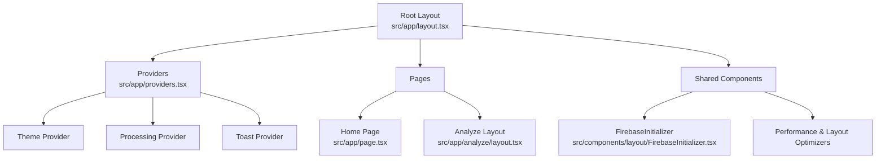
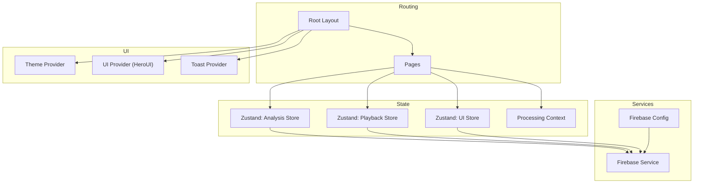
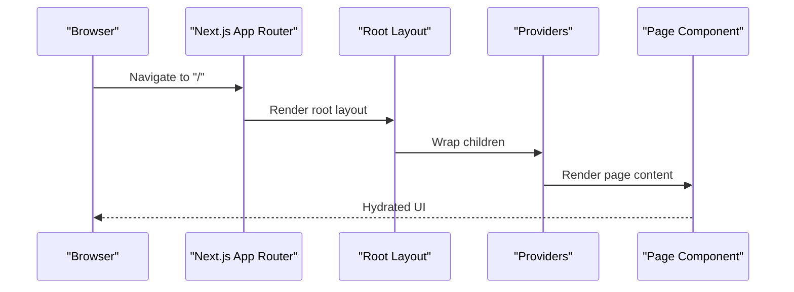
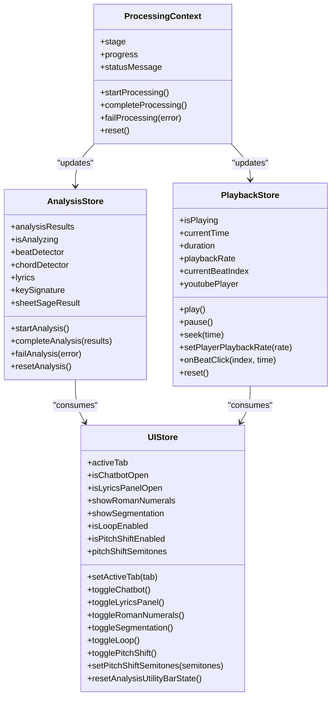
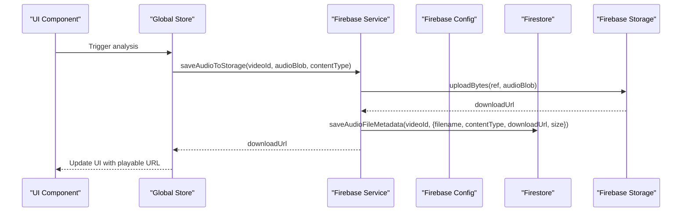
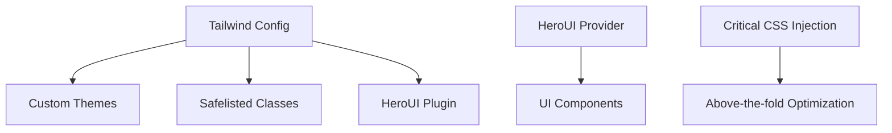
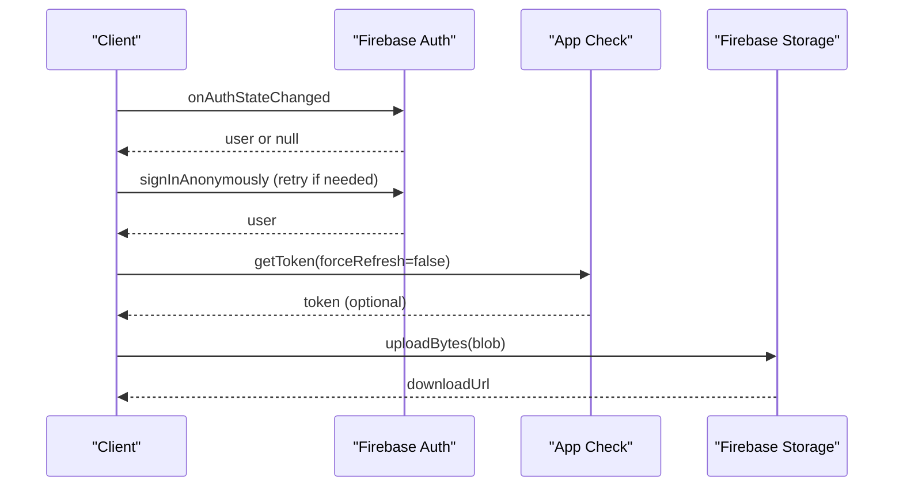
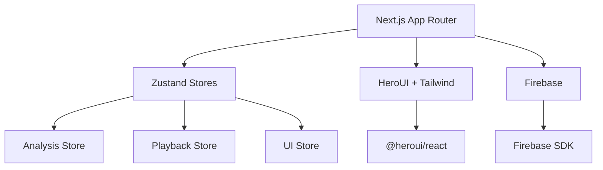

# Frontend Application

<cite>
**Referenced Files in This Document**
- [layout.tsx](file://src/app/layout.tsx)
- [providers.tsx](file://src/app/providers.tsx)
- [next.config.js](file://next.config.js)
- [package.json](file://package.json)
- [tailwind.config.js](file://tailwind.config.js)
- [page.tsx](file://src/app/page.tsx)
- [analyze/layout.tsx](file://src/app/analyze/layout.tsx)
- [analysisStore.ts](file://src/stores/analysisStore.ts)
- [playbackStore.ts](file://src/stores/playbackStore.ts)
- [uiStore.ts](file://src/stores/uiStore.ts)
- [firebaseService.ts](file://src/services/firebase/firebaseService.ts)
- [firebase.ts](file://src/config/firebase.ts)
- [useFirebaseReadiness.ts](file://src/hooks/firebase/useFirebaseReadiness.ts)
- [FirebaseInitializer.tsx](file://src/components/layout/FirebaseInitializer.tsx)
- [ProcessingContext.tsx](file://src/contexts/ProcessingContext.tsx)
</cite>

## Table of Contents
1. [Introduction](#introduction)
2. [Project Structure](#project-structure)
3. [Core Components](#core-components)
4. [Architecture Overview](#architecture-overview)
5. [Detailed Component Analysis](#detailed-component-analysis)
6. [Dependency Analysis](#dependency-analysis)
7. [Performance Considerations](#performance-considerations)
8. [Troubleshooting Guide](#troubleshooting-guide)
9. [Conclusion](#conclusion)
10. [Appendices](#appendices)

## Introduction
This document describes the ChordMiniApp frontend application built with Next.js App Router. It explains the routing strategy, component architecture, state management with global stores and React hooks, service layer for API integration and caching, UI component library, styling architecture, Firebase integration for authentication and storage, performance optimizations, SEO configuration, and progressive web app features. It also covers responsive design and accessibility considerations, along with practical usage patterns for components and services.

## Project Structure
The application follows Next.js App Router conventions with a strict separation of pages, layouts, and shared components. The root layout defines metadata, fonts, critical CSS, and providers for global state and UI. Providers wrap the app with theme, processing, and toast support. The app exposes a homepage and nested analysis routes with dedicated metadata and layout containers.

**Diagram sources**
- [layout.tsx:143-228](file://src/app/layout.tsx#L143-L228)
- [providers.tsx:12-27](file://src/app/providers.tsx#L12-L27)
- [page.tsx:1-6](file://src/app/page.tsx#L1-L6)
- [analyze/layout.tsx:6-16](file://src/app/analyze/layout.tsx#L6-L16)
- [FirebaseInitializer.tsx:12-61](file://src/components/layout/FirebaseInitializer.tsx#L12-L61)

**Section sources**
- [layout.tsx:143-228](file://src/app/layout.tsx#L143-L228)
- [providers.tsx:12-27](file://src/app/providers.tsx#L12-L27)
- [page.tsx:1-6](file://src/app/page.tsx#L1-L6)
- [analyze/layout.tsx:6-16](file://src/app/analyze/layout.tsx#L6-L16)

## Core Components
- Root layout and metadata: Defines Open Graph, Twitter, icons, robots directives, and critical CSS injection for performance and hydration safety.
- Providers: Compose UI framework provider, toast notifications, processing context, and theme context.
- Stores: Global state via Zustand for analysis, playback, and UI features with selector hooks for optimized re-renders.
- Firebase integration: Runtime configuration loader, lazy initialization, anonymous auth with retries, and storage APIs for audio and lyrics caching.
- Processing context: Centralized processing stages, progress, and elapsed time for long-running tasks.

**Section sources**
- [layout.tsx:45-140](file://src/app/layout.tsx#L45-L140)
- [providers.tsx:12-27](file://src/app/providers.tsx#L12-L27)
- [analysisStore.ts:101-295](file://src/stores/analysisStore.ts#L101-L295)
- [playbackStore.ts:101-451](file://src/stores/playbackStore.ts#L101-L451)
- [uiStore.ts:127-433](file://src/stores/uiStore.ts#L127-L433)
- [firebase.ts:43-115](file://src/config/firebase.ts#L43-L115)
- [ProcessingContext.tsx:44-184](file://src/contexts/ProcessingContext.tsx#L44-L184)

## Architecture Overview
The frontend uses a layered architecture:
- Routing and Pages: Next.js App Router with metadata and layout composition.
- State Management: Global stores (Zustand) for analysis, playback, and UI state; React Context for processing lifecycle; TanStack Query for shared server-state reads.
- Services: API orchestration via services, query-backed read fetchers, and simplified Firebase helpers for caching and storage.
- UI Layer: HeroUI React components integrated with Tailwind-based theme.
- Infrastructure: Firebase for anonymous auth, storage, and Firestore caching; runtime configuration for Docker compatibility.

**Diagram sources**
- [layout.tsx:143-228](file://src/app/layout.tsx#L143-L228)
- [providers.tsx:12-31](file://src/app/providers.tsx#L12-L31)
- [analysisStore.ts:101-295](file://src/stores/analysisStore.ts#L101-L295)
- [playbackStore.ts:101-451](file://src/stores/playbackStore.ts#L101-L451)
- [uiStore.ts:127-433](file://src/stores/uiStore.ts#L127-L433)
- [firebaseService.ts:34-153](file://src/services/firebase/firebaseService.ts#L34-L153)
- [firebase.ts:43-115](file://src/config/firebase.ts#L43-L115)

## Detailed Component Analysis

### App Router and Dynamic Routing Strategy
- Root layout sets metadata, fonts, icons, and robots directives. It injects critical CSS and performance-related head tags.
- Pages:
  - Home page renders the new homepage content component.
  - Analyze layout provides page-specific metadata and a layout wrapper for analysis views.
- Dynamic routing:
  - The analyze route includes a dynamic segment for video ID, enabling per-video analysis pages under the analyze route group.

**Diagram sources**
- [layout.tsx:143-228](file://src/app/layout.tsx#L143-L228)
- [page.tsx:1-6](file://src/app/page.tsx#L1-L6)

**Section sources**
- [layout.tsx:45-140](file://src/app/layout.tsx#L45-L140)
- [page.tsx:1-6](file://src/app/page.tsx#L1-L6)
- [analyze/layout.tsx:1-17](file://src/app/analyze/layout.tsx#L1-L17)

### State Management with Global Stores and React Hooks
- Analysis Store: Manages analysis results, model selection, cache state, lyrics, key signature, corrections, and SheetSage integration. Includes action and selector hooks for granular updates.
- Playback Store: Centralizes audio/video playback state, rate control, beat indices, and seek coordination with a master clock and pitch shift service.
- UI Store: Controls tabs, panels, editing modes, feature toggles (roman numerals, segmentation, simplification), loop playback, pitch shift, and guitar voicing selections.
- Processing Context: Provides stage tracking, progress, and elapsed time for long-running operations.

**Diagram sources**
- [analysisStore.ts:14-99](file://src/stores/analysisStore.ts#L14-L99)
- [playbackStore.ts:35-99](file://src/stores/playbackStore.ts#L35-L99)
- [uiStore.ts:30-125](file://src/stores/uiStore.ts#L30-L125)
- [ProcessingContext.tsx:14-28](file://src/contexts/ProcessingContext.tsx#L14-L28)

**Section sources**
- [analysisStore.ts:101-367](file://src/stores/analysisStore.ts#L101-L367)
- [playbackStore.ts:101-513](file://src/stores/playbackStore.ts#L101-L513)
- [uiStore.ts:127-517](file://src/stores/uiStore.ts#L127-L517)
- [ProcessingContext.tsx:44-184](file://src/contexts/ProcessingContext.tsx#L44-L184)

### Service Layer Architecture for API Integration, Error Handling, and Caching
- Firebase Service:
  - Saves and retrieves lyrics from Firestore (public cache).
  - Retrieves audio metadata and uploads audio blobs to Firebase Storage, returning download URLs and persisting metadata.
- Firebase Config:
  - Loads runtime configuration from a backend endpoint for client-side or from environment variables for server-side.
  - Initializes Firebase lazily, sets up App Check with reCAPTCHA v3, anonymous auth with retry logic, and persistence.
  - Provides helpers to ensure initialization and obtain tokens for API requests.
- Hook and Component:
  - useFirebaseReadiness monitors readiness and retries initialization.
  - FirebaseInitializer preloads Firebase on mount and initializes non-critical collections.

**Diagram sources**
- [firebaseService.ts:132-153](file://src/services/firebase/firebaseService.ts#L132-L153)
- [firebase.ts:43-115](file://src/config/firebase.ts#L43-L115)

**Section sources**
- [firebaseService.ts:34-153](file://src/services/firebase/firebaseService.ts#L34-L153)
- [firebase.ts:43-115](file://src/config/firebase.ts#L43-L115)
- [useFirebaseReadiness.ts:9-60](file://src/hooks/firebase/useFirebaseReadiness.ts#L9-L60)
- [FirebaseInitializer.tsx:12-61](file://src/components/layout/FirebaseInitializer.tsx#L12-L61)

### UI Component Library and Styling Architecture
- HeroUI React: Provided via the UI provider for consistent components and theming.
- Tailwind CSS: Configured with custom dark/light theme variants, safelisted grid columns, and HeroUI plugin integration.
- Fonts: Google Fonts configured for brand sans, mono, and chord label families with display swapping for fast rendering.
- Critical CSS: Inlined critical above-the-fold styles to minimize render-blocking and improve CLS.

**Diagram sources**
- [tailwind.config.js:11-193](file://tailwind.config.js#L11-L193)
- [providers.tsx:14-25](file://src/app/providers.tsx#L14-L25)
- [layout.tsx:162-188](file://src/app/layout.tsx#L162-L188)

**Section sources**
- [tailwind.config.js:11-193](file://tailwind.config.js#L11-L193)
- [providers.tsx:14-25](file://src/app/providers.tsx#L14-L25)
- [layout.tsx:162-188](file://src/app/layout.tsx#L162-L188)

### Integration with Firebase for Authentication and Data Storage
- Anonymous Authentication: Setup with persistence and retry logic to handle cold starts and network issues.
- App Check: Optional reCAPTCHA v3 integration for client-side protection.
- Storage and Caching: Public caching of lyrics and metadata for audio files; upload pipeline returns signed URLs for playback.

**Diagram sources**
- [firebase.ts:148-252](file://src/config/firebase.ts#L148-L252)
- [firebase.ts:475-514](file://src/config/firebase.ts#L475-L514)
- [firebaseService.ts:132-153](file://src/services/firebase/firebaseService.ts#L132-L153)

**Section sources**
- [firebase.ts:148-252](file://src/config/firebase.ts#L148-L252)
- [firebase.ts:475-514](file://src/config/firebase.ts#L475-L514)
- [firebaseService.ts:34-153](file://src/services/firebase/firebaseService.ts#L34-L153)

### Performance Optimization Techniques
- Next.js configuration:
  - Standalone output for Docker, optimized package imports, and Webpack splitChunks targeting audio, UI, and state libraries.
  - Hidden source maps in production, compression, and ETags.
- Bundle analysis and tree shaking: Enabled via environment flag; usedExports and concatenateModules for smaller bundles.
- Critical CSS and fonts: Inlined critical styles and font-display swap to reduce CLS and FOUC.
- DNS prefetch and manifest: Prefetch external domains and register PWA manifest.
- Layout and hydration: Hydration guard and theme-ready class to prevent flash and layout shifts.

**Section sources**
- [next.config.js:42-381](file://next.config.js#L42-L381)
- [layout.tsx:152-208](file://src/app/layout.tsx#L152-L208)

### SEO Configuration
- Metadata: Title template, description, keywords, author, publisher, category, classification, and canonical.
- Open Graph and Twitter cards: Structured social media previews.
- Robots directives: Index/follow policies and snippet/image preferences.
- Icons and manifest: Favicon, webp icons, Apple touch icon, and manifest for PWA.

**Section sources**
- [layout.tsx:45-140](file://src/app/layout.tsx#L45-L140)

### Progressive Web App Features
- Manifest registration: Link tag in head registers the PWA manifest.
- Service Worker registration: Dedicated component mounts and registers SW for offline and installability support.

**Section sources**
- [layout.tsx:196-197](file://src/app/layout.tsx#L196-L197)
- [layout.tsx:214-214](file://src/app/layout.tsx#L214-L214)

### Responsive Design and Accessibility Considerations
- Responsive layout: Flex utilities and grid classes enable adaptive layouts across breakpoints.
- Accessibility: Semantic HTML, focus management, and ARIA-compliant components via HeroUI; ensure custom components maintain accessible roles and labels.

[No sources needed since this section provides general guidance]

## Dependency Analysis
- External dependencies include HeroUI, Firebase, Tone.js, Chart.js, and others for audio, visualization, and UI.
- Next.js configuration optimizes bundling and imports for modern browsers, with explicit rules for audio files and external packages.
- Tailwind integrates with HeroUI themes for consistent design tokens across light/dark modes.

**Diagram sources**
- [package.json:37-88](file://package.json#L37-L88)
- [next.config.js:90-94](file://next.config.js#L90-L94)
- [tailwind.config.js:83-192](file://tailwind.config.js#L83-L192)

**Section sources**
- [package.json:37-88](file://package.json#L37-L88)
- [next.config.js:90-94](file://next.config.js#L90-L94)
- [tailwind.config.js:83-192](file://tailwind.config.js#L83-L192)

## Performance Considerations
- Bundle size: SplitChunks groups vendor libraries by domain (audio, UI, state) and consolidates Firebase and charting libraries.
- Tree shaking: Side effects disabled and usedExports enabled to eliminate dead code.
- Source maps: Hidden source maps in production to avoid exposing source while keeping debugging capability.
- Critical rendering: Critical CSS and font-display swap reduce layout shifts and improve LCP/CLS.
- Network: App Check and CORS headers support secure cross-origin requests to YouTube and external APIs.

[No sources needed since this section provides general guidance]

## Troubleshooting Guide
- Firebase initialization failures:
  - Ensure runtime configuration is available and required keys are present.
  - Use readiness hook to monitor and retry initialization.
- Anonymous auth cold starts:
  - The setup includes retry logic and extended timeouts; verify network connectivity and error logs.
- Processing state not updating:
  - Confirm ProcessingContext is wrapped around the relevant components and stage transitions are invoked.
- Playback rate mismatches:
  - The store snaps requested rates to YouTube’s supported set and verifies the effective rate asynchronously.

**Section sources**
- [firebase.ts:43-115](file://src/config/firebase.ts#L43-L115)
- [useFirebaseReadiness.ts:9-60](file://src/hooks/firebase/useFirebaseReadiness.ts#L9-L60)
- [firebase.ts:148-252](file://src/config/firebase.ts#L148-L252)
- [ProcessingContext.tsx:111-134](file://src/contexts/ProcessingContext.tsx#L111-L134)
- [playbackStore.ts:216-350](file://src/stores/playbackStore.ts#L216-L350)

## Conclusion
ChordMiniApp’s frontend leverages Next.js App Router for structured routing, global Zustand stores for state, HeroUI/Tailwind for UI and styling, and Firebase for authentication and caching. The architecture emphasizes performance (critical CSS, optimized bundles, App Check), robustness (retry logic, error boundaries), and user experience (responsive design, accessibility). The service layer cleanly abstracts API and storage concerns, while the layout and providers ensure consistent behavior across pages.

## Appendices
- Example usage patterns:
  - Use selector hooks from stores to subscribe to minimal state slices.
  - Wrap pages with Providers to ensure theme, toasts, and processing context are available.
  - Initialize Firebase early via FirebaseInitializer and use readiness hooks for guarded rendering.
  - Integrate playback controls with the Playback Store and coordinate with YouTube player and pitch shift services.

[No sources needed since this section provides general guidance]
