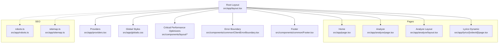
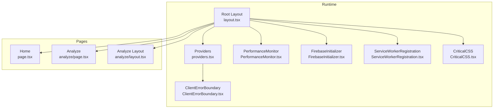
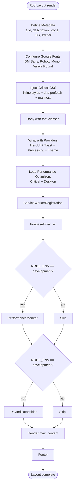
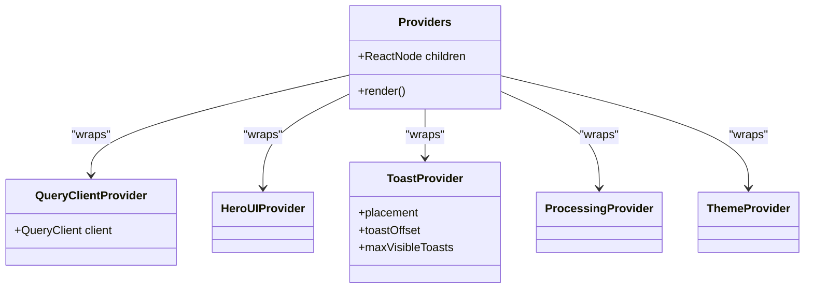
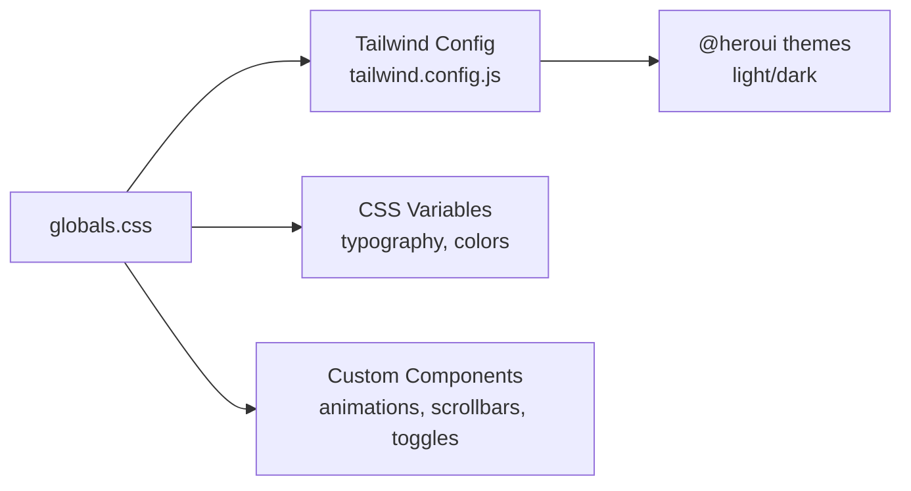
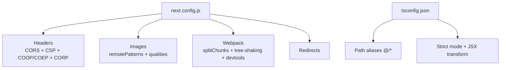
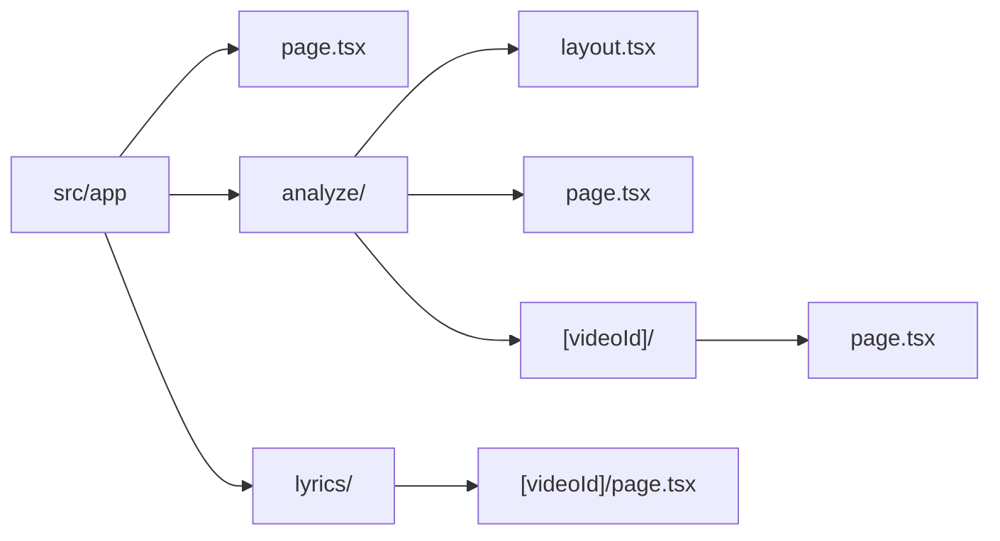
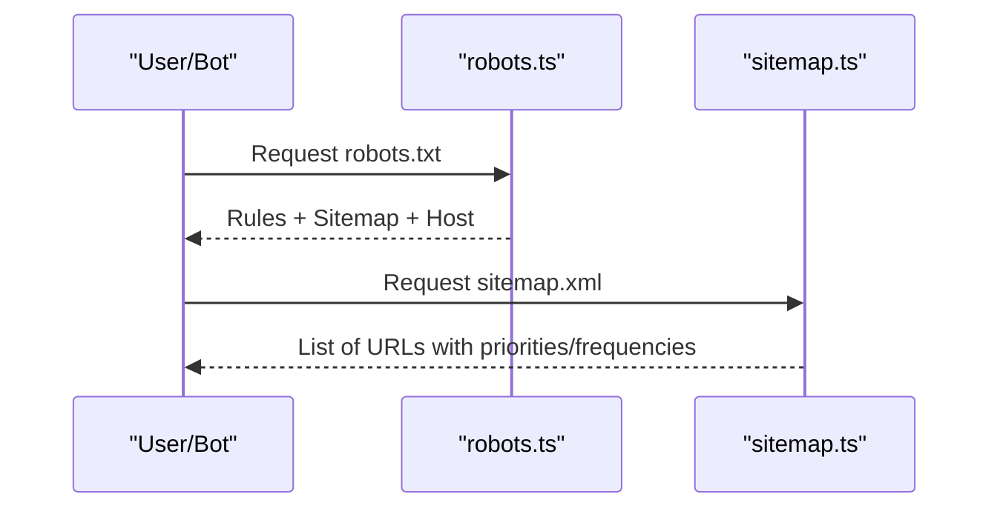
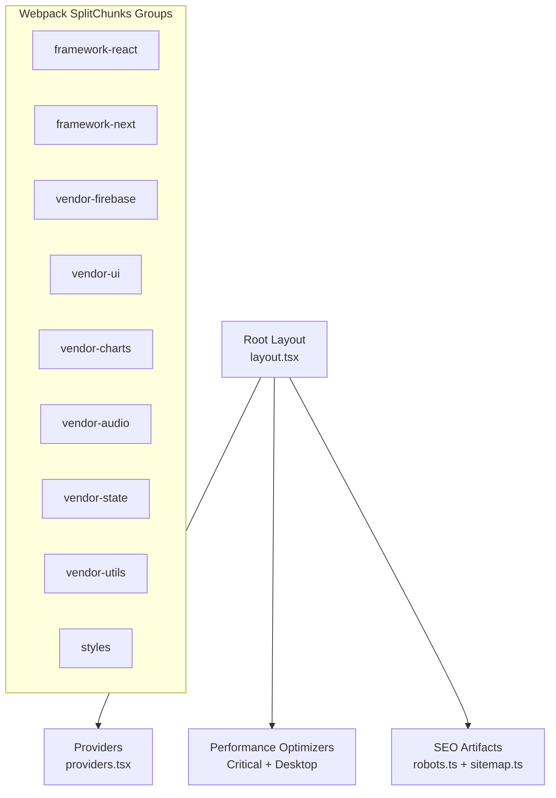

# Next.js Application Architecture

<cite>
**Referenced Files in This Document**
- [next.config.js](file://next.config.js)
- [layout.tsx](file://src/app/layout.tsx)
- [providers.tsx](file://src/app/providers.tsx)
- [globals.css](file://src/app/globals.css)
- [tailwind.config.js](file://tailwind.config.js)
- [tsconfig.json](file://tsconfig.json)
- [page.tsx](file://src/app/page.tsx)
- [analyze/layout.tsx](file://src/app/analyze/layout.tsx)
- [robots.ts](file://src/app/robots.ts)
- [sitemap.ts](file://src/app/sitemap.ts)
- [analyze/page.tsx](file://src/app/analyze/page.tsx)
</cite>

## Table of Contents
1. [Introduction](#introduction)
2. [Project Structure](#project-structure)
3. [Core Components](#core-components)
4. [Architecture Overview](#architecture-overview)
5. [Detailed Component Analysis](#detailed-component-analysis)
6. [Dependency Analysis](#dependency-analysis)
7. [Performance Considerations](#performance-considerations)
8. [Troubleshooting Guide](#troubleshooting-guide)
9. [Conclusion](#conclusion)
10. [Appendices](#appendices)

## Introduction
This document describes the Next.js application architecture for the ChordMini project. It covers the app router configuration, dynamic routing strategy, page structure, root layout with metadata and performance optimizations, provider system including Firebase initialization, error boundaries, and performance monitoring, global styling with CSS variables and Tailwind CSS, build configuration, TypeScript setup, and environment-specific optimizations. Practical examples are included for routing, metadata management, and performance techniques such as critical CSS and DNS prefetching.

## Project Structure
The application follows Next.js App Router conventions with a strict separation of pages under src/app. Key areas:
- Root layout and metadata configuration
- Providers for UI framework and theme/context
- Global styles and Tailwind configuration
- Dynamic routing for analyze and lyrics pages
- SEO artifacts (robots.txt and sitemap)
- Build and TypeScript configuration

**Diagram sources**
- [layout.tsx:143-228](file://src/app/layout.tsx#L143-L228)
- [providers.tsx:12-31](file://src/app/providers.tsx#L12-L31)
- [globals.css:1-657](file://src/app/globals.css#L1-L657)
- [page.tsx:1-6](file://src/app/page.tsx#L1-L6)
- [analyze/layout.tsx:1-17](file://src/app/analyze/layout.tsx#L1-L17)
- [robots.ts:6-150](file://src/app/robots.ts#L6-L150)
- [sitemap.ts:30-123](file://src/app/sitemap.ts#L30-L123)

**Section sources**
- [layout.tsx:143-228](file://src/app/layout.tsx#L143-L228)
- [page.tsx:1-6](file://src/app/page.tsx#L1-L6)
- [analyze/layout.tsx:1-17](file://src/app/analyze/layout.tsx#L1-L17)
- [robots.ts:6-150](file://src/app/robots.ts#L6-L150)
- [sitemap.ts:30-123](file://src/app/sitemap.ts#L30-L123)

## Core Components
- Root layout: Defines metadata, fonts, critical CSS, DNS prefetch, and composes providers and performance helpers.
- Providers: Wraps the app with UI framework provider, toast provider, processing context, and theme context.
- Global styles: Tailwind base/components/utilities plus custom CSS variables and responsive styles.
- Tailwind config: Extends colors, animations, and integrates @heroui theme.
- TypeScript config: Strict mode, path aliases, and bundler module resolution.
- Build config: Webpack customization, CSP headers, redirects, image optimization, and performance optimizations.

**Section sources**
- [layout.tsx:45-140](file://src/app/layout.tsx#L45-L140)
- [layout.tsx:149-227](file://src/app/layout.tsx#L149-L227)
- [providers.tsx:12-27](file://src/app/providers.tsx#L12-L27)
- [globals.css:1-657](file://src/app/globals.css#L1-L657)
- [tailwind.config.js:11-82](file://tailwind.config.js#L11-L82)
- [tsconfig.json:1-43](file://tsconfig.json#L1-L43)
- [next.config.js:42-381](file://next.config.js#L42-L381)

## Architecture Overview
The runtime architecture centers around the root layout and providers, with dynamic pages leveraging specialized components and services. The build pipeline optimizes bundles, enforces security policies, and prepares assets for production.

**Diagram sources**
- [layout.tsx:149-227](file://src/app/layout.tsx#L149-L227)
- [providers.tsx:12-27](file://src/app/providers.tsx#L12-L27)
- [page.tsx:1-6](file://src/app/page.tsx#L1-L6)
- [analyze/page.tsx:104-120](file://src/app/analyze/page.tsx#L104-L120)

## Detailed Component Analysis

### Root Layout and Metadata
The root layout defines:
- Metadata: title template, description, keywords, author, publisher, icons, Open Graph, Twitter, verification, canonical.
- Fonts: Google Fonts loaded with font-display swap and CSS variables for fallbacks.
- Critical CSS: Inline critical above-the-fold styles to reduce render-blocking.
- Performance: DNS prefetch links for external domains, CriticalCSS component, Critical and Desktop performance optimizers, Service Worker registration, Firebase initializer, and development-only performance monitor and dev indicator hider.
- Providers: HeroUI provider, toast provider, processing provider, theme provider.
- Error boundary: ClientErrorBoundary wraps children to catch client-side errors.
- Footer: Always rendered at the end of main content.

**Diagram sources**
- [layout.tsx:45-140](file://src/app/layout.tsx#L45-L140)
- [layout.tsx:149-227](file://src/app/layout.tsx#L149-L227)

**Section sources**
- [layout.tsx:45-140](file://src/app/layout.tsx#L45-L140)
- [layout.tsx:149-227](file://src/app/layout.tsx#L149-L227)

### Provider System
The Providers component composes:
- TanStack Query client provider for remote/server-state caching, request deduplication, stale-while-revalidate reads, and infinite query pagination.
- HeroUI provider for UI components.
- Toast provider with placement and limits.
- Processing provider for global processing state.
- Theme provider for theme switching and persistence.

**Diagram sources**
- [providers.tsx:12-31](file://src/app/providers.tsx#L12-L31)

**Section sources**
- [providers.tsx:12-31](file://src/app/providers.tsx#L12-L31)

### Global Styling and Tailwind Configuration
- Tailwind base/components/utilities are imported in globals.css.
- CSS variables define typography and dark mode colors.
- Tailwind config extends colors (including dark-bg/content-bg), animations, shadows, border radius, and integrates @heroui theme with light/dark palettes.
- Responsive and accessibility-focused styles for components and layout.

**Diagram sources**
- [globals.css:1-657](file://src/app/globals.css#L1-L657)
- [tailwind.config.js:11-82](file://tailwind.config.js#L11-L82)

**Section sources**
- [globals.css:111-328](file://src/app/globals.css#L111-L328)
- [tailwind.config.js:33-82](file://tailwind.config.js#L33-L82)

### Build Configuration and TypeScript Setup
- Next.js configuration:
  - Standalone output for Docker.
  - Server external packages and transpile packages.
  - Environment variables exposure.
  - Compiler removes console logs in production.
  - Turbopack rules for audio files.
  - Image optimization with remote patterns and quality tiers.
  - Security headers: CORS, CSP, COOP/COEP, CORP.
  - Redirects (e.g., GitHub link).
  - Webpack splitChunks for framework, Next.js, Firebase, UI, Charts, Audio, State, Utils, and styles.
  - Tree shaking and module concatenation.
  - Source maps and devtool configuration.
  - Page extensions and trailing slash.
  - React strict mode and ETags.
  - Compression and TypeScript settings.
- TypeScript configuration:
  - Strict mode, esnext modules, bundler resolution, JSX transform, path aliases.

**Diagram sources**
- [next.config.js:42-381](file://next.config.js#L42-L381)
- [tsconfig.json:1-43](file://tsconfig.json#L1-L43)

**Section sources**
- [next.config.js:42-381](file://next.config.js#L42-L381)
- [tsconfig.json:1-43](file://tsconfig.json#L1-L43)

### Routing Strategy and Dynamic Pages
- Static home page mapped to src/app/page.tsx.
- Analyze page with dynamic route segment [videoId] under src/app/analyze/[videoId].
- Analyze layout under src/app/analyze/layout.tsx defines metadata for analyze routes.
- Lyrics dynamic route under src/app/lyrics/[videoId].

**Diagram sources**
- [page.tsx:1-6](file://src/app/page.tsx#L1-L6)
- [analyze/layout.tsx:1-17](file://src/app/analyze/layout.tsx#L1-L17)
- [analyze/page.tsx:104-120](file://src/app/analyze/page.tsx#L104-L120)

**Section sources**
- [page.tsx:1-6](file://src/app/page.tsx#L1-L6)
- [analyze/layout.tsx:1-17](file://src/app/analyze/layout.tsx#L1-L17)
- [analyze/page.tsx:104-120](file://src/app/analyze/page.tsx#L104-L120)

### Metadata Management and SEO
- robots.txt generator defines allow/disallow rules per user-agent and sitemap/host.
- sitemap generator produces static pages with priorities and frequencies, and dynamic analyze/lyrics entries based on recent video IDs.

**Diagram sources**
- [robots.ts:6-150](file://src/app/robots.ts#L6-L150)
- [sitemap.ts:30-123](file://src/app/sitemap.ts#L30-L123)

**Section sources**
- [robots.ts:6-150](file://src/app/robots.ts#L6-L150)
- [sitemap.ts:30-123](file://src/app/sitemap.ts#L30-L123)

## Dependency Analysis
The build configuration organizes dependencies into cache groups to improve caching and reduce bundle fragmentation. The root layout composes providers and performance helpers that influence the entire application lifecycle.

**Diagram sources**
- [next.config.js:205-282](file://next.config.js#L205-L282)
- [layout.tsx:149-227](file://src/app/layout.tsx#L149-L227)

**Section sources**
- [next.config.js:205-282](file://next.config.js#L205-L282)
- [layout.tsx:149-227](file://src/app/layout.tsx#L149-L227)

## Performance Considerations
- Critical CSS: Inlined critical above-the-fold styles in head to reduce render-blocking.
- DNS prefetch: Pre-resolves external domains for YouTube, Google APIs, and Vercel.
- Bundle splitting: Carefully tuned cache groups for frameworks, Firebase, UI, charts, audio, state, utilities, and styles.
- Tree shaking and module concatenation: Enabled for better dead code elimination and reduced overhead.
- Source maps: Hidden source maps in production with fallback templates for webpack chunks.
- Image optimization: Remote patterns and quality tiers configured.
- Console removal: Removes console logs except error/warn in production.
- React strict mode: Enabled for early detection of unsafe lifecycles.
- Compression and ETags: Enabled for improved caching and transfer efficiency.

**Section sources**
- [layout.tsx:162-207](file://src/app/layout.tsx#L162-L207)
- [next.config.js:198-344](file://next.config.js#L198-L344)
- [next.config.js:59-64](file://next.config.js#L59-L64)
- [next.config.js:352-369](file://next.config.js#L352-L369)

## Troubleshooting Guide
- Client-side errors: Wrapped by ClientErrorBoundary to prevent app crashes and surface user-friendly messages.
- Development overlays: Hidden via DevIndicatorHider in development to avoid UI clutter.
- Firebase readiness: Managed by FirebaseInitializer to ensure services initialize before use.
- Performance monitoring: PerformanceMonitor is conditionally rendered in development to track metrics.
- CORS and CSP: Security headers configured globally to support YouTube embeds and ad networks while maintaining safety.

**Section sources**
- [layout.tsx:211-218](file://src/app/layout.tsx#L211-L218)
- [layout.tsx:149-227](file://src/app/layout.tsx#L149-L227)

## Conclusion
The ChordMini Next.js application employs a robust app router structure with dynamic routing, comprehensive metadata and SEO management, a layered provider system, and extensive performance optimizations. The build configuration and Tailwind setup deliver a scalable, maintainable, and high-performance frontend suitable for media-rich audio analysis workflows.

## Appendices

### Examples Index
- Page routing
  - Home page: [page.tsx:1-6](file://src/app/page.tsx#L1-L6)
  - Analyze page: [analyze/page.tsx:104-120](file://src/app/analyze/page.tsx#L104-L120)
  - Analyze layout: [analyze/layout.tsx:1-17](file://src/app/analyze/layout.tsx#L1-L17)
  - Dynamic lyrics route: [lyrics/[videoId]/page.tsx](file://src/app/lyrics/[videoId]/page.tsx)
- Metadata management
  - Root metadata: [layout.tsx:45-140](file://src/app/layout.tsx#L45-L140)
  - robots.txt: [robots.ts:6-150](file://src/app/robots.ts#L6-L150)
  - sitemap: [sitemap.ts:30-123](file://src/app/sitemap.ts#L30-L123)
- Performance optimization techniques
  - Critical CSS: [layout.tsx:162-188](file://src/app/layout.tsx#L162-L188)
  - DNS prefetch: [layout.tsx:201-205](file://src/app/layout.tsx#L201-L205)
  - Bundle splitting: [next.config.js:205-282](file://next.config.js#L205-L282)
  - Tree shaking and concatenation: [next.config.js:284-290](file://next.config.js#L284-L290)
  - Source maps: [next.config.js:292-303](file://next.config.js#L292-L303)
  - Image optimization: [next.config.js:96-125](file://next.config.js#L96-L125)
  - Console removal: [next.config.js:61-63](file://next.config.js#L61-L63)
